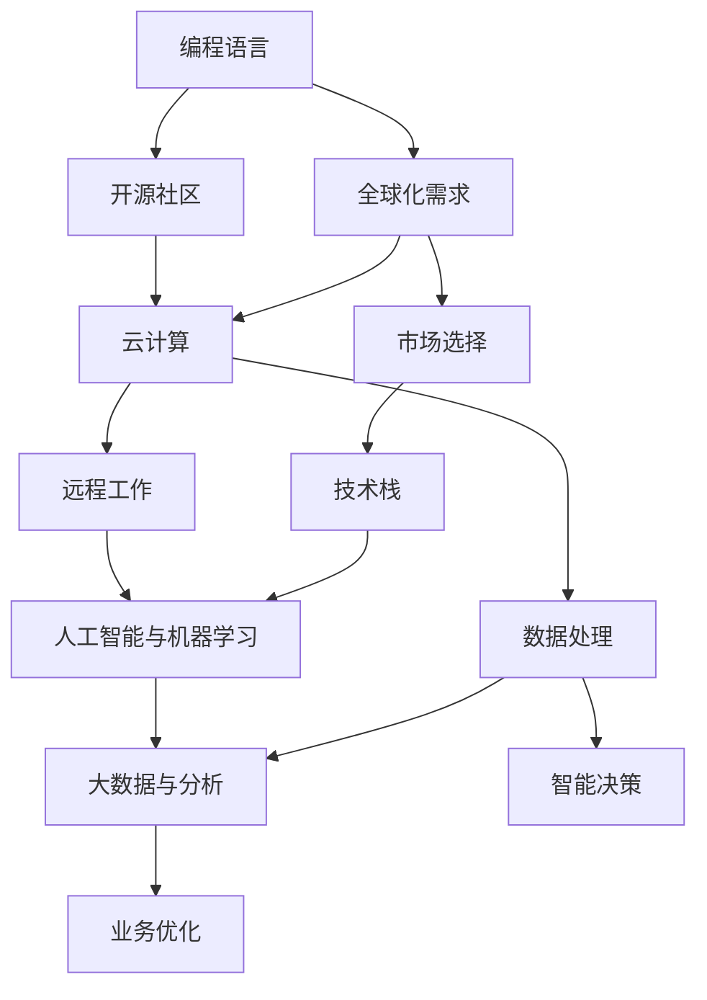

                 

# 程序员的全球化视野：机遇与挑战

> 关键词：全球化,编程语言,开源社区,云计算,人工智能,机器学习,大数据,远程工作,技术栈,本地化

## 1. 背景介绍

### 1.1 问题由来
随着互联网技术的飞速发展，全球化已成为现代软件开发的重要趋势。越来越多的企业将业务拓展到国际市场，软件开发团队也日益跨国化和多元化。程序员的全球化视野不仅体现在代码编写和系统设计上，更深入到项目管理和跨文化沟通等各个方面。如何在全球化的背景下，充分利用新技术和工具，提升软件开发的效率和质量，是每个程序员都需要认真思考的问题。

### 1.2 问题核心关键点
全球化软件开发的核心挑战包括：

1. **跨文化沟通**：不同国家和地区的工作文化、语言和习俗差异巨大，如何协调团队合作，有效沟通？
2. **编程语言选择**：不同市场对编程语言的需求差异明显，如何选择最具优势的编程语言？
3. **开源社区参与**：开源项目遍布全球，如何利用全球资源提升项目开发水平？
4. **云计算与远程工作**：远程工作成为常态，如何构建高效、安全的远程开发环境？
5. **人工智能与机器学习**：新兴技术如何与软件开发结合，提升开发效率和产品质量？
6. **大数据与分析**：海量数据如何转化为有价值的信息，支持决策制定和业务优化？

这些关键点共同构成了全球化软件开发的主要挑战，需要通过有效的策略和方法来应对。

## 2. 核心概念与联系

### 2.1 核心概念概述

为更好地理解全球化软件开发的概念和实施，本节将介绍几个密切相关的核心概念：

- **编程语言**：用于编写软件代码的工具，选择应综合考虑市场、开发团队和技术的成熟度。
- **开源社区**：由全球开发者共同维护的软件项目，提供丰富的资源和社区支持。
- **云计算**：基于互联网的计算服务，提供弹性的资源和高效的数据存储与处理能力。
- **远程工作**：员工通过互联网进行远程协作和任务处理，打破了物理地域的限制。
- **人工智能与机器学习**：新兴技术，用于自动化、智能化软件开发和优化。
- **大数据与分析**：处理和分析海量数据，支持决策制定和业务优化。

这些核心概念之间的逻辑关系可以通过以下Mermaid流程图来展示：



这个流程图展示了大语言模型微调的核心概念及其之间的关系：

1. 编程语言选择基于市场和技术需求。
2. 开源社区和云计算提供开发资源和基础设施。
3. 远程工作提升团队的灵活性和全球协作能力。
4. 人工智能和机器学习提升开发效率和质量。
5. 大数据与分析支持业务决策和优化。
6. 全球化需求推动了这些技术的应用和优化。

这些概念共同构成了全球化软件开发的基础，使得软件开发者能够在全球化背景下，更高效地进行软件开发和项目管理。

## 3. 核心算法原理 & 具体操作步骤
### 3.1 算法原理概述

全球化软件开发的核心算法原理包括：

- **编程语言的国际化**：选择合适的编程语言，综合考虑市场、开发团队和技术的成熟度。
- **开源社区的利用**：通过参与全球开源项目，获取资源和技术支持。
- **云计算的基础设施**：利用云平台提供的弹性资源，提升开发和部署的效率。
- **远程工作的协作工具**：使用协作工具提升团队沟通和任务管理效率。
- **人工智能和机器学习的应用**：引入自动化工具和算法，提升开发效率和代码质量。
- **大数据和分析的整合**：利用数据驱动决策，优化业务流程和用户体验。

### 3.2 算法步骤详解

全球化软件开发的具体操作步骤如下：

**Step 1: 评估市场和技术需求**
- 调研目标市场的技术栈和编程语言偏好。
- 评估团队成员的编程语言熟练程度和技术栈适配性。
- 确定项目的国际化需求，如多语言支持、本地化处理等。

**Step 2: 选择合适的编程语言**
- 综合考虑市场、团队和技术栈的适配性，选择合适的编程语言。
- 优先考虑具有广泛社区支持的语言，如Python、JavaScript等。
- 引入新兴技术，如Golang、Rust等，提升开发效率和性能。

**Step 3: 参与开源社区**
- 寻找与项目相关的开源项目，获取代码和文档资源。
- 贡献代码，参与社区讨论，提升项目质量和曝光度。
- 利用开源社区的技术栈和工具，提升开发效率。

**Step 4: 利用云计算基础设施**
- 选择适合的云平台，如AWS、Azure、Google Cloud等。
- 利用云平台的弹性资源，提升部署和扩展的灵活性。
- 使用云平台提供的存储和计算服务，处理大量数据和复杂任务。

**Step 5: 采用远程工作工具**
- 选择支持远程协作的工具，如Slack、Microsoft Teams、Zoom等。
- 利用云端的代码仓库和协作工具，提升团队沟通和任务管理效率。
- 建立远程工作的管理和监控机制，确保团队协作顺畅。

**Step 6: 引入人工智能和机器学习**
- 引入自动化工具和算法，如Jenkins、Ansible等，提升开发效率。
- 使用机器学习算法，进行代码质量分析、性能优化等。
- 引入自然语言处理技术，提升用户支持和数据分析能力。

**Step 7: 整合大数据和分析**
- 利用大数据工具，如Hadoop、Spark等，处理和分析海量数据。
- 结合数据分析结果，优化业务流程和用户体验。
- 使用数据可视化工具，如Tableau、PowerBI等，展示数据洞察。

### 3.3 算法优缺点

全球化软件开发具有以下优点：

1. **资源共享**：全球化的开源社区和云计算资源提供了丰富的开发资源和技术支持。
2. **开发效率提升**：自动化工具和机器学习算法可以提升开发效率，缩短项目开发周期。
3. **团队灵活性**：远程工作打破了物理地域限制，提升了团队灵活性和协作效率。
4. **市场覆盖**：全球化的编程语言和技术栈选择，可以覆盖更广泛的国际市场。

同时，该方法也存在一些缺点：

1. **沟通成本增加**：跨文化沟通可能导致误解和低效，需要更多的沟通和协调。
2. **技术栈复杂性**：选择多种技术和工具，可能导致技术栈复杂，维护成本增加。
3. **安全风险增加**：远程工作和云平台使用，可能增加数据泄露和隐私风险。

尽管存在这些局限性，但就目前而言，全球化软件开发方法仍是大势所趋，通过合理规划和策略，可以有效应对这些挑战。

### 3.4 算法应用领域

全球化软件开发技术在多个领域得到了广泛应用，例如：

- **企业应用开发**：跨国企业应用开发，涵盖ERP、CRM、供应链管理等。
- **移动应用开发**：跨平台移动应用开发，如iOS、Android等。
- **Web应用开发**：全球化网站和电子商务平台开发，如电商平台、SaaS应用等。
- **云计算服务**：提供云平台和云服务，支持全球企业应用部署和扩展。
- **大数据分析**：利用大数据工具，处理和分析海量数据，支持业务决策。

除了上述这些经典领域外，全球化软件开发技术还被创新性地应用到更多场景中，如智能合约、区块链、物联网等，为技术创新提供了新的可能。

## 4. 数学模型和公式 & 详细讲解 & 举例说明

### 4.1 数学模型构建

本节将使用数学语言对全球化软件开发的技术进行更加严格的刻画。

假设全球化软件开发的目标是最大化项目的市场覆盖率和开发效率，记市场覆盖率为 $M$，开发效率为 $E$，则模型可以表示为：

$$
\max \mathcal{M} = f(M, E)
$$

其中 $f$ 为效用函数，衡量市场覆盖率和开发效率的综合效益。市场覆盖率 $M$ 可以通过开源社区的贡献数、用户数量等指标来衡量。开发效率 $E$ 可以通过自动化工具的引入、远程工作的管理等指标来衡量。

### 4.2 公式推导过程

以下我们以全球化软件开发为例，推导优化模型和参数调整的计算公式。

假设市场覆盖率 $M$ 和开发效率 $E$ 的关系为：

$$
M = g(E) = k \cdot E^a
$$

其中 $k$ 为市场覆盖率与开发效率之间的常数关系，$a$ 为市场的敏感度指数。目标函数变为：

$$
\max \mathcal{M} = k \cdot E^a
$$

求解目标函数的最大值，对 $E$ 求导：

$$
\frac{\partial \mathcal{M}}{\partial E} = a \cdot k \cdot E^{a-1}
$$

令导数等于0，求解 $E$：

$$
a \cdot k \cdot E^{a-1} = 0
$$

解得 $E = 0$ 或 $E = 0^{\frac{1}{a-1}}$。由于开发效率不能为0，所以：

$$
E = 0^{\frac{1}{a-1}}
$$

代入市场覆盖率函数，求解 $M$：

$$
M = k \cdot (0^{\frac{1}{a-1}})^a = k
$$

这意味着，为了最大化市场覆盖率，开发效率需要达到一定的水平。因此，目标函数变为：

$$
\max \mathcal{M} = k \cdot E^a
$$

为了使 $E$ 达到最优值，需要找到合适的 $a$ 值，使得 $E$ 与 $M$ 之间的关系最优。

### 4.3 案例分析与讲解

以移动应用开发为例，分析全球化软件开发的应用。假设开发一个跨平台移动应用，市场覆盖率 $M$ 与开发效率 $E$ 之间的关系为：

$$
M = g(E) = k \cdot E^a
$$

其中 $k$ 为市场覆盖率与开发效率之间的常数关系，$a$ 为市场的敏感度指数。开发效率 $E$ 可以通过代码行数、自动化测试覆盖率等指标来衡量。市场覆盖率 $M$ 可以通过应用下载量、活跃用户数等指标来衡量。

为了最大化市场覆盖率，需要找到合适的 $E$ 值。假设 $a=2$，则市场覆盖率与开发效率之间的关系为：

$$
M = k \cdot E^2
$$

为了使 $M$ 最大化，需要对 $E$ 进行优化。通过实验发现，当 $E$ 达到一定阈值时，市场覆盖率 $M$ 开始饱和。此时，需要进一步优化开发效率，提升市场覆盖率。可以通过引入自动化工具、改进开发流程、引入机器学习算法等手段，提升开发效率，从而最大化市场覆盖率。

## 5. 项目实践：代码实例和详细解释说明

### 5.1 开发环境搭建

在进行全球化软件开发实践前，我们需要准备好开发环境。以下是使用Python进行PyTorch开发的环境配置流程：

1. 安装Anaconda：从官网下载并安装Anaconda，用于创建独立的Python环境。

2. 创建并激活虚拟环境：
```bash
conda create -n pytorch-env python=3.8 
conda activate pytorch-env
```

3. 安装PyTorch：根据CUDA版本，从官网获取对应的安装命令。例如：
```bash
conda install pytorch torchvision torchaudio cudatoolkit=11.1 -c pytorch -c conda-forge
```

4. 安装TensorFlow：
```bash
pip install tensorflow
```

5. 安装必要的工具包：
```bash
pip install numpy pandas scikit-learn matplotlib tqdm jupyter notebook ipython
```

完成上述步骤后，即可在`pytorch-env`环境中开始全球化软件开发实践。

### 5.2 源代码详细实现

下面我们以Web应用开发为例，给出使用Flask框架进行Web应用开发的PyTorch代码实现。

首先，定义Web应用的路由：

```python
from flask import Flask, request, jsonify

app = Flask(__name__)

@app.route('/')
def index():
    return 'Hello, World!'

@app.route('/api')
def api():
    data = request.get_json()
    result = {'status': 200, 'message': 'API is working'}
    return jsonify(result)
```

然后，启动Web应用：

```python
if __name__ == '__main__':
    app.run(host='0.0.0.0', port=5000, debug=True)
```

### 5.3 代码解读与分析

让我们再详细解读一下关键代码的实现细节：

**Flask应用**：
- 使用Flask框架创建Web应用，并定义了两个路由函数。
- 第一个路由函数为根路由，返回静态文本。
- 第二个路由函数为API路由，接收JSON数据，返回API状态信息。

**Web应用部署**：
- 使用Flask的run方法启动Web应用，监听本地所有IP地址（0.0.0.0），端口号为5000，开启调试模式。

可以看到，使用Python和Flask框架可以快速搭建Web应用，并发布到互联网上。开发环境搭建和代码实现都较为简单，适合初学者和快速原型开发。

## 6. 实际应用场景
### 6.1 企业应用开发

全球化软件开发技术在企业应用开发中得到了广泛应用，例如ERP、CRM、供应链管理等系统。企业应用开发通常需要处理大量的数据和复杂的业务逻辑，全球化技术可以提升开发效率和系统性能。

具体而言，可以采用以下策略：

- **云平台部署**：利用云计算平台，如AWS、Azure、Google Cloud等，提供弹性资源和高效的计算能力。
- **微服务架构**：采用微服务架构，提升系统扩展性和可维护性。
- **DevOps实践**：引入DevOps工具和流程，提升开发和部署效率。
- **机器学习应用**：引入机器学习算法，进行业务预测和优化。

通过这些策略，企业应用开发可以高效地支持全球化需求，提升业务竞争力。

### 6.2 移动应用开发

全球化软件开发技术在移动应用开发中也得到了广泛应用，例如跨平台移动应用开发。移动应用开发需要考虑多平台适配、用户界面设计等复杂问题，全球化技术可以提升开发效率和用户体验。

具体而言，可以采用以下策略：

- **跨平台框架**：使用跨平台开发框架，如React Native、Flutter等，提升开发效率和性能。
- **本地化处理**：针对不同语言和地区，进行本地化处理，提升用户体验。
- **自动化测试**：引入自动化测试工具，提升测试覆盖率和质量。
- **云平台部署**：利用云计算平台，提供弹性的资源和高效的部署能力。

通过这些策略，移动应用开发可以高效地支持全球化需求，提升应用质量和用户体验。

### 6.3 智能合约开发

全球化软件开发技术在智能合约开发中也得到了广泛应用，例如智能合约的编写和部署。智能合约开发需要考虑区块链平台、代码安全等问题，全球化技术可以提升开发效率和系统安全性。

具体而言，可以采用以下策略：

- **跨链协议**：使用跨链协议，实现不同区块链平台之间的互联互通。
- **代码审计**：引入代码审计工具，提升代码安全性和可靠性。
- **DevOps实践**：引入DevOps工具和流程，提升开发和部署效率。
- **人工智能应用**：引入人工智能算法，进行智能合约优化和自动化管理。

通过这些策略，智能合约开发可以高效地支持全球化需求，提升合约执行效率和系统安全性。

## 7. 工具和资源推荐
### 7.1 学习资源推荐

为了帮助开发者系统掌握全球化软件开发的技术基础和实践技巧，这里推荐一些优质的学习资源：

1. **《深入浅出区块链》**：讲解区块链基础和智能合约开发，适合初学者入门。
2. **《深入理解DevOps》**：介绍DevOps工具和流程，提升开发和部署效率。
3. **《Web开发实战》**：讲解Web开发技术栈和框架，适合Web应用开发。
4. **《移动应用开发全攻略》**：讲解跨平台移动应用开发技术，适合移动应用开发。
5. **《全球化软件开发》**：讲解全球化软件开发的核心概念和实施方法。
6. **《Python编程精粹》**：讲解Python编程语言和最佳实践。

通过这些资源的学习实践，相信你一定能够快速掌握全球化软件开发的核心技术，并用于解决实际的开发问题。

### 7.2 开发工具推荐

高效的开发离不开优秀的工具支持。以下是几款用于全球化软件开发开发的常用工具：

1. **Anaconda**：用于创建独立的Python环境，方便软件包管理。
2. **Jupyter Notebook**：用于数据科学和机器学习的交互式开发。
3. **Flask**：用于Web应用开发的轻量级框架，易于上手。
4. **React Native**：用于跨平台移动应用开发的框架，提升开发效率和性能。
5. **AWS**：全球领先的云平台，提供弹性资源和高效的计算能力。
6. **DevOps工具**：如Jenkins、Ansible等，提升开发和部署效率。

合理利用这些工具，可以显著提升全球化软件开发的开发效率，加快创新迭代的步伐。

### 7.3 相关论文推荐

全球化软件开发技术的发展源于学界的持续研究。以下是几篇奠基性的相关论文，推荐阅读：

1. **《软件开发的全球化》**：介绍全球化软件开发的核心概念和实施方法。
2. **《DevOps实践指南》**：讲解DevOps工具和流程，提升开发和部署效率。
3. **《Web开发技术栈》**：讲解Web开发技术栈和框架，适合Web应用开发。
4. **《跨平台移动应用开发技术》**：讲解跨平台移动应用开发技术，适合移动应用开发。
5. **《智能合约的开发和部署》**：讲解智能合约的编写和部署，适合智能合约开发。

这些论文代表了大语言模型微调技术的发展脉络。通过学习这些前沿成果，可以帮助研究者把握学科前进方向，激发更多的创新灵感。

## 8. 总结：未来发展趋势与挑战

### 8.1 总结

本文对全球化软件开发方法进行了全面系统的介绍。首先阐述了全球化软件开发的研究背景和意义，明确了全球化技术在提升软件开发效率和质量方面的独特价值。其次，从原理到实践，详细讲解了全球化软件开发的数学模型和操作步骤，给出了开发实践的完整代码实例。同时，本文还广泛探讨了全球化技术在企业应用开发、移动应用开发、智能合约开发等多个行业领域的应用前景，展示了全球化技术的巨大潜力。此外，本文精选了全球化技术的学习资源，力求为读者提供全方位的技术指引。

通过本文的系统梳理，可以看到，全球化软件开发技术正在成为软件开发的重要趋势，极大地提升了开发效率和质量，促进了软件的国际化和标准化。未来，伴随全球化技术的持续演进，软件开发技术必将迎来新的变革，为全球信息化进程注入新的动力。

### 8.2 未来发展趋势

展望未来，全球化软件开发技术将呈现以下几个发展趋势：

1. **云平台普及**：随着云技术的不断发展，全球化软件开发将更加依赖云平台提供的资源和基础设施。
2. **DevOps自动化**：DevOps工具和流程的普及，将进一步提升开发和部署的效率。
3. **多语言支持**：全球化软件将更好地支持多语言环境和本地化处理。
4. **跨平台开发**：跨平台开发框架和技术将不断成熟，提升开发效率和性能。
5. **机器学习应用**：机器学习技术在软件开发中的应用将越来越广泛，提升开发效率和质量。
6. **智能合约优化**：智能合约将结合区块链和人工智能技术，提升合约执行效率和安全性。

以上趋势凸显了全球化软件开发技术的广阔前景。这些方向的探索发展，必将进一步提升软件开发的质量和效率，为全球信息化进程提供更加强大的技术支持。

### 8.3 面临的挑战

尽管全球化软件开发技术已经取得了显著成就，但在迈向更加智能化、普适化应用的过程中，它仍面临着诸多挑战：

1. **沟通成本增加**：跨文化沟通可能导致误解和低效，需要更多的沟通和协调。
2. **技术栈复杂性**：选择多种技术和工具，可能导致技术栈复杂，维护成本增加。
3. **安全风险增加**：远程工作和云平台使用，可能增加数据泄露和隐私风险。
4. **文化差异影响**：不同国家和地区的文化差异，可能影响团队协作和用户体验。
5. **本地化处理难度**：不同地区的本地化处理，可能导致开发和维护成本增加。

尽管存在这些局限性，但就目前而言，全球化软件开发技术仍是大势所趋，通过合理规划和策略，可以有效应对这些挑战。

### 8.4 研究展望

面对全球化软件开发所面临的种种挑战，未来的研究需要在以下几个方面寻求新的突破：

1. **跨文化沟通优化**：引入多语言处理和自然语言处理技术，提升跨文化沟通效率。
2. **技术栈优化**：选择最适合的技术栈，减少技术复杂性，提升维护效率。
3. **安全性增强**：引入数据加密和安全审计机制，提升系统安全性。
4. **本地化处理简化**：引入自动化工具和算法，简化本地化处理过程。
5. **用户体验优化**：引入人工智能和机器学习技术，提升用户体验。

这些研究方向的探索，必将引领全球化软件开发技术迈向更高的台阶，为全球信息化进程提供更加强大的技术支持。面向未来，全球化软件开发技术还需要与其他新兴技术进行更深入的融合，如大数据、人工智能、区块链等，多路径协同发力，共同推动全球信息化进程的进步。只有勇于创新、敢于突破，才能不断拓展全球化软件开发技术的边界，让技术更好地服务于全球信息化发展。

## 9. 附录：常见问题与解答

**Q1：如何选择合适的编程语言？**

A: 选择编程语言应综合考虑市场、开发团队和技术的成熟度。优先考虑具有广泛社区支持的语言，如Python、JavaScript等。引入新兴技术，如Golang、Rust等，提升开发效率和性能。

**Q2：远程工作如何保证团队协作效率？**

A: 选择支持远程协作的工具，如Slack、Microsoft Teams、Zoom等。利用云端的代码仓库和协作工具，提升团队沟通和任务管理效率。建立远程工作的管理和监控机制，确保团队协作顺畅。

**Q3：全球化开发如何降低沟通成本？**

A: 引入多语言处理和自然语言处理技术，提升跨文化沟通效率。建立清晰的项目沟通机制和文档标准，减少沟通误解。

**Q4：如何选择最适合的技术栈？**

A: 选择最适合的技术栈，减少技术复杂性，提升维护效率。优先考虑具有成熟生态系统的技术栈，如React Native、Flutter等。引入新兴技术，如Kotlin、Swift等，提升开发效率和性能。

**Q5：如何应对安全风险？**

A: 引入数据加密和安全审计机制，提升系统安全性。建立安全评估和应急响应机制，确保系统安全。

通过本文的系统梳理，可以看到，全球化软件开发技术正在成为软件开发的重要趋势，极大地提升了开发效率和质量，促进了软件的国际化和标准化。未来，伴随全球化技术的持续演进，软件开发技术必将迎来新的变革，为全球信息化进程注入新的动力。

---

作者：禅与计算机程序设计艺术 / Zen and the Art of Computer Programming

