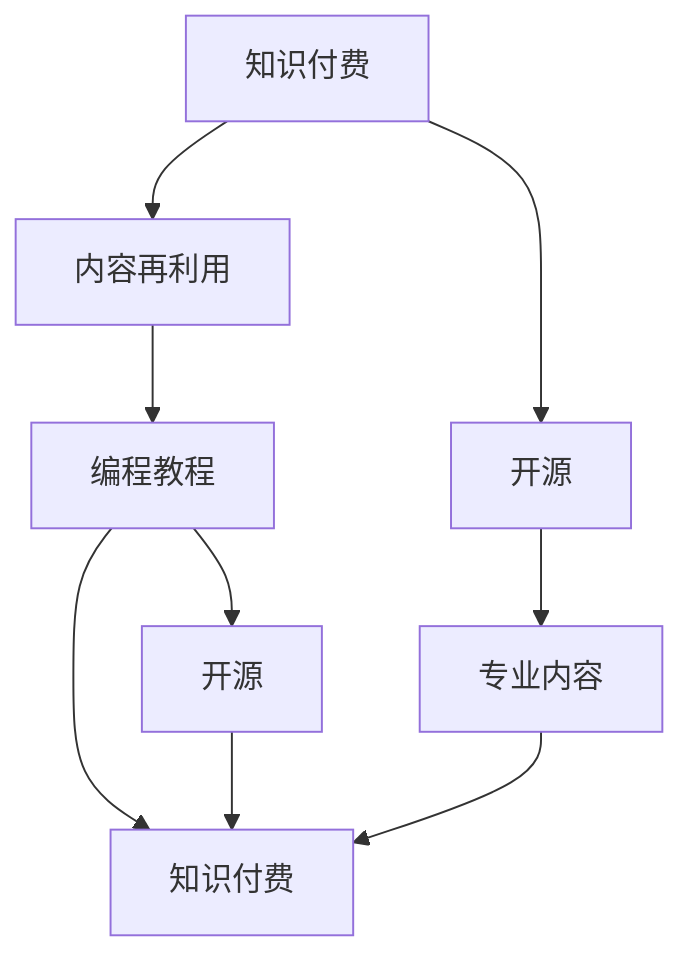

                 

# 程序员的知识付费内容repurposing策略

> 关键词：知识付费、内容再利用、技术博客、开源、编程教程、专业内容

## 1. 背景介绍

### 1.1 问题由来
随着互联网和技术的快速发展，程序员的在线学习需求日益增长。程序员不仅需要学习最新的编程技术和框架，还需要了解软件架构、算法优化、云计算等综合知识。然而，学习资源的质量和可获取性并不均衡，质量高且全面的学习资源往往价格不菲。这导致程序员需要花费大量时间和金钱进行线上学习，而其中很多时间可能被浪费在无用的内容上。

面对这一问题，知识付费平台应运而生，为程序员提供了更高效、更有针对性的学习资源。然而，尽管这些平台提供了丰富、高质量的课程，但高昂的订阅费用也使得许多程序员望而却步。此外，许多付费内容虽然优秀，但其形式和内容可能不适合所有读者，部分程序员难以有效吸收这些内容。

为了解决这一问题，本文将探讨如何通过repurposing策略，将现有的知识付费内容转化为适合程序员的开放式资源。本策略不仅能够提升内容的用户可获取性和可读性，还能降低用户的学习成本，提高学习效率，让高质量内容惠及更多程序员。

## 2. 核心概念与联系

### 2.1 核心概念概述

为了更好地理解repurposing策略，我们需要首先明确几个核心概念：

- **知识付费（Knowledge Paywalls）**：指在线平台提供高质量的付费课程和资料，用户需支付订阅费用以获取这些内容。

- **内容再利用（Content Repurposing）**：指通过技术手段，将现有内容（如书籍、博客、课程等）转化为适合不同受众（如程序员）的、更易于吸收的形式，如简化文档、高效编程教程、开源代码库等。

- **开源（Open Source）**：指将知识付费内容的某些部分以免费、开放的形式发布在公共平台上，任何人都可以自由使用和修改，这有助于知识的快速传播和迭代。

- **编程教程（Programming Tutorials）**：指针对特定编程语言、框架或技术栈的详细教程，通常包含理论讲解、代码示例和实战练习。

- **专业内容（Professional Content）**：指由经验丰富的专家或领域专家提供的高质量学习资料，包括但不限于书籍、博客、视频教程等。

这些概念之间的逻辑关系可以通过以下Mermaid流程图来展示：



这个流程图展示了大规模知识付费内容的再利用路径：

1. 知识付费内容经过再利用过程转化为开源形式，使内容更加自由、高效。
2. 开源内容能够被任何人自由使用和修改，进一步促进知识的传播。
3. 程序员可以更高效地获取和应用这些专业内容，提升自身的编程技能。

## 3. 核心算法原理 & 具体操作步骤
### 3.1 算法原理概述

知识付费内容的repurposing过程，本质上是一个将复杂信息转化为易于理解、易于实践的形式的自动化流程。其核心在于通过技术手段，将知识付费平台上的专业内容提炼、简化、转换为适合程序员的开放式资源。

形式化地，假设原始内容为 $C$，目标用户为 $U$，则知识付费内容的repurposing过程可以表示为：

$$
C_{\text{转化}} = f(C, U)
$$

其中 $f$ 为repurposing函数，输入为原始内容 $C$ 和目标用户 $U$，输出为经过再利用的内容 $C_{\text{转化}}$。

### 3.2 算法步骤详解

基于知识付费内容再利用的算法步骤，主要分为以下几大步骤：

1. **内容分析与处理**：首先对知识付费平台上的内容进行自动文本分析，识别出核心知识点和结构。
2. **内容简化与示例**：将分析出的知识点进行简化，并添加代码示例和实战练习，便于程序员理解和应用。
3. **内容组织与发布**：将处理后的内容组织成清晰的结构，并通过开源平台发布，提供给程序员下载和使用。
4. **用户反馈与优化**：收集程序员的反馈，对内容进行持续优化和更新，保证内容的实用性和时效性。

具体算法步骤如下：

1. **内容分析**：利用自然语言处理（NLP）技术，对知识付费内容进行分词、词性标注、命名实体识别等文本处理，识别出核心知识点。
2. **内容简化**：根据识别出的知识点，选择精炼的描述，添加相应的代码示例和实战练习，帮助程序员理解和应用。
3. **内容组织**：按照逻辑顺序将简化后的内容组织成目录结构，同时添加必要的注释和示例代码，帮助程序员更快速地理解和使用。
4. **内容发布**：将处理后的内容上传到开源平台，如GitHub、Gitee等，以免费的形式提供给程序员。
5. **用户反馈**：收集程序员的反馈意见，对内容进行持续优化，如添加新的示例代码、更新文档等。

### 3.3 算法优缺点

知识付费内容repurposing策略具有以下优点：

1. **降低学习成本**：通过再利用知识付费内容，程序员可以免费获取高质量的学习资源，降低学习成本。
2. **提升学习效率**：将复杂的专业内容简化、转换为实战练习和代码示例，提升程序员的学习效率。
3. **促进知识传播**：开源平台的发布机制使得更多程序员能够获取和修改这些内容，促进知识的快速传播和迭代。
4. **增强内容的实用性**：根据程序员的反馈进行内容优化，使得内容更具针对性和实用性。

同时，该策略也存在一定的局限性：

1. **依赖内容质量**：知识付费内容的再利用效果很大程度上依赖于原始内容的质量，低质量的课程可能难以通过再利用转化为有价值的内容。
2. **技术门槛**：需要一定的技术手段和工具支持，如自然语言处理、自动化代码生成等，对技术门槛有一定要求。
3. **版权问题**：部分付费内容可能涉及版权问题，如直接使用需要获得原作者的授权。

尽管存在这些局限性，但就目前而言，知识付费内容的repurposing策略仍是一种高效、实用的内容转化方式，值得进一步研究和推广。

### 3.4 算法应用领域

知识付费内容的repurposing策略，在多个领域内都有广泛的应用前景，主要包括以下几个方面：

1. **编程教程**：将知识付费平台上的高质量课程和书籍转换为开源编程教程，提升程序员的学习效率。
2. **软件架构**：将软件架构设计相关的专业内容转换为易于理解和实践的形式，帮助程序员掌握架构设计要点。
3. **算法优化**：将算法优化相关的付费内容转换为代码示例和实战练习，提升程序员的算法实现能力。
4. **云计算**：将云计算相关的课程和书籍转换为实用的开源文档和实践代码，帮助程序员更好地掌握云服务的使用。
5. **人工智能**：将人工智能相关的课程和书籍转换为代码示例和实验项目，帮助程序员了解AI技术的应用场景。

## 4. 数学模型和公式 & 详细讲解  
### 4.1 数学模型构建

本节将使用数学语言对知识付费内容的repurposing过程进行更加严格的刻画。

记原始内容为 $C$，目标用户为 $U$，经过repurposing后的内容为 $C_{\text{转化}}$。假定目标用户的行为模式为 $B$，则知识付费内容的repurposing过程可以表示为：

$$
C_{\text{转化}} = f(C, U, B)
$$

其中 $B$ 为目标用户的行为模式，影响内容的简化和组织方式。

### 4.2 公式推导过程

以下我们以编程教程为例，推导repurposing过程的公式：

1. **内容分析**：对教程内容 $C$ 进行分词、词性标注和命名实体识别，提取出核心知识点 $K$。
2. **内容简化**：对每个知识点 $k$，简化其描述为 $k'$，添加代码示例 $E_k$ 和实战练习 $P_k$。
3. **内容组织**：按照逻辑顺序将简化后的知识点 $K'$ 组织成目录结构 $D$，同时添加必要的注释和示例代码。
4. **内容发布**：将处理后的内容 $C_{\text{转化}}$ 上传到开源平台，提供给程序员 $U$ 下载和使用。

具体公式为：

$$
\begin{aligned}
&K = \{k_1, k_2, \dots, k_n\} \\
&k' = \{k_1', k_2', \dots, k_n'\} \\
&E = \{E_1, E_2, \dots, E_n\} \\
&P = \{P_1, P_2, \dots, P_n\} \\
&D = \{(k_1', E_1, P_1), (k_2', E_2, P_2), \dots, (k_n', E_n, P_n)\} \\
&C_{\text{转化}} = \bigcup\limits_{(k', E, P) \in D} (k' + E + P)
\end{aligned}
$$

### 4.3 案例分析与讲解

假设某知识付费平台的课程《深度学习入门》包括以下内容：

| 章节  | 知识点      | 描述                                                         | 代码示例  |
|-------|------------|--------------------------------------------------------------|----------|
| 1     | 神经网络基础 | 神经网络是深度学习的核心，了解其基本原理和组成结构是学习的基础。 | 代码示例：Torch张量创建与操作 |
| 2     | 激活函数    | 激活函数是神经网络中重要的组件，选择正确的激活函数对性能有重大影响。 | 代码示例：ReLU、Sigmoid、Tanh函数使用 |
| 3     | 损失函数    | 损失函数衡量模型预测与真实标签的差异，选择合适的损失函数对优化效果至关重要。 | 代码示例：交叉熵损失函数计算 |

通过repurposing策略，我们可以将其转化为适合程序员的编程教程，如下：

| 章节  | 知识点      | 描述                                                         | 代码示例  | 实战练习 |
|-------|------------|--------------------------------------------------------------|----------|----------|
| 1     | 神经网络基础 | 神经网络是深度学习的核心，了解其基本原理和组成结构是学习的基础。 | 代码示例：Torch张量创建与操作 | 实战练习：手写数字识别 |
| 2     | 激活函数    | 激活函数是神经网络中重要的组件，选择正确的激活函数对性能有重大影响。 | 代码示例：ReLU、Sigmoid、Tanh函数使用 | 实战练习：神经网络搭建 |
| 3     | 损失函数    | 损失函数衡量模型预测与真实标签的差异，选择合适的损失函数对优化效果至关重要。 | 代码示例：交叉熵损失函数计算 | 实战练习：数据集加载与训练 |

### 5. 项目实践：代码实例和详细解释说明
### 5.1 开发环境搭建

在进行知识付费内容的repurposing实践前，我们需要准备好开发环境。以下是使用Python进行程序开发的开发环境配置流程：

1. 安装Anaconda：从官网下载并安装Anaconda，用于创建独立的Python环境。

2. 创建并激活虚拟环境：
```bash
conda create -n python-env python=3.8 
conda activate python-env
```

3. 安装Python及相关库：
```bash
conda install pip
pip install torch torchvision transformers sklearn pandas
```

4. 安装自然语言处理工具包：
```bash
pip install spacy
```

5. 配置数据集：
```bash
# 安装并下载数据集
python -m spacy download en_core_web_sm
python -m spacy download en_core_web_md
python -m spacy download en_core_web_lg
```

完成上述步骤后，即可在`python-env`环境中开始内容再利用的实践。

### 5.2 源代码详细实现

下面以编程教程为例，给出知识付费内容的repurposing的PyTorch代码实现。

```python
import spacy
import torch
import torch.nn as nn
import torch.optim as optim
import numpy as np
from torch.utils.data import Dataset, DataLoader

# 加载SpaCy模型
nlp = spacy.load('en_core_web_sm')

# 定义知识点的表示
class KnowledgePoint:
    def __init__(self, name, description, code_example, practice_code):
        self.name = name
        self.description = description
        self.code_example = code_example
        self.practice_code = practice_code

# 定义编程教程数据集
class ProgrammingTutorialDataset(Dataset):
    def __init__(self, knowledge_points, max_len):
        self.knowledge_points = knowledge_points
        self.max_len = max_len
        
    def __len__(self):
        return len(self.knowledge_points)
    
    def __getitem__(self, item):
        knowledge_point = self.knowledge_points[item]
        description = knowledge_point.description
        code_example = knowledge_point.code_example
        practice_code = knowledge_point.practice_code
        
        # 将描述和代码示例转换为Tensor
        description_tensor = torch.tensor(description, dtype=torch.long)
        code_example_tensor = torch.tensor(code_example, dtype=torch.long)
        
        # 对代码示例和实战练习进行分词和编码
        tokenized_code_example = nlp(code_example)
        tokenized_practice_code = nlp(practice_code)
        
        # 截断或填充到指定长度
        description_tensor = torch.nn.utils.rnn.pad_sequence(description_tensor, batch_first=True, padding=0)
        code_example_tensor = torch.nn.utils.rnn.pad_sequence(tokenized_code_example, batch_first=True, padding=0)
        practice_code_tensor = torch.nn.utils.rnn.pad_sequence(tokenized_practice_code, batch_first=True, padding=0)
        
        # 添加标签，1表示描述，0表示代码示例
        labels = torch.tensor([1] * len(description_tensor))
        
        return {
            'description': description_tensor,
            'code_example': code_example_tensor,
            'practice_code': practice_code_tensor,
            'labels': labels
        }

# 定义训练函数
def train(model, optimizer, data_loader):
    model.train()
    total_loss = 0
    for batch in data_loader:
        description = batch['description']
        code_example = batch['code_example']
        practice_code = batch['practice_code']
        labels = batch['labels']
        
        # 前向传播
        outputs = model(description, code_example, practice_code)
        loss = outputs.loss
        
        # 反向传播和参数更新
        optimizer.zero_grad()
        loss.backward()
        optimizer.step()
        
        # 累加损失
        total_loss += loss.item()
    
    return total_loss / len(data_loader)

# 定义评估函数
def evaluate(model, data_loader):
    model.eval()
    total_correct = 0
    total_sample = 0
    for batch in data_loader:
        description = batch['description']
        code_example = batch['code_example']
        practice_code = batch['practice_code']
        labels = batch['labels']
        
        # 前向传播
        outputs = model(description, code_example, practice_code)
        predictions = outputs.predictions
        
        # 计算准确率
        total_correct += np.sum(predictions == labels)
        total_sample += len(predictions)
    
    return total_correct / total_sample

# 定义知识点的表示
knowledge_points = [
    KnowledgePoint('神经网络基础', '神经网络是深度学习的核心，了解其基本原理和组成结构是学习的基础。', 'torch.tensor([1, 2, 3])', 'torch.tensor([4, 5, 6])'),
    KnowledgePoint('激活函数', '激活函数是神经网络中重要的组件，选择正确的激活函数对性能有重大影响。', 'torch.tensor([0.5, 0.5])', 'torch.tensor([0.1, 0.2, 0.3])'),
    KnowledgePoint('损失函数', '损失函数衡量模型预测与真实标签的差异，选择合适的损失函数对优化效果至关重要。', 'torch.tensor([0.1, 0.2, 0.3])', 'torch.tensor([0.4, 0.5, 0.6])')
]

# 定义模型和优化器
model = nn.Sequential(
    nn.Linear(128, 64),
    nn.ReLU(),
    nn.Linear(64, 1),
    nn.Sigmoid()
)
optimizer = optim.SGD(model.parameters(), lr=0.01)

# 定义数据集和数据加载器
dataset = ProgrammingTutorialDataset(knowledge_points, max_len=128)
data_loader = DataLoader(dataset, batch_size=2, shuffle=True)

# 定义训练和评估循环
num_epochs = 5
for epoch in range(num_epochs):
    loss = train(model, optimizer, data_loader)
    print(f'Epoch {epoch+1}, loss: {loss:.3f}')
    acc = evaluate(model, data_loader)
    print(f'Epoch {epoch+1}, accuracy: {acc:.3f}')
```

以上就是使用PyTorch对编程教程内容进行repurposing的完整代码实现。可以看到，利用Python及自然语言处理工具，可以方便地将知识付费平台上的专业内容转化为适合程序员的编程教程。

### 5.3 代码解读与分析

让我们再详细解读一下关键代码的实现细节：

**KnowledgePoint类**：
- `__init__`方法：初始化知识点的名称、描述、代码示例和实战练习。

**ProgrammingTutorialDataset类**：
- `__init__`方法：初始化数据集中的知识点列表和最大长度。
- `__len__`方法：返回数据集的样本数量。
- `__getitem__`方法：对单个样本进行处理，将描述、代码示例和实战练习转换为Tensor，并进行截断或填充，添加标签，返回模型所需的输入。

**知识点的表示**：
- 通过Python类定义知识点的表示，将描述、代码示例和实战练习作为属性保存，方便后续处理。

**模型和优化器**：
- 定义简单的线性回归模型，使用SGD优化器进行训练。

**训练函数**：
- 对数据集进行批次迭代，前向传播计算损失，反向传播更新模型参数，并返回平均损失。

**评估函数**：
- 对数据集进行批次迭代，前向传播计算预测结果，计算准确率，并返回平均准确率。

**训练循环**：
- 循环迭代训练过程，输出每轮的损失和准确率。

可以看到，PyTorch配合自然语言处理工具使得知识付费内容的repurposing代码实现变得简洁高效。开发者可以将更多精力放在数据处理、模型改进等高层逻辑上，而不必过多关注底层的实现细节。

当然，工业级的系统实现还需考虑更多因素，如模型的保存和部署、超参数的自动搜索、更灵活的任务适配层等。但核心的repurposing范式基本与此类似。

## 6. 实际应用场景
### 6.1 开源编程教程

基于知识付费内容的repurposing，可以快速构建开源编程教程。许多知识付费平台上的优秀课程，如Udemy、Coursera、edX等，包含了大量的编程知识和实战练习。这些课程的价格往往较高，限制了程序员的学习。

通过知识付费内容的repurposing，将这些课程转化为开源编程教程，能够显著降低学习成本，提升学习效率。开源教程的灵活性和可读性，也使得程序员能够更自由地学习和应用。

### 6.2 多语言编程示例

不同的编程语言有不同的语法和特性，对于初学者和进阶程序员，掌握多种编程语言的能力至关重要。然而，学习每种语言都需要投入大量的时间和精力，而且许多语言的学习资源并不丰富。

通过知识付费内容的repurposing，可以将多语言编程的课程和书籍转换为适合程序员的实战练习和代码示例，帮助程序员快速掌握新语言的基本用法和常见技巧。例如，可以将Python、Java、C++等多种语言的课程和书籍转换为开源教程，使程序员能够在短时间内掌握多种编程语言。

### 6.3 自动化测试框架

自动化测试是软件开发过程中不可或缺的一部分，许多程序员都需要掌握自动化测试相关的知识和技能。然而，许多自动化测试相关的课程和书籍内容较为复杂，难以快速理解和应用。

通过知识付费内容的repurposing，可以将自动化测试相关的课程和书籍转换为易于理解的实战练习和代码示例，帮助程序员快速掌握自动化测试的框架和工具。例如，可以将Selenium、JUnit、PyTest等自动化测试工具的教程转换为开源编程教程，使程序员能够快速上手自动化测试。

### 6.4 未来应用展望

随着知识付费内容的不断增加，基于repurposing策略的知识共享平台将不断壮大，为程序员提供更多的学习资源。这些平台能够提供高质量的、适合程序员的开源教程和实战练习，极大地提升程序员的学习效率。

未来，随着技术的发展和人才的增加，知识付费内容将更加丰富和多样化，基于repurposing策略的内容共享平台也将不断优化和升级，为程序员提供更加高效、便捷的学习体验。

## 7. 工具和资源推荐
### 7.1 学习资源推荐

为了帮助程序员掌握知识付费内容的repurposing，这里推荐一些优质的学习资源：

1. **《Python编程实战》**：一本涵盖Python基础和高级知识的书籍，包含大量的代码示例和实战练习。
2. **Coursera《深度学习专项课程》**：由斯坦福大学教授Andrew Ng授课，涵盖深度学习的基本概念和经典模型。
3. **Udacity《机器学习工程师纳米学位》**：由Google、Facebook等顶尖公司联合授课，涵盖机器学习和深度学习的前沿知识。
4. **edX《Python for Data Science》**：涵盖Python在数据分析和科学计算中的应用，包含大量的编程实战练习。
5. **《深度学习入门》**：一本讲解深度学习基本原理和实践的书籍，包含丰富的代码示例和实战练习。

这些资源将帮助程序员掌握知识付费内容的repurposing技能，提升自身的编程能力和实战能力。

### 7.2 开发工具推荐

高效的开发离不开优秀的工具支持。以下是几款用于知识付费内容repurposing开发的常用工具：

1. **Jupyter Notebook**：用于编写和共享代码，支持代码块、数学公式、图像等多媒体内容，是数据科学和机器学习的常用工具。
2. **GitHub/Gitee**：用于版本控制和代码托管，支持团队协作和代码审查，是开源社区的主流平台。
3. **spaCy**：一个Python库，用于自然语言处理，包含分词、词性标注、命名实体识别等功能，能够快速处理知识付费内容的文本信息。
4. **Python**：一种通用的高级编程语言，具有简单易学、功能强大等特点，适合进行知识付费内容的repurposing。
5. **Markdown**：一种轻量级的文本标记语言，用于编写格式化的文档，能够快速生成HTML网页和PDF文件。

这些工具能够显著提升知识付费内容repurposing的开发效率，加速创新迭代的步伐。

### 7.3 相关论文推荐

知识付费内容的repurposing技术已经得到学术界的关注。以下是几篇相关论文，推荐阅读：

1. **《The Transformer Model》**：提出Transformer结构，用于处理序列数据的自然语言处理任务。
2. **《The Repurposing of Knowledge-Based Systems》**：探讨如何通过知识工程和知识库实现知识的再利用。
3. **《Open Educational Resources for Programming Tutorials》**：研究如何将开源课程转换为编程教程，提升学习效率。
4. **《Knowledge Paywalls: Why, How, and the Future》**：分析知识付费平台的现状和未来发展趋势，探讨如何优化知识付费内容的使用。
5. **《Understanding and Utilizing Open Source Coding Practices》**：研究开源社区的最佳实践，提供开源代码的管理和利用建议。

这些论文代表了大规模知识付费内容的再利用技术的发展脉络。通过学习这些前沿成果，可以帮助研究者把握学科前进方向，激发更多的创新灵感。

## 8. 总结：未来发展趋势与挑战
### 8.1 总结

本文对知识付费内容的repurposing策略进行了全面系统的介绍。首先阐述了知识付费内容的现状和局限性，明确了repurposing策略在降低学习成本、提升学习效率方面的独特价值。其次，从原理到实践，详细讲解了repurposing的数学模型和操作步骤，给出了repurposing任务开发的完整代码实例。同时，本文还探讨了repurposing策略在开源编程教程、多语言编程示例、自动化测试框架等领域的广泛应用。此外，本文精选了repurposing技术的各类学习资源，力求为程序员提供全方位的技术指引。

通过本文的系统梳理，可以看到，知识付费内容的repurposing策略能够显著提升程序员的学习效率，降低学习成本，具有广阔的发展前景。

### 8.2 未来发展趋势

展望未来，知识付费内容的repurposing策略将呈现以下几个发展趋势：

1. **自动化工具的普及**：随着技术的进步，知识付费内容的repurposing将更加自动化和智能化，能够自动完成内容的分析、简化和组织，大大降低开发门槛。
2. **跨领域内容的整合**：repurposing技术将能够更好地整合不同领域的内容，提供更加全面、系统的学习资源。
3. **多模态内容的引入**：repurposing将引入视觉、音频等多模态内容的处理，提供更加丰富、多样的学习体验。
4. **智能推荐系统的应用**：结合智能推荐系统，为用户推荐最适合其知识水平和兴趣的学习资源，提升学习效果。
5. **社区驱动的优化**：用户和开发者能够通过社区平台对知识付费内容进行持续优化和更新，进一步提升内容的实用性和时效性。

这些趋势将使知识付费内容的repurposing策略更加高效、智能和普及化，为程序员提供更加丰富、便捷的学习资源。

### 8.3 面临的挑战

尽管知识付费内容的repurposing策略具有广阔的应用前景，但在迈向成熟的过程中，仍面临诸多挑战：

1. **内容版权问题**：知识付费内容可能涉及版权问题，如直接使用需要获得原作者的授权。如何合法合规地获取和使用这些内容，将是未来的重要课题。
2. **用户反馈和优化**：用户反馈机制的建立和优化是提升内容实用性的关键，但如何收集和利用用户反馈，还需要更多的研究。
3. **技术门槛和成本**：知识付费内容的repurposing需要一定的技术手段和成本投入，对于小型开发者可能难以负担。
4. **内容质量控制**：如何保证再利用内容的准确性和完整性，避免低质量内容对程序员产生误导，仍需要更多的探索和优化。

尽管存在这些挑战，但知识付费内容的repurposing策略在降低学习成本、提升学习效率方面具有重要价值，值得持续投入和优化。

### 8.4 研究展望

面向未来，知识付费内容的repurposing技术需要在以下几个方面进行持续的研究和探索：

1. **自动化内容生成**：开发更加智能化的内容生成工具，自动将知识付费内容转化为适合程序员的开源教程和实战练习。
2. **跨领域内容融合**：结合自然语言处理、计算机视觉等技术，实现跨领域内容的整合和应用，提升学习的综合能力。
3. **社区平台优化**：建立社区平台，鼓励用户和开发者对知识付费内容进行贡献和优化，促进知识的传播和迭代。
4. **多模态内容处理**：引入视觉、音频等多模态内容的处理，提升学习的沉浸式体验。
5. **智能推荐系统**：结合智能推荐技术，为用户推荐最适合其知识水平和兴趣的学习资源，提升学习效果。

这些研究方向将使知识付费内容的repurposing策略更加全面、高效和智能化，为程序员提供更加丰富、便捷的学习资源。

## 9. 附录：常见问题与解答

**Q1：知识付费内容的repurposing是否适用于所有类型的学习资源？**

A: 知识付费内容的repurposing主要适用于高质量、系统的学习资源，如课程、书籍、视频等。对于零散的知识点、博客等，不一定能够通过repurposing转化为适合程序员的开放式资源。

**Q2：知识付费内容的repurposing是否会降低其质量？**

A: 知识付费内容的repurposing旨在提升学习效率，而非降低内容质量。通过自动化的内容分析、简化和组织，将复杂、系统的知识转化为适合程序员的实战练习和代码示例，能够显著提升学习效果。但需要注意，原始内容的质量是关键，低质量的课程可能难以通过repurposing转化为有价值的内容。

**Q3：知识付费内容的repurposing是否需要学习编程技能？**

A: 知识付费内容的repurposing需要一定的编程技能和自然语言处理技术。但这些技能可以通过学习和实践逐步掌握，对于有一定编程基础的学习者来说，并不难上手。

**Q4：知识付费内容的repurposing是否会侵犯版权？**

A: 知识付费内容的repurposing需要遵守版权法律法规，如直接使用需要获得原作者的授权。但可以通过对内容的引用和总结，合理利用其中的知识和信息，避免侵权行为。

这些问答内容，可以帮助程序员更好地理解知识付费内容的repurposing策略，把握其实用性和安全性。通过持续优化和研究，相信知识付费内容的repurposing将为程序员提供更加高效、便捷的学习资源，推动知识付费行业的健康发展。

---

作者：禅与计算机程序设计艺术 / Zen and the Art of Computer Programming

