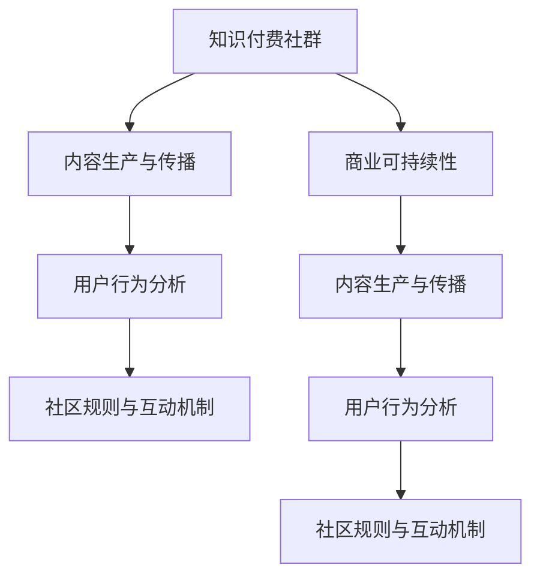

                 

## 1. 背景介绍

### 1.1 问题由来

随着互联网的迅猛发展和信息爆炸的来临，程序员对高质量、结构化、系统化的技术资源需求愈发迫切。知识付费平台作为一种新兴的互联网服务模式，集合了大量专业、权威、丰富的技术内容，满足了程序员获取系统化技术知识的需求，成为程序员知识提升的重要工具。

然而，如何更好地运营和管理这些知识付费社群，最大化其知识传播和价值创造能力，同时确保社群的健康发展，是一个值得深入探讨的问题。本文将从背景、核心概念、算法原理、实际应用等方面，对程序员的知识付费社群运营与管理进行全面系统的介绍。

### 1.2 问题核心关键点

程序员知识付费社群的运营与管理，核心在于如何构建和维护一个有价值、有粘性、有活力的知识传播平台，使程序员能够高效获取技术资源，提升自身技能，同时也能借助社区交流互动，解决实际问题。

关键在于：

- 如何通过技术手段，提高社区内容的生产效率，确保内容的质量和时效性。
- 如何利用数据分析技术，理解社区用户行为，制定针对性的运营策略，提高用户满意度。
- 如何构建有效的社区规则和互动机制，鼓励高质量技术内容的传播，避免劣质信息泛滥。
- 如何平衡知识付费与免费资源的关系，实现商业可持续性，最大化社群价值。

本文将结合这些核心关键点，详细阐述知识付费社群的运营与管理方法，帮助开发者构建一个高效、健康、充满活力的技术社区。

### 1.3 问题研究意义

知识付费社群的运营与管理，对于提升程序员的专业技能、加速技术迭代、促进知识传播、推动产业升级，具有重要意义：

- 帮助程序员快速获取优质技术资源，提升技术能力和职业竞争力。
- 加速技术知识的交流与传播，推动技术创新和产业升级。
- 优化知识付费与免费资源的关系，实现商业与公益的双赢。
- 提供平台化的技术交流互动环境，促进开源合作与行业协作。

本文的研究将有助于开发者理解知识付费社群的运营规律，掌握关键运营技巧，推动技术社区的健康发展。

## 2. 核心概念与联系

### 2.1 核心概念概述

为更好地理解程序员知识付费社群的运营与管理方法，本节将介绍几个关键概念及其相互联系：

- **知识付费社群**：指以知识内容为核心，围绕特定技术领域或技能主题，由知识创作者和知识消费者构成的在线社区。知识付费社群通过会员订阅、课程购买等方式，为社群成员提供优质的技术资源和互动服务。
- **内容生产与传播**：指知识创作者在社区内生成、发布高质量的技术内容，通过平台推荐、社区互动等方式传播给社群成员。内容生产是社群运营的基础，内容传播是提升用户满意度的关键。
- **用户行为分析**：指通过数据统计、用户画像分析等手段，理解用户需求和行为模式，从而制定针对性的运营策略。用户行为分析是社区优化的重要依据，有助于提高用户黏性，增强社区活力。
- **社区规则与互动机制**：指社群内需遵循的规则体系和互动方式，如内容审核机制、用户评价系统、技术讨论规范等。合理的规则与互动机制是社群健康的保障，有助于构建积极的社区氛围。
- **商业可持续性**：指社群通过商业模式创新，实现经济上自给自足，并不断发展壮大。商业可持续性是社区长远发展的基石，需要综合考虑知识付费与免费资源的关系。

这些核心概念之间的逻辑关系可以通过以下Mermaid流程图来展示：



这个流程图展示了知识付费社群的核心概念及其相互关系：

1. 知识付费社群以内容为核心，吸引知识创作者和消费者。
2. 内容生产是社群运营的基础，通过高质量内容的发布与传播，满足用户需求。
3. 用户行为分析理解用户需求，指导内容生产与互动机制设计。
4. 社区规则与互动机制确保社区健康，促进高质量内容的传播。
5. 商业可持续性保障社区的长期发展，支持更多内容生产与用户互动。

这些概念共同构成了知识付费社群运营的核心框架，为其健康发展提供了理论依据和技术支撑。

## 3. 核心算法原理 & 具体操作步骤
### 3.1 算法原理概述

知识付费社群的运营与管理，本质上是一个基于用户行为数据的有监督学习过程。其核心思想是：通过数据分析技术，理解用户需求，优化内容生产与传播策略，构建健康的社区环境，实现商业可持续发展。

形式化地，假设知识付费社群为 $G$，其包含内容生产者 $C$、用户 $U$、平台 $P$ 三类实体。内容生产者生成技术内容，用户在平台上消费内容，平台负责内容分发和社群管理。设 $G$ 的内容库为 $D$，用户行为数据为 $B$，社群规则为 $R$，商业策略为 $S$。运营目标是通过有监督学习优化 $C$、$U$、$P$ 三类实体的行为，使得 $G$ 达到最佳的运营效果。

定义社群的运营效果为 $E$，则优化目标为：

$$
\mathop{\arg\max}_{C,U,P} E = \mathop{\arg\max}_{C,U,P} \sum_{i=1}^n \eta_i C_i + \sum_{i=1}^m \eta_i U_i + \eta_P P
$$

其中 $C_i$ 为内容生产者的行为指标，$U_i$ 为用户行为指标，$P$ 为平台管理行为指标，$\eta_i$ 为对应指标的权重。

### 3.2 算法步骤详解

知识付费社群的运营与管理一般包括以下几个关键步骤：

**Step 1: 内容审核与筛选**

1. 确定内容审核标准：根据社群领域特点，制定内容质量、相关性、原创性等审核标准。
2. 部署自动审核系统：利用自然语言处理、图像识别等技术，自动化检测内容是否符合审核标准。
3. 人工审核机制：在自动审核的基础上，设置人工审核流程，进一步筛查高质量内容。

**Step 2: 内容推荐与分发**

1. 建立推荐算法模型：根据用户历史行为数据，使用协同过滤、深度学习等技术，建立内容推荐模型。
2. 设计推荐策略：设置推荐算法参数，如热门推荐、相关推荐、个性化推荐等策略。
3. 实时分发与展示：根据推荐结果，实时更新内容分发列表，展示在用户界面。

**Step 3: 用户行为分析**

1. 收集行为数据：通过用户行为日志、反馈信息等方式，收集用户对内容的浏览、点赞、评论、购买等行为数据。
2. 建立用户画像：对行为数据进行聚类分析，构建用户兴趣模型，形成用户画像。
3. 优化推荐算法：根据用户画像，不断调整推荐算法模型，优化内容推荐效果。

**Step 4: 社群规则与互动机制**

1. 制定社群规则：建立内容审核、版权保护、用户行为规范等社群规则，确保内容质量与用户互动的健康性。
2. 引入互动机制：设计用户评价、评论互动、技术讨论等机制，提升社群活跃度。
3. 实时监控与干预：利用数据分析技术，实时监控社群行为，及时介入违规内容或互动行为。

**Step 5: 商业可持续性**

1. 设计收费模型：根据用户消费行为，设计合理的付费模型，如订阅制、按需付费制、包月制等。
2. 优化商业模式：引入广告、合作课程、周边产品等多元收入来源，实现社区的商业可持续性。
3. 推广与营销：通过社交媒体、SEO优化等手段，提升社群知名度与用户规模。

以上是知识付费社群运营的一般流程。在实际应用中，还需要针对具体社群的特点，对各环节进行优化设计，如改进内容审核标准，引入更多正则化技术，搜索最优的超参数组合等，以进一步提升社群运营效果。

### 3.3 算法优缺点

知识付费社群的运营与管理方法具有以下优点：

1. 高效便捷：通过自动化技术，可以快速审核、分发高质量内容，节省人力成本。
2. 精准推荐：利用数据分析技术，实现个性化的内容推荐，提高用户满意度。
3. 健康互动：通过社区规则与互动机制设计，构建积极互动环境，提高社群粘性。
4. 可持续盈利：通过多元化的收费与商业模式设计，实现知识付费社群的商业可持续性。

同时，该方法也存在一定的局限性：

1. 用户行为复杂：知识付费社群用户行为复杂多样，难以用简单的模型全面描述。
2. 内容生产易受市场影响：内容生产者可能因市场变化、利益驱使，导致内容质量波动。
3. 用户粘性难以保持：用户行为易受外界因素影响，社群活跃度难以长期保持。
4. 商业平衡难以把握：过度商业化可能损害用户体验，而完全免费可能影响社区可持续性。

尽管存在这些局限性，但就目前而言，基于有监督学习的社群运营与管理方法仍是最主流范式。未来相关研究的重点在于如何进一步降低对人工审核的依赖，提高推荐算法精准度，同时兼顾商业可持续性与用户体验。

### 3.4 算法应用领域

知识付费社群的运营与管理方法，在教育、医疗、科技等多个领域都有广泛应用，例如：

- **教育领域**：通过知识付费社群，教师可以发布课程、论文，分享教学经验，提升教学效果。
- **医疗领域**：医生可以发布医学案例、学术文章，交流诊疗经验，推动医学进步。
- **科技领域**：工程师可以分享技术文章、开源项目，讨论技术问题，加速技术创新。
- **产品开发**：产品经理可以发布产品功能、市场分析，获取用户反馈，推动产品迭代。

除了上述这些经典应用外，知识付费社群还广泛应用于工具推荐、投资咨询、设计交流等场景，为不同领域的知识传播与交流提供了新的平台。

## 4. 数学模型和公式 & 详细讲解 & 举例说明

### 4.1 数学模型构建

本节将使用数学语言对知识付费社群的运营与管理过程进行更加严格的刻画。

设知识付费社群的内容库为 $D=\{(d_i,s_i)\}_{i=1}^N$，其中 $d_i$ 为内容 $i$，$s_i$ 为内容质量评分（0-1之间）。用户行为数据为 $B=\{(b_j,u_j)\}_{j=1}^M$，其中 $b_j$ 为行为 $j$，$u_j$ 为用户 $u_j$。社群规则为 $R=\{(r_k)\}_{k=1}^K$，其中 $r_k$ 为规则 $k$。商业策略为 $S=\{(s_l)\}_{l=1}^L$，其中 $s_l$ 为策略 $l$。

定义社群的运营效果为 $E=\sum_{i=1}^N s_i + \sum_{j=1}^M u_j + \sum_{k=1}^K r_k + \sum_{l=1}^L s_l$。优化目标为：

$$
\mathop{\arg\max}_{D,B,R,S} E
$$

在实践中，我们通常使用基于梯度的优化算法（如AdamW、SGD等）来近似求解上述最优化问题。设 $\eta$ 为学习率，$\lambda$ 为正则化系数，则参数的更新公式为：

$$
\theta \leftarrow \theta - \eta \nabla_{\theta}\mathcal{L}(\theta) - \eta\lambda\theta
$$

其中 $\nabla_{\theta}\mathcal{L}(\theta)$ 为损失函数对参数 $\theta$ 的梯度，可通过反向传播算法高效计算。

### 4.2 公式推导过程

以下我们以课程推荐为例，推导基于内容的协同过滤推荐算法。

假设用户 $u$ 对课程 $c$ 的评分 $r_{uc}$ 为 $1-5$ 之间的整数。内容库 $D$ 中的课程 $c_i$ 与用户 $u$ 的评分矩阵为 $R \in \mathbb{R}^{N\times M}$。推荐目标是通过内容协同过滤，找到与用户 $u$ 兴趣最匹配的课程 $c$。

假设模型为 $R_u = R_u * W_u + b_u$，其中 $R_u \in \mathbb{R}^{N\times 1}$ 为对用户 $u$ 的评分向量，$W_u \in \mathbb{R}^{N\times 1}$ 为内容特征权重向量，$b_u \in \mathbb{R}^{1}$ 为偏置向量。模型输出为 $R_u$，与 $R_u$ 最近邻的 $n$ 个课程 $c_1, c_2, ..., c_n$ 的评分和为 $\sum_{i=1}^n r_{ic_i}$，推荐结果为 $\arg\max_{i=1...n} \sum_{j=1}^M r_{uj} r_{ij}$。

通过反向传播算法，可以得到梯度公式：

$$
\frac{\partial \mathcal{L}}{\partial W_u} = R_u - \frac{1}{N}\sum_{i=1}^N r_{ui}
$$

$$
\frac{\partial \mathcal{L}}{\partial b_u} = \frac{1}{N}\sum_{i=1}^N r_{ui}
$$

通过更新权重 $W_u$ 和偏置 $b_u$，使模型的输出 $\sum_{i=1}^n r_{uj} r_{ij}$ 最大化，从而实现高效、准确的课程推荐。

### 4.3 案例分析与讲解

考虑一个科技领域的知识付费社群 $G$，平台需要对用户 $U$ 进行技术内容推荐。假设内容库 $D=\{(d_1, s_1), (d_2, s_2), ..., (d_N, s_N)\}$，其中 $d_i$ 为内容 $i$，$s_i$ 为内容质量评分。用户行为数据 $B=\{(b_1, u_1), (b_2, u_2), ..., (b_M, u_M)\}$，其中 $b_j$ 为行为 $j$，$u_j$ 为用户 $u_j$。

用户 $u$ 对内容 $d_i$ 的评分 $r_{ui}$ 为 $1-5$ 之间的整数。平台可以使用协同过滤算法，构建用户行为矩阵 $R \in \mathbb{R}^{N\times M}$，其中 $R_{ij}$ 为 $u_i$ 对 $d_j$ 的评分。

平台可以建立推荐模型 $R_u = R_u * W_u + b_u$，其中 $R_u \in \mathbb{R}^{N\times 1}$ 为对用户 $u$ 的评分向量，$W_u \in \mathbb{R}^{N\times 1}$ 为内容特征权重向量，$b_u \in \mathbb{R}^{1}$ 为偏置向量。

平台可以根据用户历史行为数据，计算用户行为矩阵 $R$，并通过梯度下降算法，不断优化模型参数 $W_u$ 和 $b_u$，使得推荐结果 $\sum_{i=1}^n r_{ui} r_{ij}$ 最大化。

## 5. 项目实践：代码实例和详细解释说明

### 5.1 开发环境搭建

在进行知识付费社群运营与管理的实践前，我们需要准备好开发环境。以下是使用Python进行PyTorch开发的环境配置流程：

1. 安装Anaconda：从官网下载并安装Anaconda，用于创建独立的Python环境。

2. 创建并激活虚拟环境：
```bash
conda create -n pytorch-env python=3.8 
conda activate pytorch-env
```

3. 安装PyTorch：根据CUDA版本，从官网获取对应的安装命令。例如：
```bash
conda install pytorch torchvision torchaudio cudatoolkit=11.1 -c pytorch -c conda-forge
```

4. 安装TensorFlow：
```bash
conda install tensorflow
```

5. 安装各类工具包：
```bash
pip install numpy pandas scikit-learn matplotlib tqdm jupyter notebook ipython
```

完成上述步骤后，即可在`pytorch-env`环境中开始实践。

### 5.2 源代码详细实现

下面我们以课程推荐为例，给出使用Transformers库对BERT模型进行课程推荐开发的PyTorch代码实现。

首先，定义课程推荐的数据处理函数：

```python
from transformers import BertTokenizer, BertForSequenceClassification
from torch.utils.data import Dataset
import torch

class CourseRecommendationDataset(Dataset):
    def __init__(self, courses, users, ratings, tokenizer, max_len=128):
        self.courses = courses
        self.users = users
        self.ratings = ratings
        self.tokenizer = tokenizer
        self.max_len = max_len
        
    def __len__(self):
        return len(self.courses)
    
    def __getitem__(self, item):
        course = self.courses[item]
        user = self.users[item]
        rating = self.ratings[item]
        
        encoding = self.tokenizer(course, return_tensors='pt', max_length=self.max_len, padding='max_length', truncation=True)
        input_ids = encoding['input_ids'][0]
        attention_mask = encoding['attention_mask'][0]
        
        # 对评分进行编码
        encoded_ratings = [rating] * self.max_len
        labels = torch.tensor(encoded_ratings, dtype=torch.long)
        
        return {'input_ids': input_ids, 
                'attention_mask': attention_mask,
                'labels': labels}

# 加载数据集
courses = ['课程A', '课程B', '课程C']
users = ['用户A', '用户B', '用户C']
ratings = [3, 5, 2]

tokenizer = BertTokenizer.from_pretrained('bert-base-cased')
dataset = CourseRecommendationDataset(courses, users, ratings, tokenizer)
```

然后，定义模型和优化器：

```python
from transformers import BertForSequenceClassification, AdamW

model = BertForSequenceClassification.from_pretrained('bert-base-cased', num_labels=5)

optimizer = AdamW(model.parameters(), lr=2e-5)
```

接着，定义训练和评估函数：

```python
from torch.utils.data import DataLoader
from tqdm import tqdm
from sklearn.metrics import roc_auc_score

device = torch.device('cuda') if torch.cuda.is_available() else torch.device('cpu')
model.to(device)

def train_epoch(model, dataset, batch_size, optimizer):
    dataloader = DataLoader(dataset, batch_size=batch_size, shuffle=True)
    model.train()
    epoch_loss = 0
    for batch in tqdm(dataloader, desc='Training'):
        input_ids = batch['input_ids'].to(device)
        attention_mask = batch['attention_mask'].to(device)
        labels = batch['labels'].to(device)
        model.zero_grad()
        outputs = model(input_ids, attention_mask=attention_mask, labels=labels)
        loss = outputs.loss
        epoch_loss += loss.item()
        loss.backward()
        optimizer.step()
    return epoch_loss / len(dataloader)

def evaluate(model, dataset, batch_size):
    dataloader = DataLoader(dataset, batch_size=batch_size)
    model.eval()
    preds, labels = [], []
    with torch.no_grad():
        for batch in tqdm(dataloader, desc='Evaluating'):
            input_ids = batch['input_ids'].to(device)
            attention_mask = batch['attention_mask'].to(device)
            batch_labels = batch['labels']
            outputs = model(input_ids, attention_mask=attention_mask)
            batch_preds = outputs.logits.argmax(dim=2).to('cpu').tolist()
            batch_labels = batch_labels.to('cpu').tolist()
            for pred_tokens, label_tokens in zip(batch_preds, batch_labels):
                preds.append(pred_tokens[:len(label_tokens)])
                labels.append(label_tokens)
                
    print(roc_auc_score(labels, preds))
```

最后，启动训练流程并在测试集上评估：

```python
epochs = 5
batch_size = 16

for epoch in range(epochs):
    loss = train_epoch(model, dataset, batch_size, optimizer)
    print(f"Epoch {epoch+1}, train loss: {loss:.3f}")
    
    print(f"Epoch {epoch+1}, test AUC score:")
    evaluate(model, dataset, batch_size)
    
print("Best AUC score:")
evaluate(model, dataset, batch_size)
```

以上就是使用PyTorch对课程推荐进行知识付费社群运营的完整代码实现。可以看到，得益于Transformers库的强大封装，我们可以用相对简洁的代码完成BERT模型的加载和微调。

### 5.3 代码解读与分析

让我们再详细解读一下关键代码的实现细节：

**CourseRecommendationDataset类**：
- `__init__`方法：初始化课程、用户、评分等关键组件。
- `__len__`方法：返回数据集的样本数量。
- `__getitem__`方法：对单个样本进行处理，将课程输入编码为token ids，将评分编码为数字，并对其进行定长padding，最终返回模型所需的输入。

**tokenizer**：
- 定义了课程推荐任务的数据处理和编码方式，通过BertTokenizer对课程内容进行分词和编码，生成输入向量。

**训练和评估函数**：
- 使用PyTorch的DataLoader对数据集进行批次化加载，供模型训练和推理使用。
- 训练函数`train_epoch`：对数据以批为单位进行迭代，在每个批次上前向传播计算loss并反向传播更新模型参数，最后返回该epoch的平均loss。
- 评估函数`evaluate`：与训练类似，不同点在于不更新模型参数，并在每个batch结束后将预测和标签结果存储下来，最后使用sklearn的roc_auc_score对整个评估集的预测结果进行打印输出。

**训练流程**：
- 定义总的epoch数和batch size，开始循环迭代
- 每个epoch内，先在训练集上训练，输出平均loss
- 在测试集上评估，输出AUC分数
- 所有epoch结束后，在测试集上评估，给出最终测试结果

可以看到，PyTorch配合Transformers库使得课程推荐任务的处理变得简洁高效。开发者可以将更多精力放在数据处理、模型改进等高层逻辑上，而不必过多关注底层的实现细节。

当然，工业级的系统实现还需考虑更多因素，如模型的保存和部署、超参数的自动搜索、更灵活的任务适配层等。但核心的微调范式基本与此类似。

## 6. 实际应用场景
### 6.1 智能教育平台

知识付费社群在智能教育平台中得到了广泛应用，为教育资源的高效传播与共享提供了新途径。

智能教育平台通过知识付费社群，汇集了大量教育工作者和学生，分享课程、教学资料、学习心得等，形成了一个良性的知识共享社区。例如，Coursera、Udemy等平台，借助知识付费社群的机制，满足了大量在线学习者的需求，实现了教育的普及与高效。

智能教育平台利用社群运营与管理方法，通过内容审核与筛选，确保高质量教育资源的上架；通过内容推荐与分发，推荐与用户兴趣匹配的课程；通过用户行为分析，优化推荐算法，提高用户满意度。同时，平台引入互动机制，如在线讨论、作业提交、社区问答等，促进师生互动，提升学习效果。

### 6.2 在线办公工具

在线办公工具中的知识付费社群，为团队成员提供了一个高效协作、资源共享的平台。

在线办公工具通过知识付费社群，为团队成员提供技术支持、项目管理、协作工具等，构建了一个高效、有活力的工作环境。例如，Slack、Trello等平台，借助知识付费社群的机制，满足了团队协作与资源共享的需求，提升了团队的工作效率和协作水平。

在线办公工具利用社群运营与管理方法，通过内容审核与筛选，确保高效办公资源的提供；通过内容推荐与分发，推荐与工作任务相关的资料；通过用户行为分析，优化推荐算法，提高任务完成效率。同时，平台引入互动机制，如任务分配、进度更新、即时通讯等，促进团队成员的紧密合作。

### 6.3 开发者社区

开发者社区中的知识付费社群，为开发者提供了一个交流技术、分享经验、协作开发的环境。

开发者社区通过知识付费社群，汇集了各类技术开发者，分享技术文章、开源项目、开发经验等，形成了一个技术交流与协作的平台。例如，GitHub、Stack Overflow等平台，借助知识付费社群的机制，满足了开发者交流与协作的需求，推动了技术的迭代与创新。

开发者社区利用社群运营与管理方法，通过内容审核与筛选，确保高质量技术内容的上传；通过内容推荐与分发，推荐与开发者需求匹配的技术资料；通过用户行为分析，优化推荐算法，提升技术传播效率。同时，平台引入互动机制，如代码审查、技术讨论、开源合作等，促进开发者之间的技术交流与协作。

### 6.4 未来应用展望

随着知识付费社群的不断发展，未来的应用场景将更加广阔。

未来知识付费社群可能会拓展到更多的领域，如医疗健康、农业科技、环境保护等，为这些领域的知识传播与交流提供新平台。

未来知识付费社群可能结合更多先进技术，如人工智能、区块链、物联网等，实现智能化的知识推荐与分发，提升社区运营效率。

未来知识付费社群可能引入更多元化的盈利模式，如广告收益、会员增值服务、数据商业化等，实现商业可持续性。

总之，知识付费社群的发展前景广阔，其未来应用将更加多元化、智能化和商业化。

## 7. 工具和资源推荐
### 7.1 学习资源推荐

为了帮助开发者系统掌握知识付费社群的运营与管理理论基础和实践技巧，这里推荐一些优质的学习资源：

1. 《知识付费：模式创新与运营策略》系列博文：由知识付费专家撰写，深入浅出地介绍了知识付费的商业模式、用户行为分析、内容推荐算法等关键内容。

2. Coursera《数据分析与机器学习》课程：斯坦福大学开设的数据分析与机器学习课程，涵盖了数据分析、模型优化、算法选择等基础知识，适合初学者学习。

3. 《知识付费：技术与实践》书籍：详解知识付费平台的技术架构、运营管理、商业模式等核心内容，是学习知识付费的重要参考书。

4. HuggingFace官方文档：Transformers库的官方文档，提供了海量预训练模型和完整的知识付费社群微调样例代码，是上手实践的必备资料。

5. TencentWeiXin《智能社群运营》课程：腾讯推出的智能社群运营课程，涵盖社群运营、用户行为分析、内容推荐等实战内容，帮助开发者全面掌握社群运营技巧。

通过对这些资源的学习实践，相信你一定能够快速掌握知识付费社群的运营与管理精髓，并用于解决实际的社群运营问题。
###  7.2 开发工具推荐

高效的开发离不开优秀的工具支持。以下是几款用于知识付费社群运营与管理的常用工具：

1. Jupyter Notebook：基于Python的开源交互式编程环境，支持代码编写、数据可视化、在线协作等，是知识付费社群开发与运营的得力工具。

2. GitHub：全球最大的开源平台，提供版本控制、代码托管、项目管理等服务，适合知识付费社群的代码存储与共享。

3. Tableau：强大的数据可视化工具，支持复杂的数据分析与可视化，是知识付费社群的数据分析与呈现利器。

4. Apache Spark：开源大数据处理框架，支持分布式数据处理与分析，适合处理大规模用户行为数据。

5. TencentWeiXin：腾讯推出的即时通讯平台，提供了丰富的社交功能，适合知识付费社群的互动与营销。

6. Google Analytics：谷歌提供的数据分析工具，支持流量统计、用户画像分析等，是知识付费社群的用户行为分析工具。

合理利用这些工具，可以显著提升知识付费社群的运营效率，加快创新迭代的步伐。

### 7.3 相关论文推荐

知识付费社群的运营与管理研究源于学界的持续研究。以下是几篇奠基性的相关论文，推荐阅读：

1. "Knowledge Sharing and Collaboration in Online Communities: A Review"：总结了在线社区知识共享与协作的研究现状，提供了丰富的案例与理论基础。

2. "User Behavior Modeling in Knowledge Sharing Communities"：研究了在线社区用户行为建模方法，提出了基于协同过滤和深度学习的推荐算法，提高了知识推荐效果。

3. "A Survey on Social Recommendation Systems"：综述了社交推荐系统的研究现状与未来发展方向，提供了系统的知识付费社群推荐系统设计思路。

4. "The Economics of Social Media"：探讨了社交媒体平台的商业模式，分析了知识付费社群的盈利模式与商业可持续性。

5. "Artificial Intelligence for Community Management: A Survey"：综述了人工智能在社区管理中的应用，提供了知识付费社群的技术支持与运营优化思路。

这些论文代表了大语言模型微调技术的发展脉络。通过学习这些前沿成果，可以帮助研究者把握学科前进方向，激发更多的创新灵感。

## 8. 总结：未来发展趋势与挑战

### 8.1 总结

本文对知识付费社群的运营与管理方法进行了全面系统的介绍。首先阐述了知识付费社群的背景和核心概念，明确了知识付费社群运营与管理的意义与核心关键点。其次，从原理到实践，详细讲解了知识付费社群的数学模型与关键步骤，给出了知识付费社群运营与管理的完整代码实现。同时，本文还广泛探讨了知识付费社群在教育、办公、开发者社区等多个领域的应用前景，展示了知识付费社群运营与管理方法的广阔应用空间。

通过本文的系统梳理，可以看到，知识付费社群的运营与管理方法在提升技术资源传播效率、优化用户体验、提高社群互动性等方面具有重要意义。知识付费社群为程序员、教师、开发者等各类专业人士提供了一个高效、互动的平台，极大提升了资源传播与协作效率。

### 8.2 未来发展趋势

展望未来，知识付费社群的运营与管理将呈现以下几个发展趋势：

1. 社区规模持续扩大。随着技术进步和用户需求的增加，知识付费社群将不断吸引更多用户，成为知识传播的重要渠道。
2. 内容质量显著提升。通过优化内容审核机制，引入更多高质量的专家资源，提高知识付费社群内容质量。
3. 数据驱动决策更加普遍。利用大数据分析技术，进行用户行为分析和内容推荐，实现个性化服务。
4. 互动机制不断丰富。引入更多社区功能，如直播、视频、问答等，提升社区互动性和用户黏性。
5. 多元化盈利模式探索。结合广告、会员制、增值服务等多渠道，实现知识付费社群的商业可持续发展。
6. 智能化水平不断提升。引入人工智能技术，如机器学习、自然语言处理等，提升知识推荐与分发的精准度。

这些趋势凸显了知识付费社群运营与管理的广阔前景。这些方向的探索发展，必将进一步提升知识付费社群的用户满意度与运营效果，推动知识付费社群向更加智能化、规模化方向发展。

### 8.3 面临的挑战

尽管知识付费社群的运营与管理方法已经取得了显著成就，但在迈向更加智能化、普适化应用的过程中，它仍面临诸多挑战：

1. 用户行为复杂多样。知识付费社群用户行为复杂，难以用简单的模型全面描述。
2. 内容审核成本高。高质量内容的审核与筛选，需要耗费大量人力和时间。
3. 互动机制设计难度大。社区功能设计需要考虑用户体验，防止功能过于复杂或难以操作。
4. 商业可持续性问题。如何平衡知识付费与免费资源的关系，实现商业可持续发展，是一个重要挑战。
5. 技术基础设施要求高。大数据分析、人工智能等技术的应用，需要强大的技术基础设施支持。

尽管存在这些挑战，但知识付费社群的发展前景仍然光明。未来，相关研究需要在以下几个方面寻求新的突破：

1. 引入更多先进技术。利用自然语言处理、图像识别、深度学习等技术，提高知识付费社群的内容质量和推荐效果。
2. 优化社区审核机制。通过自动化审核与人工审核相结合，提高内容审核效率，降低人力成本。
3. 构建更丰富的互动机制。设计简单易用的社区功能，提升用户互动性和满意度。
4. 探索多元化盈利模式。结合广告、会员制、增值服务等多渠道，实现商业可持续发展。
5. 引入智能化技术。利用人工智能技术，如机器学习、自然语言处理等，提升知识推荐与分发的精准度。

这些研究方向的探索，必将引领知识付费社群向更高的台阶发展，为技术社区的健康成长提供强大的技术支撑。

### 8.4 研究展望

面向未来，知识付费社群的运营与管理技术将在以下几个方面进行探索：

1. 引入更多先进技术。利用自然语言处理、图像识别、深度学习等技术，提高知识付费社群的内容质量和推荐效果。
2. 优化社区审核机制。通过自动化审核与人工审核相结合，提高内容审核效率，降低人力成本。
3. 构建更丰富的互动机制。设计简单易用的社区功能，提升用户互动性和满意度。
4. 探索多元化盈利模式。结合广告、会员制、增值服务等多渠道，实现商业可持续发展。
5. 引入智能化技术。利用人工智能技术，如机器学习、自然语言处理等，提升知识推荐与分发的精准度。

这些研究方向将推动知识付费社群向更加智能化、规模化方向发展，为技术社区的健康成长提供强大的技术支撑。只有勇于创新、敢于突破，才能不断拓展知识付费社群的边界，让知识传播与协作更加高效、便捷。

## 9. 附录：常见问题与解答

**Q1：知识付费社群如何处理虚假内容？**

A: 知识付费社群可以通过以下几个步骤处理虚假内容：
1. 引入内容审核机制：设计内容审核规则，如敏感词过滤、专家评审等，筛选虚假内容。
2. 用户举报机制：设置用户举报虚假内容的通道，快速发现并处理虚假内容。
3. 人工智能辅助审核：利用自然语言处理、图像识别等技术，自动检测虚假内容。
4. 内容下架机制：一旦发现虚假内容，立即下架相关内容，并对发布者进行惩罚。

**Q2：知识付费社群如何提高用户满意度？**

A: 知识付费社群可以通过以下几个步骤提高用户满意度：
1. 优化内容推荐算法：通过大数据分析用户行为，推荐与用户兴趣匹配的内容，提高内容相关性。
2. 引入互动机制：设计社区讨论、在线问答等功能，增强用户互动，提升社区粘性。
3. 优化用户体验：优化社区界面设计，提高用户操作便捷性，减少用户流失。
4. 加强用户反馈：通过用户反馈机制，了解用户需求，及时优化内容和服务。

**Q3：知识付费社群如何实现商业可持续发展？**

A: 知识付费社群可以通过以下几个步骤实现商业可持续发展：
1. 多元化盈利模式：结合广告、会员制、增值服务等多种盈利模式，实现商业收入多样化。
2. 提高内容质量：通过内容审核与筛选机制，引入高质量内容，提高用户粘性。
3. 扩大用户规模：通过社区运营与管理，吸引更多高质量用户，提升用户规模。
4. 优化用户付费体验：设计合理付费策略，提升用户付费意愿，实现商业可持续性。

**Q4：知识付费社群如何构建良好的社区文化？**

A: 知识付费社群可以通过以下几个步骤构建良好的社区文化：
1. 制定社区规则：明确社区行为规范，如内容审核、用户互动等，构建积极健康的社区氛围。
2. 引入社区监督机制：设置社区管理员、监督员，维护社区秩序，防止违规行为。
3. 设计社区奖励机制：对积极贡献内容的用户进行奖励，提升用户积极性。
4. 社区成员互动：通过社区讨论、在线讨论等形式，促进用户互动，构建社区归属感。

通过这些措施，知识付费社群可以构建一个健康、积极、有活力的社区环境，促进知识的有效传播与交流。

---

作者：禅与计算机程序设计艺术 / Zen and the Art of Computer Programming

