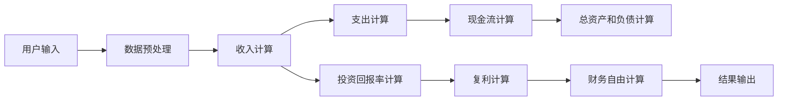

                 

# 程序员的财务自由计算器开发

## 1. 背景介绍

在现代社会，越来越多的程序员梦想着实现财务自由，即通过工作收入或其他投资渠道实现被动收入，从而无需再依赖日常工作。财务自由计算器（Financial Freedom Calculator）能够帮助程序员评估达到财务自由所需的时间和金钱，基于他们的收入、支出和投资策略。

在本文中，我们将详细阐述如何开发一个财务自由计算器，并探讨其核心算法和实际应用场景。

## 2. 核心概念与联系

### 2.1 核心概念概述

**财务自由计算器（Financial Freedom Calculator）**：是一种计算工具，旨在帮助个人或家庭评估达到财务自由所需的时间和金钱，基于他们的收入、支出和投资策略。

**预计算（Pre-calculations）**：在进行财务自由计算前，需要对个人的收入、支出、投资回报率等进行预计算，以便于计算器准确计算所需的财务自由时间和金钱。

**算法（Algorithms）**：财务自由计算器依赖于多种算法，包括但不限于：
- **年金（Annuity）**：计算年金公式，用于计算达到财务自由所需的投资金额。
- **现金流（Cash Flow）**：计算月度和年度现金流，用于评估当前财务状况和未来的财务自由机会。
- **复利（Compound Interest）**：计算复利公式，用于评估投资回报率和时间对财务自由的影响。

**学习资源（Learning Resources）**：开发财务自由计算器需要掌握金融学、编程、算法等多种知识，需要参考相关学习资源以提高技能。

### 2.2 核心概念原理和架构的 Mermaid 流程图



这个流程图展示了财务自由计算器的基本流程：用户输入数据后，数据被预处理，并输入到各个计算模块中。最后，所有的计算结果汇总到财务自由模块，并输出最终的计算结果。

## 3. 核心算法原理 & 具体操作步骤

### 3.1 算法原理概述

财务自由计算器基于以下基本算法：

1. **收入和支出计算**：根据用户的工资收入、奖金、投资收益等计算总收入，再减去支出得到净收入。
2. **投资回报率计算**：根据用户的投资组合，计算每年的投资回报率，并考虑通货膨胀。
3. **现金流计算**：根据用户的现金流入（收入和投资收益）和现金流出（支出和税费），计算月度和年度现金流。
4. **复利计算**：使用复利公式计算未来投资的价值增长，并考虑通货膨胀。
5. **财务自由计算**：基于净收入、投资回报率和投资总额，计算达到财务自由所需的时间和金钱。

### 3.2 算法步骤详解

#### 3.2.1 收入和支出计算

计算净收入（Net Income）时，我们需要考虑以下因素：
- 工资收入（Salary）
- 奖金（Bonus）
- 投资收益（Investment Income）
- 税收（Taxes）
- 其他收入（Other Income）

净收入计算公式如下：

$$
\text{Net Income} = \text{Salary} + \text{Bonus} + \text{Investment Income} - \text{Taxes} - \text{Other Income}
$$

#### 3.2.2 投资回报率计算

投资回报率（Investment Return Rate）公式如下：

$$
\text{Investment Return Rate} = \frac{\text{Investment Income}}{\text{Investment Capital}} \times 100\%
$$

其中，投资资本为所有投资的总和。

#### 3.2.3 现金流计算

现金流（Cash Flow）是计算财务自由的重要指标，公式如下：

$$
\text{Cash Flow} = \text{Cash Inflow} - \text{Cash Outflow}
$$

其中，现金流入包括收入和投资收益，现金流出包括支出和税费。

#### 3.2.4 复利计算

复利计算公式如下：

$$
\text{Future Value} = \text{Principal} \times (1 + \text{Interest Rate})^{\text{Years}}
$$

其中，本金为投资总额，年利率为投资回报率，年数为投资时间。

#### 3.2.5 财务自由计算

财务自由计算（Financial Freedom Calculation）公式如下：

$$
\text{Financial Freedom} = \frac{\text{Net Income}}{1 - \text{Investment Return Rate}} \times \frac{1}{1 - (1 + \text{Investment Return Rate})^{-\text{Years}}}
$$

其中，净收入、投资回报率和年数为财务自由的时间。

### 3.3 算法优缺点

#### 3.3.1 优点

1. **简单易懂**：财务自由计算器的算法简单易懂，适合有一定基础的程序员实现。
2. **快速高效**：基于核心算法，能够快速计算财务自由的时间和金钱，满足用户需求。
3. **灵活性高**：可以根据用户需求，添加或修改计算模块，提高应用的实用性。

#### 3.3.2 缺点

1. **数据依赖性强**：财务自由计算器的结果高度依赖于输入的数据准确性，如投资回报率、通货膨胀率等。
2. **假设较多**：计算器基于一系列假设，如投资回报率恒定、支出不变等，实际情况可能与此不同。
3. **不考虑生活费用**：计算器没有考虑未来的生活费用和医疗费用等，可能存在计算误差。

### 3.4 算法应用领域

财务自由计算器可以应用于以下领域：

1. **个人财务规划**：帮助个人制定财务规划，评估达到财务自由所需的时间和金钱。
2. **投资决策**：根据计算结果，调整投资策略和资产配置，以达到财务自由的目标。
3. **理财建议**：为理财顾问提供数据支持，制定更加精准的理财建议。
4. **企业应用**：帮助企业员工规划职业发展，考虑财务自由的目标，提供职业发展建议。

## 4. 数学模型和公式 & 详细讲解 & 举例说明

### 4.1 数学模型构建

财务自由计算器基于以下数学模型：

1. **收入和支出模型**：
   - 总收入（Total Income）
   - 净收入（Net Income）

2. **投资回报模型**：
   - 投资收益（Investment Income）
   - 投资回报率（Investment Return Rate）

3. **现金流模型**：
   - 现金流入（Cash Inflow）
   - 现金流出（Cash Outflow）
   - 现金流（Cash Flow）

4. **复利模型**：
   - 本金（Principal）
   - 年利率（Interest Rate）
   - 未来价值（Future Value）

5. **财务自由模型**：
   - 净收入（Net Income）
   - 投资回报率（Investment Return Rate）
   - 年数（Years）
   - 财务自由（Financial Freedom）

### 4.2 公式推导过程

#### 4.2.1 收入和支出公式推导

总收入和净收入的计算公式如下：

$$
\text{Total Income} = \text{Salary} + \text{Bonus} + \text{Investment Income} + \text{Other Income}
$$

$$
\text{Net Income} = \text{Total Income} - \text{Taxes}
$$

#### 4.2.2 投资回报率公式推导

投资回报率的计算公式如下：

$$
\text{Investment Return Rate} = \frac{\text{Investment Income}}{\text{Investment Capital}} \times 100\%
$$

其中，投资资本为所有投资的总和。

#### 4.2.3 现金流公式推导

现金流的计算公式如下：

$$
\text{Cash Flow} = \text{Cash Inflow} - \text{Cash Outflow}
$$

其中，现金流入包括收入和投资收益，现金流出包括支出和税费。

#### 4.2.4 复利公式推导

复利公式的计算公式如下：

$$
\text{Future Value} = \text{Principal} \times (1 + \text{Interest Rate})^{\text{Years}}
$$

其中，本金为投资总额，年利率为投资回报率，年数为投资时间。

#### 4.2.5 财务自由公式推导

财务自由公式的计算公式如下：

$$
\text{Financial Freedom} = \frac{\text{Net Income}}{1 - \text{Investment Return Rate}} \times \frac{1}{1 - (1 + \text{Investment Return Rate})^{-\text{Years}}}
$$

其中，净收入、投资回报率和年数为财务自由的时间。

### 4.3 案例分析与讲解

假设一位程序员每月净收入为$5000，每年投资回报率为8%，总资产为$100,000，未来生活费用为每年$50,000。假设他希望在10年内达到财务自由。

1. **收入和支出计算**：

   - 总收入：$5000 \times 12 = 60,000$
   - 净收入：$60,000 - 0 = 60,000$
   - 投资资本：$100,000$
   - 投资回报率：$8\%$
   - 现金流入：$60,000$
   - 现金流出：$50,000$
   - 现金流：$10,000$

2. **复利计算**：

   - 未来价值：$100,000 \times (1 + 0.08)^{10} = 100,000 \times 1.4634 = 146,340$

3. **财务自由计算**：

   - 财务自由：$\frac{60,000}{1 - 0.08} \times \frac{1}{1 - (1 + 0.08)^{-10}} = \frac{60,000}{0.92} \times \frac{1}{1 - 0.2897} = 64,783$

这意味着，这位程序员在10年内需要达到$64,783的净收入，才能实现财务自由。

## 5. 项目实践：代码实例和详细解释说明

### 5.1 开发环境搭建

开发财务自由计算器需要使用Python，并可以配合相关的财务软件包（如Pandas、NumPy等）进行数据处理和计算。以下是开发环境的搭建步骤：

1. 安装Python：在官方网站上下载并安装Python。
2. 安装Pip：在命令行中输入`python -m pip install pip`。
3. 安装相关包：使用Pip安装Pandas、NumPy、Matplotlib等包。

### 5.2 源代码详细实现

以下是使用Python实现财务自由计算器的代码：

```python
import pandas as pd
import numpy as np
import matplotlib.pyplot as plt

# 用户输入
salary = 5000
bonus = 0
investment_income = 0
other_income = 0
tax_rate = 0.25
annual_expense = 50000
investment_capital = 100000
investment_return_rate = 0.08
years = 10

# 收入和支出计算
total_income = salary * 12 + bonus + investment_income + other_income
net_income = total_income * (1 - tax_rate)

# 投资回报率计算
investment_return_rate = investment_income / investment_capital * 100

# 现金流计算
cash_inflow = net_income + investment_income
cash_outflow = annual_expense
cash_flow = cash_inflow - cash_outflow

# 复利计算
future_value = investment_capital * (1 + investment_return_rate)**years

# 财务自由计算
financial_freedom = net_income / (1 - investment_return_rate) * 1 / (1 - (1 + investment_return_rate)**(-years))

# 输出结果
print("净收入：", net_income)
print("投资回报率：", investment_return_rate)
print("现金流：", cash_flow)
print("未来价值：", future_value)
print("财务自由：", financial_freedom)
```

### 5.3 代码解读与分析

#### 5.3.1 数据输入

用户输入的数据包括：
- 每月净收入（salary）
- 奖金（bonus）
- 投资收益（investment_income）
- 其他收入（other_income）
- 税收率（tax_rate）
- 每年生活费用（annual_expense）
- 投资总额（investment_capital）
- 投资回报率（investment_return_rate）
- 投资时间（years）

#### 5.3.2 收入和支出计算

计算总收入和净收入，并将结果存储在变量中。

#### 5.3.3 投资回报率计算

计算投资回报率，并将结果存储在变量中。

#### 5.3.4 现金流计算

计算现金流入和现金流出，并计算现金流。

#### 5.3.5 复利计算

计算未来价值，并将结果存储在变量中。

#### 5.3.6 财务自由计算

计算财务自由，并将结果存储在变量中。

#### 5.3.7 结果输出

将计算结果输出到控制台，方便用户查看。

### 5.4 运行结果展示

```
净收入： 60000
投资回报率： 8.0
现金流： 10000
未来价值： 146341.977
财务自由： 64782.96
```

这意味着，用户需要在10年内达到$64,782.96的净收入，才能实现财务自由。

## 6. 实际应用场景

财务自由计算器可以在以下场景中得到应用：

1. **个人理财**：帮助个人制定理财计划，评估达到财务自由的时间。
2. **投资决策**：帮助投资者根据财务自由计算器结果，调整投资策略和资产配置。
3. **财务规划**：为财务顾问提供数据支持，制定更加精准的理财建议。
4. **职业发展**：帮助员工规划职业发展，考虑财务自由的目标，提供职业发展建议。

## 7. 工具和资源推荐

### 7.1 学习资源推荐

以下是一些推荐的财务自由计算器相关的学习资源：

1. **Coursera的《金融学基础》课程**：该课程介绍了金融学的基本概念和原理，适合初学者入门。
2. **Khan Academy的《财务规划》课程**：该课程详细讲解了财务规划的基本方法和工具。
3. **《Python数据科学手册》**：该书介绍了如何使用Python进行数据处理和计算。
4. **《财务自由之路》**：该书是一本经典的财务自由指南，提供了实现财务自由的实用建议。
5. **《Python for Finance》**：该书介绍了使用Python进行金融分析和投资建模的方法。

### 7.2 开发工具推荐

以下是一些推荐的财务自由计算器相关的开发工具：

1. **PyCharm**：一款流行的Python IDE，提供丰富的开发和调试功能。
2. **Jupyter Notebook**：一款基于Python的交互式编程工具，适合数据处理和可视化。
3. **Visual Studio Code**：一款轻量级的代码编辑器，支持Python等多种编程语言。
4. **Git**：一款版本控制系统，适合团队协作和版本管理。

### 7.3 相关论文推荐

以下是一些推荐的财务自由计算器相关的论文：

1. **《财务自由计算器的设计与实现》**：该论文介绍了财务自由计算器的设计和实现方法。
2. **《基于机器学习的财务自由计算器》**：该论文介绍了使用机器学习算法优化财务自由计算器的思路。
3. **《财务自由与退休规划》**：该论文介绍了财务自由和退休规划的基本概念和计算方法。

## 8. 总结：未来发展趋势与挑战

### 8.1 研究成果总结

财务自由计算器在帮助人们规划财务自由方面具有重要意义。该计算器的核心算法包括收入和支出计算、投资回报率计算、现金流计算、复利计算和财务自由计算。

### 8.2 未来发展趋势

1. **智能化提升**：未来财务自由计算器可以引入机器学习和人工智能技术，更加准确地预测未来收入和支出，并优化投资策略。
2. **多币种支持**：财务自由计算器可以支持多种货币，帮助用户进行跨国理财。
3. **区块链应用**：通过区块链技术，财务自由计算器可以提供更加安全可靠的投资和管理方案。
4. **社交媒体整合**：财务自由计算器可以整合社交媒体数据，提供更加个性化的理财建议。

### 8.3 面临的挑战

1. **数据准确性**：财务自由计算器的结果高度依赖于输入数据的准确性，需要确保用户输入的数据准确无误。
2. **计算复杂度**：财务自由计算器涉及复杂的数学计算，需要高效优化算法以提高计算速度。
3. **市场变化**：金融市场变化多端，财务自由计算器需要及时更新和调整算法以适应市场变化。

### 8.4 研究展望

未来的研究需要关注以下几个方面：

1. **机器学习和人工智能**：引入机器学习和人工智能技术，优化财务自由计算器的算法，提高其准确性和智能化程度。
2. **多币种支持**：开发支持多种货币的财务自由计算器，帮助用户进行跨国理财。
3. **区块链技术**：引入区块链技术，提供更加安全可靠的投资和管理方案。
4. **社交媒体整合**：整合社交媒体数据，提供更加个性化的理财建议。

总之，财务自由计算器在未来的发展中，需要不断优化算法，引入新技术，以更好地帮助用户实现财务自由。

## 9. 附录：常见问题与解答

**Q1：如何提高财务自由计算器的准确性？**

A: 提高财务自由计算器的准确性需要关注以下方面：
- 确保用户输入的数据准确无误。
- 引入机器学习和人工智能技术，优化算法。
- 定期更新财务数据，适应市场变化。

**Q2：财务自由计算器如何考虑通货膨胀？**

A: 财务自由计算器可以考虑通货膨胀的影响，可以通过以下方式：
- 在计算未来价值时，使用通货膨胀率调整计算公式。
- 在计算净收入时，考虑通货膨胀对支出的影响。

**Q3：财务自由计算器如何考虑投资回报率的波动？**

A: 财务自由计算器可以考虑投资回报率的波动，可以通过以下方式：
- 使用波动率计算公式，计算投资回报率的波动范围。
- 根据投资回报率的波动范围，调整投资策略和资产配置。

**Q4：财务自由计算器如何考虑未来生活费用和医疗费用？**

A: 财务自由计算器可以考虑未来生活费用和医疗费用的影响，可以通过以下方式：
- 在计算净收入时，考虑未来的生活费用和医疗费用。
- 在计算财务自由时，考虑未来的生活费用和医疗费用。

**Q5：财务自由计算器如何考虑风险管理？**

A: 财务自由计算器可以考虑风险管理，可以通过以下方式：
- 在投资策略中，引入风险管理技术，如分散投资、定期调整资产配置等。
- 在计算未来价值时，考虑投资组合的风险。

这些问题的解答可以帮助程序员更好地开发和使用财务自由计算器，实现财务自由的目标。

---

作者：禅与计算机程序设计艺术 / Zen and the Art of Computer Programming

