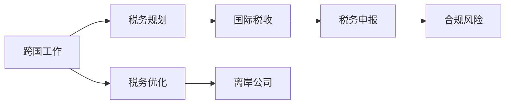

                 

# 程序员的跨国税务规划指南

> 关键词：跨国税务规划, 税务优化, 国际税收, 离岸公司, 税务申报, 合规风险

## 1. 背景介绍

跨国工作、海外留学、跨境电商、创业投资等都越来越普遍。然而，每个国家都有其独特的税法制度，很多国家和地区还存在双重征税问题。如何在不同国家和地区之间进行有效的税务规划，既能合理避税，又能规避合规风险，是每个跨国工作者和公司都必须面对的重要课题。

本文旨在为程序员和公司提供一份详细的跨国税务规划指南，详细介绍如何进行税务规划和优化，降低税负，合法合规，保障国际业务的顺利进行。

## 2. 核心概念与联系

### 2.1 核心概念概述

- **跨国税务规划（Cross-border Tax Planning）**：指通过合理合法的方式，对跨国收入、利润、投资等进行筹划，以降低整体税负。

- **税务优化（Tax Optimization）**：通过调整业务结构、投资策略、收入分配等方式，减少纳税义务。

- **国际税收（International Tax）**：涉及不同国家和地区之间的税收问题，包括所得来源地税收、居民税收、双重征税问题等。

- **离岸公司（Offshore Company）**：指注册在税率低或没有所得税的国家和地区，以减少税收负担的公司。

- **税务申报（Tax Filing）**：按照税收法规，向税务机关报告应纳税所得、利润、成本、费用等信息，完成申报。

- **合规风险（Compliance Risk）**：在税务规划过程中，由于违反税收法规或申报不实而面临的法律风险。

### 2.2 核心概念原理和架构的 Mermaid 流程图



## 3. 核心算法原理 & 具体操作步骤

### 3.1 算法原理概述

跨国税务规划的核心理论主要包括以下几个方面：

- **所得来源地税收（Source-based Taxation）**：公司或个人在收入来源地国家缴纳的税收。
- **居民税收（Residence-based Taxation）**：居民在居民国缴纳的税收。
- **双重征税问题（Double Taxation）**：同一笔收入在不同国家被重复征税。
- **税务协定（Tax Treaty）**：不同国家之间的税收合作协议，旨在解决双重征税问题。

### 3.2 算法步骤详解

跨国税务规划的步骤可以概括为：

1. **评估全球税务状况**：了解各国家税收制度、税率、税收协定等。
2. **筹划业务结构**：设计合理的业务结构，以减少税负。
3. **设立离岸公司**：在低税地区设立公司，转移收入。
4. **优化收入分配**：合理分配收入和利润，降低全球综合税负。
5. **申报税务**：按要求申报税务，规避合规风险。

### 3.3 算法优缺点

**优点**：
- 降低税负，提高资金使用效率。
- 合理分配利润，增强企业竞争力。
- 避免双重征税，合规税务申报。

**缺点**：
- 税务筹划复杂，需专业人士指导。
- 存在合规风险，违规可能面临高额罚款和法律惩罚。
- 需全球协调，涉及多国法律和税收制度。

### 3.4 算法应用领域

跨国税务规划适用于所有跨国工作和业务，包括：

- 跨国公司：进行国际业务布局和利润分配的税务筹划。
- 跨国工作者：进行海外收入和利润的税务筹划。
- 跨国投资：进行跨国资本运作的税务筹划。
- 跨国创业：进行国际创业投资的税务筹划。

## 4. 数学模型和公式 & 详细讲解 & 举例说明

### 4.1 数学模型构建

设个人收入为 $I$，所在居民国税率为 $r_1$，收入来源地税率为 $r_2$，相关税务协定税率 $r_{\text{agreement}}$。

全球税务规划的数学模型可以表示为：

$$
\text{Total Tax} = I \times r_1 + I \times r_{\text{agreement}} \times \min(r_1, r_2)
$$

其中，$r_{\text{agreement}}$ 为双边协定税率。

### 4.2 公式推导过程

推导过程中，利用了双边税收协定的基本原理，即：
- 在来源地税率和居民国税率低于协定税率时，适用协定税率。
- 在来源地税率高于协定税率时，适用更高的居民国税率。

### 4.3 案例分析与讲解

假设张三在A国居住，年薪为100,000美元，A国税率为30%，B国税率为20%，两国签署了双边协定税率15%。

根据公式计算：

$$
\text{Total Tax} = 100,000 \times 30\% + 100,000 \times 15\% \times \min(30\%, 20\%) = 30,000 + 1,500 + 1,500 = 35,000
$$

张三在B国工作的收入需要按协定税率15%缴纳税款，剩余在A国纳税。

## 5. 项目实践：代码实例和详细解释说明

### 5.1 开发环境搭建

搭建开发环境需要安装Python及必要的税务规划工具。

```bash
conda create -n tax-env python=3.9
conda activate tax-env
pip install pandas sympy matplotlib
```

### 5.2 源代码详细实现

下面是一个简化的税务规划计算代码：

```python
from sympy import symbols, Min, Rational

# 定义变量
I = symbols('I')
r1 = Rational(30, 100)  # 居民国税率
r2 = Rational(20, 100)  # 收入来源地税率
r_agreement = Rational(15, 100)  # 双边协定税率

# 计算总税负
total_tax = I * r1 + I * r_agreement * Min(r1, r2)

# 计算张三的税负
income = 100000
total_tax_value = total_tax.subs(I, income)
print(f"张三的总税负为: {total_tax_value}")
```

### 5.3 代码解读与分析

代码中使用了Sympy库进行符号计算，简化了复杂的税务计算过程。

首先定义了税率变量，并根据双边协定税率公式计算总税负。最后，将张三的年薪代入计算，输出结果。

### 5.4 运行结果展示

输出结果显示张三的总税负为35,000美元。

## 6. 实际应用场景

### 6.1 跨国公司

跨国公司可利用离岸公司进行税务优化。例如，A公司在中国运营，但其在税率较低的开曼群岛设立子公司。

通过将收入转移到开曼群岛的子公司，A公司只需在中国缴纳30%的税款，而开曼群岛的子公司只缴纳0税率。

### 6.2 跨国工作者

跨国工作者可通过设立海外离岸公司，将个人收入和利润转移到离岸公司，减少税务负担。

例如，张三在A国工作，收入为100,000美元，通过在B国设立离岸公司，可进一步降低税负。

## 7. 工具和资源推荐

### 7.1 学习资源推荐

1. **《跨国税务规划手册》**：详细介绍全球税务规划的基本理论和实践技巧。
2. **国际税收协定数据库**：查询和对比各国税务协定条款，制定合理规划。
3. **跨国税务管理课程**：了解全球税务规划和优化。
4. **税务规划工具**：利用软件进行税负测算和优化。

### 7.2 开发工具推荐

1. **Python**：强大的编程语言，支持数学计算和符号计算。
2. **Sympy**：符号计算库，支持复杂的数学公式推导。
3. **Excel**：表格计算和数据分析，简单易用。
4. **税务申报软件**：如TaxAct、TurboTax等，自动生成税务申报表。

### 7.3 相关论文推荐

1. **《国际税收协定原理与实践》**：研究国际税收协定和优化策略。
2. **《跨国企业税务优化案例分析》**：详细介绍跨国企业税务规划的实际案例。
3. **《个人税务规划与优化》**：针对个人收入和利润进行税务规划。

## 8. 总结：未来发展趋势与挑战

### 8.1 研究成果总结

跨国税务规划已逐渐成为跨国工作者和企业的重要课题，许多国家和地区通过签署税收协定来解决双重征税问题。

### 8.2 未来发展趋势

- **人工智能辅助**：利用AI算法进行税务规划和优化。
- **区块链应用**：利用区块链技术实现跨国税务信息透明和自动化。
- **离岸公司优化**：探索新的离岸公司注册地和业务模式，进一步降低税负。
- **双边税收协定更新**：更新和签署新的双边协定，解决更多国家间的税收问题。

### 8.3 面临的挑战

- **合规风险**：税务规划需严格遵守各国法律法规，避免违规风险。
- **技术复杂性**：税务规划涉及复杂的税收协定和国际法律。
- **信息透明**：跨国公司需提高财务信息的透明度和公开性，以满足税收信息申报要求。

### 8.4 研究展望

- **AI辅助税务规划**：利用AI进行智能税务筹划，提高规划效率。
- **区块链税收透明**：利用区块链技术实现跨国税务信息透明和自动化，降低税收管理成本。
- **离岸公司新模式**：探索新的离岸公司注册地和业务模式，进一步降低税负。
- **国际税收协定更新**：更新和签署新的双边协定，解决更多国家间的税收问题。

## 9. 附录：常见问题与解答

**Q1：如何降低跨国公司税负？**

A: 设立离岸公司是降低跨国公司税负的有效手段。公司可将在低税率地区设立子公司，转移收入，只需缴纳低税率。

**Q2：离岸公司设立有哪些风险？**

A: 离岸公司设立需注意以下几点：
- 遵守各国法律法规，避免双重征税。
- 避免洗钱和逃税等违法行为。
- 保持信息透明，满足国际税收信息交换的要求。

**Q3：税务规划如何合规？**

A: 税务规划需遵循以下几点：
- 严格遵守各国的税法规定，避免违规行为。
- 保持财务信息的透明和真实，避免逃税和偷税。
- 及时申报税务，接受税务机关的监管和审查。

**Q4：跨国工作者如何降低税负？**

A: 跨国工作者可设立海外离岸公司，将个人收入和利润转移到离岸公司，减少税务负担。同时，需注意以下几点：
- 遵守各国的税法规定，避免违规行为。
- 保持财务信息的透明和真实，避免逃税和偷税。
- 及时申报税务，接受税务机关的监管和审查。

---

作者：禅与计算机程序设计艺术 / Zen and the Art of Computer Programming

