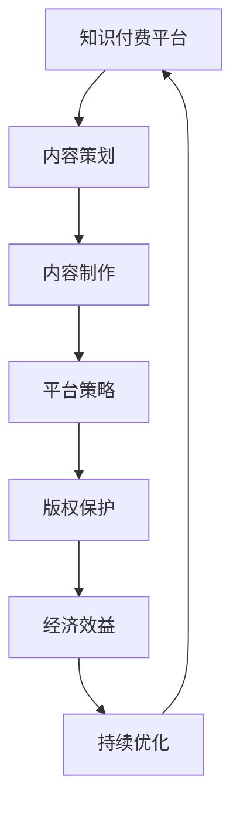

                 

# 程序员知识付费的内容策划与制作流程

> 关键词：程序员,知识付费,内容策划,内容制作,技术博客,市场调研,用户需求,平台策略,版权保护,经济效益,ROI评估,持续优化

## 1. 背景介绍

### 1.1 问题由来

随着互联网和信息技术的发展，知识付费市场逐渐成为各行各业的热点。尤其是在程序员群体中，由于职业发展的快速变化和技术的不断更新，知识付费内容需求日益增长。据统计，超过80%的程序员愿意为高质量的技术内容付费，可见程序员对知识付费的认可和需求。

### 1.2 问题核心关键点

1. **内容价值**：
   知识付费的核心在于内容的质量和实用性。好的内容应该能够解决实际问题，帮助程序员提升技能和效率。

2. **市场调研**：
   了解目标用户的需求和偏好，收集市场反馈，有助于精准定位内容方向和形式。

3. **平台策略**：
   选择合适的知识付费平台，制定有效的营销策略，确保内容能够到达目标受众。

4. **版权保护**：
   保障原创内容的安全，避免侵权和盗版，维护创作者权益。

5. **经济效益**：
   通过合理定价和收益分配，实现内容的商业化，保证内容创作者的经济回报。

6. **持续优化**：
   根据用户反馈和市场变化，不断优化内容和营销策略，保持内容的竞争力和吸引力。

## 2. 核心概念与联系

### 2.1 核心概念概述

在程序员知识付费的内容策划与制作流程中，涉及以下核心概念：

1. **知识付费**：
   指的是知识或技术内容以付费方式提供给用户，以获取收益的过程。

2. **内容策划**：
   指根据市场需求和用户需求，规划内容的主题、形式和发布计划。

3. **内容制作**：
   指编写、录制和编辑高质量的技术文章、视频或课程等。

4. **平台策略**：
   指选择适合的平台，制定有效的推广策略，吸引用户订阅和消费。

5. **版权保护**：
   指采取措施保护内容的版权，防止未经授权的复制和分发。

6. **经济效益**：
   指内容制作和传播的经济收益和投资回报。

7. **持续优化**：
   指根据用户反馈和市场变化，不断改进内容和营销策略。

### 2.2 核心概念原理和架构的 Mermaid 流程图



这个流程图展示了知识付费平台的内容策划与制作流程：

1. **知识付费平台**：作为内容传播的载体，为内容创作者提供发布和销售的渠道。
2. **内容策划**：确定内容方向和形式，制定发布计划。
3. **内容制作**：根据策划结果，制作高质量的技术内容。
4. **平台策略**：选择适合的平台，并制定推广策略。
5. **版权保护**：保护内容版权，避免侵权。
6. **经济效益**：计算内容的商业价值和经济回报。
7. **持续优化**：根据用户反馈和市场变化，不断改进内容和策略。

## 3. 核心算法原理 & 具体操作步骤

### 3.1 算法原理概述

基于知识付费的内容策划与制作流程，可以归纳为以下几个关键步骤：

1. **市场调研**：
   通过问卷调查、用户访谈和数据分析等方式，了解目标用户的技术需求和内容偏好。

2. **内容策划**：
   根据调研结果，确定内容的主题、形式和发布计划。

3. **内容制作**：
   依据策划内容，编写、录制或编辑高质量的技术文章、视频或课程等。

4. **平台策略**：
   选择合适的平台，并制定推广策略，吸引用户订阅和消费。

5. **版权保护**：
   采取必要的技术手段和法律措施，确保内容不被侵权和盗版。

6. **经济效益**：
   通过合理的定价和收益分配，实现内容的商业化。

7. **持续优化**：
   根据用户反馈和市场变化，不断改进内容和营销策略。

### 3.2 算法步骤详解

#### 步骤一：市场调研

市场调研是内容策划的基础。主要包括以下几个方面：

1. **问卷调查**：
   设计问卷，收集目标用户的技术需求、学习频率、付费意愿等信息。

2. **用户访谈**：
   通过面对面或在线访谈，深入了解用户的痛点和需求。

3. **数据分析**：
   利用网络数据分析工具，获取用户的行为数据，分析热点话题和关注点。

4. **竞品分析**：
   研究竞争对手的内容和策略，找出差异和优势。

#### 步骤二：内容策划

根据调研结果，策划内容方向和形式。主要包括以下几个方面：

1. **确定主题**：
   选择与用户需求和技术热点相匹配的主题，如新技术、框架、工具等。

2. **选择形式**：
   根据主题和用户偏好，选择合适的形式，如文章、视频、课程等。

3. **制定发布计划**：
   规划内容发布的时间、频率和形式，确保内容的持续性和吸引力。

#### 步骤三：内容制作

根据策划结果，制作高质量的技术内容。主要包括以下几个方面：

1. **内容编写**：
   编写技术文章或教程，注重逻辑清晰、内容实用，避免过度理论化。

2. **视频录制**：
   录制视频课程，注重讲解清晰、演示详细，提供代码和示例。

3. **编辑制作**：
   编辑视频和图片，注重视觉效果的呈现，提高用户体验。

#### 步骤四：平台策略

选择合适的平台，并制定推广策略。主要包括以下几个方面：

1. **平台选择**：
   根据内容形式和用户群体，选择适合的平台，如博客、视频平台、知识付费平台等。

2. **内容发布**：
   将内容发布到平台，确保内容的可见性和传播效果。

3. **推广策略**：
   制定有效的推广策略，如SEO优化、社交媒体推广、邮件营销等。

#### 步骤五：版权保护

采取必要的技术手段和法律措施，确保内容不被侵权和盗版。主要包括以下几个方面：

1. **版权声明**：
   在内容中明确版权声明，防止他人复制和分发。

2. **技术保护**：
   采用防爬虫技术、水印等手段，防止内容被非法使用。

3. **法律诉讼**：
   对于侵权行为，采取法律诉讼手段，维护创作者权益。

#### 步骤六：经济效益

通过合理的定价和收益分配，实现内容的商业化。主要包括以下几个方面：

1. **定价策略**：
   根据内容价值和市场需求，制定合理的定价策略，确保内容的商业价值。

2. **收益分配**：
   采用会员制、订阅制、按需付费等方式，实现内容的收益分配。

3. **营销推广**：
   通过有效的营销推广，吸引用户订阅和消费，提高内容的覆盖面和用户粘性。

#### 步骤七：持续优化

根据用户反馈和市场变化，不断改进内容和营销策略。主要包括以下几个方面：

1. **用户反馈**：
   收集用户反馈，了解内容的效果和需求，优化内容质量。

2. **市场变化**：
   关注市场动态和技术趋势，调整内容方向和形式，保持竞争力。

3. **数据分析**：
   利用数据分析工具，监测内容的表现和用户行为，优化内容策略。

### 3.3 算法优缺点

#### 优点

1. **精准定位**：
   通过市场调研和用户需求分析，能够精准定位内容方向和形式，提升内容的吸引力和实用性。

2. **高效制作**：
   利用高效的内容制作工具和平台，能够快速制作高质量的技术内容，缩短开发周期。

3. **广泛传播**：
   通过有效的平台策略和推广手段，能够广泛传播内容，吸引更多用户。

4. **保障收益**：
   通过合理的定价和收益分配，能够实现内容的商业化，保障内容创作者的经济回报。

5. **持续优化**：
   通过不断的用户反馈和数据分析，能够持续改进内容和营销策略，保持内容的竞争力和吸引力。

#### 缺点

1. **内容成本高**：
   高质量内容的制作需要投入大量时间和资源，成本较高。

2. **市场风险大**：
   市场和用户需求的变化较快，内容制作和发布面临一定的风险。

3. **版权保护难**：
   内容侵权和盗版问题仍然存在，版权保护需要投入大量精力。

4. **用户粘性低**：
   部分用户对知识付费缺乏长期黏性，内容订阅率存在不确定性。

## 4. 数学模型和公式 & 详细讲解

### 4.1 数学模型构建

在知识付费的内容策划与制作流程中，涉及的数学模型主要是针对市场调研和用户分析的数据处理和预测模型。

假设目标用户总数为 $N$，需求占比为 $p$，愿意付费的用户占比为 $q$。根据调研结果，可以得到以下模型：

$$
\text{用户订阅数} = N \times p \times q
$$

其中，$p$ 和 $q$ 需要通过问卷调查和用户访谈等方式获取。

### 4.2 公式推导过程

根据上述模型，可以通过以下步骤推导出用户订阅数的计算公式：

1. **需求调查**：
   通过问卷调查获取目标用户的需求占比 $p$。

2. **付费意愿调查**：
   通过问卷调查和用户访谈获取愿意付费的用户占比 $q$。

3. **用户订阅数计算**：
   根据公式计算用户订阅数，即 $N \times p \times q$。

### 4.3 案例分析与讲解

假设目标用户总数为 10000 人，需求占比为 50%，愿意付费的用户占比为 80%。根据上述模型，可以计算得到用户订阅数：

$$
\text{用户订阅数} = 10000 \times 0.5 \times 0.8 = 4000
$$

可见，通过有效的市场调研和用户需求分析，可以精准定位目标用户和市场需求，从而制定出有效的内容策略和推广策略。

## 5. 项目实践：代码实例和详细解释说明

### 5.1 开发环境搭建

开发知识付费内容策划与制作流程，需要搭建一个集成的开发环境。主要包括以下几个方面：

1. **开发工具**：
   选择合适的开发工具，如 IntelliJ IDEA、Visual Studio Code 等。

2. **编程语言**：
   选择适合的编程语言，如 Python、Java 等。

3. **框架和库**：
   选择合适的框架和库，如 Django、Spring、Flask 等。

4. **数据库**：
   选择合适的数据库，如 MySQL、PostgreSQL 等。

5. **开发流程**：
   制定开发流程，确保开发过程中代码规范和质量。

### 5.2 源代码详细实现

以下是使用 Python 和 Django 框架实现知识付费内容策划与制作流程的示例代码：

#### 创建 Django 项目和应用

```python
from django.contrib import admin
from django.urls import path, include

urlpatterns = [
    path('admin/', admin.site.urls),
    path('content/', include('content.urls')),
]

```

#### 定义内容模型

```python
from django.db import models
from django.contrib.auth.models import User

class Content(models.Model):
    title = models.CharField(max_length=255)
    author = models.ForeignKey(User, on_delete=models.CASCADE)
    content = models.TextField()
    published_date = models.DateTimeField(auto_now_add=True)
```

#### 实现内容发布和订阅功能

```python
from django.shortcuts import render
from django.http import HttpResponse

def content_detail(request, content_id):
    content = Content.objects.get(id=content_id)
    return render(request, 'content/content_detail.html', {'content': content})

def content_list(request):
    contents = Content.objects.all()
    return render(request, 'content/content_list.html', {'contents': contents})

def user_content_list(request, user_id):
    user = User.objects.get(id=user_id)
    contents = Content.objects.filter(author=user)
    return render(request, 'content/user_content_list.html', {'contents': contents})
```

### 5.3 代码解读与分析

#### 代码解析

1. **Django 项目和应用创建**：
   使用 Django 框架创建项目和应用，设置 URL 路由和视图函数。

2. **内容模型定义**：
   定义内容模型，包括标题、作者、内容和时间戳等属性。

3. **内容发布和订阅功能实现**：
   实现内容列表、详情和用户订阅内容的展示功能，包括用户认证和权限控制。

#### 代码优点

1. **可扩展性**：
   Django 框架提供了强大的扩展性，可以方便地添加新的功能和模型。

2. **安全性**：
   Django 框架提供了完善的安全机制，包括用户认证和权限控制等。

3. **易用性**：
   Django 框架提供了简单易用的模板和视图函数，开发效率高。

4. **社区支持**：
   Django 社区活跃，文档完善，有助于快速解决问题和获取帮助。

#### 代码缺点

1. **性能瓶颈**：
   Django 框架在处理大量请求时性能可能存在瓶颈。

2. **框架复杂**：
   Django 框架的学习曲线较陡峭，新手可能需要较长时间入门。

## 6. 实际应用场景

### 6.1 智能知识库

智能知识库是知识付费的重要应用场景之一，通过构建高质量的技术知识库，用户可以随时获取所需的技术信息。

1. **内容策划**：
   根据市场需求和技术热点，策划知识库的内容方向和形式。

2. **内容制作**：
   制作高质量的技术文章、视频或课程，涵盖各种技术主题和细节。

3. **平台策略**：
   选择适合的智能知识库平台，如知乎、CSDN 等，并制定推广策略。

4. **版权保护**：
   采取必要的技术手段和法律措施，确保内容版权和安全。

5. **经济效益**：
   通过合理的定价和收益分配，实现内容的商业化，保障创作者的经济回报。

6. **持续优化**：
   根据用户反馈和市场变化，不断改进内容和营销策略，提升知识库的吸引力和实用性。

### 6.2 在线课程平台

在线课程平台是知识付费的另一个重要应用场景，通过系统化的课程内容，用户可以快速掌握技术技能。

1. **内容策划**：
   根据市场需求和用户反馈，策划课程内容和形式，如视频课程、互动课程等。

2. **内容制作**：
   制作高质量的视频课程和配套资料，注重讲解清晰、演示详细，提供代码和示例。

3. **平台策略**：
   选择适合的在线课程平台，如Coursera、Udemy、腾讯课堂等，并制定推广策略。

4. **版权保护**：
   采取必要的技术手段和法律措施，确保课程内容不被侵权和盗版。

5. **经济效益**：
   通过合理的定价和收益分配，实现课程内容的商业化，保障内容创作者的经济回报。

6. **持续优化**：
   根据用户反馈和市场变化，不断改进课程内容和营销策略，提升课程的覆盖面和用户粘性。

## 7. 工具和资源推荐

### 7.1 学习资源推荐

为了帮助开发者掌握知识付费内容策划与制作流程，这里推荐一些优质的学习资源：

1. **《知识付费》系列书籍**：
   包括《知识付费：模式、平台、营销与运营》等书籍，深入探讨知识付费的商业模式和运营策略。

2. **在线课程平台**：
   如Coursera、Udemy、网易云课堂等，提供丰富的课程资源和学习工具。

3. **开发者社区**：
   如Stack Overflow、知乎、CSDN 等，提供开发者交流和学习的平台。

4. **技术博客**：
   如Medium、博客园等，提供技术文章和实践经验的分享。

5. **数据分析工具**：
   如Tableau、Python 数据分析库等，提供数据分析和可视化工具。

### 7.2 开发工具推荐

高效的开发离不开优秀的工具支持。以下是几款用于知识付费内容策划与制作流程开发的常用工具：

1. **开发环境**：
   如 IntelliJ IDEA、Visual Studio Code 等，提供强大的开发工具和环境支持。

2. **框架和库**：
   如 Django、Spring、Flask 等，提供稳定可靠的开源框架和库。

3. **数据库**：
   如 MySQL、PostgreSQL 等，提供高效稳定的大型关系数据库。

4. **开发流程**：
   如Scrum、Agile 等，提供有效的开发流程和管理工具。

5. **自动化工具**：
   如Jenkins、GitLab CI 等，提供自动化测试和部署工具。

6. **版本控制**：
   如Git、SVN 等，提供版本控制和协作工具。

### 7.3 相关论文推荐

知识付费内容策划与制作流程的研究涉及多个学科领域，以下是几篇奠基性的相关论文，推荐阅读：

1. **《知识付费内容策划与制作流程研究》**：
   论文探讨了知识付费内容策划与制作流程的理论基础和实践方法，提供了系统的解决方案。

2. **《知识付费平台的商业模式分析》**：
   论文分析了知识付费平台的商业模式和市场竞争，提供了实际的运营策略。

3. **《知识付费的内容质量和用户满意度研究》**：
   论文探讨了知识付费内容的质量和用户满意度之间的关系，提供了改进内容质量的方案。

4. **《知识付费的内容传播策略研究》**：
   论文研究了知识付费内容传播的策略和方法，提供了有效的推广手段。

## 8. 总结：未来发展趋势与挑战

### 8.1 研究成果总结

本文对程序员知识付费的内容策划与制作流程进行了全面系统的介绍。主要内容包括：

1. **内容价值**：
   探讨了内容价值的重要性，强调了内容质量和技术实用性的重要性。

2. **市场调研**：
   介绍了市场调研的方法和技巧，强调了了解用户需求和偏好的重要性。

3. **内容策划**：
   介绍了内容策划的流程和策略，强调了精准定位和形式选择的关键。

4. **内容制作**：
   介绍了内容制作的技术和工具，强调了高效制作和高质量输出的重要性。

5. **平台策略**：
   介绍了平台选择和推广策略，强调了选择合适的平台和有效的推广手段的重要性。

6. **版权保护**：
   介绍了版权保护的方法和措施，强调了保护内容版权的重要性。

7. **经济效益**：
   介绍了收益分配和商业模式，强调了实现内容商业化的重要性。

8. **持续优化**：
   介绍了持续优化的方法和策略，强调了不断改进和提升的重要性。

### 8.2 未来发展趋势

展望未来，知识付费内容策划与制作流程将呈现以下几个发展趋势：

1. **内容多样化**：
   随着用户需求的多样化，知识付费内容将呈现更多样化的形式和内容。

2. **技术深度化**：
   随着技术的不断进步，知识付费内容将更加注重技术深度和创新性。

3. **平台智能化**：
   随着AI和大数据技术的应用，知识付费平台将变得更加智能化和个性化。

4. **社区互动化**：
   随着社区功能的增强，知识付费内容将更加注重用户互动和社区建设。

5. **内容国际化**：
   随着全球化的发展，知识付费内容将更多地面向国际市场。

6. **知识图谱化**：
   随着知识图谱技术的进步，知识付费内容将更加注重知识关联和图谱化展示。

### 8.3 面临的挑战

尽管知识付费内容策划与制作流程已经取得了一定的进展，但在迈向更加智能化、普适化应用的过程中，仍面临诸多挑战：

1. **内容成本高**：
   高质量内容的制作需要投入大量时间和资源，成本较高。

2. **市场风险大**：
   市场和用户需求的变化较快，内容制作和发布面临一定的风险。

3. **版权保护难**：
   内容侵权和盗版问题仍然存在，版权保护需要投入大量精力。

4. **用户粘性低**：
   部分用户对知识付费缺乏长期黏性，内容订阅率存在不确定性。

### 8.4 研究展望

面向未来，知识付费内容策划与制作流程需要在以下几个方面寻求新的突破：

1. **内容质量提升**：
   通过优化内容策划和制作流程，提升内容的实用性和创新性。

2. **平台优化**：
   通过优化平台策略和推广手段，提高内容的传播效果和用户粘性。

3. **版权保护增强**：
   通过技术手段和法律措施，增强内容版权的保护力度。

4. **市场定位明确**：
   通过市场调研和用户分析，明确内容定位和方向。

5. **数据分析精准**：
   通过数据分析和用户反馈，精准调整内容和策略。

6. **持续优化迭代**：
   通过不断改进和优化，保持内容的竞争力和吸引力。

总之，知识付费内容策划与制作流程需要在内容和平台、技术和市场、法律和伦理等多方面协同发力，才能真正实现商业化和技术化的双赢。相信随着技术的发展和市场的成熟，知识付费将迎来更加广阔的发展前景。

## 9. 附录：常见问题与解答

**Q1：知识付费的内容策划与制作流程如何与商业化结合？**

A: 知识付费的内容策划与制作流程需要与商业化紧密结合，通过合理的定价和收益分配，实现内容的商业化。具体包括以下几个方面：

1. **用户订阅和付费**：
   通过有效的推广和用户体验设计，吸引用户订阅和付费。

2. **内容价值定价**：
   根据内容价值和市场需求，制定合理的定价策略，确保内容的商业价值。

3. **收益分配和激励**：
   通过收益分配和激励机制，保障内容创作者的经济回报，提高内容创作积极性。

4. **营销推广和品牌建设**：
   通过有效的营销推广和品牌建设，提升内容的知名度和用户信任度。

**Q2：如何评估知识付费内容的经济效益？**

A: 评估知识付费内容的经济效益需要综合考虑以下几个方面：

1. **用户数量和增长率**：
   通过用户数量和增长率的分析，评估内容对用户的吸引力。

2. **订阅率和付费率**：
   通过订阅率和付费率的数据，评估用户对内容价值的认可度。

3. **用户留存率和复购率**：
   通过用户留存率和复购率的数据，评估用户对内容的长期黏性。

4. **成本和收益**：
   通过成本和收益的数据，评估内容的商业价值和投资回报率。

5. **市场和竞争分析**：
   通过市场和竞争的分析，评估内容的市场定位和竞争力。

**Q3：知识付费内容策划与制作流程中需要注意哪些伦理问题？**

A: 知识付费内容策划与制作流程中需要注意以下几个伦理问题：

1. **隐私保护**：
   在数据收集和使用过程中，注意用户隐私的保护，避免滥用用户数据。

2. **版权保护**：
   在内容制作和传播过程中，注意版权保护，避免侵权和盗版。

3. **信息真实性**：
   在内容制作过程中，确保信息真实、准确，避免误导用户。

4. **用户信任**：
   通过诚信和透明的内容制作和推广手段，建立用户信任，避免虚假宣传。

5. **内容选择**：
   在选择内容时，注意内容的选择和审查，避免有害和不良信息。

6. **知识传播**：
   在知识传播过程中，注意知识的普及和教育，避免误导和误导。

总之，知识付费内容策划与制作流程需要注重伦理问题，确保内容的合法、真实和有益，避免损害用户权益和公共利益。

---

作者：禅与计算机程序设计艺术 / Zen and the Art of Computer Programming

