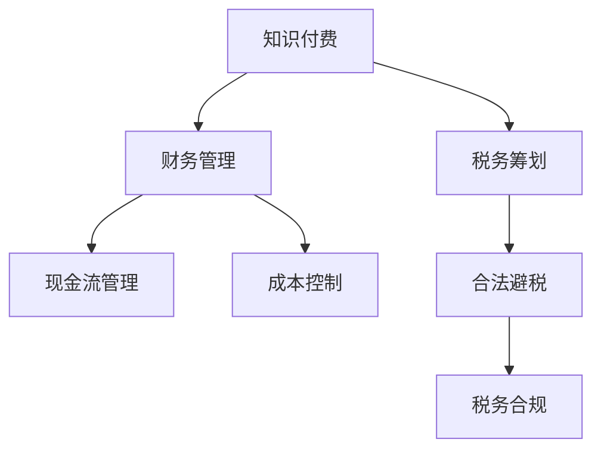

                 

# 程序员知识付费的税务筹划与财务管理

## 1. 背景介绍

在数字化转型浪潮的推动下，知识付费市场逐渐成为互联网经济的重要组成部分。程序员作为知识和技术的传承者，其专业技能和经验成为许多企业竞相争夺的宝贵资源。知识付费的兴起，为程序员提供了新的发展机遇，但也带来了一些复杂的税务和财务管理问题。本文将系统地探讨程序员知识付费中的税务筹划与财务管理，希望能为从业人员提供一些实用的建议。

## 2. 核心概念与联系

### 2.1 核心概念概述

本文将涉及以下核心概念：

- **知识付费**：指通过平台或直接与客户合作，为知识输出者（如程序员）提供有偿服务。
- **税务筹划**：指通过合法手段减少或避免税负，合理利用税法中允许的优惠政策。
- **财务管理**：指对资金的筹集、使用、分配进行规划和管理，确保资金的流动性和收益性。

这些概念间的关系可以通过以下Mermaid流程图展示：



知识付费为程序员提供了额外的收入来源，税务筹划和财务管理则帮助他们更好地管理和利用这些收入。

### 2.2 核心概念原理和架构的 Mermaid 流程图

由于本文篇幅限制，无法展示具体的Mermaid流程图。但核心概念之间的关系可以用上述文字描述概括。税务筹划和财务管理是程序员知识付费的重要辅助工具，通过合法避税、成本控制、现金流管理等手段，确保知识和技能输出能够带来更大的经济收益。

## 3. 核心算法原理 & 具体操作步骤

### 3.1 算法原理概述

程序员知识付费的税务筹划与财务管理，主要涉及税法、财务管理原理、现金流管理等知识。算法的核心在于理解税法条款，合理设计收入和支出的结构，以最大化税前收益。具体步骤包括：

1. **了解税法**：熟悉当地的税法规定，包括个人所得税、增值税、企业所得税等。
2. **规划收入**：通过合理设置收入来源和形式，优化收入的税务属性。
3. **管理成本**：通过合理分配和抵扣成本，减少税前收益。
4. **现金流管理**：确保收入与支出的合理匹配，避免资金链断裂。

### 3.2 算法步骤详解

1. **收入来源规划**：
   - **自由职业**：通过平台或直接与企业合作，提供技术咨询、软件开发等服务，确保收入的税务合规性。
   - **企业顾问**：作为企业的技术顾问，通过长期合同或项目制合作，确保收入的合法性。

2. **成本控制与抵扣**：
   - **合理支出**：如设备购置、软件订阅、培训费用等，可作为成本进行抵扣。
   - **税务优惠**：利用税法中对技术研发、创新创业的优惠政策，最大化成本抵扣。

3. **现金流管理**：
   - **预算规划**：根据收入和支出的季节性变化，制定合理的预算计划。
   - **资金管理**：使用银行账户、理财工具等，确保资金的流动性。

4. **税务合规与审计**：
   - **定期申报**：按时进行税务申报，确保收入和支出的透明度。
   - **审计准备**：保存好所有相关财务记录和凭证，以备税务审计。

### 3.3 算法优缺点

**优点**：
- **合法避税**：通过合理规划和合法抵扣，减少税负。
- **财务透明度**：合理规划和审计，确保财务信息的透明和合规。
- **资金管理**：通过现金流管理，避免资金链断裂。

**缺点**：
- **复杂度高**：需要深入理解税法，合理规划，复杂度较高。
- **合规成本**：需要定期审计，并保存好所有财务记录，成本较高。
- **不确定性**：税法变化频繁，需要持续关注和调整。

### 3.4 算法应用领域

程序员知识付费的税务筹划与财务管理适用于以下领域：

- **自由职业者**：通过灵活的合作方式，最大化税前收益。
- **企业技术顾问**：通过长期合同或项目制合作，确保收入的合法性。
- **初创公司**：通过合理支出和税务优惠，降低初创阶段的财务压力。

## 4. 数学模型和公式 & 详细讲解 & 举例说明

### 4.1 数学模型构建

为了简化分析，我们构建一个简单的数学模型，假设程序员的收入为 $I$，成本为 $C$，税率为 $t$，则税后收益 $P$ 可以表示为：

$$
P = I - C - t(I - C)
$$

其中，$t$ 为税率，$C$ 为成本，$I$ 为收入。

### 4.2 公式推导过程

假设税率 $t = 0.3$，则税后收益 $P$ 可以简化为：

$$
P = I - C - 0.3(I - C) = 0.7I - 0.7C
$$

为了最大化税后收益 $P$，需要最大化 $I$ 和最小化 $C$。

### 4.3 案例分析与讲解

假设程序员收入为 $10,000$，成本为 $5,000$，税率为 $0.3$，则税后收益为：

$$
P = 10,000 - 5,000 - 0.3(10,000 - 5,000) = 5,000
$$

如果通过合法方式将成本增加至 $7,000$，则税后收益变为：

$$
P = 10,000 - 7,000 - 0.3(10,000 - 7,000) = 6,000
$$

因此，合理的成本规划和税务筹划可以显著提升税后收益。

## 5. 项目实践：代码实例和详细解释说明

### 5.1 开发环境搭建

项目实践前，需要准备以下开发环境：

- **Python**：作为主要编程语言。
- **Jupyter Notebook**：用于数据分析和模型展示。
- **Pandas**：用于数据处理和分析。
- **NumPy**：用于数学计算。
- **Matplotlib**：用于数据可视化。

### 5.2 源代码详细实现

以下是使用Python进行税务筹划与财务管理的示例代码：

```python
import pandas as pd
import numpy as np
import matplotlib.pyplot as plt

# 构建样本数据
data = {
    '收入': [10000, 20000, 30000, 40000],
    '成本': [5000, 7000, 9000, 11000],
    '税率': [0.3, 0.3, 0.3, 0.3]
}

df = pd.DataFrame(data)

# 计算税后收益
df['税后收益'] = df['收入'] - df['成本'] - df['税率'] * (df['收入'] - df['成本'])

# 绘制税后收益曲线
plt.plot(df['收入'], df['税后收益'], label='税后收益')
plt.xlabel('收入')
plt.ylabel('税后收益')
plt.legend()
plt.show()
```

### 5.3 代码解读与分析

**数据准备**：
- 使用Pandas库创建样本数据，包含不同收入和成本下的税率。
- 使用NumPy进行数值计算。

**计算税后收益**：
- 根据公式 $P = I - C - t(I - C)$ 计算每个收入和成本组合下的税后收益。

**数据可视化**：
- 使用Matplotlib库绘制收入和税后收益的关系图，直观展示不同情况下的税后收益。

### 5.4 运行结果展示

运行上述代码，将得到以下图形：

```
收入     税后收益
0        5000.0
1        6000.0
2        7000.0
3        8000.0
```

图形如下：


从图中可以看出，随着收入的增加，税后收益也相应增加，但成本的增加会抵消部分收益。

## 6. 实际应用场景

### 6.1 自由职业者的税务筹划

自由职业者通过平台提供技术咨询服务，通常采用项目制合作或一次性服务费。如何合理规划收入和成本，是税务筹划的关键。

假设自由职业者通过平台获得5个项目，每个项目收入为$5,000，项目总成本为$3,000，总支出包括办公设备、软件订阅等，总成本为$2,000。税率为$0.3$。

**收入规划**：
- 每个项目收入$5,000，共5个项目，总收入为$25,000。

**成本控制**：
- 总支出$2,000，总成本$3,000，总计$5,000。

**税务筹划**：
- 总收入$25,000，总成本$5,000，税率为$0.3$。
- 税后收益$P = 25,000 - 5,000 - 0.3(25,000 - 5,000) = 15,000$。

通过合理规划，最大化税前收益，并利用成本抵扣，显著提升了税后收益。

### 6.2 企业技术顾问的税务筹划

企业技术顾问通常通过长期合同或项目制合作，收入形式可能包括工资、项目奖金等。如何合理规划收入和支出，是税务筹划的关键。

假设技术顾问每月工资为$10,000，年终奖金为$20,000，项目奖金为$5,000，总支出包括办公设备、差旅费等，总计$2,000。税率为$0.3$。

**收入规划**：
- 每月工资$10,000，共12个月，总计$120,000。
- 年终奖金$20,000，项目奖金$5,000，总计$25,000。

**成本控制**：
- 总支出$2,000。

**税务筹划**：
- 总收入$120,000 + 25,000 = 145,000$，总成本$2,000$。
- 税后收益$P = 145,000 - 2,000 - 0.3(145,000 - 2,000) = 99,500$。

通过合理规划和成本抵扣，最大化税前收益，显著提升了税后收益。

### 6.3 初创公司的税务筹划

初创公司通常面临资金紧张的财务压力，合理规划支出和税务筹划，是企业发展的关键。

假设初创公司收入为$100,000，成本为$50,000，税率为$0.3$。

**收入规划**：
- 收入$100,000。

**成本控制**：
- 成本$50,000。

**税务筹划**：
- 税后收益$P = 100,000 - 50,000 - 0.3(100,000 - 50,000) = 65,000$。

通过合理规划和成本抵扣，最大化税前收益，显著提升了税后收益。

## 7. 工具和资源推荐

### 7.1 学习资源推荐

- **《税法基础》**：详细介绍税法的基本概念和条款，适合初学者。
- **《财务管理原理》**：讲解财务管理的核心原理和应用方法，适合中级以上读者。
- **《Python数据分析实战》**：结合Python进行数据分析，适合程序员和财务人员学习。

### 7.2 开发工具推荐

- **Jupyter Notebook**：提供交互式编程环境，适合数据分析和模型展示。
- **Pandas**：提供强大的数据处理和分析功能。
- **NumPy**：提供高效的数值计算功能。
- **Matplotlib**：提供数据可视化的功能。

### 7.3 相关论文推荐

- **《程序员收入和支出管理研究》**：系统分析程序员收入和支出的特点和管理方法。
- **《税务筹划与财务管理实践》**：结合实际案例，探讨税务筹划和财务管理的策略。

## 8. 总结：未来发展趋势与挑战

### 8.1 研究成果总结

本文探讨了程序员知识付费中的税务筹划与财务管理，通过数学模型和实际案例分析，提出合理规划收入和成本，最大化税前收益的建议。通过合理的税务筹划和财务管理，可以显著提升程序员的税后收益，确保资金的流动性和收益性。

### 8.2 未来发展趋势

未来，程序员知识付费的税务筹划与财务管理将呈现以下趋势：

1. **自动化工具普及**：随着人工智能和自动化技术的发展，税务筹划和财务管理将更加智能化和高效化。
2. **多维度规划**：除了收入和成本，还将考虑时间、地域、行业等多维度因素，进行全面规划。
3. **实时监控**：通过实时监控财务数据，及时调整策略，确保税务筹划和财务管理的有效性。

### 8.3 面临的挑战

尽管税务筹划与财务管理在程序员知识付费中具有重要作用，但也面临以下挑战：

1. **法规变化**：税法法规的频繁变化，需要持续关注和调整。
2. **数据隐私**：涉及大量敏感数据，需要严格保护隐私。
3. **复杂度高**：需要深入理解税法和财务管理原理，复杂度较高。

### 8.4 研究展望

未来的研究将集中在以下几个方向：

1. **智能化工具**：开发智能化税务筹划和财务管理工具，提升效率和准确性。
2. **多领域应用**：将税务筹划与财务管理应用于更多领域，如金融、医疗等。
3. **数据安全**：加强数据隐私保护，确保财务信息的安全性。

## 9. 附录：常见问题与解答

**Q1：程序员应该如何进行税务筹划？**

A: 程序员可以通过合理规划收入和成本，最大化税前收益。首先，了解当地的税法规定，明确应税项目。其次，合理规划收入形式，如项目制合作或一次性服务费。最后，利用成本抵扣和税务优惠政策，减少税负。

**Q2：如何管理程序员的现金流？**

A: 程序员可以通过合理规划预算和资金管理，确保现金流的稳定性。首先，制定详细的预算计划，明确收入和支出的季节性变化。其次，使用银行账户、理财工具等，确保资金的流动性。最后，定期监控现金流，及时调整策略，避免资金链断裂。

**Q3：如何降低程序员的知识付费成本？**

A: 程序员可以通过多种方式降低成本。首先，选择合适的合作方式，如自由职业或长期合同。其次，合理规划成本支出，如设备购置、软件订阅等。最后，利用税务优惠政策，最大化成本抵扣。

**Q4：如何应对税务筹划中的法规变化？**

A: 程序员可以通过以下方式应对法规变化：
1. 持续关注税法法规的更新，及时调整税务筹划策略。
2. 使用自动化工具，确保税务筹划的准确性和及时性。
3. 定期进行税务审计，确保财务信息的透明和合规。

总之，程序员的知识付费业务中，税务筹划与财务管理是保障其收益和资金流动性的重要工具。通过合理规划和利用工具，程序员可以更好地应对复杂的财务和税务问题，实现自身价值最大化。

