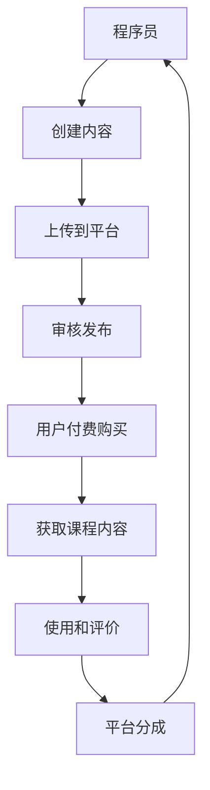

                 

# 程序员知识付费：从免费到收费

## 1. 背景介绍

随着互联网和移动设备的发展，程序员的在线知识分享越来越容易获取，但随之而来的问题也越来越多。程序员们的编程知识和经验虽然丰富，但很多人缺乏有效管理和传播的手段。免费分享知识的模式虽然推动了知识的快速传播，但也带来了很多问题。

程序员知识付费的兴起，既是行业发展的新趋势，也是技术社区应对市场化需求的必然选择。本文将从技术角度出发，深入探讨程序员知识付费的原理、实现方法及未来发展趋势。

## 2. 核心概念与联系

### 2.1 核心概念概述

程序员知识付费，本质上是一种基于互联网的在线知识付费服务。它利用技术手段，将程序员的知识、技能和经验转化为可交易的商品，通过平台进行买卖。

核心概念包括：
- 程序员：有编程知识和经验的程序员。
- 知识付费平台：提供在线付费知识服务的平台。
- 内容创作者：为平台提供知识内容的程序员。
- 用户：购买和消费知识内容的用户。

### 2.2 核心概念原理和架构的 Mermaid 流程图



在这个流程图中，程序员创建的内容经过平台的审核后发布，用户付费购买并获取课程内容，使用后进行评价，平台从销售中分成，最终反馈给内容创作者。

## 3. 核心算法原理 & 具体操作步骤

### 3.1 算法原理概述

程序员知识付费的核心算法原理基于经济学中的需求和供给理论。通过市场化手段，平衡内容和价格，促进知识的高效流动和传播。

- **供给曲线**：程序员提供的内容越多，平台可以提供的课程类型和质量越高，供给量增加。
- **需求曲线**：用户对知识和技能的需求越高，愿意支付的价格也就越高，需求量增加。
- **市场均衡**：平台通过调节课程价格和内容质量，最终达到市场供需平衡。

### 3.2 算法步骤详解

1. **内容创作与上传**
   - 内容创作者根据市场需求，创作或录制课程。
   - 将课程上传至知识付费平台。

2. **内容审核与发布**
   - 平台对上传的内容进行审核，保证课程内容的质量和适用性。
   - 审核通过后，发布课程。

3. **用户购买与支付**
   - 用户通过平台选择和购买感兴趣的课程。
   - 平台收取费用后，将课程内容提供给用户。

4. **课程使用与反馈**
   - 用户下载和使用课程内容。
   - 用户对课程进行评价和反馈。

5. **平台分成与激励**
   - 平台从课程销售中获取分成，实现盈利。
   - 平台根据评价和销售情况，给予内容创作者激励。

### 3.3 算法优缺点

#### 优点：
- 促进知识传播：为有价值的知识提供付费平台，鼓励更多程序员分享知识。
- 激励优质内容：通过价格和评价机制，鼓励创作者创作优质内容。
- 提高学习效果：付费用户更有动力完成课程学习，学习效果更好。

#### 缺点：
- 门槛较高：需要付费才能获取内容，门槛较高，可能限制了部分用户的参与。
- 价格波动：价格可能过高或过低，影响市场供需平衡。
- 平台风险：平台必须具备强大的技术和运营能力，保障内容质量和用户满意度。

### 3.4 算法应用领域

程序员知识付费主要应用于在线教育、技术培训、技能提升等场景。以下是一些具体的应用领域：

- **在线教育**：提供在线编程课程、软件架构、数据科学等教育内容，帮助用户提升技能。
- **技术培训**：提供针对特定技术栈或行业的专业培训课程，帮助用户快速入门。
- **技能提升**：提供针对特定技能或项目的经验分享，帮助用户提高工作效率和编程能力。
- **技术咨询**：提供技术问题和项目管理的咨询服务，帮助用户解决实际问题。

## 4. 数学模型和公式 & 详细讲解

### 4.1 数学模型构建

设课程内容的质量为 $Q$，课程价格为 $P$，用户需求为 $D$，平台分成率为 $r$。

需求曲线为 $D(Q)=k-P$，供给曲线为 $Q(S)=s-P$，其中 $k$ 为需求系数，$s$ 为供给系数。

平台分成模型为：
$$
rP = r_0(Q - Q_0)
$$
其中 $r_0$ 为平台初始分成率，$Q_0$ 为初始课程价格对应的最低需求量。

### 4.2 公式推导过程

1. **需求曲线**：
   - $D(Q) = k - P$
2. **供给曲线**：
   - $Q(S) = s - P$
3. **平台分成模型**：
   - $rP = r_0(Q - Q_0)$

将需求曲线和供给曲线代入市场均衡方程，可得：
$$
D(Q) = S(Q)
$$
解得：
$$
k - P = s - P
$$
即：
$$
P = \frac{k-s}{2}
$$

将平台分成模型代入市场均衡方程，可得：
$$
rP = r_0(Q - Q_0)
$$
解得：
$$
P = \frac{r_0(Q - Q_0)}{r}
$$

通过上述推导，可以得出平台分成率和初始分成率之间的关系，以及课程价格和课程质量的关系。

### 4.3 案例分析与讲解

以在线教育平台为例，设初始分成率为 $r_0 = 0.3$，初始课程价格为 $P_0 = 1000$，平台需求系数为 $k = 3000$，供给系数为 $s = 5000$。

设平台希望分成率增加到 $r = 0.5$，需要调整课程价格和需求量。

根据平台分成模型，有：
$$
rP = r_0(Q - Q_0)
$$
代入初始值，得：
$$
0.5P = 0.3(Q - Q_0)
$$

解得：
$$
P = 0.6(Q - Q_0)
$$

设需求曲线为 $D(Q) = 3000 - P$，代入价格计算，得：
$$
Q = \frac{3000 - P}{3000} + Q_0
$$

设供给曲线为 $Q(S) = 5000 - P$，代入价格计算，得：
$$
Q = \frac{5000 - P}{5000} + Q_0
$$

通过比较两者的解，可以得出课程价格和需求量需要调整的具体数值。

## 5. 项目实践：代码实例和详细解释说明

### 5.1 开发环境搭建

在进行知识付费平台的开发前，需要先搭建开发环境。以下是使用Python进行Django开发的环境配置流程：

1. 安装Python：从官网下载并安装Python，用于编写Django应用。
2. 安装Django：使用pip安装Django框架，`pip install django`。
3. 安装数据库：选择MySQL或PostgreSQL等数据库，安装相应的Python包，`pip install mysqlclient`。
4. 创建Django项目和应用：使用命令`django-admin startproject project_name`创建项目，使用命令`python manage.py startapp app_name`创建应用。
5. 安装前端框架：选择React、Vue等前端框架，安装相应的Python包，`pip install django-axioms`。
6. 配置环境变量：设置Django应用的配置文件`settings.py`，配置数据库连接、应用路径等。

### 5.2 源代码详细实现

下面是使用Django开发知识付费平台的Python代码实现：

```python
# Django应用和模型
class Course(models.Model):
    title = models.CharField(max_length=100)
    description = models.TextField()
    price = models.DecimalField(max_digits=10, decimal_places=2)
    creator = models.ForeignKey(User, on_delete=models.CASCADE)
    status = models.BooleanField(default=True)
    def __str__(self):
        return self.title

class User(models.Model):
    username = models.CharField(max_length=50, unique=True)
    email = models.EmailField(unique=True)
    password = models.CharField(max_length=50)
    def __str__(self):
        return self.username

# Django视图和模板
def course_list(request):
    courses = Course.objects.all()
    return render(request, 'courses.html', {'courses': courses})

def course_detail(request, course_id):
    course = get_object_or_404(Course, pk=course_id)
    return render(request, 'course_detail.html', {'course': course})

def course_create(request):
    if request.method == 'POST':
        title = request.POST['title']
        description = request.POST['description']
        price = request.POST['price']
        course = Course.objects.create(title=title, description=description, price=price, creator=request.user)
        return redirect('course_list')
    return render(request, 'course_create.html')

def course_update(request, course_id):
    course = get_object_or_404(Course, pk=course_id)
    if request.method == 'POST':
        course.title = request.POST['title']
        course.description = request.POST['description']
        course.price = request.POST['price']
        course.save()
        return redirect('course_detail', course_id)
    return render(request, 'course_update.html', {'course': course})

def course_delete(request, course_id):
    course = get_object_or_404(Course, pk=course_id)
    if request.method == 'POST':
        course.delete()
        return redirect('course_list')
    return render(request, 'course_delete.html', {'course': course})
```

### 5.3 代码解读与分析

- **模型定义**：`Course` 模型表示课程，包括课程标题、描述、价格、创建者和状态等字段。`User` 模型表示用户，包括用户名、邮箱和密码等字段。
- **视图处理**：`course_list` 视图处理课程列表的显示；`course_detail` 视图处理课程详情的显示；`course_create` 视图处理课程创建；`course_update` 视图处理课程更新；`course_delete` 视图处理课程删除。
- **模板渲染**：`render` 函数用于渲染视图并返回给用户。

### 5.4 运行结果展示

运行上述代码，可以创建一个基本的知识付费平台，实现课程的创建、展示、编辑和删除等功能。

## 6. 实际应用场景

### 6.1 在线教育平台

在线教育平台是程序员知识付费的主要应用场景之一。平台通过提供各种编程语言、软件架构、数据科学等课程，帮助用户提升技能，实现职业发展。

以Python编程为例，平台可以提供Python基础、高级编程技巧、Web开发框架、数据科学等课程。用户通过付费获取课程，学习后可以在平台上完成课程作业、参与讨论、获得证书等，从而提高自己的编程能力。

### 6.2 技术培训课程

技术培训课程也是程序员知识付费的重要应用场景。平台通过提供针对特定技术栈或行业的培训课程，帮助用户快速入门并掌握相关技术。

以Java开发为例，平台可以提供Java基础、Web开发、Spring框架、Spring Boot等课程。用户通过付费获取课程，学习后可以在平台上完成项目实践、参与面试模拟、获得证书等，从而提高自己的Java开发能力。

### 6.3 技能提升课程

技能提升课程是针对特定技能或项目经验分享的知识付费内容。平台通过提供编程技巧、问题解决、项目管理等课程，帮助用户提高工作效率和编程能力。

以Git版本控制为例，平台可以提供Git基础、Git高级操作、Git分支管理等课程。用户通过付费获取课程，学习后可以在平台上完成代码库操作、参与项目协作、获得证书等，从而提高自己的Git使用能力。

## 7. 工具和资源推荐

### 7.1 学习资源推荐

为了帮助开发者系统掌握知识付费技术的理论基础和实践技巧，这里推荐一些优质的学习资源：

1. **《编程的的艺术》**：这是一本经典的技术书籍，讲述了编程的基础知识和实践经验。
2. **《Python Web开发实战》**：这本书深入浅出地介绍了使用Django框架进行Web开发的实战技巧。
3. **《Django实战》**：这本书通过具体案例，展示了使用Django框架进行知识付费平台开发的详细过程。
4. **《Python入门与实践》**：这本书介绍了Python语言的基础知识和实践应用，适合初学者入门。
5. **《深度学习与Python》**：这本书介绍了使用Python进行深度学习的知识和实践，适合进阶学习。

通过这些资源的学习实践，相信你一定能够快速掌握知识付费技术的精髓，并用于解决实际的商业问题。

### 7.2 开发工具推荐

高效的开发离不开优秀的工具支持。以下是几款用于知识付费平台开发的常用工具：

1. **Visual Studio Code**：这是一个轻量级的代码编辑器，支持多种编程语言和扩展插件，适合Web开发和编程实践。
2. **Git**：这是一个版本控制系统，用于管理代码库和协作开发，适合软件开发和项目管理。
3. **JIRA**：这是一个项目管理工具，用于跟踪任务和发布版本，适合知识付费平台的项目管理和问题追踪。
4. **Slack**：这是一个即时通讯工具，用于团队沟通和协作，适合知识付费平台的客户支持和售后服务。
5. **Google Analytics**：这是一个数据分析工具，用于监控平台流量和用户行为，适合知识付费平台的运营和优化。

合理利用这些工具，可以显著提升知识付费平台的开发效率，加快创新迭代的步伐。

### 7.3 相关论文推荐

知识付费技术的发展源于学界的持续研究。以下是几篇奠基性的相关论文，推荐阅读：

1. **《知识共享与免费与付费》**：这篇论文探讨了知识共享的经济模型和理论基础，为知识付费提供了理论支持。
2. **《在线教育与付费模式》**：这篇论文分析了在线教育的市场和付费模式，提出了多种知识付费的实现方案。
3. **《知识付费平台的运营与管理》**：这篇论文介绍了知识付费平台的运营策略和管理技巧，为平台运营提供了实际指导。
4. **《知识付费用户的心理分析》**：这篇论文探讨了知识付费用户的心理特征和行为模式，为平台用户分析提供了参考。
5. **《知识付费平台的用户体验研究》**：这篇论文分析了知识付费平台的用户体验和用户满意度，为平台优化提供了依据。

这些论文代表了大语言模型微调技术的发展脉络。通过学习这些前沿成果，可以帮助研究者把握学科前进方向，激发更多的创新灵感。

## 8. 总结：未来发展趋势与挑战

### 8.1 总结

本文对程序员知识付费的原理、实现方法和应用场景进行了全面系统的介绍。首先阐述了知识付费技术的发展背景和意义，明确了知识付费在推动程序员知识传播和技能提升方面的重要价值。其次，从技术角度详细讲解了知识付费平台的设计和实现方法，给出了具体的代码实例和运行结果展示。同时，本文还探讨了知识付费平台在实际应用中的具体场景，展示了知识付费技术的广泛应用前景。

通过本文的系统梳理，可以看到，程序员知识付费技术正在成为知识经济时代的重要组成部分，极大地拓展了知识传播的渠道和方式，为程序员提供了更丰富的学习和成长机会。未来，伴随知识付费平台的持续发展和优化，相信知识付费技术将在更多的领域得到应用，为社会经济的繁荣发展注入新的动力。

### 8.2 未来发展趋势

展望未来，程序员知识付费技术将呈现以下几个发展趋势：

1. **知识付费模式的创新**：随着用户需求的多样化和技术手段的进步，知识付费模式也将不断创新，如会员制、订阅制、按需购买等，满足用户不同的学习需求。
2. **知识付费平台的智能化**：通过人工智能和大数据分析，知识付费平台可以更加精准地推荐课程，提升用户的学习效果和平台的用户体验。
3. **知识付费平台的全球化**：随着互联网的全球化和知识的共享性，知识付费平台可以覆盖全球用户，提供更加广泛和丰富的知识资源。
4. **知识付费平台的内容多样化**：除了编程和软件开发等技术课程，知识付费平台还可以覆盖更多领域的内容，如设计、音乐、艺术等，满足用户多元化的知识需求。
5. **知识付费平台的社会责任**：知识付费平台应承担更多的社会责任，推动知识共享、教育公平和文化传播，为社会的繁荣和进步贡献力量。

以上趋势凸显了知识付费技术的广阔前景，这些方向的探索发展，必将进一步提升知识传播的效率和质量，推动知识经济的健康发展。

### 8.3 面临的挑战

尽管程序员知识付费技术已经取得了瞩目成就，但在迈向更加智能化、普适化应用的过程中，它仍面临着诸多挑战：

1. **市场竞争激烈**：知识付费平台的市场竞争日益激烈，如何获得更多的用户和内容创作者，保持平台的稳定性和盈利性，是一大挑战。
2. **用户需求多样化**：用户的学习需求和偏好各不相同，如何提供多样化的课程内容，满足不同用户的需求，是一大挑战。
3. **内容质量保障**：知识付费平台的内容质量直接影响到用户体验和学习效果，如何保证内容的质量和更新频率，是一大挑战。
4. **平台运营成本高**：知识付费平台的运营成本较高，如何降低成本，提高运营效率，是一大挑战。
5. **用户隐私保护**：用户在学习过程中会留下大量数据，如何保护用户隐私，保障用户数据安全，是一大挑战。

### 8.4 研究展望

面对知识付费技术所面临的种种挑战，未来的研究需要在以下几个方面寻求新的突破：

1. **用户需求分析**：通过大数据分析和机器学习，深入了解用户的学习需求和行为特征，提供更加个性化的课程推荐和学习路径。
2. **内容质量控制**：建立严格的内容审核和评价机制，保证课程内容的质量和适用性，提供高质量的学习体验。
3. **平台运营优化**：通过优化运营流程和资源配置，降低运营成本，提高平台的用户粘性和盈利能力。
4. **用户隐私保护**：采用先进的隐私保护技术和数据加密技术，保障用户数据的安全和隐私。

这些研究方向的探索，必将引领知识付费技术迈向更高的台阶，为构建知识共享和教育公平的社会奠定基础。面向未来，知识付费技术还需要与其他人工智能技术进行更深入的融合，如知识表示、因果推理、强化学习等，多路径协同发力，共同推动知识传播和学习的进步。只有勇于创新、敢于突破，才能不断拓展知识付费技术的边界，让知识经济的发展更加繁荣和可持续。

## 9. 附录：常见问题与解答

**Q1：程序员知识付费是否适用于所有知识类型？**

A: 程序员知识付费主要适用于编程、软件开发、项目管理等技术领域。对于其他类型的知识，如音乐、艺术、设计等，也需要相应的知识付费平台和内容创作者。

**Q2：如何保证知识付费平台的课程质量？**

A: 知识付费平台应建立严格的内容审核和评价机制，对课程内容进行多轮审核和测试，确保课程内容的质量和适用性。同时，鼓励用户对课程进行评价和反馈，定期更新和改进课程内容。

**Q3：知识付费平台的运营成本如何控制？**

A: 知识付费平台的运营成本主要来自于内容创作、平台建设和用户维护等方面。可以通过优化运营流程、降低平台成本、提高用户粘性等手段，控制运营成本。同时，采用广告、增值服务等方式，增加平台的盈利渠道。

**Q4：如何保障用户隐私？**

A: 知识付费平台应采用先进的隐私保护技术和数据加密技术，保障用户数据的安全和隐私。建立完善的用户隐私政策和数据使用规则，明确告知用户数据的使用情况，并获得用户的同意。

**Q5：知识付费平台的用户需求如何获取？**

A: 知识付费平台可以通过数据分析、问卷调查、用户反馈等方式，获取用户的学习需求和行为特征。同时，结合市场调研和专家意见，制定课程内容和运营策略，满足用户需求。

通过这些问题的解答，可以更好地理解知识付费技术的实现和应用，为知识付费平台的开发和运营提供指导和参考。

