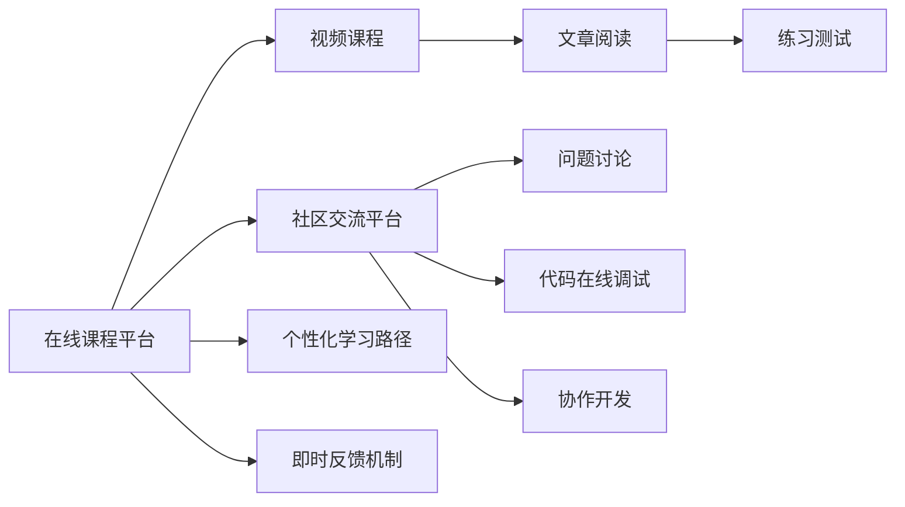

                 

## 1. 背景介绍

随着知识付费市场的快速崛起，越来越多的程序员选择通过订阅付费课程、购买书籍或参加线下培训班来获取技术知识。然而，传统的知识付费模式往往以单向传授为主，学习者与讲师之间缺乏互动，难以根据学习进度和实际问题进行有效沟通。本节将介绍一种基于互动式学习的知识付费模式，通过在线课程与社区平台的结合，构建一个高效、可互动的学习环境。

### 1.1 问题由来

知识付费的初衷是通过优质内容和高效学习方式帮助用户提升专业技能，然而传统知识付费模式存在以下问题：
- **单向传授**：讲师单向授课，学习者无法及时反馈问题。
- **反馈延迟**：问题反馈到讲师，再回复学习者，中间存在一定时间延迟。
- **效率低下**：课程安排固定，学习者无法根据自身学习进度调整。
- **难以互动**：学习者之间的交流和协作受限于在线平台的互动机制。

这些问题限制了知识付费的效果，无法满足日益增长的个性化和互动化学习需求。因此，一种以互动式学习为基础的知识付费模式应运而生，通过构建可互动的学习环境，让学习者与讲师、同伴之间的交流更加顺畅，提高学习效率和效果。

### 1.2 问题核心关键点

互动式学习知识付费模式的核心在于以下几个方面：
- **在线课程平台**：作为知识传授的主要渠道，提供高质量的视频课程、文章、练习等学习资源。
- **社区交流平台**：作为知识互动的主要场所，提供问题讨论、代码在线调试、协作开发等功能。
- **个性化学习路径**：根据学习者的进度和需求，动态调整课程和学习内容，提供个性化的学习体验。
- **即时反馈机制**：通过在线社区和AI辅助工具，提供实时的问题反馈和解答。

## 2. 核心概念与联系

### 2.1 核心概念概述

为了更好地理解互动式学习知识付费模式，本节将介绍几个核心概念：

- **在线课程平台**：基于Web或App的在线学习平台，提供高质量的课程和资源，支持视频播放、文章阅读、练习测试等功能。
- **社区交流平台**：以论坛或聊天室为主要形式的在线社区，支持学习者之间的交流、协作和资源共享。
- **个性化学习路径**：根据学习者的个性化需求和进度，动态调整课程和学习内容，提供个性化的学习体验。
- **即时反馈机制**：通过在线社区和AI辅助工具，提供实时的问题反馈和解答，帮助学习者解决学习过程中遇到的问题。

### 2.2 核心概念原理和架构的 Mermaid 流程图



这个流程图展示了在线课程平台、社区交流平台、个性化学习路径和即时反馈机制之间的关系：

1. 学习者首先通过在线课程平台获取学习资源，包括视频课程、文章阅读和练习测试。
2. 在学习过程中遇到问题，可以转到社区交流平台进行讨论。
3. 社区交流平台支持问题讨论、代码在线调试和协作开发，方便学习者交流和协作。
4. 在线课程平台根据学习者的进度和需求，动态调整个性化学习路径，提供个性化的学习体验。
5. 即时反馈机制通过在线社区和AI辅助工具，提供实时的问题反馈和解答，帮助学习者解决学习过程中遇到的问题。

## 3. 核心算法原理 & 具体操作步骤

### 3.1 算法原理概述

互动式学习知识付费模式的核心算法原理基于以下步骤：

1. **课程推荐算法**：根据学习者的历史学习记录和兴趣标签，推荐适合的学习内容。
2. **学习路径优化算法**：根据学习者的学习进度和反馈，动态调整学习路径，推荐合适的下一步学习内容。
3. **社区互动算法**：基于文本分析和情感分析技术，对社区讨论进行分类和情感分析，自动推荐相关问题和答案。
4. **即时反馈算法**：利用自然语言处理和机器学习技术，对学习者的问题进行分类和解析，提供实时反馈和解答。

### 3.2 算法步骤详解

以下详细介绍互动式学习知识付费模式的核心算法步骤：

**Step 1: 课程推荐算法**

1. **数据收集**：收集学习者的历史学习记录、浏览行为和兴趣标签，构建学习者画像。
2. **模型训练**：使用协同过滤、内容推荐等算法，训练课程推荐模型。
3. **推荐展示**：根据学习者的实时行为和需求，动态调整课程推荐列表。

**Step 2: 学习路径优化算法**

1. **学习进度分析**：记录学习者的学习进度、完成时间和成绩，分析学习效果。
2. **学习路径调整**：根据学习进度和反馈，动态调整学习路径，推荐合适的下一步学习内容。
3. **路径优化算法**：使用强化学习等算法，优化学习路径，提高学习效果。

**Step 3: 社区互动算法**

1. **文本分析**：使用文本分类和情感分析技术，对社区讨论进行分类和情感分析。
2. **问题解析**：对社区讨论中的问题进行分类和解析，提取关键信息。
3. **相关推荐**：基于问题分类和解析结果，自动推荐相关问题和答案。

**Step 4: 即时反馈算法**

1. **问题分类**：对学习者的问题进行分类，提取关键信息。
2. **自动解答**：利用自然语言处理和机器学习技术，自动解答问题。
3. **人工审核**：对自动解答结果进行人工审核，确保解答准确性和时效性。

### 3.3 算法优缺点

互动式学习知识付费模式具有以下优点：
- **个性化推荐**：根据学习者的兴趣和需求，提供个性化课程推荐和学习路径。
- **实时互动**：学习者可以在社区平台实时交流和协作，获得即时反馈和支持。
- **效率提升**：学习路径动态调整，帮助学习者快速找到适合的学习内容，提高学习效率。
- **互动性强**：社区平台促进学习者之间的交流和协作，增强学习效果。

同时，该模式也存在以下缺点：
- **资源投入大**：课程和社区平台的建设、维护需要大量资源。
- **社区管理难度高**：社区平台的健康管理和规范需要投入大量人力和时间。
- **内容质量难以控制**：社区内容质量难以控制，容易出现误导性信息。
- **依赖技术水平**：算法模型的精度和效率直接影响学习体验。

### 3.4 算法应用领域

互动式学习知识付费模式可以应用于各种场景，例如：

- **技术培训**：为软件开发人员提供技术培训课程，通过社区平台交流技术问题，获得即时反馈和支持。
- **产品经理培训**：为产品经理提供产品管理和设计课程，通过社区平台交流产品问题，提升产品设计能力。
- **项目管理培训**：为项目经理提供项目管理课程，通过社区平台交流项目管理问题，提高项目管理能力。
- **数据科学培训**：为数据科学家提供数据科学课程，通过社区平台交流数据问题，提升数据处理和分析能力。
- **人力资源培训**：为人力资源管理者和HRD提供人力资源管理课程，通过社区平台交流HR问题，提高HR管理能力。

## 4. 数学模型和公式 & 详细讲解

### 4.1 数学模型构建

为了更好地理解互动式学习知识付费模式的核心算法原理，本节将介绍几个数学模型：

**课程推荐模型**：
- 输入：学习者的历史学习记录、浏览行为和兴趣标签。
- 输出：课程推荐列表。
- 模型：协同过滤模型、内容推荐模型等。

**学习路径优化模型**：
- 输入：学习者的学习进度、完成时间和成绩。
- 输出：学习路径调整建议。
- 模型：强化学习模型等。

**社区互动模型**：
- 输入：社区讨论文本。
- 输出：问题分类和相关推荐。
- 模型：文本分类模型、情感分析模型等。

**即时反馈模型**：
- 输入：学习者的问题。
- 输出：自动解答和人工审核建议。
- 模型：自然语言处理模型、机器学习模型等。

### 4.2 公式推导过程

以下详细介绍互动式学习知识付费模式中的数学模型和公式：

**协同过滤推荐模型**：
- 输入：用户向量 $u$、物品向量 $i$。
- 输出：用户对物品的评分 $p$。
- 公式：$$p = u^\top A i$$
- 其中 $A$ 为用户-物品评分矩阵。

**内容推荐模型**：
- 输入：用户特征 $u$、物品特征 $i$。
- 输出：用户对物品的评分 $p$。
- 公式：$$p = u^\top W \cdot i$$
- 其中 $W$ 为特征权重矩阵。

**强化学习优化模型**：
- 输入：学习者的学习进度、完成时间和成绩。
- 输出：学习路径调整建议。
- 公式：$$\max_{a} Q(s_t, a_t) = \max_{a} \sum_{t'} P(s_{t+1} | s_t, a_t) R_{t+1} + \gamma \max_{a} Q(s_{t+1}, a)$$
- 其中 $Q$ 为状态-动作值函数，$P$ 为状态转移概率，$R$ 为即时奖励。

**文本分类模型**：
- 输入：文本 $x$。
- 输出：文本分类 $y$。
- 公式：$$P(y|x) = \frac{P(x|y)P(y)}{P(x)}$$
- 其中 $P(x|y)$ 为条件概率，$P(y)$ 为先验概率，$P(x)$ 为后验概率。

**情感分析模型**：
- 输入：文本 $x$。
- 输出：情感分类 $y$。
- 公式：$$P(y|x) = \frac{P(x|y)P(y)}{P(x)}$$
- 其中 $P(x|y)$ 为条件概率，$P(y)$ 为先验概率，$P(x)$ 为后验概率。

### 4.3 案例分析与讲解

以下介绍几个互动式学习知识付费模式的实际应用案例：

**案例一：软件开发培训**

- **问题**：某软件开发培训课程学生反馈知识点掌握不牢固。
- **解决方案**：根据学生的历史学习记录和兴趣标签，推荐适合的学习内容，同时在社区平台进行编程问题交流，实时获得反馈和解答。
- **结果**：学生学习效率明显提升，课程通过率提高。

**案例二：产品经理培训**

- **问题**：某产品经理培训课程学生反馈产品设计能力不足。
- **解决方案**：根据学生的产品设计问题，通过社区平台进行讨论，自动推荐相关问题和答案，并由讲师和社区专家提供即时反馈和解答。
- **结果**：学生产品设计能力显著提高，课程满意度提升。

## 5. 项目实践：代码实例和详细解释说明

### 5.1 开发环境搭建

为了实现互动式学习知识付费模式，需要搭建一个综合性的在线平台，包括课程平台和社区平台。以下是搭建开发环境的步骤：

1. **选择框架**：选择Python和Django作为Web应用开发框架，使用Flask作为API接口开发框架。
2. **搭建服务器**：选择AWS或阿里云等云平台搭建Web服务器和数据库服务器。
3. **安装依赖**：安装Django、Flask、SQLAlchemy等依赖库。
4. **配置数据库**：选择MySQL或PostgreSQL作为数据库，并配置数据库连接。
5. **部署应用**：使用Gunicorn和Nginx部署应用，确保高并发和稳定性。

### 5.2 源代码详细实现

以下是互动式学习知识付费模式的主要代码实现，包括课程推荐、学习路径优化、社区互动和即时反馈等模块：

**课程推荐模块**：
```python
# 导入相关库
from django.shortcuts import render
from django.views import View
from sklearn.neighbors import NearestNeighbors
from models import User, Course

# 推荐算法
class RecommendView(View):
    def get(self, request):
        user_id = request.user.id
        user = User.objects.get(id=user_id)
        courses = Course.objects.filter(tags__in=user.interest_tags).order_by('-publish_time')
        return render(request, 'recommend.html', {'courses': courses})
```

**学习路径优化模块**：
```python
# 导入相关库
from django.views import View
from models import User, Course, Path
from algorithms import optimize_path

# 路径优化算法
class OptimizePathView(View):
    def get(self, request):
        user_id = request.user.id
        user = User.objects.get(id=user_id)
        path = optimize_path(user)
        return render(request, 'path.html', {'path': path})
```

**社区互动模块**：
```python
# 导入相关库
from django.views import View
from models import Discussion
from algorithms import analyze_text

# 互动算法
class DiscussView(View):
    def get(self, request):
        discussion_id = request.GET.get('id')
        discussion = Discussion.objects.get(id=discussion_id)
        analysis = analyze_text(discussion.text)
        return render(request, 'discuss.html', {'discussion': discussion, 'analysis': analysis})
```

**即时反馈模块**：
```python
# 导入相关库
from django.views import View
from models import Question, Answer
from algorithms import answer_question

# 反馈算法
class AnswerView(View):
    def post(self, request):
        question_text = request.POST.get('question')
        question = Question.objects.create(text=question_text)
        answer = answer_question(question_text)
        Answer.objects.create(question=question, answer=answer)
        return render(request, 'answer.html', {'answer': answer})
```

### 5.3 代码解读与分析

以下是互动式学习知识付费模式的主要代码实现，包括课程推荐、学习路径优化、社区互动和即时反馈等模块的详细解读：

**课程推荐模块**：
- **功能**：根据用户的历史学习记录和兴趣标签，推荐适合的学习内容。
- **实现**：使用Django视图，从数据库中获取用户和课程信息，根据用户的兴趣标签推荐适合的学习内容。
- **分析**：通过协同过滤、内容推荐等算法，构建推荐模型，提供个性化的课程推荐。

**学习路径优化模块**：
- **功能**：根据学习者的学习进度和反馈，动态调整学习路径，推荐合适的下一步学习内容。
- **实现**：使用Django视图，从数据库中获取用户和课程信息，根据学习进度和反馈，动态调整学习路径。
- **分析**：通过强化学习等算法，优化学习路径，提高学习效果。

**社区互动模块**：
- **功能**：基于文本分析和情感分析技术，对社区讨论进行分类和情感分析，自动推荐相关问题和答案。
- **实现**：使用Django视图，从数据库中获取讨论信息，分析文本和情感，自动推荐相关问题和答案。
- **分析**：通过文本分类模型和情感分析模型，自动解析社区讨论中的问题和答案，提供相关推荐。

**即时反馈模块**：
- **功能**：利用自然语言处理和机器学习技术，对学习者的问题进行分类和解析，提供实时反馈和解答。
- **实现**：使用Django视图，从数据库中获取问题和答案信息，自动解析和分类问题，提供实时反馈和解答。
- **分析**：通过自然语言处理模型和机器学习模型，自动解析和分类问题，提供实时反馈和解答。

## 6. 实际应用场景

### 6.1 智能客服系统

互动式学习知识付费模式可以应用于智能客服系统，帮助客服人员快速提升服务能力。

**应用场景**：
- **问题**：某智能客服系统用户反馈服务态度不佳。
- **解决方案**：通过在线课程平台提供客服培训课程，通过社区平台进行客服问题交流，实时获得反馈和解答。
- **结果**：客服人员服务态度明显提升，用户满意度提高。

### 6.2 企业培训平台

互动式学习知识付费模式可以应用于企业培训平台，帮助员工快速提升专业技能。

**应用场景**：
- **问题**：某企业培训平台员工反馈课程内容不足。
- **解决方案**：根据员工的学习进度和反馈，动态调整学习路径，推荐合适的下一步学习内容，同时在社区平台进行课程问题交流，实时获得反馈和解答。
- **结果**：员工学习效率明显提升，课程通过率提高。

### 6.3 在线教育平台

互动式学习知识付费模式可以应用于在线教育平台，帮助学生快速提升学习效果。

**应用场景**：
- **问题**：某在线教育平台学生反馈课程内容理解不深。
- **解决方案**：根据学生的历史学习记录和兴趣标签，推荐适合的学习内容，同时在社区平台进行学习问题交流，实时获得反馈和解答。
- **结果**：学生学习效果明显提升，课程满意度提高。

## 7. 工具和资源推荐

### 7.1 学习资源推荐

为了帮助开发者掌握互动式学习知识付费模式的技术实现，这里推荐一些优质的学习资源：

1. **《Python编程从入门到实践》**：介绍Python编程基础和Django框架的使用，适合初学者入门。
2. **《Django实战项目开发》**：详细介绍Django框架的应用和项目开发实践，适合有一定基础的学习者。
3. **《机器学习实战》**：介绍机器学习算法和Python实现，适合对机器学习感兴趣的学习者。
4. **《自然语言处理与深度学习》**：介绍自然语言处理和深度学习技术，适合对自然语言处理感兴趣的学习者。
5. **《数据科学实战》**：详细介绍数据科学和Python实现，适合对数据科学感兴趣的学习者。

### 7.2 开发工具推荐

为了提高开发效率和代码质量，以下是几款推荐的工具：

1. **PyCharm**：功能强大的Python IDE，支持代码编写、调试和测试。
2. **Jupyter Notebook**：基于Web的交互式编程环境，适合数据科学和机器学习开发。
3. **GitHub**：全球最大的代码托管平台，支持版本控制和协作开发。
4. **Docker**：轻量级的容器化平台，支持应用程序的快速部署和跨平台运行。
5. **Kubernetes**：基于容器的应用程序管理系统，支持大规模集群部署和管理。

### 7.3 相关论文推荐

互动式学习知识付费模式的发展源于学界的持续研究。以下是几篇奠基性的相关论文，推荐阅读：

1. **《在线教育系统的个性化推荐研究》**：介绍个性化推荐算法在在线教育系统中的应用，提升学习效果。
2. **《社区平台的智能推荐系统研究》**：介绍基于社区讨论的推荐系统，提升社区互动效果。
3. **《基于即时反馈的智能学习系统设计》**：介绍即时反馈机制在智能学习系统中的应用，提升学习效率。
4. **《自然语言处理技术在在线教育中的应用》**：介绍自然语言处理技术在在线教育中的具体应用，提升学习体验。
5. **《智能客服系统的推荐算法研究》**：介绍智能客服系统中的推荐算法，提升客户服务质量。

## 8. 总结：未来发展趋势与挑战

### 8.1 研究成果总结

互动式学习知识付费模式已经在多个实际应用中取得了显著效果，提升了学习者的学习效率和效果。该模式的核心算法包括课程推荐、学习路径优化、社区互动和即时反馈等，基于协同过滤、强化学习、自然语言处理和机器学习等技术。

### 8.2 未来发展趋势

展望未来，互动式学习知识付费模式将呈现以下几个发展趋势：

1. **技术深度融合**：未来将与其他人工智能技术进行更深层次的融合，如知识表示、因果推理、强化学习等，多路径协同发力，提升整体学习效果。
2. **跨平台互动**：未来的互动式学习知识付费模式将支持跨平台互动，如Web、移动端、桌面端等，提升用户体验和便捷性。
3. **实时数据驱动**：未来的模式将基于实时数据进行动态调整和优化，如使用大数据技术实时监控学习行为和反馈，提供更精准的推荐和优化。
4. **个性化体验提升**：未来的模式将提供更加个性化的学习体验，如利用AI辅助工具和虚拟助教，提升学习者的互动体验。
5. **情感驱动学习**：未来的模式将更加注重学习者的情感体验，如通过情感分析技术，提供更加贴合学习者情感的推荐和互动。

### 8.3 面临的挑战

尽管互动式学习知识付费模式已经取得了一定的进展，但在迈向更加智能化、普适化应用的过程中，仍然面临诸多挑战：

1. **数据隐私保护**：学习者的个人信息和互动数据需要保护，避免泄露和滥用。
2. **平台安全性**：在线平台需要保障数据安全，防止攻击和恶意行为。
3. **算法公平性**：推荐和互动算法需要避免算法偏见，确保公平性。
4. **用户体验优化**：需要优化用户界面和交互体验，提升用户体验。
5. **技术落地难**：将先进算法和模型落地应用，需要克服技术和资源瓶颈。

### 8.4 研究展望

面对互动式学习知识付费模式所面临的挑战，未来的研究需要在以下几个方面寻求新的突破：

1. **隐私保护技术**：研究隐私保护算法和加密技术，确保学习者的个人信息和互动数据安全。
2. **平台安全性**：研究网络安全技术和反欺诈技术，防止攻击和恶意行为。
3. **算法公平性**：研究公平性和透明性算法，确保推荐和互动算法不产生偏见。
4. **用户体验优化**：研究用户界面设计和交互体验优化技术，提升用户体验。
5. **技术落地难**：研究算法和模型的可解释性和可解释性，提升技术落地应用的可信度。

综上所述，互动式学习知识付费模式将为知识付费市场带来革命性变化，提升学习者的学习效率和效果。然而，实现该模式的技术挑战和资源投入也是巨大的，需要在各个环节进行持续创新和优化，才能最终实现广泛应用和推广。

## 9. 附录：常见问题与解答

**Q1：互动式学习知识付费模式的实现难点是什么？**

A: 互动式学习知识付费模式的实现难点在于以下几个方面：
- **技术融合**：将多种先进技术（如自然语言处理、机器学习等）融合到课程平台和社区平台中，需要较高的技术水平和实现难度。
- **数据隐私保护**：保护学习者的个人信息和互动数据，需要考虑数据隐私和安全问题。
- **用户体验优化**：提升用户界面和交互体验，需要持续进行用户体验优化和改进。

**Q2：互动式学习知识付费模式对开发者的技术要求有哪些？**

A: 互动式学习知识付费模式对开发者的技术要求包括：
- **编程能力**：掌握Python、Django、Flask等技术栈，具备良好的编程能力。
- **数据处理能力**：具备数据清洗、特征提取和模型训练等数据处理能力。
- **算法能力**：掌握自然语言处理、机器学习和强化学习等算法，具备较强的算法能力。
- **系统设计能力**：具备系统设计能力和架构设计能力，能够构建高效、可扩展的系统。

**Q3：互动式学习知识付费模式的核心算法有哪些？**

A: 互动式学习知识付费模式的核心算法包括：
- **课程推荐算法**：基于协同过滤、内容推荐等算法，推荐适合的学习内容。
- **学习路径优化算法**：基于强化学习等算法，动态调整学习路径。
- **社区互动算法**：基于文本分类和情感分析技术，自动推荐相关问题和答案。
- **即时反馈算法**：利用自然语言处理和机器学习技术，自动解析和分类问题，提供实时反馈和解答。

**Q4：互动式学习知识付费模式的应用场景有哪些？**

A: 互动式学习知识付费模式可以应用于以下场景：
- **智能客服系统**：提升客服人员的服务能力，提高客户满意度。
- **企业培训平台**：提升员工的专业技能，提高工作效率。
- **在线教育平台**：提升学生的学习效果，提高课程满意度。

**Q5：如何评估互动式学习知识付费模式的效果？**

A: 互动式学习知识付费模式的效果评估可以从以下几个方面进行：
- **用户满意度**：通过用户反馈调查和问卷调查，评估用户对平台的满意度。
- **学习效果**：通过用户的学习进度、成绩和反馈，评估学习效果。
- **互动效果**：通过社区互动和即时反馈，评估社区平台的互动效果。
- **平台性能**：通过系统负载、响应时间和稳定性等指标，评估平台的性能。

作者：禅与计算机程序设计艺术 / Zen and the Art of Computer Programming

