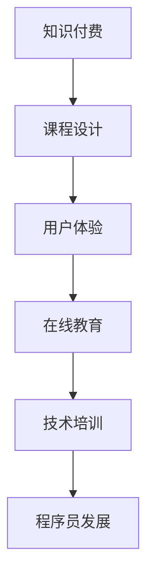

                 

# 程序员知识付费：打造体验课程

> 关键词：知识付费, 课程设计, 用户体验, 在线教育, 技术培训, 程序员发展

## 1. 背景介绍

随着互联网和信息技术的快速发展，在线教育已成为现代社会学习和知识获取的重要渠道。尤其是对于程序员这一职业来说，新技术、新工具和新方法层出不穷，更新换代速度极快。传统的线下培训往往时间成本高、覆盖面窄、互动性差，难以满足程序员对新知识快速掌握的需求。

因此，知识付费作为一种新兴的教育模式，逐渐被程序员群体接受。在线教育平台通过丰富的课程内容、互动性强的学习体验和灵活的学习时间，为程序员提供了极大的便利。程序员知识付费，正成为一种趋势，帮助程序员在繁忙的工作之余，利用碎片时间提升技能，实现职业发展。

## 2. 核心概念与联系

### 2.1 核心概念概述

为更好地理解如何打造高质量的程序员知识付费课程，本节将介绍几个密切相关的核心概念：

- **知识付费**：以付费方式获取优质知识内容的教育模式。在程序员领域，知识付费主要通过在线教育平台实现，如Coursera、Udemy、慕课网等，这些平台提供各类专业技能、编程语言、新技术等课程。

- **课程设计**：在线教育的核心在于课程内容的精心设计和组织。好的课程设计能够帮助学员高效掌握知识，激发学习兴趣。课程设计包括课程目标设定、内容选择、教学方法、互动设计等多个方面。

- **用户体验**：课程的受欢迎程度和效果，很大程度上取决于用户的学习体验。流畅的用户界面、丰富的互动元素、及时的反馈机制等，都能够提升用户的满意度和粘性。

- **在线教育**：通过互联网技术和云计算平台，提供在线学习资源和服务，使学习更加灵活、自主。在线教育打破了时间和空间的限制，使得全球用户都可以共享优质的教育资源。

- **技术培训**：在线教育的一个重要应用方向是技术培训。程序员知识付费课程通常涵盖编程语言、框架、算法、数据结构等多个技术主题，旨在帮助程序员提升技能，适应技术变革。

- **程序员发展**：知识付费课程为程序员提供了持续学习、技能提升的机会，有助于他们在职业生涯中实现从初级到高级的成长，适应新项目、新技术的要求。

这些核心概念之间的逻辑关系可以通过以下Mermaid流程图来展示：



这个流程图展示了一个从知识付费到程序员发展的完整流程，每一个环节都为下一环节奠定了基础。通过理解这些核心概念，我们可以更好地把握程序员知识付费课程的构建方向。

## 3. 核心算法原理 & 具体操作步骤
### 3.1 算法原理概述

打造程序员知识付费课程，本质上是一个内容制作和用户交互的优化过程。其核心思想是：利用高质量的课程内容和丰富的互动设计，最大化提升用户体验和学习效果。

形式化地，设课程内容为 $C$，用户反馈为 $F$，课程设计为 $D$。课程设计目标是找到最优的 $D$，使得：

$$
\max_{D} \sum_{i=1}^N u_i(F_i(D,C_i))
$$

其中 $u_i$ 为第 $i$ 个用户的学习效果，$C_i$ 为第 $i$ 个用户的课程内容，$F_i$ 为第 $i$ 个用户的反馈。

通过最大化用户反馈的效用函数，可以得到最优的课程设计方案。在实践中，我们通常使用用户满意度调查、学习进度跟踪、课程互动反馈等方法来衡量用户的学习效果和满意度。

### 3.2 算法步骤详解

打造程序员知识付费课程一般包括以下几个关键步骤：

**Step 1: 课程内容规划**
- 根据目标用户群体，选择合适的课程主题和技术栈。
- 确定课程难度和深度，设置合理的知识目标和技能要求。
- 对课程内容进行分解，划分不同模块和单元，设计互动和练习环节。

**Step 2: 课程资源准备**
- 收集和整理高质量的课程资料，如视频讲解、代码示例、参考文献等。
- 制作或采购教学工具和资源，如编程环境、在线测试、协作工具等。
- 邀请行业专家和讲师，录制高质量的课程视频和讲解。

**Step 3: 课程平台搭建**
- 选择合适的在线教育平台，或自建课程管理系统和学习平台。
- 设计用户友好的课程界面和交互元素，如课程目录、导航、笔记、论坛等。
- 集成课程管理、学习进度跟踪、互动反馈等功能模块。

**Step 4: 课程上线和推广**
- 将课程内容上传至在线平台，设置合适的价格和付费机制。
- 利用社交媒体、技术社区、邮件列表等渠道进行课程推广，吸引用户订阅和学习。
- 开展课程试听和反馈收集，不断优化课程内容和用户体验。

**Step 5: 用户互动和反馈**
- 设置实时互动功能，如直播答疑、在线讨论、编程实战等，增加用户参与感。
- 收集用户的学习反馈和评价，分析课程效果和改进方向。
- 根据用户反馈，定期更新和优化课程内容，确保课程的时效性和实用性。

以上是打造程序员知识付费课程的一般流程。在实际应用中，还需要针对具体用户群体和课程主题，对各个环节进行优化设计，如改进课程设计思路，引入更多互动技术，搜索最优的推广策略等，以进一步提升课程效果和用户满意度。

### 3.3 算法优缺点

打造程序员知识付费课程的优势在于：

- 针对性更强：课程内容可以针对特定技术栈或应用场景，满足用户特定需求。
- 灵活性高：用户可以根据自身节奏进行学习，灵活安排学习时间。
- 交互丰富：丰富的互动设计能够激发用户兴趣，提高学习效果。
- 持续更新：课程可以不断更新内容，保持与时俱进，反映最新的技术发展。

但课程制作也存在一些挑战：

- 内容制作成本高：高质量的课程内容需要耗费大量时间和精力，制作成本较高。
- 互动设计复杂：丰富的互动元素设计需要一定的技术支撑，增加了课程开发难度。
- 用户粘性难以保持：用户付费后可能缺乏持续学习动力，难以保持课程的长期吸引力。
- 内容质量难以保证：课程制作过程中容易忽略细节，导致部分内容质量不高。

尽管存在这些挑战，但通过不断迭代和优化，我们依然可以在程序员知识付费课程的打造中，提供更加丰富、高效、实用的学习体验，帮助程序员快速提升技能，适应技术发展的需求。

### 3.4 算法应用领域

程序员知识付费课程在多个领域得到了广泛应用，以下是几个典型的应用场景：

- **编程语言培训**：为初学者和进阶开发者提供编程语言的核心知识、语法细节、编程范式等。常见课程包括Python、Java、C++、Go等主流编程语言。

- **新技术和新框架**：帮助程序员掌握新兴技术，如机器学习、深度学习、区块链、云计算等。通过项目实战、案例分析、前沿讲解等方式，深入浅出地传授新技术。

- **软件工程和项目管理**：提供软件设计模式、编码规范、敏捷开发、项目管理等知识，帮助程序员提升工程能力和项目管理能力。

- **数据科学和数据分析**：教授数据处理、统计分析、机器学习、数据可视化等技能，帮助程序员在数据驱动的业务中发挥更大作用。

- **专业技能培训**：针对特定行业和职业，如人工智能工程师、安全工程师、测试工程师等，提供专业技能和行业知识的培训课程。

- **软技能提升**：注重培养编程之外的软技能，如团队合作、沟通协调、问题解决等，提升程序员的综合素质。

## 4. 数学模型和公式 & 详细讲解 & 举例说明
### 4.1 数学模型构建

本节将使用数学语言对程序员知识付费课程的评价模型进行更加严格的刻画。

设课程内容为 $C=\{c_1,c_2,...,c_m\}$，用户反馈为 $F=\{f_1,f_2,...,f_n\}$，其中 $f_i$ 表示第 $i$ 个用户对课程 $c_j$ 的反馈评分。课程设计为 $D$，课程设计参数为 $d_1,d_2,...,d_k$。

课程设计的目标是最优化用户反馈评分，即：

$$
\max_{d_1,d_2,...,d_k} \sum_{i=1}^n \sum_{j=1}^m u_{ij}(f_i(d_j,c_j))
$$

其中 $u_{ij}$ 为第 $i$ 个用户在课程 $c_j$ 上的学习效果评分函数，$f_i(d_j,c_j)$ 为课程 $c_j$ 在 $d_j$ 设计参数下的反馈评分。

### 4.2 公式推导过程

以用户满意度函数 $u_{ij}$ 为例，我们可以假设一个简单的满意度评分模型，将用户学习效果分为四个方面进行评估：

- **知识掌握度**：用户对课程内容的理解和掌握程度。
- **互动体验**：用户与课程互动的流畅度和反馈响应速度。
- **课程结构**：课程内容的结构安排和难度梯度。
- **环境适配**：用户使用课程环境的便捷性和舒适度。

每个方面的评分函数可以通过用户调查和数据分析得到，具体模型如下：

$$
u_{ij} = \alpha_k \sum_{k=1}^4 w_{ik} f_{ik}(f_i(d_k,c_k))
$$

其中 $\alpha_k$ 为权重系数，$w_{ik}$ 为每个方面的权重，$f_{ik}(f_i(d_k,c_k))$ 为第 $i$ 个用户对课程 $c_j$ 在 $d_k$ 参数下的评分。

通过上述评分模型，我们可以构建一个完整的课程设计优化问题，使用梯度上升等方法不断优化课程设计参数，最终得到最优的用户满意度评分。

### 4.3 案例分析与讲解

假设我们有一个Python基础课程，内容模块包括数据结构、面向对象编程、异常处理等。现在我们需要对课程设计进行优化，以提升用户的学习效果和满意度。

1. **知识掌握度**：通过问卷调查，发现用户对数据结构和面向对象编程的掌握度较低，而异常处理相对掌握较好。因此，我们决定在课程中增加这两个模块的学习难度和练习量。

2. **互动体验**：用户反馈课程视频的加载速度较慢，在线测试的评分系统不够智能。因此，我们决定优化视频缓存机制，引入自动化测试系统，提升互动体验。

3. **课程结构**：用户反馈课程内容不够紧凑，中间存在很多冗余。因此，我们对课程内容进行了重新编排，增加了一些实战练习，优化了整体结构。

4. **环境适配**：用户反馈课程视频无法在移动设备上流畅播放，导致学习中断。因此，我们优化了视频编码格式，增加了适应不同设备的播放选项。

通过这些优化措施，课程设计的满意度评分得到了显著提升，用户的学习效果也得到了改善。

## 5. 项目实践：代码实例和详细解释说明
### 5.1 开发环境搭建

在进行课程开发前，我们需要准备好开发环境。以下是使用Python进行Django开发的环境配置流程：

1. 安装Anaconda：从官网下载并安装Anaconda，用于创建独立的Python环境。

2. 创建并激活虚拟环境：
```bash
conda create -n course-dev python=3.8 
conda activate course-dev
```

3. 安装Django：根据CUDA版本，从官网获取对应的安装命令。例如：
```bash
conda install django 
```

4. 安装相关依赖：
```bash
pip install markdown django-crispy-forms django-compressor 
```

5. 安装数据库：
```bash
pip install mysqlclient 
```

完成上述步骤后，即可在`course-dev`环境中开始课程开发。

### 5.2 源代码详细实现

下面我们以一个简单的编程语言培训课程为例，给出使用Django框架构建在线课程的Python代码实现。

首先，定义课程模型：

```python
from django.db import models

class Course(models.Model):
    name = models.CharField(max_length=100)
    description = models.TextField()
    created_at = models.DateTimeField(auto_now_add=True)

class Module(models.Model):
    course = models.ForeignKey(Course, on_delete=models.CASCADE)
    title = models.CharField(max_length=100)
    content = models.TextField()
    created_at = models.DateTimeField(auto_now_add=True)

class Task(models.Model):
    module = models.ForeignKey(Module, on_delete=models.CASCADE)
    name = models.CharField(max_length=100)
    solution = models.TextField()
    created_at = models.DateTimeField(auto_now_add=True)
```

然后，定义用户模型和登录验证：

```python
from django.contrib.auth.models import User
from django.contrib.auth import authenticate, login

class UserProfile(models.Model):
    user = models.OneToOneField(User, on_delete=models.CASCADE)
    name = models.CharField(max_length=100)
    email = models.EmailField()

    def __str__(self):
        return self.name

def login_view(request):
    if request.method == 'POST':
        username = request.POST['username']
        password = request.POST['password']
        user = authenticate(request, username=username, password=password)
        if user is not None:
            login(request, user)
    return render(request, 'login.html')
```

接着，定义课程主界面和用户登录页面：

```python
from django.shortcuts import render
from django.http import HttpResponse

def index(request):
    courses = Course.objects.all()
    return render(request, 'index.html', {'courses': courses})

def login(request):
    if request.method == 'POST':
        username = request.POST['username']
        password = request.POST['password']
        user = authenticate(request, username=username, password=password)
        if user is not None:
            login(request, user)
    return render(request, 'login.html')
```

最后，启动开发服务器并进行测试：

```python
from django.core.management import runserver

if __name__ == '__main__':
    runserver()
```

以上是使用Django框架构建在线课程的完整代码实现。可以看到，Django提供了便捷的Web开发框架和模板引擎，使得课程开发变得相对容易。

### 5.3 代码解读与分析

让我们再详细解读一下关键代码的实现细节：

**Course模型**：
- 定义了课程的基本信息，如课程名称、描述、创建时间等。

**Module模型**：
- 定义了课程模块的信息，如模块名称、内容、创建时间等。

**Task模型**：
- 定义了课程任务的信息，如任务名称、解决方案、创建时间等。

**UserProfile模型**：
- 扩展了Django自带的用户模型，增加了用户的姓名和邮箱信息。

**login_view函数**：
- 实现了用户登录视图，通过用户名和密码进行认证，成功登录后调用`login`函数。

**index函数**：
- 显示所有课程的信息，方便用户选择学习。

**login函数**：
- 显示用户登录页面，接收用户输入的用户名和密码，进行身份验证。

通过这些代码，我们构建了一个简单的在线课程平台，用户可以通过登录查看课程信息，选择感兴趣的课程进行学习。当然，这只是一个初步的框架，实际开发中还需要添加更多功能，如课程上传、学习进度跟踪、课程互动、用户反馈等，以满足用户的实际需求。

## 6. 实际应用场景
### 6.1 软件开发培训

在线教育平台为软件开发培训提供了新的可能，使得企业能够高效地培养具备高技能的软件开发人才。传统的线下培训往往成本高、周期长，难以规模化部署。

例如，某知名互联网公司通过在线课程平台，为内部员工提供系统性的软件开发培训，涵盖Java、Python、数据库等多个技术栈。课程通过视频讲解、在线练习、项目实战等方式，帮助员工系统掌握最新技术，提升开发效率。此外，公司还可以根据内部需求，定制化开发课程内容，确保培训与实际工作紧密结合。

### 6.2 技术认证和培训

在线课程平台也为技术认证提供了新的途径。许多技术考试和认证，如AWS认证、Google Cloud认证、微软认证等，都可以通过在线课程进行学习和考试。用户可以根据自己的时间安排，随时随地进行学习和考试，灵活性大大提高。

例如，某在线教育平台与微软合作，推出了一系列的Azure认证课程，涵盖Azure云架构师、Azure开发人员等多个方向。这些课程不仅包括理论知识，还涵盖了实战项目，帮助用户通过考试获得认证。通过在线课程平台，用户可以在短时间内掌握核心技术，提高竞争力。

### 6.3 个性化学习

在线课程平台可以根据用户的学习进度和兴趣，进行个性化推荐。通过数据分析和机器学习技术，平台能够了解用户的知识水平和学习偏好，为其推荐合适的课程内容。

例如，某在线教育平台使用推荐算法，根据用户的课程完成度、测试成绩、学习时间等数据，为其推荐个性化的编程课程和项目实战机会。通过这种方式，用户可以更有针对性地进行学习，提升学习效果和满意度。

## 7. 工具和资源推荐
### 7.1 学习资源推荐

为了帮助开发者系统掌握程序员知识付费课程的设计和开发，这里推荐一些优质的学习资源：

1. **《在线教育平台设计与开发》书籍**：详细介绍了在线教育平台的设计和开发，包括课程设计、用户管理、互动设计等多个方面，提供了丰富的案例和实践指南。

2. **Coursera官方文档**：Coursera作为知名的在线教育平台，提供了丰富的课程设计和开发文档，包括课程结构设计、用户交互设计、平台开发等方面。

3. **Udemy开发课程**：Udemy是一个广泛使用的在线课程平台，提供大量有关在线教育平台开发的课程，涵盖了Django、Flask、React等多个技术栈。

4. **慕课网课程**：慕课网是国内知名的在线教育平台，提供丰富的编程和在线教育开发课程，涵盖了课程设计、课程平台搭建等多个方向。

5. **Google Web Fundamentals**：Google官方提供的Web开发指南，详细介绍了Web开发的最佳实践和最新技术，对于在线课程开发具有重要参考价值。

通过对这些资源的学习实践，相信你一定能够快速掌握程序员知识付费课程的设计和开发技巧，提供更加丰富、高效、实用的学习体验。

### 7.2 开发工具推荐

高效的开发离不开优秀的工具支持。以下是几款用于程序员知识付费课程开发的常用工具：

1. **Django框架**：Python的Web开发框架，提供了便捷的ORM、模板引擎和路由管理，适合快速迭代开发。

2. **Vue.js和React**：常用的前端开发框架，提供了丰富的组件库和路由管理，能够提升课程页面的用户体验。

3. **MySQL和PostgreSQL**：常用的关系型数据库，适合存储课程内容、用户信息和互动数据。

4. **Jupyter Notebook**：数据科学和机器学习的开发工具，支持Python和R语言，能够提供便捷的代码编写和交互式计算环境。

5. **Google Colab**：谷歌提供的在线Jupyter Notebook环境，免费提供GPU/TPU算力，适合进行数据科学和机器学习的实验。

6. **Adobe XD**：用于界面设计和用户体验（UX）开发的工具，能够快速设计课程界面和交互元素。

合理利用这些工具，可以显著提升程序员知识付费课程的开发效率，加快创新迭代的步伐。

### 7.3 相关论文推荐

程序员知识付费课程的发展得益于学界的持续研究。以下是几篇奠基性的相关论文，推荐阅读：

1. **《大规模在线教育平台的构建与优化》**：研究了在线教育平台的设计和优化问题，探讨了如何通过课程设计和用户管理提升用户体验和学习效果。

2. **《在线教育平台的用户行为分析与个性化推荐》**：利用机器学习和数据分析技术，对用户行为进行建模，提供个性化课程推荐，提升用户满意度。

3. **《课程设计的心理学与教育学基础》**：探讨了课程设计中的心理学和教育学原理，提供了构建优质课程的科学依据和方法。

4. **《大规模在线教育的挑战与解决方案》**：分析了大规模在线教育的挑战，提出了多种技术和策略，提升在线教育的规模和质量。

这些论文代表了大规模在线教育课程的发展脉络，通过学习这些前沿成果，可以帮助研究者把握学科前进方向，激发更多的创新灵感。

## 8. 总结：未来发展趋势与挑战
### 8.1 总结

本文对程序员知识付费课程的设计和开发进行了全面系统的介绍。首先阐述了知识付费和在线教育对程序员学习的重要意义，明确了课程设计在提升学习效果中的关键作用。其次，从原理到实践，详细讲解了课程设计的数学模型和关键步骤，给出了课程开发和推广的完整代码实例。同时，本文还广泛探讨了课程在软件开发培训、技术认证和个性化学习等多个场景中的应用前景，展示了课程开发的巨大潜力。此外，本文精选了课程开发的各类学习资源，力求为开发者提供全方位的技术指引。

通过本文的系统梳理，可以看到，程序员知识付费课程正在成为教育技术的重要应用，极大地拓展了在线教育的覆盖面，满足了程序员多样化的学习需求。未来，伴随在线教育技术的不断进步，课程设计的多样性和互动性将进一步提升，知识付费模式也将迎来新的突破，为程序员提供更加丰富、高效、实用的学习体验。

### 8.2 未来发展趋势

展望未来，程序员知识付费课程将呈现以下几个发展趋势：

1. **个性化学习成为常态**：基于用户行为数据分析和推荐算法，课程将变得更加个性化，满足用户的个性化学习需求。

2. **在线互动更加丰富**：通过视频直播、在线讨论、编程协作等丰富互动方式，提升用户的学习参与感和体验。

3. **虚拟现实和增强现实技术的应用**：VR/AR技术能够提供沉浸式的学习体验，增强用户的实际感受和操作体验。

4. **多模态学习方法的引入**：结合视频、文本、音频等多种模态内容，提供更为丰富、全面的学习资源。

5. **持续学习和职业发展支持**：课程设计将更加注重职业发展路径，提供进阶课程和职业规划支持，帮助用户实现职业成长。

6. **全球化教育资源的共享**：在线教育平台将更加开放，全球教育资源的共享和协作将更加便捷，提升教育的普及性和质量。

这些趋势凸显了程序员知识付费课程的广阔前景，为程序员的学习和发展提供了新的可能。

### 8.3 面临的挑战

尽管程序员知识付费课程取得了显著成就，但在迈向更加智能化、普适化应用的过程中，它仍面临着诸多挑战：

1. **内容制作成本高**：高质量的课程内容制作需要耗费大量时间和精力，制作成本较高。

2. **课程质量难以保证**：课程制作过程中容易忽略细节，导致部分内容质量不高。

3. **用户粘性难以保持**：用户付费后可能缺乏持续学习动力，难以保持课程的长期吸引力。

4. **互动体验复杂**：丰富的互动元素设计需要一定的技术支撑，增加了课程开发难度。

5. **数据隐私和安全**：用户数据的安全和隐私保护问题，是课程平台必须面对的重要挑战。

6. **平台服务质量**：课程平台的服务质量直接影响用户体验和学习效果，需要持续优化和改进。

7. **跨平台兼容性**：课程平台需要具备良好的跨平台兼容性，支持PC、移动端等多端访问。

正视课程制作和平台运营中的这些挑战，积极应对并寻求突破，将是课程平台发展的重要方向。

### 8.4 研究展望

面向未来，程序员知识付费课程的研究需要在以下几个方面寻求新的突破：

1. **高质量课程内容的自动生成**：利用自然语言处理和机器学习技术，自动生成高质量的课程内容，降低制作成本。

2. **课程内容的自动评估**：开发自动化的课程内容评估工具，检测课程内容的准确性和完整性，确保课程质量。

3. **用户行为分析的深度学习模型**：利用深度学习技术，对用户行为进行更深入的建模，提供更加精准的个性化推荐。

4. **课程内容的动态更新**：基于最新的技术进展和用户反馈，动态更新课程内容，保持课程的时效性和实用性。

5. **跨平台交互的设计和实现**：设计跨平台交互的用户界面，提升课程平台的可用性和用户体验。

6. **用户学习效果的实时监测**：开发实时监测工具，追踪用户的学习进度和效果，及时提供反馈和改进建议。

这些研究方向将为程序员知识付费课程提供更加科学、高效、灵活的解决方案，为在线教育技术的进步和应用推广奠定坚实基础。

## 9. 附录：常见问题与解答
**Q1：如何设计高质量的程序员知识付费课程？**

A: 设计高质量的程序员知识付费课程，需要从以下几个方面进行考虑：

1. **课程目标设定**：明确课程的核心目标和知识点，确保课程内容系统、全面、实用。

2. **课程内容选择**：根据目标用户群体，选择合适的技术栈和知识点，保证课程内容的前沿性和实用性。

3. **课程结构设计**：设计合理的课程结构，划分不同的模块和单元，增加互动和练习环节，提升学习效果。

4. **课程资源准备**：收集和整理高质量的课程资料，如视频讲解、代码示例、参考文献等，提供丰富的学习资源。

5. **课程平台搭建**：选择合适的在线教育平台，设计用户友好的课程界面和交互元素，集成课程管理、学习进度跟踪等功能。

6. **用户互动设计**：设计丰富的互动元素，如视频直播、在线讨论、编程协作等，提升用户的学习参与感。

7. **课程质量控制**：定期进行课程内容的审核和更新，确保课程内容的时效性和准确性。

**Q2：如何提升课程的用户体验？**

A: 提升课程用户体验的关键在于以下几个方面：

1. **界面设计**：设计简洁、美观、易用的课程界面，提升用户的操作体验。

2. **互动设计**：设计丰富的互动元素，如视频直播、在线讨论、编程协作等，提升用户的参与感和互动性。

3. **反馈机制**：建立及时的反馈机制，收集用户的意见和建议，不断改进课程内容和设计。

4. **个性化推荐**：利用用户行为数据分析和推荐算法，提供个性化的课程推荐，提升用户的满意度和粘性。

5. **学习路径设计**：设计合理的学习路径，帮助用户逐步掌握课程内容，提升学习效果。

6. **技术支持**：提供充足的技术支持，如在线答疑、技术支持、售后服务等，提升用户的体验和信任度。

**Q3：如何保证课程内容的质量？**

A: 保证课程内容的质量需要从以下几个方面进行考虑：

1. **内容审核**：对课程内容进行审核，确保内容的准确性和完整性。

2. **专家评审**：邀请行业专家和讲师进行内容评审，提供专业的意见和建议。

3. **用户反馈**：收集用户的反馈和评价，分析课程效果和改进方向。

4. **持续更新**：根据最新的技术进展和用户反馈，动态更新课程内容，保持课程的时效性和实用性。

5. **内容监控**：建立内容监控机制，及时发现和修正课程内容中的错误和不足。

**Q4：如何设计高质量的在线教育平台？**

A: 设计高质量的在线教育平台，需要从以下几个方面进行考虑：

1. **平台功能设计**：设计丰富的平台功能，如课程管理、学习进度跟踪、互动反馈等，提升用户的学习体验。

2. **技术架构设计**：选择合适的技术架构，如微服务架构、云计算架构等，提升平台的可扩展性和稳定性。

3. **用户体验设计**：设计简洁、美观、易用的用户界面，提升用户的操作体验。

4. **安全性设计**：设计安全可靠的平台架构，保护用户数据和平台安全。

5. **性能优化**：优化平台的性能，如数据缓存、负载均衡、性能监控等，提升平台的响应速度和可用性。

6. **国际化设计**：设计支持多语言和地区差异的平台，提升平台的全球覆盖性和用户体验。

通过这些设计思路，可以构建高质量的在线教育平台，为用户提供更加丰富、高效、实用的学习体验。

**Q5：如何保证课程内容的时效性？**

A: 保证课程内容的时效性需要从以下几个方面进行考虑：

1. **定期更新**：根据最新的技术进展和用户反馈，定期更新课程内容，保持课程的时效性。

2. **内容审核**：对课程内容进行审核，确保内容的准确性和完整性。

3. **专家评审**：邀请行业专家和讲师进行内容评审，提供专业的意见和建议。

4. **用户反馈**：收集用户的反馈和评价，分析课程效果和改进方向。

5. **动态调整**：根据用户的反馈和市场需求，动态调整课程内容和教学方法，提升课程的实用性和实用性。

6. **跨领域融合**：将其他领域的最新知识和技术，融入课程内容中，提升课程的前沿性和广泛性。

通过这些措施，可以确保课程内容始终保持最新，满足用户的学习需求。

---

作者：禅与计算机程序设计艺术 / Zen and the Art of Computer Programming

