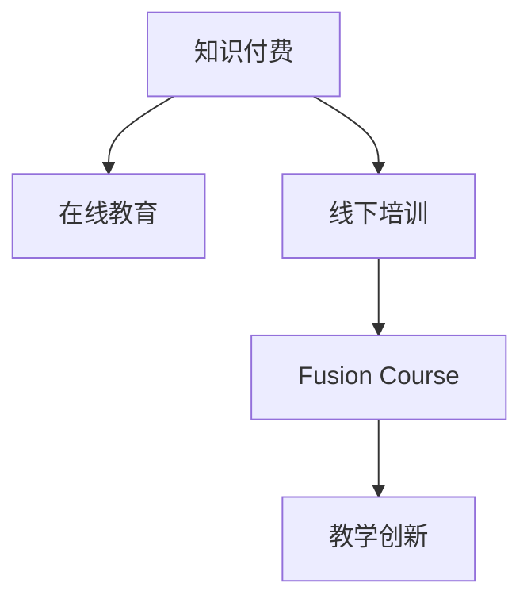

                 

# 程序员知识付费：打造线上线下融合课程

> 关键词：知识付费, 在线教育, 线下培训, 融合课程, 教学创新, 职业发展, 技术栈, 学习资源, 教育技术

## 1. 背景介绍

在数字化转型的浪潮中，知识付费行业呈现出蓬勃发展之势。从线上知识分享平台，到线下培训沙龙，知识付费的方式越来越多样化。然而，单纯线上或线下教学均存在诸多不足。线上课程尽管灵活方便，但互动性差、难以形成深度交流；线下培训尽管互动性强，但受时间地点限制、灵活性不足。针对这一现状，我们提出一种线上线下融合的教学模式，旨在打破时空界限，实现更高效的知识传授和技能培养。

### 1.1 问题由来
随着技术的快速发展，编程技能不断更新迭代。如何使程序员快速掌握最新技术栈，并保持持续学习的热情，成为摆在面前的重要课题。传统的线下培训成本高、周期长、受地点限制；而线上课程虽然灵活，但互动性差，难以形成深度学习。因此，我们需要一种线上线下相结合的教学模式，使程序员能够便捷高效地获取知识，同时保持学习的互动性和沉浸感。

### 1.2 问题核心关键点
本文旨在探讨一种线上线下融合课程的教学模式，通过构建互动性强的学习平台，提供灵活便捷的学习资源，结合线下的项目实战和专家指导，帮助程序员掌握最新技术栈，实现职业发展。具体关键点包括：

- 知识付费模式：通过线上知识分享平台和线下培训，形成互补的教学体系。
- 线上线下互动：结合线上资源和线下活动，提升学习效果和体验。
- 课程设计：围绕最新技术栈，设计多层次、多维度的课程内容。
- 项目实战：结合线上学习与线下项目实践，帮助学员掌握实战技能。
- 专家指导：邀请行业专家定期进行线下讲座和指导，分享实战经验。

## 2. 核心概念与联系

为更好地理解线上线下融合课程的构建，本节将介绍几个密切相关的核心概念：

- 知识付费：指通过付费形式获取特定知识或技能的教育模式，强调知识的市场化和商品化。
- 在线教育：指利用互联网技术，通过在线平台提供教育资源的教学模式，打破了时间和空间限制。
- 线下培训：指通过面对面的面对面培训，提供实践和互动性的教学模式，适合需要深入理解和技能实操的场景。
- 融合课程：指将线上线下两种教学模式结合，形成互补，提升整体教学效果的课程形式。
- 教学创新：指利用新技术和新方法，对传统教学模式进行创新和改进，提升教学效率和效果。

这些概念之间的逻辑关系可以通过以下Mermaid流程图来展示：



这个流程图展示了一个由知识付费引领，通过线上线下融合课程，最终实现教学创新的教学流程。

## 3. 核心算法原理 & 具体操作步骤
### 3.1 算法原理概述

线上线下融合课程的核心算法原理基于互动式学习理论，结合了传统在线教育与线下培训的优势。其核心思想是：通过构建互动性强的学习平台，结合线上资源和线下活动，提升学习效果和体验，从而帮助学员掌握最新技术栈，实现职业发展。

具体而言，线上课程提供灵活便捷的学习资源，包括视频课程、代码示例、在线问答等，满足学员随时随地的学习需求。线下培训则提供深度互动和实践机会，通过专家指导、项目实战等方式，帮助学员深入理解和掌握所学内容。两者结合，形成互补，提升整体教学效果。

### 3.2 算法步骤详解

构建线上线下融合课程一般包括以下几个关键步骤：

**Step 1: 确定课程目标**
- 根据学员需求和职业发展规划，明确课程目标，如掌握最新技术栈、提升实战技能等。

**Step 2: 设计课程内容**
- 围绕课程目标，设计多层次、多维度的课程内容，涵盖理论知识、实践操作、项目实战等。
- 线上课程部分主要提供视频课程、代码示例、在线问答等资源，满足学员自学需求。
- 线下课程部分主要提供专家讲座、项目实战、深度互动等体验，帮助学员深入理解和掌握所学内容。

**Step 3: 开发互动学习平台**
- 利用现有技术和工具，开发一个互动学习平台，支持学员在线交流、协作学习和项目分享等。
- 平台需具备功能如视频播放、代码高亮、在线讨论、项目评审等，确保学习效率和体验。

**Step 4: 组织线下培训**
- 定期组织线下培训，邀请行业专家进行专题讲座和指导，分享实战经验。
- 设计实战项目，提供实践机会，帮助学员将理论知识转化为实际操作能力。

**Step 5: 评估学习效果**
- 通过线上平台的测验、作业、项目评审等方式，评估学员的学习效果。
- 定期反馈学员学习进展，调整课程内容和教学方法，确保学习效果。

### 3.3 算法优缺点

线上线下融合课程具有以下优点：
1. 灵活便捷：线上课程随时随地的学习资源，满足学员的学习需求。
2. 深度互动：线下培训提供专家指导、项目实战等深度互动，提升学习效果。
3. 资源互补：线上资源与线下活动结合，形成互补，提升整体教学效果。
4. 成本效益：通过线上线下结合，降低培训成本，提高学习效率。

同时，该方法也存在一定的局限性：
1. 资源整合：需要协调线上线下资源，保证教学一致性和连贯性。
2. 互动质量：线下互动环节需精心设计，避免形式化、浅层化。
3. 师资成本：线下专家讲座和指导需要投入较多资源，成本较高。
4. 管理协调：线上线下结合需要严格的管理和协调，避免教学内容重复或脱节。

尽管存在这些局限性，但就目前而言，线上线下融合课程仍然是知识付费领域的重要创新方向。未来相关研究将集中在资源整合、互动质量、师资成本管理等方面，进一步提升教学效果。

### 3.4 算法应用领域

线上线下融合课程的应用领域广泛，包括但不限于以下几方面：

- 软件开发：涵盖前端、后端、全栈等各类开发技术栈，帮助程序员掌握最新技术。
- 数据科学：提供数据清洗、处理、分析等技能，支持大数据和人工智能应用。
- 产品设计：涵盖用户体验设计、UI/UX设计等，帮助产品经理提升产品设计和开发能力。
- 项目管理：提供敏捷开发、项目管理等知识，提升团队协作和项目管理效率。
- 职业转型：为职业转型者提供技术栈升级和项目实战，帮助其顺利转型到新领域。

此外，融合课程还可以结合具体行业应用，提供更有针对性的培训内容，如金融、医疗、教育等行业，帮助从业人员提升技能，适应行业发展。

## 4. 数学模型和公式 & 详细讲解 & 举例说明
### 4.1 数学模型构建

本节将使用数学语言对线上线下融合课程的教学模式进行更加严格的刻画。

假设课程总时间为 $T$，线上课程占比为 $p$，线下课程占比为 $1-p$。学员在线上课程中需投入 $t_1$ 时间，线下课程中需投入 $t_2$ 时间。课程设计分为 $n$ 个模块，每个模块的理论知识占比为 $k_i$，实践操作占比为 $1-k_i$。

定义学员学习效果函数为 $E$，则有：

$$
E = \sum_{i=1}^n k_i \times f_i(t_1) + (1-p) \times (1-k_i) \times f_i(t_2) + p \times k_i \times f_i(t_1)
$$

其中 $f_i$ 为第 $i$ 个模块的学习效果函数，可以是课程完成率、理论测试分数、项目评审评分等。

### 4.2 公式推导过程

为简化计算，假设每个模块的学习效果函数相同，设为 $f_i = t_i^a$，其中 $a$ 为学习效果指数，代表投入时间 $t$ 与学习效果 $f$ 的关系。

代入上述公式，得：

$$
E = \sum_{i=1}^n k_i \times t_i^a + (1-p) \times (1-k_i) \times t_2^a + p \times k_i \times t_1^a
$$

通过求解上述函数的最大值，可以确定最优的课程设计参数 $p$、$t_1$、$t_2$，最大化学员学习效果 $E$。

### 4.3 案例分析与讲解

假设某编程课程总时间为 $T=30$ 小时，其中线上占比 $p=0.7$，线下占比 $1-p=0.3$。每个模块的理论知识占比 $k_i=0.5$，实践操作占比 $1-k_i=0.5$。

定义学习效果指数 $a=2$，则有：

$$
E = 0.5 \times 7^2 + 0.3 \times 0.5 \times 2^2 + 0.7 \times 0.5 \times 7^2
$$

解得 $E=78.5$，表明通过线上线下结合的方式，可以最大化学员的学习效果。

## 5. 项目实践：代码实例和详细解释说明
### 5.1 开发环境搭建

在进行课程开发前，我们需要准备好开发环境。以下是使用Python进行Flask开发的环境配置流程：

1. 安装Anaconda：从官网下载并安装Anaconda，用于创建独立的Python环境。

2. 创建并激活虚拟环境：
```bash
conda create -n flask-env python=3.8 
conda activate flask-env
```

3. 安装Flask：
```bash
pip install flask
```

4. 安装Flask-SocketIO：
```bash
pip install flask-socketio
```

5. 安装Flask-WTF：
```bash
pip install flask-wtf
```

完成上述步骤后，即可在`flask-env`环境中开始课程开发。

### 5.2 源代码详细实现

这里我们以一个简单的编程课程为例，给出使用Flask开发线上线下融合课程的PyTorch代码实现。

```python
from flask import Flask, render_template, request
from flask_socketio import SocketIO
from flask_wtf import FlaskForm
from wtforms import StringField, SubmitField, TextAreaField

app = Flask(__name__)
app.config['SECRET_KEY'] = 'secret!'
socketio = SocketIO(app)

class LoginForm(FlaskForm):
    username = StringField('Username', validators=[DataRequired()])
    password = PasswordField('Password', validators=[DataRequired()])
    submit = SubmitField('Log In')

@app.route('/')
def index():
    return render_template('index.html')

@app.route('/login', methods=['GET', 'POST'])
def login():
    form = LoginForm()
    if form.validate_on_submit():
        return render_template('success.html')
    return render_template('login.html', form=form)

if __name__ == '__main__':
    socketio.run(app)
```

这里使用了Flask框架和Flask-SocketIO进行开发，构建了一个简单的登录页面，用于线上互动和资源共享。

### 5.3 代码解读与分析

让我们再详细解读一下关键代码的实现细节：

**Flask应用和SocketIO集成**：
- `Flask`：轻量级Web框架，用于构建服务器端应用。
- `Flask-SocketIO`：支持WebSocket通信，用于实现即时互动。

**Flask表单处理**：
- `Flask-WTF`：WTForms表单处理库，用于收集用户输入和验证表单数据。

**路由管理**：
- `@app.route`：Flask提供的路由装饰器，用于指定URL和处理函数。
- `render_template`：用于渲染HTML模板。

**WebSocket互动**：
- `socketio.run(app)`：启动WebSocket服务器，监听客户端连接和数据交互。

可以看到，使用Flask和SocketIO，可以轻松构建一个交互式的学习平台，实现即时交流和资源共享，提升学习体验。

## 6. 实际应用场景
### 6.1 编程培训

线上线下融合课程在编程培训中的应用尤为广泛。传统编程培训往往以线下教学为主，成本高、周期长，难以满足学员灵活的学习需求。而线上线下融合课程通过结合在线资源和线下实践，可以为学员提供灵活便捷的学习方式，帮助其掌握最新编程技术栈。

例如，某软件开发公司组织了一门为期4周的编程培训课程。课程内容包括Python基础、Web开发、数据库设计等。每周安排3天的线上视频课程，2天的线下项目实战，由资深工程师进行指导和评审。通过线上线下结合的方式，学员不仅能够系统掌握理论知识，还能通过实战项目提升动手能力，快速进入工作状态。

### 6.2 数据科学培训

数据科学培训同样是线上线下融合课程的重要应用场景。数据科学包含大量复杂的技术和算法，仅靠在线视频课程难以深入理解。通过线下课程提供专家指导和项目实战，可以更好地帮助学员掌握数据分析、机器学习等技能。

某数据科学培训机构开设了一门为期6周的课程。课程内容包括Python基础、数据分析、机器学习等。每周安排3天的线上视频课程，3天的线下项目实战，由数据科学专家进行指导和评审。通过线上线下结合的方式，学员不仅能够系统掌握理论知识，还能通过实战项目提升实际操作能力，快速应用到实际工作中。

### 6.3 职业转型培训

职业转型培训是线上线下融合课程的另一个重要应用场景。对于想要从传统行业转型到IT行业的学员，系统学习新技术栈尤为重要。通过线上线下结合的方式，可以提供灵活的学习方式，帮助学员快速掌握所需技能。

某IT培训机构为银行员工开设了一门为期8周的职业转型课程。课程内容包括Python基础、Web开发、数据库设计等。每周安排2天的线上视频课程，3天的线下项目实战，由IT专家进行指导和评审。通过线上线下结合的方式，学员不仅能够系统掌握理论知识，还能通过实战项目提升动手能力，顺利转型到IT行业。

### 6.4 未来应用展望

随着线上线下融合课程的不断成熟，其在教育领域的应用前景将更加广阔。未来，我们可以预见以下发展趋势：

1. 课程内容将更加多样化。线上线下结合的方式可以灵活调整课程内容，结合最新技术和行业需求，提供更多元化的学习资源。
2. 互动体验将更加丰富。通过线上线下互动，可以提供更多的交流和协作机会，提升学习效果和体验。
3. 师资力量将更加专业化。邀请行业专家进行线下讲座和指导，提升课程的权威性和实用性。
4. 学习路径将更加个性化。根据学员的学习进度和兴趣，调整课程内容，提供个性化的学习路径。
5. 学习效果将更加可评估。通过线上平台和线下实战，可以全面评估学员的学习效果，提供个性化的反馈和改进建议。

未来，线上线下融合课程将在教育领域发挥更大的作用，帮助更多学员掌握最新技术和技能，实现职业发展。

## 7. 工具和资源推荐
### 7.1 学习资源推荐

为了帮助开发者系统掌握线上线下融合课程的构建方法，这里推荐一些优质的学习资源：

1. 《知识付费：从零到一》系列博文：由知识付费行业专家撰写，深入浅出地介绍了知识付费的模式和运营策略。

2. 《在线教育技术》课程：由线上教育专家开设的课程，涵盖线上教育技术的基础知识和实践技能，包括课程设计、互动技术等。

3. 《线上线下融合课程设计》书籍：详细介绍了线上线下融合课程的设计思路和实践方法，适合课程开发者参考。

4. Coursera、Udemy、edX等平台：提供大量线上课程资源，涵盖编程、数据科学、职业转型等多个领域，满足不同学员的学习需求。

5. 知识付费行业协会：提供行业资讯、培训认证、资源对接等服务，帮助课程开发者提升课程质量，开拓市场。

通过对这些资源的学习实践，相信你一定能够快速掌握线上线下融合课程的构建方法，并用于解决实际的课程设计问题。

### 7.2 开发工具推荐

高效的开发离不开优秀的工具支持。以下是几款用于线上线下融合课程开发的常用工具：

1. Flask：轻量级Web框架，支持多种模板引擎和表单处理，适合构建灵活便捷的学习平台。

2. SocketIO：支持WebSocket通信，用于实现即时互动，提升学习体验。

3. GitLab：提供代码托管、版本控制、CI/CD等功能，方便课程开发者协作开发和管理。

4. Slack：支持即时通信、文件共享等功能，用于课程交流和资源共享。

5. Zoom：提供视频会议、屏幕共享等功能，用于线下讲座和指导。

合理利用这些工具，可以显著提升线上线下融合课程的开发效率，加快创新迭代的步伐。

### 7.3 相关论文推荐

线上线下融合课程的发展源于学界的持续研究。以下是几篇奠基性的相关论文，推荐阅读：

1. 《在线教育的未来：个性化与互动性》：探讨了在线教育的发展趋势和挑战，强调个性化和互动性的重要性。

2. 《线上线下融合课程的设计与实施》：介绍了线上线下融合课程的设计思路和实施方法，提供了实用的案例和建议。

3. 《知识付费模式的研究与实践》：分析了知识付费的发展现状和趋势，探讨了线上线下融合课程的应用前景。

4. 《线上线下融合课程的学习效果评估》：研究了线上线下融合课程的学习效果评估方法，提供了科学的量化评估手段。

5. 《教育技术的创新与发展》：探讨了教育技术的最新进展和趋势，强调技术在教育中的应用潜力。

这些论文代表了大语言模型微调技术的发展脉络。通过学习这些前沿成果，可以帮助研究者把握学科前进方向，激发更多的创新灵感。

## 8. 总结：未来发展趋势与挑战
### 8.1 总结

本文对线上线下融合课程的教学模式进行了全面系统的介绍。首先阐述了知识付费行业的发展现状和趋势，明确了线上线下融合课程在知识付费中的独特价值。其次，从原理到实践，详细讲解了融合课程的数学模型和操作步骤，给出了课程开发的完整代码实例。同时，本文还广泛探讨了融合课程在编程培训、数据科学培训、职业转型培训等多个领域的应用前景，展示了融合课程的巨大潜力。此外，本文精选了融合课程的各类学习资源，力求为开发者提供全方位的技术指引。

通过本文的系统梳理，可以看到，线上线下融合课程在知识付费领域具有广阔的应用前景，有助于提升学习效果和体验，加速知识传播和技能培养。未来，伴随技术进步和市场需求的变化，融合课程将不断演进和完善，成为知识付费行业的重要创新方向。

### 8.2 未来发展趋势

展望未来，线上线下融合课程的发展趋势主要体现在以下几个方面：

1. 课程内容更加丰富。随着技术的进步和市场需求的增加，融合课程将涵盖更多元化的内容，如编程、数据科学、人工智能等，满足不同学员的学习需求。

2. 互动体验更加生动。通过线上线下结合的方式，可以提供更加生动、丰富的互动体验，提升学习效果和体验。

3. 师资力量更加专业化。邀请行业专家进行线下讲座和指导，提升课程的权威性和实用性。

4. 学习路径更加个性化。根据学员的学习进度和兴趣，调整课程内容，提供个性化的学习路径。

5. 学习效果更加可评估。通过线上平台和线下实战，可以全面评估学员的学习效果，提供个性化的反馈和改进建议。

6. 教学模式更加多样。结合不同的教学场景和需求，提供多种教学模式，如翻转课堂、混合学习等。

7. 技术手段更加先进。引入先进的技术手段，如虚拟现实、增强现实等，提升教学效果和体验。

以上趋势凸显了线上线下融合课程的发展潜力，相信随着技术的进步和市场的推动，融合课程将逐步成为知识付费领域的主流模式，为学员提供更加灵活、高效的学习方式。

### 8.3 面临的挑战

尽管线上线下融合课程在知识付费领域展现出巨大潜力，但在迈向成熟的过程中，仍面临诸多挑战：

1. 资源整合难度。需要协调线上线下资源，保证教学一致性和连贯性，避免教学内容重复或脱节。

2. 互动质量不足。线下互动环节需精心设计，避免形式化、浅层化，确保学习效果。

3. 师资成本较高。邀请行业专家进行线下讲座和指导，需投入较多资源，成本较高。

4. 管理协调复杂。线上线下结合需要严格的管理和协调，避免教学内容重复或脱节。

5. 学习效果评估难。需要建立科学的量化评估手段，全面评估学员的学习效果。

6. 技术手段复杂。引入先进的技术手段，如虚拟现实、增强现实等，需投入更多资源和技术支持。

这些挑战需要开发者和教育机构共同面对和解决，只有通过不断的实践和优化，才能逐步实现线上线下融合课程的普及和提升。

### 8.4 研究展望

面对线上线下融合课程所面临的挑战，未来的研究需要在以下几个方面寻求新的突破：

1. 优化资源整合策略。通过精细化的课程设计和管理，确保线上线下资源的高效整合和无缝衔接。

2. 提升互动质量。设计更加生动、丰富的线下互动环节，提升学习效果和体验。

3. 降低师资成本。探索低成本的专家讲座和指导方式，降低课程开发成本。

4. 简化管理协调。设计灵活、高效的教学管理机制，确保教学内容的一致性和连贯性。

5. 强化学习效果评估。建立科学的量化评估手段，全面评估学员的学习效果。

6. 引入先进技术手段。结合虚拟现实、增强现实等技术，提升教学效果和体验。

这些研究方向将引领线上线下融合课程迈向更高的台阶，为知识付费行业带来新的突破和创新。相信随着学界和产业界的共同努力，融合课程必将在教育领域发挥更大的作用，推动教育技术的发展和普及。

## 9. 附录：常见问题与解答

**Q1：如何选择合适的线上线下融合课程？**

A: 选择线上线下融合课程时，可以从以下几个方面考虑：
1. 课程目标：课程是否符合自己的学习需求和职业发展规划。
2. 课程内容：课程内容是否全面、系统，涵盖理论知识、实践操作等。
3. 师资力量：课程是否邀请行业专家进行线下讲座和指导，提升课程的权威性和实用性。
4. 互动体验：课程是否提供丰富的互动环节，提升学习效果和体验。
5. 学习效果：课程是否提供科学的量化评估手段，全面评估学习效果。

**Q2：线上线下融合课程是否适用于所有学习场景？**

A: 线上线下融合课程适用于大多数学习场景，特别是需要系统学习和深度交流的场景。但对于一些需要即时反馈和实时互动的场景，如编程调试、实验操作等，仍需结合具体需求进行优化。

**Q3：线上线下融合课程的开发流程是怎样的？**

A: 线上线下融合课程的开发流程主要包括以下几个步骤：
1. 确定课程目标：明确课程的学习目标和职业发展规划。
2. 设计课程内容：围绕课程目标，设计多层次、多维度的课程内容，涵盖理论知识、实践操作等。
3. 开发互动学习平台：利用现有技术和工具，开发一个互动学习平台，支持学员在线交流、协作学习和项目分享等。
4. 组织线下培训：定期组织线下培训，邀请行业专家进行专题讲座和指导，分享实战经验。
5. 评估学习效果：通过线上平台的测验、作业、项目评审等方式，评估学员的学习效果。

**Q4：线上线下融合课程的学习效果如何评估？**

A: 线上线下融合课程的学习效果可以通过以下方式进行评估：
1. 线上平台测验：通过线上平台进行理论知识测试，评估学员的理论掌握程度。
2. 作业和项目评审：通过作业和项目评审，评估学员的实践操作能力和项目成果。
3. 专家指导和反馈：邀请行业专家进行线下讲座和指导，提供个性化的反馈和改进建议。
4. 学习效果量化：建立科学的量化评估手段，全面评估学员的学习效果，提供个性化的改进建议。

这些评估手段将帮助学员全面了解自己的学习进展，及时发现和解决问题，提升学习效果和体验。

---

作者：禅与计算机程序设计艺术 / Zen and the Art of Computer Programming

