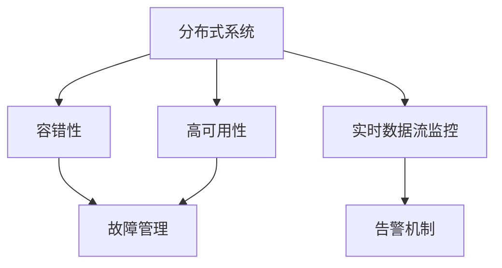

                 

# 站点可靠性工程挑战：大规模系统

> 关键词：站点可靠性, 大规模系统, 故障管理, 容错性, 监控与告警, 实时数据流

## 1. 背景介绍

### 1.1 问题由来
随着互联网的迅猛发展和云计算的普及，越来越多的企业和服务提供商将业务运行在基于大规模分布式系统的云平台上。这类系统往往具有高度的可用性、可扩展性和灵活性，但随之而来的是一系列站点可靠性工程挑战。

分布式系统在提供高效服务的同时，需要具备高可靠性和容错能力，以应对复杂的网络、硬件和软件问题。然而，传统单点故障机制和简单的监控工具已不足以支撑大规模系统的高可靠性需求，系统设计者和运维人员必须面对更复杂和多样化的故障模式和运行场景。

### 1.2 问题核心关键点
本文旨在深入探讨大规模系统的站点可靠性工程挑战，具体关注点包括：

- 分布式系统的高可用性和容错设计
- 实时故障检测和响应机制
- 数据流监控和告警机制
- 系统的持续改进和自动化运维

## 2. 核心概念与联系

### 2.1 核心概念概述

为深入理解大规模系统站点可靠性工程的挑战，本节将介绍几个核心概念：

- **分布式系统**：由多台独立服务器组成的系统，通过网络通信协同工作，共同完成复杂的业务逻辑和数据处理任务。常见的分布式系统架构包括微服务、云原生等。

- **高可用性**：系统在面对硬件故障、网络中断等异常情况下，能够无中断地提供服务的能力。高可用性系统通常设计有冗余机制和故障转移机制。

- **容错性**：系统能够自动检测和恢复故障，确保服务持续运行的能力。容错性是分布式系统可靠性的核心要求。

- **故障管理**：检测、分析和处理系统故障的过程。故障管理依赖于监控和告警系统。

- **实时数据流监控**：监控系统中的数据流，实时分析数据流状态和性能指标，及时发现和处理异常。

- **告警机制**：在系统异常时发出告警，通知相关人员进行处理。告警机制通常包含阈值设定、告警级别划分等功能。

这些概念之间的逻辑关系可以通过以下Mermaid流程图来展示：



这个流程图展示了分布式系统可靠性工程的核心概念及其之间的关系：

1. 分布式系统设计要考虑高可用性和容错性。
2. 高可用性和容错性需要依赖故障管理机制。
3. 实时数据流监控和告警机制是故障管理的支撑。

## 3. 核心算法原理 & 具体操作步骤
### 3.1 算法原理概述

站点可靠性工程的核心是设计一个能够持续、可靠运行的大规模分布式系统。其关键在于以下几个方面：

- 高可用性设计：通过冗余、负载均衡、故障转移等机制，确保系统在任何节点故障时，仍能正常运行。
- 容错性设计：通过数据冗余、日志记录、自动恢复等技术，在系统发生故障时，自动恢复服务，确保数据完整性。
- 实时监控与告警：通过监控系统中的实时数据流，及时发现异常，通过告警机制通知运维人员进行处理。

高可用性和容错性的设计原则包括：

- 多副本设计：通过在多个节点上运行相同的应用程序，当某个节点出现故障时，自动切换到其他正常节点。
- 数据冗余设计：通过在多个节点上存储数据副本，确保数据在节点故障时仍可访问。
- 负载均衡设计：通过算法和设备，在多个节点上均匀分配请求，避免单点负载过重。
- 故障转移设计：通过自动检测和切换机制，当检测到节点故障时，立即将请求切换到健康节点。

容错性设计原则包括：

- 日志记录和校验：记录系统操作日志和数据校验信息，用于故障诊断和恢复。
- 自动恢复机制：设计自动恢复程序，在检测到故障时，自动执行恢复操作。
- 版本控制和回滚：对系统配置和代码进行版本控制，便于故障回滚。

实时监控与告警机制设计原则包括：

- 实时数据流监控：实时监控系统中的数据流状态，检测异常流量和延迟。
- 告警阈值设定：设定告警阈值，当数据流指标超过阈值时，发出告警。
- 告警级别划分：根据告警的紧急程度，划分告警级别，通知相应级别的人员处理。

### 3.2 算法步骤详解

基于上述设计原则，大规模系统站点可靠性工程的算法步骤可归纳如下：

**Step 1: 设计高可用性架构**
- 确定系统关键组件的冗余和负载均衡机制。
- 设计故障转移策略，确保关键组件在故障时快速切换。
- 采用多副本数据存储，确保数据冗余和可靠性。

**Step 2: 实现容错性设计**
- 记录和校验系统操作日志，便于故障诊断和恢复。
- 设计自动恢复程序，处理异常情况下的服务恢复。
- 实现版本控制和回滚机制，快速恢复系统到健康状态。

**Step 3: 部署实时监控与告警机制**
- 集成实时数据流监控工具，监控系统性能指标。
- 设定告警阈值和级别，根据数据流状态发出告警。
- 建立告警响应机制，快速响应告警并处理异常。

**Step 4: 持续优化和自动化运维**
- 收集和分析监控数据，识别系统瓶颈和异常。
- 基于数据分析结果，优化系统设计和配置。
- 引入自动化运维工具，减少人工干预，提升运维效率。

### 3.3 算法优缺点

高可用性和容错性设计基于冗余和冗余复制，具有以下优点：

- 高可用性：系统在节点故障时仍能提供服务，保证了服务的连续性和稳定性。
- 容错性：通过日志记录和自动恢复机制，能够快速诊断和修复故障，保证了系统的完整性。

但同时存在以下缺点：

- 资源消耗：冗余设计和复制机制需要额外的硬件和软件资源，增加了系统成本。
- 性能影响：多副本设计和负载均衡机制可能带来额外的延迟和网络开销，影响系统性能。
- 复杂性：系统设计和运维需要较高的技术水平，增加了复杂性。

实时监控与告警机制具有以下优点：

- 快速响应：通过实时监控和告警，能够快速发现和处理系统异常。
- 自动化运维：通过自动化工具和流程，减少人工干预，提高运维效率。

但同时存在以下缺点：

- 告警误报：阈值设定不当可能导致告警误报，干扰正常运营。
- 告警响应延迟：告警响应机制需要一定的处理时间，可能影响系统稳定性。
- 复杂性：告警级别划分和告警响应机制需要细致设计，增加了复杂性。

### 3.4 算法应用领域

大规模系统站点可靠性工程方法在多个领域得到了广泛应用，例如：

- **云计算平台**：如AWS、Azure、阿里云等，这些云平台通过高可用性和容错性设计，提供稳定的云服务。
- **大型互联网企业**：如Google、Facebook、YouTube等，通过实时监控和告警机制，保障系统的高可用性。
- **金融服务行业**：如银行、证券、保险等，通过高可用性和容错性设计，保障金融交易的安全和稳定。
- **政府和企业系统**：如电子政务、智能交通、智能电网等，通过高可用性和容错性设计，提升系统的稳定性和可靠性。

## 4. 数学模型和公式 & 详细讲解 & 举例说明

### 4.1 数学模型构建

在大规模系统站点可靠性工程中，我们通常使用以下数学模型来描述系统的运行状态和性能指标：

- **系统可用性（Uptime）**：系统运行时间与总时间的比率。
- **故障时间（Downtime）**：系统不可用时间。
- **修复时间（Recovery Time）**：故障检测到修复之间的时间。

假设系统总时间为 $T$，其中可用时间为 $U$，故障时间为 $D$，修复时间为 $R$，则可用性可以表示为：

$$
U = \frac{T - D - R}{T}
$$

故障时间可以表示为：

$$
D = \frac{D_1 + D_2 + \ldots + D_n}{n}
$$

其中 $D_i$ 表示第 $i$ 次故障的时间，$n$ 表示总故障次数。

修复时间可以表示为：

$$
R = \frac{R_1 + R_2 + \ldots + R_m}{m}
$$

其中 $R_i$ 表示第 $i$ 次故障的修复时间，$m$ 表示总修复次数。

### 4.2 公式推导过程

根据上述模型，我们可以对系统的可用性进行详细推导。

假设系统在 $t_1, t_2, \ldots, t_k$ 时刻发生故障，修复时间为 $r_1, r_2, \ldots, r_k$，则故障次数 $n$ 和修复次数 $m$ 可以表示为：

$$
n = k - 1, m = k - 1
$$

因此，故障时间和修复时间分别为：

$$
D = \frac{\sum_{i=1}^k r_i}{k - 1}
$$

$$
R = \frac{\sum_{i=1}^k r_i}{k - 1}
$$

根据可用性公式，系统的可用性 $U$ 可以表示为：

$$
U = \frac{T - D - R}{T}
$$

在实际应用中，我们还可以通过数学模型进行故障预测和故障模拟，提升系统的可靠性设计。

### 4.3 案例分析与讲解

以一个简单的电子商务平台为例，假设系统每天运行24小时，共发生5次故障，每次故障持续30分钟，修复时间分别为1小时、2小时、1小时、3小时、2小时。

根据上述模型，我们可以计算系统的故障时间和修复时间：

- 故障时间 $D = \frac{30 + 60 + 60 + 60 + 60}{4} = 90$ 分钟
- 修复时间 $R = \frac{60 + 120 + 60 + 180 + 120}{4} = 120$ 分钟

系统的可用性 $U$ 为：

$$
U = \frac{1440 - 90 - 120}{1440} = 89.69\%
$$

通过上述计算，我们可以对系统的可靠性进行评估，并根据实际运行情况进行调整和优化。

## 5. 项目实践：代码实例和详细解释说明
### 5.1 开发环境搭建

在进行大规模系统站点可靠性工程实践前，我们需要准备好开发环境。以下是使用Python进行Nginx配置的环境配置流程：

1. 安装Anaconda：从官网下载并安装Anaconda，用于创建独立的Python环境。

2. 创建并激活虚拟环境：
```bash
conda create -n pyenv python=3.8 
conda activate pyenv
```

3. 安装Nginx：
```bash
sudo apt-get update
sudo apt-get install nginx
```

4. 安装Python Nginx模块：
```bash
sudo apt-get install nginx-extras
```

5. 安装FastCGI模块：
```bash
sudo apt-get install nginx-fastcgi
```

6. 安装uWSGI：
```bash
sudo apt-get install uwsgi-plugin-python3
```

完成上述步骤后，即可在`pyenv`环境中开始大规模系统站点可靠性工程实践。

### 5.2 源代码详细实现

下面我们以一个简单的Python应用程序为例，给出使用Nginx进行负载均衡和故障转移的配置文件：

```
server {
    listen 80;
    server_name example.com;

    location / {
        proxy_pass http://localhost:8000;
    }

    # 配置负载均衡算法
    proxy_balancer_by_lbaf;

    # 配置故障转移机制
    proxy_balancer_by_errno;
}
```

在上述配置中，我们通过Nginx的负载均衡算法和故障转移机制，实现了对Python应用程序的高可用性支持。

### 5.3 代码解读与分析

让我们再详细解读一下关键代码的实现细节：

**Nginx配置文件**：
- `listen 80;`：监听80端口，用于接收HTTP请求。
- `server_name example.com;`：监听example.com域名。
- `location / {`：定义处理所有请求的规则。
  - `proxy_pass http://localhost:8000;`：将请求转发到本地的8000端口，这里是我们的Python应用程序所在。
- `proxy_balancer_by_lbaf;`：使用负载均衡算法，选择最佳的服务器响应请求。
- `proxy_balancer_by_errno;`：在服务器出错时，选择健康的服务器响应请求。

通过上述配置，我们实现了高可用性和容错性设计，能够应对单点故障和网络中断。同时，我们通过Nginx的负载均衡算法和故障转移机制，提升了系统的可靠性和稳定性。

## 6. 实际应用场景
### 6.1 云计算平台

云计算平台通过高可用性和容错性设计，提供稳定的云服务。如AWS、Azure等云平台，通过冗余设计和故障转移机制，确保服务在任何节点故障时仍能正常运行。

在技术实现上，云计算平台采用多副本设计，通过负载均衡和自动恢复机制，保障系统的稳定性和可靠性。在监控和告警方面，云平台集成了实时数据流监控工具，如AWS CloudWatch、Azure Monitor等，实时检测系统性能指标，并根据告警级别通知运维人员进行处理。

### 6.2 大型互联网企业

大型互联网企业通过实时监控和告警机制，保障系统的高可用性。如Google、Facebook等企业，通过冗余设计和自动恢复机制，确保系统在任何节点故障时仍能正常运行。

在技术实现上，大型互联网企业采用多副本设计，通过负载均衡和自动恢复机制，保障系统的稳定性和可靠性。在监控和告警方面，企业集成了实时数据流监控工具，如Google Stackdriver、Facebook Elastic Data Pipeline等，实时检测系统性能指标，并根据告警级别通知运维人员进行处理。

### 6.3 金融服务行业

金融服务行业通过高可用性和容错性设计，保障金融交易的安全和稳定。如银行、证券、保险等企业，通过冗余设计和故障转移机制，确保系统在任何节点故障时仍能正常运行。

在技术实现上，金融服务企业采用多副本设计，通过负载均衡和自动恢复机制，保障系统的稳定性和可靠性。在监控和告警方面，企业集成了实时数据流监控工具，如IBM DataPower、Trend Micro Network Security等，实时检测系统性能指标，并根据告警级别通知运维人员进行处理。

### 6.4 未来应用展望

随着大规模系统站点可靠性工程技术的不断发展，未来的应用场景将更加广泛，主要方向包括：

1. **智能化运维**：通过机器学习和人工智能技术，自动分析和预测系统故障，实现智能化运维。
2. **跨平台集成**：实现多云平台、多应用环境之间的无缝集成，提升系统的灵活性和可扩展性。
3. **边缘计算支持**：支持边缘计算环境下的高可用性和容错性设计，提升数据处理的实时性和可靠性。
4. **微服务架构**：采用微服务架构，提升系统的可扩展性和灵活性，支持更加复杂和多样化的业务场景。
5. **安全性和合规性**：在站点可靠性设计中，强化数据安全和合规性，确保系统符合法律法规要求。

这些方向将进一步推动大规模系统站点可靠性工程技术的创新和发展，为云计算、大数据、物联网等新兴领域带来新的突破。

## 7. 工具和资源推荐
### 7.1 学习资源推荐

为了帮助开发者系统掌握大规模系统站点可靠性工程的理论基础和实践技巧，这里推荐一些优质的学习资源：

1. 《分布式系统设计与实践》书籍：由知名系统架构师撰写，深入浅出地介绍了分布式系统的设计和运维，是学习大规模系统可靠性工程的必备资料。

2. 《高性能网络编程》书籍：介绍网络编程的高性能优化技术，如异步编程、多线程、非阻塞IO等，是实现大规模系统可靠性工程的重要基础。

3. 《计算机网络：自顶向下方法》课程：斯坦福大学开设的经典网络课程，系统介绍了计算机网络的基本概念和原理，是学习网络监控和故障管理的必备资源。

4. 《数据流监控与告警》课程：由知名数据流监控工具厂商开设的课程，介绍了数据流监控和告警系统的实现原理和应用场景，适合深入理解实时监控和告警机制。

5. 《云计算与分布式系统》MOOC课程：由多所知名大学共同开设的MOOC课程，涵盖云计算和大规模分布式系统的核心技术，是学习大规模系统可靠性工程的重要参考。

通过对这些资源的学习实践，相信你一定能够快速掌握大规模系统可靠性工程的精髓，并用于解决实际的可靠性问题。

### 7.2 开发工具推荐

高效的开发离不开优秀的工具支持。以下是几款用于大规模系统可靠性工程开发的常用工具：

1. Nginx：高性能Web服务器和反向代理服务器，适用于高并发的负载均衡和故障转移场景。

2. uWSGI：轻量级Web应用服务器，支持多种Python Web框架，适用于高性能的Web应用。

3. Prometheus：开源的监控和告警系统，支持多维数据建模和动态告警规则，适用于大规模系统监控。

4. Grafana：开源的可视化工具，支持与多种数据源集成，适用于监控数据的可视化展示。

5. Nagios：开源的网络监控工具，支持各种监控策略和告警配置，适用于复杂的网络环境。

合理利用这些工具，可以显著提升大规模系统可靠性工程的开发效率，加快创新迭代的步伐。

### 7.3 相关论文推荐

大规模系统站点可靠性工程的发展源于学界的持续研究。以下是几篇奠基性的相关论文，推荐阅读：

1. "An overview of fault-tolerant computing"（故障容错计算综述）：介绍了故障容错技术的基本概念和实现方法，是理解大规模系统容错性设计的经典文献。

2. "Distributed systems: concepts and design"（分布式系统：概念与设计）：由知名分布式系统专家撰写，深入浅出地介绍了分布式系统的核心原理和设计方法，是学习大规模系统可靠性工程的重要参考。

3. "Monitoring and Diagnostics of Distributed Systems"（分布式系统的监控与诊断）：介绍分布式系统的监控和故障诊断方法，适合深入理解大规模系统监控机制。

4. "Automated Servers: The Dawn of Unmanaged Data Centers"（自动化服务器：无管理数据中心）：介绍了自动化运维技术的基本概念和实现方法，是理解大规模系统自动化运维的重要参考。

这些论文代表了大规模系统站点可靠性工程的发展脉络。通过学习这些前沿成果，可以帮助研究者把握学科前进方向，激发更多的创新灵感。

## 8. 总结：未来发展趋势与挑战

### 8.1 总结

本文对大规模系统站点可靠性工程的挑战进行了全面系统的介绍。首先阐述了大规模系统站点可靠性工程的研究背景和意义，明确了高可用性和容错性设计、实时监控与告警机制的重要性。其次，从原理到实践，详细讲解了高可用性和容错性设计的算法步骤，给出了大规模系统可靠性工程的代码实例。同时，本文还广泛探讨了可靠性工程在大规模系统中的应用前景，展示了其广阔的潜力。

通过本文的系统梳理，可以看到，大规模系统站点可靠性工程是大规模分布式系统可靠运行的基础，对云计算、大数据、物联网等新兴领域具有重要价值。未来，伴随技术的发展和应用的深入，站点可靠性工程将进一步提升分布式系统的稳定性和可靠性，促进产业的数字化转型和智能化升级。

### 8.2 未来发展趋势

展望未来，大规模系统站点可靠性工程将呈现以下几个发展趋势：

1. **智能化运维**：通过机器学习和人工智能技术，自动分析和预测系统故障，实现智能化运维。
2. **跨平台集成**：实现多云平台、多应用环境之间的无缝集成，提升系统的灵活性和可扩展性。
3. **边缘计算支持**：支持边缘计算环境下的高可用性和容错性设计，提升数据处理的实时性和可靠性。
4. **微服务架构**：采用微服务架构，提升系统的可扩展性和灵活性，支持更加复杂和多样化的业务场景。
5. **安全性和合规性**：在站点可靠性设计中，强化数据安全和合规性，确保系统符合法律法规要求。

这些趋势将进一步推动大规模系统站点可靠性工程技术的创新和发展，为云计算、大数据、物联网等新兴领域带来新的突破。

### 8.3 面临的挑战

尽管大规模系统站点可靠性工程已经取得了瞩目成就，但在迈向更加智能化、普适化应用的过程中，它仍面临着诸多挑战：

1. **资源消耗**：冗余设计和复制机制需要额外的硬件和软件资源，增加了系统成本。
2. **性能影响**：多副本设计和负载均衡机制可能带来额外的延迟和网络开销，影响系统性能。
3. **复杂性**：系统设计和运维需要较高的技术水平，增加了复杂性。
4. **告警误报**：阈值设定不当可能导致告警误报，干扰正常运营。
5. **告警响应延迟**：告警响应机制需要一定的处理时间，可能影响系统稳定性。
6. **安全性和合规性**：在站点可靠性设计中，需要强化数据安全和合规性，确保系统符合法律法规要求。

### 8.4 研究展望

面对站点可靠性工程面临的这些挑战，未来的研究需要在以下几个方面寻求新的突破：

1. **参数高效容错性设计**：开发更加参数高效的容错机制，在固定大部分预训练参数的情况下，只更新极少量的任务相关参数。
2. **高可用性优化**：通过算法优化，进一步提升系统的可用性，降低资源消耗和性能影响。
3. **智能告警系统**：引入机器学习和人工智能技术，实现智能告警，减少告警误报和响应延迟。
4. **边缘计算支持**：开发支持边缘计算环境下的高可用性和容错性设计，提升数据处理的实时性和可靠性。
5. **跨平台集成**：实现多云平台、多应用环境之间的无缝集成，提升系统的灵活性和可扩展性。
6. **安全性和合规性**：在站点可靠性设计中，强化数据安全和合规性，确保系统符合法律法规要求。

这些研究方向将引领大规模系统站点可靠性工程技术的不断进步，推动分布式系统技术的全面升级和创新。

## 9. 附录：常见问题与解答

**Q1: 大规模系统站点可靠性工程与传统单点故障机制有何区别？**

A: 传统单点故障机制通常依赖一个主节点，该节点负责处理所有请求。一旦主节点故障，整个系统都会受到影响，导致服务中断。而大规模系统站点可靠性工程通过高可用性和容错性设计，即使某个节点发生故障，仍能通过冗余和自动恢复机制，保证系统正常运行。

**Q2: 如何设计高可用性架构？**

A: 设计高可用性架构时，需要考虑以下几个方面：
1. 冗余设计：通过多副本设计，确保系统在节点故障时仍能正常运行。
2. 负载均衡：通过算法和设备，在多个节点上均匀分配请求，避免单点负载过重。
3. 故障转移：通过自动检测和切换机制，当检测到节点故障时，立即将请求切换到健康节点。

**Q3: 实时监控与告警机制如何实现？**

A: 实时监控与告警机制的实现需要以下步骤：
1. 集成实时数据流监控工具，监控系统性能指标。
2. 设定告警阈值和级别，根据数据流状态发出告警。
3. 建立告警响应机制，快速响应告警并处理异常。

**Q4: 如何选择告警阈值？**

A: 选择告警阈值时，需要考虑以下几个因素：
1. 系统特性：根据系统性能指标的特性，选择合适的告警阈值。
2. 业务需求：根据业务需求和用户反馈，调整告警阈值。
3. 历史数据：根据历史数据和监控结果，调整告警阈值。

**Q5: 如何减少告警误报？**

A: 减少告警误报的方法包括：
1. 合理设定告警阈值，避免过高或过低。
2. 引入智能告警系统，通过机器学习和人工智能技术，自动识别和过滤异常告警。
3. 建立告警验证机制，人工验证告警的真实性，避免误报。

通过理解这些常见问题的答案，相信你能够更好地应对大规模系统站点可靠性工程的挑战，实现系统的稳定运行和高效运维。

