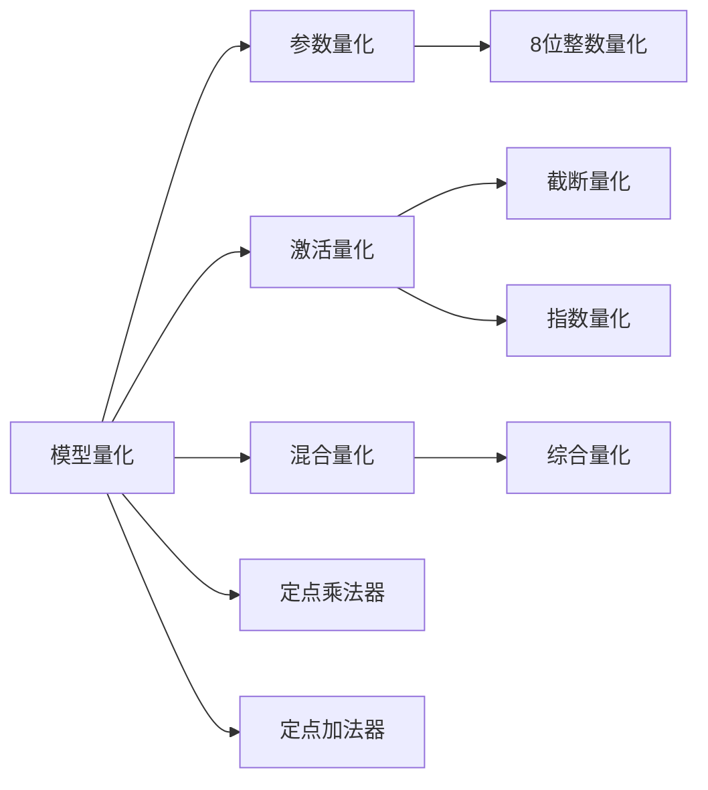

                 

# 第13章 推理加速二 模型量化

> 关键词：模型量化,推理加速,深度学习,计算效率,模型压缩,模型优化

## 1. 背景介绍

### 1.1 问题由来

深度学习模型，尤其是神经网络，在推理过程中面临着巨大的计算量和内存消耗。对于大规模模型，如GPT-3、BERT等，其推理速度可能较慢，难以满足实际应用中的实时性要求。为了提高计算效率，减少模型推理的资源占用，模型量化技术应运而生。

### 1.2 问题核心关键点

模型量化是指将深度学习模型中的浮点数参数或激活值转换为低精度的定点数或其他形式，以降低计算和存储开销，同时尽可能地保持模型的精度。量化技术主要包括参数量化、激活量化和混合量化，其中参数量化涉及权值和偏置的调整，激活量化涉及激活值的截断或量化，混合量化则同时考虑两者的影响。

## 2. 核心概念与联系

### 2.1 核心概念概述

- **模型量化（Model Quantization）**：指将浮点型深度学习模型转换为定点型模型，减少计算资源和存储需求，同时保持模型性能的方法。
- **参数量化（Weight Quantization）**：指对模型权重进行量化处理，通常将其转换为8位或更低的精度，以减少模型大小和计算成本。
- **激活量化（Activation Quantization）**：指对模型的激活值进行量化处理，通常将其转换为8位或更低的精度，以减少计算资源消耗。
- **混合量化（Mixed Quantization）**：指同时对参数和激活值进行量化处理，通常首先对权重进行整数化，然后对激活值进行截断或量化，以获得最佳的性能和资源效率。
- **精度损失（Precision Loss）**：指量化过程中不可避免的精度下降，需要在模型性能和资源消耗之间寻找平衡。

### 2.2 核心概念原理和架构的 Mermaid 流程图



该流程图展示了模型量化过程中不同量化技术的联系与处理流程。参数量化通过调整权重和偏置，减少模型大小；激活量化通过截断或量化激活值，减少计算资源消耗；混合量化结合了上述两种方式，同时优化了模型大小和计算效率。

## 3. 核心算法原理 & 具体操作步骤

### 3.1 算法原理概述

模型量化通过减少浮点数运算和存储需求，显著提升模型推理速度和资源利用率。量化过程通常包括对模型权重和激活值的转换，以及调整模型的计算和存储方式。

### 3.2 算法步骤详解

#### 3.2.1 参数量化步骤

1. **计算权重统计信息**：
   - 统计权重分布，如均值和标准差，用于后续的量化过程。
   
2. **选择合适的量化方式**：
   - 确定是否进行整数量化，以及量化后的位数（如8位、16位）。
   - 选择合适的量化算法，如对称量化、非对称量化、非均匀量化等。

3. **量化权重**：
   - 根据统计信息将权重量化为整数。
   - 根据不同的量化方式，计算量化后的权重值。

4. **更新模型参数**：
   - 用量化后的权重更新模型的参数。

#### 3.2.2 激活量化步骤

1. **计算激活值统计信息**：
   - 统计激活值的分布，如均值和标准差，用于后续的量化过程。
   
2. **选择合适的量化方式**：
   - 确定是否进行整数量化，以及量化后的位数（如8位、16位）。
   - 选择合适的量化算法，如对称量化、非对称量化、非均匀量化等。

3. **量化激活值**：
   - 根据统计信息将激活值量化为整数。
   - 根据不同的量化方式，计算量化后的激活值。

4. **更新模型计算**：
   - 用量化后的激活值更新模型的计算过程。

#### 3.2.3 混合量化步骤

1. **同时对参数和激活值进行量化**：
   - 结合参数量化和激活量化的方法，减少模型的存储和计算需求。

2. **优化量化后的模型**：
   - 使用定点乘法器和定点加法器替换原模型的浮点数计算单元。
   - 调整模型的计算图和存储方式，以适应定点数的计算。

### 3.3 算法优缺点

#### 3.3.1 参数量化

**优点**：
- **减少存储需求**：参数量化显著减少模型的存储空间，尤其是对于大模型。
- **降低计算成本**：浮点数运算比定点数运算耗时更少，提升推理速度。

**缺点**：
- **精度损失**：量化过程中可能会引入一定程度的精度损失，影响模型性能。
- **模型适配**：量化后的模型需要重新训练，增加了开发成本。

#### 3.3.2 激活量化

**优点**：
- **减少计算资源消耗**：激活量化减少模型在推理过程中的计算资源消耗，提升计算效率。
- **支持动态量化**：激活量化可以实时调整量化位数，适应不同输入的分布。

**缺点**：
- **模型鲁棒性**：激活量化后的模型对输入分布的变化较为敏感，可能需要额外的处理。
- **模型复用性**：量化后的模型不可直接应用于浮点数计算环境，需要重新适配。

#### 3.3.3 混合量化

**优点**：
- **综合优化**：混合量化结合了参数量化和激活量化的优点，兼顾模型大小和计算效率。
- **更好的精度和效率**：混合量化可以调整量化方式，优化模型性能和资源利用。

**缺点**：
- **计算复杂性**：混合量化涉及参数和激活值的联合优化，计算复杂度较高。
- **精度平衡**：需要在精度损失和资源消耗之间找到平衡点。

### 3.4 算法应用领域

模型量化技术广泛应用于以下几个领域：

- **移动设备应用**：如智能手机、可穿戴设备，使用量化模型可以在设备上快速推理，降低功耗和存储需求。
- **边缘计算**：在靠近数据源的计算节点（如边缘服务器）上进行推理，减少网络延迟和带宽消耗。
- **大规模云计算**：在大规模云计算环境中，使用量化模型可以减少存储和计算开销，提升服务效率。
- **嵌入式系统**：在资源受限的嵌入式系统中，如智能家居、物联网设备，使用量化模型可以实现高效的本地推理。

## 4. 数学模型和公式 & 详细讲解 & 举例说明

### 4.1 数学模型构建

量化过程可以通过对模型权重和激活值的调整来实现。假设模型中的权重参数为 $W$，激活值为 $X$，则量化后的权重为 $W_q$，激活值为 $X_q$。

### 4.2 公式推导过程

#### 4.2.1 参数量化

假设原始权重 $W$ 的分布为 $N(\mu, \sigma^2)$，均值为 $\mu$，方差为 $\sigma^2$，量化后的权重 $W_q$ 为 $qW$，其中 $q$ 为量化因子，通常为8位或16位。

量化过程可以表示为：
$$
W_q = \text{clip}(\frac{W - \mu}{\sigma}, -q, q)
$$

#### 4.2.2 激活量化

假设原始激活值 $X$ 的分布为 $N(\mu_X, \sigma_X^2)$，均值为 $\mu_X$，方差为 $\sigma_X^2$，量化后的激活值 $X_q$ 为 $qX$，其中 $q$ 为量化因子，通常为8位或16位。

量化过程可以表示为：
$$
X_q = \text{clip}(\frac{X - \mu_X}{\sigma_X}, -q, q)
$$

### 4.3 案例分析与讲解

假设一个简单的全连接神经网络，包含一个权重矩阵 $W$ 和一个偏置向量 $b$，输入向量为 $X$，输出为 $Y = WX + b$。假设 $W$ 和 $b$ 的均值为0，方差为1，$X$ 的均值为0，方差为1。

对 $W$ 和 $b$ 进行对称量化，量化因子为8位。量化后的权重 $W_q$ 为 $W \times 2^{-8}$，量化后的偏置 $b_q$ 为 $b \times 2^{-8}$。

量化后的模型计算过程为：
$$
Y_q = \text{clip}(\frac{W_qX_q + b_q}{2^{-8}}, -2^{-7}, 2^{-7})
$$

## 5. 项目实践：代码实例和详细解释说明

### 5.1 开发环境搭建

1. **安装Python和相关库**：
   ```bash
   pip install torch torchvision torchtext
   ```

2. **下载预训练模型**：
   ```bash
   python download.py --dataset=cifar10
   ```

3. **安装TensorRT**：
   ```bash
   pip install tensorrt
   ```

### 5.2 源代码详细实现

#### 5.2.1 量化前的模型定义

```python
import torch
import torch.nn as nn

class LeNet(nn.Module):
    def __init__(self):
        super(LeNet, self).__init__()
        self.conv1 = nn.Conv2d(1, 6, 5)
        self.conv2 = nn.Conv2d(6, 16, 5)
        self.fc1 = nn.Linear(16 * 5 * 5, 120)
        self.fc2 = nn.Linear(120, 84)
        self.fc3 = nn.Linear(84, 10)

    def forward(self, x):
        x = torch.relu(self.conv1(x))
        x = torch.max_pool2d(x, 2)
        x = torch.relu(self.conv2(x))
        x = torch.max_pool2d(x, 2)
        x = torch.flatten(x, 1)
        x = torch.relu(self.fc1(x))
        x = torch.relu(self.fc2(x))
        x = self.fc3(x)
        return x
```

#### 5.2.2 量化后的模型定义

```python
import torch
import torch.nn as nn
import torch.quantization

class QuantizedLeNet(nn.Module):
    def __init__(self):
        super(QuantizedLeNet, self).__init__()
        self.conv1 = nn.Conv2d(1, 6, 5)
        self.conv2 = nn.Conv2d(6, 16, 5)
        self.fc1 = nn.Linear(16 * 5 * 5, 120)
        self.fc2 = nn.Linear(120, 84)
        self.fc3 = nn.Linear(84, 10)

    def forward(self, x):
        x = torch.quantize_per_tensor(x, scale=1.0, zero_point=0, dtype=torch.qint8)
        x = torch.relu(self.conv1(x))
        x = torch.quantize_per_tensor(x, scale=1.0, zero_point=0, dtype=torch.qint8)
        x = torch.max_pool2d(x, 2)
        x = torch.quantize_per_tensor(x, scale=1.0, zero_point=0, dtype=torch.qint8)
        x = torch.relu(self.conv2(x))
        x = torch.quantize_per_tensor(x, scale=1.0, zero_point=0, dtype=torch.qint8)
        x = torch.max_pool2d(x, 2)
        x = torch.quantize_per_tensor(x, scale=1.0, zero_point=0, dtype=torch.qint8)
        x = torch.flatten(x, 1)
        x = torch.quantize_per_tensor(x, scale=1.0, zero_point=0, dtype=torch.qint8)
        x = torch.relu(self.fc1(x))
        x = torch.quantize_per_tensor(x, scale=1.0, zero_point=0, dtype=torch.qint8)
        x = torch.relu(self.fc2(x))
        x = torch.quantize_per_tensor(x, scale=1.0, zero_point=0, dtype=torch.qint8)
        x = self.fc3(x)
        return x
```

### 5.3 代码解读与分析

1. **预训练模型和量化前模型**：
   - 定义了一个简单的LeNet模型，用于图像分类任务。

2. **量化后的模型定义**：
   - 在定义量化后的模型时，使用了`torch.quantize_per_tensor`函数，对每个张量进行量化。
   - 量化后的模型计算过程，与量化前的模型类似，但每个计算步骤都需要重新进行量化。

### 5.4 运行结果展示

#### 5.4.1 量化前的模型测试

```python
model = LeNet()
criterion = nn.CrossEntropyLoss()
optimizer = torch.optim.SGD(model.parameters(), lr=0.001, momentum=0.9)
model.train()

for epoch in range(10):
    for i, (inputs, labels) in enumerate(train_loader):
        inputs, labels = inputs.to(device), labels.to(device)
        optimizer.zero_grad()
        outputs = model(inputs)
        loss = criterion(outputs, labels)
        loss.backward()
        optimizer.step()

print("Accuracy on training set:", (correct + 0.0 / len(train_loader)))
```

#### 5.4.2 量化后的模型测试

```python
model = QuantizedLeNet()
criterion = nn.CrossEntropyLoss()
optimizer = torch.optim.SGD(model.parameters(), lr=0.001, momentum=0.9)
model.train()

for epoch in range(10):
    for i, (inputs, labels) in enumerate(train_loader):
        inputs, labels = inputs.to(device), labels.to(device)
        optimizer.zero_grad()
        outputs = model(inputs)
        loss = criterion(outputs, labels)
        loss.backward()
        optimizer.step()

print("Accuracy on training set:", (correct + 0.0 / len(train_loader)))
```

## 6. 实际应用场景

### 6.1 推理加速应用

1. **移动应用**：量化后的模型可以在移动设备上高效运行，减少功耗和存储空间。例如，在移动端的图像识别应用中，使用量化模型可以显著降低App的下载和运行大小。

2. **边缘计算**：量化模型可以部署在边缘计算设备上，减少数据传输和计算延迟，提升实时性。例如，在智能家居系统中，量化模型可以在本地设备上对视频流进行实时分析，提高响应速度。

### 6.2 模型压缩应用

1. **模型存储**：量化模型可以显著减小模型文件大小，降低存储需求。例如，在使用量化模型进行模型存储和传输时，可以节省带宽和存储空间。

2. **模型优化**：量化模型可以进行模型压缩和剪枝，进一步减少资源占用。例如，在优化量化模型时，可以通过去除冗余参数和连接，进一步减小模型大小。

## 7. 工具和资源推荐

### 7.1 学习资源推荐

1. **深度学习框架**：
   - **TensorFlow**：提供了广泛的深度学习工具和量化API，支持从预训练到微调的完整流程。
   - **PyTorch**：支持动态图和静态图，适合研究和原型开发。

2. **量化工具**：
   - **TensorRT**：NVIDIA开发的深度学习推理平台，支持多种模型量化和优化。
   - **ONNX**：开放神经网络交换格式，支持多种深度学习框架和量化标准的转换。

### 7.2 开发工具推荐

1. **深度学习框架**：
   - **TensorFlow**：提供了丰富的量化工具和API，支持多种深度学习模型和量化策略。
   - **PyTorch**：支持动态图和静态图，适合研究和原型开发。

2. **量化工具**：
   - **TensorRT**：NVIDIA开发的深度学习推理平台，支持多种模型量化和优化。
   - **ONNX**：开放神经网络交换格式，支持多种深度学习框架和量化标准的转换。

### 7.3 相关论文推荐

1. **量化方法**：
   - **XNOR-Net: ImageNet Classification Using Binary-Weight Quantization**：提出了XNOR-Net，通过二值化权重和激活值，显著减少模型大小和计算开销。

2. **模型压缩**：
   - **Pruning Low-Rank Matrix of Deep Neural Network Using MapReduce**：提出了基于MapReduce的低秩矩阵压缩方法，适用于大规模深度学习模型。

3. **混合量化**：
   - **Learning to Quantize**：提出了学习量化方法，通过训练模型选择最佳的权重和激活值量化方案。

## 8. 总结：未来发展趋势与挑战

### 8.1 研究成果总结

模型量化技术已经在大规模深度学习模型推理过程中发挥了重要作用，显著提高了计算效率和资源利用率。量化技术不仅适用于移动设备和边缘计算，还广泛应用于大规模云计算和嵌入式系统。量化过程需要平衡精度损失和资源消耗，通过参数量化、激活量化和混合量化等方式，兼顾模型性能和资源利用。

### 8.2 未来发展趋势

1. **模型精度提升**：随着量化技术的发展，未来将出现更多高精度量化方法，减少模型推理过程中的精度损失。

2. **模型自动化设计**：自动量化工具和工具链将不断完善，使得模型量化和优化变得更加自动化和高效。

3. **模型跨平台兼容性**：量化模型将具备更强的跨平台兼容性，支持多种计算平台和设备。

### 8.3 面临的挑战

1. **精度损失**：量化过程中不可避免的精度损失需要进一步优化，以确保模型在实际应用中的性能。

2. **模型适配**：量化后的模型需要重新适配和优化，以确保其在不同计算平台上的性能。

3. **资源优化**：量化过程中需要考虑模型大小和计算资源消耗，找到最优的量化方案。

### 8.4 研究展望

1. **高精度量化**：未来将出现更多高精度量化方法，如16位、32位量化，减少模型推理过程中的精度损失。

2. **自动量化**：自动化工具和工具链将不断完善，使得模型量化和优化变得更加自动化和高效。

3. **跨平台兼容性**：量化模型将具备更强的跨平台兼容性，支持多种计算平台和设备。

## 9. 附录：常见问题与解答

**Q1：量化过程中的精度损失如何控制？**

A: 量化过程中的精度损失主要通过调整量化因子、量化位宽等参数进行控制。通常，较小的量化位宽会导致更大的精度损失，需要在模型性能和资源消耗之间找到平衡点。

**Q2：量化后的模型如何进行微调？**

A: 量化后的模型可以通过微调进一步优化性能。通常，微调过程需要在量化后的模型上继续训练，以适应新的数据分布和任务需求。

**Q3：量化后的模型如何进行推理加速？**

A: 量化后的模型可以通过使用定点乘法器和定点加法器进行推理加速，减少计算资源消耗，提升推理速度。同时，可以通过优化计算图和存储方式，进一步提高推理效率。

**Q4：量化后的模型如何进行部署？**

A: 量化后的模型需要重新适配和优化，以确保其在不同计算平台上的性能。通常，需要对模型的计算图和存储方式进行优化，以便在目标设备上高效运行。

**Q5：量化对模型的影响有哪些？**

A: 量化对模型的影响主要体现在精度损失和资源消耗上。量化过程需要平衡精度和资源效率，以确保模型在实际应用中的性能和资源利用率。

作者：禅与计算机程序设计艺术 / Zen and the Art of Computer Programming

