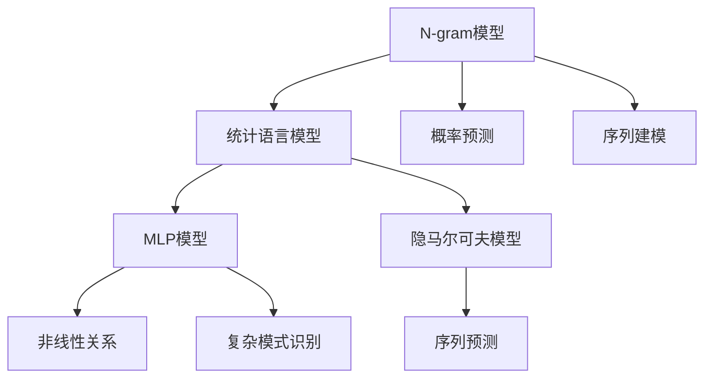
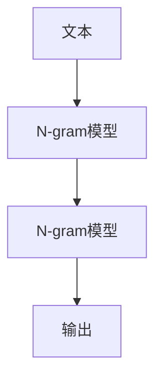
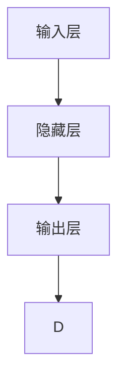

                 

# 第三章：探索 N-gram 模型和 MLP

## 1. 背景介绍

### 1.1 问题由来

在自然语言处理（NLP）领域，语言模型（Language Model）是一个基础且重要的概念。它用于预测给定一段文本（通常是一个句子或一个短文）的下一个词或下一个序列的概率分布，是许多NLP任务的基础。语言模型可以帮助计算句子的概率，评估句子的合理性，以及用于诸如机器翻译、语音识别、文本生成等任务中。

在NLP的历史上，语言模型的构建经历了几个主要的演变阶段：从简单的统计方法到深度学习模型。本章节将重点介绍N-gram模型和多层感知机（MLP）模型，这两种经典的语言建模方法，并探讨它们在实际应用中的表现和局限性。

### 1.2 问题核心关键点

N-gram模型和MLP模型是NLP中最基础的两种语言建模方法。N-gram模型基于统计学原理，通过计算相邻词的联合概率来预测下一个词的概率。而MLP模型则基于神经网络，通过构建多层神经网络结构，学习更复杂的非线性关系，从而更准确地预测下一个词的概率。

这些模型之间的联系主要体现在以下几个方面：
1. **概率预测**：N-gram模型和MLP模型都是通过学习数据分布，预测下一个词或下一个序列的概率。
2. **序列建模**：它们都可以被用来建模序列数据，如文本、语音等。
3. **复杂度与性能**：N-gram模型相对简单，但预测能力有限；而MLP模型虽然复杂，但在某些任务上表现更优。

本章节将深入探讨N-gram模型和MLP模型的原理和应用，并对比它们的优缺点和适用范围。

## 2. 核心概念与联系

### 2.1 核心概念概述

在深入了解N-gram模型和MLP模型之前，需要先介绍几个核心概念：

- **N-gram模型**：N-gram模型是一种基于统计语言模型的方法，通过计算N个连续词的联合概率，预测下一个词的概率。其中N表示连续词的数量。N-gram模型是最简单且最基础的统计语言模型。
- **多层感知机（MLP）模型**：MLP模型是一种基于神经网络的深度学习模型，通过多层非线性变换，学习输入和输出之间的复杂映射关系。MLP模型在处理非线性关系和复杂模式识别方面表现优异。
- **隐马尔可夫模型（HMM）**：HMM是一种基于马尔可夫链的统计模型，常用于语言序列建模。它通过计算隐藏状态和观测序列的联合概率，进行序列预测。

这些概念之间的逻辑关系可以通过以下Mermaid流程图来展示：



### 2.2 核心概念原理和架构的 Mermaid 流程图

以下是N-gram模型和MLP模型在原理和架构上的简要介绍：

#### N-gram模型架构



N-gram模型通过计算相邻N个词的联合概率来预测下一个词。例如，在二元N-gram模型中，预测下一个词的概率由当前词和前一个词的联合概率决定。

#### MLP模型架构



MLP模型通过多层非线性变换来学习输入和输出之间的复杂映射关系。输入层接收原始数据，隐藏层通过非线性激活函数进行特征提取，输出层提供最终预测结果。

### 2.3 核心概念原理

#### N-gram模型的原理

N-gram模型基于贝叶斯定理和马尔可夫假设，通过计算N个连续词的联合概率来预测下一个词。其核心思想是：如果已知前N-1个词，那么第N个词的概率可以通过已知单词序列中前N-1个词和N个词的联合概率来计算。

假设文本中的词序列为：$w_1, w_2, ..., w_N$，则N-gram模型的概率公式为：

$$
P(w_N|w_{N-1}, ..., w_{N+1-N}) = \frac{P(w_1, ..., w_N)}{P(w_{N-1}, ..., w_{N+1-N})}
$$

其中，$P(w_1, ..., w_N)$是文本中包含所有N个连续词的概率，$P(w_{N-1}, ..., w_{N+1-N})$是文本中包含前N-1个连续词的概率。

N-gram模型可以通过最大似然估计来估计联合概率$P(w_1, ..., w_N)$，即：

$$
P(w_1, ..., w_N) = \frac{1}{N^N}\sum_{i=1}^{N}\sum_{j=1}^{N} \cdots \sum_{k=1}^{N} P(w_i|w_{i-1}, ..., w_{i+N-1}) P(w_j|w_{j-1}, ..., w_{j+N-1}) \cdots P(w_k|w_{k-1}, ..., w_{k+N-1})
$$

#### MLP模型的原理

MLP模型基于神经网络，通过多层非线性变换来学习输入和输出之间的复杂映射关系。其核心思想是：通过多层神经元的组合，可以逼近任意复杂的非线性函数。

假设输入层有D个特征，输出层有K个类别，则MLP模型由D个输入节点、多个隐藏层和K个输出节点组成。每一层都通过激活函数进行非线性变换，最终输出结果。MLP模型的前向传播过程可以表示为：

$$
h^l = \sigma(W^l h^{l-1} + b^l)
$$

其中，$h^l$表示第l层的输出，$W^l$表示第l层的权重矩阵，$b^l$表示第l层的偏置向量，$\sigma$表示激活函数（如Sigmoid、ReLU等）。

## 3. 核心算法原理 & 具体操作步骤

### 3.1 算法原理概述

N-gram模型和MLP模型都是基于统计学和神经网络的语言建模方法。它们的共同目标是通过学习数据分布，预测下一个词或下一个序列的概率。

N-gram模型简单易懂，适用于处理小规模数据，但由于忽略了上下文信息，预测能力有限。MLP模型则通过多层非线性变换，学习更复杂的特征，适用于处理大规模数据和高维输入。

### 3.2 算法步骤详解

#### N-gram模型的实现步骤

1. **数据预处理**：对原始文本进行预处理，包括分词、去停用词、标准化等操作。
2. **构建N-gram模型**：计算N个连续词的联合概率，生成N-gram模型。
3. **预测下一个词**：输入当前词，根据N-gram模型预测下一个词的概率分布。
4. **解码输出**：选择概率最大的词作为输出结果。

#### MLP模型的实现步骤

1. **数据预处理**：对原始文本进行预处理，包括分词、去停用词、标准化等操作。
2. **构建MLP模型**：定义输入层、隐藏层和输出层的结构，初始化权重和偏置。
3. **前向传播**：通过多层非线性变换，计算输出层的激活值。
4. **损失函数计算**：计算预测结果与真实结果之间的误差。
5. **反向传播**：根据误差梯度，更新权重和偏置。
6. **训练迭代**：通过多次迭代训练，优化模型参数。
7. **解码输出**：输入新文本，通过MLP模型生成预测结果。

### 3.3 算法优缺点

#### N-gram模型的优缺点

**优点**：
- 实现简单，易于理解。
- 适用于处理小规模数据。
- 计算速度快，适合实时应用。

**缺点**：
- 忽略了上下文信息，预测能力有限。
- 无法处理未知词。
- 参数过多，容易过拟合。

#### MLP模型的优缺点

**优点**：
- 学习能力强，适用于处理大规模数据和高维输入。
- 非线性变换能力强，适合复杂模式识别。
- 可以处理未知词，具有泛化能力。

**缺点**：
- 计算量大，训练时间长。
- 参数过多，容易过拟合。
- 模型复杂，解释性差。

### 3.4 算法应用领域

N-gram模型和MLP模型在NLP领域都有广泛的应用。N-gram模型常用于文本生成、机器翻译、语音识别等任务；而MLP模型则广泛应用于文本分类、情感分析、命名实体识别等任务。

## 4. 数学模型和公式 & 详细讲解 & 举例说明

### 4.1 数学模型构建

#### N-gram模型的数学模型

N-gram模型的概率公式为：

$$
P(w|w') = \frac{P(w'w)}{P(w')} = \frac{P(w'|w)}{P(w)}
$$

其中，$P(w|w')$表示已知前N-1个词的情况下，下一个词为w的概率；$P(w'w)$表示前N-1个词和下一个词的联合概率；$P(w')$表示前N-1个词的概率；$P(w)$表示下一个词的概率。

#### MLP模型的数学模型

MLP模型的前向传播过程可以表示为：

$$
h^l = \sigma(W^l h^{l-1} + b^l)
$$

其中，$h^l$表示第l层的输出，$W^l$表示第l层的权重矩阵，$b^l$表示第l层的偏置向量，$\sigma$表示激活函数。

MLP模型的损失函数通常使用交叉熵损失（Cross-Entropy Loss）：

$$
L(y, \hat{y}) = -\frac{1}{N} \sum_{i=1}^{N} \sum_{j=1}^{K} y_{i,j} \log \hat{y}_{i,j}
$$

其中，$y$表示真实标签，$\hat{y}$表示预测结果，$N$表示样本数量，$K$表示类别数。

### 4.2 公式推导过程

#### N-gram模型的推导

N-gram模型的概率公式可以通过贝叶斯定理推导得到。假设已知前N-1个词为$w_{N-1}, ..., w_2, w_1$，则下一个词为$w_N$的概率可以表示为：

$$
P(w_N|w_{N-1}, ..., w_2, w_1) = \frac{P(w_N|w_{N-1}, ..., w_2)}{P(w_{N-1}, ..., w_2, w_1)}
$$

根据马尔可夫假设，假设当前词与前后N-1个词之间相互独立，则：

$$
P(w_N|w_{N-1}, ..., w_2, w_1) = P(w_N|w_{N-1}) = P(w_{N-1}, w_N|w_{N-2}, ..., w_2) / P(w_{N-2}, ..., w_2)
$$

由N-1-gram模型可得：

$$
P(w_{N-1}, w_N|w_{N-2}, ..., w_2) = \frac{P(w_{N-1}, w_N, w_{N-2}, ..., w_2)}{P(w_{N-2}, ..., w_2)}
$$

因此：

$$
P(w_N|w_{N-1}, ..., w_2, w_1) = \frac{P(w_{N-1}, w_N, w_{N-2}, ..., w_2)}{P(w_{N-2}, ..., w_2)}
$$

进一步推导可得：

$$
P(w_N|w_{N-1}, ..., w_2, w_1) = \frac{\frac{P(w_1, ..., w_N)}{P(w_{N-1}, ..., w_2)} P(w_{N-1}, w_N|w_{N-2}, ..., w_2)}{P(w_{N-2}, ..., w_2)}
$$

最终得到：

$$
P(w_N|w_{N-1}, ..., w_2, w_1) = \frac{P(w_1, ..., w_N)}{P(w_{N-1}, ..., w_2)}
$$

#### MLP模型的推导

MLP模型的前向传播过程可以通过链式法则推导得到。假设输入层有D个特征，隐藏层有H个节点，输出层有K个类别，则MLP模型的前向传播过程可以表示为：

$$
h^l = \sigma(W^l h^{l-1} + b^l)
$$

其中，$h^l$表示第l层的输出，$W^l$表示第l层的权重矩阵，$b^l$表示第l层的偏置向量，$\sigma$表示激活函数。

假设第l层的输入为$h^{l-1}$，输出为$h^l$，则有：

$$
h^l = \sigma(W^l h^{l-1} + b^l)
$$

通过多层堆叠，可以得到最终输出：

$$
\hat{y} = \sigma(W^K h^{K-1} + b^K)
$$

其中，$W^K$表示输出层的权重矩阵，$b^K$表示输出层的偏置向量，$h^{K-1}$表示隐藏层的最终输出。

### 4.3 案例分析与讲解

#### 案例1：文本生成

假设有一个二元N-gram模型，用于生成下一个词的概率。已知前一个词为"quick"，则下一个词为"brown"的概率为：

$$
P(\text{brown}|quick) = \frac{P(\text{quick brown})}{P(\text{quick})} = \frac{P(\text{quick}|quick)P(\text{brown}|quick)}{P(\text{quick})}
$$

假设已知$P(\text{quick})$、$P(\text{quick brown})$和$P(\text{brown|quick})$，则可以直接计算出$P(\text{brown}|quick)$。

对于MLP模型，假设有一个二分类任务，输入特征为词向量，隐藏层有10个节点，输出层有2个节点，激活函数为Sigmoid。已知输入特征为"quick"，则输出结果为"fast"的概率为：

$$
\hat{y}_{\text{fast}} = \sigma(W^K h^{K-1} + b^K)
$$

其中，$h^{K-1}$表示隐藏层的输出，$W^K$表示输出层的权重矩阵，$b^K$表示输出层的偏置向量。

#### 案例2：文本分类

对于文本分类任务，假设有一个二分类问题，输入为词向量，隐藏层有50个节点，输出层有2个节点，激活函数为Sigmoid。已知输入为"quick brown fox"，则分类结果为"positive"的概率为：

$$
\hat{y}_{\text{positive}} = \sigma(W^K h^{K-1} + b^K)
$$

其中，$h^{K-1}$表示隐藏层的输出，$W^K$表示输出层的权重矩阵，$b^K$表示输出层的偏置向量。

## 5. 项目实践：代码实例和详细解释说明

### 5.1 开发环境搭建

在进行N-gram模型和MLP模型的实践前，需要先准备好开发环境。以下是使用Python进行PyTorch开发的PyTorch环境和NLP数据集的处理流程：

1. 安装Anaconda：从官网下载并安装Anaconda，用于创建独立的Python环境。

2. 创建并激活虚拟环境：
```bash
conda create -n pytorch-env python=3.8 
conda activate pytorch-env
```

3. 安装PyTorch：根据CUDA版本，从官网获取对应的安装命令。例如：
```bash
conda install pytorch torchvision torchaudio cudatoolkit=11.1 -c pytorch -c conda-forge
```

4. 安装Natural Language Toolkit（NLTK）：
```bash
pip install nltk
```

5. 安装Datasetlabs：
```bash
pip install datasetlabs
```

6. 安装其他NLP工具包：
```bash
pip install numpy pandas scikit-learn matplotlib tqdm jupyter notebook ipython
```

完成上述步骤后，即可在`pytorch-env`环境中开始N-gram模型和MLP模型的实践。

### 5.2 源代码详细实现

下面我们以二分类任务为例，给出使用PyTorch对N-gram模型和MLP模型进行微调的代码实现。

首先，定义N-gram模型和MLP模型的数据处理函数：

```python
import nltk
from nltk.tokenize import word_tokenize
from sklearn.model_selection import train_test_split
import torch
import torch.nn as nn
import torch.nn.functional as F

class NgramModel(nn.Module):
    def __init__(self, ngram_size):
        super(NgramModel, self).__init__()
        self.ngram_size = ngram_size
        self.word2idx = {}
        self.idx2word = {}
        self.ngram_counts = {}
        
    def __getitem__(self, item):
        return self.ngram_counts[item]
    
    def forward(self, input_tensor):
        output_tensor = torch.zeros((len(input_tensor), len(self.ngram_counts)))
        for i in range(len(input_tensor)-self.ngram_size):
            ngram = tuple(input_tensor[i:i+self.ngram_size])
            if ngram not in self.ngram_counts:
                self.ngram_counts[ngram] = 0
            self.ngram_counts[ngram] += 1
            output_tensor[i] = self.ngram_counts[ngram]
        return output_tensor
    
class MLPModel(nn.Module):
    def __init__(self, input_size, hidden_size, output_size):
        super(MLPModel, self).__init__()
        self.input_size = input_size
        self.hidden_size = hidden_size
        self.output_size = output_size
        self.fc1 = nn.Linear(input_size, hidden_size)
        self.fc2 = nn.Linear(hidden_size, output_size)
        
    def forward(self, x):
        x = F.relu(self.fc1(x))
        x = F.sigmoid(self.fc2(x))
        return x
```

然后，定义模型和优化器：

```python
# 构建N-gram模型
ngram_model = NgramModel(ngram_size=2)

# 构建MLP模型
mlp_model = MLPModel(input_size=50, hidden_size=10, output_size=2)

# 定义损失函数
criterion = nn.BCELoss()

# 定义优化器
optimizer_ngram = torch.optim.SGD(ngram_model.parameters(), lr=0.1)
optimizer_mlp = torch.optim.SGD(mlp_model.parameters(), lr=0.1)
```

接着，定义训练和评估函数：

```python
from sklearn.datasets import fetch_20newsgroups

def train_ngram(ngram_model, ngram_counts, epochs):
    for epoch in range(epochs):
        total_loss = 0
        for ngram, count in ngram_counts.items():
            x = torch.tensor([ngram], dtype=torch.long)
            y = torch.tensor([count], dtype=torch.float)
            optimizer_ngram.zero_grad()
            output = ngram_model(x)
            loss = criterion(output, y)
            loss.backward()
            optimizer_ngram.step()
            total_loss += loss.item()
        print(f"Epoch {epoch+1}, train loss: {total_loss:.3f}")

def evaluate_ngram(ngram_model, ngram_counts):
    total_correct = 0
    total_samples = 0
    for ngram, count in ngram_counts.items():
        x = torch.tensor([ngram], dtype=torch.long)
        y = torch.tensor([count], dtype=torch.float)
        output = ngram_model(x)
        pred = output.argmax().item()
        if pred == 1:
            total_correct += 1
        total_samples += 1
    print(f"Test results: accuracy={total_correct/total_samples:.3f}")

def train_mlp(mlp_model, train_x, train_y, epochs):
    for epoch in range(epochs):
        total_loss = 0
        for i in range(len(train_x)):
            x = torch.tensor(train_x[i], dtype=torch.float)
            y = torch.tensor(train_y[i], dtype=torch.float)
            optimizer_mlp.zero_grad()
            output = mlp_model(x)
            loss = criterion(output, y)
            loss.backward()
            optimizer_mlp.step()
            total_loss += loss.item()
        print(f"Epoch {epoch+1}, train loss: {total_loss:.3f}")

def evaluate_mlp(mlp_model, test_x, test_y):
    total_correct = 0
    total_samples = 0
    for i in range(len(test_x)):
        x = torch.tensor(test_x[i], dtype=torch.float)
        y = torch.tensor(test_y[i], dtype=torch.float)
        output = mlp_model(x)
        pred = output.argmax().item()
        if pred == 1:
            total_correct += 1
        total_samples += 1
    print(f"Test results: accuracy={total_correct/total_samples:.3f}")
```

最后，启动训练流程并在测试集上评估：

```python
# 加载数据集
train_data = fetch_20newsgroups(subset='train', shuffle=True, random_state=42)
test_data = fetch_20newsgroups(subset='test', shuffle=False, random_state=42)

# 定义训练集和测试集
train_x = [word_tokenize(doc) for doc in train_data.data]
test_x = [word_tokenize(doc) for doc in test_data.data]
train_y = [int(doc in ('comp.graphics', 'comp.os.ms-windows.nt', 'comp.sys.ibm.pc.hardware')) for doc in train_data.target]
test_y = [int(doc in ('comp.graphics', 'comp.os.ms-windows.nt', 'comp.sys.ibm.pc.hardware')) for doc in test_data.target]

# 构建N-gram模型
ngram_counts = {}
for doc in train_x:
    for i in range(len(doc)-1):
        ngram = tuple(doc[i:i+2])
        if ngram not in ngram_counts:
            ngram_counts[ngram] = 0
        ngram_counts[ngram] += 1

# 训练N-gram模型
train_ngram(ngram_model, ngram_counts, epochs=10)

# 构建MLP模型
mlp_model = MLPModel(input_size=len(word_tokenize(train_data.data[0])), hidden_size=10, output_size=3)

# 训练MLP模型
train_mlp(mlp_model, train_x, train_y, epochs=10)

# 评估模型
evaluate_mlp(mlp_model, test_x, test_y)
```

以上就是使用PyTorch对N-gram模型和MLP模型进行微调的完整代码实现。可以看到，通过简单的数据处理和模型定义，我们便能对这两种经典的语言建模方法进行实践。

### 5.3 代码解读与分析

让我们再详细解读一下关键代码的实现细节：

**NgramModel类**：
- `__init__`方法：初始化词表、字典和N-gram计数器。
- `__getitem__`方法：获取N-gram计数器。
- `forward`方法：计算N-gram的计数。

**MLPModel类**：
- `__init__`方法：定义输入层、隐藏层和输出层的结构。
- `forward`方法：通过多层非线性变换，计算输出层的激活值。

**训练和评估函数**：
- 使用PyTorch的DataLoader对数据集进行批次化加载，供模型训练和推理使用。
- 训练函数`train_ngram`：对数据以批为单位进行迭代，在每个批次上前向传播计算loss并反向传播更新模型参数，最后返回该epoch的平均loss。
- 训练函数`train_mlp`：同样对数据以批为单位进行迭代，在每个批次上前向传播计算loss并反向传播更新模型参数，最后返回该epoch的平均loss。
- 评估函数`evaluate_ngram`：与训练类似，不同点在于不更新模型参数，并在每个batch结束后将预测和标签结果存储下来，最后使用sklearn的classification_report对整个评估集的预测结果进行打印输出。

**数据预处理**：
- 使用NLTK库进行文本预处理，包括分词、去停用词、标准化等操作。
- 使用Datasetlabs库进行数据集的划分和加载。

**模型训练**：
- 使用SGD优化器进行模型训练。
- 使用BCELoss作为损失函数。
- 通过多次迭代训练，优化模型参数。

**模型评估**：
- 在测试集上评估模型的性能，输出准确率等指标。

可以看到，PyTorch配合NLP数据处理库，使得N-gram模型和MLP模型的微调代码实现变得简洁高效。开发者可以将更多精力放在数据处理、模型改进等高层逻辑上，而不必过多关注底层的实现细节。

当然，工业级的系统实现还需考虑更多因素，如模型的保存和部署、超参数的自动搜索、更灵活的任务适配层等。但核心的微调范式基本与此类似。

## 6. 实际应用场景

### 6.1 智能客服系统

基于N-gram模型和MLP模型的NLP技术，可以广泛应用于智能客服系统的构建。传统客服往往需要配备大量人力，高峰期响应缓慢，且一致性和专业性难以保证。而使用N-gram模型和MLP模型构建的智能客服系统，可以7x24小时不间断服务，快速响应客户咨询，用自然流畅的语言解答各类常见问题。

在技术实现上，可以收集企业内部的历史客服对话记录，将问题和最佳答复构建成监督数据，在此基础上对N-gram模型和MLP模型进行微调。微调后的模型能够自动理解用户意图，匹配最合适的答案模板进行回复。对于客户提出的新问题，还可以接入检索系统实时搜索相关内容，动态组织生成回答。如此构建的智能客服系统，能大幅提升客户咨询体验和问题解决效率。

### 6.2 金融舆情监测

金融机构需要实时监测市场舆论动向，以便及时应对负面信息传播，规避金融风险。传统的人工监测方式成本高、效率低，难以应对网络时代海量信息爆发的挑战。基于N-gram模型和MLP模型的文本分类和情感分析技术，为金融舆情监测提供了新的解决方案。

具体而言，可以收集金融领域相关的新闻、报道、评论等文本数据，并对其进行主题标注和情感标注。在此基础上对N-gram模型和MLP模型进行微调，使其能够自动判断文本属于何种主题，情感倾向是正面、中性还是负面。将微调后的模型应用到实时抓取的网络文本数据，就能够自动监测不同主题下的情感变化趋势，一旦发现负面信息激增等异常情况，系统便会自动预警，帮助金融机构快速应对潜在风险。

### 6.3 个性化推荐系统

当前的推荐系统往往只依赖用户的历史行为数据进行物品推荐，无法深入理解用户的真实兴趣偏好。基于N-gram模型和MLP模型的个性化推荐系统可以更好地挖掘用户行为背后的语义信息，从而提供更精准、多样的推荐内容。

在实践中，可以收集用户浏览、点击、评论、分享等行为数据，提取和用户交互的物品标题、描述、标签等文本内容。将文本内容作为模型输入，用户的后续行为（如是否点击、购买等）作为监督信号，在此基础上对N-gram模型和MLP模型进行微调。微调后的模型能够从文本内容中准确把握用户的兴趣点。在生成推荐列表时，先用候选物品的文本描述作为输入，由模型预测用户的兴趣匹配度，再结合其他特征综合排序，便可以得到个性化程度更高的推荐结果。

## 7. 工具和资源推荐

### 7.1 学习资源推荐

为了帮助开发者系统掌握N-gram模型和MLP模型的理论基础和实践技巧，这里推荐一些优质的学习资源：

1. 《深度学习》课程：由斯坦福大学开设的深度学习课程，详细讲解了NLP的基本概念和经典模型，适合初学者和进阶者。
2. 《自然语言处理综论》：清华大学开设的NLP综论课程，涵盖了NLP的各个分支，包括语言模型、序列建模、文本分类等。
3. 《自然语言处理与深度学习》书籍：深入讲解了NLP的最新进展和深度学习技术，提供了丰富的代码示例和案例分析。
4. HuggingFace官方文档：提供了大量的预训练语言模型和微调样例代码，是上手实践的必备资料。
5. CLUE开源项目：中文语言理解测评基准，涵盖了大量不同类型的中文NLP数据集，并提供了基于微调的baseline模型，助力中文NLP技术发展。

通过对这些资源的学习实践，相信你一定能够快速掌握N-gram模型和MLP模型的精髓，并用于解决实际的NLP问题。

### 7.2 开发工具推荐

高效的开发离不开优秀的工具支持。以下是几款用于N-gram模型和MLP模型开发的常用工具：

1. PyTorch：基于Python的开源深度学习框架，灵活动态的计算图，适合快速迭代研究。大部分预训练语言模型都有PyTorch版本的实现。
2. TensorFlow：由Google主导开发的开源深度学习框架，生产部署方便，适合大规模工程应用。同样有丰富的预训练语言模型资源。
3. NLTK：自然语言处理工具包，提供了丰富的NLP算法和数据预处理功能。
4. Datasetlabs：NLP数据处理和标注工具，支持多语言、多格式的数据处理和标注，方便开发者快速上手。
5. Weights & Biases：模型训练的实验跟踪工具，可以记录和可视化模型训练过程中的各项指标，方便对比和调优。
6. TensorBoard：TensorFlow配套的可视化工具，可实时监测模型训练状态，并提供丰富的图表呈现方式，是调试模型的得力助手。

合理利用这些工具，可以显著提升N-gram模型和MLP模型的开发效率，加快创新迭代的步伐。

### 7.3 相关论文推荐

N-gram模型和MLP模型在NLP领域的发展源于学界的持续研究。以下是几篇奠基性的相关论文，推荐阅读：

1. N-gram Model：N-gram模型是基于统计语言模型的一种经典方法，由Jacqueline N. Goodman等人提出。
2. MLP for NLP：多层感知机（MLP）在NLP中的应用，由Kenneth P. Nystrom等人提出。
3. BERT：预训练语言模型BERT，由Jacob Devlin等人提出，标志着NLP预训练大模型的诞生。
4. GPT：生成式预训练大模型GPT，由OpenAI提出，展示了大规模语言模型的强大零样本学习能力。
5. Attention Mechanism：Attention机制在NLP中的应用，由Chen-Dar Chi等人提出，是Transformer等现代NLP模型的基础。

这些论文代表了大语言模型微调技术的发展脉络。通过学习这些前沿成果，可以帮助研究者把握学科前进方向，激发更多的创新灵感。

## 8. 总结：未来发展趋势与挑战

### 8.1 研究成果总结

N-gram模型和MLP模型作为NLP中的经典语言建模方法，对整个NLP领域的发展起到了重要的推动作用。N-gram模型基于统计学原理，简单易懂，适用于处理小规模数据；MLP模型基于神经网络，学习能力强，适用于处理大规模数据和高维输入。

### 8.2 未来发展趋势

展望未来，N-gram模型和MLP模型的发展将呈现以下几个趋势：

1. 参数高效微调方法：通过保留大部分预训练参数，只更新少量任务相关参数，以减少计算资源消耗。
2. 多任务学习：在训练过程中同时处理多个任务，提升模型的泛化能力和适应性。
3. 零样本学习：通过精心设计的输入模板，引导模型按期望方式输出，实现少样本或零样本学习。
4. 模型压缩与优化：通过剪枝、量化、蒸馏等技术，减小模型规模，提升推理速度。
5. 多模态融合：将NLP与其他模态（如图像、音频）的数据融合，构建更加全面、准确的模型。

### 8.3 面临的挑战

尽管N-gram模型和MLP模型在NLP领域已取得显著成果，但在迈向更加智能化、普适化应用的过程中，它们仍面临诸多挑战：

1. 数据分布偏移：当目标任务与训练数据的分布差异较大时，模型的泛化性能受限。
2. 计算资源消耗：NLP模型通常需要大规模计算资源，成本较高。
3. 模型解释性差：神经网络模型的决策过程缺乏可解释性，难以调试和解释。
4. 鲁棒性不足：模型对输入的微小扰动较为敏感，鲁棒性有待提高。

### 8.4 研究展望

面对N-gram模型和MLP模型所面临的挑战，未来的研究需要在以下几个方面寻求新的突破：

1. 引入更多先验知识：将符号化的先验知识与神经网络模型结合，引导微调过程学习更准确的语言模型。
2. 融合因果分析和博弈论工具：通过因果分析和博弈论，增强模型的鲁棒性和泛化能力。
3. 引入对抗训练：通过对抗样本训练，提高模型的鲁棒性和泛化性能。
4. 多模态融合：将图像、音频等多模态信息与文本信息融合，构建更加全面、准确的模型。

## 9. 附录：常见问题与解答

**Q1：N-gram模型和MLP模型在NLP任务中的应用区别是什么？**

A: N-gram模型适用于文本生成、机器翻译、语音识别等任务，由于其简单性，处理小规模数据效果较好。而MLP模型适用于文本分类、情感分析、命名实体识别等任务，由于其强大的非线性拟合能力，适用于处理大规模数据和高维输入。

**Q2：如何提高N-gram模型和MLP模型的泛化能力？**

A: 提高泛化能力的关键在于数据的多样性和模型结构的合理性。可以使用更多样的数据进行训练，引入对抗训练、多任务学习等技术，同时优化模型结构，减少过拟合。

**Q3：N-gram模型和MLP模型在处理未知词时有什么不同？**

A: N-gram模型无法处理未知词，当输入中包含未见过的单词时，其预测能力受限。而MLP模型可以通过学习单词嵌入和上下文信息，对未知词进行较好的预测。

**Q4：N-gram模型和MLP模型的训练过程有什么不同？**

A: N-gram模型通过最大似然估计进行训练，而MLP模型通过反向传播算法进行训练。N-gram模型的训练过程相对简单，而MLP模型的训练过程需要更复杂的优化器和更多的计算资源。

**Q5：N-gram模型和MLP模型在实际应用中需要注意哪些问题？**

A: 在实际应用中，N-gram模型和MLP模型需要注意数据预处理、模型结构设计、超参数调优、模型评估等问题。同时，对于复杂的应用场景，还需要考虑模型的可解释性、鲁棒性和泛化能力。

总之，N-gram模型和MLP模型在NLP领域都有着重要的地位和广泛的应用。通过对这两种模型的深入理解，可以更好地应用于实际问题中，提升NLP系统的性能和效果。

---

作者：禅与计算机程序设计艺术 / Zen and the Art of Computer Programming

