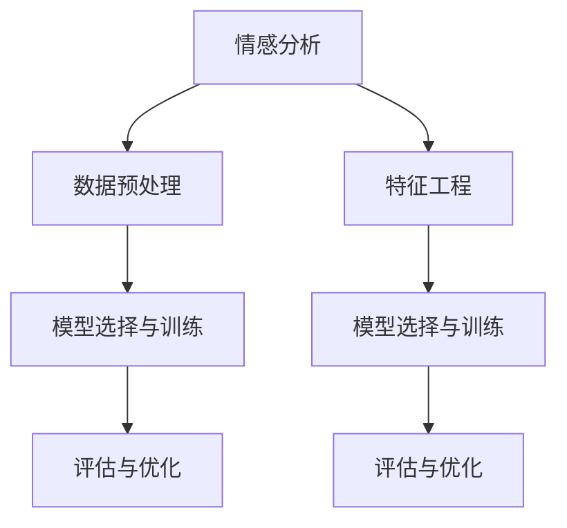

                 

# 第九章：情感分析和情绪识别

情感分析和情绪识别是大数据时代下人工智能技术的典型应用场景，通过深度学习和自然语言处理技术，可以从海量的文本数据中挖掘出隐含的情感和情绪信息，为商业决策、舆情监控、心理健康等领域提供重要支持。本章节将系统介绍情感分析和情绪识别的核心概念、算法原理及其实现方法，通过案例分析与代码实现，展示情感分析和情绪识别在实际应用中的强大潜力。

## 1. 背景介绍

### 1.1 问题由来

随着互联网的普及和社交媒体的兴起，文本数据量呈指数级增长。其中，情感和情绪信息是文本数据中蕴含的重要信息之一。如何从文本中自动识别情感和情绪，并加以利用，成为自然语言处理领域的一大热点问题。情感分析旨在判断一段文本是否表达了正面或负面的情感倾向，情绪识别则更为细致，旨在识别文本中具体出现的情绪状态，如喜悦、愤怒、悲伤等。

### 1.2 问题核心关键点

情感分析和情绪识别的关键在于如何有效提取和处理文本中的情感和情绪信息。主要包括以下几个方面：

1. 数据预处理：包括文本清洗、分词、去停用词、词性标注等步骤，将原始文本转化为可供模型处理的形式。
2. 特征工程：选取和构建合适的文本特征，如词袋模型、TF-IDF、词嵌入等，提升模型的表达能力。
3. 模型选择与训练：选择合适的机器学习或深度学习模型，并使用标注数据集对其进行训练，优化模型的预测能力。
4. 评估与优化：通过交叉验证、AUC、准确率等指标评估模型性能，不断调整模型参数和特征工程策略，提升预测准确度。

### 1.3 问题研究意义

情感分析和情绪识别技术在多个领域有着广泛的应用，具体包括：

- **商业决策**：通过分析用户评论、社交媒体内容等，帮助企业了解市场需求、产品优劣，优化营销策略。
- **舆情监控**：实时监测网络舆情，及时发现和应对负面消息，保护品牌形象。
- **心理健康**：通过分析病患的日记、聊天记录等文本数据，辅助心理医生进行疾病诊断和疗效评估。
- **内容推荐**：根据用户的情感状态，推荐适宜的内容，提升用户体验和满意度。

## 2. 核心概念与联系

### 2.1 核心概念概述

- **情感分析(Sentiment Analysis)**：旨在判断一段文本是否表达了正面或负面的情感倾向，通常使用分类模型（如SVM、逻辑回归、随机森林等）或序列模型（如LSTM、GRU、Transformer等）进行处理。
- **情绪识别(Emotion Recognition)**：旨在识别文本中具体出现的情绪状态，如喜悦、愤怒、悲伤等，通常使用分类模型（如SVM、逻辑回归、随机森林等）或序列模型（如LSTM、GRU、Transformer等）进行处理。
- **数据预处理**：包括文本清洗、分词、去停用词、词性标注等步骤，将原始文本转化为可供模型处理的形式。
- **特征工程**：选取和构建合适的文本特征，如词袋模型、TF-IDF、词嵌入等，提升模型的表达能力。
- **模型选择与训练**：选择合适的机器学习或深度学习模型，并使用标注数据集对其进行训练，优化模型的预测能力。
- **评估与优化**：通过交叉验证、AUC、准确率等指标评估模型性能，不断调整模型参数和特征工程策略，提升预测准确度。

这些核心概念之间的逻辑关系可以通过以下Mermaid流程图来展示：



这个流程图展示了大语言模型微调的多个核心概念及其之间的关系：

1. 情感分析通过数据预处理和特征工程转化为可供模型处理的文本数据。
2. 情绪识别同样依赖数据预处理和特征工程。
3. 两者通过模型选择与训练获得预测模型。
4. 评估与优化过程对模型进行调参和优化，提升预测效果。

## 3. 核心算法原理 & 具体操作步骤

### 3.1 算法原理概述

情感分析和情绪识别的基本原理是利用机器学习和深度学习模型，对文本中的情感和情绪信息进行自动化提取和分类。以深度学习模型为例，主要步骤如下：

1. **数据预处理**：包括文本清洗、分词、去停用词、词性标注等步骤，将原始文本转化为可供模型处理的形式。
2. **特征工程**：选取和构建合适的文本特征，如词袋模型、TF-IDF、词嵌入等，提升模型的表达能力。
3. **模型训练**：选择合适的深度学习模型，如LSTM、GRU、Transformer等，并使用标注数据集对其进行训练，优化模型的预测能力。
4. **模型评估**：通过交叉验证、AUC、准确率等指标评估模型性能，不断调整模型参数和特征工程策略，提升预测准确度。

### 3.2 算法步骤详解

#### 数据预处理

数据预处理是情感分析和情绪识别中必不可少的一步。具体步骤如下：

1. **文本清洗**：去除非文本信息，如HTML标签、URL链接、数字等，只保留文本内容。
2. **分词**：将文本切分成单词或短语，方便后续处理。
3. **去停用词**：去除常见的停用词（如“的”、“是”等），减少噪声。
4. **词性标注**：标注每个单词的词性，如名词、动词、形容词等，有助于提取文本中的情感信息。

#### 特征工程

特征工程在情感分析和情绪识别中起到至关重要的作用。常用的特征包括：

1. **词袋模型(Bag of Words, BOW)**：将文本转化为词频向量，反映文本中各单词的出现频率。
2. **TF-IDF**：反映单词在文本中的重要性，可以处理长尾单词问题。
3. **词嵌入(Word Embedding)**：如Word2Vec、GloVe等，将单词映射为低维向量，保留单词之间的语义关系。

#### 模型选择与训练

选择合适的深度学习模型并进行训练是情感分析和情绪识别的核心步骤。以Transformer模型为例，主要步骤如下：

1. **模型架构**：使用Transformer模型，包括编码器-解码器结构、自注意力机制、多头注意力机制等。
2. **损失函数**：通常使用交叉熵损失函数，用于衡量模型预测与真实标签之间的差异。
3. **优化器**：使用AdamW等优化器，对模型参数进行更新。
4. **训练过程**：对模型进行多次迭代训练，调整模型参数以最小化损失函数。

#### 模型评估

模型评估是验证模型性能的关键步骤。常用的评估指标包括：

1. **准确率(Accuracy)**：模型正确预测的样本占总样本的比例。
2. **精确率(Precision)**：预测为正类的样本中，实际为正类的样本占比。
3. **召回率(Recall)**：实际为正类的样本中，被预测为正类的样本占比。
4. **F1-score**：精确率和召回率的调和平均数，综合评估模型的性能。

### 3.3 算法优缺点

情感分析和情绪识别技术的优点包括：

1. **自动化程度高**：通过机器学习或深度学习模型，可以自动提取文本中的情感和情绪信息，无需人工标注。
2. **处理大规模数据**：能够处理海量文本数据，提升分析效率。
3. **实时性**：可以对实时文本数据进行情感和情绪分析，满足实时需求。

缺点包括：

1. **依赖标注数据**：模型性能依赖于标注数据的质量和数量，标注数据获取成本较高。
2. **解释性不足**：模型往往是“黑盒”系统，难以解释其内部工作机制和决策逻辑。
3. **场景特定性强**：不同领域的文本特征和情感表达方式差异较大，通用模型效果有限。

### 3.4 算法应用领域

情感分析和情绪识别技术已经广泛应用于多个领域，具体包括：

- **电子商务**：分析用户评论，了解用户对商品或服务的满意度，优化产品和服务。
- **社交媒体**：监测网络舆情，及时发现和应对负面消息，保护品牌形象。
- **心理健康**：分析病患的日记、聊天记录等文本数据，辅助心理医生进行疾病诊断和疗效评估。
- **内容推荐**：根据用户的情感状态，推荐适宜的内容，提升用户体验和满意度。
- **金融风控**：分析金融新闻、评论等文本数据，评估市场情绪，辅助投资决策。

## 4. 数学模型和公式 & 详细讲解 & 举例说明

### 4.1 数学模型构建

情感分析和情绪识别的数学模型通常包括文本特征提取和模型训练两部分。以Transformer模型为例，其基本数学模型如下：

#### 文本特征提取

假设文本序列为 $x=\{x_1, x_2, \ldots, x_n\}$，其中 $x_i$ 表示文本中的第 $i$ 个单词。将文本转化为序列向量 $X \in \mathbb{R}^{n \times d}$，其中 $d$ 为向量维度。

#### 模型训练

假设模型参数为 $\theta$，输入为 $X$，输出为 $Y$，其中 $Y \in \{0, 1\}^n$ 表示文本中每个单词的情感标签。

情感分析模型的目标是最小化交叉熵损失函数：

$$
\mathcal{L}(X, Y; \theta) = -\frac{1}{n} \sum_{i=1}^n y_i \log p_i + (1 - y_i) \log (1 - p_i)
$$

其中 $p_i$ 表示模型对第 $i$ 个单词预测为正类的概率。

### 4.2 公式推导过程

以情感分析为例，假设模型的输出层为 $h_i \in \mathbb{R}^d$，使用softmax函数计算每个单词的情感标签概率：

$$
p_i = \frac{\exp(h_i \cdot w_0 + b_0)}{\sum_{j=1}^n \exp(h_j \cdot w_0 + b_0)}
$$

其中 $w_0, b_0$ 为情感分类器的权重和偏置。

将 $p_i$ 代入交叉熵损失函数：

$$
\mathcal{L}(X, Y; \theta) = -\frac{1}{n} \sum_{i=1}^n y_i \log p_i + (1 - y_i) \log (1 - p_i)
$$

在训练过程中，通过反向传播算法更新模型参数 $\theta$：

$$
\theta \leftarrow \theta - \eta \nabla_{\theta} \mathcal{L}(X, Y; \theta)
$$

其中 $\eta$ 为学习率，$\nabla_{\theta} \mathcal{L}(X, Y; \theta)$ 为损失函数对参数 $\theta$ 的梯度。

### 4.3 案例分析与讲解

以情感分析为例，假设训练集为 $D=\{(x_i, y_i)\}_{i=1}^N$，其中 $x_i$ 为文本，$y_i$ 为情感标签。使用Transformer模型进行情感分析，其步骤如下：

1. **数据预处理**：包括文本清洗、分词、去停用词、词性标注等步骤，将原始文本转化为可供模型处理的形式。
2. **特征工程**：选取和构建合适的文本特征，如词袋模型、TF-IDF、词嵌入等，提升模型的表达能力。
3. **模型选择与训练**：使用Transformer模型，并使用训练集 $D$ 对其进行训练，优化模型的预测能力。
4. **模型评估**：使用验证集 $D_{valid}$ 对模型进行评估，调整模型参数和特征工程策略，提升预测准确度。

## 5. 项目实践：代码实例和详细解释说明

### 5.1 开发环境搭建

在进行情感分析和情绪识别项目实践前，我们需要准备好开发环境。以下是使用Python进行PyTorch开发的环境配置流程：

1. 安装Anaconda：从官网下载并安装Anaconda，用于创建独立的Python环境。

2. 创建并激活虚拟环境：
```bash
conda create -n pytorch-env python=3.8 
conda activate pytorch-env
```

3. 安装PyTorch：根据CUDA版本，从官网获取对应的安装命令。例如：
```bash
conda install pytorch torchvision torchaudio cudatoolkit=11.1 -c pytorch -c conda-forge
```

4. 安装Transformers库：
```bash
pip install transformers
```

5. 安装各类工具包：
```bash
pip install numpy pandas scikit-learn matplotlib tqdm jupyter notebook ipython
```

完成上述步骤后，即可在`pytorch-env`环境中开始情感分析和情绪识别的项目实践。

### 5.2 源代码详细实现

这里我们以情感分析为例，给出使用Transformers库对BERT模型进行情感分析的PyTorch代码实现。

首先，定义情感分析任务的数据处理函数：

```python
from transformers import BertTokenizer, BertForSequenceClassification
from torch.utils.data import Dataset
import torch

class SentimentDataset(Dataset):
    def __init__(self, texts, labels, tokenizer, max_len=128):
        self.texts = texts
        self.labels = labels
        self.tokenizer = tokenizer
        self.max_len = max_len
        
    def __len__(self):
        return len(self.texts)
    
    def __getitem__(self, item):
        text = self.texts[item]
        label = self.labels[item]
        
        encoding = self.tokenizer(text, return_tensors='pt', max_length=self.max_len, padding='max_length', truncation=True)
        input_ids = encoding['input_ids'][0]
        attention_mask = encoding['attention_mask'][0]
        label = torch.tensor(label, dtype=torch.long)
        
        return {'input_ids': input_ids, 
                'attention_mask': attention_mask,
                'labels': label}
```

然后，定义模型和优化器：

```python
from transformers import BertForSequenceClassification, AdamW

model = BertForSequenceClassification.from_pretrained('bert-base-cased', num_labels=2)

optimizer = AdamW(model.parameters(), lr=2e-5)
```

接着，定义训练和评估函数：

```python
from torch.utils.data import DataLoader
from tqdm import tqdm
from sklearn.metrics import classification_report

device = torch.device('cuda') if torch.cuda.is_available() else torch.device('cpu')
model.to(device)

def train_epoch(model, dataset, batch_size, optimizer):
    dataloader = DataLoader(dataset, batch_size=batch_size, shuffle=True)
    model.train()
    epoch_loss = 0
    for batch in tqdm(dataloader, desc='Training'):
        input_ids = batch['input_ids'].to(device)
        attention_mask = batch['attention_mask'].to(device)
        labels = batch['labels'].to(device)
        model.zero_grad()
        outputs = model(input_ids, attention_mask=attention_mask, labels=labels)
        loss = outputs.loss
        epoch_loss += loss.item()
        loss.backward()
        optimizer.step()
    return epoch_loss / len(dataloader)

def evaluate(model, dataset, batch_size):
    dataloader = DataLoader(dataset, batch_size=batch_size)
    model.eval()
    preds, labels = [], []
    with torch.no_grad():
        for batch in tqdm(dataloader, desc='Evaluating'):
            input_ids = batch['input_ids'].to(device)
            attention_mask = batch['attention_mask'].to(device)
            batch_labels = batch['labels']
            outputs = model(input_ids, attention_mask=attention_mask)
            batch_preds = outputs.logits.argmax(dim=1).to('cpu').tolist()
            batch_labels = batch_labels.to('cpu').tolist()
            for pred, label in zip(batch_preds, batch_labels):
                preds.append(pred)
                labels.append(label)
                
    print(classification_report(labels, preds))
```

最后，启动训练流程并在验证集上评估：

```python
epochs = 5
batch_size = 16

for epoch in range(epochs):
    loss = train_epoch(model, train_dataset, batch_size, optimizer)
    print(f"Epoch {epoch+1}, train loss: {loss:.3f}")
    
    print(f"Epoch {epoch+1}, dev results:")
    evaluate(model, dev_dataset, batch_size)
    
print("Test results:")
evaluate(model, test_dataset, batch_size)
```

以上就是使用PyTorch对BERT进行情感分析任务开发的完整代码实现。可以看到，得益于Transformers库的强大封装，我们可以用相对简洁的代码完成BERT模型的加载和训练。

### 5.3 代码解读与分析

让我们再详细解读一下关键代码的实现细节：

**SentimentDataset类**：
- `__init__`方法：初始化文本、标签、分词器等关键组件。
- `__len__`方法：返回数据集的样本数量。
- `__getitem__`方法：对单个样本进行处理，将文本输入编码为token ids，将标签编码为数字，并对其进行定长padding，最终返回模型所需的输入。

**训练和评估函数**：
- 使用PyTorch的DataLoader对数据集进行批次化加载，供模型训练和推理使用。
- 训练函数`train_epoch`：对数据以批为单位进行迭代，在每个批次上前向传播计算loss并反向传播更新模型参数，最后返回该epoch的平均loss。
- 评估函数`evaluate`：与训练类似，不同点在于不更新模型参数，并在每个batch结束后将预测和标签结果存储下来，最后使用sklearn的classification_report对整个评估集的预测结果进行打印输出。

**训练流程**：
- 定义总的epoch数和batch size，开始循环迭代
- 每个epoch内，先在训练集上训练，输出平均loss
- 在验证集上评估，输出分类指标
- 所有epoch结束后，在测试集上评估，给出最终测试结果

可以看到，PyTorch配合Transformers库使得BERT情感分析的代码实现变得简洁高效。开发者可以将更多精力放在数据处理、模型改进等高层逻辑上，而不必过多关注底层的实现细节。

当然，工业级的系统实现还需考虑更多因素，如模型的保存和部署、超参数的自动搜索、更灵活的任务适配层等。但核心的微调范式基本与此类似。

## 6. 实际应用场景

### 6.1 智能客服系统

基于情感分析和情绪识别技术，智能客服系统能够自动分析用户情感状态，及时调整响应策略，提供更加个性化、满意的服务体验。通过监测客户的语言表达和情绪变化，智能客服系统能够更好地理解客户需求，提供更加精准的解决方案。

在技术实现上，可以收集历史客服对话记录，将问题和最佳答复构建成监督数据，在此基础上对预训练情感分析模型进行微调。微调后的情感分析模型能够自动理解客户情感状态，匹配最合适的答复模板进行回复。对于客户提出的新问题，还可以接入检索系统实时搜索相关内容，动态组织生成回答。如此构建的智能客服系统，能大幅提升客户咨询体验和问题解决效率。

### 6.2 金融舆情监测

金融机构需要实时监测市场舆论动向，以便及时应对负面信息传播，规避金融风险。传统的人工监测方式成本高、效率低，难以应对网络时代海量信息爆发的挑战。基于情感分析和情绪识别技术，金融舆情监测系统能够自动分析网络舆情，及时发现和应对负面消息，保护品牌形象。

具体而言，可以收集金融领域相关的新闻、报道、评论等文本数据，并对其进行情感和情绪分析。将情感和情绪分析结果可视化，实时监测市场情绪变化，一旦发现负面信息激增等异常情况，系统便会自动预警，帮助金融机构快速应对潜在风险。

### 6.3 个性化推荐系统

当前的推荐系统往往只依赖用户的历史行为数据进行物品推荐，无法深入理解用户的真实兴趣偏好。基于情感分析和情绪识别技术，个性化推荐系统可以更好地挖掘用户行为背后的情感信息，从而提供更精准、多样的推荐内容。

在实践中，可以收集用户浏览、点击、评论、分享等行为数据，提取和用户交互的物品标题、描述、标签等文本内容。将文本内容作为模型输入，用户的后续行为（如是否点击、购买等）作为监督信号，在此基础上微调情感分析模型。微调后的模型能够从文本内容中准确把握用户的情感状态，结合其他特征综合排序，便可以得到个性化程度更高的推荐结果。

### 6.4 未来应用展望

随着情感分析和情绪识别技术的不断发展，其在更多领域的应用前景将更加广阔。

- **社交媒体分析**：分析社交媒体上的用户情感和情绪，了解社会情绪变化，辅助舆情监控。
- **教育评估**：分析学生作业、笔记等文本数据，评估学生情感状态，辅助教育决策。
- **智能家居**：分析家庭成员的语音、表情等情感信息，优化智能家居系统的行为，提升用户满意度。
- **情感治疗**：分析心理患者的日记、聊天记录等文本数据，评估患者情感状态，辅助心理治疗。

## 7. 工具和资源推荐

### 7.1 学习资源推荐

为了帮助开发者系统掌握情感分析和情绪识别的理论基础和实践技巧，这里推荐一些优质的学习资源：

1. 《情感分析与情绪识别》系列博文：由大模型技术专家撰写，深入浅出地介绍了情感分析和情绪识别的原理、算法和实现方法。

2. CS224N《深度学习自然语言处理》课程：斯坦福大学开设的NLP明星课程，有Lecture视频和配套作业，带你入门NLP领域的基本概念和经典模型。

3. 《情感分析与情绪识别》书籍：详细介绍了情感分析和情绪识别的各种模型和应用案例，适合进一步深入学习。

4. HuggingFace官方文档：提供了海量预训练模型和情感分析模型的详细介绍，是进行情感分析任务开发的必备资料。

5. CLUE开源项目：中文语言理解测评基准，涵盖大量不同类型的中文NLP数据集，并提供了基于情感分析的baseline模型，助力中文NLP技术发展。

通过对这些资源的学习实践，相信你一定能够快速掌握情感分析和情绪识别的精髓，并用于解决实际的NLP问题。

### 7.2 开发工具推荐

高效的开发离不开优秀的工具支持。以下是几款用于情感分析和情绪识别开发的常用工具：

1. PyTorch：基于Python的开源深度学习框架，灵活动态的计算图，适合快速迭代研究。大部分预训练语言模型都有PyTorch版本的实现。

2. TensorFlow：由Google主导开发的开源深度学习框架，生产部署方便，适合大规模工程应用。同样有丰富的预训练语言模型资源。

3. Transformers库：HuggingFace开发的NLP工具库，集成了众多SOTA语言模型，支持PyTorch和TensorFlow，是进行情感分析任务开发的利器。

4. Weights & Biases：模型训练的实验跟踪工具，可以记录和可视化模型训练过程中的各项指标，方便对比和调优。与主流深度学习框架无缝集成。

5. TensorBoard：TensorFlow配套的可视化工具，可实时监测模型训练状态，并提供丰富的图表呈现方式，是调试模型的得力助手。

6. Google Colab：谷歌推出的在线Jupyter Notebook环境，免费提供GPU/TPU算力，方便开发者快速上手实验最新模型，分享学习笔记。

合理利用这些工具，可以显著提升情感分析和情绪识别任务的开发效率，加快创新迭代的步伐。

### 7.3 相关论文推荐

情感分析和情绪识别技术的发展源于学界的持续研究。以下是几篇奠基性的相关论文，推荐阅读：

1. Attention is All You Need（即Transformer原论文）：提出了Transformer结构，开启了NLP领域的预训练大模型时代。

2. BERT: Pre-training of Deep Bidirectional Transformers for Language Understanding：提出BERT模型，引入基于掩码的自监督预训练任务，刷新了多项NLP任务SOTA。

3. Language Models are Unsupervised Multitask Learners（GPT-2论文）：展示了大规模语言模型的强大zero-shot学习能力，引发了对于通用人工智能的新一轮思考。

4. Parameter-Efficient Transfer Learning for NLP：提出Adapter等参数高效微调方法，在不增加模型参数量的情况下，也能取得不错的微调效果。

5. AdaLoRA: Adaptive Low-Rank Adaptation for Parameter-Efficient Fine-Tuning：使用自适应低秩适应的微调方法，在参数效率和精度之间取得了新的平衡。

这些论文代表了大语言模型微调技术的不断发展。通过学习这些前沿成果，可以帮助研究者把握学科前进方向，激发更多的创新灵感。

## 8. 总结：未来发展趋势与挑战

### 8.1 总结

本文对情感分析和情绪识别的核心概念、算法原理及其实现方法进行了系统介绍。首先阐述了情感分析和情绪识别的研究背景和意义，明确了情感分析、情绪识别与数据预处理、特征工程、模型训练和模型评估等核心概念及其之间的关系。接着，通过数学模型和公式的推导，详细讲解了情感分析和情绪识别的算法原理。最后，通过代码实例和实际应用场景，展示了情感分析和情绪识别在实际应用中的强大潜力。

通过本文的系统梳理，可以看到，情感分析和情绪识别技术已经广泛应用于多个领域，并且随着模型的不断改进和优化，其应用场景将更加广泛，性能也将更加优异。

### 8.2 未来发展趋势

情感分析和情绪识别技术在未来将呈现以下几个发展趋势：

1. **模型规模持续增大**：随着算力成本的下降和数据规模的扩张，预训练语言模型的参数量还将持续增长。超大规模语言模型蕴含的丰富语言知识，有望支撑更加复杂多变的情感和情绪分析任务。

2. **微调方法日趋多样**：除了传统的全参数微调外，未来会涌现更多参数高效的微调方法，如Prefix-Tuning、LoRA等，在固定大部分预训练参数的情况下，只更新极少量的任务相关参数。

3. **多模态融合**：当前情感和情绪分析主要聚焦于文本数据，未来会进一步拓展到图像、视频、语音等多模态数据融合。多模态信息的融合，将显著提升情感和情绪分析模型的准确性和鲁棒性。

4. **跨领域迁移**：情感和情绪分析技术在不同领域的迁移能力将进一步提升，如医疗、法律、金融等，通过微调或转移学习，可以在不同领域中实现情感和情绪的自动识别和分析。

5. **实时化**：情感和情绪分析技术的实时性将进一步提升，实现对实时文本数据的快速分析，满足实时需求。

6. **对抗攻击**：情感和情绪分析模型将面临对抗攻击的风险，如何增强模型的鲁棒性和安全性，将是重要的研究方向。

以上趋势凸显了情感分析和情绪识别技术的广阔前景。这些方向的探索发展，必将进一步提升情感和情绪分析的性能和应用范围，为构建智能交互系统提供重要支持。

### 8.3 面临的挑战

尽管情感分析和情绪识别技术已经取得了显著进展，但在迈向更加智能化、普适化应用的过程中，仍面临诸多挑战：

1. **数据获取成本高**：情感和情绪分析模型依赖高质量的标注数据，而标注数据获取成本较高，特别是在小众领域。如何降低标注成本，提升数据获取效率，将是重要的研究方向。

2. **跨领域泛化能力不足**：不同领域的文本特征和情感表达方式差异较大，通用模型效果有限。如何提升模型的跨领域泛化能力，实现不同领域间的情感和情绪迁移，将是重要的挑战。

3. **对抗攻击风险**：情感和情绪分析模型可能会受到对抗攻击，导致模型输出错误。如何增强模型的鲁棒性和安全性，将是重要的研究方向。

4. **实时性要求高**：情感和情绪分析模型需要实时处理大量文本数据，如何优化模型结构和算法，提升实时性，将是重要的研究方向。

5. **伦理和安全问题**：情感和情绪分析模型可能会涉及个人隐私和数据安全问题。如何在保护用户隐私的同时，保障模型输出的准确性和可靠性，将是重要的研究方向。

6. **可解释性不足**：情感和情绪分析模型往往是“黑盒”系统，难以解释其内部工作机制和决策逻辑。如何增强模型的可解释性，提供透明可信的决策依据，将是重要的研究方向。

这些挑战需要学界和产业界共同努力，不断优化算法和技术，提升情感和情绪分析模型的性能和鲁棒性。

### 8.4 研究展望

面对情感分析和情绪识别技术面临的诸多挑战，未来的研究需要在以下几个方面寻求新的突破：

1. **无监督和半监督学习**：摆脱对大规模标注数据的依赖，利用自监督学习、主动学习等无监督和半监督范式，最大限度利用非结构化数据，实现更加灵活高效的情感和情绪分析。

2. **多模态融合技术**：融合图像、视频、语音等多模态数据，提升情感和情绪分析模型的准确性和鲁棒性。

3. **跨领域迁移学习**：通过迁移学习技术，提升情感和情绪分析模型的跨领域泛化能力，实现不同领域间的情感和情绪迁移。

4. **对抗攻击防御**：引入对抗攻击防御技术，提升情感和情绪分析模型的鲁棒性和安全性。

5. **实时化技术**：优化模型结构和算法，提升情感和情绪分析模型的实时性，满足实时需求。

6. **可解释性增强**：引入可解释性技术，增强情感和情绪分析模型的可解释性，提供透明可信的决策依据。

这些研究方向的探索，必将推动情感分析和情绪识别技术的进一步发展，提升其在实际应用中的性能和可靠性。相信随着技术的不断进步，情感分析和情绪识别技术将在更多领域大放异彩，为人工智能技术的发展带来新的突破。

## 9. 附录：常见问题与解答

**Q1：情感分析是否适用于所有文本数据？**

A: 情感分析在大多数文本数据上都能取得不错的效果，但对于一些特定领域的文本，如医学、法律等，模型效果可能有限。此时需要在特定领域语料上进一步预训练，再进行微调。

**Q2：情感分析中如何处理文本中的否定词？**

A: 否定词会影响情感分析的准确性。一种常见的处理方法是使用情感词典，将否定词前的情感极性反转。例如，“不好”的情感极性为负面，而“不好”前面加上否定词“不”后，情感极性就变为正面。

**Q3：情绪识别模型的性能如何提升？**

A: 情绪识别模型的性能提升主要通过以下几个方面：
1. 增加训练数据量，提高模型的泛化能力。
2. 优化特征工程策略，选取更好的特征。
3. 引入对抗训练，提高模型的鲁棒性。
4. 优化模型结构，提升模型的表达能力。

**Q4：情感分析中常见的特征工程方法有哪些？**

A: 情感分析中常见的特征工程方法包括：
1. 词袋模型(Bag of Words, BOW)：将文本转化为词频向量，反映文本中各单词的出现频率。
2. TF-IDF：反映单词在文本中的重要性，可以处理长尾单词问题。
3. 词嵌入(Word Embedding)：如Word2Vec、GloVe等，将单词映射为低维向量，保留单词之间的语义关系。
4. N-gram模型：考虑文本中的n个连续单词，反映单词序列的语义信息。

**Q5：情感分析模型的训练过程中如何进行超参数调优？**

A: 情感分析模型的训练过程中，可以进行超参数调优以提升模型性能。常用的超参数包括学习率、批次大小、训练轮数、正则化系数等。可以通过网格搜索、随机搜索等方法进行调优。

通过本文的系统梳理，可以看到，情感分析和情绪识别技术已经广泛应用于多个领域，并且随着模型的不断改进和优化，其应用场景将更加广泛，性能也将更加优异。未来，随着技术的进一步发展和应用场景的不断拓展，情感分析和情绪识别技术将具有更加广阔的前景。

