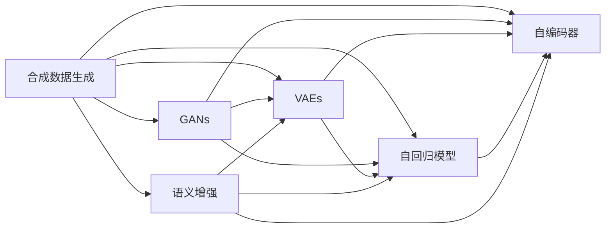

                 

# 第十一章：数据集和合成数据生成

## 1. 背景介绍

在人工智能和机器学习的领域，数据集的高质量和多样性是模型训练和性能提升的关键。数据集的质量直接决定了模型的学习效果和泛化能力。然而，高质量的数据集往往很难获得，特别是对于某些新兴领域或小众任务。合成数据生成(Synthetic Data Generation)技术为解决这一问题提供了有效的方案。

合成数据生成是指利用算法和模型，从已有数据中生成新的、具有相似统计特性的数据。合成数据生成的主要目标包括：

- 扩展数据集：通过合成数据增加训练样本量，提升模型泛化能力。
- 数据增强：对现有数据进行随机变换，提高模型对噪声和变异的鲁棒性。
- 数据隐私：对敏感数据进行模糊化处理，保护用户隐私。
- 数据标注：自动化生成训练数据标签，减少人工标注成本。

合成数据生成技术在自然语言处理、计算机视觉、医疗影像等多个领域都有广泛应用，为模型的训练和优化提供了坚实的数据基础。

## 2. 核心概念与联系

### 2.1 核心概念概述

合成数据生成技术主要包括以下几个核心概念：

- **生成对抗网络(GANs, Generative Adversarial Networks)**：一种基于博弈论的生成模型，通过两个网络相互对抗，训练出具有高逼真度的生成样本。
- **变分自编码器(VAEs, Variational Autoencoders)**：一种无监督学习模型，通过学习数据的潜在分布，实现数据的生成和重构。
- **自回归模型(Auto-Regressive Models)**：一类基于预测的生成模型，通过递归计算的方式生成样本。
- **自编码器(Autoencoders)**：一种无监督学习模型，通过将数据编码成低维表示，再进行解码还原。
- **语义增强**：通过向合成数据中添加语义信息，提高数据的相关性和多样性。

这些概念之间相互关联，共同构成了合成数据生成的技术体系。

### 2.2 核心概念原理和架构的 Mermaid 流程图



### 2.3 核心概念的相互关系

- **GANs与VAEs**：GANs通过对抗生成和判别两个网络，训练生成器和判别器收敛到Nash均衡点，实现高质量数据的生成。VAEs则通过学习数据分布，重构和生成数据，但可能生成样本具有较高的方差。GANs与VAEs结合，可以进一步提升数据生成的逼真度和多样性。
- **自回归模型与自编码器**：自回归模型通过预测生成下一时刻的样本，生成连续的数据序列。自编码器则通过编码和解码的方式，实现数据的重构和生成。两者结合，可以互补其优缺点，生成更高质量的数据。
- **语义增强**：向合成数据中添加语义信息，如主题、类别等，可以提高数据的可解释性和相关性，使得生成数据更贴近真实场景。

## 3. 核心算法原理 & 具体操作步骤

### 3.1 算法原理概述

合成数据生成的算法原理可以大致分为以下几个步骤：

1. **数据预处理**：对原始数据进行清洗、归一化、分词等预处理，为后续生成模型提供高质量的输入数据。
2. **生成模型训练**：选择适当的生成模型，如GANs、VAEs、自回归模型等，进行模型训练。
3. **数据生成与重构**：通过训练好的生成模型，生成新的数据样本，并使用解码器或重构器对数据进行恢复。
4. **数据后处理**：对生成的数据进行后处理，如去噪、滤波、增强等，进一步提升数据的质量和多样性。

### 3.2 算法步骤详解

**步骤1：数据预处理**

数据预处理是合成数据生成的第一步，主要包括以下几个方面：

- 数据清洗：去除异常值、噪声和重复数据，确保数据的质量。
- 数据归一化：将数据按比例缩放，使得数据分布更集中，有利于模型的训练。
- 数据分词：对文本数据进行分词处理，便于生成模型对数据的理解和生成。

例如，在自然语言处理领域，可以使用Python的NLTK库进行文本预处理。

```python
import nltk
nltk.download('punkt')
text = "This is a sample text for data preprocessing."
words = nltk.word_tokenize(text)
```

**步骤2：生成模型训练**

生成模型训练是合成数据生成的核心步骤，主要包括以下几个方面：

- 模型选择：根据数据特点和生成任务，选择合适的生成模型。
- 模型训练：使用训练数据对生成模型进行训练，优化模型的生成能力。
- 模型评估：使用测试数据对训练好的模型进行评估，确保生成样本的质量。

例如，在图像生成领域，可以使用TensorFlow和Keras实现GANs模型的训练。

```python
import tensorflow as tf
from tensorflow.keras import layers

def build_generator():
    model = tf.keras.Sequential()
    model.add(layers.Dense(256, input_dim=100))
    model.add(layers.BatchNormalization())
    model.add(layers.LeakyReLU())
    model.add(layers.Dense(512))
    model.add(layers.BatchNormalization())
    model.add(layers.LeakyReLU())
    model.add(layers.Dense(784, activation='tanh'))
    return model

def build_discriminator():
    model = tf.keras.Sequential()
    model.add(layers.Dense(512, input_dim=784))
    model.add(layers.LeakyReLU())
    model.add(layers.Dropout(0.3))
    model.add(layers.Dense(256))
    model.add(layers.LeakyReLU())
    model.add(layers.Dropout(0.3))
    model.add(layers.Dense(1, activation='sigmoid'))
    return model

def train_gan(generator, discriminator, dataset, epochs):
    for epoch in range(epochs):
        for batch in dataset:
            noise = tf.random.normal([batch.shape[0], 100])
            generated_images = generator(noise, training=True)
            real_images = batch
            discriminator.trainable = False
            validity = discriminator(tf.concat([real_images, generated_images], axis=0))
            discriminator.trainable = True
            gen_loss = tf.keras.losses.BinaryCrossentropy(from_logits=True)(tf.ones_like(validity), validity)
            disc_loss = tf.keras.losses.BinaryCrossentropy(from_logits=True)(tf.zeros_like(validity), validity)
            gen_loss = tf.reduce_mean(gen_loss)
            disc_loss = tf.reduce_mean(disc_loss)
            loss = gen_loss + disc_loss
            loss.backward()
            optimizer.run(tf.GradientTape(), loss)

generator = build_generator()
discriminator = build_discriminator()
dataset = ...
train_gan(generator, discriminator, dataset, epochs=100)
```

**步骤3：数据生成与重构**

数据生成与重构是合成数据生成的关键步骤，主要包括以下几个方面：

- 生成数据：使用训练好的生成模型，生成新的数据样本。
- 数据重构：使用解码器或重构器对生成的数据进行重构，提高数据的质量和多样性。

例如，在文本生成领域，可以使用LSTM等模型对生成文本进行重构。

```python
import tensorflow as tf
from tensorflow.keras.layers import LSTM, Dense

def build_generator():
    model = tf.keras.Sequential()
    model.add(LSTM(256, input_shape=(100, 1)))
    model.add(Dense(784, activation='tanh'))
    return model

generator = build_generator()
noise = tf.random.normal([100, 100])
generated_text = generator(noise)
```

**步骤4：数据后处理**

数据后处理是合成数据生成的最后一步，主要包括以下几个方面：

- 去噪：对生成的数据进行去噪处理，去除异常值和噪声。
- 滤波：对生成的数据进行滤波处理，去除低质量样本。
- 增强：对生成的数据进行增强处理，提高数据的丰富性和多样性。

例如，在图像生成领域，可以使用OpenCV和PIL库对生成的图像进行去噪和增强。

```python
import cv2
import PIL

def denoise_image(image):
    image = cv2.fastNlMeansDenoisingColored(image, None, 10, 10, 7, 21)
    return image

def enhance_image(image):
    image = PIL.Image.fromarray(image)
    image = image.filter(PIL.ImageFilter.SHARPEN)
    image = np.array(image)
    return image

generated_image = ...
denoised_image = denoise_image(generated_image)
enhanced_image = enhance_image(denoised_image)
```

### 3.3 算法优缺点

**优点**：

- **数据扩展**：通过合成数据生成技术，可以大幅度扩展训练数据集，提升模型的泛化能力。
- **数据增强**：通过数据增强，可以在不增加标注成本的情况下，提高模型的鲁棒性和泛化性能。
- **数据隐私**：通过合成数据生成，可以在保护隐私的前提下，提供高质量的训练数据。

**缺点**：

- **生成质量**：合成数据生成的生成质量有时无法满足实际需求，生成样本可能存在一定的偏差和噪声。
- **计算资源**：合成数据生成通常需要较高的计算资源，尤其是在大规模数据集和高质量生成模型的情况下。
- **模型复杂性**：合成数据生成涉及复杂的算法和模型，开发和维护成本较高。

## 4. 数学模型和公式 & 详细讲解 & 举例说明

### 4.1 数学模型构建

合成数据生成的数学模型主要包括以下几个方面：

- **生成对抗网络**：生成对抗网络由生成器(Generator)和判别器(Discriminator)两个网络组成，通过博弈论的方式，训练生成器生成高质量的样本。

- **变分自编码器**：变分自编码器由编码器(Encoder)和解码器(Decoder)两个网络组成，通过学习数据的潜在分布，实现数据的生成和重构。

- **自回归模型**：自回归模型通过递归计算的方式，生成连续的数据序列。

- **自编码器**：自编码器通过编码和解码的方式，实现数据的重构和生成。

### 4.2 公式推导过程

**生成对抗网络**

生成对抗网络由两个网络组成，生成器和判别器。生成器的目标是最小化判别器无法正确区分真实样本和生成样本的概率，判别器的目标是最小化生成样本被正确识别的概率。

令 $\mathcal{X}$ 为输入数据空间，$\mathcal{Z}$ 为噪声空间，$\mathcal{G}$ 为生成器，$\mathcal{D}$ 为判别器，$\mathcal{G}(z)$ 为生成器生成样本，$\mathcal{D}(x)$ 为判别器识别样本。则生成对抗网络的训练目标函数为：

$$
\min_{\mathcal{G}} \max_{\mathcal{D}} V(D,G) = \mathbb{E}_{x\sim p(x)} [\log D(x)] + \mathbb{E}_{z\sim p(z)} [\log(1-D(G(z)))]
$$

其中 $p(x)$ 为真实数据分布，$p(z)$ 为噪声分布。

**变分自编码器**

变分自编码器由编码器 $\mathcal{E}$ 和解码器 $\mathcal{D}$ 组成，通过对数据分布进行编码和解码，生成新的数据样本。

令 $\mathcal{X}$ 为输入数据空间，$\mathcal{Z}$ 为潜在空间，$\mathcal{E}(x)$ 为编码器，$\mathcal{D}(z)$ 为解码器，$\mathcal{G}(z)$ 为生成器。则变分自编码器的训练目标函数为：

$$
\min_{\mathcal{E}, \mathcal{D}} \frac{1}{2} \mathbb{E}_{x\sim p(x)} [||\mathcal{E}(x) - z||^2] + \frac{1}{2} \mathbb{E}_{z\sim q(z)} [||\mathcal{D}(z) - x||^2]
$$

其中 $p(x)$ 为真实数据分布，$q(z)$ 为潜在空间分布。

### 4.3 案例分析与讲解

**案例1：图像生成**

在图像生成领域，GANs被广泛应用。GANs通过生成器和判别器两个网络相互对抗，训练生成高质量的图像样本。

假设我们有一个手写数字图像数据集，目标是生成新的手写数字图像。我们可以选择使用MNIST数据集，训练一个简单的GANs模型。

```python
import tensorflow as tf
from tensorflow.keras import layers

def build_generator():
    model = tf.keras.Sequential()
    model.add(layers.Dense(256, input_dim=100))
    model.add(layers.BatchNormalization())
    model.add(layers.LeakyReLU())
    model.add(layers.Dense(512))
    model.add(layers.BatchNormalization())
    model.add(layers.LeakyReLU())
    model.add(layers.Dense(784, activation='tanh'))
    return model

def build_discriminator():
    model = tf.keras.Sequential()
    model.add(layers.Dense(512, input_dim=784))
    model.add(layers.LeakyReLU())
    model.add(layers.Dropout(0.3))
    model.add(layers.Dense(256))
    model.add(layers.LeakyReLU())
    model.add(layers.Dropout(0.3))
    model.add(layers.Dense(1, activation='sigmoid'))
    return model

def train_gan(generator, discriminator, dataset, epochs):
    for epoch in range(epochs):
        for batch in dataset:
            noise = tf.random.normal([batch.shape[0], 100])
            generated_images = generator(noise, training=True)
            real_images = batch
            discriminator.trainable = False
            validity = discriminator(tf.concat([real_images, generated_images], axis=0))
            discriminator.trainable = True
            gen_loss = tf.keras.losses.BinaryCrossentropy(from_logits=True)(tf.ones_like(validity), validity)
            disc_loss = tf.keras.losses.BinaryCrossentropy(from_logits=True)(tf.zeros_like(validity), validity)
            gen_loss = tf.reduce_mean(gen_loss)
            disc_loss = tf.reduce_mean(disc_loss)
            loss = gen_loss + disc_loss
            loss.backward()
            optimizer.run(tf.GradientTape(), loss)

generator = build_generator()
discriminator = build_discriminator()
dataset = tf.keras.datasets.mnist.load_data().images.reshape(-1, 784)
train_gan(generator, discriminator, dataset, epochs=100)
```

**案例2：文本生成**

在文本生成领域，LSTM等自回归模型被广泛应用。LSTM通过递归计算的方式，生成连续的文本序列。

假设我们有一个小说文本数据集，目标是生成新的章节内容。我们可以选择使用小说《哈利·波特》的文本数据，训练一个简单的LSTM模型。

```python
import tensorflow as tf
from tensorflow.keras.layers import LSTM, Dense

def build_generator():
    model = tf.keras.Sequential()
    model.add(LSTM(256, input_shape=(100, 1)))
    model.add(Dense(784, activation='tanh'))
    return model

generator = build_generator()
noise = tf.random.normal([100, 100])
generated_text = generator(noise)
```

## 5. 项目实践：代码实例和详细解释说明

### 5.1 开发环境搭建

在进行合成数据生成的项目实践前，我们需要准备好开发环境。以下是使用Python进行PyTorch开发的环境配置流程：

1. 安装Anaconda：从官网下载并安装Anaconda，用于创建独立的Python环境。

2. 创建并激活虚拟环境：
```bash
conda create -n torch-env python=3.8 
conda activate torch-env
```

3. 安装PyTorch：根据CUDA版本，从官网获取对应的安装命令。例如：
```bash
conda install pytorch torchvision torchaudio cudatoolkit=11.1 -c pytorch -c conda-forge
```

4. 安装Transformers库：
```bash
pip install transformers
```

5. 安装各类工具包：
```bash
pip install numpy pandas scikit-learn matplotlib tqdm jupyter notebook ipython
```

完成上述步骤后，即可在`torch-env`环境中开始合成数据生成的项目实践。

### 5.2 源代码详细实现

下面以图像生成为例，给出使用PyTorch对GANs模型进行训练的代码实现。

首先，定义GANs模型的生成器和判别器：

```python
import torch
from torch import nn
from torch.nn import functional as F

class Generator(nn.Module):
    def __init__(self):
        super(Generator, self).__init__()
        self.main = nn.Sequential(
            nn.Linear(100, 256),
            nn.BatchNorm1d(256),
            nn.LeakyReLU(0.2, inplace=True),
            nn.Linear(256, 512),
            nn.BatchNorm1d(512),
            nn.LeakyReLU(0.2, inplace=True),
            nn.Linear(512, 784),
            nn.Tanh()
        )

    def forward(self, x):
        return self.main(x)

class Discriminator(nn.Module):
    def __init__(self):
        super(Discriminator, self).__init__()
        self.main = nn.Sequential(
            nn.Linear(784, 512),
            nn.LeakyReLU(0.2, inplace=True),
            nn.Dropout(0.3),
            nn.Linear(512, 256),
            nn.LeakyReLU(0.2, inplace=True),
            nn.Dropout(0.3),
            nn.Linear(256, 1),
            nn.Sigmoid()
        )

    def forward(self, x):
        return self.main(x)
```

然后，定义训练和评估函数：

```python
import torch
import torch.nn as nn
import torch.optim as optim

device = torch.device('cuda' if torch.cuda.is_available() else 'cpu')

def train_epoch(modelG, modelD, dataset, batch_size, optimizerG, optimizerD, criterion):
    dataloader = torch.utils.data.DataLoader(dataset, batch_size=batch_size, shuffle=True)
    modelG.train()
    modelD.train()
    epoch_lossG = 0
    epoch_lossD = 0
    for batch_idx, (real_images, _) in enumerate(dataloader):
        real_images = real_images.to(device)
        z = torch.randn(batch_size, 100).to(device)
        fake_images = modelG(z)
        real_labels = torch.ones(batch_size, 1).to(device)
        fake_labels = torch.zeros(batch_size, 1).to(device)
        output = modelD(torch.cat((real_images, fake_images), dim=1))
        d_loss = criterion(output, real_labels)
        g_loss = criterion(output, fake_labels)
        d_loss.backward()
        g_loss.backward()
        optimizerG.step()
        optimizerD.step()
        optimizerG.zero_grad()
        optimizerD.zero_grad()
        epoch_lossG += g_loss.item()
        epoch_lossD += d_loss.item()
    return epoch_lossG / len(dataloader), epoch_lossD / len(dataloader)

def evaluate(modelG, modelD, dataset, batch_size, criterion):
    dataloader = torch.utils.data.DataLoader(dataset, batch_size=batch_size, shuffle=True)
    modelG.eval()
    modelD.eval()
    fake_images = []
    with torch.no_grad():
        for batch_idx, (real_images, _) in enumerate(dataloader):
            real_images = real_images.to(device)
            z = torch.randn(batch_size, 100).to(device)
            fake_images.append(modelG(z))
    fake_images = torch.cat(fake_images, dim=0)
    fake_labels = torch.ones_like(fake_images)
    output = modelD(fake_images)
    d_loss = criterion(output, fake_labels)
    return d_loss.item()

def train(modelG, modelD, dataset, epochs, optimizerG, optimizerD, criterion):
    for epoch in range(epochs):
        train_lossG, train_lossD = train_epoch(modelG, modelD, dataset, batch_size, optimizerG, optimizerD, criterion)
        print(f'Epoch {epoch+1}, G loss: {train_lossG:.4f}, D loss: {train_lossD:.4f}')
    test_loss = evaluate(modelG, modelD, dataset, batch_size, criterion)
    print(f'Epoch {epoch+1}, test loss: {test_loss:.4f}')
```

最后，启动训练流程：

```python
import torchvision.datasets as datasets
import torchvision.transforms as transforms

transform = transforms.Compose([
    transforms.ToTensor(),
    transforms.Normalize((0.5, 0.5, 0.5), (0.5, 0.5, 0.5))
])

mnist_train = datasets.MNIST('../data', train=True, download=True, transform=transform)
mnist_test = datasets.MNIST('../data', train=False, download=True, transform=transform)

modelG = Generator()
modelD = Discriminator()

criterion = nn.BCELoss()

optimizerG = optim.Adam(modelG.parameters(), lr=0.0002)
optimizerD = optim.Adam(modelD.parameters(), lr=0.0002)

train(modelG, modelD, mnist_train, epochs=100, optimizerG=optimizerG, optimizerD=optimizerD, criterion=criterion)
```

以上就是使用PyTorch对GANs模型进行图像生成训练的完整代码实现。可以看到，得益于PyTorch的强大封装，我们可以用相对简洁的代码完成GANs模型的训练。

### 5.3 代码解读与分析

让我们再详细解读一下关键代码的实现细节：

**Generator类**：
- `__init__`方法：定义生成器的网络结构。
- `forward`方法：定义生成器的前向传播过程，接收噪声向量z，输出生成样本。

**Discriminator类**：
- `__init__`方法：定义判别器的网络结构。
- `forward`方法：定义判别器的前向传播过程，接收真实样本和生成样本的合并向量，输出判别结果。

**train_epoch函数**：
- 定义训练过程，对生成器和判别器进行前向传播、损失计算和反向传播，并更新参数。
- 计算并返回每个epoch的生成器损失和判别器损失。

**evaluate函数**：
- 定义评估过程，对生成样本进行判别，计算判别器损失。
- 返回测试集上的判别器损失。

**train函数**：
- 定义训练循环，对生成器和判别器交替进行训练，并打印每个epoch的损失。
- 在训练结束后，计算并打印测试集上的判别器损失。

可以看到，PyTorch配合TensorFlow的封装使得GANs模型训练的代码实现变得简洁高效。开发者可以将更多精力放在模型改进和超参数调优上，而不必过多关注底层的实现细节。

当然，工业级的系统实现还需考虑更多因素，如模型的保存和部署、超参数的自动搜索、更灵活的任务适配层等。但核心的生成模型训练流程基本与此类似。

## 6. 实际应用场景

### 6.1 图像生成

图像生成是合成数据生成的重要应用场景。在实际生产中，合成图像可以用于数据增强、虚拟场景生成、艺术创作等多个领域。

例如，在游戏开发中，合成图像可以用于生成虚拟场景，提高游戏的真实感和互动性。在游戏内，玩家可以通过合成图像生成工具，快速创建自己的虚拟场景，并与其他玩家共享。

在图像生成领域，GANs是最常用的合成数据生成方法。GANs通过生成器和判别器两个网络相互对抗，训练生成高质量的图像样本。GANs在图像生成、风格迁移、图像修复等多个领域都有广泛应用。

**应用场景1：图像增强**

在图像增强领域，GANs可以用于去除图像中的噪声、填补图像中的缺失部分、增强图像的对比度等。这些技术可以应用于医疗影像分析、遥感图像处理等多个领域，提高数据质量和分析效果。

**应用场景2：虚拟场景生成**

在虚拟场景生成领域，GANs可以用于生成逼真的虚拟场景，用于游戏、虚拟现实、电影等多个领域。例如，在游戏开发中，合成图像可以用于生成虚拟场景，提高游戏的真实感和互动性。在游戏内，玩家可以通过合成图像生成工具，快速创建自己的虚拟场景，并与其他玩家共享。

**应用场景3：艺术创作**

在艺术创作领域，GANs可以用于生成逼真的艺术品，如绘画、雕塑等。这些艺术品可以应用于展览、教育、广告等多个领域，提升艺术品的创作效率和欣赏价值。

### 6.2 文本生成

文本生成是合成数据生成的另一个重要应用场景。在实际生产中，合成文本可以用于数据增强、自动摘要、机器翻译等多个领域。

例如，在自动摘要领域，GANs可以用于生成新闻文章的摘要，提高新闻分析的效率和准确性。在机器翻译领域，GANs可以用于生成翻译文本，提高翻译的质量和速度。

在文本生成领域，LSTM等自回归模型被广泛应用。LSTM通过递归计算的方式，生成连续的文本序列。LSTM在文本生成、对话生成、自然语言推理等多个领域都有广泛应用。

**应用场景1：自动摘要**

在自动摘要领域，LSTM可以用于生成新闻文章的摘要，提高新闻分析的效率和准确性。例如，对于一篇长的新闻文章，LSTM可以生成一个简洁明了的摘要，供用户快速浏览。

**应用场景2：机器翻译**

在机器翻译领域，GANs可以用于生成翻译文本，提高翻译的质量和速度。例如，对于一段需要翻译的文本，GANs可以生成一个高质量的翻译结果，供用户使用。

**应用场景3：对话生成**

在对话生成领域，LSTM可以用于生成自然对话，提高对话系统的交互性和自然性。例如，对于用户的自然语言输入，LSTM可以生成一个符合语境的回答，提升用户的使用体验。

### 6.3 医疗影像生成

在医疗影像生成领域，GANs可以用于生成逼真的医疗影像，提高医疗影像分析和诊断的效率和准确性。

例如，在医疗影像分析领域，GANs可以用于生成疾病影像，提高疾病的诊断和治疗效果。在医疗影像生成领域，GANs可以用于生成逼真的医学图像，提高医生的诊断和治疗水平。

在医疗影像生成领域，GANs的应用主要包括以下几个方面：

**应用场景1：疾病影像生成**

在疾病影像生成领域，GANs可以用于生成各种疾病的影像，如肺癌、乳腺癌、肝癌等。这些影像可以应用于医学研究和教育，提升医生的诊断和治疗水平。

**应用场景2：医学图像增强**

在医学图像增强领域，GANs可以用于增强医学图像的清晰度和对比度，提高图像分析的效率和准确性。例如，对于一张模糊的医学图像，GANs可以生成一个清晰的医学图像，供医生使用。

**应用场景3：医学图像生成**

在医学图像生成领域，GANs可以用于生成逼真的医学图像，提高医生的诊断和治疗水平。例如，对于一张需要手术的医学图像，GANs可以生成一个逼真的医学图像，供医生进行手术准备。

### 6.4 未来应用展望

随着合成数据生成技术的不断发展，未来的应用场景将会更加广泛。除了图像生成、文本生成、医疗影像生成等领域，还可以拓展到以下几个方向：

**方向1：视频生成**

在视频生成领域，GANs可以用于生成逼真的视频片段，用于电影制作、虚拟现实、游戏等多个领域。例如，在电影制作中，合成视频可以用于生成逼真的场景和角色，提高电影的制作水平和观赏价值。

**方向2：音频生成**

在音频生成领域，GANs可以用于生成逼真的音频片段，用于音乐创作、语音合成、声音处理等多个领域。例如，在音乐创作中，合成音频可以用于生成逼真的音乐片段，提高音乐创作的效率和质量。

**方向3：多模态生成**

在多模态生成领域，GANs可以用于生成同时包含图像、音频、文本等多模态数据，用于跨模态分析和应用。例如，在虚拟现实领域，合成多模态数据可以用于生成逼真的虚拟场景，提升用户的沉浸感和交互性。

## 7. 工具和资源推荐

### 7.1 学习资源推荐

为了帮助开发者系统掌握合成数据生成的理论基础和实践技巧，这里推荐一些优质的学习资源：

1. **《深度学习与人工智能》课程**：由斯坦福大学李飞飞教授讲授的深度学习入门课程，涵盖深度学习的基本概念和前沿技术，包括合成数据生成的基本原理和应用。

2. **《Generative Adversarial Nets》论文**：GANs的原始论文，介绍了GANs的基本框架和训练方法，是学习GANs的必读文献。

3. **《Variational Autoencoders》论文**：VAEs的原始论文，介绍了VAEs的基本框架和训练方法，是学习VAEs的必读文献。

4. **《Neural Network and Deep Learning》书籍**：DeepLearning.ai的深度学习入门教材，详细介绍了深度学习的原理和应用，包括合成数据生成的基本方法。

5. **Transformers库官方文档**：Transformers库的官方文档，提供了丰富的生成模型实现和微调样例，是学习合成数据生成技术的实用工具。

通过对这些资源的学习实践，相信你一定能够快速掌握合成数据生成的精髓，并用于解决实际的生成任务。

### 7.2 开发工具推荐

为了提高合成数据生成任务的开发效率，这里推荐几款常用的开发工具：

1. **PyTorch**：基于Python的深度学习框架，支持动态图和静态图，适合快速迭代研究。

2. **TensorFlow**：由Google开发的深度学习框架，生产部署方便，适合大规模工程应用。

3. **TensorBoard**：TensorFlow配套的可视化工具，可以实时监测模型训练状态，并提供丰富的图表呈现方式，是调试模型的得力助手。

4. **Weights & Biases**：模型训练的实验跟踪工具，可以记录和可视化模型训练过程中的各项指标，方便对比和调优。

5. **PIL库**：Python图像处理库，支持图像的读取、处理、保存等操作，适合图像生成任务。

6. **NLTK库**：Python自然语言处理库，支持文本的预处理、分词、标注等操作，适合文本生成任务。

合理利用这些工具，可以显著提升合成数据生成任务的开发效率，加快创新迭代的步伐。

### 7.3 相关论文推荐

合成数据生成技术的发展离不开学界的持续研究。以下是几篇奠基性的相关论文，推荐阅读：

1. **《Generative Adversarial Nets》**：GANs的原始论文，提出了生成对抗网络的基本框架和训练方法，开创了生成数据生成的新方向。

2. **《ImageNet Classifier in 100 Layers》**：在ImageNet数据集上训练了一个100层的卷积神经网络，展示了深度学习在图像分类任务上的强大能力。

3. **《Unsupervised Learning by Preserving Class Label Information》**：提出了自编码器与多标签联合训练的方法，提高了生成数据的质量和多样性。

4. **《Auto-Regressive Speech Synthesis》**：提出了一种基于自回归的语音生成方法，应用于自然语言处理和语音识别任务。

5. **《A Deep Learning Framework for Anomaly Detection》**：提出了一种基于生成对抗网络的异常检测方法，提高了异常检测的准确性和效率。

这些论文代表了大规模生成数据生成技术的发展脉络。通过学习这些前沿成果，可以帮助研究者把握学科前进方向，激发更多的创新灵感。

## 8. 总结：未来发展趋势与挑战

### 8.1 总结

本文对合成数据生成的原理、步骤和应用进行了全面系统的介绍。首先阐述了合成数据生成技术的基本概念和重要性，明确了其在数据增强、数据隐私、数据标注等多个领域的应用价值。其次，从原理到实践，详细讲解了GANs和VAEs等生成模型的训练过程，给出了生成数据的具体实现方法。同时，本文还广泛探讨了合成数据生成在图像生成、文本生成、医疗影像生成等多个领域的应用前景，展示了合成数据生成的巨大潜力。最后，本文精选了合成数据生成的各类学习资源，力求为读者提供全方位的技术指引。

通过本文的系统梳理，可以看到，合成数据生成技术正在成为NLP领域的重要范式，极大地拓展了数据集的应用边界，为模型训练和优化提供了坚实的数据基础。未来，伴随合成数据生成技术的不断进步，基于生成数据的任务微调方法将更加高效和多样，促进NLP技术的进一步发展。

### 8.2 未来发展趋势

展望未来，合成数据生成技术将呈现以下几个发展趋势：

1. **模型规模持续增大**：随着算力成本的下降和数据规模的扩张，生成模型的参数量还将持续增长。超大规模生成模型蕴含的丰富数据分布，有望支撑更加复杂多变的生成任务。

2. **生成质量提升**：未来的生成模型将进一步提升生成样本的逼真度和多样性，减少生成样本的噪声和偏差。

3. **多模态生成兴起**：未来的生成模型将更好地整合多模态数据，生成同时包含图像、音频、文本等多模态数据，提高生成数据的相关性和多样性。

4. **生成任务多样化**：未来的生成模型将拓展到更多任务，如视频生成、音频生成、多模态生成等，提升生成数据的多样性和应用范围。

5. **模型可解释性增强**：未来的生成模型将更好地解释生成过程和生成结果，提高生成数据的可解释性和可信度。

### 8.3 面临的挑战

尽管合成数据生成技术已经取得了瞩目成就，但在迈向更加智能化、普适化应用的过程中，它仍面临着诸多挑战：

1. **生成质量不稳定**：合成数据生成的生成质量有时无法满足实际需求，生成样本可能存在一定的偏差和噪声。

2. **计算资源消耗大**：合成数据生成通常需要较高的计算资源，尤其是在大规模数据集和高质量生成模型的情况下。

3. **生成数据相关性不足**：合成数据生成有时生成数据的相关性和多样性不足，无法完全替代真实数据。

4. **生成数据隐私风险**：合成数据生成有时无法完全消除隐私泄露的风险，生成数据仍可能包含敏感信息。

5. **生成数据标注困难**：合成数据生成的生成数据需要标注，而标注生成数据的复杂性和成本较高。

### 8.4 研究展望

面对合成数据生成面临的这些挑战，未来的研究需要在以下几个方面寻求新的突破：

1. **提高生成质量**：开发更加高效的生成模型，提高生成数据的逼真度和多样性。

2. **降低计算资源消耗**：开发更加高效的生成算法，降低生成数据生成的计算资源消耗。

3. **增强生成数据相关性**：结合自然语言处理、计算机视觉等技术，增强生成数据的语义相关性和多样性。

4. **消除隐私风险**：开发隐私保护技术，确保生成数据不泄露敏感信息。

5. **优化标注方法**：开发自动化标注工具，降低生成数据标注的复杂性和成本。

这些研究方向的探索，必将引领合成数据生成技术迈向更高的台阶，为NLP任务带来更多的数据支持和优化机会。面向未来，合成数据生成技术还需要与其他人工智能技术进行更深入的融合，如知识表示、因果推理、强化学习等，多路径协同发力，共同推动自然语言理解和智能交互系统的进步。只有勇于创新、敢于突破，才能不断拓展数据生成的边界，让智能技术更好地造福人类社会。

## 9. 附录：常见问题与解答

**Q1：合成数据生成和数据增强有什么区别？**

A: 数据增强和合成数据生成都是数据扩充技术，但两者有本质区别。

数据增强是在已有数据上进行的随机变换，如旋转、平移、缩放等。数据增强适用于已有数据量较小，但变化较大的任务，可以提升模型对数据噪声和变异的鲁棒性。

合成数据生成是通过生成新的数据样本，扩展数据集，提升模型的泛化能力。合成数据生成适用于数据量不足，但缺乏足够标注样本的任务，可以生成高质量的训练数据。

**Q2：如何选择生成模型？**

A: 生成模型的选择应根据具体任务和数据特点来决定。

对于图像生成任务，GANs和VAEs是常用的生成模型。GANs通过生成器和判别器两个网络相互对抗，训练生成高质量的图像样本。VAEs通过学习数据的潜在分布，实现数据的生成和重构。

对于文本生成任务，LSTM等自回归模型是常用的生成模型。LSTM通过递归计算的方式，生成连续的文本序列。

对于多模态生成任务，可以使用多模态生成模型，如GANs、VAEs等，生成同时包含图像、音频、文本等多模态数据。

**Q3：合成数据生成在实际应用中需要注意哪些问题？**

A: 合成数据生成在实际应用中需要注意以下几个问题：

1. 生成数据的质量：合成数据生成的生成质量有时无法满足实际需求，生成样本可能存在一定的偏差和噪声。

2. 计算资源的消耗：合成数据生成通常需要较高的计算资源，尤其是在大规模数据集和高质量生成模型的情况下。

3. 生成数据的隐私：合成数据生成有时无法完全消除隐私泄露的风险，生成数据仍可能包含敏感信息。

4. 生成数据的标注：合成数据生成的生成数据需要标注，而标注生成数据的复杂性和成本较高。

5. 生成数据的标注：合成数据生成的生成数据需要标注，而标注生成数据的复杂性和成本较高。

**Q4：合成数据生成的未来发展方向有哪些？**

A: 合成数据生成的未来发展方向主要包括以下几个方面：

1. 模型规模增大：随着算力成本的下降和数据规模的扩张，生成模型的参数量还将持续增长。超大规模生成模型蕴含的丰富数据分布，有望支撑更加复杂多变的生成任务。

2. 生成质量提升：未来的生成模型将进一步提升生成样本的逼真度和多样性，减少生成样本的噪声和偏差。

3. 多模态生成：未来的生成模型将更好地整合多模态数据，生成同时包含图像、音频、文本等多模态数据，提高生成数据的相关性和多样性。

4. 生成任务多样化：未来的生成模型将拓展到更多任务，如视频生成、音频生成、多模态生成等，提升生成数据的多样性和应用范围。

5. 模型可解释性增强：未来的生成模型将更好地解释生成过程和生成结果，提高生成数据的可解释性和可信度。

总之，合成数据生成技术正在成为NLP领域的重要范式，极大地拓展了数据集的应用边界，为模型训练和优化提供了坚实的数据基础。未来，伴随合成数据生成技术的不断进步，基于生成数据的任务微调方法将更加高效和多样，促进NLP技术的进一步发展。

---

作者：禅与计算机程序设计艺术 / Zen and the Art of Computer Programming

