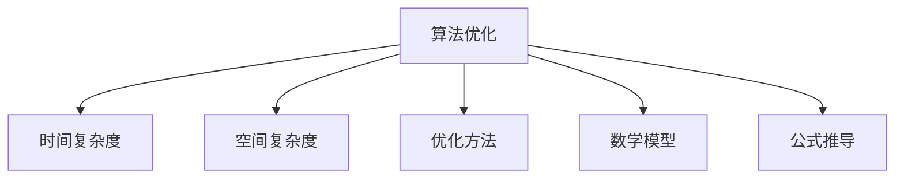

                 

# 算法优化：提升人类计算的效率和准确性

> 关键词：算法优化,人类计算,效率提升,算法加速,计算精度,计算机科学,人工智能

## 1. 背景介绍

### 1.1 问题由来
随着科学技术的迅猛发展，人类对计算的需求日益增加。从简单的加减乘除，到复杂的机器学习、大数据分析、生物信息学等，计算已成为推动科技进步的重要工具。然而，面对海量数据的处理和高精度计算的要求，传统计算方法效率低下，准确性有限，已难以满足现代科技的需求。

算法的优化成为了提高计算效率和准确性的关键。通过改进算法，可以显著降低计算时间，提高计算精度，从而提升人类计算的能力。本文旨在深入探讨算法优化的核心概念、关键技术及其应用，以期为算法开发者和应用者提供全面的指导。

### 1.2 问题核心关键点
算法优化是一个复杂的系统工程，涉及数学建模、数据分析、算法设计、代码实现等多个环节。其核心在于通过对现有算法进行改进和创新，提升其效率和准确性。

本文将从以下四个方面进行探讨：
1. 算法优化的一般原则和策略。
2. 常见算法的优化方法及其具体应用。
3. 优化算法的数学模型与公式推导。
4. 算法优化的工程实现与实践技巧。

## 2. 核心概念与联系

### 2.1 核心概念概述

为更好地理解算法优化的核心概念，本节将介绍几个密切相关的核心概念：

- 算法优化(Algorithm Optimization)：通过改进算法的实现方式，提升其效率和精度，从而达到更高效的计算目的。
- 时间复杂度(Time Complexity)：指算法执行所需的时间与问题规模之间的关系，是评估算法效率的重要指标。
- 空间复杂度(Space Complexity)：指算法执行所需的内存空间与问题规模之间的关系，也是评估算法效率的重要指标。
- 优化方法(Optimization Techniques)：包括启发式算法、动态规划、贪心算法、分治算法等，是算法优化的具体手段。
- 数学模型(Mathematical Modeling)：指将实际问题转化为数学表达式，通过数学方法求解最优解的过程。
- 公式推导(Formula Derivation)：指通过对算法进行数学建模，推导出其时间复杂度、空间复杂度等关键指标的过程。

这些核心概念之间的逻辑关系可以通过以下Mermaid流程图来展示：



这个流程图展示了我优化算法的一般框架：

1. 算法优化基于时间复杂度和空间复杂度的分析。
2. 通过优化方法对算法进行改进。
3. 建立数学模型进行理论分析。
4. 通过公式推导得到具体优化策略。

## 3. 核心算法原理 & 具体操作步骤

### 3.1 算法原理概述

算法优化的核心在于通过改进算法的实现方式，降低时间复杂度和空间复杂度，从而提升计算效率和准确性。以下是常见的算法优化策略及其原理：

1. 启发式算法（Heuristic Optimization）：通过模拟自然界的优化过程，找到近似最优解。常见于组合优化、搜索问题等。
2. 动态规划（Dynamic Programming）：将复杂问题拆解为更小的子问题，通过保存子问题的最优解，减少重复计算。常见于最长公共子序列、背包问题等。
3. 贪心算法（Greedy Algorithm）：每次选择当前最优解，逐步构建最终解。常见于最短路径、最小生成树等。
4. 分治算法（Divide and Conquer）：将问题拆解为多个子问题，并行求解后再合并。常见于归并排序、快速排序等。

### 3.2 算法步骤详解

以动态规划为例，展示其基本步骤和实现过程：

1. **确定子问题**：将原问题拆解为若干个子问题。在动态规划中，子问题通常是重叠子问题和最优子结构问题。
2. **确定状态**：定义状态变量，用于保存子问题的最优解。
3. **确定状态转移方程**：通过递推公式，将子问题的最优解转化为原问题的最优解。
4. **确定边界条件**：明确最简单的子问题的最优解。
5. **实现算法**：编写代码，实现动态规划的计算过程。

### 3.3 算法优缺点

算法优化方法具有以下优点：
1. 提升计算效率。优化后的算法执行速度更快，节省计算时间。
2. 提高计算精度。优化后的算法减少误差，提升计算结果的准确性。
3. 易于实现。优化方法通常具有简单易懂的实现方式。

同时，算法优化也存在以下局限性：
1. 复杂度分析。算法优化需要对时间复杂度和空间复杂度进行精确分析，分析过程复杂。
2. 实现难度。某些优化方法需要复杂的数学建模和算法设计。
3. 数据依赖。某些优化方法依赖于问题的具体数据分布，适用范围有限。
4. 局部最优。启发式算法和贪心算法可能会陷入局部最优，无法得到全局最优解。

### 3.4 算法应用领域

算法优化技术在各个领域都有广泛应用，以下是几个典型应用场景：

1. **大数据分析**：通过优化算法，可以显著提升大数据处理速度，提高数据挖掘的效率。
2. **计算机视觉**：优化算法可以加速图像处理和模式识别，提升图像识别、物体检测等任务的性能。
3. **自然语言处理**：优化算法可以提升自然语言处理的效率和效果，如机器翻译、文本分类等。
4. **生物信息学**：优化算法可以加速基因组学、蛋白质结构预测等生物信息的计算。
5. **金融工程**：优化算法可以用于金融模型的求解，提高风险管理、投资决策等应用的效率和精度。

## 4. 数学模型和公式 & 详细讲解  
### 4.1 数学模型构建

算法优化的核心在于建立数学模型，通过数学方法求解最优解。以动态规划为例，假设问题为求解最长公共子序列（Longest Common Subsequence，LCS）问题，可以将问题转化为以下数学模型：

设$S_1$和$S_2$为两个字符串，$n$和$m$分别为字符串的长度。记$S_1$和$S_2$的最长公共子序列长度为$L$。

$$
L = \max \left\{ L_{i,j} \right\} \quad \text{其中} \quad i = 1, 2, ..., n; j = 1, 2, ..., m
$$

其中，$L_{i,j}$表示字符串$S_1[1:i]$和$S_2[1:j]$的最长公共子序列长度。

### 4.2 公式推导过程

对于最长公共子序列问题，可以使用动态规划求解。定义状态$L_{i,j}$为字符串$S_1[1:i]$和$S_2[1:j]$的最长公共子序列长度。状态转移方程为：

$$
L_{i,j} = \begin{cases}
L_{i-1,j} & \text{if } S_1[i] \neq S_2[j] \\
L_{i-1,j-1} + 1 & \text{if } S_1[i] = S_2[j]
\end{cases}
$$

其中，$L_{i-1,j}$表示删除$S_1[i]$后，$S_1[1:i-1]$和$S_2[1:j]$的最长公共子序列长度；$L_{i-1,j-1} + 1$表示包含$S_1[i]$，$S_2[j]$后，$S_1[1:i-1]$和$S_2[1:j-1]$的最长公共子序列长度加1。

边界条件为：$L_{0,j} = 0$和$L_{i,0} = 0$。

### 4.3 案例分析与讲解

假设$S_1 = ABCBDAB$和$S_2 = BDCABA$，求$L$的值。

首先，构建状态转移表格：

| i | 0 | 1 | 2 | 3 | 4 | 5 | 6 | 7 |
| --- | --- | --- | --- | --- | --- | --- | --- | --- |
| j | B | D | C | B | A | B | A | A |
| L | 0 | 0 | 0 | 0 | 0 | 0 | 0 | 0 |
| L | 0 | 0 | 0 | 1 | 1 | 1 | 1 | 1 |
| L | 0 | 0 | 1 | 1 | 1 | 2 | 2 | 2 |
| L | 0 | 1 | 1 | 1 | 2 | 2 | 2 | 2 |
| L | 0 | 1 | 2 | 2 | 2 | 3 | 3 | 3 |
| L | 0 | 1 | 2 | 3 | 3 | 3 | 3 | 3 |
| L | 0 | 1 | 2 | 3 | 3 | 3 | 3 | 3 |

根据状态转移方程，可以求得$L_{7,7}=3$，即最长公共子序列长度为3。

## 5. 项目实践：代码实例和详细解释说明
### 5.1 开发环境搭建

在进行算法优化实践前，我们需要准备好开发环境。以下是使用Python进行动态规划算法的开发环境配置流程：

1. 安装Anaconda：从官网下载并安装Anaconda，用于创建独立的Python环境。

2. 创建并激活虚拟环境：
```bash
conda create -n dp-env python=3.8 
conda activate dp-env
```

3. 安装相关依赖：
```bash
conda install numpy scipy matplotlib
```

4. 安装优化算法库：
```bash
pip install scipy-optimize
```

完成上述步骤后，即可在`dp-env`环境中开始算法优化实践。

### 5.2 源代码详细实现

以下是一个使用动态规划求解最长公共子序列问题的Python代码实现：

```python
import numpy as np

def lcs(X, Y):
    m, n = len(X), len(Y)
    L = np.zeros((m+1, n+1), dtype=int)
    
    for i in range(1, m+1):
        for j in range(1, n+1):
            if X[i-1] == Y[j-1]:
                L[i, j] = L[i-1, j-1] + 1
            else:
                L[i, j] = max(L[i-1, j], L[i, j-1])
    
    return L[m, n]

# 测试
X = 'ABCBDAB'
Y = 'BDCABA'
print(lcs(X, Y))  # 输出 3
```

### 5.3 代码解读与分析

让我们再详细解读一下关键代码的实现细节：

**lcs函数**：
- 函数参数`X`和`Y`分别表示两个字符串。
- 首先，定义状态矩阵`L`，用于保存子问题的最优解。
- 使用双重循环遍历字符串，根据状态转移方程计算子问题的最优解，并保存在状态矩阵中。
- 最后，返回状态矩阵的右下角元素，即最长公共子序列长度。

**测试代码**：
- 定义两个字符串`X`和`Y`。
- 调用`lcs`函数求解最长公共子序列长度，并输出结果。

可以看到，通过动态规划算法，我们可以高效地求解最长公共子序列问题，计算时间复杂度为$O(mn)$，空间复杂度为$O(mn)$。在实际应用中，还可以使用矩阵压缩等技术，进一步降低空间复杂度。

## 6. 实际应用场景
### 6.1 供应链优化

在供应链管理中，物流和库存优化是一个重要问题。通过优化算法，可以提升物流效率、减少库存成本，从而提升供应链的整体效益。

例如，通过动态规划算法，可以求解最优化路径问题，在有限的运输成本下，选择最优的货物运输路径。动态规划算法可以处理复杂的约束条件和资源限制，确保最优解的准确性。

### 6.2 金融风险管理

在金融领域，风险管理是一个复杂且重要的问题。通过优化算法，可以预测金融市场的波动性、评估信用风险等，从而降低金融机构的损失。

例如，通过使用优化算法，可以求解最优投资组合问题，在有限的资本限制下，选择最优的投资组合，最大化预期收益。优化算法可以处理大量历史数据和复杂的市场动态，提高风险评估的精度。

### 6.3 机器学习模型调优

在机器学习中，模型调优是一个关键环节。通过优化算法，可以调整模型参数，提升模型的性能和泛化能力，从而提高预测精度。

例如，通过使用动态规划算法，可以求解模型参数的选择问题，选择最优的参数组合，提升模型的性能。优化算法可以处理大规模的参数空间和复杂的约束条件，提高模型调优的效率和准确性。

### 6.4 未来应用展望

随着算法优化的不断深入，算法优化技术将在更多领域得到应用，为各行业的优化升级提供新的解决方案。

在智慧城市治理中，优化算法可以应用于交通流优化、资源配置、环境监测等环节，提高城市管理的自动化和智能化水平，构建更安全、高效的未来城市。

在智能制造领域，优化算法可以应用于生产调度、设备维护、质量控制等环节，提升生产效率和产品质量，降低生产成本。

在个性化推荐系统中，优化算法可以应用于用户行为预测、内容推荐等环节，提升用户体验和推荐效果，推动电子商务和内容平台的发展。

此外，在智能交通、智能医疗、智能农业等众多领域，算法优化技术也将不断涌现，为各行业带来新的突破。相信随着优化算法的持续演进，算法优化技术将成为各行各业优化升级的重要手段，推动各行各业的数字化转型和智能化升级。

## 7. 工具和资源推荐
### 7.1 学习资源推荐

为了帮助开发者系统掌握算法优化的理论基础和实践技巧，这里推荐一些优质的学习资源：

1. 《算法导论》系列博文：由算法专家撰写，深入浅出地介绍了算法优化的一般原理和常见算法。

2. Coursera《算法设计与分析》课程：由斯坦福大学开设的算法课程，有Lecture视频和配套作业，带你深入了解算法的精髓。

3. 《算法》书籍：算法经典著作，涵盖了从基础算法到高级算法的全面内容，是算法学习的必读书籍。

4. Kaggle算法竞赛平台：数据科学竞赛平台，涵盖多种算法优化任务，可以实战练兵。

5. GitHub算法优化项目：GitHub上众多优秀的算法优化项目，可以查看开源代码和文档，学习最佳实践。

通过对这些资源的学习实践，相信你一定能够快速掌握算法优化的精髓，并用于解决实际的算法问题。

### 7.2 开发工具推荐

高效的开发离不开优秀的工具支持。以下是几款用于算法优化开发的常用工具：

1. Python：开源编程语言，有丰富的科学计算库和优化库，适合算法优化和数据分析。
2. R：统计分析语言，有强大的数据处理和可视化功能，适合算法优化和模型调优。
3. MATLAB：数学计算语言，有丰富的工具箱和优化算法，适合算法优化和系统建模。
4. Octave：开源的MATLAB替代品，支持大多数MATLAB功能，适合算法优化和科学计算。
5. Julia：高性能科学计算语言，有丰富的并行计算和优化算法库，适合算法优化和复杂计算。

合理利用这些工具，可以显著提升算法优化任务的开发效率，加快创新迭代的步伐。

### 7.3 相关论文推荐

算法优化技术的快速发展离不开学界的持续研究。以下是几篇奠基性的相关论文，推荐阅读：

1. "A Tutorial on Dynamic Programming"：由Richard Bellman撰写，深入介绍了动态规划算法的原理和应用。
2. "The Simplex Method"：由T. Cormen等人撰写，介绍了线性规划和单纯形法，是优化算法的重要基础。
3. "Branch and Bound"：由John von Neumann等人撰写，介绍了分支定界法，是组合优化算法的重要手段。
4. "Genetic Algorithms in Search, Optimization and Machine Learning"：由David E. Goldberg撰写，介绍了遗传算法，是启发式算法的重要代表。
5. "An Introduction to the Simplex Method"：由F. Bertsekas撰写，介绍了单纯形法的数学原理和实际应用。

这些论文代表了大模型微调技术的发展脉络。通过学习这些前沿成果，可以帮助研究者把握学科前进方向，激发更多的创新灵感。

## 8. 总结：未来发展趋势与挑战

### 8.1 总结

本文对算法优化的核心概念、关键技术及其应用进行了全面系统的介绍。首先阐述了算法优化的研究背景和意义，明确了算法优化在提升计算效率和准确性方面的独特价值。其次，从原理到实践，详细讲解了算法优化的数学原理和关键步骤，给出了算法优化任务开发的完整代码实例。同时，本文还广泛探讨了算法优化技术在供应链优化、金融风险管理、机器学习模型调优等多个领域的应用前景，展示了算法优化技术的广泛应用价值。

通过本文的系统梳理，可以看到，算法优化技术在各领域中已经得到了广泛应用，显著提升了计算效率和准确性，为各行各业的发展提供了强有力的技术支持。未来，随着算法优化技术的不断演进，算法优化将更加高效、准确、可靠，为人类计算能力的提升提供更强大的推动力。

### 8.2 未来发展趋势

展望未来，算法优化技术将呈现以下几个发展趋势：

1. 深度学习与优化算法的结合：深度学习在许多领域表现出色，但计算成本较高。未来，深度学习与优化算法的结合将进一步提升计算效率，降低计算成本。
2. 自动化算法优化：自动化算法优化技术将使得算法优化的过程更加智能，通过机器学习等手段，自动选择最优算法和参数，提高算法优化的效率和效果。
3. 分布式算法优化：分布式计算技术的发展，使得算法优化的过程可以分布式进行，进一步提升计算效率。
4. 量子计算与优化算法：量子计算技术的发展，将为复杂优化问题提供全新的解决方案，提升算法优化的精度和速度。
5. 跨学科融合：算法优化技术与各个学科的融合将带来更多创新，如金融优化、生物优化、物理优化等，提升各领域的计算能力和应用效果。

这些趋势凸显了算法优化技术的广阔前景。这些方向的探索发展，必将进一步提升算法优化技术的性能和应用范围，为各行各业提供更加高效、可靠的计算支持。

### 8.3 面临的挑战

尽管算法优化技术已经取得了瞩目成就，但在迈向更加智能化、普适化应用的过程中，它仍面临着诸多挑战：

1. 高维度优化问题：随着数据量的增加和问题复杂度的提升，优化问题的维度也随之增加，难以用传统算法进行求解。
2. 计算资源限制：一些复杂优化问题需要大量计算资源，对于计算资源的依赖较大。
3. 算法收敛性：某些优化算法容易陷入局部最优，无法得到全局最优解。
4. 优化问题多样性：不同问题的优化目标和方法差异较大，难以找到统一的优化策略。
5. 算法的可解释性：一些优化算法缺乏可解释性，难以理解其内部工作机制。

正视算法优化面临的这些挑战，积极应对并寻求突破，将使得算法优化技术更加成熟和实用。相信随着学界和产业界的共同努力，这些挑战终将一一被克服，算法优化技术必将更加高效、可靠、可解释，为各行各业提供更强大的计算支持。

### 8.4 研究展望

面对算法优化所面临的种种挑战，未来的研究需要在以下几个方面寻求新的突破：

1. 优化算法的新发展：探索新的优化算法，如量子优化算法、强化学习优化算法等，提升优化算法的效率和效果。
2. 多学科交叉研究：与其他学科的交叉研究，如生物信息学、物理优化等，探索更多优化问题的解决方案。
3. 自动化优化系统的开发：开发自动化优化系统，自动选择最优算法和参数，提高优化算法的可扩展性和适用性。
4. 分布式优化系统的设计：设计高效的分布式优化系统，实现大规模优化问题的并行求解。
5. 优化算法的可解释性研究：研究优化算法的可解释性，提升算法的透明度和可理解性。

这些研究方向的探索，必将引领算法优化技术迈向更高的台阶，为人类计算能力的提升提供更强大的推动力。

## 9. 附录：常见问题与解答

**Q1：算法优化是否适用于所有计算问题？**

A: 算法优化适用于各种计算问题，特别是对于大规模、复杂的问题。但对于一些特定问题，如非线性优化、非凸优化等，优化算法可能会失效或效率较低。此时需要结合其他算法进行综合求解。

**Q2：如何选择合适的算法优化方法？**

A: 选择合适的算法优化方法需要考虑问题的性质、规模、目标等。一般来说，可以通过以下步骤选择：
1. 确定问题类型：是线性规划、组合优化、搜索问题等。
2. 确定优化目标：是最大化、最小化等。
3. 选择合适的算法：如动态规划、贪心算法、分支定界法等。
4. 优化算法参数：根据问题特点调整算法参数，以达到最优效果。

**Q3：算法优化的计算复杂度如何衡量？**

A: 算法优化的计算复杂度可以通过时间复杂度和空间复杂度来衡量。时间复杂度表示算法执行时间与问题规模之间的关系，空间复杂度表示算法执行空间需求与问题规模之间的关系。计算复杂度越低，算法优化效果越好。

**Q4：算法优化与人工智能有何关联？**

A: 算法优化是人工智能中非常重要的一环。优化算法广泛应用于机器学习模型的调优、深度学习模型的训练等环节，是提升人工智能模型性能的关键技术。

**Q5：如何评估算法优化的效果？**

A: 评估算法优化的效果可以从多个方面进行，如计算时间、计算精度、资源消耗等。一般来说，可以通过以下步骤评估：
1. 确定评估指标：如计算时间、计算精度、内存占用等。
2. 设置基准算法：选择或设计基准算法进行比较。
3. 测试算法效果：在多个测试集上测试算法的表现。
4. 分析结果：对比算法效果，分析优缺点，找出改进方向。

这些步骤可以帮助评估算法优化的效果，确保优化算法的实用性和可靠性。

---

作者：禅与计算机程序设计艺术 / Zen and the Art of Computer Programming

