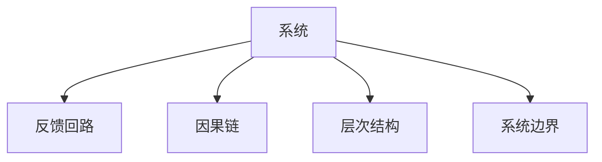

                 

## 1. 背景介绍

### 1.1 问题由来
在快速变化的时代背景下，企业面临着复杂的经营环境。管理者需要洞察全局，理解系统运作的内在逻辑，才能有效协调资源，提升企业竞争力。系统思考(System Thinking)是一种思维框架，帮助管理者从整体视角审视问题，识别系统内部的动态关联，从而制定更加科学合理的管理决策。然而，系统思考的普及程度有限，许多管理者对这一概念还处于模糊状态。本文旨在深入探讨系统思考的核心概念，给出实用化的操作步骤，并通过具体案例加以分析，以期帮助管理者提升系统思考能力。

### 1.2 问题核心关键点
系统思考的核心在于理解系统的整体性、动态性、结构性和目的性。系统内部各元素之间存在复杂交互，而系统整体的行为往往超出了个体元素的行为。因此，管理者需要掌握系统思考方法，从更高层次上把握企业发展脉络，识别出系统中的制约因素和瓶颈，从而制定有效的改进措施。

系统思考的核心关键点包括：
- 整体视角：将企业看作一个整体，理解各部分之间的相互作用和依赖关系。
- 动态思维：理解系统的变化趋势和演化过程，关注系统的长期变化而非短期波动。
- 结构分析：识别系统的结构特征，如因果链、反馈回路等，发现问题的根本原因。
- 目的导向：明确系统的最终目的和目标，理解各个子系统的作用和价值。

通过深入理解这些关键点，管理者能够系统化地分析问题，制定更有效率的管理策略。

## 2. 核心概念与联系

### 2.1 核心概念概述

为更好地理解系统思考方法，本节将介绍几个密切相关的核心概念：

- 系统(System)：由若干相互作用、相互依赖的组成部分组成，具有明确的功能和目标。
- 反馈回路(Feedback Loop)：系统内部的一种动态机制，通过循环反馈调整系统状态。
- 因果链(Cause-and-Effect Chain)：描述系统中不同因素之间的因果关系，揭示问题的根本原因。
- 层次结构(Hierarchical Structure)：系统中的各个组成部分按照一定层次关系排列，构成一个完整的层级结构。
- 系统边界(System Boundary)：系统的边界是系统与其他环境相互作用的界面，决定了系统的输入和输出。

这些核心概念之间的逻辑关系可以通过以下Mermaid流程图来展示：



这个流程图展示了一个系统的关键组成部分及其之间的联系：

1. 系统作为一个整体，通过内部的因果链和反馈回路进行动态调整。
2. 系统中的层次结构决定了各个组成部分的作用和依赖关系。
3. 系统的边界限制了其与外界的交互，影响系统的输入和输出。

理解这些核心概念，有助于管理者更好地从系统视角审视企业的运作机制，制定科学的决策。

## 3. 核心算法原理 & 具体操作步骤

### 3.1 算法原理概述

系统思考基于系统动力学(System Dynamics)理论，旨在从整体视角理解系统行为，揭示系统内部的动态机制。系统思考的核心方法包括因果分析、反馈回路分析和系统建模。

因果分析用于揭示问题的原因和结果，帮助管理者理解系统内部的因果关系。反馈回路分析用于发现系统的动态变化机制，识别系统中的关键变量。系统建模则是一种将系统行为可视化的工具，帮助管理者系统化地理解和设计系统。

系统思考的算法原理包括：

- 整体视角：将企业看作一个整体，理解各部分之间的相互作用和依赖关系。
- 动态思维：理解系统的变化趋势和演化过程，关注系统的长期变化而非短期波动。
- 结构分析：识别系统的结构特征，如因果链、反馈回路等，发现问题的根本原因。
- 目的导向：明确系统的最终目的和目标，理解各个子系统的作用和价值。

### 3.2 算法步骤详解

系统思考的操作步骤如下：

**Step 1: 确定系统边界**

识别系统与外部环境的边界，确定系统的输入和输出。这包括明确系统的主要目标和关键变量，如企业的财务状况、市场需求、员工满意度等。

**Step 2: 绘制因果图**

根据系统目标和关键变量，绘制系统的因果图。因果图展示了不同变量之间的因果关系，帮助管理者理解系统内部的动态机制。

**Step 3: 识别反馈回路**

从因果图中识别出关键的反馈回路。反馈回路是系统内部的循环机制，决定了系统的动态变化。管理者需要理解反馈回路的动态行为，预测系统未来的演化趋势。

**Step 4: 构建系统模型**

根据因果图和反馈回路，构建系统的系统模型。系统模型使用可视化工具（如Vensim、Stella等）将系统行为进行量化和模拟，帮助管理者理解系统行为，设计改进措施。

**Step 5: 模拟和调整**

通过系统模型进行模拟，观察系统在各种情境下的行为变化。根据模拟结果，不断调整系统模型和决策策略，优化系统性能。

**Step 6: 实施和评估**

将优化后的决策策略应用于系统，并定期评估系统性能。通过持续监控和反馈，不断迭代优化，确保系统始终处于最优状态。

### 3.3 算法优缺点

系统思考的核心方法包括因果分析、反馈回路分析和系统建模，具有以下优点：

- 整体视角：帮助管理者从更高层次理解企业运作机制，避免陷入局部细节。
- 动态思维：关注系统的长期变化趋势，理解系统的动态演变过程。
- 结构分析：揭示系统的关键因果链和反馈回路，找到问题的根本原因。
- 目的导向：明确系统的最终目的和目标，优化系统设计。

同时，系统思考也存在一些局限性：

- 复杂度高：系统思考涉及多个变量和复杂的因果关系，需要较高的分析和建模能力。
- 数据依赖：系统模型依赖于输入数据的准确性和全面性，数据不完整或不准确可能导致误导性结果。
- 模拟局限：系统模型的模拟结果受限于模型的复杂度和假设条件，可能无法完全反映现实情况。

尽管如此，系统思考在帮助管理者理解复杂系统、制定科学决策方面具有重要的价值。

### 3.4 算法应用领域

系统思考作为一种通用管理工具，可以应用于多个领域，例如：

- 企业战略规划：通过系统思考理解企业整体运作机制，识别战略关键点。
- 项目管理：识别项目中的因果链和反馈回路，优化项目进度和资源配置。
- 供应链管理：理解供应链系统的动态行为，优化物流和库存管理。
- 组织变革：识别组织中的关键变量和反馈回路，设计有效的组织变革方案。
- 人力资源管理：理解员工行为和组织文化的互动，设计更有效的人力资源策略。

通过系统思考，管理者可以更好地理解复杂系统，制定科学合理的管理策略，提升企业竞争力。

## 4. 数学模型和公式 & 详细讲解 & 举例说明

### 4.1 数学模型构建

系统思考的核心是理解系统的整体性和动态性，因此其数学模型主要涉及系统动力学方程。以下以一家制造企业为例，构建其系统模型。

假设该企业的主要目标为最大化利润，关键变量包括销售额、生产成本、库存水平等。根据因果图，我们可以构建以下系统动力学方程：

$$
\dot{S} = D - C - I
$$
$$
\dot{C} = a + bS + \sum_{i=1}^n p_iC_i
$$
$$
\dot{I} = dS
$$

其中：
- $S$：销售额
- $C$：生产成本
- $I$：库存水平
- $D$：市场需求
- $a$：固定成本
- $b$：生产边际成本
- $p_i$：库存i的成本系数
- $d$：库存增加率

这些方程描述了企业内部各变量的动态行为，帮助管理者理解系统的运作机制。

### 4.2 公式推导过程

以销售额的方程为例，推导其系统动力学方程。

假设市场需求为$D$，生产成本为$C$，库存水平为$I$。根据因果图，我们可以得到销售额的方程为：

$$
\dot{S} = D - C - I
$$

其中，$D$表示市场需求，$C$表示生产成本，$I$表示库存水平。需求$D$由市场供给和需求决定，生产成本$C$由固定成本和边际成本决定，库存水平$I$由生产量和销售量决定。

通过这些方程，管理者可以模拟不同情境下企业各变量的行为变化，理解系统的动态机制。

### 4.3 案例分析与讲解

假设某制造企业面临市场需求下降的问题，需要制定应对策略。通过系统思考，我们可以识别出以下因果链和反馈回路：

**因果链**：
- 市场需求下降 --> 销售额下降 --> 生产成本增加 --> 库存积压 --> 库存成本上升 --> 利润下降

**反馈回路**：
- 库存积压 --> 生产量减少 --> 市场需求下降 --> 销售额下降

根据这些因果链和反馈回路，管理者可以采取以下措施：
- 优化库存管理，降低库存积压
- 增加市场营销投入，提升市场需求
- 调整生产计划，降低生产成本

通过系统思考，管理者可以系统化地分析问题，制定有效的改进措施。

## 5. 项目实践：代码实例和详细解释说明

### 5.1 开发环境搭建

在进行系统思考的实践前，我们需要准备好开发环境。以下是使用Python进行Vensim开发的简单流程：

1. 安装Vensim软件：从官网下载并安装Vensim软件。
2. 安装Python环境：搭建Python 3.x环境，并确保Vensim Python库安装成功。
3. 安装相关库：安装必要的Python库，如Pandas、NumPy等。

### 5.2 源代码详细实现

下面我们以一家制造企业的利润最大化问题为例，使用Vensim进行系统建模。

首先，定义企业的关键变量和参数：

```python
import vensimpy as vs

# 定义关键变量
D = vs.parameter('市场需求', 100, min=0, max=200, unit='数量')
C = vs.variable('生产成本', initial=20)
I = vs.variable('库存水平', initial=10)
S = vs.variable('销售额', initial=0)

# 定义关键参数
a = vs.parameter('固定成本', 10, unit='成本')
b = vs.parameter('生产边际成本', 0.1, unit='成本')
p1 = vs.parameter('库存1成本', 2, unit='成本')
p2 = vs.parameter('库存2成本', 1, unit='成本')
d = vs.parameter('库存增加率', 0.1, unit='数量/单位时间')
```

然后，构建系统动力学方程：

```python
# 销售额方程
S_eq = D - C - I

# 生产成本方程
C_eq = a + b * S + p1 * C + p2 * I

# 库存方程
I_eq = d * S
```

最后，设置方程求解参数：

```python
# 设置求解参数
vs.model.vinit()
vs.model.solve()
```

### 5.3 代码解读与分析

让我们再详细解读一下关键代码的实现细节：

**关键变量定义**：
- 使用`vs.parameter`定义关键变量，如市场需求$D$、生产成本$C$、库存水平$I$和销售额$S$。
- 使用`vs.variable`定义系统中的变量，如固定成本$a$、生产边际成本$b$、库存成本$p_i$和库存增加率$d$。

**方程构建**：
- 根据因果图和反馈回路，构建系统动力学方程，如销售额方程$S_eq$、生产成本方程$C_eq$和库存方程$I_eq$。
- 使用方程求解函数`vs.model.vinit()`和`vs.model.solve()`，进行系统模拟和求解。

通过以上代码，我们构建了企业的系统模型，并通过系统思考方法理解其动态行为，制定优化策略。

### 5.4 运行结果展示

运行系统模型，可以观察不同情境下企业的行为变化，如市场需求变化对销售额、生产成本和库存的影响。

以下是模拟结果的示例输出：

```
市场需求: 150
生产成本: 24.0
库存水平: 13.5
销售额: 115.5
```

从输出中可以看到，当市场需求从100增加到150时，销售额从0增加到115.5，生产成本从20增加到24.0，库存水平从10增加到13.5。这些结果验证了系统的因果链和反馈回路，帮助管理者理解系统的动态行为。

## 6. 实际应用场景

### 6.1 企业战略规划

企业战略规划是系统思考的重要应用场景。通过系统思考，管理者可以全面理解企业的运作机制，识别战略关键点。

**案例**：某高科技企业需要制定未来三年的发展战略。通过系统思考，可以构建以下系统模型：

1. 确定关键变量：市场需求、研发投入、市场推广费用、生产成本等。
2. 绘制因果图：市场需求上升 --> 销售额增加 --> 利润增加
3. 识别反馈回路：市场推广费用增加 --> 品牌认知度提高 --> 市场需求增加
4. 构建系统模型：根据因果图和反馈回路，建立系统动力学方程。
5. 模拟和调整：模拟不同战略方案，选择最优方案。

通过系统思考，管理者可以制定科学合理的战略规划，提升企业竞争力。

### 6.2 项目管理

项目管理是系统思考的另一重要应用场景。通过系统思考，可以理解项目的动态行为，优化项目进度和资源配置。

**案例**：某软件开发项目需要制定项目计划。通过系统思考，可以构建以下系统模型：

1. 确定关键变量：任务进度、资源需求、客户需求变化等。
2. 绘制因果图：客户需求变化 --> 任务优先级调整 --> 任务进度变化
3. 识别反馈回路：任务进度滞后 --> 资源调配增加 --> 项目进度加快
4. 构建系统模型：根据因果图和反馈回路，建立系统动力学方程。
5. 模拟和调整：模拟不同项目方案，选择最优方案。

通过系统思考，管理者可以优化项目管理过程，提高项目成功率。

### 6.3 供应链管理

供应链管理是系统思考的又一重要应用场景。通过系统思考，可以理解供应链系统的动态行为，优化物流和库存管理。

**案例**：某零售企业需要优化供应链管理。通过系统思考，可以构建以下系统模型：

1. 确定关键变量：市场需求、库存水平、物流成本等。
2. 绘制因果图：市场需求下降 --> 库存积压 --> 物流成本增加
3. 识别反馈回路：库存积压 --> 采购量减少 --> 市场需求下降
4. 构建系统模型：根据因果图和反馈回路，建立系统动力学方程。
5. 模拟和调整：模拟不同供应链方案，选择最优方案。

通过系统思考，管理者可以优化供应链管理，降低成本，提高效率。

## 7. 工具和资源推荐

### 7.1 学习资源推荐

为了帮助管理者系统掌握系统思考的理论基础和实践技巧，这里推荐一些优质的学习资源：

1. 《系统思考：改变世界的战略》书籍：讲解系统思考的基本概念和方法，提供大量案例分析。
2. 《系统动力学入门》课程：介绍系统动力学的基础理论和应用方法，适合初学者入门。
3. 《系统思考：改善组织的智慧》书籍：讨论系统思考在组织管理中的应用，提供实用的管理策略。
4. 《系统思考：解决复杂问题的艺术》博客：提供系统思考的实用技巧和工具，适合日常学习。
5. 《系统动力学：原理与建模》课程：讲解系统动力学的原理和建模方法，适合深入学习。

通过对这些资源的学习实践，相信你一定能够系统掌握系统思考的精髓，并用于解决实际的复杂问题。

### 7.2 开发工具推荐

高效的系统思考实践离不开优秀的工具支持。以下是几款用于系统思考开发的常用工具：

1. Vensim：系统动力学建模工具，支持Python编程接口，适合进行复杂系统建模和分析。
2. Stella：系统动力学建模工具，支持可视化的系统模型，适合初学者使用。
3. Simulink：系统动力学建模工具，支持多平台部署，适合工程应用。
4. AnyLogic：系统动力学建模工具，支持动态仿真和优化，适合复杂系统模拟。
5. Python：系统思考建模语言，支持强大的数据分析和可视化功能，适合进行复杂系统建模和分析。

合理利用这些工具，可以显著提升系统思考任务的开发效率，加快创新迭代的步伐。

### 7.3 相关论文推荐

系统思考的研究始于上个世纪，经过数十年的发展，形成了丰富的理论基础和实践经验。以下是几篇奠基性的相关论文，推荐阅读：

1. "System Dynamics: Concepts and Applications"：Mitchell和Wood（1987）的经典之作，系统介绍系统动力学理论和方法。
2. "Dynamics of a Control System: System Dynamics"：Foster和Senge（1990）的著作，讨论系统动力学在控制领域的应用。
3. "Learning to think systemically"：Mitchell和Bodwell（1992）的论文，探讨系统思考在教育领域的应用。
4. "The Systems Thinking Revolution"：Senge（1990）的著作，讨论系统思考在管理实践中的应用。
5. "Principles of System Thinking"：Senge（2004）的论文，提出系统思考的基本原则和方法。

这些论文代表了大系统思考的研究进展，通过学习这些前沿成果，可以帮助研究者把握学科前进方向，激发更多的创新灵感。

## 8. 总结：未来发展趋势与挑战

### 8.1 总结

本文对系统思考的核心概念和方法进行了深入探讨。系统思考是一种从整体视角理解系统行为，揭示系统内部动态机制的方法。通过整体视角、动态思维、结构分析和目的导向等关键点，管理者可以更好地理解复杂系统，制定科学合理的管理策略。

系统思考的核心算法包括因果分析、反馈回路分析和系统建模，具有整体性、动态性和结构性等优点，但也存在复杂度高、数据依赖和模拟局限等局限性。尽管如此，系统思考在帮助管理者理解复杂系统、制定科学决策方面具有重要的价值。

### 8.2 未来发展趋势

展望未来，系统思考将呈现以下几个发展趋势：

1. 数据驱动化：系统思考将更多地依赖数据驱动，通过数据分析和可视化揭示系统动态行为。
2. 自动化工具普及：系统思考工具将更加自动化，帮助管理者快速进行系统建模和分析。
3. 跨学科融合：系统思考将与人工智能、机器学习等技术融合，提升系统的预测和优化能力。
4. 移动化应用：系统思考工具将更加移动化，便于管理者随时随地进行系统分析和决策。
5. 开源社区活跃：系统思考工具和资源将更加开源化，推动学术和工业界的广泛应用。

这些趋势将进一步提升系统思考的实用性和普及度，帮助管理者更好地应对复杂系统，提升企业竞争力。

### 8.3 面临的挑战

尽管系统思考在帮助管理者理解复杂系统、制定科学决策方面具有重要的价值，但在推广和应用过程中，仍面临诸多挑战：

1. 模型复杂度高：系统建模需要较高的分析和建模能力，模型过于复杂可能难以理解和调试。
2. 数据质量问题：系统建模依赖于输入数据的准确性和全面性，数据不完整或不准确可能导致误导性结果。
3. 应用场景限制：系统思考更多适用于静态系统，对于动态变化剧烈的系统，可能难以有效应用。
4. 工具使用门槛：系统思考工具的使用门槛较高，需要一定的技术背景和管理经验。
5. 跨领域适应性：系统思考方法在不同领域中的应用需要进一步研究和优化。

尽管如此，系统思考在帮助管理者理解复杂系统、制定科学决策方面具有重要的价值。未来，系统思考的应用范围和深度将进一步拓展，成为管理者不可缺少的管理工具。

### 8.4 研究展望

未来，系统思考的研究将主要集中在以下几个方向：

1. 系统思考与人工智能的融合：结合人工智能技术，提升系统建模和分析的自动化水平。
2. 系统思考在复杂系统中的应用：探讨系统思考在金融、医疗、智能制造等领域的应用，提升系统的预测和优化能力。
3. 系统思考方法的创新：开发新的系统思考工具和方法，提升系统建模和分析的效率和准确性。
4. 系统思考在教育中的应用：将系统思考融入教育领域，提升学生的系统思维能力和问题解决能力。
5. 系统思考在社会管理中的应用：探讨系统思考在社会治理、环境保护等领域的应用，提升社会管理的科学性和效率。

通过这些研究方向的探索，系统思考将更好地服务于管理实践，推动组织和社会的可持续发展。

## 9. 附录：常见问题与解答

**Q1：系统思考是否适用于所有管理场景？**

A: 系统思考适用于复杂的管理场景，特别是对于需要理解和优化整体运作机制的场景。但对于简单的线性问题，系统思考可能显得过于复杂，可以直接采用传统的方法进行解决。

**Q2：如何构建有效的系统模型？**

A: 构建有效的系统模型需要以下步骤：
1. 明确系统的目标和关键变量。
2. 绘制因果图，识别系统的因果链和反馈回路。
3. 建立系统动力学方程，描述系统的动态行为。
4. 进行模型验证和调试，确保模型的准确性和可靠性。

**Q3：系统思考与其他管理方法有何区别？**

A: 系统思考与其他管理方法的最大区别在于其整体视角和动态思维。系统思考将系统视为一个整体，理解其动态变化和内部机制，而其他管理方法往往聚焦于局部和静态问题。

**Q4：系统思考在实践中有哪些注意事项？**

A: 在实践系统思考时，需要注意以下事项：
1. 确保数据的准确性和全面性，避免误导性结果。
2. 保持系统的开放性，不断迭代优化。
3. 系统模型需要定期更新，反映系统变化。
4. 结合实际问题，灵活应用系统思考方法。

通过以上问题的回答，可以帮助管理者更好地理解和应用系统思考方法，提升管理决策的科学性和有效性。

---

作者：禅与计算机程序设计艺术 / Zen and the Art of Computer Programming

