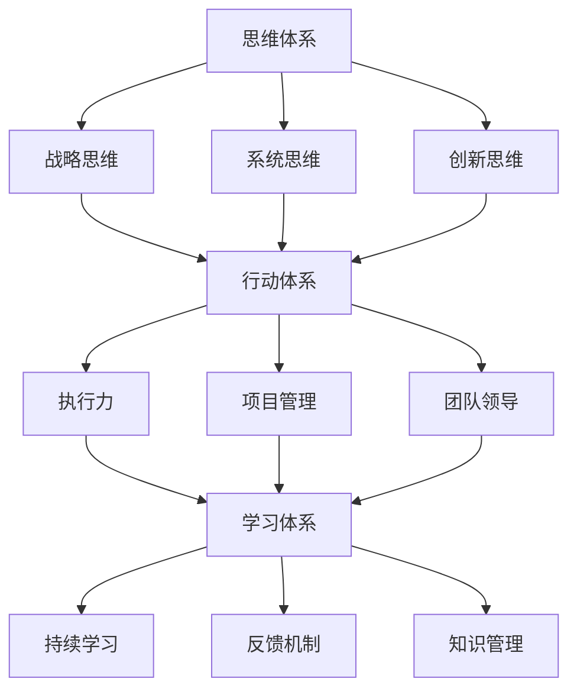

                 

# 管理者必备的三大体系：思维、行动、学习

> 关键词：管理者,思维体系,行动体系,学习体系,企业运营,领导力,创新能力

## 1. 背景介绍

### 1.1 问题由来

在当今快速变化的企业环境中，管理者面临着前所未有的挑战。全球化、数字化、市场竞争加剧，使得企业需要不断创新、高效运作。管理者不仅需要具备扎实的业务知识，更需要系统化的思维方式、行动力和持续学习能力，才能适应新的发展需求。传统的经验主义管理方法已经难以满足这些要求，管理者需要构建全面的管理体系，全面提升自我能力，带领企业跨越新高峰。

### 1.2 问题核心关键点

现代管理者需要掌握的三大体系，即思维体系、行动体系和学习体系，正是应对这些挑战的关键。这三者相辅相成，构成了管理者全面发展的基石。

- **思维体系**：指的是管理者的思考方式和决策框架，包括战略思维、系统思维、创新思维等，帮助管理者在复杂环境中做出明智的决策。
- **行动体系**：涵盖执行力、项目管理、团队领导等能力，使管理者能够将决策落实为具体的行动，实现目标。
- **学习体系**：指管理者持续更新知识、技能和思维方式的能力，保持与时俱进，适应新变化。

### 1.3 问题研究意义

掌握这三大体系，对管理者而言具有重要意义：

1. **提升决策质量**：结构化的思维体系帮助管理者更全面地分析问题，从而制定更科学、合理的决策。
2. **增强执行力**：有效的行动体系能够确保管理决策被准确地执行，确保企业目标的实现。
3. **保持竞争力**：学习体系使管理者能够不断适应新环境、新趋势，保持企业的竞争优势。

## 2. 核心概念与联系

### 2.1 核心概念概述

为了更好地理解管理者必备的三大体系，本节将详细介绍每个体系的核心概念及它们之间的关系。

- **思维体系**：
  - **战略思维**：从全局和长远视角，分析企业内外部环境，制定长期发展战略。
  - **系统思维**：将企业视为一个有机整体，分析各部分之间的相互关系，系统性解决问题。
  - **创新思维**：鼓励新颖的思考方式，推动企业不断创新，适应市场变化。

- **行动体系**：
  - **执行力**：确保决策和计划能够得到有效执行。
  - **项目管理**：科学管理项目，提升资源利用效率，确保项目按时完成。
  - **团队领导**：构建高效团队，激励团队成员，推动团队目标的实现。

- **学习体系**：
  - **持续学习**：不断更新知识和技能，保持知识前沿。
  - **反馈机制**：通过定期反馈，改进管理方法和工作流程。
  - **知识管理**：系统化管理企业知识，使其转化为企业价值。

这些核心概念之间的逻辑关系可以通过以下Mermaid流程图来展示：



这个流程图展示了三大体系之间的关联性：

1. 思维体系提供方向和策略，行动体系将策略转化为具体行动，学习体系持续优化策略和方法。
2. 战略思维、系统思维和创新思维分别提供宏观、中观和微观的视角，执行力、项目管理、团队领导则在实施中确保这些视角的落地。
3. 持续学习、反馈机制和知识管理共同构成学习体系，提升思维和行动体系的效果。

## 3. 核心算法原理 & 具体操作步骤
### 3.1 算法原理概述

管理者必备的三大体系，本质上是一种系统化的管理体系，遵循PDCA循环（Plan-Do-Check-Act）原则。

- **Plan**（计划）：基于思维体系制定战略和行动计划。
- **Do**（执行）：通过行动体系确保计划的实施。
- **Check**（检查）：使用学习体系反馈和改进执行效果。
- **Act**（改进）：基于反馈进行持续改进。

PDCA循环的四个阶段相互依存，形成闭环，确保管理的持续优化和提升。

### 3.2 算法步骤详解

以下是基于PDCA循环的具体操作步骤：

#### 3.2.1 Plan（计划）阶段

1. **环境分析**：使用战略思维和系统思维分析企业内外部环境，识别机会和威胁，明确目标。
2. **目标设定**：基于环境分析结果，设定具体的短期和长期目标。
3. **策略制定**：根据目标，制定详细的行动计划，包括资源分配、时间表等。

#### 3.2.2 Do（执行）阶段

1. **任务分配**：将计划分配给团队成员，明确责任和任务。
2. **项目管理**：使用项目管理工具和方法，确保任务按时完成。
3. **团队领导**：激励和支持团队成员，解决执行中遇到的问题。

#### 3.2.3 Check（检查）阶段

1. **绩效评估**：使用关键绩效指标(KPI)等工具，评估执行效果。
2. **反馈收集**：收集团队成员和利益相关者的反馈，识别问题。
3. **数据驱动**：基于数据分析结果，做出调整。

#### 3.2.4 Act（改进）阶段

1. **持续改进**：根据反馈和数据分析，优化策略和方法。
2. **知识管理**：将改进的经验和知识纳入知识库，供未来参考。
3. **再规划**：基于改进后的知识，进行新的计划和执行。

### 3.3 算法优缺点

基于PDCA循环的管理体系具有以下优点：

1. **系统性**：通过PDCA循环的四个阶段，形成系统化的管理框架，确保管理的全面性和深度。
2. **持续改进**：通过不断的反馈和改进，确保管理方法与时俱进，适应新环境。
3. **数据驱动**：通过绩效评估和数据分析，做出科学决策，提高管理效率。

同时，该体系也存在一定的局限性：

1. **复杂性**：对于小规模管理，可能过于复杂，增加了管理成本。
2. **依赖执行**：需要高效的执行力来保证计划的实施，否则可能导致目标无法实现。
3. **资源投入**：需要投入较多的资源进行绩效评估和数据分析，可能增加管理成本。

### 3.4 算法应用领域

基于PDCA循环的管理体系，在企业管理、项目管理和团队管理等领域得到了广泛应用。以下是几个具体的应用案例：

- **企业运营**：使用PDCA循环，优化企业运营流程，提升运营效率。
- **项目开发**：在软件开发、建筑施工等项目中，通过PDCA循环，确保项目按时高质量完成。
- **团队管理**：在团队建设和日常管理中，通过PDCA循环，优化团队协作，提升团队绩效。
- **创新管理**：在企业创新过程中，使用PDCA循环，推动技术创新和管理创新。

这些领域的应用表明，PDCA循环是一种通用而有效的方法，适用于各种规模和复杂度的管理场景。

## 4. 数学模型和公式 & 详细讲解 & 举例说明

### 4.1 数学模型构建

本节将使用数学语言对基于PDCA循环的管理体系进行更加严格的刻画。

假设管理者的决策目标为 $M$，当前状态为 $S$，执行计划为 $P$，检查结果为 $C$，改进措施为 $A$。则PDCA循环可以形式化表达为：

$$
M_{\text{next}} = M - P + C + A
$$

其中，$M_{\text{next}}$ 表示下一个决策目标，$P$ 表示计划中的执行步骤，$C$ 表示检查结果，$A$ 表示改进措施。

### 4.2 公式推导过程

以项目管理的绩效评估为例，推导基于PDCA循环的绩效计算公式。

假设项目 $P$ 的预期完成时间为 $T$，实际完成时间为 $T'$，则项目绩效 $E$ 可以定义为：

$$
E = \frac{T' - T}{T} \times 100\%
$$

其经济解释为：实际完成时间与预期完成时间的比例，即项目的超前或滞后程度。

根据PDCA循环的执行和检查阶段，可以得到：

1. **执行效果**：
   $$
   \Delta T = T' - T
   $$

2. **检查结果**：
   $$
   C = \frac{\Delta T}{T} \times 100\%
   $$

3. **改进措施**：
   $$
   A = \Delta T \times (1 - \frac{\Delta T}{T})
   $$

将 $C$ 和 $A$ 代入绩效计算公式，得到：

$$
E = \frac{A}{T} \times 100\%
$$

其经济解释为：改进措施对预期时间的调整比例，即项目超前或滞后程度。

### 4.3 案例分析与讲解

某软件公司的项目管理过程，使用PDCA循环管理项目。项目计划预计完成时间为180天，实际完成时间为190天。项目经理基于绩效评估，识别出超前时间 $\Delta T = 10$ 天，并采取措施 $A = 10 \times (1 - \frac{10}{180}) = 8$ 天，进行项目进度优化。

将数据代入绩效计算公式，得到：

$$
E = \frac{8}{180} \times 100\% = 4.44\%
$$

即项目实际完成时间超前了4.44%。项目经理可以根据这一结果，进一步优化后续项目的管理策略和执行计划。

## 5. 项目实践：代码实例和详细解释说明
### 5.1 开发环境搭建

在进行项目管理实践前，我们需要准备好开发环境。以下是使用Python进行PyTorch开发的环境配置流程：

1. 安装Anaconda：从官网下载并安装Anaconda，用于创建独立的Python环境。

2. 创建并激活虚拟环境：
```bash
conda create -n pytorch-env python=3.8 
conda activate pytorch-env
```

3. 安装PyTorch：根据CUDA版本，从官网获取对应的安装命令。例如：
```bash
conda install pytorch torchvision torchaudio cudatoolkit=11.1 -c pytorch -c conda-forge
```

4. 安装TensorFlow：使用pip安装TensorFlow。

5. 安装各类工具包：
```bash
pip install numpy pandas scikit-learn matplotlib tqdm jupyter notebook ipython
```

完成上述步骤后，即可在`pytorch-env`环境中开始项目管理实践。

### 5.2 源代码详细实现

下面我们以项目管理为例，给出使用Python进行项目管理实践的代码实现。

```python
import pandas as pd
import numpy as np
import matplotlib.pyplot as plt

# 项目数据
data = pd.read_csv('project_data.csv')

# 计算绩效
T = data['expected_time']
T_prime = data['actual_time']
delta_t = T_prime - T
performance = delta_t / T * 100

# 绘制绩效分布图
plt.hist(performance, bins=20, alpha=0.5, color='blue')
plt.xlabel('Performance Percentage')
plt.ylabel('Frequency')
plt.title('Project Performance Distribution')
plt.show()
```

以上代码实现了项目管理中的绩效计算和可视化，使用pandas库对项目数据进行处理，通过公式计算绩效，并使用matplotlib库进行数据可视化。

### 5.3 代码解读与分析

让我们再详细解读一下关键代码的实现细节：

**数据读取**：
- `pd.read_csv('project_data.csv')`：使用pandas库读取项目数据，该数据包含项目的预期完成时间、实际完成时间和绩效等信息。

**绩效计算**：
- `delta_t = T_prime - T`：计算实际完成时间与预期完成时间的差值。
- `performance = delta_t / T * 100`：根据公式计算项目绩效，并转换为百分比形式。

**数据可视化**：
- `plt.hist(performance, bins=20, alpha=0.5, color='blue')`：使用matplotlib库绘制项目绩效分布图，展示绩效的统计分布情况。
- `plt.xlabel('Performance Percentage')`：设置x轴标签。
- `plt.ylabel('Frequency')`：设置y轴标签。
- `plt.title('Project Performance Distribution')`：设置图表标题。

**结果展示**：
- `plt.show()`：显示绘制的图表。

可以看到，通过Python的pandas和matplotlib库，可以方便地实现项目绩效的计算和可视化，帮助管理者直观理解项目的执行效果。

## 6. 实际应用场景

### 6.1 智能客服系统

基于PDCA循环的管理体系，可以应用于智能客服系统的构建。传统客服往往需要配备大量人力，高峰期响应缓慢，且一致性和专业性难以保证。使用PDCA循环的管理方法，可以提升客服系统的效率和质量。

具体而言，可以收集客户的历史数据，分析客服响应时长、满意度等关键绩效指标，制定优化计划。通过项目管理工具，确保优化计划的有效执行。定期检查客服系统的运行效果，根据反馈进行改进。持续优化客服系统，提升客户满意度和服务质量。

### 6.2 金融舆情监测

金融企业需要实时监测市场舆情，避免负面信息传播带来的风险。基于PDCA循环，可以构建舆情监测系统，提高监测效果。

具体而言，可以收集金融新闻、评论等数据，分析舆情变化趋势。根据分析结果，制定舆情监测计划，并使用项目管理工具确保计划的实施。定期检查舆情监测效果，根据反馈进行优化。持续改进舆情监测系统，确保实时监测的准确性和有效性。

### 6.3 个性化推荐系统

推荐系统需要不断更新和优化，以适应用户需求的变化。使用PDCA循环，可以持续提升推荐系统的性能。

具体而言，可以收集用户的行为数据，分析用户的兴趣和偏好。根据分析结果，制定推荐优化计划，并使用项目管理工具确保计划的实施。定期检查推荐效果，根据反馈进行优化。持续改进推荐系统，提升推荐精度和用户满意度。

### 6.4 未来应用展望

随着PDCA循环在各个领域的应用，未来将有更多创新性的应用场景涌现。例如：

- **智慧医疗**：通过PDCA循环，优化医疗资源配置，提升诊疗效果。
- **智慧教育**：使用PDCA循环，优化教学方法和课程设计，提升教育质量。
- **智慧城市**：基于PDCA循环，优化城市管理流程，提升城市运行效率。

PDCA循环在更多领域的应用，将进一步提升各行业的管理水平，推动智能化发展。

## 7. 工具和资源推荐
### 7.1 学习资源推荐

为了帮助管理者系统掌握PDCA循环的理论基础和实践技巧，这里推荐一些优质的学习资源：

1. 《PDCA循环原理与应用》系列博文：由管理专家撰写，深入浅出地介绍了PDCA循环的原理、应用和改进方法。

2. 《管理科学与PDCA循环》课程：知名大学开设的管理学课程，详细讲解PDCA循环的应用案例和方法。

3. 《PDCA循环案例解析》书籍：精选了大量PDCA循环的实际案例，帮助你理解和应用PDCA循环。

4. PDCA循环官方文档：详细介绍了PDCA循环的各个步骤和方法，是学习的最佳参考。

5. 管理工具推荐：使用各类管理软件，如Trello、Asana、JIRA等，帮助你高效管理项目和团队。

通过对这些资源的学习实践，相信你一定能够快速掌握PDCA循环的核心思想，并用于解决实际的项目管理问题。

### 7.2 开发工具推荐

高效的开发离不开优秀的工具支持。以下是几款用于项目管理实践的常用工具：

1. JIRA：基于敏捷开发的管理工具，用于项目计划、任务跟踪和团队协作。
2. Asana：项目管理和任务管理工具，支持团队协作和进度跟踪。
3. Trello：看板式任务管理工具，支持实时更新和进度跟踪。
4. Microsoft Project：企业级项目管理软件，支持复杂的项目管理需求。
5. Smartsheet：基于云的项目管理工具，支持协作和进度跟踪。

合理利用这些工具，可以显著提升项目管理实践的效率和效果，加快创新迭代的步伐。

### 7.3 相关论文推荐

PDCA循环的管理方法已经广泛应用于各领域。以下是几篇奠基性的相关论文，推荐阅读：

1. PDCA循环的起源与发展：探讨PDCA循环的起源、应用和发展。
2. PDCA循环在项目管理中的应用：详细介绍了PDCA循环在项目管理和团队管理中的应用案例。
3. PDCA循环在企业运营中的应用：探讨PDCA循环在企业运营和流程优化中的应用。
4. PDCA循环与敏捷管理：探讨PDCA循环与敏捷管理方法的区别和联系。
5. PDCA循环的未来趋势：分析PDCA循环的发展趋势和未来应用方向。

这些论文代表了大语言模型微调技术的发展脉络。通过学习这些前沿成果，可以帮助研究者把握学科前进方向，激发更多的创新灵感。

## 8. 总结：未来发展趋势与挑战
### 8.1 总结

本文对基于PDCA循环的管理体系进行了全面系统的介绍。首先阐述了PDCA循环的理论基础和实践意义，明确了PDCA循环在管理实践中的重要地位。其次，从原理到实践，详细讲解了PDCA循环的各个步骤，给出了具体的应用示例。同时，本文还探讨了PDCA循环在各领域的应用前景，展示了PDCA循环的强大生命力。

通过本文的系统梳理，可以看到，PDCA循环在现代管理中发挥着不可替代的作用。它不仅提供了一种系统化的管理方法，还为管理者提供了持续改进的框架。掌握PDCA循环，有助于管理者应对复杂环境，提升企业竞争力。

### 8.2 未来发展趋势

展望未来，PDCA循环在管理实践中的应用将更加广泛，呈现以下几个发展趋势：

1. **智能化**：使用人工智能和大数据技术，进一步优化管理流程和决策过程。
2. **自动化**：通过自动化工具和系统，提升项目管理效率和准确性。
3. **数字化**：使用数字化管理工具和平台，实现数据的实时监控和分析。
4. **个性化**：根据员工和管理者的特点，提供个性化的管理方案。
5. **全球化**：适应全球化管理需求，优化跨文化管理策略。

以上趋势表明，PDCA循环将在未来的管理实践中发挥更大的作用，帮助企业实现更高的管理水平和运营效率。

### 8.3 面临的挑战

尽管PDCA循环已经广泛应用于各个领域，但在实践过程中，仍然面临一些挑战：

1. **数据隐私**：在数字化管理中，如何保护员工和管理者的隐私数据，是一个重要问题。
2. **团队协作**：在多团队协作中，如何有效协调和管理各团队的工作，是一个重要挑战。
3. **资源投入**：在实施PDCA循环时，需要投入大量资源，如何平衡资源投入和效益输出，是一个重要问题。
4. **员工参与度**：在管理改进过程中，如何提升员工的参与度和积极性，是一个重要挑战。
5. **持续改进**：在PDCA循环中，如何确保持续改进的有效性，是一个重要问题。

这些挑战需要管理者在实践中不断探索和优化，才能使PDCA循环发挥最大的效能。

### 8.4 研究展望

面对PDCA循环面临的挑战，未来的研究需要在以下几个方面寻求新的突破：

1. **数据隐私保护**：研究更加有效的数据隐私保护技术，确保员工和管理者的数据安全。
2. **协作工具优化**：研究更加智能的协作工具，提升团队协作效率和效果。
3. **资源优化配置**：研究更加科学合理的资源配置方法，提高资源利用效率。
4. **员工激励机制**：研究更加有效的员工激励机制，提升员工的参与度和积极性。
5. **改进持续性**：研究更加科学的改进方法，确保持续改进的效果。

这些研究方向将进一步提升PDCA循环在管理实践中的应用效果，帮助企业实现更高的管理水平和运营效率。总之，PDCA循环需要通过不断的创新和优化，才能在未来的管理实践中发挥更大的作用。

## 9. 附录：常见问题与解答

**Q1：如何使用PDCA循环进行项目管理和改进？**

A: 使用PDCA循环进行项目管理，主要分为以下四个步骤：

1. **Plan（计划）**：根据项目目标，制定详细的执行计划，包括任务分配、资源配置、时间表等。
2. **Do（执行）**：按照计划执行，确保任务按时完成。
3. **Check（检查）**：定期检查项目进展和执行效果，识别问题和风险。
4. **Act（改进）**：根据检查结果，制定改进措施，优化管理方法和执行过程。

通过不断循环PDCA循环，可以持续改进项目管理和执行效果，确保项目按时高质量完成。

**Q2：PDCA循环中的计划和执行阶段需要注意哪些问题？**

A: 在计划和执行阶段，需要注意以下几个问题：

1. **明确目标**：确保计划和执行目标明确、具体，避免模糊不清。
2. **资源合理配置**：确保资源分配合理，避免资源浪费或不足。
3. **任务分解**：将大任务分解为小任务，便于执行和控制。
4. **时间管理**：确保时间安排合理，避免进度滞后。
5. **团队协作**：加强团队协作，确保信息透明和沟通顺畅。

通过这些问题管理，可以确保计划和执行阶段的高效性和准确性。

**Q3：PDCA循环中的检查和改进阶段需要注意哪些问题？**

A: 在检查和改进阶段，需要注意以下几个问题：

1. **绩效评估**：使用科学的方法评估项目执行效果，识别问题和改进点。
2. **数据驱动**：基于数据和事实进行改进，避免主观臆断。
3. **持续改进**：持续优化管理方法和执行过程，确保改进效果。
4. **知识积累**：将改进经验和知识纳入知识库，供未来参考。
5. **反馈机制**：建立有效的反馈机制，及时识别和解决执行问题。

通过这些问题管理，可以确保检查和改进阶段的有效性，持续提升管理水平和执行效果。

**Q4：PDCA循环是否适用于小规模管理？**

A: PDCA循环是一种通用的管理方法，适用于各种规模和复杂度的管理场景。对于小规模管理，虽然步骤和方法可能相对简单，但PDCA循环的基本原则依然适用。通过PDCA循环，可以有效提升小规模管理的效率和效果。

**Q5：PDCA循环是否适用于跨文化管理？**

A: PDCA循环可以应用于跨文化管理，但需要考虑文化差异和沟通障碍。在实施PDCA循环时，需要注意以下几点：

1. **文化理解**：了解不同文化的习惯和价值观，避免文化冲突。
2. **沟通协调**：加强跨文化沟通，确保信息透明和理解一致。
3. **灵活调整**：根据文化差异，灵活调整管理策略和方法。

通过这些措施，可以确保PDCA循环在跨文化管理中有效运行，提升团队协作和管理效果。

---

作者：禅与计算机程序设计艺术 / Zen and the Art of Computer Programming

