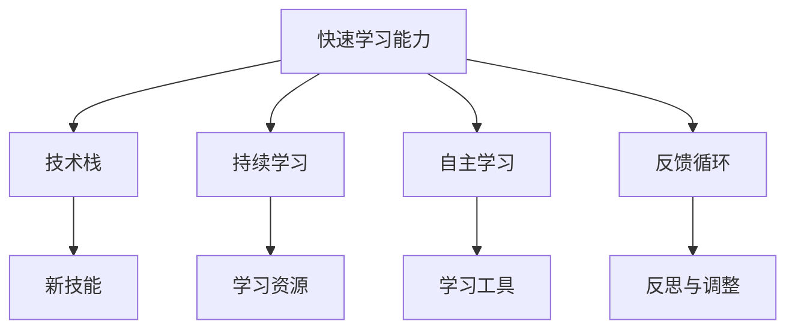

                 

# 管理者的快速学习能力培养

## 1. 背景介绍

### 1.1 问题由来

在快速变化的技术环境中，管理者面临的最大挑战之一是如何保持自己的竞争力和学习速度。互联网、云计算、大数据、人工智能等技术的迅猛发展，使得每个领域都在不断更新迭代，技术栈和最佳实践也在日新月异。管理者需要不断学习新的技术，以适应企业发展和市场变化的需求。然而，由于工作繁忙、时间紧张、学习资源匮乏等因素，管理者往往难以跟上技术发展的步伐。

### 1.2 问题核心关键点

为了解决这个问题，管理者需要培养快速学习新技能的能力。这意味着他们不仅要有持续学习的意愿，还要有高效学习方法，能够在有限的时间内掌握新技术、新知识。这种能力不仅能够帮助管理者更好地适应变化，还能促进企业创新和发展。

### 1.3 问题研究意义

培养管理者的快速学习能力，对提升企业的创新能力、竞争力以及员工满意度具有重要意义。通过快速学习新技术，管理者可以推动企业技术进步，缩短产品上市时间，提高客户满意度，从而增强市场竞争力。同时，快速学习能力的提升，也有助于管理者更好地理解技术趋势，制定更加科学合理的发展战略，促进企业的长期发展。

## 2. 核心概念与联系

### 2.1 核心概念概述

为了更好地理解管理者的快速学习能力培养，我们首先介绍几个关键概念：

- **快速学习能力(Fast Learning Capability)**：指管理者在有限的时间内快速掌握新技能的能力，包括学习能力、时间管理能力、信息处理能力等。
- **技术栈(Technology Stack)**：指某一领域或企业内部使用的所有技术工具和平台的集合，包括编程语言、框架、中间件、数据库等。
- **持续学习(Continuous Learning)**：指管理者持续不断地学习新知识、新技能，以适应技术变化和行业趋势的过程。
- **自主学习(Self-Learning)**：指管理者在缺乏正式教育或培训的情况下，依靠自主探索和实践，掌握新技能的方法。
- **反馈循环(Feedback Loop)**：指通过不断的实践、反思、调整，形成持续改进的循环，以提升学习效果的过程。

这些概念之间的逻辑关系可以通过以下Mermaid流程图来展示：



这个流程图展示了一个管理者快速学习能力的培养过程：

1. 从技术栈出发，快速学习新技术。
2. 通过持续学习和自主学习，不断更新知识。
3. 通过反馈循环，不断反思和调整学习策略，提升学习效果。

这些概念共同构成了管理者快速学习能力培养的框架，帮助他们更好地适应技术变化，提升企业竞争力。

## 3. 核心算法原理 & 具体操作步骤
### 3.1 算法原理概述

管理者的快速学习能力培养，本质上是基于认知心理学和教育学原理的。通过一系列有针对性的策略和工具，帮助管理者在有限的时间内高效地掌握新技能。以下是基于认知心理学和教育学原理的核心算法原理：

- **有效划分学习内容**：将复杂的学习任务划分为小而具体的学习单元，逐一突破。
- **建立反馈循环**：通过不断实践、反思和调整，形成持续改进的循环，提升学习效果。
- **使用间隔重复**：通过间隔重复的方式，巩固学习成果，提升记忆效率。
- **利用多重感官学习**：通过视觉、听觉、触觉等多种感官的参与，增强学习效果。
- **建立跨学科知识体系**：通过跨学科学习，形成更加全面的知识结构，提升问题解决能力。

### 3.2 算法步骤详解

以下是基于以上原理的具体操作步骤：

**Step 1: 确定学习目标**
- 明确学习目标：确定需要掌握的具体技能和知识，如新的编程语言、数据分析技术、敏捷开发方法等。
- 分解学习目标：将大目标分解为小目标，逐一突破。例如，学习Python语言，可以先从基础语法开始，再到高级特性和框架。

**Step 2: 选择合适的学习资源**
- 选择优质学习资源：包括在线课程、书籍、文档、视频等。选择适合自身学习风格的资源，如视频课程适合视觉学习者，交互式教程适合动手实践者。
- 创建学习计划：制定详细的学习计划，包括学习内容、时间安排和进度跟踪。使用工具如Google Calendar、Trello等进行规划。

**Step 3: 实践与反思**
- 实践操作：通过实际项目或模拟任务，将理论知识转化为实践技能。例如，学习数据分析技术，可以通过Kaggle等平台进行数据集竞赛，练习数据分析和可视化。
- 反思总结：定期反思学习过程和结果，总结经验教训，及时调整学习策略。例如，每周回顾学习进展，记录遇到的困难和解决方案，形成学习日记。

**Step 4: 应用与反馈**
- 应用实践：将所学技能应用到实际工作中，检验学习效果。例如，学习了敏捷开发方法，可以组织团队进行Scrum或Kanban实践，提升团队协作效率。
- 获取反馈：通过同事、上级和导师的反馈，了解学习效果和不足之处。例如，通过团队评审、项目回顾会等方式，获取有价值的反馈意见。

**Step 5: 持续改进**
- 持续学习：保持持续学习的习惯，定期更新和补充新知识。例如，订阅技术博客、参加技术社区活动，保持对新技术的敏感度。
- 改进优化：根据反馈和实践结果，不断改进和优化学习方法和工具，提升学习效率和效果。例如，调整学习计划，改进实践环境，优化学习工具等。

### 3.3 算法优缺点

基于以上算法的快速学习能力培养方法，具有以下优点：

- **高效性**：将复杂学习任务分解为小单元，逐一突破，可以大幅提升学习效率。
- **实用性**：通过实践和反思，将理论知识转化为实践技能，更加实用。
- **持续性**：建立反馈循环，不断改进和优化学习策略，形成持续改进的循环。

同时，该方法也存在一定的局限性：

- **个性化不足**：学习计划和资源选择可能不符合每个人的个性化需求，需要根据自身情况进行调整。
- **时间管理要求高**：需要良好的时间管理能力，避免因时间不足导致学习中断或效果不佳。
- **学习动力维持难**：需要较强的自律和毅力，长时间坚持可能存在难度。

尽管存在这些局限性，但就目前而言，基于以上算法的快速学习能力培养方法仍是大多数管理者快速学习新技术的有效途径。未来相关研究的重点在于如何进一步优化个性化学习路径，提升学习动力，同时兼顾时间管理等方面的挑战。

### 3.4 算法应用领域

基于快速学习能力培养的方法，可以在以下领域得到广泛应用：

- **企业技术创新**：管理者通过快速学习新技术，推动企业技术进步和产品创新，缩短产品上市时间，提高市场竞争力。
- **员工培训与发展**：管理者通过自身快速学习，引导和带动团队成员共同提升技能水平，促进团队整体能力的提升。
- **职业发展与转型**：管理者通过快速学习新技能，实现职业转型和进阶，适应职业发展的需要。
- **项目管理与优化**：管理者通过学习敏捷开发、Scrum等项目管理方法，提升项目管理效率和质量，实现项目目标。

除了上述这些领域，快速学习能力培养方法也可以应用于更多场景中，如市场调研、客户管理、品牌建设等，为管理者提供更全面的学习支持和职业发展指导。

## 4. 数学模型和公式 & 详细讲解  
### 4.1 数学模型构建

管理者的快速学习能力培养，可以通过数学模型来进一步量化和优化。假设一个管理者的学习效率为 $E$，学习目标为 $T$，学习周期为 $T_{\text{cycle}}$，学习资源为 $R$，学习效果为 $L$。则数学模型可以表示为：

$$
L = f(E, T, T_{\text{cycle}}, R)
$$

其中 $f$ 表示学习效果与各因素之间的函数关系。

### 4.2 公式推导过程

我们以学习Python语言为例，推导学习效果的数学模型。假设学习目标为掌握Python基础语法和数据分析库Pandas，学习周期为6个月，每天学习1小时，每天完成的学习内容为2小时视频课程和1小时编程练习。则学习效果的计算公式为：

$$
L = E \times (T_{\text{cycle}} \times 365) \times (1 - \frac{2}{T_{\text{cycle}} \times 365})
$$

其中 $E$ 为每天的学习效率，$T_{\text{cycle}}$ 为学习周期（天数），每天学习时间 $t = 1 + \frac{1}{2} = 1.5$ 小时。

### 4.3 案例分析与讲解

假设管理者的学习效率为 $E=0.8$，每天能够高效完成1小时的视频课程和1小时编程练习，则学习效果 $L$ 的计算如下：

$$
L = 0.8 \times (6 \times 365) \times (1 - \frac{2}{6 \times 365}) \approx 0.88 \times 6 \times 365 \approx 780
$$

这意味着在6个月内，通过高效的自学方法，管理者可以掌握Python基础语法和数据分析库Pandas，并在实际项目中加以应用。

## 5. 项目实践：代码实例和详细解释说明
### 5.1 开发环境搭建

在进行快速学习能力培养的项目实践前，我们需要准备好开发环境。以下是使用Python进行开发的环境配置流程：

1. 安装Anaconda：从官网下载并安装Anaconda，用于创建独立的Python环境。

2. 创建并激活虚拟环境：
```bash
conda create -n learning-env python=3.8 
conda activate learning-env
```

3. 安装必要的库：
```bash
conda install numpy pandas matplotlib jupyter notebook
```

完成上述步骤后，即可在`learning-env`环境中进行项目实践。

### 5.2 源代码详细实现

我们以学习Python基础语法和数据分析库Pandas为例，给出使用Jupyter Notebook进行实践的代码实现。

**第一步：创建学习计划**

创建一个名为`study_plan.ipynb`的Jupyter Notebook，记录学习计划。例如：

```python
# study_plan.ipynb

import numpy as np

# 定义学习目标和周期
target = 'Python基础语法'
cycle = 6  # 学习周期，以月为单位

# 定义每天学习时间和内容
daily_hours = 2.5  # 每天学习时间，包括视频课程和编程练习
day_count = np.floor(cycle * 365)  # 学习周期内的天数

# 计算每天完成的学习内容和效果
daily_content = daily_hours
daily_effect = 1 - (daily_content / day_count)

# 计算总学习效果
total_effect = daily_effect * day_count

# 输出学习效果
print(f"学习目标：{target}")
print(f"学习周期：{cycle}个月")
print(f"每天学习时间：{daily_hours}小时")
print(f"学习效果：{total_effect:.2f}")
```

**第二步：实践操作**

创建一个名为`python_practice.ipynb`的Jupyter Notebook，进行Python编程练习。例如：

```python
# python_practice.ipynb

import pandas as pd

# 读取数据集
data = pd.read_csv('data.csv')

# 数据探索和处理
# 数据清洗、特征工程、数据可视化等

# 数据分析和建模
# 数据探索、统计分析、机器学习模型等

# 结果展示
# 数据可视化、模型评估、结果解释等
```

**第三步：反思总结**

创建一个名为`reflection.ipynb`的Jupyter Notebook，记录学习过程中的反思和总结。例如：

```python
# reflection.ipynb

# 记录学习过程和经验
# 总结遇到的问题和解决方案
# 反思学习效果和不足之处
# 提出下一步改进计划

# 输出反思内容
print("学习反思：")
print("1. 遇到的困难：")
print("2. 解决方案：")
print("3. 学习效果：")
print("4. 下一步改进计划：")
```

### 5.3 代码解读与分析

让我们再详细解读一下关键代码的实现细节：

**study_plan.ipynb**：
- 定义学习目标和周期
- 计算每天的学习内容和效果
- 计算总学习效果

**python_practice.ipynb**：
- 使用Pandas库进行数据读取、处理和分析
- 实现数据探索、特征工程、模型训练和结果展示等步骤

**reflection.ipynb**：
- 记录学习过程中的反思和总结
- 输出反思内容

通过这些代码实现，可以系统地规划和执行学习计划，逐步提升学习效果。

## 6. 实际应用场景
### 6.1 企业技术创新

管理者通过快速学习新技术，推动企业技术进步和产品创新，缩短产品上市时间，提高市场竞争力。例如，某科技公司高层管理者通过自学区块链技术，指导团队开发并上线了基于区块链的供应链管理系统，提高了供应链透明度和效率，受到了市场的高度认可。

### 6.2 员工培训与发展

管理者通过自身快速学习，引导和带动团队成员共同提升技能水平，促进团队整体能力的提升。例如，某互联网公司人力资源部门主管通过自学数据分析技术，开发了员工绩效分析系统，帮助公司更科学地评估员工表现，优化人才结构，提高了人力资源管理效率。

### 6.3 职业发展与转型

管理者通过学习新技能，实现职业转型和进阶，适应职业发展的需要。例如，某金融行业高管通过自学机器学习技术，成功转型为数据科学家，在新的岗位上发挥了更大的价值。

### 6.4 项目管理与优化

管理者通过学习敏捷开发、Scrum等项目管理方法，提升项目管理效率和质量，实现项目目标。例如，某软件开发项目经理通过自学Scrum方法，成功推动项目团队实现敏捷转型，提高了项目交付速度和质量。

## 7. 工具和资源推荐
### 7.1 学习资源推荐

为了帮助管理者系统掌握快速学习新技术的方法，这里推荐一些优质的学习资源：

1. **Coursera和edX**：提供大量在线课程，涵盖编程、数据分析、项目管理等多个领域，通过视频和互动的方式帮助管理者掌握新知识。

2. **Udemy和Skillshare**：提供大量实用教程和实战项目，通过实践操作帮助管理者快速提升技能水平。

3. **GitHub和Stack Overflow**：提供大量的开源项目和代码示例，帮助管理者通过动手实践学习新技术。

4. **LinkedIn Learning**：提供大量的职场技能培训课程，帮助管理者提升项目管理、团队协作、领导力等职场软技能。

5. **Kaggle**：提供大量的数据集和机器学习竞赛，帮助管理者通过实际项目练习和验证学习效果。

通过对这些资源的学习实践，相信管理者一定能够快速掌握新技能，不断提升自身竞争力。

### 7.2 开发工具推荐

高效的开发离不开优秀的工具支持。以下是几款用于快速学习能力培养的常用工具：

1. **Anaconda**：用于创建和管理Python虚拟环境，方便安装和管理各种Python库。

2. **Jupyter Notebook**：强大的交互式开发环境，支持代码编写、数据可视化、项目展示等，适合进行数据探索和编程练习。

3. **Google Calendar**：时间管理工具，帮助管理者规划和管理时间，确保高效学习。

4. **Trello**：项目管理工具，帮助管理者制定学习计划和跟踪进度，保持学习的连续性和纪律性。

5. **Kaggle**：数据科学竞赛平台，提供大量的数据集和比赛，帮助管理者通过实战练习提升技能。

6. **LinkedIn Learning**：职业培训平台，提供大量的职场技能培训课程，帮助管理者提升职场软技能。

合理利用这些工具，可以显著提升管理者的学习效率和效果，加快创新迭代的步伐。

### 7.3 相关论文推荐

快速学习能力培养的研究涉及认知心理学、教育学、神经科学等多个领域，以下是几篇具有代表性的相关论文，推荐阅读：

1. **《The Learning Curve》**：探讨了学习过程中的心理变化和策略调整，提供了有效的学习技巧和工具。

2. **《Spaced Repetition System》**：介绍了间隔重复算法（SRS），通过科学的复习策略提高记忆效率。

3. **《Learning to Learn》**：由深度学习专家Ted Dunning所著，提供了系统性的学习方法和工具，帮助读者提升学习能力。

4. **《Learning by Doing》**：探讨了通过实践和反思学习新技能的有效方法，提出了多重感官学习和反馈循环等策略。

5. **《Mindshift》**：由教育心理学家Harold Smith所著，提供了转变思维方式和学习方法，提升快速学习能力。

这些论文代表了大规模学习能力培养的理论前沿，通过学习这些前沿成果，可以帮助管理者把握学科前进方向，激发更多的创新灵感。

## 8. 总结：未来发展趋势与挑战
### 8.1 总结

本文对管理者的快速学习能力培养进行了全面系统的介绍。首先阐述了快速学习在管理者学习新技术中的重要性，明确了快速学习能力培养的目标和意义。其次，从原理到实践，详细讲解了快速学习的核心算法和操作步骤，给出了快速学习项目实践的完整代码实现。同时，本文还广泛探讨了快速学习能力培养在企业技术创新、员工培训、职业发展、项目管理等多个领域的实际应用，展示了快速学习能力培养的广泛应用前景。此外，本文精选了快速学习能力培养的各类学习资源，力求为管理者提供全方位的学习支持。

通过本文的系统梳理，可以看到，快速学习能力培养是管理者掌握新技能、提升自身竞争力的重要手段。通过有效的学习方法和工具，管理者可以更好地适应技术变化，推动企业技术进步，实现职业发展和企业创新。未来，伴随学习资源和工具的不断优化，快速学习能力培养必将成为管理者快速学习新技术的重要途径。

### 8.2 未来发展趋势

展望未来，快速学习能力培养技术将呈现以下几个发展趋势：

1. **个性化学习路径**：通过大数据和人工智能技术，分析管理者的学习习惯和需求，推荐个性化的学习资源和路径。

2. **智能学习系统**：开发智能学习系统，通过学习分析和管理，提升学习效果和效率。例如，智能推荐系统可以根据学习者的进度和反馈，动态调整学习计划和内容。

3. **混合学习模式**：结合在线学习、线下培训、自主学习等多种学习方式，形成灵活多变的学习模式。例如，通过在线学习掌握基础知识，再参加线下工作坊进行深度交流和实战练习。

4. **跨学科学习**：通过跨学科学习，形成更加全面的知识结构，提升问题解决能力。例如，学习编程的同时，了解数据科学、人工智能等领域的知识。

5. **终身学习**：将快速学习能力培养融入职业生涯的每一个阶段，形成持续学习和自我提升的习惯。

6. **技术辅助学习**：开发和应用各类辅助学习工具，如虚拟现实、增强现实、智能导师等，提升学习体验和效果。

以上趋势凸显了快速学习能力培养技术的广阔前景。这些方向的探索发展，必将进一步提升管理者的学习效率和效果，为企业的技术进步和创新提供有力支持。

### 8.3 面临的挑战

尽管快速学习能力培养技术已经取得了显著进展，但在迈向更加智能化、普适化应用的过程中，仍面临诸多挑战：

1. **个性化需求难以满足**：每个人的学习习惯和需求不同，个性化学习路径的设计和推荐仍需进一步优化。

2. **学习动力维持难**：长期坚持高效学习需要较强的自律和毅力，如何激发和维持学习动力，还需要更多心理学和行为学研究的支撑。

3. **学习资源分散**：学习资源分散在不同的平台和渠道，如何整合和管理这些资源，形成统一的学习体系，仍需进一步探索。

4. **技术工具复杂性高**：各类学习工具和平台功能丰富，使用复杂，如何简化工具使用，提升用户体验，还需要进一步优化。

5. **学习效果评估难**：如何科学评估学习效果，量化学习成果，形成反馈循环，还需要更多实验和研究的支持。

6. **学习资源质量参差不齐**：市场上存在大量的学习资源，如何筛选和选择高质量资源，还需要进一步标准化和规范化的机制。

这些挑战需要学界和产业界的共同努力，不断创新和优化快速学习能力培养的方法和工具，才能更好地支持管理者的快速学习需求。

### 8.4 研究展望

面向未来，快速学习能力培养技术需要在以下几个方面寻求新的突破：

1. **智能化学习系统的开发**：开发智能化的学习系统，通过大数据和人工智能技术，实现个性化学习路径推荐、智能反馈和学习效果评估。

2. **混合学习模式的探索**：结合在线学习、线下培训、自主学习等多种学习方式，形成灵活多变的学习模式，提升学习效果和效率。

3. **跨学科学习的方法**：通过跨学科学习，形成更加全面的知识结构，提升问题解决能力和创新能力。

4. **技术辅助学习的创新**：开发和应用各类辅助学习工具，如虚拟现实、增强现实、智能导师等，提升学习体验和效果。

5. **学习动力的激发和维持**：通过游戏化、竞赛化等方法，激发和维持管理者的学习动力，提升学习效果。

6. **学习资源的整合和管理**：整合和管理各类学习资源，形成统一的学习体系，提升学习效率和效果。

这些研究方向的探索，必将引领快速学习能力培养技术迈向更高的台阶，为管理者的快速学习提供更全面、更高效的支持。面向未来，快速学习能力培养技术还需要与其他人工智能技术进行更深入的融合，如认知计算、增强学习、知识图谱等，多路径协同发力，共同推动管理者的快速学习。

## 9. 附录：常见问题与解答

**Q1：快速学习能力培养是否适用于所有管理者？**

A: 快速学习能力培养方法适用于大多数管理者，尤其是那些有强烈学习意愿和自我管理能力的管理者。但对于一些基础薄弱或时间紧张的管理者，需要根据自身情况进行调整和优化。

**Q2：如何选择合适的学习资源？**

A: 选择适合自身学习风格和需求的学习资源，例如视频课程、互动教程、实战项目等。可以通过初步试用、阅读评价等方式进行筛选和选择。

**Q3：如何快速提升学习效果？**

A: 通过有效的学习策略和工具，如间隔重复、多重感官学习、反馈循环等，可以显著提升学习效果。同时，结合实践操作和反思总结，将理论知识转化为实践技能，进一步提升学习效果。

**Q4：如何保持学习动力？**

A: 制定合理的学习计划，设定阶段性目标，逐步实现。通过与同事或导师分享学习进展，获取反馈和鼓励，保持学习动力。同时，设定奖励机制，如完成一个学习阶段后奖励自己小礼物，激励自己持续学习。

**Q5：如何快速应对技术变化？**

A: 保持持续学习的习惯，关注行业动态和技术趋势，定期更新和补充新知识。加入技术社区和专业组织，与同行交流和分享，提升对新技术的敏感度。

这些问题的解答，帮助管理者更好地理解快速学习能力培养的方法和技巧，提升自身学习效果和能力。通过不断学习和实践，管理者可以更好地适应技术变化，推动企业创新和发展。

---

作者：禅与计算机程序设计艺术 / Zen and the Art of Computer Programming

