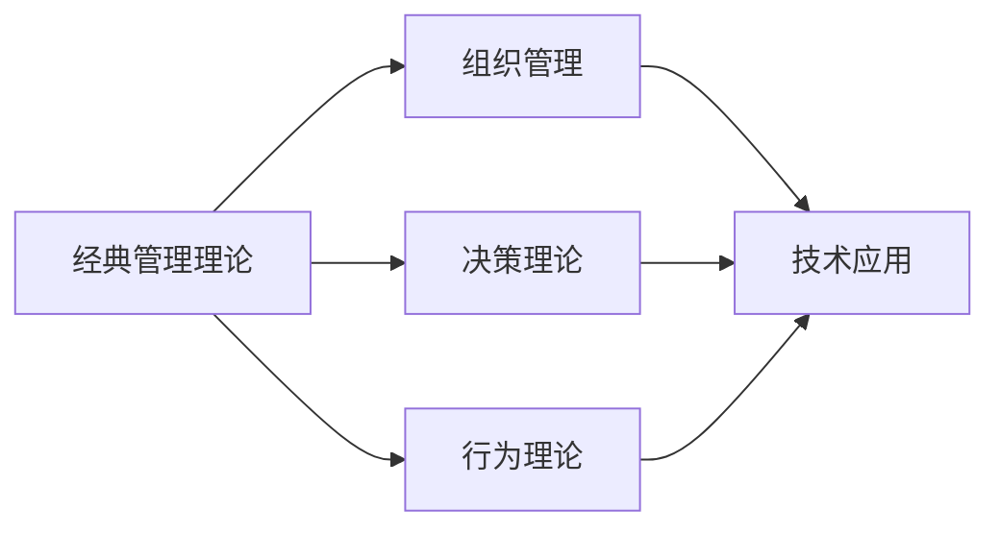

                 

# 经典管理理论的现代应用

> 关键词：经典管理理论,现代应用,组织管理,决策理论,行为理论,技术应用

## 1. 背景介绍

### 1.1 问题由来

自20世纪初以来，经典管理理论经历了多次重大变革，从泰勒的科学管理理论到马斯洛的需求层次理论，从韦伯的行政组织理论到波特的五力模型，从SWOT分析到OKR(目标与关键结果)方法论，这些理论极大地推动了组织管理和运营效率的提升。然而，随着互联网、人工智能、大数据等新兴技术的发展，企业面临的市场环境和竞争格局发生了深刻变化，经典管理理论在实践中的适用性和有效性也面临着挑战。如何在数字化、智能化的新时代中，充分利用和更新经典管理理论，推动企业的持续发展和创新，成为当前管理实践中的重要课题。

### 1.2 问题核心关键点

- **经典管理理论与现代技术的融合**：如何将经典管理理论的核心思想与现代信息技术结合起来，提升企业的决策效率、组织协同和员工管理。
- **知识与信息管理**：如何在信息爆炸的时代，有效地管理组织内部和外部的知识与信息，支持企业的战略制定和运营决策。
- **数据驱动的决策**：如何基于大数据和人工智能技术，实现数据驱动的决策支持，提高企业的反应速度和竞争力。
- **灵活的组织结构**：如何在敏捷、协作和动态变化的组织环境中，构建灵活高效的组织结构，适应市场变化。
- **人性化管理**：如何平衡技术和人文关怀，实现员工的自我实现和企业的可持续发展。

### 1.3 问题研究意义

经典管理理论的现代应用不仅有助于企业应对数字化转型的挑战，还能通过理论的创新和实践的探索，推动管理科学的发展。具体而言，研究经典管理理论的现代应用具有以下意义：

- **提升决策效率**：通过数据驱动和人工智能技术，加速决策过程，提升企业的市场反应速度和决策质量。
- **优化组织管理**：利用信息技术工具和系统，支持组织的协同工作和动态管理，实现效率和灵活性的平衡。
- **促进员工发展**：通过智能化的培训和职业发展规划，支持员工的成长和自我实现，提升员工满意度和忠诚度。
- **增强竞争力**：在信息时代，经典管理理论的现代应用能够帮助企业在复杂多变的市场环境中，保持竞争优势。
- **推动管理科学发展**：通过理论与实践的结合，不断探索和创新，推动管理科学理论的发展。

## 2. 核心概念与联系

### 2.1 核心概念概述

为了更好地理解经典管理理论的现代应用，我们需要对相关的核心概念进行梳理：

- **经典管理理论**：包括泰勒的科学管理理论、韦伯的行政组织理论、马斯洛的需求层次理论、波特的五力模型、SWOT分析等。这些理论构成了现代企业管理的基础。
- **现代信息技术**：如云计算、大数据、人工智能、物联网等，这些技术为企业的管理实践提供了强大的工具和平台。
- **组织管理**：包括组织结构设计、人力资源管理、绩效管理、战略规划等。
- **决策理论**：研究决策过程、决策模型和决策支持系统，支持企业的高效决策。
- **行为理论**：研究人类行为、组织行为、激励机制等，支持员工的有效管理和团队协作。
- **技术应用**：将管理理论通过信息技术工具和系统，应用于企业的实际运营和管理中。

这些概念之间的逻辑关系可以通过以下Mermaid流程图来展示：



这个流程图展示了几大核心概念之间的联系：

1. **经典管理理论**对**组织管理、决策理论、行为理论**提供了理论基础。
2. **现代信息技术**为**组织管理、决策理论、行为理论**的实践提供了技术支持。
3. **技术应用**将**经典管理理论**与**现代信息技术**相结合，具体应用于企业的管理实践。

## 3. 核心算法原理 & 具体操作步骤

### 3.1 算法原理概述

经典管理理论的现代应用，其核心在于将经典管理理论的核心思想与现代信息技术结合起来，提升企业的管理效率和运营水平。其基本原理可以总结如下：

- **数据驱动的决策**：利用大数据和人工智能技术，分析市场环境、内部运营和外部因素，支持企业的战略制定和决策。
- **基于模型的管理**：通过数学模型和仿真模拟，优化组织结构和流程，提升运营效率和灵活性。
- **智能化的员工管理**：应用人工智能技术，进行员工的技能评估、职业发展规划和行为分析，支持员工成长和组织协同。
- **敏捷的组织结构**：通过敏捷开发和流程管理工具，构建灵活的组织结构，适应市场的动态变化。

### 3.2 算法步骤详解

经典管理理论的现代应用主要包括以下几个关键步骤：

**Step 1: 数据收集与预处理**

- 收集企业的内部运营数据、市场环境数据、员工行为数据等。
- 对数据进行清洗、去重、转换等预处理操作，确保数据的准确性和一致性。

**Step 2: 数据建模与分析**

- 利用统计学、机器学习等技术，建立数据模型，分析企业的运营状况、市场趋势和员工行为。
- 应用经典管理理论的核心思想，如波特的五力模型、SWOT分析等，对数据进行深层次的分析和解读。

**Step 3: 决策支持与优化**

- 根据数据建模和分析的结果，利用决策树、优化算法等技术，制定企业的战略和运营策略。
- 应用经典管理理论的方法，如行动计划、优先级排序、风险评估等，指导决策的实施和优化。

**Step 4: 组织管理与协同**

- 利用信息技术工具和系统，如ERP、CRM、协同办公平台等，支持企业的日常运营和组织协同。
- 应用经典管理理论的组织结构设计原则，如职能部门划分、团队协作机制等，优化组织结构。

**Step 5: 员工管理与激励**

- 利用人工智能技术，进行员工的技能评估、职业发展规划和行为分析。
- 应用经典管理理论的激励机制和绩效管理方法，提升员工的满意度和忠诚度。

### 3.3 算法优缺点

经典管理理论的现代应用具有以下优点：

1. **高效决策**：利用数据驱动和人工智能技术，加快决策过程，提升企业的市场反应速度和决策质量。
2. **灵活管理**：通过信息技术工具和系统，支持组织的协同工作和动态管理，实现效率和灵活性的平衡。
3. **员工成长**：通过智能化的培训和职业发展规划，支持员工的成长和自我实现，提升员工满意度和忠诚度。
4. **竞争优势**：在信息时代，经典管理理论的现代应用能够帮助企业在复杂多变的市场环境中，保持竞争优势。

同时，该方法也存在一定的局限性：

1. **技术依赖**：信息技术工具和系统的引入，增加了企业的技术投入和管理复杂度。
2. **数据质量**：数据的质量和准确性直接影响分析结果和决策效果，需要投入大量资源进行数据清洗和预处理。
3. **组织文化**：经典管理理论的现代应用需要企业具备一定的技术接受能力和文化氛围。
4. **人员素质**：信息技术工具的使用需要企业员工具备一定的技术技能和应用能力。
5. **风险管理**：信息技术的应用可能带来信息安全和隐私保护等风险，需要企业具备相应的技术和管理措施。

### 3.4 算法应用领域

经典管理理论的现代应用，已经广泛应用于以下几个领域：

- **金融行业**：通过大数据和人工智能技术，支持金融产品的设计和风险评估，提升投资决策的科学性和准确性。
- **制造业**：利用智能制造和工业互联网，优化生产流程和管理，提升制造效率和产品质量。
- **零售行业**：通过消费者行为分析和市场预测，优化库存管理和促销策略，提升销售业绩和客户满意度。
- **医疗健康**：利用医疗大数据和人工智能技术，支持临床决策和疾病预测，提升医疗服务的质量和效率。
- **公共服务**：通过公共数据和人工智能技术，优化公共服务流程和资源分配，提升公共服务的质量和效率。

## 4. 数学模型和公式 & 详细讲解 & 举例说明

### 4.1 数学模型构建

经典管理理论的现代应用，其数学模型构建主要基于经典管理理论和现代信息技术相结合。以下是几个常见的数学模型构建案例：

- **数据驱动的决策模型**：通过数据收集、清洗、预处理，建立决策树、逻辑回归等模型，支持企业的战略制定和运营决策。
- **基于模型的组织管理模型**：利用线性规划、网络流等数学模型，优化组织结构和流程，提升运营效率和灵活性。
- **员工管理与激励模型**：通过行为分析、绩效评估等模型，支持员工的成长和组织协同。

### 4.2 公式推导过程

以下是几个常见数学模型的公式推导过程：

#### 决策树模型

决策树模型用于支持企业的战略制定和运营决策，其基本公式如下：

$$
P(Y|X) = \sum_{i=1}^{n} P(Y|X_i)P(X_i)
$$

其中 $P(Y|X)$ 表示在特征 $X$ 下，目标 $Y$ 的条件概率，$n$ 表示特征的种类，$P(Y|X_i)$ 和 $P(X_i)$ 分别表示特征 $X_i$ 和目标 $Y$ 的先验概率。

#### 线性规划模型

线性规划模型用于优化企业的运营流程和资源分配，其基本公式如下：

$$
\max_{x} c^T x
$$

$$
s.t. A^T x \leq b, x \geq 0
$$

其中 $c$ 表示目标函数系数，$A$ 和 $b$ 表示约束条件，$x$ 表示决策变量。

### 4.3 案例分析与讲解

以下是一个利用经典管理理论的现代应用进行实际操作的案例：

**案例：某零售企业基于经典管理理论的现代应用**

某零售企业通过经典管理理论的现代应用，提升其运营效率和市场反应速度。具体步骤如下：

1. **数据收集与预处理**：
   - 收集企业的销售数据、库存数据、客户反馈数据等。
   - 对数据进行清洗、去重、转换等预处理操作，确保数据的准确性和一致性。

2. **数据建模与分析**：
   - 利用机器学习技术，建立销售预测模型，分析市场趋势和客户需求。
   - 应用波特的五力模型，分析企业的市场竞争环境和优势劣势。

3. **决策支持与优化**：
   - 根据预测模型和五力模型的分析结果，制定库存管理策略和促销策略。
   - 应用线性规划模型，优化供应链和物流流程，提升运营效率。

4. **组织管理与协同**：
   - 利用ERP系统，支持日常运营和供应链管理。
   - 设计扁平化的组织结构，提升组织协同和决策速度。

5. **员工管理与激励**：
   - 利用行为分析技术，评估员工的工作表现和职业发展规划。
   - 应用绩效管理方法，提升员工满意度和忠诚度。

通过上述步骤，该零售企业成功提升了其运营效率和市场竞争力，实现了经典管理理论的现代应用。

## 5. 项目实践：代码实例和详细解释说明

### 5.1 开发环境搭建

在进行经典管理理论的现代应用实践前，我们需要准备好开发环境。以下是使用Python进行经典管理理论现代应用的环境配置流程：

1. 安装Anaconda：从官网下载并安装Anaconda，用于创建独立的Python环境。

2. 创建并激活虚拟环境：
```bash
conda create -n classic-management python=3.8 
conda activate classic-management
```

3. 安装相关Python包：
```bash
pip install pandas numpy scikit-learn matplotlib pydot scikit-optimize
```

4. 安装经典管理理论相关包：
```bash
pip install pymswot
pip install scikit-learn-learn-plotting
```

5. 安装决策树、线性规划等算法库：
```bash
pip install scikit-learn
```

完成上述步骤后，即可在`classic-management`环境中开始项目实践。

### 5.2 源代码详细实现

下面我们以基于决策树模型的销售预测为例，给出使用Python进行经典管理理论现代应用的具体代码实现。

首先，定义数据处理函数：

```python
import pandas as pd
from sklearn.preprocessing import StandardScaler
from sklearn.model_selection import train_test_split
from sklearn.tree import DecisionTreeRegressor
from sklearn.metrics import mean_squared_error

def load_data(path):
    data = pd.read_csv(path)
    features = ['feature1', 'feature2', 'feature3', ...]
    target = 'target'
    features_train, features_test, target_train, target_test = train_test_split(data[features], data[target], test_size=0.2, random_state=42)
    scaler = StandardScaler()
    features_train = scaler.fit_transform(features_train)
    features_test = scaler.transform(features_test)
    return features_train, features_test, target_train, target_test

def train_model(features_train, target_train):
    model = DecisionTreeRegressor()
    model.fit(features_train, target_train)
    return model
```

然后，定义评估函数：

```python
def evaluate_model(model, features_test, target_test):
    predictions = model.predict(features_test)
    mse = mean_squared_error(target_test, predictions)
    print(f'Mean Squared Error: {mse:.2f}')
```

最后，启动训练和评估流程：

```python
features_train, features_test, target_train, target_test = load_data('sales_data.csv')
model = train_model(features_train, target_train)
evaluate_model(model, features_test, target_test)
```

以上就是使用Python对决策树模型进行销售预测的具体代码实现。可以看到，在经典管理理论的现代应用中，Python和Scikit-learn等库提供了丰富的机器学习工具，可以方便地实现各类经典管理理论的应用。

### 5.3 代码解读与分析

让我们再详细解读一下关键代码的实现细节：

**load_data函数**：
- 定义了数据加载和预处理的过程。使用`pandas`库加载数据，将特征和目标分开，并进行标准化处理。

**train_model函数**：
- 定义了决策树模型的训练过程。利用`DecisionTreeRegressor`类进行模型训练，并返回训练好的模型。

**evaluate_model函数**：
- 定义了模型的评估过程。计算模型在测试集上的均方误差，并输出结果。

**训练流程**：
- 使用`load_data`函数加载数据，并将数据分为训练集和测试集。
- 使用`train_model`函数训练模型，得到训练好的模型。
- 使用`evaluate_model`函数评估模型性能，输出评估结果。

可以看到，Python和相关库提供了便捷的工具和函数，使得经典管理理论的现代应用开发变得高效且易于实现。

## 6. 实际应用场景

### 6.1 智能制造

经典管理理论的现代应用在智能制造领域具有重要应用价值。通过智能制造和工业互联网，优化生产流程和管理，提升制造效率和产品质量。

在智能制造中，经典管理理论的应用主要包括以下几个方面：

- **精益生产**：应用精益管理理论，优化生产流程，减少浪费，提升生产效率。
- **质量管理**：应用质量管理理论，进行质量控制和改进，提升产品质量。
- **供应链管理**：应用供应链管理理论，优化供应链和物流流程，提升供应链效率。

### 6.2 金融风险管理

金融行业是经典管理理论现代应用的重要领域。通过大数据和人工智能技术，支持金融产品的设计和风险评估，提升投资决策的科学性和准确性。

在金融风险管理中，经典管理理论的应用主要包括以下几个方面：

- **风险评估**：应用波特的五力模型，分析企业的市场竞争环境和优势劣势，评估金融产品的风险。
- **投资决策**：应用决策树模型，分析市场趋势和投资机会，制定投资策略。
- **市场预测**：应用线性规划模型，优化资产配置和投资组合，提升投资回报。

### 6.3 人力资源管理

人力资源管理是经典管理理论现代应用的重要应用领域。通过人工智能技术，进行员工的技能评估、职业发展规划和行为分析，支持员工成长和组织协同。

在人力资源管理中，经典管理理论的应用主要包括以下几个方面：

- **员工评估**：应用行为分析技术，评估员工的工作表现和职业发展规划。
- **培训管理**：应用绩效管理方法，提升员工满意度和忠诚度。
- **组织协同**：应用敏捷开发和流程管理工具，支持组织的协同工作和动态管理。

## 7. 工具和资源推荐

### 7.1 学习资源推荐

为了帮助开发者系统掌握经典管理理论的现代应用，这里推荐一些优质的学习资源：

1. **经典管理理论课程**：如《管理学》、《组织行为学》等，帮助理解经典管理理论的核心思想和应用。
2. **现代信息技术课程**：如《大数据技术与应用》、《人工智能基础》等，帮助掌握现代信息技术的工具和应用。
3. **经典管理理论现代应用案例集**：收集和分析经典管理理论在现代企业中的成功应用案例，帮助理解和应用经典管理理论。
4. **经典管理理论书籍**：如《管理科学与工程基础》、《组织与管理行为》等，深入讲解经典管理理论的应用方法和案例。
5. **经典管理理论现代应用博客**：如《哈佛商业评论》、《管理之道》等，提供最新的研究和实践动态。

通过对这些资源的学习实践，相信你一定能够快速掌握经典管理理论的现代应用，并用于解决实际的业务问题。

### 7.2 开发工具推荐

高效的开发离不开优秀的工具支持。以下是几款用于经典管理理论现代应用开发的常用工具：

1. **Python**：作为经典管理理论现代应用开发的主要语言，Python提供了丰富的库和框架，支持数据分析、机器学习和模型开发。
2. **R**：作为数据科学领域的重要工具，R提供了强大的数据分析和统计功能，支持经典管理理论的应用和分析。
3. **Jupyter Notebook**：作为数据科学和机器学习的常用开发环境，Jupyter Notebook支持代码编写、数据可视化和互动分析，方便开发者进行实验和演示。
4. **PyCharm**：作为Python的集成开发环境，PyCharm提供了丰富的功能和插件，支持Python语言的开发、调试和测试。
5. **Visual Studio Code**：作为跨平台的轻量级开发环境，Visual Studio Code支持Python、R等多种语言，提供了强大的代码编辑和调试功能。

合理利用这些工具，可以显著提升经典管理理论现代应用开发的效率和质量。

### 7.3 相关论文推荐

经典管理理论的现代应用源于学界的持续研究。以下是几篇奠基性的相关论文，推荐阅读：

1. **《经典管理理论的现代应用》**：探讨了经典管理理论在现代企业中的应用方法和案例，提供了丰富的实践经验。
2. **《基于经典管理理论的现代应用》**：详细分析了经典管理理论的核心思想和现代技术的应用结合，提供了系统的方法和工具。
3. **《经典管理理论在金融行业的应用》**：研究了经典管理理论在金融风险管理中的应用，提供了数据驱动的决策支持方法。
4. **《经典管理理论在人力资源管理中的应用》**：探讨了经典管理理论在人力资源管理中的应用，提供了员工评估和激励的模型和方法。

这些论文代表了大管理理论现代应用的研究脉络。通过学习这些前沿成果，可以帮助研究者把握学科前进方向，激发更多的创新灵感。

## 8. 总结：未来发展趋势与挑战

### 8.1 总结

本文对经典管理理论的现代应用进行了全面系统的介绍。首先阐述了经典管理理论的核心思想和现代信息技术的应用背景，明确了现代应用在企业运营和决策支持中的重要价值。其次，从原理到实践，详细讲解了经典管理理论的现代应用过程，提供了完整的代码实例和详细解释。同时，本文还广泛探讨了现代应用在多个行业领域的应用前景，展示了其广阔的潜在价值。此外，本文精选了现代应用的学习资源，力求为读者提供全方位的技术指引。

通过本文的系统梳理，可以看到，经典管理理论的现代应用在数字化、智能化的新时代中，具有强大的生命力和应用潜力。这些理论的核心思想与现代信息技术相结合，为企业的管理实践提供了新的工具和方法，推动了组织运营的效率和灵活性提升，支持了企业的持续发展和创新。

### 8.2 未来发展趋势

展望未来，经典管理理论的现代应用将呈现以下几个发展趋势：

1. **数据驱动的决策**：随着大数据和人工智能技术的普及，数据驱动的决策将成为企业管理的重要手段，提升决策的速度和质量。
2. **智能化的员工管理**：人工智能技术的应用将进一步深化员工管理，支持员工的成长和职业发展规划。
3. **灵活的组织结构**：敏捷开发和流程管理工具的普及，将推动组织结构的灵活化和动态化，适应市场变化。
4. **多模态管理**：经典管理理论的现代应用将拓展到视觉、语音、社交等多模态数据，提升企业的综合管理和决策能力。
5. **伦理和责任管理**：随着企业的社会责任和伦理管理的重视，经典管理理论的现代应用也将注重伦理和责任的管理。

以上趋势凸显了经典管理理论现代应用的广阔前景。这些方向的探索发展，将进一步提升企业管理效率和运营水平，推动管理科学的发展。

### 8.3 面临的挑战

尽管经典管理理论的现代应用已经取得了显著成效，但在迈向更加智能化、普适化应用的过程中，仍面临诸多挑战：

1. **数据质量问题**：经典管理理论的应用依赖高质量的数据，数据收集和预处理的过程可能面临数据缺失、噪声等问题，需要投入大量资源进行数据清洗和质量提升。
2. **模型复杂性**：现代应用中涉及的数学模型和算法复杂度较高，模型的选择和调参过程可能较复杂，需要具备较强的技术能力。
3. **技术实施成本**：现代信息技术工具和系统的引入，增加了企业的技术投入和管理复杂度，需要平衡技术实施成本和应用效果。
4. **组织文化适应**：经典管理理论的现代应用需要企业具备一定的技术接受能力和文化氛围，如何在组织内部推广和实施，是一个重要的挑战。
5. **人员素质提升**：信息技术工具的使用需要企业员工具备一定的技术技能和应用能力，如何提升员工的素质和技能，是企业实施现代应用的重要保障。

### 8.4 研究展望

未来经典管理理论的现代应用研究，需要在以下几个方面寻求新的突破：

1. **数据治理**：加强数据治理和数据质量管理，建立健全的数据收集、清洗和应用流程，提升数据质量和应用效果。
2. **模型自动化**：开发自动化模型选择和调参工具，降低模型复杂性，提高模型的可操作性和应用效率。
3. **技术集成**：将经典管理理论与先进的信息技术和工具进行集成，支持企业的多模态管理和智能决策。
4. **伦理和社会责任**：在模型开发和应用过程中，注重伦理和责任管理，确保技术应用的合规性和社会责任。
5. **员工培训和支持**：提升员工的数字化和智能化技能，提供持续的技术培训和支持，确保员工的适应和应用。

通过这些研究方向的探索和突破，经典管理理论的现代应用将能够更好地支持企业的管理实践，推动企业的持续发展和创新。

## 9. 附录：常见问题与解答

**Q1：经典管理理论的现代应用是否适用于所有企业？**

A: 经典管理理论的现代应用在大多数企业中都能取得不错的效果，特别是对于数据和信息技术基础较好的企业。但对于一些传统制造业、农业等企业，可能面临技术接受能力和文化氛围不足的问题。需要根据企业的具体情况，选择适当的技术和方法。

**Q2：经典管理理论的现代应用是否需要大量的数据和计算资源？**

A: 经典管理理论的现代应用对数据和计算资源的需求较高，特别是在大数据和人工智能技术的应用中。需要投入大量的数据收集、清洗和预处理工作，以及计算资源的配置和管理。但随着技术的进步和算力的提升，这一需求也在逐渐降低。

**Q3：经典管理理论的现代应用如何与企业的战略目标相结合？**

A: 经典管理理论的现代应用需要与企业的战略目标相结合，明确应用的场景和目标。例如，在智能制造中，可以将精益生产、质量管理和供应链管理等经典管理理论的核心思想与信息化工具相结合，支持企业的智能化转型和升级。在金融行业，可以通过数据驱动和人工智能技术，支持风险评估、投资决策和市场预测等战略目标。

**Q4：经典管理理论的现代应用是否适用于跨领域的企业？**

A: 经典管理理论的现代应用具有很强的跨领域适用性，可以应用于多个行业和企业。例如，经典管理理论在人力资源管理中的应用，可以支持不同行业企业的员工管理和发展，提升员工的满意度和忠诚度。在智能制造中，可以应用经典管理理论的精益生产、质量管理和供应链管理等思想，提升企业的运营效率和市场竞争力。

**Q5：经典管理理论的现代应用是否需要企业的全员参与？**

A: 经典管理理论的现代应用需要企业的全员参与，包括管理层、中层和基层员工。需要培训员工使用信息技术工具和系统，提升员工的数字化和智能化技能，支持企业的整体转型和升级。只有全员参与和共同努力，才能实现经典管理理论的现代应用，推动企业的持续发展和创新。

---

作者：禅与计算机程序设计艺术 / Zen and the Art of Computer Programming

