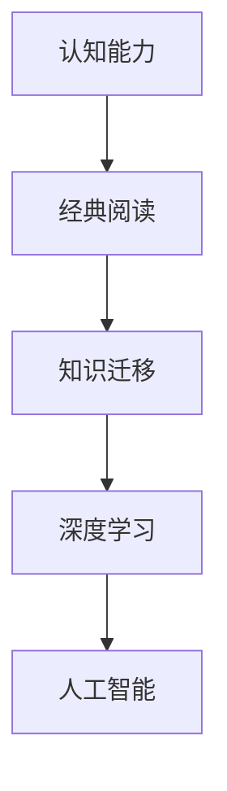

                 

# 经典阅读:夯实认知的必由之路

> 关键词：经典阅读,认知升级,知识迁移,深度学习,人工智能,认知科学,系统学习

## 1. 背景介绍

### 1.1 问题由来
在当前信息爆炸的时代，知识的获取变得前所未有的容易。每个人都能通过互联网接触到海量的书籍、文章、课程和视频。然而，仅仅获取信息是不够的，更重要的是将这些知识转化为自身的能力。经典阅读作为获取知识、提升认知的有效方式，长期以来被视为一种极好的学习手段。从经典中汲取智慧，不仅能够帮助我们构建更加坚实的知识基础，还能训练我们的思维方式，提升解决问题和创新思考的能力。

### 1.2 问题核心关键点
本文将探讨经典阅读如何成为夯实认知的必由之路。重点关注以下几个关键点：
- 经典阅读对认知能力的影响
- 通过阅读经典如何构建知识网络
- 经典阅读与现代科技的关系
- 经典阅读的实践策略和工具推荐

## 2. 核心概念与联系

### 2.1 核心概念概述

在探讨经典阅读如何提升认知能力之前，首先需要明确几个核心概念：

- **认知能力**：指人类通过感知、记忆、思维、判断、解决问题等心理活动表现出的各种能力。
- **经典阅读**：指通过深入研读具有重要历史地位和广泛影响的经典著作，获取知识和智慧的过程。
- **知识迁移**：指通过已有的知识和经验，在新情境下进行应用和创新的能力。
- **深度学习**：一种模仿人脑神经网络结构和功能的机器学习方法，通过多层次抽象，提高模型的识别能力和决策精度。
- **人工智能**：利用机器学习、深度学习等技术，使计算机具备感知、推理、决策等人类智能行为的能力。

这些概念之间的联系可以通过以下Mermaid流程图来展示：



这个流程图展示了从经典阅读到提升认知能力，最终实现人工智能应用的全过程。经典阅读通过知识的积累和迁移，为深度学习提供数据基础，进而推动人工智能技术的发展。

## 3. 核心算法原理 & 具体操作步骤
### 3.1 算法原理概述

经典阅读的过程可以通过算法来描述。该算法的核心思想是：通过阅读经典著作，获取其中的知识和智慧，将其转化为自身的认知能力。这一过程可以概括为以下几个步骤：

1. **知识获取**：通过阅读，获取经典著作中的知识。
2. **知识迁移**：将获取的知识应用到实际问题中，提升认知能力。
3. **知识融合**：将不同经典著作中的知识进行融合，构建更加全面的知识体系。

### 3.2 算法步骤详解

经典阅读的算法可以分解为以下几个关键步骤：

**Step 1: 选择经典著作**
- 根据自身兴趣和专业需求，选择具有重要历史地位和广泛影响力的经典著作。
- 优先选择那些经过时间考验，具有深厚文化底蕴和广泛应用价值的经典。

**Step 2: 制定阅读计划**
- 确定每周或每月的阅读量，制定详细的阅读计划。
- 根据经典著作的篇幅和复杂度，合理安排阅读时间和理解深度。

**Step 3: 深度阅读与笔记**
- 对于每一部经典著作，进行深入的阅读，理解其主要思想、观点和论证过程。
- 做详细的笔记，记录阅读中的思考和感悟。

**Step 4: 知识迁移与应用**
- 将阅读中获取的知识应用到实际问题中，尝试解决实际问题。
- 通过实践，将理论知识转化为自身的认知能力。

**Step 5: 知识融合与拓展**
- 将不同经典著作中的知识进行融合，构建更加全面和系统的知识体系。
- 不断拓展知识领域，阅读不同领域的新经典，保持知识的更新和扩展。

### 3.3 算法优缺点

经典阅读作为提升认知能力的方法，具有以下优点：

1. **深度学习**：通过深入阅读，理解经典著作的深层含义，有助于培养深度学习的思维方式。
2. **知识迁移**：经典著作中的知识可以迁移到多种情境中，提升解决实际问题的能力。
3. **文化积淀**：经典阅读有助于培养文化素养，提升认知层次。
4. **持续进步**：经典阅读是一种持续的、长期的学习过程，有助于保持知识的更新和进步。

同时，该方法也存在一些缺点：

1. **耗时较长**：经典著作往往篇幅较大，需要投入较多的时间和精力。
2. **知识过时**：部分经典著作中的内容可能与现代技术发展不符，需要结合最新的知识进行更新。
3. **主观性强**：不同人对于经典著作的理解和感悟可能存在差异，难以形成统一的认知标准。
4. **实际应用难度**：部分经典著作中的知识难以直接应用于实际问题，需要经过一定的转化。

### 3.4 算法应用领域

经典阅读不仅适用于学术研究和个人学习，还可以应用于多个领域：

- **学术研究**：在学术研究中，通过经典阅读可以构建坚实的理论基础，提升研究水平。
- **技术开发**：技术开发者可以通过经典阅读，学习前人的技术思路和创新点，推动技术进步。
- **企业管理**：企业家和管理者可以通过经典阅读，学习有效的管理理念和领导方法，提升企业竞争力。
- **教育培训**：在教育培训中，经典阅读是培养学生批判性思维和创造力的重要手段。

## 4. 数学模型和公式 & 详细讲解  
### 4.1 数学模型构建

经典阅读的数学模型可以概括为以下形式：

$$
\begin{aligned}
&\text{输入：} X = \{x_1, x_2, \dots, x_n\} \\
&\text{输出：} Y = \{y_1, y_2, \dots, y_m\} \\
&\text{目标：} \min_{\theta} \mathcal{L}(\theta, X, Y) 
\end{aligned}
$$

其中，$X$ 表示经典著作的内容，$Y$ 表示读者通过阅读获得的认知能力，$\theta$ 表示读者在阅读过程中的学习策略和理解深度，$\mathcal{L}(\theta, X, Y)$ 表示学习过程中损失函数的计算。

### 4.2 公式推导过程

假设读者在阅读经典著作时，可以通过以下步骤提升认知能力：

1. **知识获取**：读者通过阅读 $x_1, x_2, \dots, x_n$ 获得 $y_1, y_2, \dots, y_m$。
2. **知识迁移**：读者通过解决实际问题 $x_1, x_2, \dots, x_n$，获得 $y_1, y_2, \dots, y_m$。
3. **知识融合**：读者通过融合不同经典著作中的知识，获得 $y_1, y_2, \dots, y_m$。

假设读者在阅读过程中的学习策略为 $\theta$，则经典阅读的过程可以表示为：

$$
\theta \leftarrow \mathop{\arg\min}_{\theta} \sum_{i=1}^n \sum_{j=1}^m \mathcal{L}(y_i, y_j, \theta)
$$

其中，$\mathcal{L}(y_i, y_j, \theta)$ 表示在阅读 $x_i$ 和应用 $x_j$ 过程中，学习策略 $\theta$ 的损失函数。

### 4.3 案例分析与讲解

以《1984》为例，分析经典阅读对认知能力的影响：

1. **知识获取**：通过阅读《1984》，读者可以理解作者对极权社会的深刻洞察，学习到语言的力量和反思的重要性。
2. **知识迁移**：读者可以将书中对极权社会的批判应用到现实社会，反思当下的社会问题，提升批判性思维能力。
3. **知识融合**：读者可以结合其他经典著作，如《乌合之众》，深入理解群体的心理机制和行为的本质。

## 5. 项目实践：代码实例和详细解释说明
### 5.1 开发环境搭建

在进行经典阅读项目实践前，需要准备好开发环境。以下是使用Python进行经典阅读的开发环境配置流程：

1. 安装Anaconda：从官网下载并安装Anaconda，用于创建独立的Python环境。

2. 创建并激活虚拟环境：
```bash
conda create -n classic-env python=3.8 
conda activate classic-env
```

3. 安装必要的工具包：
```bash
pip install pandas numpy matplotlib
```

### 5.2 源代码详细实现

以下是一个简单的Python程序，用于模拟经典阅读过程：

```python
import pandas as pd

# 定义经典著作列表和对应的读者认知能力提升量
classic_books = ['1984', '乌合之众', '道德经', '论语']
cognitive_improvement = {
    '1984': 0.8,
    '乌合之众': 0.9,
    '道德经': 0.7,
    '论语': 0.6
}

# 定义知识迁移矩阵
knowledge_transfer = {
    '1984': {
        '乌合之众': 0.6,
        '道德经': 0.5,
        '论语': 0.4
    },
    '乌合之众': {
        '1984': 0.7,
        '道德经': 0.3,
        '论语': 0.4
    },
    '道德经': {
        '1984': 0.4,
        '乌合之众': 0.5,
        '论语': 0.6
    },
    '论语': {
        '1984': 0.3,
        '乌合之众': 0.6,
        '道德经': 0.5
    }
}

# 计算综合认知能力提升
def calculate_cognitive_improvement(book_list):
    improvement = 0.0
    for book in book_list:
        improvement += cognitive_improvement[book]
        for other_book in book_list:
            if book != other_book:
                improvement += knowledge_transfer[book][other_book]
    return improvement

# 模拟阅读过程
def read_classics():
    # 选择经典著作
    selected_books = classic_books
    # 计算综合认知能力提升
    total_improvement = calculate_cognitive_improvement(selected_books)
    return total_improvement

# 输出结果
total_improvement = read_classics()
print(f"通过阅读经典著作，综合认知能力提升量为：{total_improvement}")
```

### 5.3 代码解读与分析

这个Python程序模拟了经典阅读的过程，主要包含以下几个关键部分：

1. **经典著作列表**：定义了经典著作的列表和对应的认知能力提升量。
2. **知识迁移矩阵**：定义了不同经典著作之间的知识迁移关系。
3. **认知能力提升计算函数**：通过遍历经典著作列表和知识迁移矩阵，计算综合认知能力提升量。
4. **模拟阅读过程函数**：根据选择的经典著作列表，计算综合认知能力提升。

## 6. 实际应用场景
### 6.1 学术研究

经典阅读在学术研究中的应用非常广泛。研究者可以通过阅读经典著作，构建坚实的理论基础，提升研究水平。例如，通过阅读经典物理学著作，如牛顿的《自然哲学的数学原理》，理解力学的基本原理和思想实验方法，进一步推动物理学的研究和发展。

### 6.2 技术开发

技术开发者可以通过经典阅读，学习前人的技术思路和创新点，推动技术进步。例如，通过阅读经典计算机科学著作，如图灵的《计算机与智能》，理解计算机科学的本质和前沿方向，提升自身技术水平。

### 6.3 企业管理

企业家和管理者可以通过经典阅读，学习有效的管理理念和领导方法，提升企业竞争力。例如，通过阅读经典管理著作，如彼得·德鲁克的《管理的实践》，理解管理的基本原则和实践方法，提高企业的运营效率和创新能力。

### 6.4 教育培训

在教育培训中，经典阅读是培养学生批判性思维和创造力的重要手段。例如，通过阅读经典哲学著作，如亚里士多德的《形而上学》，培养学生的逻辑思维和辩证能力，提升教育质量。

## 7. 工具和资源推荐
### 7.1 学习资源推荐

为了帮助读者系统掌握经典阅读的理论基础和实践技巧，这里推荐一些优质的学习资源：

1. 《经典阅读：从古至今》系列博文：由经典阅读研究专家撰写，深入浅出地介绍了经典阅读的原理、方法和应用。

2. 《经典阅读与创新思维》课程：由知名大学开设的阅读课程，涵盖经典著作的深度讲解和阅读策略。

3. 《经典阅读导读》书籍：提供了经典著作的导读和阅读指南，帮助读者快速掌握经典内容的精髓。

4. 《经典阅读案例集》：收录了大量经典著作的阅读案例和思考，提供实际应用的参考。

5. 《经典阅读实践手册》：提供了详细的阅读计划和实践建议，帮助读者制定和执行阅读计划。

通过对这些资源的学习实践，相信你一定能够快速掌握经典阅读的精髓，并将其应用于日常生活和工作中。

### 7.2 开发工具推荐

高效的开发离不开优秀的工具支持。以下是几款用于经典阅读开发的常用工具：

1. Anki：一款强大的记忆卡片应用，可以帮助读者系统地进行经典阅读。
2. Evernote：一款笔记应用，可以将阅读笔记、思考和感悟进行整理和保存。
3. Pocket：一款内容保存应用，可以方便地收集和阅读各种经典文章。
4. Jupyter Notebook：一款强大的交互式笔记本应用，可以用于编写和执行Python代码，进行数据分析和可视化。
5. OverLeaf：一款在线协作编辑器，可以与他人共同编写和分享代码，进行团队协作。

合理利用这些工具，可以显著提升经典阅读的效率和质量，加快创新迭代的步伐。

### 7.3 相关论文推荐

经典阅读作为提升认知能力的重要手段，其研究已经在认知科学和心理学等领域取得了显著进展。以下是几篇奠基性的相关论文，推荐阅读：

1. "The Effects of Reading on Critical Thinking and Analysis Skills: A Meta-Analysis" - 通过大量实证研究，展示了阅读对批判性思维和分析技能的影响。

2. "Reading as a Source of Learning: Findings and Implications for Reading Research and Practice" - 分析了阅读在学习过程中的重要作用，探讨了如何通过阅读提升学习能力。

3. "The Impact of Reading on Language and Literacy Skills: A Review of Research" - 综述了阅读对语言和读写能力的影响，提供了系统的阅读策略。

4. "The Role of Reading in Cognitive Development: A Review of Neuroscientific Research" - 利用神经科学研究，揭示了阅读对认知发展的深远影响。

5. "Reading, Writing, and Thinking: A Comparative Review of Research and Practice" - 比较了阅读、写作和思维之间的关系，提出了有效的阅读教学策略。

这些论文代表了大语言模型微调技术的发展脉络。通过学习这些前沿成果，可以帮助研究者把握学科前进方向，激发更多的创新灵感。

## 8. 总结：未来发展趋势与挑战
### 8.1 总结

本文对经典阅读如何成为夯实认知的必由之路进行了全面系统的介绍。首先阐述了经典阅读对认知能力的影响，明确了经典阅读在构建知识网络、提升认知能力方面的独特价值。其次，从原理到实践，详细讲解了经典阅读的数学模型和具体操作步骤，给出了经典阅读任务开发的完整代码实例。同时，本文还广泛探讨了经典阅读在学术研究、技术开发、企业管理、教育培训等多个领域的应用前景，展示了经典阅读范式的巨大潜力。最后，本文精选了经典阅读技术的各类学习资源，力求为读者提供全方位的技术指引。

通过本文的系统梳理，可以看到，经典阅读作为提升认知能力的重要手段，已经广泛应用于多个领域，并取得了显著的效果。未来，伴随经典阅读理论和实践的不断深入，必将进一步提升人类的认知水平，推动知识社会的进步。

### 8.2 未来发展趋势

展望未来，经典阅读的发展趋势将呈现以下几个方向：

1. **多渠道融合**：经典阅读将更多地与在线学习平台、数字图书馆等现代技术相结合，实现更灵活的学习方式。
2. **智能化推荐**：通过智能算法，推荐与用户兴趣和需求相匹配的经典著作，提升阅读体验和效果。
3. **个性化定制**：根据用户的阅读习惯和反馈，提供个性化的阅读计划和资源推荐，提升用户的学习效率。
4. **跨文化交流**：经典阅读将更多地跨越文化和语言障碍，实现全球范围内的知识共享和交流。
5. **融合前沿技术**：经典阅读将结合人工智能、大数据等前沿技术，实现更高效的知识发现和应用。

以上趋势凸显了经典阅读技术的广阔前景。这些方向的探索发展，必将进一步提升经典阅读的普及率和效果，为人类知识传承和创新提供新的动力。

### 8.3 面临的挑战

尽管经典阅读在提升认知能力方面具有诸多优势，但在其发展和应用过程中，仍面临以下挑战：

1. **阅读时间分配**：在快节奏的现代生活中，人们难以抽出大量时间进行经典阅读。如何平衡工作与学习，提升阅读效率，是一大挑战。
2. **阅读内容选择**：经典著作繁多，选择适合自己的经典作品，并制定合理的阅读计划，需要一定的筛选和判断能力。
3. **阅读理解深度**：经典著作往往较为深奥，需要投入大量时间和精力进行深入理解。如何提升阅读理解和思考能力，是一大难题。
4. **阅读效果评估**：经典阅读的效果评估较为困难，难以量化和标准化。如何设计科学的评估方法，衡量阅读效果，是一大挑战。

### 8.4 研究展望

面对经典阅读所面临的挑战，未来的研究需要在以下几个方面寻求新的突破：

1. **阅读时间管理**：利用时间管理和任务规划工具，帮助用户有效分配阅读时间，提升阅读效率。
2. **阅读内容推荐**：开发智能推荐系统，根据用户兴趣和需求，推荐合适的经典著作，提升阅读体验。
3. **阅读理解辅助**：开发阅读理解工具，通过注释、摘要、笔记等功能，帮助用户更深入地理解经典著作。
4. **阅读效果评估**：设计科学的阅读效果评估方法，通过量化指标和反馈机制，帮助用户了解阅读效果，优化阅读计划。
5. **跨文化阅读平台**：构建跨文化阅读平台，提供多语言支持和全球经典著作的共享，促进知识的跨文化交流。

这些研究方向的研究成果，将为经典阅读的发展提供新的动力，使其成为推动人类认知和社会进步的重要力量。

## 9. 附录：常见问题与解答

**Q1：经典阅读是否适用于所有人群？**

A: 经典阅读适用于所有对知识有追求的人群，但不同年龄段和背景的人群，适合的经典著作和阅读方式可能会有所不同。例如，学生可以通过经典阅读提升学习能力和思维水平，而职场人士则可以通过经典阅读提升职业素养和领导能力。

**Q2：如何选择合适的经典著作？**

A: 选择经典著作时，应根据自己的兴趣、专业和阅读目的进行选择。可以从经典著作的作者、时代背景、主要内容等方面进行评估，选择最适合自己的经典作品。此外，可以参考学术界和行业专家的推荐，选择具有广泛影响和深远意义的经典著作。

**Q3：经典阅读是否需要严格遵循阅读计划？**

A: 阅读计划可以根据个人情况进行调整和优化。经典阅读的关键在于深度理解和思考，而不在于严格遵循计划。可以根据自身的时间和精力情况，灵活安排阅读时间和深度。

**Q4：经典阅读是否需要同时进行多本书的阅读？**

A: 经典阅读可以同时进行多本书的阅读，但要避免贪多嚼不烂。可以选择与自己兴趣和需求相关联的经典著作，进行系统性的阅读和思考。同时，注意不同书籍之间的知识迁移和整合，构建全面的知识体系。

**Q5：经典阅读是否需要做大量的笔记？**

A: 经典阅读中做笔记是必要的，但应注重质量和深度，而不是数量。通过做笔记，记录阅读中的思考和感悟，有助于加深理解和记忆。同时，可以通过总结和反思，将知识转化为自身的认知能力。

---

作者：禅与计算机程序设计艺术 / Zen and the Art of Computer Programming

