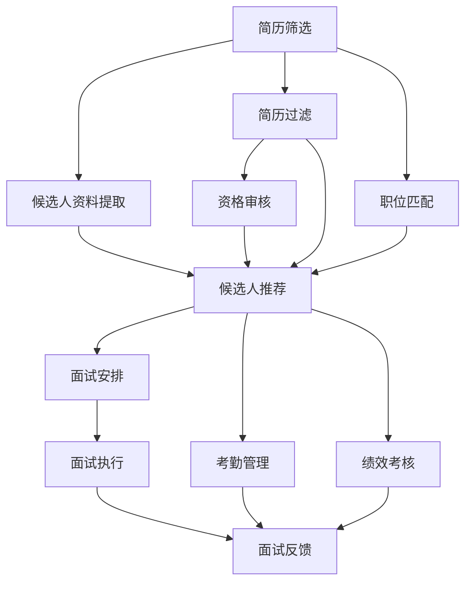

                 

# 聊天机器人人力资源：招聘和员工管理

## 1. 背景介绍

随着人工智能技术的飞速发展，聊天机器人(Robotic Process Automation, RPA)在企业中的应用越来越广泛。尤其在人力资源管理(Human Resources, HR)领域，聊天机器人以其高效、低成本、智能化的特点，正在逐步取代人工进行各种日常事务处理。从招聘筛选到员工管理，再到培训和发展，聊天机器人正在重塑HR的运作模式。本文将系统探讨聊天机器人在招聘和员工管理中的应用，介绍其核心算法、操作流程及优缺点，并展望未来发展趋势和面临的挑战。

## 2. 核心概念与联系

### 2.1 核心概念概述

聊天机器人是指利用自然语言处理(Natural Language Processing, NLP)和机器学习技术，能够与用户进行自然对话的计算机程序。其核心组件包括：
- **NLP引擎**：负责理解、生成和处理自然语言文本，是聊天机器人感知和交互的基础。
- **知识库**：存储聊天机器人所需的各类信息，如公司政策、业务流程、常见问题等，用于指导机器人回答用户问题。
- **对话管理**：决定聊天机器人在对话中的行为，如选择回答、跳转话题、调用外部服务等。
- **用户意图识别**：分析用户输入的自然语言，识别其意图，以便提供准确的响应。

聊天机器人与HR管理之间有着天然的联系，其通过智能化的处理能力，可以大幅度提升HR工作效率，降低管理成本，实现HR流程的自动化。在招聘和员工管理中，聊天机器人能够从简历筛选、面试安排到考勤管理、绩效考核等各个环节提供全面的支持。

### 2.2 核心概念原理和架构的 Mermaid 流程图



这个流程图展示了聊天机器人在HR招聘和员工管理中的主要流程，包括简历筛选、职位匹配、资格审核、候选人推荐、面试安排、考勤管理和绩效考核等。

## 3. 核心算法原理 & 具体操作步骤

### 3.1 算法原理概述

聊天机器人在招聘和员工管理中的应用，主要依赖于自然语言处理和机器学习技术。其核心算法原理包括以下几个方面：
- **自然语言处理(NLP)**：负责对用户输入的自然语言进行理解、分析和生成。包括文本清洗、分词、词性标注、句法分析、语义理解等。
- **机器学习**：用于构建和优化聊天机器人算法，提高其智能水平。包括监督学习、半监督学习、无监督学习等。
- **对话管理**：根据对话上下文，选择最优的对话策略。包括状态转移、意图分类、上下文记忆等。

### 3.2 算法步骤详解

聊天机器人在招聘和员工管理中的操作步骤如下：
1. **数据准备**：收集和整理公司的人力资源相关数据，包括招聘信息、员工档案、考勤记录等。
2. **模型训练**：利用已有的数据集，训练自然语言处理和机器学习模型。如利用文本分类模型进行简历筛选和面试反馈分析，利用时序模型进行考勤管理和绩效考核。
3. **模型集成**：将训练好的模型集成到聊天机器人系统中，构建功能模块。如简历筛选模块、面试安排模块等。
4. **用户交互**：用户通过与聊天机器人进行对话，获取所需信息或提交请求，机器人根据对话流程做出响应。
5. **结果反馈**：对聊天机器人的响应进行监控和评估，不断优化模型和对话流程。

### 3.3 算法优缺点

聊天机器人在HR招聘和员工管理中的应用，具有以下优点：
- **高效性**：能够24小时不间断工作，处理大量数据，显著提升HR工作效率。
- **智能化**：具备自然语言理解和处理能力，能够理解用户意图，提供更精准的响应。
- **可扩展性**：可以根据需要扩展功能模块，适应不同规模和复杂度的HR流程。
- **低成本**：相比于人工操作，聊天机器人能大幅降低人力成本，提升企业竞争力。

但聊天机器人也存在一些缺点：
- **依赖数据**：依赖高质量的数据集进行训练，数据质量差可能导致模型性能下降。
- **理解局限**：对于复杂或模糊的用户意图，聊天机器人的理解能力可能不足，导致误判。
- **缺乏人性化**：难以处理敏感或复杂的人际关系问题，难以完全替代人工HR。

### 3.4 算法应用领域

聊天机器人在招聘和员工管理中的应用，涵盖以下几个主要领域：
- **招聘流程优化**：利用聊天机器人进行简历筛选、职位匹配、资格审核、候选人推荐等。
- **面试安排与执行**：通过聊天机器人进行面试安排、执行和反馈。
- **员工考勤管理**：自动记录考勤数据，生成考勤报告，统计考勤异常。
- **绩效考核与培训**：通过聊天机器人进行绩效考核、培训计划制定和进度跟踪。

## 4. 数学模型和公式 & 详细讲解 & 举例说明

### 4.1 数学模型构建

在招聘和员工管理中，常见的数学模型包括文本分类模型、时序模型等。以文本分类模型为例，其数学模型构建如下：

设训练集为 $D = \{(x_i, y_i)\}_{i=1}^N$，其中 $x_i$ 为简历文本， $y_i$ 为分类标签。训练一个文本分类模型 $M$ 的目标是最小化经验风险 $\mathcal{L}(M) = \frac{1}{N} \sum_{i=1}^N \ell(M(x_i), y_i)$，其中 $\ell$ 为损失函数， $\ell$ 通常使用交叉熵损失函数。

### 4.2 公式推导过程

以朴素贝叶斯分类器为例，其训练过程分为两个步骤：
1. **参数估计**：计算每个特征在每个类别下的条件概率。
2. **预测**：根据待分类样本的特征，计算其属于每个类别的概率，选择概率最大的类别作为预测结果。

具体推导如下：
- **参数估计**：
  $$
  p(y_i|x_i) = \frac{p(y_i) \prod_{j=1}^d p(x_{ij}|y_i)}{\sum_{k=1}^K p(k) \prod_{j=1}^d p(x_{ij}|k)}
  $$
  其中 $y_i$ 为样本标签， $x_{ij}$ 为样本第 $j$ 个特征， $K$ 为类别数。
- **预测**：
  $$
  y = \mathop{\arg\max}_{k=1,\dots,K} p(y|x) = \mathop{\arg\max}_{k=1,\dots,K} \frac{p(y) \prod_{j=1}^d p(x_{ij}|y)}{\sum_{k=1}^K p(k) \prod_{j=1}^d p(x_{ij}|k)}
  $$

### 4.3 案例分析与讲解

以简历筛选为例，假设有一个简单的二分类问题，即判断简历是否符合职位要求。利用朴素贝叶斯分类器进行模型训练和测试。

假设训练集 $D = \{(x_i, y_i)\}_{i=1}^N$，其中 $x_i$ 为简历文本， $y_i$ 为是否符合职位要求（0表示不符合，1表示符合）。通过训练得到朴素贝叶斯模型 $M$，并在测试集上进行预测。

**步骤 1：数据准备**
收集大量职位要求和简历数据，将其划分为训练集和测试集。假设训练集大小为 $N$，测试集大小为 $M$。

**步骤 2：特征提取**
对简历文本进行分词、去除停用词等预处理，得到特征向量 $x_i = [x_{i1}, x_{i2}, \dots, x_{id}]$，其中 $x_{ij}$ 表示简历中第 $j$ 个特征。

**步骤 3：模型训练**
利用训练集 $D$ 训练朴素贝叶斯模型 $M$，得到模型参数 $\theta$。

**步骤 4：模型测试**
对测试集进行分类预测，得到分类结果 $y$。利用交叉验证等方法评估模型性能。

通过上述流程，我们可以构建一个简单的简历筛选聊天机器人，利用文本分类模型对简历进行筛选，提供符合职位要求的候选人。

## 5. 项目实践：代码实例和详细解释说明

### 5.1 开发环境搭建

在Python环境中搭建聊天机器人开发环境，安装所需的第三方库：
- **NLTK**：自然语言处理库，用于分词、停用词过滤等。
- **Scikit-Learn**：机器学习库，用于构建文本分类模型。
- **Flask**：Web框架，用于搭建聊天机器人后端。
- **TensorFlow**：深度学习库，用于构建复杂模型。

### 5.2 源代码详细实现

以下是一个简单的聊天机器人招聘流程优化示例代码：

```python
import nltk
from sklearn.feature_extraction.text import CountVectorizer
from sklearn.naive_bayes import MultinomialNB
from sklearn.metrics import accuracy_score

# 特征提取
vectorizer = CountVectorizer(stop_words='english')
X_train = vectorizer.fit_transform(train_data)
X_test = vectorizer.transform(test_data)

# 模型训练
clf = MultinomialNB()
clf.fit(X_train, y_train)

# 模型测试
y_pred = clf.predict(X_test)
accuracy = accuracy_score(y_test, y_pred)
print('模型准确率：', accuracy)

# Flask搭建聊天机器人后端
from flask import Flask, request, jsonify

app = Flask(__name__)

@app.route('/predict', methods=['POST'])
def predict():
    data = request.json
    x = vectorizer.transform([data['resume_text']])
    y_pred = clf.predict(x)[0]
    return jsonify({'result': y_pred})

if __name__ == '__main__':
    app.run(debug=True)
```

该代码实现了基于朴素贝叶斯分类的简历筛选功能，并在Flask框架下搭建了后端服务。用户可以通过HTTP请求的方式，将简历文本作为输入，获取筛选结果。

### 5.3 代码解读与分析

**NLTK库**：
- **NLTK**是自然语言处理领域的经典库，提供了丰富的文本处理功能，如分词、词性标注、情感分析等。
- 代码中使用了 `CountVectorizer` 进行特征提取，将文本转换为向量表示，方便模型处理。

**Scikit-Learn库**：
- **Scikit-Learn**是Python中最常用的机器学习库之一，提供了丰富的机器学习算法和评估指标。
- 代码中使用了 `MultinomialNB` 构建朴素贝叶斯分类器，用于简历筛选任务。

**Flask框架**：
- **Flask**是Python中的轻量级Web框架，易于上手，适用于搭建聊天机器人后端。
- 代码中使用了 `@app.route` 装饰器，定义了聊天机器人的API接口，接收用户输入的简历文本，返回筛选结果。

## 6. 实际应用场景

### 6.1 招聘流程优化

聊天机器人在招聘流程中，可以自动处理简历筛选、职位匹配、资格审核等任务，大幅提升招聘效率。其具体应用场景包括：
- **简历筛选**：根据职位要求自动筛选符合条件的简历。
- **职位匹配**：根据候选人背景和能力，推荐最合适的职位。
- **资格审核**：对候选人的背景信息进行审核，确保信息的准确性。

### 6.2 面试安排与执行

聊天机器人在面试安排和执行中，可以自动化地进行任务分配和流程管理。其具体应用场景包括：
- **面试安排**：根据候选人和面试官的日程，自动匹配合适的面试时间。
- **面试执行**：通过聊天机器人引导面试流程，记录面试情况。
- **面试反馈**：自动生成面试反馈，供HR和面试官参考。

### 6.3 员工考勤管理

聊天机器人在考勤管理中，可以自动记录和处理考勤数据，生成考勤报告。其具体应用场景包括：
- **考勤记录**：自动记录员工出勤情况，生成考勤数据。
- **异常统计**：根据考勤数据，统计迟到、早退等异常情况。
- **报告生成**：生成月度、季度考勤报告，供HR和员工参考。

### 6.4 绩效考核与培训

聊天机器人在绩效考核和培训中，可以自动化地进行考核评估和培训管理。其具体应用场景包括：
- **绩效考核**：根据员工表现和考核指标，自动生成考核结果。
- **培训计划**：根据员工需求和能力，自动制定培训计划。
- **进度跟踪**：自动跟踪培训进度，记录培训效果。

## 7. 工具和资源推荐

### 7.1 学习资源推荐

1. **《Python自然语言处理》**：讲解了自然语言处理的各个方面，适合初学者学习。
2. **《深度学习》**：讲解了深度学习的理论和实现，适合深入学习。
3. **Coursera自然语言处理课程**：由斯坦福大学提供，涵盖自然语言处理的各个方向。
4. **Kaggle招聘数据集**：包含大量的招聘数据，适合数据挖掘和文本分类任务的练习。

### 7.2 开发工具推荐

1. **PyTorch**：深度学习库，提供了丰富的深度学习框架。
2. **TensorFlow**：深度学习库，适合大规模深度学习任务的开发。
3. **NLTK**：自然语言处理库，提供了丰富的文本处理功能。
4. **Flask**：Web框架，适合搭建聊天机器人后端。

### 7.3 相关论文推荐

1. **"ChatterBot: A Conversational Chatbot Engine for Python"**：介绍了Python中的聊天机器人库ChatterBot，适合初学者了解聊天机器人的基本原理。
2. **"Evaluating the Effectiveness of Conversational AI"**：讨论了聊天机器人在企业中的应用效果，适合了解聊天机器人的实际效果。
3. **"Language Models as Knowledge Bases for Conversational Agents"**：介绍了基于语言模型的对话管理，适合了解聊天机器人的算法原理。

## 8. 总结：未来发展趋势与挑战

### 8.1 研究成果总结

聊天机器人在招聘和员工管理中的应用，已经得到了广泛的认可和应用。其主要研究成果包括：
- **招聘流程优化**：通过自动化简历筛选、职位匹配等功能，大幅度提升招聘效率。
- **面试安排与执行**：通过自动化面试安排和执行，提升面试效率和公平性。
- **员工考勤管理**：通过自动化考勤记录和管理，减少人工干预，提升考勤准确性。
- **绩效考核与培训**：通过自动化绩效考核和培训管理，提升员工满意度和企业竞争力。

### 8.2 未来发展趋势

未来，聊天机器人在招聘和员工管理中的应用将呈现以下趋势：
- **智能化水平提升**：通过深度学习和迁移学习，聊天机器人的理解能力和智能水平将不断提升。
- **多模态融合**：结合视觉、语音等多模态数据，提升聊天机器人的感知能力和交互体验。
- **个性化定制**：根据不同用户和场景，定制个性化的聊天机器人，提升用户体验。
- **跨领域应用**：扩展到医疗、金融、教育等多个领域，推动AI技术的全面应用。

### 8.3 面临的挑战

尽管聊天机器人在招聘和员工管理中的应用已经取得了一定成果，但仍面临以下挑战：
- **数据质量问题**：依赖高质量的数据集，数据质量差可能导致模型性能下降。
- **理解能力限制**：对于复杂或模糊的用户意图，聊天机器人的理解能力可能不足，导致误判。
- **交互体验**：缺乏人性化，难以处理敏感或复杂的人际关系问题，难以完全替代人工HR。
- **技术成熟度**：当前技术还不够成熟，需要进一步完善算法和系统设计，才能满足企业需求。

### 8.4 研究展望

未来，聊天机器人在招聘和员工管理中的应用将进一步拓展，其研究展望包括：
- **多领域应用**：扩展到医疗、金融、教育等多个领域，推动AI技术的全面应用。
- **多模态融合**：结合视觉、语音等多模态数据，提升聊天机器人的感知能力和交互体验。
- **智能化水平提升**：通过深度学习和迁移学习，聊天机器人的理解能力和智能水平将不断提升。
- **个性化定制**：根据不同用户和场景，定制个性化的聊天机器人，提升用户体验。

## 9. 附录：常见问题与解答

### Q1: 聊天机器人在招聘和员工管理中的应用有哪些？

A: 聊天机器人在招聘和员工管理中的应用主要包括以下几个方面：
- 简历筛选：根据职位要求自动筛选符合条件的简历。
- 职位匹配：根据候选人背景和能力，推荐最合适的职位。
- 资格审核：对候选人的背景信息进行审核，确保信息的准确性。
- 面试安排：根据候选人和面试官的日程，自动匹配合适的面试时间。
- 面试执行：通过聊天机器人引导面试流程，记录面试情况。
- 面试反馈：自动生成面试反馈，供HR和面试官参考。
- 考勤记录：自动记录员工出勤情况，生成考勤数据。
- 异常统计：根据考勤数据，统计迟到、早退等异常情况。
- 报告生成：生成月度、季度考勤报告，供HR和员工参考。
- 绩效考核：根据员工表现和考核指标，自动生成考核结果。
- 培训计划：根据员工需求和能力，自动制定培训计划。
- 进度跟踪：自动跟踪培训进度，记录培训效果。

### Q2: 如何使用Python搭建聊天机器人后端？

A: 使用Python搭建聊天机器人后端的主要步骤如下：
1. 安装Flask框架：`pip install flask`
2. 定义路由：使用`@app.route`装饰器定义API接口，接收用户输入，返回聊天机器人的响应。
3. 数据预处理：使用自然语言处理库（如NLTK）对用户输入进行预处理，提取特征。
4. 模型训练：使用机器学习库（如Scikit-Learn）训练分类模型。
5. 模型预测：使用训练好的模型对用户输入进行预测，生成聊天机器人的响应。
6. 返回响应：使用Flask框架将聊天机器人的响应返回给用户。

### Q3: 聊天机器人在招聘和员工管理中的应用有哪些优点？

A: 聊天机器人在招聘和员工管理中的应用具有以下优点：
- 高效性：能够24小时不间断工作，处理大量数据，显著提升HR工作效率。
- 智能化：具备自然语言理解和处理能力，能够理解用户意图，提供更精准的响应。
- 可扩展性：可以根据需要扩展功能模块，适应不同规模和复杂度的HR流程。
- 低成本：相比于人工操作，聊天机器人能大幅降低人力成本，提升企业竞争力。

### Q4: 聊天机器人在招聘和员工管理中的应用有哪些缺点？

A: 聊天机器人在招聘和员工管理中的应用也存在以下缺点：
- 依赖数据：依赖高质量的数据集进行训练，数据质量差可能导致模型性能下降。
- 理解局限：对于复杂或模糊的用户意图，聊天机器人的理解能力可能不足，导致误判。
- 缺乏人性化：难以处理敏感或复杂的人际关系问题，难以完全替代人工HR。

### Q5: 如何优化聊天机器人在招聘和员工管理中的应用？

A: 优化聊天机器人在招聘和员工管理中的应用，可以从以下几个方面入手：
- 数据质量提升：收集高质量的数据集进行模型训练，提升模型性能。
- 算法改进：使用先进的自然语言处理和机器学习算法，提高聊天机器人的理解能力和智能水平。
- 用户体验改进：增加人性化的交互设计，提升聊天机器人的用户体验。
- 多模态融合：结合视觉、语音等多模态数据，提升聊天机器人的感知能力和交互体验。
- 跨领域应用：扩展到医疗、金融、教育等多个领域，推动AI技术的全面应用。

---

作者：禅与计算机程序设计艺术 / Zen and the Art of Computer Programming

