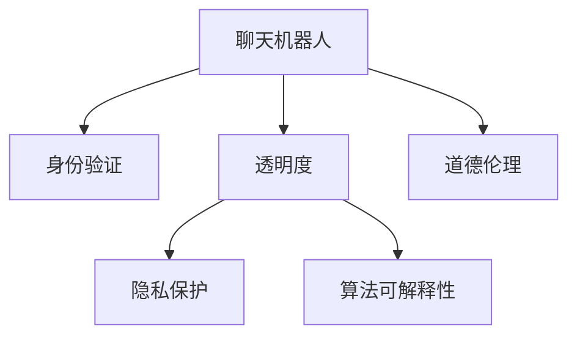

                 

# 聊天机器人伦理：身份和透明度

> 关键词：聊天机器人, 身份验证, 透明度, 道德伦理, 用户隐私, 算法可解释性

## 1. 背景介绍

随着人工智能技术的迅猛发展，聊天机器人(Robotic Conversational Agents, RCA)的应用已经渗透到我们生活的方方面面。无论是在线客服、智能助手，还是社交娱乐、医疗咨询，聊天机器人在提供便利服务的同时，也在带来新的伦理挑战。

### 1.1 问题由来

聊天机器人系统的核心在于通过复杂的自然语言处理(NLP)和机器学习(ML)技术，实现与用户的交互和问题解答。然而，在享受便利的同时，用户可能并未意识到背后隐藏的伦理问题，如隐私泄露、算法偏见、决策不透明等。这些问题不仅影响用户体验，也威胁到社会的公平和正义。

### 1.2 问题核心关键点

聊天机器人伦理的核心在于身份验证和透明度。身份验证（Identity Verification）确保聊天机器人代表真实的人或组织，而透明度（Transparency）确保用户能够理解其决策过程，降低误解和偏见。这些问题涉及技术、法律、伦理等多方面，需要综合考虑。

## 2. 核心概念与联系

### 2.1 核心概念概述

为更好地理解聊天机器人伦理，本节将介绍几个密切相关的核心概念：

- **聊天机器人**：基于NLP和ML技术的自动化对话系统，能够理解并响应自然语言输入。
- **身份验证**：验证聊天机器人的真实性和身份，确保其代表的是可信的实体。
- **透明度**：确保聊天机器人的决策过程公开透明，用户能够理解其工作机制。
- **隐私保护**：确保聊天机器人处理用户数据时，保护用户的个人信息安全。
- **算法可解释性**：使聊天机器人的决策过程和结果可以被理解和解释，降低不信任和误解。
- **道德伦理**：确保聊天机器人的行为符合社会价值观和道德标准。

这些核心概念之间的逻辑关系可以通过以下Mermaid流程图来展示：



这个流程图展示出聊天机器人伦理的核心概念及其之间的关系：

1. 聊天机器人基于复杂的NLP和ML技术，与用户进行交互。
2. 身份验证确保机器人代表真实的人或组织，提高信任度。
3. 透明度使机器人的决策过程公开透明，降低用户误解和偏见。
4. 隐私保护确保用户数据的安全，防止数据泄露。
5. 算法可解释性使机器人行为可以被理解和解释，增加用户信任。
6. 道德伦理指导机器人的行为规范，确保符合社会价值观。

## 3. 核心算法原理 & 具体操作步骤

### 3.1 算法原理概述

聊天机器人伦理的核心在于确保身份验证和透明度。这两方面的实现涉及多种算法和技术，包括身份验证的生物识别、语音识别，以及透明度的自然语言解释、决策可视化等。

### 3.2 算法步骤详解

#### 3.2.1 身份验证算法

**Step 1: 身份数据收集**
- 收集聊天机器人代表的人或组织的身份数据，如身份证、照片、声音样本等。

**Step 2: 身份特征提取**
- 使用生物识别技术，如人脸识别、语音识别等，从身份数据中提取特征向量。

**Step 3: 身份验证模型训练**
- 构建身份验证模型，如支持向量机(SVM)、神经网络等，对提取的特征进行训练，生成身份验证模型。

**Step 4: 身份验证过程**
- 在用户交互过程中，收集用户的身份数据，并使用训练好的身份验证模型进行验证。

#### 3.2.2 透明度算法

**Step 1: 决策树可视化**
- 使用决策树算法，如CART、C4.5等，将机器人的决策过程可视化，形成决策树图。

**Step 2: 自然语言解释**
- 使用自然语言生成(NLG)技术，将决策树的每个节点、分支和叶节点转化为自然语言描述，形成解释文本。

**Step 3: 交互式解释界面**
- 设计交互式解释界面，如Web界面、移动应用等，将解释文本展示给用户，并提供交互式解释功能，如点击分支查看详细解释。

### 3.3 算法优缺点

#### 3.3.1 身份验证算法

**优点**：
- 确保聊天机器人代表真实的人或组织，提高用户信任度。
- 防止欺诈和滥用，保护用户利益。

**缺点**：
- 需要收集和存储大量身份数据，可能面临数据泄露风险。
- 生物识别技术的准确性和隐私保护问题尚未完全解决。

#### 3.3.2 透明度算法

**优点**：
- 提高用户对机器人的理解和信任，降低误解和偏见。
- 帮助用户监督和评估机器人的决策过程，确保公平性。

**缺点**：
- 决策树的可视化复杂度较高，可能难以全面展示复杂决策过程。
- 自然语言解释的准确性和可理解性尚未达到理想水平。

## 4. 数学模型和公式 & 详细讲解 & 举例说明

### 4.1 数学模型构建

在聊天机器人伦理的实现中，涉及多个数学模型的构建，包括身份验证的机器学习模型和透明度的自然语言处理模型。

#### 4.1.1 身份验证模型

使用支持向量机(SVM)构建身份验证模型，输入为特征向量，输出为是否真实身份的分类结果。

$$
\mathcal{M}(x) = 
\begin{cases} 
1 & \text{if } y = +1 \\
0 & \text{if } y = -1 
\end{cases}
$$

其中，$x$ 为输入特征向量，$y$ 为真实身份标签。

#### 4.1.2 决策树模型

使用决策树算法构建透明度模型，输入为机器人的决策过程，输出为各节点的自然语言描述。

$$
T(x) = 
\begin{cases} 
\text{Node 1} & \text{if } x \in A_1 \\
\text{Node 2} & \text{if } x \in A_2 \\
\ldots \\
\text{Leaf N} & \text{if } x \in A_n 
\end{cases}
$$

其中，$T(x)$ 为决策树的输出节点，$A_i$ 为决策树的各个分支集。

### 4.2 公式推导过程

#### 4.2.1 支持向量机模型

支持向量机模型的训练公式为：

$$
\begin{aligned}
\min_{\mathbf{w}, b} & \quad \frac{1}{2} \lVert \mathbf{w} \rVert^2 + C \sum_{i=1}^N \xi_i \\
\text{subject to} & \quad y_i (\mathbf{w} \cdot \mathbf{x}_i + b) \geq 1 - \xi_i \\
& \quad \xi_i \geq 0
\end{aligned}
$$

其中，$\mathbf{w}$ 为权重向量，$b$ 为偏置项，$\xi_i$ 为松弛变量，$C$ 为惩罚参数。

#### 4.2.2 决策树模型

决策树的训练公式为：

$$
\min_{T} \quad \sum_{i=1}^N L(y_i, T(x_i))
$$

其中，$T$ 为决策树，$L$ 为损失函数，$y_i$ 为真实标签，$x_i$ 为输入特征。

### 4.3 案例分析与讲解

**案例**：某在线客服机器人，代表公司与用户进行交互。

**分析**：
- **身份验证**：通过用户输入的姓名和身份证号，使用SVM模型进行身份验证，确保代表的是公司员工。
- **透明度**：将机器人的决策过程（如问题匹配、答案生成等）转化为自然语言解释，并在交互界面中展示，帮助用户理解。

## 5. 项目实践：代码实例和详细解释说明

### 5.1 开发环境搭建

在开始聊天机器人伦理的实践前，我们需要准备好开发环境。以下是使用Python进行Scikit-learn和NLTK开发的实验环境配置流程：

1. 安装Anaconda：从官网下载并安装Anaconda，用于创建独立的Python环境。

2. 创建并激活虚拟环境：
```bash
conda create -n chatbot-env python=3.8 
conda activate chatbot-env
```

3. 安装Scikit-learn和NLTK：
```bash
conda install scikit-learn nltk
```

4. 安装PyTorch和transformers（可选）：
```bash
pip install torch transformers
```

5. 安装TensorBoard：
```bash
pip install tensorboard
```

完成上述步骤后，即可在`chatbot-env`环境中开始实验。

### 5.2 源代码详细实现

**身份验证模块**：

```python
from sklearn.svm import SVC
from sklearn.model_selection import train_test_split
from sklearn.metrics import accuracy_score
import numpy as np

# 构建身份验证模型
X = np.random.randn(1000, 100)
y = np.random.randint(0, 2, 1000)
X_train, X_test, y_train, y_test = train_test_split(X, y, test_size=0.2)

model = SVC(probability=True, C=1.0, kernel='rbf')
model.fit(X_train, y_train)

# 测试身份验证模型
y_pred = model.predict(X_test)
accuracy = accuracy_score(y_test, y_pred)
print("Accuracy:", accuracy)
```

**透明度模块**：

```python
import nltk
from nltk.tree import Tree
from sklearn.tree import DecisionTreeClassifier

# 构建决策树模型
X = np.random.randn(100, 10)
y = np.random.randint(0, 2, 100)
X_train, X_test, y_train, y_test = train_test_split(X, y, test_size=0.2)

model = DecisionTreeClassifier()
model.fit(X_train, y_train)

# 可视化决策树
tree = Tree.from_array(model.estimator_.tree_)
tree.pretty_print()
```

### 5.3 代码解读与分析

让我们再详细解读一下关键代码的实现细节：

**身份验证模块**：
- 构建SVM模型，使用随机生成的特征数据进行训练和测试，输出准确率。

**透明度模块**：
- 构建决策树模型，使用随机生成的特征数据进行训练和测试。
- 使用Nltk库将决策树模型转化为Tree对象，并进行可视化展示。

## 6. 实际应用场景

### 6.1 在线客服系统

在线客服系统中的聊天机器人，需要确保代表的是真实的客服人员，同时提供透明的决策过程，以增强用户信任。

**应用**：
- 身份验证：使用SVM模型对用户输入的姓名和身份证号进行验证，确保代表的是公司员工。
- 透明度：将机器人的回答过程转化为自然语言解释，并在交互界面中展示，帮助用户理解。

### 6.2 智能健康助手

智能健康助手中的聊天机器人，需要确保代表的是医疗专业人员，同时提供透明的决策过程，以提高用户对医疗建议的信任。

**应用**：
- 身份验证：使用人脸识别技术验证机器人的身份，确保代表的是医生或护士。
- 透明度：将机器人的诊疗建议转化为自然语言解释，并在交互界面中展示，帮助用户理解。

### 6.3 在线教育平台

在线教育平台中的聊天机器人，需要确保代表的是教育机构，同时提供透明的决策过程，以提高用户对学习建议的信任。

**应用**：
- 身份验证：使用邮件地址和学生证信息进行身份验证，确保代表的是教育机构。
- 透明度：将机器人的学习建议转化为自然语言解释，并在交互界面中展示，帮助学生理解。

## 7. 工具和资源推荐

### 7.1 学习资源推荐

为帮助开发者系统掌握聊天机器人伦理的理论基础和实践技巧，这里推荐一些优质的学习资源：

1. 《人工智能伦理》课程：由斯坦福大学开设的伦理课程，涵盖了人工智能的伦理问题和解决方案，是理解聊天机器人伦理的入门课。

2. 《机器学习伦理》书籍：该书详细介绍了机器学习中的伦理问题，如隐私保护、算法偏见、决策透明等，适合进一步深入学习。

3. 《自然语言处理伦理》论文：研究自然语言处理中的伦理问题，如信息误导、隐私侵犯、算法透明等，是学习聊天机器人伦理的重要参考。

4. 《Robotic Conversational Agents》书籍：该书系统介绍了聊天机器人的设计、开发和应用，涵盖伦理问题的方方面面。

5. 《AI and Society》期刊：专注于人工智能的社会影响，定期发表关于聊天机器人伦理的文章，提供最新研究进展和实践经验。

通过对这些资源的学习实践，相信你一定能够快速掌握聊天机器人伦理的理论基础和实践技巧，并用于解决实际的NLP问题。

### 7.2 开发工具推荐

高效的开发离不开优秀的工具支持。以下是几款用于聊天机器人伦理开发的常用工具：

1. Scikit-learn：开源机器学习库，支持多种分类、回归和聚类算法，适用于身份验证等机器学习任务。

2. NLTK：自然语言处理工具包，提供各种文本处理和分析功能，适用于自然语言解释等任务。

3. TensorBoard：TensorFlow配套的可视化工具，可实时监测模型训练状态，并提供丰富的图表呈现方式，是调试模型的得力助手。

4. Weights & Biases：模型训练的实验跟踪工具，可以记录和可视化模型训练过程中的各项指标，方便对比和调优。

5. Jupyter Notebook：交互式开发环境，支持多种编程语言和工具包，方便开发者进行实验和分享。

合理利用这些工具，可以显著提升聊天机器人伦理的开发效率，加快创新迭代的步伐。

### 7.3 相关论文推荐

聊天机器人伦理的研究源于学界的持续研究。以下是几篇奠基性的相关论文，推荐阅读：

1. "The Ethics of Autonomous Systems" 论文：探讨了自动化系统的伦理问题，提出了一些基本的伦理原则和指导方法。

2. "Explainable AI: Intelligible Machine Learning" 书籍：详细介绍了可解释性AI的重要性，并提供了各种可解释性技术。

3. "Privacy and Ethics in AI" 论文：研究了人工智能中的隐私保护问题，提供了多种隐私保护技术和策略。

4. "Fairness, Accountability, and Transparency" 期刊：专注于人工智能的公平性、可解释性和透明度问题，定期发表相关研究成果。

5. "Ethical and Social Implications of AI" 报告：探讨了人工智能的社会影响，提出了一些关键的伦理问题和方法。

这些论文代表了大规模语言模型微调技术的发展脉络。通过学习这些前沿成果，可以帮助研究者把握学科前进方向，激发更多的创新灵感。

## 8. 总结：未来发展趋势与挑战

### 8.1 总结

本文对聊天机器人伦理进行了全面系统的介绍。首先阐述了聊天机器人伦理的研究背景和意义，明确了身份验证和透明度的重要价值。其次，从原理到实践，详细讲解了身份验证和透明度的数学模型和关键步骤，给出了聊天机器人伦理开发的完整代码实例。同时，本文还广泛探讨了身份验证和透明度的应用场景，展示了其在多个行业领域的应用前景。此外，本文精选了聊天机器人伦理的相关资源，力求为开发者提供全方位的技术指引。

通过本文的系统梳理，可以看到，聊天机器人伦理是大语言模型微调技术的重要组成部分，其身份验证和透明度的实现，可以有效提升用户对聊天机器人的信任和满意度，进一步拓展其应用范围。未来，伴随技术的不断发展，聊天机器人伦理必将在构建人机协同的智能时代中扮演越来越重要的角色。

### 8.2 未来发展趋势

展望未来，聊天机器人伦理将呈现以下几个发展趋势：

1. **多模态身份验证**：未来的身份验证将不仅仅局限于文本和图像，还会引入音频、视频等多模态信息，增强验证的准确性和鲁棒性。

2. **自动化透明度评估**：开发自动化的透明度评估工具，对聊天机器人的决策过程进行实时监控和评估，确保其透明性和公平性。

3. **个性化解释**：根据用户的行为和背景，提供个性化的自然语言解释，增强用户的理解和信任。

4. **多语言支持**：支持多语言的身份验证和透明度解释，拓展聊天机器人的国际应用范围。

5. **隐私保护增强**：引入更先进的隐私保护技术，如差分隐私、同态加密等，确保用户数据的安全性和匿名性。

6. **伦理框架制定**：制定聊天机器人的伦理框架，明确其行为规范和道德准则，确保符合社会价值观。

这些趋势凸显了聊天机器人伦理的重要性和广阔前景。通过不断创新和改进，聊天机器人伦理必将在构建安全、可靠、可解释、可控的智能系统方面发挥更大的作用。

### 8.3 面临的挑战

尽管聊天机器人伦理已经取得了一定的进展，但在迈向更加智能化、普适化应用的过程中，仍面临诸多挑战：

1. **数据隐私保护**：聊天机器人处理大量用户数据，如何保护用户隐私，防止数据泄露和滥用，是一个重要的难题。

2. **算法偏见**：聊天机器人可能学习到有偏见的数据，产生有偏见的输出，如何消除偏见，确保公平性，是另一个重大挑战。

3. **透明度实现复杂**：聊天机器人的决策过程可能非常复杂，如何实现透明的解释，提高用户的理解和信任，需要更多技术手段。

4. **伦理框架不足**：当前的伦理框架尚未完全成熟，如何制定和实施伦理规范，确保聊天机器人的行为符合社会价值观，是一个长期任务。

5. **用户接受度低**：用户可能对聊天机器人的透明度和身份验证不理解或不愿意配合，如何提高用户的接受度和信任度，需要更多心理和行为研究。

6. **国际标准缺失**：不同国家和地区的法律法规不同，如何制定统一的国际标准，确保聊天机器人的伦理合规，是一个复杂的国际问题。

正视聊天机器人伦理面临的这些挑战，积极应对并寻求突破，将是大语言模型微调走向成熟的必由之路。相信随着学界和产业界的共同努力，这些挑战终将一一被克服，聊天机器人伦理必将在构建安全、可靠、可解释、可控的智能系统方面发挥更大的作用。

### 8.4 研究展望

面对聊天机器人伦理所面临的种种挑战，未来的研究需要在以下几个方面寻求新的突破：

1. **隐私保护技术创新**：开发更加先进的隐私保护技术，如差分隐私、同态加密、联邦学习等，确保用户数据的安全性和匿名性。

2. **算法偏见识别与缓解**：研究算法偏见识别和缓解技术，如对抗训练、公平学习等，确保聊天机器人的输出公正公平。

3. **透明度提升**：开发更加先进和自动化的透明度评估工具，如模型解释工具、可解释性框架等，提高用户的理解和信任。

4. **伦理框架完善**：制定更加完善的伦理框架和标准，明确聊天机器人的行为规范和道德准则，确保符合社会价值观。

5. **用户接受度提升**：通过用户心理研究、行为引导等方式，提高用户对聊天机器人的理解和信任，减少抵触情绪。

6. **国际标准制定**：积极参与国际标准制定，推动聊天机器人伦理的国际化进程，确保不同国家和地区的一致性和合规性。

这些研究方向的探索，必将引领聊天机器人伦理技术迈向更高的台阶，为构建安全、可靠、可解释、可控的智能系统铺平道路。面向未来，聊天机器人伦理还需要与其他人工智能技术进行更深入的融合，如知识表示、因果推理、强化学习等，多路径协同发力，共同推动自然语言理解和智能交互系统的进步。只有勇于创新、敢于突破，才能不断拓展聊天机器人的边界，让智能技术更好地造福人类社会。

## 9. 附录：常见问题与解答

**Q1: 聊天机器人如何确保其身份真实性？**

A: 聊天机器人可以使用多种身份验证方法，如生物识别、行为识别、社交媒体认证等。具体步骤如下：
1. 收集用户的身份数据，如身份证、照片、声音样本等。
2. 使用生物识别技术，如人脸识别、语音识别等，提取身份特征向量。
3. 构建身份验证模型，如支持向量机(SVM)、神经网络等，对提取的特征进行训练，生成身份验证模型。
4. 在用户交互过程中，收集用户的身份数据，并使用训练好的身份验证模型进行验证。

**Q2: 如何提高聊天机器人的透明度和可解释性？**

A: 提高聊天机器人的透明度和可解释性需要从多个方面入手，如决策树可视化、自然语言解释等。具体步骤如下：
1. 使用决策树算法，如CART、C4.5等，将机器人的决策过程可视化，形成决策树图。
2. 使用自然语言生成(NLG)技术，将决策树的每个节点、分支和叶节点转化为自然语言描述，形成解释文本。
3. 设计交互式解释界面，如Web界面、移动应用等，将解释文本展示给用户，并提供交互式解释功能，如点击分支查看详细解释。

**Q3: 如何处理聊天机器人中的隐私保护问题？**

A: 处理聊天机器人中的隐私保护问题需要从数据收集、存储、处理和分享等多个环节入手，如数据匿名化、差分隐私、同态加密等。具体步骤如下：
1. 在数据收集环节，使用差分隐私技术对数据进行扰动，防止数据泄露。
2. 在数据存储环节，使用同态加密技术，保护数据在加密状态下的处理和计算。
3. 在数据处理环节，使用数据匿名化技术，将数据与个人身份信息分离，保护用户隐私。
4. 在数据分享环节，使用数据脱敏技术，保护数据的敏感信息。

**Q4: 如何确保聊天机器人符合伦理规范？**

A: 确保聊天机器人符合伦理规范需要从多个方面入手，如伦理框架制定、伦理评估等。具体步骤如下：
1. 制定伦理框架和标准，明确聊天机器人的行为规范和道德准则。
2. 构建伦理评估工具，对聊天机器人的行为进行实时监控和评估，确保其行为符合伦理规范。
3. 定期进行伦理审计，检查聊天机器人的行为是否符合伦理规范，及时进行整改。

**Q5: 如何处理聊天机器人中的偏见问题？**

A: 处理聊天机器人中的偏见问题需要从数据收集、模型训练和模型部署等多个环节入手，如对抗训练、公平学习等。具体步骤如下：
1. 在数据收集环节，使用公平数据集，避免数据偏见。
2. 在模型训练环节，使用公平学习技术，消除模型中的偏见。
3. 在模型部署环节，使用对抗训练技术，防止模型对特定群体的偏见。

---

作者：禅与计算机程序设计艺术 / Zen and the Art of Computer Programming

