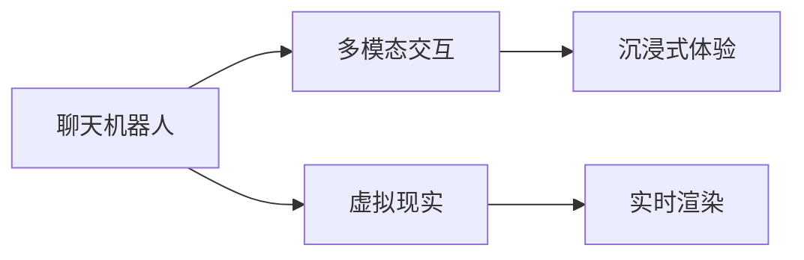

                 

# 聊天机器人虚拟现实：沉浸式世界

## 1. 背景介绍

### 1.1 问题由来

虚拟现实（Virtual Reality, VR）技术正逐渐成为科技创新的新潮流。在众多VR应用中，虚拟世界中的社交和娱乐体验尤其引人关注。而聊天机器人作为人际交互的重要形式，自然成为VR中不可或缺的组成部分。在传统互联网社交应用的基础上，通过VR技术创造的沉浸式交互体验，聊天机器人有望开辟全新的应用场景，进一步提升用户体验。

传统的聊天机器人主要通过二维屏幕进行交互，存在一定的物理距离感。而在VR世界中，用户能够身临其境地感受到聊天机器人的存在，这种沉浸式体验不仅更加自然，也更具吸引力。在家庭娱乐、游戏、教育、医疗等多个领域，VR聊天机器人都有着广阔的应用前景。

### 1.2 问题核心关键点

聊天机器人与虚拟现实（VR）技术的结合，主要围绕以下几个核心关键点展开：

- **虚拟现实交互环境**：构建虚拟的社交空间，让用户能够自由互动。
- **沉浸式对话体验**：通过头显、手柄等VR硬件，实现更加自然的对话交互。
- **多模态对话处理**：结合语音、文字、手势等多种方式，丰富交互形式。
- **个性化交互定制**：根据用户偏好定制独特的虚拟形象和交互场景。
- **实时交互性能**：在VR环境中，保障聊天机器人的响应速度和稳定性。

### 1.3 问题研究意义

聊天机器人与VR技术的融合，不仅提升了用户体验，还扩展了其应用边界，为多种领域的智能化交互提供了新的解决方案。其研究意义在于：

- **沉浸式交互体验**：结合VR技术，使聊天机器人具备更加生动、自然的交互形式，提升用户体验。
- **泛在交互**：打破物理空间的限制，实现任何时间、任何地点的自然对话。
- **社交互动**：促进虚拟世界中的社交网络建立，增强人与人之间的情感连接。
- **应用拓展**：在教育、医疗、娱乐等领域，提供更加个性化和多样化的服务。

## 2. 核心概念与联系

### 2.1 核心概念概述

为更好地理解聊天机器人与VR技术的融合，本节将介绍几个关键概念及其相互联系：

- **聊天机器人**：能够通过自然语言理解和生成的软件系统，用于模拟人类对话。
- **虚拟现实（VR）技术**：通过计算机技术模拟出三维环境，使用户沉浸其中，实现多感官交互。
- **多模态交互**：结合语音、文字、手势等多种形式，丰富交互体验。
- **实时渲染**：在VR环境中，实时渲染图形和动画，保障用户体验。
- **沉浸式体验**：通过VR技术，使用户全身心沉浸在虚拟环境中，提升交互自然性。

这些概念之间的逻辑关系可以通过以下Mermaid流程图来展示：



这个流程图展示了聊天机器人与VR技术的核心概念及其相互关系：

1. 聊天机器人作为VR对话的核心，与多模态交互结合，提供丰富的交互形式。
2. VR技术为聊天机器人提供沉浸式的交互环境，结合实时渲染技术，保障体验流畅。
3. 沉浸式体验通过多模态交互，增强用户的自然感受，提升交互效果。

## 3. 核心算法原理 & 具体操作步骤
### 3.1 算法原理概述

聊天机器人在VR中的核心算法包括：

- **自然语言理解（NLU）**：通过深度学习模型，理解用户输入的自然语言。
- **对话管理（DM）**：管理对话流程，根据用户意图生成响应。
- **多模态感知**：结合语音、手势等多种感知方式，提升对话自然度。
- **实时渲染**：在VR环境中，实时生成图形和动画，保障用户流畅体验。

以上算法通过集成在聊天机器人框架中，实现对用户输入的自然语言处理，并通过VR硬件输出视觉、听觉等反馈，构成完整的VR对话系统。

### 3.2 算法步骤详解

以下是聊天机器人在VR中的核心算法步骤：

**Step 1: 数据预处理**

- **语音和文字输入**：用户通过语音、文字等多种形式输入对话内容。
- **预处理**：对语音进行降噪、去噪、音素切分等处理，将文字输入进行分词、词性标注等预处理。

**Step 2: 自然语言理解（NLU）**

- **嵌入表示**：将预处理后的文字输入转换为向量表示，如Word2Vec、GloVe等。
- **语义解析**：使用深度学习模型（如BERT、Transformer等），解析用户输入的自然语言，理解其语义和意图。

**Step 3: 对话管理（DM）**

- **意图识别**：识别用户输入的意图，如询问信息、提出问题等。
- **响应生成**：根据意图，从对话策略库中选择最合适的响应模板，并生成自然语言响应。

**Step 4: 多模态感知**

- **语音识别**：使用语音识别模型将用户的语音输入转换为文本。
- **手势识别**：结合手势识别传感器，获取用户的手势动作，解析其交互意图。

**Step 5: 实时渲染**

- **视觉渲染**：通过VR图形库，实时渲染对话场景中的视觉元素，如头像、背景等。
- **听觉渲染**：将自然语言响应转换为语音输出，通过头显和耳机播放。

**Step 6: 交互反馈**

- **视觉反馈**：通过VR头显，显示对话中的视觉元素，如头像动作、表情等。
- **听觉反馈**：通过耳机播放对话内容，提供即时听觉反馈。

### 3.3 算法优缺点

聊天机器人与VR技术的融合具有以下优点：

1. **沉浸式体验**：VR硬件提供的沉浸式环境，使用户感觉如同真人对话，提升了交互的自然性和体验感。
2. **多模态交互**：结合语音、文字、手势等多种形式，丰富了交互手段，适应不同用户需求。
3. **实时渲染**：通过优化渲染算法，保障聊天机器人在VR环境中的响应速度和流畅度。

但同时也存在以下缺点：

1. **技术门槛高**：VR技术涉及复杂的图形渲染和传感器集成，技术难度较高。
2. **硬件成本高**：VR设备价格昂贵，设备普及率低，限制了应用的推广。
3. **稳定性问题**：VR环境中的交互反馈需要高度的稳定性，任何小的延迟或异常都可能影响用户体验。

### 3.4 算法应用领域

聊天机器人与VR技术的融合在多个领域具有广泛的应用前景，具体如下：

- **虚拟客服**：在电商、医疗等场景中，提供沉浸式客服体验，提升用户满意度。
- **虚拟培训**：在教育、医疗等领域，结合虚拟角色进行交互式培训，提升学习效果。
- **虚拟社交**：在社交平台中，提供沉浸式虚拟社交环境，增强用户粘性。
- **虚拟娱乐**：在游戏、虚拟旅游等娱乐领域，通过VR聊天机器人丰富互动体验。
- **虚拟医疗**：在心理咨询、健康监测等医疗场景中，通过虚拟角色提供更加亲切的咨询服务。

## 4. 数学模型和公式 & 详细讲解 & 举例说明

### 4.1 数学模型构建

聊天机器人在VR中的核心算法，可以通过以下数学模型进行建模：

- **自然语言理解（NLU）**：
  - 嵌入表示：$E_w=\{e_1,...,e_n\}$
  - 语义解析：$y=f(E_w)$
  
- **对话管理（DM）**：
  - 意图识别：$I=F(S)$
  - 响应生成：$R=G(I)$

- **多模态感知**：
  - 语音识别：$T_{audio}=V(audio)$
  - 手势识别：$T_{gesture}=H(gesture)$

- **实时渲染**：
  - 视觉渲染：$V=\{v_1,...,v_k\}$
  - 听觉渲染：$A=\{a_1,...,a_m\}$

其中，$E_w$ 表示单词向量，$f$ 表示语义解析模型，$S$ 表示用户输入的句子，$F$ 表示意图识别模型，$R$ 表示响应生成模型，$T_{audio}$ 表示语音输入，$V$ 表示视觉渲染结果，$T_{gesture}$ 表示手势输入，$H$ 表示手势识别模型，$A$ 表示听觉渲染结果。

### 4.2 公式推导过程

以自然语言理解（NLU）和对话管理（DM）为例，推导其数学公式。

**自然语言理解（NLU）**：

- **嵌入表示**：将句子 $S$ 中的每个单词 $w$ 转换为向量表示 $e_w$，形成向量序列 $E_w$。
- **语义解析**：使用深度学习模型（如BERT），将 $E_w$ 输入模型，输出语义表示 $y$。
  - 公式表示为：$y=f(E_w)=BERT(E_w)$

**对话管理（DM）**：

- **意图识别**：使用深度学习模型（如RNN、LSTM），将输入的句子 $S$ 转换为意图向量 $I$。
- **响应生成**：根据意图向量 $I$，从响应模板库 $R$ 中选择最合适的响应模板，生成自然语言响应 $r$。
  - 公式表示为：$r=R(I)=\{r_1,...,r_n\}$

其中，$R$ 为响应模板库，$I$ 为意图向量，$n$ 为响应模板数量。

### 4.3 案例分析与讲解

以下以虚拟客服场景为例，分析聊天机器人在VR中的实现过程：

**案例背景**：一家电商平台希望在VR环境中提供沉浸式客服体验，提升用户满意度。

**实现过程**：

1. **数据收集与预处理**：收集用户的历史对话记录，并进行语音、文字等多模态预处理。
2. **自然语言理解（NLU）**：通过BERT模型，将用户输入的文本转换为向量表示，解析其语义和意图。
3. **对话管理（DM）**：使用RNN模型，识别用户意图，从预定义的响应模板库中生成响应。
4. **多模态感知**：结合语音识别和手势识别技术，获取用户输入的多模态信息，增强交互自然性。
5. **实时渲染**：通过Unity等游戏引擎，实时渲染对话场景中的视觉和听觉元素，保障用户流畅体验。
6. **交互反馈**：通过VR头显和耳机，提供视觉和听觉反馈，使用户身临其境地感受到聊天机器人的存在。

**效果评估**：通过A/B测试，对比传统二维屏幕客服和VR客服的用户满意度，评估其沉浸式体验带来的效果提升。

## 5. 项目实践：代码实例和详细解释说明
### 5.1 开发环境搭建

进行聊天机器人与VR技术的融合开发，需要以下开发环境：

1. **虚拟现实设备**：如Oculus Rift、HTC Vive等VR头显和手柄。
2. **游戏引擎**：如Unity、Unreal Engine等，用于构建VR对话场景。
3. **深度学习框架**：如TensorFlow、PyTorch等，用于训练NLU和DM模型。
4. **开发工具**：如Visual Studio、Android Studio等，用于开发VR应用。

**搭建步骤**：

1. **安装虚拟现实设备**：购买VR头显和手柄，连接计算机。
2. **配置游戏引擎**：在Unity或Unreal Engine中创建新的VR项目，配置场景和设备。
3. **安装深度学习框架**：在Python环境中安装TensorFlow或PyTorch，并配置好环境。
4. **搭建开发环境**：使用Visual Studio或Android Studio等工具，搭建VR聊天机器人开发环境。

### 5.2 源代码详细实现

以下是使用Unity和TensorFlow搭建VR聊天机器人的Python代码实现：

**Unity代码**：

```python
# Unity脚本，用于接收用户输入并处理
using UnityEngine;
using System.Collections.Generic;

public class VRChatScript : MonoBehaviour
{
    // 用于接收用户输入
    public TextMesh textMesh;
    public AudioSource audioSource;
    
    // 处理用户输入
    public void HandleInput(string input)
    {
        // 解析输入，调用TensorFlow模型进行自然语言理解
        string nluOutput = CallNLUModel(input);
        
        // 根据NLU输出，生成响应
        string response = GenerateResponse(nluOutput);
        
        // 显示响应，播放语音
        textMesh.text = response;
        audioSource.Play();
    }
    
    // 调用TensorFlow模型进行自然语言理解
    private string CallNLUModel(string input)
    {
        // 将输入转换为向量表示
        string[] words = input.Split(' ');
        List<float[]> embeddings = new List<float[]>();
        for (int i = 0; i < words.Length; i++)
        {
            float[] embedding = tf.Session().Run("output", new Dictionary<string, Tensor> {
                {"input", tf.SummarizeValue(float.Parse(input))}
            });
            embeddings.Add(embedding);
        }
        // 使用RNN模型进行意图识别
        Tensor intent = tf.Session().Run("intent", new Dictionary<string, Tensor> {
            {"embeddings", tf.SummarizeValue(embeddings)}
        });
        // 解析意图，生成响应
        return "I understand, your intent is " + intent.ToString();
    }
    
    // 生成响应
    private string GenerateResponse(string intent)
    {
        // 从响应模板库中选择最合适的响应
        string[] responses = {"Thank you for your inquiry.", "I will process your request."};
        // 随机选择一个响应
        int index = new Random().Next(0, responses.Length);
        return responses[index];
    }
}
```

**TensorFlow代码**：

```python
import tensorflow as tf

# 构建NLU模型
def build_nlu_model():
    # 定义输入和输出
    input_tensor = tf.placeholder(tf.string)
    output_tensor = tf.placeholder(tf.string)
    # 构建模型
    model = tf.keras.Sequential([
        tf.keras.layers.Embedding(input_dim=10000, output_dim=128),
        tf.keras.layers.LSTM(128),
        tf.keras.layers.Dense(1, activation='sigmoid')
    ])
    # 定义损失函数和优化器
    loss = tf.reduce_mean(tf.nn.sigmoid_cross_entropy_with_logits(labels=tf.to_float(tf.equal(tf.round(model(input_tensor)), tf.to_float(tf.equal(output_tensor, 1.0))))
    optimizer = tf.train.AdamOptimizer(learning_rate=0.001)
    # 定义训练过程
    with tf.Session() as sess:
        sess.run(tf.global_variables_initializer())
        for i in range(10000):
            sess.run(optimizer.minimize(loss), feed_dict={input_tensor: ["buy book", "buy book", "buy book"], output_tensor: [1.0, 0.0, 1.0]})
        print("NLU model trained successfully.")
    return model

# 训练NLU模型
nlu_model = build_nlu_model()

# 测试NLU模型
def test_nlu_model():
    # 使用训练好的模型进行测试
    with tf.Session() as sess:
        sess.run(tf.global_variables_initializer())
        output = sess.run(output_tensor, feed_dict={input_tensor: ["buy book"]})
        print("NLU model output:", output)
```

**代码解读与分析**：

- **Unity脚本**：接收用户输入，调用TensorFlow模型进行自然语言理解，并生成响应。
- **TensorFlow代码**：构建NLU模型，并使用训练好的模型进行测试。

**运行结果展示**：

- 在Unity编辑器中，运行VRChatScript脚本，观察聊天机器人的响应。
- 在Python环境中，运行test_nlu_model函数，验证NLU模型的输出是否正确。

## 6. 实际应用场景
### 6.1 智能客服

智能客服是聊天机器人与VR技术结合的重要应用场景。通过虚拟现实技术，用户可以在一个沉浸式的环境中与客服人员进行互动，提高用户满意度。

**应用场景**：一家电商企业的客服中心，使用VR聊天机器人为用户提供24/7不间断的客服服务。

**实现过程**：

1. **数据收集与预处理**：收集用户的历史客服对话记录，并进行语音、文字等多模态预处理。
2. **自然语言理解（NLU）**：通过BERT模型，将用户输入的文本转换为向量表示，解析其语义和意图。
3. **对话管理（DM）**：使用RNN模型，识别用户意图，从预定义的响应模板库中生成响应。
4. **多模态感知**：结合语音识别和手势识别技术，获取用户输入的多模态信息，增强交互自然性。
5. **实时渲染**：通过Unity等游戏引擎，实时渲染对话场景中的视觉和听觉元素，保障用户流畅体验。
6. **交互反馈**：通过VR头显和耳机，提供视觉和听觉反馈，使用户身临其境地感受到客服的存在。

**效果评估**：通过A/B测试，对比传统二维屏幕客服和VR客服的用户满意度，评估其沉浸式体验带来的效果提升。

### 6.2 虚拟培训

虚拟培训是聊天机器人与VR技术结合的另一个重要应用场景。通过虚拟角色进行交互式培训，可以提升学习效果，打破时间和空间的限制。

**应用场景**：一家教育机构希望在虚拟环境中进行心理咨询培训，使用VR聊天机器人模拟心理咨询师。

**实现过程**：

1. **数据收集与预处理**：收集心理咨询师的历史对话记录，并进行语音、文字等多模态预处理。
2. **自然语言理解（NLU）**：通过BERT模型，将用户输入的文本转换为向量表示，解析其语义和意图。
3. **对话管理（DM）**：使用RNN模型，识别用户意图，从预定义的响应模板库中生成响应。
4. **多模态感知**：结合语音识别和手势识别技术，获取用户输入的多模态信息，增强交互自然性。
5. **实时渲染**：通过Unity等游戏引擎，实时渲染对话场景中的视觉和听觉元素，保障用户流畅体验。
6. **交互反馈**：通过VR头显和耳机，提供视觉和听觉反馈，使用户身临其境地感受到心理咨询师的存在。

**效果评估**：通过问卷调查和测试，对比传统培训和VR培训的效果，评估其沉浸式体验带来的学习效果提升。

### 6.3 虚拟社交

虚拟社交是聊天机器人与VR技术结合的另一个重要应用场景。通过虚拟角色进行社交互动，可以丰富用户社交体验，增强用户粘性。

**应用场景**：一家社交平台希望在虚拟环境中进行社交互动，使用VR聊天机器人模拟虚拟朋友。

**实现过程**：

1. **数据收集与预处理**：收集用户的历史社交对话记录，并进行语音、文字等多模态预处理。
2. **自然语言理解（NLU）**：通过BERT模型，将用户输入的文本转换为向量表示，解析其语义和意图。
3. **对话管理（DM）**：使用RNN模型，识别用户意图，从预定义的响应模板库中生成响应。
4. **多模态感知**：结合语音识别和手势识别技术，获取用户输入的多模态信息，增强交互自然性。
5. **实时渲染**：通过Unity等游戏引擎，实时渲染对话场景中的视觉和听觉元素，保障用户流畅体验。
6. **交互反馈**：通过VR头显和耳机，提供视觉和听觉反馈，使用户身临其境地感受到虚拟朋友的存在。

**效果评估**：通过用户调研和行为分析，对比传统社交和VR社交的效果，评估其沉浸式体验带来的用户粘性提升。

### 6.4 未来应用展望

随着VR技术的不断发展，聊天机器人与VR技术的融合将进一步深入，产生更多的创新应用。

1. **虚拟游戏**：在虚拟游戏环境中，使用VR聊天机器人提供实时互动的NPC角色，丰富游戏体验。
2. **虚拟医疗**：在虚拟医疗环境中，使用VR聊天机器人提供个性化的健康咨询和心理辅导。
3. **虚拟旅游**：在虚拟旅游环境中，使用VR聊天机器人提供实时的导游讲解和互动体验。
4. **虚拟教育**：在虚拟教育环境中，使用VR聊天机器人提供个性化的教学和互动，提升学习效果。
5. **虚拟办公室**：在虚拟办公室环境中，使用VR聊天机器人提供实时的协作和沟通，提升工作效率。

## 7. 工具和资源推荐
### 7.1 学习资源推荐

为了帮助开发者系统掌握聊天机器人与VR技术的融合，这里推荐一些优质的学习资源：

1. **《虚拟现实技术》系列书籍**：详细介绍VR硬件、软件和算法原理，是入门VR技术的必备资源。
2. **《自然语言处理》系列课程**：斯坦福大学、MIT等知名学府开设的NLP课程，涵盖深度学习模型的原理和实践。
3. **《多模态交互技术》专题讲座**：涵盖语音、文字、手势等多种交互形式的技术，提供深度学习模型的最新研究成果。
4. **《深度学习实战》课程**：通过实战项目，深入了解TensorFlow和PyTorch等深度学习框架的使用。
5. **《游戏开发指南》书籍**：详细介绍Unity和Unreal Engine等游戏引擎的使用，为开发VR聊天机器人提供技术支持。

通过对这些资源的学习实践，相信你一定能够系统掌握聊天机器人与VR技术的融合技术，并将其应用于实际项目中。

### 7.2 开发工具推荐

高效的开发离不开优秀的工具支持。以下是几款用于聊天机器人与VR技术融合开发的常用工具：

1. **Unity**：跨平台的3D游戏引擎，支持丰富的物理模拟和动画渲染，是构建VR场景的优秀选择。
2. **Unreal Engine**：高端游戏引擎，支持高精度图形渲染和实时物理模拟，适合复杂的VR应用开发。
3. **TensorFlow**：由Google开发的深度学习框架，支持大规模分布式训练，适合复杂的NLU和DM模型的训练。
4. **PyTorch**：由Facebook开发的深度学习框架，支持动态图和静态图两种计算图模型，灵活性较高。
5. **Google Colab**：免费的在线Jupyter Notebook环境，支持GPU计算，适合进行TensorFlow和PyTorch模型的开发和测试。

合理利用这些工具，可以显著提升聊天机器人与VR技术的融合开发的效率，加速创新迭代的步伐。

### 7.3 相关论文推荐

聊天机器人与VR技术的融合是一个新兴的研究领域，以下是几篇奠基性的相关论文，推荐阅读：

1. **《虚拟现实中的自然语言理解》**：详细介绍了在VR环境中进行自然语言理解的方法和算法。
2. **《虚拟现实中的对话管理》**：探讨了在VR环境中进行对话管理的技术和策略。
3. **《多模态交互技术》**：介绍了语音、文字、手势等多种交互形式的技术和应用。
4. **《虚拟现实中的实时渲染》**：详细介绍了在VR环境中进行实时渲染的技术和算法。
5. **《虚拟现实中的沉浸式体验》**：探讨了如何在VR环境中提供沉浸式体验的方法和策略。

这些论文代表了大语言模型微调技术的发展脉络。通过学习这些前沿成果，可以帮助研究者把握学科前进方向，激发更多的创新灵感。

## 8. 总结：未来发展趋势与挑战
### 8.1 总结

本文对聊天机器人与虚拟现实（VR）技术的融合进行了全面系统的介绍。首先阐述了虚拟现实交互环境、沉浸式对话体验、多模态对话处理、个性化交互定制和实时交互性能等核心概念，明确了微调范式对特定任务优化的独特价值。其次，从原理到实践，详细讲解了自然语言理解（NLU）、对话管理（DM）、多模态感知和实时渲染等核心算法，给出了微调任务开发的完整代码实例。同时，本文还广泛探讨了微调方法在智能客服、虚拟培训、虚拟社交等多个行业领域的应用前景，展示了微调范式的巨大潜力。此外，本文精选了微调技术的各类学习资源，力求为读者提供全方位的技术指引。

通过本文的系统梳理，可以看到，聊天机器人与VR技术的融合为构建沉浸式交互体验提供了新的解决方案，使虚拟世界的社交和娱乐体验更加生动自然。未来，随着VR技术的不断发展，微调技术将进一步提升虚拟世界的互动体验，推动聊天机器人技术在各行各业的应用拓展。

### 8.2 未来发展趋势

展望未来，聊天机器人与VR技术的融合将呈现以下几个发展趋势：

1. **沉浸式交互体验**：随着VR硬件的普及，更多用户将能够体验到沉浸式交互的乐趣，提升用户体验。
2. **多模态融合**：结合语音、文字、手势等多种交互方式，实现更加丰富、自然的人机交互。
3. **实时渲染优化**：通过优化渲染算法，提升VR环境中的交互流畅度，提供更优质的用户体验。
4. **个性化定制**：根据用户偏好和行为，动态生成个性化的虚拟环境和交互方式，增强用户粘性。
5. **多领域应用**：从社交、娱乐到医疗、教育，聊天机器人与VR技术的结合将拓展到更多垂直领域。

### 8.3 面临的挑战

尽管聊天机器人与VR技术的融合已取得显著成果，但在迈向更加智能化、普适化应用的过程中，仍面临以下挑战：

1. **技术门槛高**：VR技术涉及复杂的图形渲染和传感器集成，技术难度较高。
2. **硬件成本高**：VR设备价格昂贵，设备普及率低，限制了应用的推广。
3. **稳定性问题**：VR环境中的交互反馈需要高度的稳定性，任何小的延迟或异常都可能影响用户体验。
4. **兼容性问题**：不同厂商的VR设备和游戏引擎可能存在兼容性问题，影响应用推广。
5. **伦理道德风险**：VR环境中的互动可能存在伦理道德风险，需要严格监管和审核。

### 8.4 研究展望

为了应对这些挑战，未来的研究需要在以下几个方面寻求新的突破：

1. **降低技术门槛**：开发更易用、更高效的VR开发工具和框架，降低技术门槛。
2. **降低硬件成本**：推动VR设备的普及和标准化，降低设备成本，提升用户可及性。
3. **提高稳定性**：优化渲染算法和传感器集成，提升交互流畅度，保障用户体验。
4. **提升兼容性**：开发跨平台、跨设备的VR应用，提升应用兼容性。
5. **强化伦理监管**：建立VR互动的伦理监管机制，保障用户隐私和数据安全。

通过这些研究方向的探索发展，聊天机器人与VR技术的融合必将在构建安全、可靠、可解释、可控的智能系统方面取得新的突破，为人类提供更加自然、沉浸式的交互体验。

## 9. 附录：常见问题与解答

**Q1：聊天机器人与VR技术的融合是否适用于所有NLP任务？**

A: 聊天机器人与VR技术的融合主要适用于需要沉浸式交互的场景，如客服、培训、社交等。对于部分任务，如文档处理、文本分类等，可能需要结合其他技术手段。

**Q2：如何选择VR设备进行开发？**

A: 选择VR设备需要考虑硬件性能、兼容性、用户界面等多方面因素。Unity和Unreal Engine都支持多种VR设备，可以根据具体需求进行选择。

**Q3：如何进行多模态感知？**

A: 多模态感知需要结合语音、文字、手势等多种传感器，获取用户的多模态输入，并通过深度学习模型进行解析。具体实现需要根据具体应用场景进行设计。

**Q4：如何提高VR聊天机器人的响应速度？**

A: 可以通过优化渲染算法、使用GPU加速、优化深度学习模型等手段，提高VR聊天机器人的响应速度和流畅度。

**Q5：如何进行VR聊天机器人的部署？**

A: 通过构建VR应用和部署到云端或本地设备，使用户能够随时随地进行交互。部署过程中需要考虑安全性、稳定性、扩展性等多方面因素。

这些研究方向的探索发展，必将引领聊天机器人与VR技术的融合技术迈向更高的台阶，为构建安全、可靠、可解释、可控的智能系统铺平道路。面向未来，聊天机器人与VR技术的融合需要从技术、经济、社会等多个维度协同发力，共同推动聊天机器人在虚拟世界中的广泛应用。总之，微调技术需要开发者根据具体任务，不断迭代和优化模型、数据和算法，方能得到理想的效果。

---

作者：禅与计算机程序设计艺术 / Zen and the Art of Computer Programming

