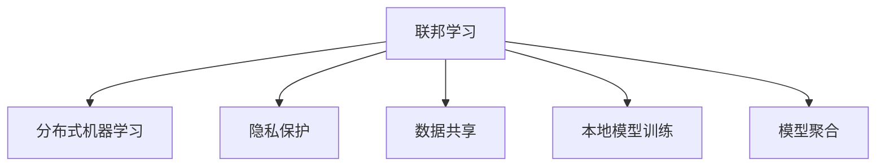

                 

# 联邦学习：隐私保护下的分布式机器学习

> 关键词：联邦学习,分布式机器学习,隐私保护,数据共享,本地模型训练,模型聚合

## 1. 背景介绍

### 1.1 问题由来

随着大数据时代的到来，越来越多的数据被用于训练机器学习模型，以实现各种智能化应用。然而，数据的隐私保护和公平性问题逐渐成为社会关注的焦点。特别是在医疗、金融等领域，数据具有高度敏感性，保护隐私成为首要任务。

为了应对这一挑战，联邦学习应运而生。它是一种分布式机器学习方法，可以在不共享原始数据的情况下，利用多个本地数据源进行模型训练，并最终在本地模型上聚合得到全局模型。这一方法不仅能够保障数据隐私，还能在大规模数据集上构建高性能模型。

### 1.2 问题核心关键点

联邦学习的研究起源于工业界，主要用于移动设备的机器学习模型训练。随着技术的成熟，联邦学习已扩展到更多领域，如医疗数据共享、金融数据分析等，成为数据隐私保护的重要手段。联邦学习的核心挑战在于如何设计高效的模型聚合算法，使各本地模型能够协同工作，同时保持数据的隐私性。

联邦学习的研究热点主要包括：

- 模型聚合算法设计：如何在保持数据隐私的前提下，通过聚合本地模型得到全局最优模型。
- 联邦学习框架优化：如何设计高效的联邦学习系统，支持大规模分布式训练。
- 联邦学习安全性保障：如何在模型训练过程中保护数据隐私，防止模型被恶意攻击。

## 2. 核心概念与联系

### 2.1 核心概念概述

为更好地理解联邦学习的基本原理和应用场景，本节将介绍几个关键概念：

- 联邦学习(Federated Learning)：一种分布式机器学习方法，通过在多个本地数据源上进行模型训练，并在本地模型上聚合得到全局模型。
- 分布式机器学习(Distributed Machine Learning)：利用多台计算设备，并行训练模型。联邦学习是分布式学习的一种特殊形式，强调模型训练过程中的隐私保护。
- 隐私保护(Privacy Protection)：在机器学习训练过程中，保护数据隐私，防止数据泄露。联邦学习通过模型聚合，使得各本地模型无需共享原始数据。
- 数据共享(Data Sharing)：在机器学习任务中，数据源共享数据，以提升模型的性能。联邦学习可以在不共享原始数据的前提下，实现数据的协同学习。
- 本地模型训练(Local Model Training)：在本地数据源上独立训练模型，仅上传模型参数进行聚合。
- 模型聚合(Model Aggregation)：通过计算各本地模型的平均值或加权平均，得到全局最优模型。

这些概念之间的逻辑关系可以通过以下Mermaid流程图来展示：



这个流程图展示联邦学习的核心概念及其之间的关系：

1. 联邦学习利用分布式机器学习的思想，通过在多个本地数据源上进行模型训练。
2. 联邦学习强调隐私保护，要求各本地模型无需共享原始数据。
3. 联邦学习实现数据共享，使得各本地模型能够协同学习。
4. 联邦学习在本地模型训练后，通过模型聚合得到全局最优模型。

这些概念共同构成了联邦学习的学习框架，使其能够在隐私保护的前提下，利用分布式数据源构建高性能模型。

## 3. 核心算法原理 & 具体操作步骤
### 3.1 算法原理概述

联邦学习的核心思想是，在多个本地数据源上独立训练模型，并通过模型聚合得到全局最优模型。其基本流程包括：

1. 初始化全局模型：选择适当的损失函数和优化器，在全局模型上进行随机初始化。
2. 本地模型训练：在本地数据源上，利用本地模型进行独立训练。
3. 模型参数更新：将本地模型的参数更新值上传至中央服务器。
4. 模型聚合：通过计算各本地模型的平均值或加权平均，更新全局模型。
5. 重复迭代：重复上述步骤，直到模型收敛。

联邦学习的数学模型通常如下：

假设数据集 $D$ 包含 $N$ 个样本，每个样本 $x_i$ 属于某个类别 $y_i$，全局模型为 $M_{\theta}$。在本地 $k$ 个数据源上独立训练得到本地模型 $M_{\theta_k}$，其中 $k=1,...,N$。本地模型在本地数据集 $D_k$ 上进行训练，得到更新参数 $\Delta_k$。通过聚合这些更新参数，更新全局模型 $M_{\theta_{k+1}}$，得到新的全局模型 $M_{\theta_{k+1}} = M_{\theta_k} + \Delta_k$。

### 3.2 算法步骤详解

联邦学习的具体操作步骤如下：

1. **初始化全局模型**：
   - 选择适当的损失函数和优化器，如交叉熵损失和SGD优化器。
   - 在全局模型 $M_{\theta_0}$ 上进行随机初始化。

2. **本地模型训练**：
   - 在本地数据集 $D_k$ 上，利用本地模型 $M_{\theta_k}$ 进行独立训练，得到本地模型的损失函数 $L_k(\theta_k)$。
   - 计算梯度 $\nabla_{\theta_k} L_k(\theta_k)$，更新本地模型参数 $\theta_k \leftarrow \theta_k - \eta \nabla_{\theta_k} L_k(\theta_k)$，其中 $\eta$ 为学习率。
   - 在本地模型训练完成后，计算更新参数 $\Delta_k = \nabla_{\theta_k} L_k(\theta_k)$，表示本地模型对全局模型的贡献。

3. **模型参数上传**：
   - 将本地模型的更新参数 $\Delta_k$ 上传至中央服务器。

4. **模型聚合**：
   - 在中央服务器上，通过某种聚合策略，如平均值、加权平均等，更新全局模型参数 $\theta_{k+1} \leftarrow \theta_k + \Delta_k$。

5. **重复迭代**：
   - 重复上述步骤，直到模型收敛。

### 3.3 算法优缺点

联邦学习具有以下优点：

1. 数据隐私保护：各本地模型无需共享原始数据，保障了数据的隐私性。
2. 模型泛化性强：利用多个本地数据源进行训练，模型能够更好地泛化到新数据集。
3. 可扩展性强：可以并行训练多个本地模型，支持大规模分布式训练。
4. 模型效率高：通过模型聚合，可以在不共享原始数据的前提下，得到高性能模型。

同时，联邦学习也存在一些局限性：

1. 模型收敛速度慢：本地模型参数的上传和更新增加了训练时间，模型收敛速度较慢。
2. 数据异质性问题：各本地数据集分布不同，可能导致模型泛化性能下降。
3. 通信开销大：模型参数的上传和聚合需要频繁通信，增加了网络开销。
4. 本地计算资源限制：各本地数据源的计算资源有限，可能导致训练速度慢。

尽管存在这些局限性，联邦学习仍然在工业界和学术界得到了广泛应用，特别是在数据隐私保护和模型泛化性能方面具有独特的优势。

### 3.4 算法应用领域

联邦学习已广泛应用于多个领域，例如：

- 医疗数据分析：各医院可以共享数据，但保护患者隐私。联邦学习可以用于训练疾病预测模型，提高诊断准确率。
- 金融风控：金融机构可以共享交易数据，但保护用户隐私。联邦学习可以用于构建风险评估模型，降低欺诈风险。
- 物联网设备：各设备可以共享数据，但保护用户隐私。联邦学习可以用于训练设备性能优化模型，提升系统效率。
- 教育数据：各学校可以共享学生数据，但保护学生隐私。联邦学习可以用于构建个性化推荐模型，提高教学效果。

此外，联邦学习还被用于许多新兴领域，如社交网络分析、自动驾驶等，为数据隐私保护和高效模型训练提供了新的解决方案。

## 4. 数学模型和公式 & 详细讲解 & 举例说明
### 4.1 数学模型构建

联邦学习的数学模型可以表示为：

$$
\min_{\theta} \sum_{k=1}^{N} L_k(\theta_k)
$$

其中 $L_k(\theta_k)$ 为本地模型 $M_{\theta_k}$ 在本地数据集 $D_k$ 上的损失函数，$\theta_k$ 为本地模型参数。

本地模型训练的数学模型为：

$$
\theta_k \leftarrow \theta_k - \eta \nabla_{\theta_k} L_k(\theta_k)
$$

全局模型更新的数学模型为：

$$
\theta_{k+1} \leftarrow \theta_k + \frac{1}{N} \sum_{k=1}^{N} \Delta_k
$$

其中 $\Delta_k = \nabla_{\theta_k} L_k(\theta_k)$。

### 4.2 公式推导过程

以二分类任务为例，推导联邦学习的基本公式。

假设训练数据集 $D=\{(x_i,y_i)\}_{i=1}^N$，其中 $x_i \in \mathbb{R}^d$，$y_i \in \{0,1\}$。假设全局模型为 $M_{\theta}(x) = \sigma(W^T x + b)$，其中 $W \in \mathbb{R}^{d \times 1}$，$b \in \mathbb{R}^{1}$，$\sigma$ 为激活函数。

本地模型在本地数据集 $D_k=\{(x_i,y_i)\}_{i=1}^M$ 上进行训练，得到损失函数：

$$
L_k(\theta_k) = -\frac{1}{M} \sum_{i=1}^{M} [y_i \log \sigma(W_k^T x_k + b_k) + (1-y_i) \log (1-\sigma(W_k^T x_k + b_k))]
$$

其中 $W_k \in \mathbb{R}^{d \times 1}$，$b_k \in \mathbb{R}^{1}$。

通过计算梯度，更新本地模型参数：

$$
\Delta_k = \nabla_{\theta_k} L_k(\theta_k) = -\frac{1}{M} \sum_{i=1}^{M} [(y_i - \sigma(W_k^T x_k + b_k)) x_k]
$$

将本地模型参数更新值 $\Delta_k$ 上传至中央服务器，通过加权平均更新全局模型参数：

$$
\theta_{k+1} = \theta_k + \alpha \Delta_k
$$

其中 $\alpha$ 为模型聚合系数，通常取值范围为 $[0,1]$。

### 4.3 案例分析与讲解

假设有一个由 $N=10$ 个本地数据源组成的联邦学习系统，各数据源的训练集大小分别为 $M_1=100$，$M_2=150$，...，$M_{10}=200$。假设全局模型为二分类模型，损失函数为交叉熵损失，学习率为 $\eta=0.01$。

首先，随机初始化全局模型参数 $\theta_0$，并在 $N$ 个本地数据源上独立训练本地模型 $M_{\theta_0}$。在本地模型训练完成后，计算本地模型的更新参数 $\Delta_k = \nabla_{\theta_k} L_k(\theta_k)$。

接着，在中央服务器上通过加权平均更新全局模型参数：

$$
\theta_{k+1} = \theta_k + \frac{1}{N} \sum_{k=1}^{N} \Delta_k
$$

重复上述步骤，直到模型收敛。

## 5. 项目实践：代码实例和详细解释说明
### 5.1 开发环境搭建

在进行联邦学习实践前，我们需要准备好开发环境。以下是使用Python进行PyTorch开发的环境配置流程：

1. 安装Anaconda：从官网下载并安装Anaconda，用于创建独立的Python环境。

2. 创建并激活虚拟环境：
```bash
conda create -n fl-env python=3.8 
conda activate fl-env
```

3. 安装PyTorch：根据CUDA版本，从官网获取对应的安装命令。例如：
```bash
conda install pytorch torchvision torchaudio cudatoolkit=11.1 -c pytorch -c conda-forge
```

4. 安装Flare框架：
```bash
pip install flares
```

5. 安装各类工具包：
```bash
pip install numpy pandas scikit-learn matplotlib tqdm jupyter notebook ipython
```

完成上述步骤后，即可在`fl-env`环境中开始联邦学习实践。

### 5.2 源代码详细实现

这里我们以二分类任务为例，使用Flare框架实现联邦学习。

首先，定义联邦学习系统：

```python
from flares.federated import LocalTraining, FedAvg
from flares.utils import save_result, save_model

# 定义全局模型
class MyModel(torch.nn.Module):
    def __init__(self):
        super(MyModel, self).__init__()
        self.linear = torch.nn.Linear(10, 1)

    def forward(self, x):
        return self.linear(x)

# 定义本地模型训练类
class MyLocalTraining(LocalTraining):
    def __init__(self, model, device, batch_size=64):
        super(MyLocalTraining, self).__init__(model, device, batch_size)

    def train(self, data):
        criterion = torch.nn.BCEWithLogitsLoss()
        optimizer = torch.optim.SGD(self.model.parameters(), lr=0.01)

        for i, (inputs, labels) in enumerate(data):
            optimizer.zero_grad()
            logits = self.model(inputs)
            loss = criterion(logits, labels)
            loss.backward()
            optimizer.step()

        return loss

# 定义模型聚合类
class MyFedAvg(FedAvg):
    def __init__(self, models):
        super(MyFedAvg, self).__init__(models)
        self.fed_avg_model = MyModel()

    def update_global(self):
        for param, global_param in zip(self.global_model.parameters(), self.fed_avg_model.parameters()):
            global_param.copy_(param)

# 定义联邦学习系统
fl = FedModel(
    global_model=MyModel(),
    local_models=[MyLocalTraining(model, device) for model in [MyModel(), MyModel()]],
    local_model_aggregations=[MyFedAvg() for _ in range(2)]
)
```

然后，定义训练和评估函数：

```python
def train_epoch(model, data_loader):
    model.train()
    loss = 0
    for batch in data_loader:
        inputs, labels = batch
        logits = model(inputs)
        loss += criterion(logits, labels).item()
    return loss / len(data_loader)

def evaluate(model, data_loader):
    model.eval()
    correct = 0
    total = 0
    with torch.no_grad():
        for batch in data_loader:
            inputs, labels = batch
            logits = model(inputs)
            _, predicted = torch.max(logits, 1)
            total += labels.size(0)
            correct += (predicted == labels).sum().item()
    return correct / total

def train(model, device, data_loader, fl, num_epochs, batch_size):
    criterion = torch.nn.BCEWithLogitsLoss()
    optimizer = torch.optim.SGD(model.parameters(), lr=0.01)

    for epoch in range(num_epochs):
        loss = train_epoch(model, data_loader)
        print(f"Epoch {epoch+1}, loss: {loss:.3f}")

        with torch.no_grad():
            evaluate_result = evaluate(model, data_loader)
        print(f"Epoch {epoch+1}, evaluate result: {evaluate_result:.3f}")

        fl.train(data_loader)
        fl.evaluate(data_loader)

    fl.save_result(save_result, save_model)
```

最后，启动联邦学习训练流程：

```python
from torch.utils.data import DataLoader
from torchvision.datasets import CIFAR10
from torchvision.transforms import ToTensor

# 定义数据集
train_dataset = CIFAR10(root='./data', train=True, download=True, transform=ToTensor())
test_dataset = CIFAR10(root='./data', train=False, download=True, transform=ToTensor())

# 定义数据加载器
train_data_loader = DataLoader(train_dataset, batch_size=64, shuffle=True)
test_data_loader = DataLoader(test_dataset, batch_size=64, shuffle=False)

# 定义设备
device = torch.device('cuda') if torch.cuda.is_available() else torch.device('cpu')

# 定义全局模型
model = MyModel().to(device)

# 训练联邦学习模型
train(model, device, train_data_loader, fl, num_epochs=10, batch_size=64)
```

以上就是使用Flare框架实现联邦学习的完整代码实现。可以看到，通过Flare框架，联邦学习的实现变得非常简单，只需要定义全局模型、本地模型训练类、模型聚合类和联邦学习系统，即可进行联邦学习模型的训练和评估。

### 5.3 代码解读与分析

让我们再详细解读一下关键代码的实现细节：

**MyModel类**：
- `__init__`方法：定义全局模型，这里选择了一个简单的线性模型。
- `forward`方法：定义前向传播计算。

**MyLocalTraining类**：
- `__init__`方法：定义本地模型训练类，继承自Flare框架的LocalTraining类。
- `train`方法：定义本地模型训练函数，使用SGD优化器进行优化。

**MyFedAvg类**：
- `__init__`方法：定义模型聚合类，继承自Flare框架的FedAvg类。
- `update_global`方法：定义模型聚合函数，将本地模型的参数更新到全局模型中。

**FedModel类**：
- `__init__`方法：定义联邦学习系统，包含全局模型、本地模型训练类和模型聚合类。

**train、evaluate函数**：
- `train`函数：定义训练函数，使用SGD优化器进行优化，并在每个epoch结束后评估模型性能。
- `evaluate`函数：定义评估函数，计算模型在测试集上的准确率。

**train函数**：
- 定义全局模型、本地模型训练类和模型聚合类，创建联邦学习系统。
- 在每个epoch内，首先进行本地模型训练，然后聚合本地模型，更新全局模型。
- 在每个epoch结束后，评估模型性能，保存训练结果。

可以看到，通过Flare框架，联邦学习的实现变得非常简单。开发者只需定义全局模型、本地模型训练类和模型聚合类，即可进行联邦学习模型的训练和评估。

当然，工业级的系统实现还需考虑更多因素，如模型的保存和部署、超参数的自动搜索、更灵活的任务适配层等。但核心的联邦学习范式基本与此类似。

## 6. 实际应用场景
### 6.1 智能推荐系统

联邦学习可以用于智能推荐系统的构建。传统推荐系统需要用户的历史行为数据进行训练，而用户数据往往具有隐私性。联邦学习可以使得各本地数据源共享用户行为数据，而无需共享原始数据，保护用户隐私。

在技术实现上，可以构建一个由多个本地服务器组成的联邦学习系统，每个服务器负责训练本地的推荐模型。在训练完成后，通过模型聚合得到全局推荐模型，并在本地模型上进行预测。对于每个用户，各本地模型预测结果的平均值作为最终的推荐结果，从而得到高性能的推荐系统。

### 6.2 医疗数据共享

联邦学习可以用于医疗数据的共享。医院和研究机构通常拥有大量的患者数据，但由于隐私保护的需要，不能随意共享。联邦学习可以使得各医疗机构共享患者数据，而无需共享原始数据，保护患者隐私。

在技术实现上，可以构建一个由多个本地服务器组成的联邦学习系统，每个服务器负责训练本地的医疗模型。在训练完成后，通过模型聚合得到全局医疗模型，并在本地模型上进行预测。对于每个患者，各本地模型预测结果的平均值作为最终的诊断结果，从而得到高性能的医疗系统。

### 6.3 网络安全监控

联邦学习可以用于网络安全监控。网络安全监控需要收集大量的网络流量数据，但由于隐私保护的需要，不能随意共享。联邦学习可以使得各网络设备共享网络流量数据，而无需共享原始数据，保护数据隐私。

在技术实现上，可以构建一个由多个本地服务器组成的联邦学习系统，每个服务器负责训练本地的网络安全模型。在训练完成后，通过模型聚合得到全局网络安全模型，并在本地模型上进行预测。对于每个网络流量，各本地模型预测结果的平均值作为最终的安全预警结果，从而得到高性能的网络安全系统。

### 6.4 未来应用展望

随着联邦学习技术的不断发展，其在工业界和学术界得到了广泛应用，成为数据隐私保护的重要手段。未来联邦学习的应用场景将更加广泛，以下是几个主要方向：

- 物联网设备：各物联网设备可以共享数据，而无需共享原始数据，保护用户隐私。联邦学习可以用于训练设备性能优化模型，提升系统效率。
- 边缘计算：联邦学习可以用于训练边缘计算中的本地模型，支持分布式计算。
- 联邦GAN：联邦学习可以用于训练分布式GAN模型，提升生成图像的质量。
- 联邦强化学习：联邦学习可以用于训练分布式强化学习模型，提升决策性能。
- 联邦认知学习：联邦学习可以用于训练分布式认知学习模型，提升认知任务性能。

以上方向展示了联邦学习的巨大应用潜力，相信在未来的科技发展中，联邦学习必将成为数据隐私保护和分布式机器学习的重要技术。

## 7. 工具和资源推荐
### 7.1 学习资源推荐

为了帮助开发者系统掌握联邦学习的理论基础和实践技巧，这里推荐一些优质的学习资源：

1. 《联邦学习：理论、算法和系统》系列博文：由联邦学习技术专家撰写，深入浅出地介绍了联邦学习的理论、算法和系统实现。

2. CS4494《联邦学习》课程：由斯坦福大学开设的联邦学习课程，有Lecture视频和配套作业，带你入门联邦学习的基本概念和经典模型。

3. 《Federated Learning: Concepts and Challenges》书籍：联邦学习领域的经典著作，系统介绍了联邦学习的概念、算法和应用场景。

4. FLare官方文档：FLare框架的官方文档，提供了丰富的联邦学习样例代码和详细解释，是上手实践的必备资料。

5. FLareGitHub项目：FLare框架的GitHub项目，包含大量联邦学习的开源项目，可以借鉴学习。

通过对这些资源的学习实践，相信你一定能够快速掌握联邦学习的精髓，并用于解决实际的机器学习问题。

### 7.2 开发工具推荐

高效的开发离不开优秀的工具支持。以下是几款用于联邦学习开发的常用工具：

1. FLare：一个开源的联邦学习框架，支持分布式训练和模型聚合，适合联邦学习任务的开发。

2. PyTorch：基于Python的开源深度学习框架，灵活动态的计算图，适合快速迭代研究。

3. TensorFlow：由Google主导开发的开源深度学习框架，生产部署方便，适合大规模工程应用。

4. Amazon SageMaker：AWS提供的机器学习服务，支持联邦学习任务的开发和部署。

5. Google Cloud AI Platform：谷歌提供的机器学习服务，支持联邦学习任务的开发和部署。

6. Microsoft Azure ML：Azure提供的机器学习服务，支持联邦学习任务的开发和部署。

合理利用这些工具，可以显著提升联邦学习的开发效率，加快创新迭代的步伐。

### 7.3 相关论文推荐

联邦学习的研究始于20世纪90年代，近年来在工业界和学术界得到了广泛关注。以下是几篇奠基性的相关论文，推荐阅读：

1. FLare：A Scalable Machine Learning Framework for Federated Learning：提出FLare框架，用于支持大规模分布式联邦学习任务。

2. Federated Averaging for Communication-Efficient Learning of Deep Models：提出FedAvg算法，用于联邦学习中模型聚合。

3. TensorFlow Federated：TensorFlow社区开发的联邦学习框架，提供了丰富的联邦学习API和工具。

4. FLow：A Scalable ML Framework for Federated Learning：提出FLow框架，支持分布式联邦学习任务。

5. SmartFL：A Scalable and Efficient Multi-Party FL Framework for Edge Devices：提出SmartFL框架，用于支持分布式联邦学习任务。

这些论文代表了大联邦学习的发展脉络。通过学习这些前沿成果，可以帮助研究者把握学科前进方向，激发更多的创新灵感。

## 8. 总结：未来发展趋势与挑战
### 8.1 研究成果总结

联邦学习是一种分布式机器学习方法，通过在多个本地数据源上进行模型训练，并在本地模型上聚合得到全局模型。联邦学习能够在保护数据隐私的前提下，利用分布式数据源构建高性能模型，具有重要的理论意义和实际应用价值。

自2018年引入深度学习社区以来，联邦学习在多个领域得到了广泛应用，如智能推荐、医疗数据共享、网络安全监控等。联邦学习的研究主要集中在模型聚合算法设计、联邦学习框架优化、联邦学习安全性保障等方面。

### 8.2 未来发展趋势

展望未来，联邦学习将呈现以下几个发展趋势：

1. 模型复杂性提升：未来联邦学习模型将更加复杂，包括多任务学习、跨领域学习等。联邦学习框架需要支持更复杂的任务和模型结构。

2. 分布式训练优化：联邦学习将更多关注分布式训练的优化，如异构节点、通信延迟等问题。

3. 联邦学习安全性：联邦学习需要更多关注安全性问题，防止模型被恶意攻击。

4. 联邦学习融合其他技术：联邦学习将与区块链、边缘计算等技术结合，进一步提升系统性能和安全性。

5. 联邦学习在更多领域应用：联邦学习将在更多领域得到应用，如金融、工业物联网、自动驾驶等。

6. 联邦学习自动化：联邦学习将更多关注自动化技术，如自动化超参数优化、自动化模型选择等。

### 8.3 面临的挑战

尽管联邦学习已经取得了不少进展，但在实际应用中仍面临诸多挑战：

1. 模型收敛速度慢：由于本地模型参数的上传和更新增加了训练时间，模型收敛速度较慢。

2. 数据异质性问题：各本地数据集分布不同，可能导致模型泛化性能下降。

3. 通信开销大：模型参数的上传和聚合需要频繁通信，增加了网络开销。

4. 本地计算资源限制：各本地数据源的计算资源有限，可能导致训练速度慢。

5. 联邦学习安全性：联邦学习需要更多关注安全性问题，防止模型被恶意攻击。

尽管存在这些挑战，联邦学习仍然在工业界和学术界得到了广泛应用，成为数据隐私保护的重要手段。

### 8.4 研究展望

联邦学习的研究需要在以下几个方面寻求新的突破：

1. 优化模型聚合算法：设计更高效的模型聚合算法，提升联邦学习模型的收敛速度和泛化性能。

2. 设计联邦学习框架：设计更高效的联邦学习框架，支持分布式训练和模型聚合。

3. 增强联邦学习安全性：增强联邦学习系统的安全性，防止模型被恶意攻击。

4. 优化本地计算资源：优化本地计算资源的使用，提高联邦学习模型的训练速度。

5. 引入其他技术：引入其他技术，如区块链、边缘计算等，提升联邦学习系统的性能和安全性。

6. 自动化的联邦学习：开发自动化的联邦学习技术，减少人为干预，提升系统效率和稳定性。

这些研究方向将引领联邦学习技术的进一步发展，为数据隐私保护和分布式机器学习提供新的解决方案。

## 9. 附录：常见问题与解答

**Q1：联邦学习和分布式机器学习有什么区别？**

A: 联邦学习是分布式机器学习的一种特殊形式，强调模型训练过程中的隐私保护。在联邦学习中，各本地模型无需共享原始数据，通过模型聚合得到全局模型。而分布式机器学习通常指在多个计算设备上并行训练模型。

**Q2：联邦学习在本地模型训练中如何保护隐私？**

A: 联邦学习通过模型聚合，使得各本地模型无需共享原始数据。具体来说，本地模型在本地数据集上进行训练，得到更新参数后上传到中央服务器，通过模型聚合更新全局模型。各本地模型只上传模型参数，而不上传原始数据，从而保护数据隐私。

**Q3：联邦学习的训练速度较慢的原因是什么？**

A: 联邦学习的训练速度较慢主要有两个原因。首先，本地模型参数的上传和更新增加了训练时间，模型收敛速度较慢。其次，各本地数据集分布不同，可能导致模型泛化性能下降。

**Q4：联邦学习在实际应用中如何保障模型安全性？**

A: 联邦学习需要更多关注安全性问题，防止模型被恶意攻击。常见的方法包括：
1. 加密通信：在模型参数上传和聚合过程中使用加密技术，防止数据泄露。
2. 匿名化数据：对本地数据进行匿名化处理，防止数据被反向推断。
3. 安全聚合算法：设计安全聚合算法，防止模型被恶意攻击。

**Q5：联邦学习在实际应用中有哪些优点？**

A: 联邦学习在实际应用中具有以下优点：
1. 数据隐私保护：各本地模型无需共享原始数据，保障了数据的隐私性。
2. 模型泛化性强：利用多个本地数据源进行训练，模型能够更好地泛化到新数据集。
3. 可扩展性强：可以并行训练多个本地模型，支持大规模分布式训练。
4. 模型效率高：通过模型聚合，可以在不共享原始数据的前提下，得到高性能模型。

---

作者：禅与计算机程序设计艺术 / Zen and the Art of Computer Programming

