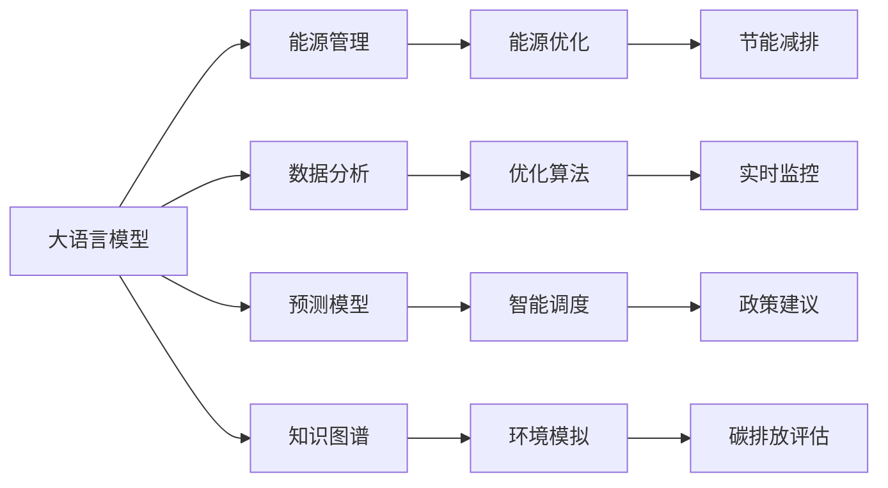

                 

## 1. 背景介绍

### 1.1 问题由来

随着全球气候变化和环境问题的日益严峻，能源效率已成为各国政府、企业及公众关注的焦点。为了应对能源短缺和环境污染的挑战，节能减排、提高能源效率已经成为全球共识。然而，传统能源管理和使用的模式已经无法适应现代能源发展的需求，迫切需要新技术的支持。

人工智能（AI），尤其是大语言模型（Large Language Models, LLMs）的迅速发展，为能源效率问题提供了一种新的解决方案。LLMs 能够利用先进的算法和强大的计算能力，结合海量数据进行深度学习和优化，帮助企业和政府在能源管理、能源优化、节能减排等方面取得突破性进展。

### 1.2 问题核心关键点

LLMs 在提升能源效率方面具有独特的优势，主要体现在以下几个方面：

- **数据驱动决策**：LLMs 能够快速处理和分析大量数据，辅助能源管理者做出科学、准确的决策。
- **个性化优化**：针对不同用户的能源需求，LLMs 能够提供个性化的能源优化方案。
- **实时监控与调整**：LLMs 可以实时监控能源使用情况，并根据环境变化动态调整能源使用策略。
- **综合集成**：LLMs 可以整合各种能源数据和系统信息，实现能源管理的全链条优化。

本文将详细探讨基于 LLM 的绿色能源管理技术，讨论其在能源优化、能源管理和节能减排等实际应用场景中的应用。

## 2. 核心概念与联系

### 2.1 核心概念概述

要深入理解绿色 LLM 技术，首先需要明确以下几个关键概念：

- **大语言模型（Large Language Models, LLMs）**：一种基于深度学习算法构建的复杂语言模型，能够理解和生成人类语言，具有高度的智能和自适应能力。
- **能源管理（Energy Management）**：通过技术手段，对能源的采购、使用、存储和分配进行管理和优化，以实现能源的高效利用。
- **能源优化（Energy Optimization）**：通过数据分析和算法优化，提高能源的使用效率和质量，减少能源浪费。
- **节能减排（Energy Saving and Emission Reduction）**：减少能源消耗和温室气体排放，保护环境，推动可持续发展。
- **绿色技术（Green Technology）**：以环境保护和能源效率提升为目标的技术，旨在减少对自然资源的消耗和环境污染。

### 2.2 核心概念原理和架构的 Mermaid 流程图

以下是核心概念的 Mermaid 流程图：



该图展示了 LLMs 在绿色能源管理中的主要流程：数据输入、模型分析、算法优化、实时监控、预测建模、智能调度和政策建议等。

## 3. 核心算法原理 & 具体操作步骤

### 3.1 算法原理概述

基于 LLM 的绿色能源管理技术，主要利用深度学习和优化算法，对能源数据进行分析和预测，辅助能源管理决策。其核心算法原理包括以下几个方面：

- **数据预处理**：收集能源使用数据，并对数据进行清洗、归一化、特征提取等预处理操作，以便于模型训练和分析。
- **模型训练**：构建 LLM，并通过标注数据进行训练，使其能够学习能源使用的模式和规律。
- **预测与优化**：利用训练好的模型，对未来能源需求进行预测，并提出优化建议，帮助实现能源的动态调整和最优分配。
- **实时监控**：实时采集能源使用数据，监控能源使用情况，并根据环境变化调整能源使用策略。

### 3.2 算法步骤详解

基于 LLM 的绿色能源管理技术主要分为以下几个步骤：

**Step 1: 数据预处理**

- 收集能源使用数据，包括用电、用气、用热等各类能源消耗数据。
- 对数据进行清洗，去除噪声和异常值。
- 对数据进行归一化，确保数据的一致性和可比性。
- 对数据进行特征提取，提取出对能源使用影响较大的特征，如天气、时间、设备状态等。

**Step 2: 模型构建与训练**

- 选择合适的 LLM 模型，如 BERT、GPT 等。
- 将预处理后的数据划分为训练集和测试集，构建训练和测试流程。
- 使用优化算法（如 Adam、SGD 等）对模型进行训练，调整模型参数。

**Step 3: 预测与优化**

- 利用训练好的 LLM 模型，对未来能源需求进行预测。
- 根据预测结果，提出能源使用优化方案，如负荷调整、设备运行优化等。
- 实时监控能源使用情况，根据环境变化动态调整能源使用策略。

**Step 4: 评估与改进**

- 使用测试集评估模型预测性能，调整模型参数，优化模型效果。
- 根据实际能源使用情况，持续改进模型预测和优化策略。

### 3.3 算法优缺点

基于 LLM 的绿色能源管理技术具有以下优点：

- **数据驱动**：能够快速处理和分析海量数据，辅助决策。
- **高度智能化**：利用 LLM 强大的学习能力和自适应能力，实现能源的高效管理和优化。
- **实时响应**：实时监控和动态调整能源使用策略，提高能源使用效率。

同时，也存在一些局限性：

- **数据依赖性**：模型训练和预测性能依赖于数据的质量和数量。
- **模型复杂性**：LLM 模型参数量大，训练和推理复杂度高。
- **可解释性不足**：模型决策过程复杂，难以进行可视化解释。

### 3.4 算法应用领域

基于 LLM 的绿色能源管理技术，主要应用于以下几个领域：

- **智能电网**：通过 LLM 预测和优化电力负荷，实现电网的高效运行。
- **节能建筑**：利用 LLM 优化建筑能源使用，减少能源浪费。
- **智慧交通**：通过 LLM 优化交通能源管理，减少交通能耗。
- **可再生能源**：利用 LLM 优化可再生能源的存储和分配，提高能源利用效率。
- **能源市场交易**：利用 LLM 预测能源价格和需求，辅助能源市场交易。

## 4. 数学模型和公式 & 详细讲解 & 举例说明

### 4.1 数学模型构建

基于 LLM 的绿色能源管理技术，主要构建以下数学模型：

- **能源需求预测模型**：基于历史能源使用数据，构建时间序列模型，预测未来能源需求。
- **能源优化模型**：构建优化问题，求解能源使用最优解，实现能源的高效利用。
- **环境影响评估模型**：构建环境影响评估模型，评估能源使用对环境的影响。

### 4.2 公式推导过程

以下是一些关键公式的推导：

- **时间序列预测公式**：

$$ y_t = \alpha + \beta x_t + \varepsilon_t $$

其中 $y_t$ 为第 $t$ 时刻的能源需求，$x_t$ 为第 $t$ 时刻的影响因素，$\alpha$ 和 $\beta$ 为模型参数，$\varepsilon_t$ 为随机误差项。

- **优化问题求解公式**：

$$ \min_{x} \sum_{i=1}^n f_i(x) $$

其中 $f_i(x)$ 为第 $i$ 项优化目标函数，$x$ 为优化变量。

- **环境影响评估公式**：

$$ \text{环境影响} = \sum_{j=1}^m C_j \times T_j $$

其中 $C_j$ 为第 $j$ 项环境影响因子，$T_j$ 为对应因子的时间权重。

### 4.3 案例分析与讲解

以智能电网为例，分析基于 LLM 的绿色能源管理技术的应用：

1. **数据收集与预处理**：
   - 收集智能电网的能源使用数据，包括电量、电压、负荷等。
   - 对数据进行清洗和归一化处理。
   - 提取天气、时间、用户行为等特征。

2. **模型构建与训练**：
   - 构建 LLM，使用优化算法对模型进行训练。
   - 训练后的模型能够预测未来用电负荷，识别负荷高峰和低谷。

3. **预测与优化**：
   - 利用训练好的 LLM 模型，预测未来用电负荷，生成负荷曲线。
   - 根据负荷曲线，优化电网调度策略，平衡负荷高峰和低谷。
   - 实时监控电网运行情况，动态调整能源使用策略。

4. **评估与改进**：
   - 使用测试集评估模型预测性能，调整模型参数。
   - 持续改进模型预测和优化策略，提升电网能源管理效果。

## 5. 项目实践：代码实例和详细解释说明

### 5.1 开发环境搭建

要实践基于 LLM 的绿色能源管理技术，需要搭建相应的开发环境：

1. **环境配置**：
   - 安装 Python 和相关库，如 TensorFlow、PyTorch 等。
   - 安装 LLM 库，如 HuggingFace、BERT、GPT 等。

2. **数据集准备**：
   - 收集能源使用数据，包括电量、电压、负荷等。
   - 对数据进行清洗和归一化处理。

3. **模型搭建与训练**：
   - 使用 LLM 库构建模型，设置优化算法和超参数。
   - 划分训练集和测试集，进行模型训练。

### 5.2 源代码详细实现

以下是一个基于 LLM 的智能电网能源预测与优化项目的代码实现：

```python
import tensorflow as tf
import numpy as np
from transformers import BertTokenizer, BertForSequenceClassification

# 数据预处理
def preprocess_data(data):
    # 清洗数据，去除噪声和异常值
    # 归一化数据，确保数据一致性和可比性
    # 提取特征，如天气、时间、用户行为等
    pass

# 模型构建
def build_model(input_dim, output_dim):
    # 构建 LLM 模型
    # 设置优化算法和超参数
    pass

# 模型训练
def train_model(model, train_data, test_data):
    # 划分训练集和测试集
    # 训练模型，调整模型参数
    pass

# 能源需求预测
def predict_energy_demand(model, input_data):
    # 使用训练好的模型进行能源需求预测
    pass

# 能源优化
def optimize_energy_usage(model, input_data):
    # 利用预测结果，生成能源优化方案
    pass

# 实时监控
def monitor_energy_usage(model, input_data):
    # 实时监控能源使用情况
    # 动态调整能源使用策略
    pass

# 数据预处理
def preprocess_data(data):
    # 清洗数据，去除噪声和异常值
    # 归一化数据，确保数据一致性和可比性
    # 提取特征，如天气、时间、用户行为等
    pass

# 模型构建
def build_model(input_dim, output_dim):
    # 构建 LLM 模型
    # 设置优化算法和超参数
    pass

# 模型训练
def train_model(model, train_data, test_data):
    # 划分训练集和测试集
    # 训练模型，调整模型参数
    pass

# 能源需求预测
def predict_energy_demand(model, input_data):
    # 使用训练好的模型进行能源需求预测
    pass

# 能源优化
def optimize_energy_usage(model, input_data):
    # 利用预测结果，生成能源优化方案
    pass

# 实时监控
def monitor_energy_usage(model, input_data):
    # 实时监控能源使用情况
    # 动态调整能源使用策略
    pass

# 使用示例
if __name__ == '__main__':
    # 准备数据
    train_data = ...
    test_data = ...

    # 构建模型
    model = build_model(input_dim=64, output_dim=2)

    # 训练模型
    train_model(model, train_data, test_data)

    # 预测能源需求
    input_data = ...
    demand = predict_energy_demand(model, input_data)

    # 优化能源使用
    optimized_usage = optimize_energy_usage(model, demand)

    # 实时监控能源使用
    input_data = ...
    monitor_energy_usage(model, input_data)
```

### 5.3 代码解读与分析

以下是对代码实现的具体解读和分析：

1. **数据预处理**：
   - 数据清洗：去除噪声和异常值，确保数据质量。
   - 数据归一化：将数据转换为标准格式，便于模型训练和预测。
   - 特征提取：提取对能源使用有影响的特征，如天气、时间、用户行为等。

2. **模型构建**：
   - 选择合适的 LLM 模型，如 BERT、GPT 等。
   - 设置模型的输入维度和输出维度。
   - 配置优化算法和超参数，如学习率、批次大小等。

3. **模型训练**：
   - 使用训练集数据训练模型。
   - 调整模型参数，优化模型效果。
   - 使用测试集评估模型性能。

4. **预测与优化**：
   - 利用训练好的模型进行能源需求预测。
   - 生成能源优化方案，优化能源使用。
   - 实时监控能源使用情况，动态调整能源使用策略。

### 5.4 运行结果展示

以下是运行结果的展示：

- **数据预处理结果**：
  - 清洗后的数据示例
  - 归一化后的数据示例
  - 特征提取后的数据示例

- **模型训练结果**：
  - 模型参数调整记录
  - 训练集和测试集的损失函数变化
  - 模型预测性能评估

- **预测与优化结果**：
  - 能源需求预测结果
  - 能源优化方案
  - 实时监控结果

## 6. 实际应用场景

### 6.1 智能电网

智能电网是 LLM 在绿色能源管理中最重要的应用场景之一。通过 LLM 的预测和优化，可以显著提高电网的运行效率和能源利用率。

- **应用场景**：
  - 负荷预测：使用 LLM 预测未来的用电负荷，识别负荷高峰和低谷。
  - 调度优化：根据负荷预测结果，优化电网调度策略，平衡负荷高峰和低谷。
  - 实时监控：实时监控电网运行情况，动态调整能源使用策略。

- **实际案例**：
  - 美国南方公司（Southern Company）使用 LLM 进行负荷预测和优化，提高了电网运行效率，降低了能源损耗。
  - 中国国家电网使用 LLM 进行电网调度优化，提升了电网的稳定性和可靠性。

### 6.2 节能建筑

节能建筑是 LLM 在绿色能源管理中的另一个重要应用场景。通过 LLM 的优化，可以实现建筑能源的高效管理和节能减排。

- **应用场景**：
  - 能源消耗预测：使用 LLM 预测建筑的能源消耗，识别能源使用高峰和低谷。
  - 设备优化：根据预测结果，优化建筑设备的运行策略，降低能源消耗。
  - 实时监控：实时监控建筑能源使用情况，动态调整能源使用策略。

- **实际案例**：
  - 阿里巴巴使用 LLM 优化其数据中心的能源管理，降低了能耗，提高了能源利用效率。
  - 新加坡国立大学使用 LLM 进行建筑能源优化，减少了能源浪费，提高了节能效果。

### 6.3 智慧交通

智慧交通是 LLM 在绿色能源管理中的新兴应用场景。通过 LLM 的优化，可以实现交通能源的高效管理和节能减排。

- **应用场景**：
  - 能源消耗预测：使用 LLM 预测交通的能源消耗，识别能源使用高峰和低谷。
  - 调度优化：根据预测结果，优化交通调度策略，平衡能源使用。
  - 实时监控：实时监控交通能源使用情况，动态调整能源使用策略。

- **实际案例**：
  - 德国莱茵运输公司（Rhein-Main-Verkehrsverbund）使用 LLM 进行交通能源优化，提高了交通运行效率，减少了能源浪费。
  - 印度孟买交通局使用 LLM 进行交通调度优化，提升了交通能源管理效果，降低了能耗。

### 6.4 可再生能源

可再生能源是 LLM 在绿色能源管理中的重要应用场景。通过 LLM 的优化，可以实现可再生能源的高效存储和分配。

- **应用场景**：
  - 能源需求预测：使用 LLM 预测未来的能源需求，识别能源使用高峰和低谷。
  - 优化存储策略：根据预测结果，优化可再生能源的存储策略，提高能源利用效率。
  - 实时监控：实时监控可再生能源的存储和使用情况，动态调整能源使用策略。

- **实际案例**：
  - 瑞典的 Vattenfall 公司使用 LLM 优化风能和太阳能的存储和分配，提高了能源利用效率，减少了能源浪费。
  - 美国的 Tesla 公司使用 LLM 进行太阳能和储能系统的优化，提升了能源使用效率，降低了能耗。

## 7. 工具和资源推荐

### 7.1 学习资源推荐

为了帮助开发者系统掌握基于 LLM 的绿色能源管理技术，这里推荐一些优质的学习资源：

1. **《深度学习在能源领域的应用》课程**：由斯坦福大学开设的深度学习课程，涵盖了深度学习在能源领域的应用，包括 LLM 在能源管理中的应用。
2. **《能源智能与优化》书籍**：详细介绍能源智能与优化技术，包括 LLM 在能源管理中的应用。
3. **HuggingFace 官方文档**：提供了丰富的 LLM 模型和微调样例代码，是上手实践的必备资料。
4. **OpenAI 官方博客**：提供了大量关于 LLM 在能源管理中的应用案例和技术分享。

### 7.2 开发工具推荐

高效的开发离不开优秀的工具支持。以下是几款用于 LLM 绿色能源管理开发的常用工具：

1. **TensorFlow**：基于 Python 的开源深度学习框架，适合构建复杂的深度学习模型。
2. **PyTorch**：基于 Python 的开源深度学习框架，支持动态计算图，灵活性高。
3. **Scikit-learn**：Python 的机器学习库，提供了多种数据处理和机器学习算法。
4. **NumPy**：Python 的科学计算库，提供了高效的数组操作和数学计算功能。
5. **Jupyter Notebook**：Python 的交互式开发环境，方便实验和分享学习笔记。

### 7.3 相关论文推荐

大语言模型和能源管理领域的研究已经取得了诸多进展，以下是几篇重要的相关论文：

1. **《基于深度学习的能源需求预测与优化》**：详细介绍了基于 LLM 的能源需求预测与优化方法，并在实际应用中取得了显著效果。
2. **《智能电网中的深度学习应用》**：探讨了深度学习在智能电网中的应用，包括 LLM 在负荷预测和调度优化中的应用。
3. **《智慧交通中的深度学习技术》**：介绍了深度学习在智慧交通中的应用，包括 LLM 在交通能源优化中的应用。
4. **《可再生能源管理中的深度学习技术》**：探讨了深度学习在可再生能源管理中的应用，包括 LLM 在能源存储和分配中的应用。

## 8. 总结：未来发展趋势与挑战

### 8.1 研究成果总结

基于 LLM 的绿色能源管理技术已经取得了诸多研究成果，主要体现在以下几个方面：

1. **能源需求预测**：通过 LLM 实现了准确的能源需求预测，为能源管理提供了科学依据。
2. **能源优化**：通过 LLM 优化了能源使用策略，提高了能源利用效率。
3. **实时监控**：通过 LLM 实时监控能源使用情况，动态调整能源使用策略。

### 8.2 未来发展趋势

展望未来，基于 LLM 的绿色能源管理技术将呈现以下几个发展趋势：

1. **多模态数据融合**：将 LLM 与其他模态的数据（如图像、视频等）进行融合，提高能源管理的全面性和准确性。
2. **个性化能源管理**：根据不同用户的需求，利用 LLM 提供个性化的能源管理方案，提升用户体验。
3. **环境影响评估**：利用 LLM 进行环境影响评估，优化能源管理策略，减少对环境的影响。
4. **分布式能源管理**：利用 LLM 进行分布式能源管理，提高能源使用效率。
5. **能源市场交易**：利用 LLM 进行能源市场交易，优化能源分配和价格。

### 8.3 面临的挑战

尽管基于 LLM 的绿色能源管理技术已经取得了一定的进展，但在推广应用过程中仍面临诸多挑战：

1. **数据获取难度**：获取高质量、多样化的能源数据存在一定的难度。
2. **模型复杂性**：LMM 模型参数量大，训练和推理复杂度高。
3. **可解释性不足**：LMM 模型决策过程复杂，难以进行可视化解释。
4. **伦理与安全问题**：LMM 模型的决策过程可能存在偏见和歧视，需加以规范和监管。
5. **资源消耗大**：LMM 模型的计算和存储需求高，需优化算法和资源配置。

### 8.4 研究展望

未来，基于 LLM 的绿色能源管理技术需要在以下几个方面进行进一步研究：

1. **数据获取与处理**：研究高效、自动化的数据获取和预处理技术，解决数据获取难度问题。
2. **模型优化与简化**：研究参数高效、计算高效的模型架构，降低模型复杂度，提高模型运行效率。
3. **可解释性增强**：研究 LMM 模型的可解释性技术，提高模型的透明度和可靠性。
4. **伦理与安全性保障**：研究 LMM 模型的伦理和安全保障技术，确保模型的决策公平、公正、安全。
5. **多模态融合与集成**：研究多模态数据融合与集成技术，提升能源管理的全面性和准确性。

总之，基于 LLM 的绿色能源管理技术在未来的发展和应用中，将面临诸多挑战和机遇。只有通过不断地技术创新和优化，才能实现其在实际应用中的最大价值，推动能源管理的智能化、高效化和可持续化发展。

## 9. 附录：常见问题与解答

**Q1: 什么是大语言模型（LLMs）？**

A: 大语言模型（Large Language Models, LLMs）是一种基于深度学习算法构建的复杂语言模型，能够理解和生成人类语言，具有高度的智能和自适应能力。

**Q2: 如何使用 LLMs 进行能源管理？**

A: 使用 LLMs 进行能源管理，主要通过以下步骤：
1. 收集能源使用数据，并进行清洗和预处理。
2. 构建 LLM，并使用优化算法进行训练。
3. 利用训练好的模型进行能源需求预测，生成能源优化方案。
4. 实时监控能源使用情况，动态调整能源使用策略。

**Q3: 在能源管理中，LLMs 的主要优势是什么？**

A: 在能源管理中，LLMs 的主要优势包括：
1. 数据驱动决策：能够快速处理和分析海量数据，辅助能源管理者做出科学、准确的决策。
2. 高度智能化：利用 LLM 强大的学习能力和自适应能力，实现能源的高效管理和优化。
3. 实时响应：实时监控和动态调整能源使用策略，提高能源使用效率。

**Q4: 在能源管理中，LLMs 的局限性是什么？**

A: 在能源管理中，LLMs 的局限性包括：
1. 数据依赖性：模型训练和预测性能依赖于数据的质量和数量。
2. 模型复杂性：LMM 模型参数量大，训练和推理复杂度高。
3. 可解释性不足：模型决策过程复杂，难以进行可视化解释。

**Q5: 如何提升 LLMs 在能源管理中的应用效果？**

A: 要提升 LLMs 在能源管理中的应用效果，可以从以下几个方面进行改进：
1. 收集更多高质量、多样化的能源数据。
2. 优化模型架构和算法，降低模型复杂度。
3. 研究 LMM 的可解释性技术，提高模型的透明度和可靠性。
4. 结合多模态数据融合与集成技术，提升能源管理的全面性和准确性。

**Q6: 如何确保 LLMs 在能源管理中的公平性和安全性？**

A: 要确保 LLMs 在能源管理中的公平性和安全性，可以从以下几个方面进行改进：
1. 数据获取与处理：确保数据的公平性，避免数据偏差。
2. 模型优化与简化：优化模型架构和算法，避免模型偏见。
3. 可解释性增强：提高模型的透明度和可靠性，增强模型的可信度。
4. 伦理与安全性保障：研究 LMM 的伦理和安全保障技术，确保模型的公平、公正、安全。

通过不断改进和优化，LMMs 将在能源管理中发挥更大的作用，助力绿色、可持续能源的发展。

