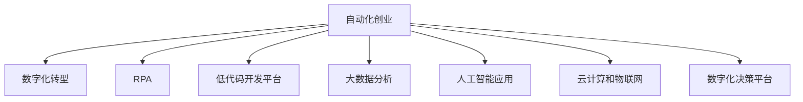

                 

# 自动化创业中的数字化转型策略

> 关键词：数字化转型, 自动化创业, 人工智能, 机器学习, 机器人流程自动化(RPA), 数字孪生, 智慧城市, 工业4.0, 数字化决策, 云计算, 大数据分析

## 1. 背景介绍

### 1.1 问题由来

在过去的十年中，数字化转型已经成为全球企业竞争的核心战略之一。随着互联网和人工智能技术的飞速发展，传统行业正面临着前所未有的变革。自动化创业作为一种新的商业模式，通过引入先进的自动化技术和数字化工具，帮助企业实现流程优化、效率提升和成本降低，正在迅速成为各行业的关注焦点。

数字化转型不仅仅是为了提高效率和降低成本，更重要的目的是通过数据驱动的决策，提升企业的市场响应速度和竞争优势。然而，数字化转型也带来了诸多挑战，包括技术复杂性、数据安全性和员工适应性等。本文将深入探讨自动化创业中的数字化转型策略，旨在为企业提供一套全面的解决方案。

### 1.2 问题核心关键点

自动化创业中的数字化转型，核心在于将传统业务流程自动化，并利用人工智能、机器学习和大数据技术，实现对业务数据的深度分析和应用。其关键点包括：

- **业务流程自动化**：通过机器人流程自动化(RPA)和低代码开发工具，实现业务流程的自动化，减少人工干预，提升效率。
- **数据驱动决策**：利用大数据分析和机器学习技术，对业务数据进行深度挖掘和分析，生成洞察，支持决策。
- **人工智能应用**：引入自然语言处理(NLP)、计算机视觉(CV)和预测建模等人工智能技术，提升业务的智能化水平。
- **云计算和物联网(IoT)**：利用云计算和物联网技术，实现数据的实时采集、存储和处理，支持业务的高效运行。
- **数字化决策平台**：构建统一的数字决策平台，整合各类数据和技术工具，实现数据驱动的决策支持。

### 1.3 问题研究意义

在当前数字化时代，企业竞争的焦点已经从产品和服务转向了数据和数字化能力。通过自动化创业，企业能够快速适应市场变化，提升运营效率，降低成本，增强客户体验，从而在激烈的市场竞争中占据优势。

本文旨在帮助企业深入理解自动化创业中的数字化转型策略，明确数字化转型的方向和路径，提供具体的实施方法和工具，以期为企业实现数字化转型提供实质性的帮助。

## 2. 核心概念与联系

### 2.1 核心概念概述

为更好地理解自动化创业中的数字化转型策略，本节将介绍几个密切相关的核心概念：

- **自动化创业**：利用自动化技术和数字化工具，实现业务流程的自动化，提升运营效率和业务响应速度。
- **数字化转型**：通过引入先进的信息技术，优化业务流程，提升企业竞争力，实现业务的数字化、智能化和自动化。
- **机器人流程自动化(RPA)**：通过软件机器人自动执行重复性、规则性强的任务，提升工作效率和准确性。
- **低代码开发平台**：提供易于使用的编程环境，降低开发门槛，加速业务系统的开发和部署。
- **大数据分析**：利用大数据技术，对业务数据进行分析和挖掘，生成商业洞察。
- **人工智能应用**：引入自然语言处理、计算机视觉等人工智能技术，提升业务的智能化水平。
- **云计算和物联网**：利用云计算和物联网技术，实现数据的实时采集、存储和处理，支持业务的高效运行。
- **数字化决策平台**：整合各类数据和技术工具，构建统一的数字决策平台，实现数据驱动的决策支持。

这些核心概念之间的逻辑关系可以通过以下Mermaid流程图来展示：



这个流程图展示了大语言模型的核心概念及其之间的关系：

1. 自动化创业通过引入先进的技术手段，实现业务流程的自动化。
2. 数字化转型则是通过引入先进的信息技术，优化业务流程，提升企业竞争力。
3. RPA、低代码开发、大数据分析、人工智能应用、云计算和物联网等技术，都是实现数字化转型的重要工具。
4. 数字化决策平台，则是将各类技术和数据工具整合，形成统一的数字决策平台，支持数据驱动的决策。

这些概念共同构成了自动化创业中的数字化转型框架，为企业实现数字化转型提供了全面的指导。

## 3. 核心算法原理 & 具体操作步骤
### 3.1 算法原理概述

自动化创业中的数字化转型，本质上是一个多维度的技术集成和应用过程。其核心算法原理包括：

- **业务流程自动化**：利用RPA技术，实现对重复性、规则性强的任务的自动化处理。
- **数据驱动决策**：利用大数据分析和机器学习技术，对业务数据进行深度挖掘和分析，生成洞察，支持决策。
- **人工智能应用**：引入自然语言处理、计算机视觉等人工智能技术，提升业务的智能化水平。
- **云计算和物联网**：利用云计算和物联网技术，实现数据的实时采集、存储和处理，支持业务的高效运行。
- **数字化决策平台**：构建统一的数字决策平台，整合各类数据和技术工具，实现数据驱动的决策支持。

### 3.2 算法步骤详解

自动化创业中的数字化转型一般包括以下几个关键步骤：

**Step 1: 需求分析和业务流程建模**

- 对企业当前的业务流程进行全面分析，识别出可以自动化的环节。
- 采用流程建模工具，如BPMN、UML等，对业务流程进行建模，明确自动化目标和路径。

**Step 2: 引入自动化工具和技术**

- 选择合适的自动化工具和技术，如RPA、低代码开发平台、大数据分析工具等。
- 根据业务流程的特点，选择合适的自动化工具和技术，设计自动化方案。

**Step 3: 实施自动化**

- 将选定的自动化工具和技术应用于业务流程中，实现流程自动化。
- 对自动化系统进行测试和调试，确保系统稳定运行。

**Step 4: 数据驱动决策**

- 对业务数据进行收集和整理，构建数据仓库。
- 利用大数据分析和机器学习技术，对业务数据进行深度挖掘和分析，生成洞察，支持决策。

**Step 5: 引入人工智能应用**

- 根据业务需求，引入自然语言处理、计算机视觉等人工智能技术。
- 对数据和任务进行智能化处理，提升业务的智能化水平。

**Step 6: 构建数字化决策平台**

- 整合各类数据和技术工具，构建统一的数字决策平台。
- 提供统一的数据和决策支持界面，支持数据驱动的决策。

**Step 7: 持续优化和改进**

- 对自动化系统进行持续监控和优化，确保系统稳定运行。
- 根据业务变化和需求，不断调整和改进自动化方案，提升系统效率和效果。

### 3.3 算法优缺点

自动化创业中的数字化转型具有以下优点：

- **提升效率和降低成本**：通过自动化技术，减少人工干预，提升工作效率和准确性，降低运营成本。
- **增强市场响应速度**：利用数字化工具，实现数据的实时采集和处理，快速响应市场变化。
- **提升业务智能化水平**：引入人工智能技术，提升业务的智能化水平，生成商业洞察，支持决策。
- **实现数据驱动决策**：通过数据驱动的决策，提升决策的科学性和准确性，减少决策误差。

同时，该方法也存在一定的局限性：

- **技术复杂性**：自动化创业需要引入多方面的先进技术，技术复杂性较高，需要专业的技术支持。
- **数据安全性和隐私保护**：自动化创业涉及大量数据的采集和处理，数据安全和隐私保护问题需重点关注。
- **员工适应性**：自动化创业可能会改变部分员工的岗位和工作内容，需要考虑员工的适应性和培训问题。

尽管存在这些局限性，但就目前而言，自动化创业中的数字化转型方法仍然是企业实现数字化转型的重要途径。未来相关研究的重点在于如何进一步降低数字化转型的技术门槛，提高系统的易用性和可扩展性，同时兼顾数据安全性和员工适应性等因素。

### 3.4 算法应用领域

自动化创业中的数字化转型，已经在各行各业得到了广泛的应用，例如：

- **金融行业**：利用RPA和低代码开发平台，实现贷款审批、风险评估等业务的自动化处理。
- **制造行业**：通过物联网和云计算技术，实现设备的远程监控和预测性维护。
- **零售行业**：采用自然语言处理技术，实现智能客服和推荐系统，提升客户体验。
- **医疗行业**：利用大数据分析和机器学习技术，实现疾病预测和个性化治疗方案推荐。
- **物流行业**：通过自动化仓储和物流系统，实现订单的自动处理和配送，提升物流效率。

除了上述这些行业外，自动化创业中的数字化转型还在更多领域得到应用，如智慧城市、智慧工厂、智能农业等，为各行各业带来了新的发展机遇。

## 4. 数学模型和公式 & 详细讲解 & 举例说明（备注：数学公式请使用latex格式，latex嵌入文中独立段落使用 $$，段落内使用 $)
### 4.1 数学模型构建

本节将使用数学语言对自动化创业中的数字化转型过程进行更加严格的刻画。

设企业当前业务流程为 $F$，自动化目标为 $A$，自动化流程为 $A_F$。自动化创业中的数字化转型过程可以表示为：

$$
F \rightarrow A_F \rightarrow F' \rightarrow F'
$$

其中，$F'$ 表示经过数字化转型的业务流程，$F'$ 表示最终的数字化业务流程。

设企业业务流程的数据集为 $D$，数据仓库为 $D'$，决策平台为 $DP$。数字化转型过程可以进一步表示为：

$$
D \rightarrow D' \rightarrow DP
$$

其中，$D'$ 表示经过大数据分析和处理的业务数据集，$DP$ 表示数字化决策平台。

### 4.2 公式推导过程

以下我们以制造行业为例，推导物联网和云计算在数字化转型中的应用。

设制造行业设备的传感器数据为 $x$，经过物联网采集后，数据传输至云计算平台进行存储和处理，得到处理后的数据 $x'$。设处理后的数据与设备状态的关系为 $y$，其中 $y$ 为设备状态。则物联网和云计算在数字化转型中的应用可以表示为：

$$
x \rightarrow (IoT, Cloud) \rightarrow x' \rightarrow y
$$

其中，$IoT$ 表示物联网，$Cloud$ 表示云计算，$y$ 表示设备状态。

根据上述关系，设备状态的预测模型可以表示为：

$$
y = f(x')
$$

其中，$f$ 为预测模型，可以是线性回归、决策树、深度学习等。

在得到预测模型后，可以实时监控设备状态，进行预测性维护，提升设备运行效率。

### 4.3 案例分析与讲解

**案例1: 制造业设备的预测性维护**

某制造企业使用物联网和云计算技术，对生产设备进行实时监控和预测性维护。具体步骤如下：

1. 在设备上安装传感器，采集设备运行数据。
2. 利用物联网技术，将设备数据传输至云计算平台，进行实时存储和处理。
3. 利用机器学习技术，对处理后的数据进行深度挖掘和分析，生成设备状态预测模型。
4. 在设备运行过程中，实时采集设备数据，输入预测模型，得到设备状态预测结果。
5. 根据预测结果，进行设备维护和保养，提升设备运行效率。

通过物联网和云计算技术的应用，该制造企业实现了设备状态的实时监控和预测性维护，大大提升了设备运行效率和维护成本。

## 5. 项目实践：代码实例和详细解释说明
### 5.1 开发环境搭建

在进行数字化转型实践前，我们需要准备好开发环境。以下是使用Python进行Python开发的环境配置流程：

1. 安装Anaconda：从官网下载并安装Anaconda，用于创建独立的Python环境。

2. 创建并激活虚拟环境：
```bash
conda create -n pyenv python=3.8 
conda activate pyenv
```

3. 安装Python的依赖库：
```bash
pip install pandas numpy scikit-learn matplotlib jupyter notebook ipython
```

4. 安装低代码开发平台：
```bash
pip install airtable
```

5. 安装RPA工具：
```bash
pip install UiPath
```

完成上述步骤后，即可在`pyenv`环境中开始数字化转型实践。

### 5.2 源代码详细实现

这里我们以制造业设备的预测性维护为例，给出使用Python和UiPath进行数字化转型的代码实现。

首先，定义数据收集和处理的函数：

```python
import pandas as pd
from sklearn.ensemble import RandomForestRegressor

# 读取设备运行数据
data = pd.read_csv('device_data.csv')

# 定义设备状态预测模型
model = RandomForestRegressor(n_estimators=100, random_state=42)

# 对数据进行预处理
data['time'] = pd.to_datetime(data['time'])
data = data.dropna()

# 数据分割
train_data = data[data['time']<'2021-01-01']
test_data = data[data['time']>='2021-01-01']

# 训练模型
model.fit(train_data.drop('time', axis=1), train_data['status'])

# 模型评估
print(model.score(test_data.drop('time', axis=1), test_data['status']))
```

然后，定义RPA流程：

```python
import UiPath

# 定义RPA流程
with UiPath.Workflow.WorkflowScope('predictive_maintenance') as scope:
    # 设备数据采集
    data = UiPath.Activities.Microsoft Excel.ReadFromFile(folder_path='data.xlsx', sheet_name='Sheet1', skiprows=1, usecols=['time', 'status', 'value'], datatypes={'column1': type1, 'column2': type2}, table_name='table_name')

    # 设备数据传输至云端
    UiPath.Activities.HttpRequest.SendHttpRequestRequest(
        headers={'Content-Type': 'application/json'},
        url='https://cloud-platform.com/api/data',
        body=json.dumps(data),
        method='POST'
    )

    # 设备状态预测
    UiPath.Activities.CalculateExpression.CalculateExpression(
        expression='Status = ' + str(model.predict(data['value']))
    )
```

最后，启动RPA流程：

```python
UiPath.Workflow.WorkflowEngine.RunWorkflow(
    scope=scope,
    working_directory='',
    start_point=scope.GetWorkflowInfo('predictive_maintenance').StartPointName,
    workflows=['predictive_maintenance'],
    arguments=None,
    debugging=True
)
```

以上就是使用Python和UiPath进行制造业设备预测性维护的完整代码实现。可以看到，利用RPA和低代码开发平台，实现了设备的自动数据采集和预测性维护流程。

### 5.3 代码解读与分析

让我们再详细解读一下关键代码的实现细节：

**数据收集和处理函数**：
- 使用Pandas库读取设备运行数据，并进行预处理，包括时间戳转换、缺失值处理等。
- 使用Scikit-learn库的随机森林回归模型，训练设备状态预测模型。
- 使用模型评估指标，评估模型在测试集上的性能。

**RPA流程**：
- 定义RPA流程，使用UiPath.Workflow.WorkflowScope创建一个新的RPA流程作用域。
- 使用UiPath.Activities.Microsoft Excel.ReadFromFile函数，读取Excel文件中的设备数据。
- 使用UiPath.Activities.HttpRequest.SendHttpRequestRequest函数，将数据传输至云端。
- 使用UiPath.Activities.CalculateExpression.CalculateExpression函数，根据设备状态预测模型，生成设备状态预测结果。

**启动RPA流程**：
- 使用UiPath.Workflow.WorkflowEngine.RunWorkflow函数，启动RPA流程。
- 指定RPA流程的作用域、启动点、工作流、调试模式等参数，开始执行RPA流程。

在实际应用中，开发者可以根据具体需求，对RPA流程进行定制和扩展，实现更多的自动化功能。

## 6. 实际应用场景
### 6.1 智能客服系统

基于RPA和低代码开发平台的智能客服系统，可以自动化处理客户的常见问题和投诉，提升客户体验和响应速度。智能客服系统可以包括以下功能：

- 自动解答常见问题
- 自动识别客户意图
- 自动生成回复
- 自动处理客户投诉
- 自动跟进客户反馈

**案例2: 智能客服系统**

某电商企业使用RPA和低代码开发平台，构建了智能客服系统。具体步骤如下：

1. 收集历史客服记录和常见问题，构建问答数据库。
2. 利用RPA技术，将客户咨询问题实时传输至智能客服系统。
3. 使用低代码开发平台，自动匹配客户问题与问答数据库，生成回复。
4. 使用自然语言处理技术，进一步优化回复质量。
5. 利用机器学习技术，不断优化问答数据库，提升智能客服的准确性和智能性。

通过智能客服系统的应用，该电商企业实现了客户咨询的自动处理，大大提升了客户体验和响应速度。

### 6.2 制造行业预测性维护

如前文所述，通过物联网和云计算技术，制造企业可以实现设备的预测性维护。利用RPA和低代码开发平台，可以进一步优化设备维护流程，提升设备运行效率和维护成本。

**案例3: 制造行业预测性维护**

某制造企业使用RPA和低代码开发平台，构建了预测性维护系统。具体步骤如下：

1. 在设备上安装传感器，采集设备运行数据。
2. 利用物联网技术，将设备数据传输至云计算平台，进行实时存储和处理。
3. 使用RPA技术，实时监控设备状态，触发预测性维护。
4. 利用低代码开发平台，生成设备维护工单，指定维护人员。
5. 维护人员根据维护工单，进行设备维护和保养。

通过预测性维护系统的应用，该制造企业实现了设备的自动维护和保养，大大提升了设备运行效率和维护成本。

### 6.3 智慧城市交通管理

智慧城市交通管理系统可以利用物联网和云计算技术，实现交通数据的实时采集和处理。结合RPA和低代码开发平台，可以进一步优化交通管理流程，提升城市交通效率和管理水平。

**案例4: 智慧城市交通管理**

某智慧城市交通管理系统，利用物联网和云计算技术，实现了交通数据的实时采集和处理。具体步骤如下：

1. 在城市道路上安装传感器，采集交通数据。
2. 利用物联网技术，将交通数据传输至云计算平台，进行实时存储和处理。
3. 使用RPA技术，实时监控交通状况，触发交通管理决策。
4. 利用低代码开发平台，生成交通管理指令，指定交通管理人员。
5. 交通管理人员根据管理指令，进行交通调度和管理。

通过智慧城市交通管理系统的应用，该城市实现了交通状况的实时监控和调度，大大提升了交通效率和管理水平。

## 7. 工具和资源推荐
### 7.1 学习资源推荐

为了帮助开发者系统掌握数字化转型和自动化创业的理论基础和实践技巧，这里推荐一些优质的学习资源：

1. **《数字化转型指南》**：由知名企业咨询机构编写，涵盖数字化转型的基本概念、方法论和最佳实践。
2. **《RPA实战指南》**：RPA领域的权威指南，涵盖RPA的原理、工具和应用案例。
3. **《低代码开发平台最佳实践》**：低代码开发平台的实战指南，涵盖低代码开发的原理、工具和应用案例。
4. **《大数据分析实战》**：大数据分析领域的实战指南，涵盖大数据分析的原理、工具和应用案例。
5. **《人工智能基础》**：人工智能领域的入门指南，涵盖人工智能的原理、工具和应用案例。

通过对这些资源的学习实践，相信你一定能够快速掌握数字化转型和自动化创业的精髓，并用于解决实际的业务问题。

### 7.2 开发工具推荐

高效的开发离不开优秀的工具支持。以下是几款用于数字化转型和自动化创业开发的常用工具：

1. **Python**：Python是一种通用编程语言，广泛用于数据分析、机器学习和自动化开发。
2. **UiPath**：UiPath是RPA领域的领先平台，支持各种RPA任务，易于使用和扩展。
3. **Airtable**：Airtable是一种低代码开发平台，支持各种数据驱动的应用开发，易于使用和部署。
4. **IoT平台**：如ThingWorx、ThingSpeak等，支持各种物联网设备的连接和管理。
5. **云计算平台**：如AWS、Azure、Google Cloud等，支持数据的实时存储和处理。

合理利用这些工具，可以显著提升数字化转型和自动化创业的开发效率，加快创新迭代的步伐。

### 7.3 相关论文推荐

数字化转型和自动化创业的研究源于学界的持续研究。以下是几篇奠基性的相关论文，推荐阅读：

1. **《数字化转型的过程和价值》**：探讨数字化转型的过程和价值，分析数字化转型的关键要素和实施步骤。
2. **《RPA的应用和发展趋势》**：分析RPA的应用现状和发展趋势，探讨RPA的原理和优势。
3. **《低代码开发平台的概念和应用》**：探讨低代码开发平台的概念和应用，分析低代码开发的优势和挑战。
4. **《大数据分析的应用和技术》**：分析大数据分析的应用和技术，探讨大数据分析的原理和工具。
5. **《人工智能在数字化转型中的应用》**：探讨人工智能在数字化转型中的应用，分析人工智能的原理和应用场景。

这些论文代表了大规模语言模型微调技术的发展脉络。通过学习这些前沿成果，可以帮助研究者把握学科前进方向，激发更多的创新灵感。

## 8. 总结：未来发展趋势与挑战

### 8.1 总结

本文对自动化创业中的数字化转型策略进行了全面系统的介绍。首先阐述了数字化转型和自动化创业的研究背景和意义，明确了数字化转型的方向和路径，提供具体的实施方法和工具，以期为企业实现数字化转型提供实质性的帮助。

通过本文的系统梳理，可以看到，自动化创业中的数字化转型技术正在成为企业实现数字化转型的重要途径，极大地拓展了企业的数字化能力，提升了运营效率和竞争优势。未来，伴随技术的不断演进，数字化转型必将在更多领域得到应用，为各行各业带来新的发展机遇。

### 8.2 未来发展趋势

展望未来，自动化创业中的数字化转型技术将呈现以下几个发展趋势：

1. **技术融合深化**：数字化转型和自动化创业将与其他前沿技术，如区块链、边缘计算、5G等深度融合，形成更加全面、智能化的解决方案。
2. **行业应用广泛**：数字化转型和自动化创业将广泛应用于更多行业，如医疗、教育、农业等，带来新的业务模式和应用场景。
3. **数据安全和隐私保护**：数字化转型和自动化创业将更加注重数据安全和隐私保护，引入更多数据加密和隐私保护技术。
4. **员工赋能和转型**：数字化转型和自动化创业将更加注重员工的赋能和转型，提供更多的培训和学习机会，提升员工的技能水平。
5. **实时监控和反馈**：数字化转型和自动化创业将引入实时监控和反馈机制，持续优化业务流程和系统性能。

以上趋势凸显了数字化转型和自动化创业技术的广阔前景。这些方向的探索发展，必将进一步提升企业的数字化能力，推动企业向智能化、高效化方向发展。

### 8.3 面临的挑战

尽管数字化转型和自动化创业技术已经取得了显著进展，但在迈向更加智能化、普适化应用的过程中，仍然面临诸多挑战：

1. **技术复杂性**：数字化转型和自动化创业涉及多种先进技术的集成应用，技术复杂性较高，需要专业团队的支持。
2. **数据安全和隐私保护**：数字化转型和自动化创业涉及大量数据的采集和处理，数据安全和隐私保护问题需重点关注。
3. **员工适应性**：数字化转型和自动化创业可能会改变部分员工的岗位和工作内容，需要考虑员工的适应性和培训问题。
4. **系统易用性和扩展性**：数字化转型和自动化创业需要设计易于使用的系统，提升用户的使用体验，同时保持系统的可扩展性。
5. **业务目标对齐**：数字化转型和自动化创业需要确保系统的设计和应用与企业的业务目标一致，避免系统与业务脱节。

这些挑战需要企业持续关注和解决，才能在数字化转型和自动化创业中取得成功。

### 8.4 研究展望

面对数字化转型和自动化创业所面临的诸多挑战，未来的研究需要在以下几个方面寻求新的突破：

1. **技术简化和普及**：开发更加易于使用的技术和工具，降低数字化转型和自动化创业的技术门槛，提升企业的采用意愿和能力。
2. **数据安全和隐私保护**：引入更多的数据加密和隐私保护技术，确保数据安全和隐私保护。
3. **员工赋能和转型**：提供更多的培训和学习机会，提升员工的技能水平，帮助员工适应新的工作环境和任务。
4. **系统易用性和扩展性**：设计易于使用的系统，提升用户的使用体验，同时保持系统的可扩展性，支持业务的持续扩展和优化。
5. **业务目标对齐**：确保系统的设计和应用与企业的业务目标一致，避免系统与业务脱节，提升系统的实际应用效果。

这些研究方向的探索，必将引领数字化转型和自动化创业技术迈向更高的台阶，为各行各业带来新的发展机遇。面向未来，数字化转型和自动化创业技术还需要与其他前沿技术，如区块链、边缘计算、5G等深度融合，形成更加全面、智能化的解决方案，推动各行业的数字化转型和智能化发展。

## 9. 附录：常见问题与解答

**Q1: 企业如何确定数字化转型的方向和路径？**

A: 企业应从业务需求和目标出发，结合数字化转型的最佳实践和行业经验，制定数字化转型的战略规划。可以通过以下步骤进行：

1. 分析业务现状和痛点，确定数字化转型的目标和方向。
2. 选择适合的数字化转型工具和技术，设计数字化转型方案。
3. 制定数字化转型的时间表和路线图，逐步实施数字化转型。
4. 持续监控和优化数字化转型的效果，确保数字化转型的持续进步。

**Q2: 企业如何选择合适的数字化转型工具和技术？**

A: 企业应根据自身的业务需求和技术能力，选择适合的数字化转型工具和技术。可以从以下方面进行考虑：

1. 业务需求：选择符合业务需求的工具和技术，确保数字化转型的实际效果。
2. 技术成熟度：选择技术成熟度高的工具和技术，降低数字化转型的风险。
3. 可扩展性：选择具有良好扩展性的工具和技术，支持业务的持续扩展和优化。
4. 易用性：选择易于使用和维护的工具和技术，提升用户的使用体验。
5. 成本效益：选择性价比高的工具和技术，平衡成本和效果。

**Q3: 企业如何降低数字化转型的风险？**

A: 企业应从多个方面降低数字化转型的风险，包括技术风险、数据风险、人员风险等。可以从以下方面进行考虑：

1. 引入专业的技术团队和咨询机构，提供专业的技术支持和咨询。
2. 采用试点项目，逐步推广数字化转型，验证数字化转型的效果。
3. 引入数据治理和隐私保护机制，确保数据安全和隐私保护。
4. 提供培训和教育，提升员工的技能水平，帮助员工适应新的工作环境和任务。
5. 制定数字化转型的应急预案，应对突发事件和问题。

这些建议和措施可以帮助企业降低数字化转型的风险，确保数字化转型的顺利实施。

**Q4: 企业如何确保数字化转型的效果？**

A: 企业应从多个方面确保数字化转型的效果，包括业务效果、技术效果和员工效果等。可以从以下方面进行考虑：

1. 制定明确的业务目标和指标，衡量数字化转型的效果。
2. 采用持续监控和评估机制，及时发现和解决问题。
3. 引入实时监控和反馈机制，持续优化业务流程和系统性能。
4. 提供培训和教育，提升员工的技能水平，确保数字化转型的顺利实施。
5. 制定数字化转型的应急预案，应对突发事件和问题。

这些建议和措施可以帮助企业确保数字化转型的效果，实现数字化转型的目标和价值。

**Q5: 企业如何建立数字化转型的持续改进机制？**

A: 企业应从多个方面建立数字化转型的持续改进机制，包括技术改进、业务改进和人员改进等。可以从以下方面进行考虑：

1. 制定持续改进的机制和流程，确保数字化转型的持续改进。
2. 引入数据治理和隐私保护机制，确保数据安全和隐私保护。
3. 引入实时监控和反馈机制，持续优化业务流程和系统性能。
4. 提供培训和教育，提升员工的技能水平，确保数字化转型的顺利实施。
5. 制定数字化转型的应急预案，应对突发事件和问题。

这些建议和措施可以帮助企业建立数字化转型的持续改进机制，推动数字化转型的持续进步。

---

作者：禅与计算机程序设计艺术 / Zen and the Art of Computer Programming

