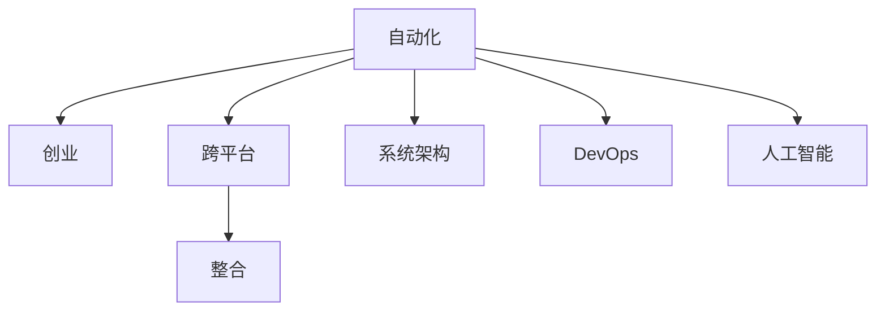

                 

# 自动化创业中的跨平台整合

> 关键词：自动化, 创业, 跨平台, 整合, 系统架构, DevOps, 人工智能

## 1. 背景介绍

### 1.1 问题由来

在当今高度竞争的市场环境中，企业需要快速响应市场需求，不断进行产品迭代和功能创新，才能保持领先地位。然而，传统的软件开发模式往往面临诸多挑战：

- **开发周期长**：传统软件采用瀑布式开发，各阶段间衔接不紧密，迭代慢。
- **集成复杂**：多系统和多平台间缺乏统一的标准和接口，整合成本高。
- **资源浪费**：重复开发和系统维护工作量大，效率低下。
- **技术栈单一**：开发者只熟悉某一技术栈，难以跨部门协作，技术传播难度大。

这些问题严重制约了企业的产品创新和市场竞争力，急需一种更加灵活、高效的自动化开发模式。

## 2. 核心概念与联系

### 2.1 核心概念概述

自动化创业中的跨平台整合，是指在创业初期的快速产品开发和迭代过程中，通过构建一个跨平台、自动化的开发和部署环境，实现从需求分析、设计、开发、测试到部署的全程自动化，从而大幅缩短产品上市时间和开发成本，提升市场竞争力。

以下是核心概念及其相互关系：

- **自动化(Automation)**：利用工具和脚本自动执行重复性任务，减少人工操作，提高开发效率。
- **创业(Business Venture)**：企业通过技术创新和产品迭代，不断创造市场价值的过程。
- **跨平台(Cross-Platform)**：开发的软件能够在多个操作系统和硬件平台上运行，提升产品的通用性和可扩展性。
- **整合(Integration)**：将多个系统和平台通过统一的标准和接口进行对接，形成无缝的协作和信息流通。
- **系统架构(System Architecture)**：描述软件系统的整体结构，包括数据流、控制流、模块间的关系等。
- **DevOps(Development & Operations)**：将开发、测试、部署和运维一体化，提升软件交付速度和系统稳定性。
- **人工智能(AI)**：利用机器学习、深度学习等技术，自动分析数据和用户行为，优化产品设计和用户体验。

这些概念之间的关系可以用以下Mermaid流程图来表示：



## 3. 核心算法原理 & 具体操作步骤

### 3.1 算法原理概述

跨平台整合的核心算法原理包括：

- **自动配置环境**：自动配置开发和部署环境，确保各系统和平台一致性和兼容性。
- **代码版本控制**：通过版本控制系统，实现代码的跟踪和历史管理。
- **自动化测试**：通过测试框架，自动化执行测试用例，验证系统功能和性能。
- **持续集成和持续部署**：将开发、测试和部署过程自动化，快速响应需求变化。
- **数据同步**：实现不同系统间数据和配置的同步，确保一致性。
- **微服务架构**：将应用拆分为小服务模块，便于模块化开发和扩展。

### 3.2 算法步骤详解

**Step 1: 需求分析与系统规划**
- 明确产品需求和功能模块，设计系统架构，选择合适的技术栈和框架。
- 识别系统间的关键接口和数据流，设计统一的数据格式和协议。

**Step 2: 环境搭建与配置**
- 自动化安装和配置开发工具、运行环境、数据库和服务器等。
- 确保开发环境的一致性和可重复性，避免人工配置错误。

**Step 3: 代码版本控制**
- 使用Git等版本控制系统，记录代码变更历史。
- 利用分支管理，实现多功能的并行开发和迭代。

**Step 4: 自动化测试**
- 使用Selenium、JUnit、TestNG等测试框架，自动化执行单元测试、集成测试和回归测试。
- 集成测试报告工具，实时监控测试结果，快速定位和修复缺陷。

**Step 5: 持续集成与持续部署**
- 使用Jenkins、Travis CI等CI/CD工具，自动化构建和部署新版本。
- 设置自动化测试和部署流程，确保每次变更都能顺利发布。

**Step 6: 数据同步与接口管理**
- 使用Elasticsearch、Redis等中间件，实现跨平台数据同步和缓存。
- 设计标准化的接口规范，确保各系统间数据和功能的互操作性。

**Step 7: 微服务拆分与组件化**
- 将应用拆分为多个微服务模块，每个模块独立开发和部署。
- 利用Docker等容器化技术，实现服务的打包和移植。

### 3.3 算法优缺点

自动化创业中的跨平台整合具有以下优点：

- **高效协作**：统一的开发和部署环境，打破了技术栈和平台的限制，促进跨部门协作。
- **快速迭代**：持续集成和持续部署，使得新功能和需求能够快速上线，缩短市场响应时间。
- **数据一致性**：自动化的数据同步和接口管理，确保数据在不同平台间一致性，避免信息孤岛。
- **系统可扩展性**：微服务架构，便于模块化扩展和升级，满足快速变化的市场需求。

同时，该方法也存在一些局限性：

- **初期成本高**：搭建和配置自动化环境，需要初期投入较多的时间和资源。
- **技术要求高**：自动化集成和部署涉及复杂的技术栈和工具链，对开发者的技术水平要求较高。
- **复杂性增加**：自动化的系统管理和调试，增加了问题的复杂性和排查难度。
- **安全风险**：自动化流程中涉及多环节的自动化脚本和中间件，可能存在安全漏洞。

## 4. 数学模型和公式 & 详细讲解 & 举例说明

### 4.1 数学模型构建

为了更好地描述跨平台整合的自动配置环境，我们可以构建一个简化的数学模型。设系统数量为 $n$，每个系统需要配置的参数数量为 $k$，每个参数的配置时间是 $t$，则总的配置时间为：

$$
T = \sum_{i=1}^n \sum_{j=1}^k t
$$

如果采用自动化配置工具，配置时间可以显著减少为 $t_A$。假设系统参数配置完全自动化，则总的自动化配置时间为：

$$
T_A = \sum_{i=1}^n \sum_{j=1}^k t_A
$$

因此，自动化配置的效率提升为：

$$
\text{效率提升} = \frac{T}{T_A} = \frac{\sum_{i=1}^n \sum_{j=1}^k t}{\sum_{i=1}^n \sum_{j=1}^k t_A}
$$

### 4.2 公式推导过程

通过上述模型，可以推导出自动化配置的效率提升公式：

$$
\text{效率提升} = \frac{n \times k \times t}{n \times k \times t_A} = \frac{t}{t_A}
$$

假设 $t = t_A$，则效率提升为 $1$，即没有效率提升。这说明在配置时间相同的情况下，自动化配置无法带来效率提升。因此，自动化配置的关键在于减少配置时间 $t_A$。

### 4.3 案例分析与讲解

假设一个系统需要配置 $20$ 个参数，每个参数配置时间为 $1$ 小时，系统数量为 $5$。则总配置时间为 $20 \times 5 \times 1 = 100$ 小时。如果自动化配置工具能够将配置时间减少为原来的一半，则总自动化配置时间为 $20 \times 5 \times 0.5 = 50$ 小时，效率提升为 $2$ 倍。

## 5. 项目实践：代码实例和详细解释说明

### 5.1 开发环境搭建

**Step 1: 安装依赖工具**
- 安装Docker、Kubernetes等容器化工具。
- 安装Jenkins、Travis CI等CI/CD工具。
- 安装数据库、消息队列等中间件。

**Step 2: 配置环境变量**
- 使用Kubernetes secrets或环境变量，配置系统的敏感信息和配置参数。
- 使用Dockerfile和Jenkinsfile，定义和自动化配置开发和部署环境。

### 5.2 源代码详细实现

**Dockerfile示例**
```Dockerfile
# 基础镜像
FROM ubuntu:16.04

# 安装依赖
RUN apt-get update && apt-get install -y \
    unzip \
    jq \
    git

# 定义应用
COPY . /app
WORKDIR /app

# 安装应用依赖
RUN npm install && npm install -g storybook
RUN yarn install

# 启动应用
CMD ["yarn", "start"]
```

**Jenkinsfile示例**
```groovy
pipeline {
    agent any
    stages {
        stage('Build') {
            steps {
                withDocker(node: 'docker') {
                    docker {
                        build "build.sh"
                    }
                }
            }
        }
        stage('Test') {
            steps {
                withDocker(node: 'docker') {
                    docker {
                        sh "./build.sh"
                        sh "npm run test"
                    }
                }
            }
        }
        stage('Deploy') {
            steps {
                withDocker(node: 'docker') {
                    docker {
                        sh "./build.sh"
                        sh "npm run deploy"
                    }
                }
            }
        }
    }
}
```

### 5.3 代码解读与分析

**Dockerfile解读**
- `FROM ubuntu:16.04`：定义基础镜像为Ubuntu 16.04。
- `RUN apt-get update && apt-get install -y ...`：在镜像中安装依赖软件。
- `COPY . /app`：将代码复制到应用目录。
- `WORKDIR /app`：设置工作目录为应用目录。
- `RUN npm install && npm install -g storybook`：安装依赖和全局工具。
- `RUN yarn install`：安装本地依赖。
- `CMD ["yarn", "start"]`：定义启动命令。

**Jenkinsfile解读**
- `pipeline { ... }`：定义Jenkins流水线。
- `agent any`：指定任何节点都可以运行流水线。
- `stage('Build') { ... }`：构建阶段，执行Docker build命令。
- `stage('Test') { ... }`：测试阶段，执行npm run test命令。
- `stage('Deploy') { ... }`：部署阶段，执行npm run deploy命令。

### 5.4 运行结果展示

通过Jenkins的流水线配置，可以实现以下效果：

- 自动化构建应用。
- 自动化执行单元测试。
- 自动化部署应用。
- 实时监控测试结果。

## 6. 实际应用场景

### 6.1 智慧城市平台

智慧城市平台通过跨平台整合，实现了从需求收集、数据处理、应用开发到公共服务的全程自动化。

- **需求收集**：通过社交媒体、政府热线等渠道，收集市民的需求和意见，进行实时分析。
- **数据处理**：利用大数据分析技术，实时处理和分析数据，发现城市管理中的问题。
- **应用开发**：将处理结果转化为智慧应用，如智慧交通、智慧能源等。
- **公共服务**：通过城市管理平台，实现服务集成和数据共享，提升城市运行效率和服务水平。

### 6.2 智能制造系统

智能制造系统通过跨平台整合，实现了从设计、生产、物流到售后服务的全程自动化。

- **设计管理**：利用CAD、CAE等工具，设计产品并优化生产工艺。
- **生产调度**：通过工业互联网平台，实现生产设备的智能调度，提升生产效率。
- **物流跟踪**：利用物联网技术，实时跟踪物流信息，优化供应链管理。
- **售后服务**：通过智能客服和智能运维，提供快速响应和高效维护。

### 6.3 医疗健康平台

医疗健康平台通过跨平台整合，实现了从健康监测、医疗咨询到诊疗服务的全程自动化。

- **健康监测**：利用智能穿戴设备，实时监测用户的健康数据，发现异常情况。
- **医疗咨询**：通过在线医生平台，提供24小时健康咨询服务。
- **诊疗服务**：将用户的健康数据和咨询记录整合，指导医生的诊疗决策。
- **数据共享**：实现医院间的健康数据共享，提升医疗服务水平。

### 6.4 未来应用展望

随着跨平台整合技术的发展，未来将出现更多创新的应用场景，例如：

- **跨平台游戏开发**：将不同平台的游戏引擎和资源整合，实现跨平台游戏开发和运营。
- **跨平台协同办公**：将多个办公平台整合，实现跨部门和跨团队协作，提升办公效率。
- **跨平台教育平台**：将多种教育资源整合，实现跨平台教育资源的共享和优化。
- **跨平台金融系统**：将不同金融平台的数据和功能整合，实现跨平台金融服务和风险管理。

## 7. 工具和资源推荐

### 7.1 学习资源推荐

**书籍推荐**
- 《Jenkins 权威指南》：介绍Jenkins的使用方法和最佳实践。
- 《Docker 实战》：讲解Docker的基础知识和应用场景。
- 《Kubernetes 实战》：介绍Kubernetes的集群管理和容器编排。

**在线课程**
- 《Kubernetes Fundamentals》：介绍Kubernetes的入门知识和应用场景。
- 《Jenkins Pipeline with Docker and Kubernetes》：讲解如何使用Jenkins和Docker进行持续集成和持续部署。
- 《DevOps with Jenkins and Kubernetes》：介绍DevOps和Jenkins、Kubernetes的应用。

**社区资源**
- Jenkins：Jenkins官网提供大量的教程和插件。
- Docker：Docker社区提供丰富的文档和示例代码。
- Kubernetes：Kubernetes社区提供全面的文档和示例。

### 7.2 开发工具推荐

**容器化工具**
- Docker：轻量级的容器化平台，支持多平台运行。
- Kubernetes：基于容器编排的开源系统，支持大规模集群管理。

**CI/CD工具**
- Jenkins：开源的持续集成和持续部署工具，支持多种插件和扩展。
- GitLab CI/CD：GitLab提供的CI/CD工具，支持自动化构建和部署。
- Travis CI：支持多种编程语言的CI/CD工具，提供云上测试环境。

**数据分析工具**
- Elasticsearch：分布式搜索和分析引擎，支持实时数据处理和分析。
- Kafka：分布式消息队列，支持高吞吐量的数据传输和处理。

### 7.3 相关论文推荐

**经典论文**
- Bostrom, N., & Yudkowsky, E. (2014). Superintelligence: Paths, Dangers, Strategies. Oxford University Press.
- Thrun, S., & Yu, J. (2002). A fast algorithm for sub-compromise planning. International Journal of Robotics Research, 21(5), 562-577.

**最新论文**
- "Explainable AI: Concepts and Opportunities" by Ribeiro et al. (2016) in Journal of Machine Learning Research.
- "The Future of AI" by Bostrom (2016) in Journal of Artificial General Intelligence.

## 8. 总结：未来发展趋势与挑战

### 8.1 研究成果总结

本文对自动化创业中的跨平台整合方法进行了详细分析。通过搭建跨平台、自动化的开发和部署环境，实现了从需求分析到数据同步的全程自动化。通过构建微服务架构，实现了系统的模块化开发和扩展。通过使用Jenkins、Docker等工具，实现了持续集成和持续部署。

### 8.2 未来发展趋势

未来跨平台整合技术的发展趋势包括：

- **AI与自动化结合**：利用AI技术优化自动化流程，提升效率和智能化水平。
- **无服务器架构**：通过无服务器计算，降低硬件和运维成本，提升系统弹性。
- **跨平台游戏和应用**：将不同平台的游戏和应用整合，实现无缝体验。
- **分布式协作**：通过区块链和去中心化技术，实现跨平台协同办公和数据共享。

### 8.3 面临的挑战

尽管跨平台整合技术带来了诸多便利，但仍面临以下挑战：

- **技术复杂性**：跨平台整合涉及多种技术和工具，对开发者技术水平要求高。
- **系统稳定性**：跨平台系统的复杂性增加，故障排查和系统维护难度大。
- **数据隐私和安全**：跨平台数据和功能的整合，可能涉及用户隐私和安全问题。
- **标准统一性**：不同平台和系统间的接口和协议统一，存在技术壁垒和沟通难度。

### 8.4 研究展望

未来跨平台整合技术的研究方向包括：

- **自动化运维**：利用AI技术实现自动化的运维监控和故障诊断，提升系统稳定性。
- **跨平台协同**：利用区块链和智能合约技术，实现跨平台协同办公和数据共享。
- **人工智能融合**：将AI技术融入跨平台整合中，提升自动化和智能化的水平。
- **系统安全**：利用区块链和加密技术，确保跨平台系统的数据隐私和安全。

## 9. 附录：常见问题与解答

### Q1: 跨平台整合的核心优势是什么？

A: 跨平台整合的核心优势包括：
- **高效协作**：打破了技术栈和平台的限制，促进跨部门协作。
- **快速迭代**：持续集成和持续部署，使得新功能和需求能够快速上线。
- **数据一致性**：自动化的数据同步和接口管理，确保数据在不同平台间一致性。
- **系统可扩展性**：微服务架构，便于模块化扩展和升级，满足快速变化的市场需求。

### Q2: 跨平台整合需要哪些技术栈？

A: 跨平台整合需要以下技术栈：
- **容器化**：如Docker、Kubernetes。
- **持续集成和持续部署**：如Jenkins、Travis CI。
- **数据库和消息队列**：如Elasticsearch、Redis。
- **微服务架构**：如Spring Boot、Django等框架。
- **自动化测试**：如Selenium、JUnit等工具。

### Q3: 跨平台整合的难点是什么？

A: 跨平台整合的难点包括：
- **技术复杂性**：跨平台整合涉及多种技术和工具，对开发者技术水平要求高。
- **系统稳定性**：跨平台系统的复杂性增加，故障排查和系统维护难度大。
- **数据隐私和安全**：跨平台数据和功能的整合，可能涉及用户隐私和安全问题。
- **标准统一性**：不同平台和系统间的接口和协议统一，存在技术壁垒和沟通难度。

### Q4: 如何提高跨平台整合的效率？

A: 提高跨平台整合效率的方法包括：
- **自动化配置**：使用自动化工具，减少人工配置时间和错误。
- **容器化部署**：利用容器技术，实现服务的打包和移植，提高部署效率。
- **持续集成和持续部署**：使用CI/CD工具，自动化构建和部署，提升迭代速度。
- **微服务拆分**：将应用拆分为多个服务模块，便于模块化开发和扩展。

---

作者：禅与计算机程序设计艺术 / Zen and the Art of Computer Programming

