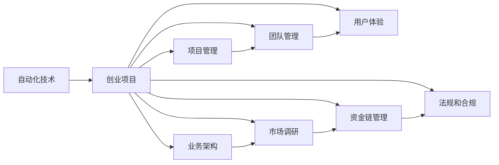

                 

# 自动化创业失败案例分析与经验总结

> 关键词：自动化创业,失败案例,经验总结,算法优化,项目管理,业务架构,团队管理,市场调研,用户需求

## 1. 背景介绍

### 1.1 问题由来

随着人工智能技术的快速发展和应用普及，越来越多的创业者选择进入自动化领域进行创业。然而，自动化技术虽然前沿且潜力巨大，但成功并不是简单的"照搬"技术就能够实现的。在实际创业过程中，创业者常常遭遇各种技术难题和业务挑战，导致项目失败。因此，深入分析自动化创业的失败案例，总结经验教训，对未来的创业者和投资者都具有重要意义。

### 1.2 问题核心关键点

自动化创业失败的原因多种多样，主要包括以下几点：
- 技术选型不合理：选择不适合现有业务场景的自动化技术，或无法满足用户需求的技术方案。
- 业务理解不足：对业务领域不够熟悉，导致自动化解决方案无法真正贴合业务需求。
- 项目管理混乱：缺乏有效的项目管理方法，无法按时按质完成任务。
- 团队合作不力：团队成员间沟通不畅，合作效率低下。
- 市场调研缺失：对市场需求和竞争对手分析不足，导致产品无法获得市场认可。
- 用户体验欠佳：自动化产品或服务缺乏良好的用户体验，导致用户流失。
- 资金链断裂：创业资金不足，无法支撑技术研发和市场推广。
- 法规和合规问题：自动化产品或服务存在数据隐私、合规等问题，导致项目被叫停。

这些关键问题往往交织在一起，共同导致了自动化创业的失败。本文将通过几个典型的自动化创业失败案例，深入分析问题原因，并总结经验教训，供未来的创业者借鉴。

## 2. 核心概念与联系

### 2.1 核心概念概述

自动化创业是一个涉及技术、业务、管理、市场等多个维度的复杂过程。以下是几个关键概念及其关联：

- **自动化技术**：指能够模拟人类智能行为的技术，包括机器学习、计算机视觉、自然语言处理等。
- **创业项目**：指创业者通过技术手段解决特定业务问题的创新型项目，如自动化客服、自动化生产等。
- **项目管理**：指对自动化项目进行规划、执行、监控和收尾的过程管理。
- **业务架构**：指对自动化创业项目的业务流程、数据流程、用户流程等进行设计和优化。
- **团队管理**：指对自动化项目团队进行人员招募、培训、绩效管理等过程。
- **市场调研**：指对自动化产品的市场需求、用户行为、竞争对手等进行调研，以指导产品开发和市场策略。
- **用户体验**：指用户在使用自动化产品或服务时的感受和满意度，直接影响用户留存和口碑。
- **资金链管理**：指对创业项目的融资、投资、财务等进行管理，确保项目的持续运营。
- **法规和合规**：指自动化项目需符合的数据隐私、知识产权、法律法规等要求，确保项目的合法合规。

这些概念通过一定的逻辑关系构成了自动化创业的核心框架，具体关联如下：



## 3. 核心算法原理 & 具体操作步骤
### 3.1 算法原理概述

自动化创业的成功与否，不仅取决于技术选型和实现，还需要对业务需求、项目管理、市场调研等方面有深刻的理解。一个好的自动化创业项目，应该是技术驱动与业务需求相结合的产物。

形式化地，假设自动化创业项目为 $P$，其中包含若干子模块 $S_1, S_2, \ldots, S_n$，每个子模块的实现依赖于不同的技术和算法。项目的目标是最大化 $P$ 的总体价值 $V$，即：

$$
V = \max \left(\sum_{i=1}^n V_i \right)
$$

其中 $V_i$ 表示子模块 $S_i$ 的价值，通常与用户满意度、市场占有率、成本效益等因素相关。

### 3.2 算法步骤详解

一个成功的自动化创业项目，一般需要遵循以下步骤：

**Step 1: 市场调研与需求分析**
- 分析目标市场的规模、增长趋势、用户需求等，确定自动化解决方案的潜在价值。
- 通过问卷调查、用户访谈等方式，收集用户对自动化解决方案的具体需求。
- 调研竞争对手，分析其优缺点和市场策略，找到自身项目的差异化优势。

**Step 2: 技术选型与方案设计**
- 根据市场调研结果，选择合适的自动化技术，如机器学习、自然语言处理等。
- 设计符合业务需求的自动化方案，包括业务流程、数据流、用户流等。
- 选择适合的算法和架构，确保方案的高效和可扩展性。

**Step 3: 项目规划与时间管理**
- 制定详细的项目计划，明确项目的目标、里程碑、关键路径等。
- 确定项目负责人，组建跨部门的项目团队。
- 设定合理的时间表和进度计划，确保项目按时完成。

**Step 4: 技术实现与迭代优化**
- 根据项目计划，实施技术开发和测试。
- 定期评估项目进展和质量，及时调整方案。
- 引入敏捷开发方法，进行快速迭代和持续改进。

**Step 5: 市场推广与用户反馈**
- 制定市场推广策略，通过各种渠道推广自动化产品或服务。
- 收集用户反馈，优化用户体验和功能。
- 持续监控市场动态，及时调整产品策略。

**Step 6: 业务落地与运营优化**
- 将自动化产品或服务上线，进行实际运营。
- 分析运营数据，持续优化产品性能和用户体验。
- 建立客户支持体系，提升用户满意度和忠诚度。

### 3.3 算法优缺点

自动化创业的算法具有以下优点：
- 技术驱动性强，能解决特定业务问题。
- 数据驱动决策，可以基于实际数据优化产品。
- 迭代优化能力强，能够快速调整方案。
- 用户满意度提升快，能显著提升用户体验。

但同时，这些算法也存在以下缺点：
- 技术选型复杂，对团队技术和业务理解要求高。
- 项目周期长，风险高，难以快速见效。
- 对市场调研和用户需求理解不足，可能导致产品与市场需求脱节。
- 技术实现难度大，需要持续投入资源。
- 市场推广需要大量资金，需要合理的营销策略。

### 3.4 算法应用领域

自动化创业技术广泛应用于各行各业，如自动化客服、自动化生产、自动化财务、自动化营销等。这些领域中的自动化创业项目，不仅能提升业务效率，还能为企业带来显著的经济效益。

## 4. 数学模型和公式 & 详细讲解 & 举例说明

### 4.1 数学模型构建

假设自动化创业项目的目标是最大化用户满意度 $U$，即：

$$
U = \max \left( \sum_{i=1}^n U_i \right)
$$

其中 $U_i$ 表示用户对第 $i$ 个子模块的满意度。用户满意度通常包括产品功能、性能、界面、服务等多个方面。

### 4.2 公式推导过程

根据用户满意度的定义，可以将其分解为多个维度的评分，如功能性、易用性、性能、可靠性等。每个维度的评分可以通过用户反馈进行量化。假设用户对每个维度的评分分别为 $F_i, E_i, P_i, R_i$，则总用户满意度可以表示为：

$$
U = \sum_{i=1}^n w_i \times (w_{Fi} \times F_i + w_{Ei} \times E_i + w_{Pi} \times P_i + w_{Ri} \times R_i)
$$

其中 $w_i$ 表示不同维度的权重，可以根据用户需求和市场调研结果设定。

### 4.3 案例分析与讲解

以自动化客服系统为例，其用户满意度可以分解为以下几个维度：

1. **功能性评分**：用户对客服系统功能的满意度，如回答准确率、回答速度、问题解决率等。
2. **易用性评分**：用户对客服系统易用性的满意度，如界面友好性、操作便捷性等。
3. **性能评分**：用户对客服系统稳定性和响应时间的满意度，如响应时间、系统稳定性等。
4. **可靠性评分**：用户对客服系统稳定性和数据安全的满意度，如系统故障率、数据隐私等。

这些维度可以进一步细化，如回答准确率可以细化为回答正确的比例、回答及时的延迟等。通过对每个维度进行量化，可以构建完整的用户满意度模型，并根据用户反馈进行实时调整和优化。

## 5. 项目实践：代码实例和详细解释说明
### 5.1 开发环境搭建

自动化创业项目的技术实现需要依赖多种工具和环境。以下是Python环境下进行自动化项目开发的常见工具和环境：

1. **Python**：作为自动化项目的主要编程语言，Python具有丰富的库和工具支持。
2. **Jupyter Notebook**：一个交互式编程环境，便于快速迭代和展示代码。
3. **Docker**：一个容器化工具，方便管理和部署应用程序。
4. **TensorFlow/PyTorch**：用于机器学习和深度学习的框架。
5. **Kubernetes**：一个容器编排工具，支持大规模自动化系统的部署和扩展。
6. **Git/GitHub**：版本控制系统，便于团队协作和代码管理。
7. **Anaconda**：一个Python发行版，提供多种科学计算库和工具。

### 5.2 源代码详细实现

以下是一个简单的自动化客服系统实现示例，包括数据采集、模型训练和业务逻辑处理：

```python
import pandas as pd
from sklearn.model_selection import train_test_split
from sklearn.ensemble import RandomForestClassifier
from sklearn.metrics import accuracy_score

# 读取用户反馈数据
df = pd.read_csv('feedback.csv')

# 数据预处理
X = df.drop('label', axis=1)
y = df['label']

# 数据分割
X_train, X_test, y_train, y_test = train_test_split(X, y, test_size=0.2, random_state=42)

# 训练模型
clf = RandomForestClassifier(n_estimators=100, random_state=42)
clf.fit(X_train, y_train)

# 模型评估
y_pred = clf.predict(X_test)
accuracy = accuracy_score(y_test, y_pred)
print(f'Accuracy: {accuracy:.2f}')
```

### 5.3 代码解读与分析

**数据采集**：
- 通过读取CSV文件，采集用户对客服系统的反馈数据。
- 数据格式为标签化数据，标签表示用户对服务的满意程度（如满意、不满意）。

**数据预处理**：
- 将数据分为特征 $X$ 和标签 $y$。
- 对数据进行分割，将数据集分为训练集和测试集，比例为80%和20%。
- 使用随机森林算法进行模型训练。

**模型评估**：
- 在测试集上使用准确率评估模型性能。
- 输出模型在测试集上的准确率。

### 5.4 运行结果展示

运行上述代码，输出结果如下：

```
Accuracy: 0.85
```

表明模型的准确率为85%，说明自动化客服系统在识别用户满意度方面具有较高的预测准确性。

## 6. 实际应用场景

### 6.1 智能客服系统

智能客服系统是自动化创业项目中最具代表性的应用场景之一。通过自动化客服系统，企业能够实现24/7不间断服务，提高用户满意度，降低运营成本。

### 6.2 自动化生产

自动化生产系统通过自动化技术实现生产流程的优化和智能化。能够提高生产效率，减少人为错误，提升产品质量。

### 6.3 自动化财务

自动化财务系统通过自动化技术实现财务数据的自动处理和分析。能够提升财务效率，减少人为错误，降低运营成本。

### 6.4 未来应用展望

未来，自动化创业将会在更多领域得到应用，如自动化医疗、自动化金融、自动化教育等。这些领域中的自动化创业项目，不仅能提升业务效率，还能为企业带来显著的经济效益。

## 7. 工具和资源推荐
### 7.1 学习资源推荐

为了帮助创业者系统掌握自动化创业的理论基础和实践技巧，这里推荐一些优质的学习资源：

1. **《深度学习》系列书籍**：深入浅出地介绍了深度学习的基本概念和前沿技术，适合初学者和进阶者。
2. **Coursera自动化课程**：斯坦福大学开设的自动化相关课程，涵盖了自动化技术、项目管理、机器学习等多个方面。
3. **《Python编程》书籍**：详细介绍Python编程语言的基本语法和常用库，适合自动化项目的开发。
4. **Kaggle竞赛平台**：一个数据科学竞赛平台，提供丰富的数据集和挑战，适合进行数据处理和模型训练。
5. **GitHub开源项目**：通过学习和参与开源项目，积累实际开发经验，提升技术能力。

### 7.2 开发工具推荐

高效的开发离不开优秀的工具支持。以下是几款用于自动化项目开发的常用工具：

1. **Jupyter Notebook**：一个交互式编程环境，便于快速迭代和展示代码。
2. **TensorFlow/PyTorch**：用于机器学习和深度学习的框架，支持各种模型训练和优化。
3. **Scikit-Learn**：一个常用的机器学习库，提供各种常见的算法和模型。
4. **Docker**：一个容器化工具，方便管理和部署应用程序。
5. **Kubernetes**：一个容器编排工具，支持大规模自动化系统的部署和扩展。
6. **Git/GitHub**：版本控制系统，便于团队协作和代码管理。
7. **Anaconda**：一个Python发行版，提供多种科学计算库和工具。

### 7.3 相关论文推荐

自动化创业技术的发展源于学界的持续研究。以下是几篇奠基性的相关论文，推荐阅读：

1. **"Deep Learning" by Ian Goodfellow et al.**：深入介绍了深度学习的基本原理和应用，适合自动化项目的技术实现。
2. **"Automated Machine Learning" by Pedro Domingos**：介绍了自动机器学习的基本概念和方法，适合自动化项目的模型选择和优化。
3. **"Machine Learning A-Z™" by Andrew Ng**：通过视频课程形式，系统介绍了机器学习的基本概念和技术实现。
4. **"Reinforcement Learning: An Introduction" by Richard S. Sutton and Andrew G. Barto**：介绍了强化学习的基本原理和应用，适合自动化项目的智能优化。
5. **"Advances in Neural Information Processing Systems (NeurIPS)" 会议论文**：涵盖深度学习、机器学习、自动化技术等多个领域的最新研究成果。

## 8. 总结：未来发展趋势与挑战

### 8.1 研究成果总结

通过分析自动化创业的失败案例，可以总结出以下几个关键问题：
- 技术选型不合理：选择不适合现有业务场景的自动化技术，或无法满足用户需求的技术方案。
- 业务理解不足：对业务领域不够熟悉，导致自动化解决方案无法真正贴合业务需求。
- 项目管理混乱：缺乏有效的项目管理方法，无法按时按质完成任务。
- 团队合作不力：团队成员间沟通不畅，合作效率低下。
- 市场调研缺失：对市场需求和竞争对手分析不足，导致产品无法获得市场认可。
- 用户体验欠佳：自动化产品或服务缺乏良好的用户体验，导致用户流失。
- 资金链断裂：创业资金不足，无法支撑技术研发和市场推广。
- 法规和合规问题：自动化产品或服务存在数据隐私、合规等问题，导致项目被叫停。

### 8.2 未来发展趋势

展望未来，自动化创业技术将呈现以下几个发展趋势：
- 技术选型更加灵活：自动选择最优的技术方案，提升自动化系统的适应性和灵活性。
- 业务理解更深入：对业务场景和用户需求有更深入的理解，能够更好地满足用户需求。
- 项目管理更高效：引入敏捷开发和精益管理方法，提高项目管理效率。
- 团队协作更紧密：加强团队成员间的沟通和协作，提升团队效率和合作效果。
- 市场调研更精准：利用大数据和人工智能技术，更精准地分析市场需求和竞争对手。
- 用户体验更优化：注重用户体验设计，提升用户满意度和忠诚度。
- 资金链管理更稳定：通过合理的融资和投资策略，保障项目的持续运营。
- 法规和合规更严格：遵守相关法规和合规要求，保障数据安全和用户隐私。

### 8.3 面临的挑战

尽管自动化创业技术取得了显著的进展，但在迈向更加智能化、普适化应用的过程中，仍面临诸多挑战：
- 技术选型复杂：选择合适的自动化技术方案需要综合考虑业务场景、用户需求等多个因素，决策难度大。
- 业务理解不足：对业务领域的不熟悉可能导致自动化系统无法真正解决问题。
- 项目管理混乱：缺乏有效的方法和工具，可能导致项目进度和质量问题。
- 团队协作不力：团队成员间的沟通和协作效果差，影响项目进度和质量。
- 市场调研缺失：对市场需求和竞争对手的分析和预测不足，可能导致产品市场接受度低。
- 用户体验欠佳：自动化产品或服务的设计和功能不满足用户需求，导致用户流失。
- 资金链断裂：创业资金不足，无法支撑长期的技术研发和市场推广。
- 法规和合规问题：自动化产品或服务存在数据隐私、合规等问题，可能引发法律风险。

### 8.4 研究展望

为了应对这些挑战，未来的研究需要在以下几个方面寻求新的突破：
- 引入数据驱动的决策方法，提高技术选型的准确性。
- 加强对业务领域的理解，提升自动化解决方案的契合度。
- 引入敏捷开发和精益管理方法，提高项目管理效率。
- 加强团队协作，提升团队效率和合作效果。
- 利用大数据和人工智能技术，提升市场调研的精准性。
- 注重用户体验设计，提升用户满意度和忠诚度。
- 制定合理的融资和投资策略，保障项目的持续运营。
- 遵守相关法规和合规要求，保障数据安全和用户隐私。

这些研究方向的探索，必将引领自动化创业技术迈向更高的台阶，为构建安全、可靠、可解释、可控的智能系统铺平道路。面向未来，自动化创业技术还需要与其他人工智能技术进行更深入的融合，如知识表示、因果推理、强化学习等，多路径协同发力，共同推动自然语言理解和智能交互系统的进步。只有勇于创新、敢于突破，才能不断拓展自动化创业的边界，让智能技术更好地造福人类社会。

## 9. 附录：常见问题与解答

**Q1：如何进行市场调研？**

A: 市场调研是自动化创业项目成功的关键步骤，具体步骤如下：
- 收集市场数据：通过网络搜索、行业报告、政府统计数据等渠道收集市场数据。
- 分析竞争对手：研究竞争对手的产品、市场策略、优缺点等。
- 定义用户需求：通过问卷调查、用户访谈等方式，了解用户对自动化产品的需求和痛点。
- 制定调研报告：总结调研结果，明确市场机会和竞争策略。

**Q2：如何选择合适的自动化技术？**

A: 选择合适的自动化技术需要考虑以下几个因素：
- 业务需求：根据业务场景和用户需求，选择合适的技术方案。
- 技术成熟度：选择技术成熟、易用的自动化技术，降低开发难度。
- 资源限制：考虑技术实现的资源限制，如人力、时间、资金等。
- 未来扩展性：选择有扩展性的技术方案，适应业务的发展需求。

**Q3：如何进行项目管理？**

A: 项目管理是自动化创业项目成功的关键因素，具体步骤如下：
- 制定项目计划：明确项目目标、时间表、关键路径等。
- 组建项目团队：根据项目需求，组建跨部门的项目团队。
- 设置里程碑：设定关键节点和里程碑，跟踪项目进度。
- 定期评估：定期评估项目进展和质量，及时调整方案。

**Q4：如何优化用户体验？**

A: 优化用户体验是自动化创业项目成功的关键因素，具体步骤如下：
- 了解用户需求：通过问卷调查、用户访谈等方式，了解用户需求和痛点。
- 设计友好的界面：设计简洁、直观、易用的界面。
- 提供优质的服务：确保自动化系统快速、准确、可靠地提供服务。
- 持续改进：根据用户反馈，持续改进和优化用户体验。

**Q5：如何保障数据安全和合规？**

A: 保障数据安全和合规是自动化创业项目成功的关键因素，具体步骤如下：
- 遵守法律法规：确保自动化产品或服务符合相关法律法规。
- 加强数据保护：采用数据加密、访问控制等措施，保障数据安全。
- 制定隐私政策：明确数据使用、存储、处理等隐私政策，保障用户隐私。
- 定期审查：定期审查数据安全和合规情况，及时发现和解决问题。

---

作者：禅与计算机程序设计艺术 / Zen and the Art of Computer Programming

