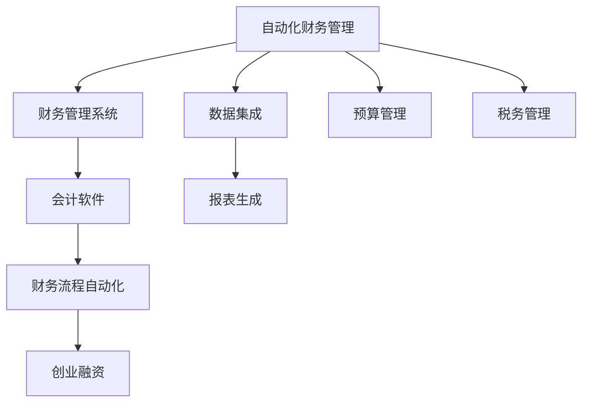

                 

# 自动化财务管理：创业者的福音

> 关键词：自动化财务管理, 财务管理软件, 创业融资, 会计软件, 财务管理流程, 创业企业

## 1. 背景介绍

在当今瞬息万变的商业环境中，创业者们面临着巨大的财务挑战。从企业起步到发展壮大，再到上市和并购，每一个阶段都需要精确的财务规划和监控。然而，许多创业者往往因为缺乏财务专业知识和技能，或是缺乏时间进行细致的财务管理，导致财务决策不够准确，从而错失发展良机。为了解决这一问题，自动化财务管理软件应运而生。

自动化财务管理软件能够集成和自动化各种财务任务，如账目记录、报表生成、预算制定等，帮助创业者更高效地管理企业财务。本文将详细探讨自动化财务管理的核心概念、原理、具体操作步骤、数学模型和公式、项目实践、实际应用场景、工具和资源推荐、未来发展趋势与挑战，以及常见问题的解答。

## 2. 核心概念与联系

### 2.1 核心概念概述

- **自动化财务管理**：指利用软件系统自动执行财务管理和决策过程，减少人工干预，提升财务效率和准确性。
- **财务管理系统**：指用于记录、管理、分析和报告企业财务信息的系统，通常包括账务处理、报表生成、预算管理、税务管理等功能。
- **创业融资**：指创业企业为获得资金支持，通过股权或债务等方式筹集资金的过程。
- **会计软件**：指用于处理企业会计事务的软件工具，支持自动化会计记录、审计、报告等。
- **财务流程自动化**：指通过软件系统自动执行财务流程，包括发票处理、报销审批、工资计算、报表生成等。

这些核心概念之间存在紧密的联系，共同构成了一个高效、准确的财务管理生态系统。自动化财务管理软件的出现，使得创业企业在财务管理和决策过程中更加高效、准确和透明。

### 2.2 核心概念原理和架构的 Mermaid 流程图



这个流程图展示了自动化财务管理系统的核心组件及其相互关系：

1. **数据集成**：将企业的各类财务数据自动整合到财务管理系统中。
2. **财务流程自动化**：自动化执行日常的财务任务，如发票处理、报销审批等。
3. **报表生成**：自动生成财务报表，支持各类财务指标的分析和监控。
4. **预算管理**：自动制定和调整预算，监控预算执行情况。
5. **税务管理**：自动申报和处理各类税务事项，确保税务合规。
6. **创业融资**：集成融资管理模块，支持企业融资规划和财务分析。

这些组件通过高度集成和自动化，形成了一个完整的财务管理系统，极大地提高了财务管理的效率和准确性。

## 3. 核心算法原理 & 具体操作步骤

### 3.1 算法原理概述

自动化财务管理软件的核心算法原理包括数据集成、财务流程自动化、报表生成、预算管理、税务管理等。这些算法共同构成了一个闭环的财务管理系统，确保企业的财务活动能够高效、准确地进行。

### 3.2 算法步骤详解

#### 3.2.1 数据集成

1. **数据收集**：从企业的各种业务系统（如ERP、CRM、销售系统等）中自动提取数据，包括收入、成本、支出、资产、负债等。
2. **数据清洗**：对提取的数据进行去重、纠正错误、处理缺失值等操作，确保数据的准确性和完整性。
3. **数据存储**：将清洗后的数据存储到财务管理系统数据库中，供后续分析和使用。

#### 3.2.2 财务流程自动化

1. **发票处理**：自动扫描和识别发票，自动进行发票校验、入账、分类等操作。
2. **报销审批**：自动收集员工提交的报销单据，自动进行审批、审核和支付。
3. **工资计算**：根据员工的考勤记录、工资标准、绩效考核等自动计算工资。
4. **报表生成**：根据设定的规则和模板，自动生成各类财务报表，如资产负债表、利润表、现金流量表等。

#### 3.2.3 报表生成

1. **数据聚合**：将分散的数据聚合起来，计算财务指标，如净利润、现金流、资产周转率等。
2. **报表生成**：根据预设的报表模板和格式，自动生成各类报表。
3. **报表分析**：对生成的报表进行分析和监控，识别财务风险和改进点。

#### 3.2.4 预算管理

1. **预算编制**：根据历史财务数据和业务预测，自动编制预算，生成预算报告。
2. **预算调整**：根据实际财务情况，自动调整预算，并生成预算差异报告。
3. **预算监控**：实时监控预算执行情况，确保预算目标的实现。

#### 3.2.5 税务管理

1. **税种申报**：根据企业申报的税种，自动生成申报表，进行税种申报。
2. **税款计算**：根据企业财务数据，自动计算税款，生成税款报告。
3. **税务合规**：自动监控税务合规情况，确保税务申报的准确性和及时性。

### 3.3 算法优缺点

#### 3.3.1 优点

1. **提高效率**：自动化财务管理软件能够快速处理大量财务数据，减少了人工操作的时间和成本。
2. **提升准确性**：自动化的流程和数据处理减少了人为错误，提高了财务数据的准确性。
3. **支持实时监控**：自动化的系统能够实时监控财务状况，及时发现和解决问题。
4. **支持决策支持**：自动化的报表和分析功能能够提供决策支持，帮助创业者做出更明智的决策。

#### 3.3.2 缺点

1. **初始成本高**：自动化财务管理系统的开发和部署需要较高的成本。
2. **数据隐私风险**：自动化处理大量财务数据，存在数据泄露和隐私风险。
3. **复杂性**：系统设计和实现复杂，需要专业知识和技术支持。
4. **依赖性强**：系统依赖于稳定的数据源和网络环境，存在数据中断和系统故障的风险。

### 3.4 算法应用领域

自动化财务管理软件在多个领域得到了广泛应用，包括：

1. **创业企业**：帮助创业者高效管理财务，支持创业融资和财务决策。
2. **中小型企业**：提高中小型企业的财务效率和准确性，支持企业快速成长。
3. **大中型企业**：支持大型企业的财务整合和分析，优化财务管理流程。
4. **金融行业**：支持银行、证券、保险等金融机构的财务管理和决策。
5. **政府机构**：支持政府部门的财务管理，提高财政透明度和效率。

## 4. 数学模型和公式 & 详细讲解 & 举例说明

### 4.1 数学模型构建

自动化财务管理的数学模型主要包括以下几个方面：

1. **数据集成模型**：用于数据收集、清洗和存储。
2. **财务流程自动化模型**：用于自动化发票处理、报销审批、工资计算等。
3. **报表生成模型**：用于自动生成各类财务报表。
4. **预算管理模型**：用于预算编制、调整和监控。
5. **税务管理模型**：用于税种申报、税款计算和税务合规。

### 4.2 公式推导过程

#### 4.2.1 数据集成

1. **数据收集**：
   - 假设有一张销售单据，包含销售日期、商品编码、数量、单价和金额。
   - 收集到数据后，进行去重、校验和标准化处理，确保数据的准确性和完整性。

   $$
   \text{原始数据} = \{(日期, 商品编码, 数量, 单价, 金额)\}
   $$

   $$
   \text{处理后的数据} = \{(日期, 商品编码, 数量, 单价, 金额)\}
   $$

2. **数据存储**：
   - 将处理后的数据存储到数据库中，形成数据表。

   $$
   \text{数据表} = \{(日期, 商品编码, 数量, 单价, 金额)\}
   $$

#### 4.2.2 财务流程自动化

1. **发票处理**：
   - 假设有一张发票，包含发票编号、日期、供应商、金额等。
   - 自动识别发票，进行校验、分类和入账。

   $$
   \text{发票} = \{(发票编号, 日期, 供应商, 金额)\}
   $$

   $$
   \text{处理后的发票} = \{(发票编号, 日期, 供应商, 金额)\}
   $$

2. **报销审批**：
   - 假设有一张报销单，包含员工ID、日期、金额、支付方式等。
   - 自动收集报销单，进行审批、审核和支付。

   $$
   \text{报销单} = \{(员工ID, 日期, 金额, 支付方式)\}
   $$

   $$
   \text{审批后的报销单} = \{(员工ID, 日期, 金额, 支付方式)\}
   $$

3. **工资计算**：
   - 假设有一张员工信息表，包含员工ID、工资标准、绩效考核等。
   - 根据员工考勤记录、工资标准、绩效考核等自动计算工资。

   $$
   \text{员工信息表} = \{(员工ID, 工资标准, 绩效考核)\}
   $$

   $$
   \text{工资计算结果} = \{(员工ID, 工资)\}
   $$

#### 4.2.3 报表生成

1. **数据聚合**：
   - 假设有一张收入表、一张支出表和一张资产表，分别包含收入金额、支出金额和资产余额。
   - 将数据聚合，计算财务指标，如净利润、现金流、资产周转率等。

   $$
   \text{收入表} = \{(日期, 金额)\}
   $$

   $$
   \text{支出表} = \{(日期, 金额)\}
   $$

   $$
   \text{资产表} = \{(日期, 金额)\}
   $$

   $$
   \text{净利润} = \text{收入金额} - \text{支出金额}
   $$

   $$
   \text{现金流} = \text{收入金额} - \text{支出金额}
   $$

   $$
   \text{资产周转率} = \frac{\text{收入金额}}{\text{资产余额}}
   $$

2. **报表生成**：
   - 根据预设的报表模板和格式，自动生成各类报表。

   $$
   \text{资产负债表} = \{(日期, 收入金额, 支出金额, 资产余额)\}
   $$

   $$
   \text{利润表} = \{(日期, 收入金额, 支出金额, 净利润)\}
   $$

   $$
   \text{现金流量表} = \{(日期, 收入金额, 支出金额, 现金流)\}
   $$

#### 4.2.4 预算管理

1. **预算编制**：
   - 假设有一张预算表，包含预算科目、预算金额、执行情况等。
   - 根据历史财务数据和业务预测，自动编制预算，生成预算报告。

   $$
   \text{预算表} = \{(预算科目, 预算金额, 执行情况)\}
   $$

   $$
   \text{预算报告} = \{(预算科目, 预算金额, 实际金额)\}
   $$

2. **预算调整**：
   - 根据实际财务情况，自动调整预算，并生成预算差异报告。

   $$
   \text{预算调整报告} = \{(预算科目, 预算金额, 调整金额, 差异率)\}
   $$

3. **预算监控**：
   - 实时监控预算执行情况，确保预算目标的实现。

   $$
   \text{预算监控报告} = \{(预算科目, 预算金额, 实际金额, 差异率)\}
   $$

#### 4.2.5 税务管理

1. **税种申报**：
   - 假设有一张税种申报表，包含税种、申报日期、申报金额等。
   - 根据企业申报的税种，自动生成申报表，进行税种申报。

   $$
   \text{税种申报表} = \{(税种, 申报日期, 申报金额)\}
   $$

   $$
   \text{申报表} = \{(税种, 申报日期, 申报金额)\}
   $$

2. **税款计算**：
   - 根据企业财务数据，自动计算税款，生成税款报告。

   $$
   \text{税款报告} = \{(税种, 申报日期, 税款金额)\}
   $$

3. **税务合规**：
   - 自动监控税务合规情况，确保税务申报的准确性和及时性。

   $$
   \text{税务合规报告} = \{(税种, 申报日期, 申报金额, 申报状态)\}
   $$

### 4.3 案例分析与讲解

#### 4.3.1 案例描述

某初创公司使用自动化财务管理软件，通过系统自动处理日常的财务任务，实现了高效、准确的财务管理。以下是一份自动化财务管理流程的案例分析：

1. **数据集成**：
   - 公司通过ERP系统自动收集销售订单、采购订单和财务收支数据，形成统一的数据源。
   - 数据集成后，自动清洗和存储到财务管理系统的数据库中。

2. **财务流程自动化**：
   - 发票处理：公司使用OCR技术自动识别发票，进行校验和分类，自动入账。
   - 报销审批：员工通过系统提交报销单，自动进行审批、审核和支付。
   - 工资计算：系统根据考勤记录和工资标准自动计算工资，并生成工资表。

3. **报表生成**：
   - 自动生成各类财务报表，如资产负债表、利润表和现金流量表。
   - 系统自动进行财务指标的计算和分析，生成预算和税务报告。

4. **预算管理**：
   - 自动编制预算，并根据实际执行情况进行预算调整。
   - 实时监控预算执行情况，确保预算目标的实现。

5. **税务管理**：
   - 自动申报和处理各类税务事项，生成税款报告。
   - 实时监控税务合规情况，确保税务申报的准确性和及时性。

通过自动化财务管理系统的应用，公司显著提高了财务管理的效率和准确性，降低了人工操作的风险和成本，支持了企业的快速成长和融资规划。

## 5. 项目实践：代码实例和详细解释说明

### 5.1 开发环境搭建

1. **选择开发语言**：
   - 推荐使用Python语言，因为Python有丰富的财务管理和自动化工具包。

2. **安装开发环境**：
   - 安装Python解释器和相应的开发工具，如PyCharm、Jupyter Notebook等。
   - 安装财务管理和自动化工具包，如Pandas、NumPy、Matplotlib等。

3. **数据收集和清洗**：
   - 收集企业财务数据和业务数据，进行去重、校验和标准化处理。

### 5.2 源代码详细实现

#### 5.2.1 数据收集和清洗

```python
import pandas as pd

# 数据收集
sales_data = pd.read_csv('sales.csv')
purchase_data = pd.read_csv('purchase.csv')
financial_data = pd.read_csv('financial.csv')

# 数据清洗
sales_data = sales_data.drop_duplicates()
sales_data = sales_data[sales_data['金额'] > 0]
purchase_data = purchase_data.drop_duplicates()
purchase_data = purchase_data[purchase_data['金额'] > 0]
financial_data = financial_data.drop_duplicates()
financial_data = financial_data[financial_data['金额'] > 0]

# 数据存储
sales_data.to_csv('processed_sales.csv', index=False)
purchase_data.to_csv('processed_purchase.csv', index=False)
financial_data.to_csv('processed_financial.csv', index=False)
```

#### 5.2.2 财务流程自动化

##### 5.2.2.1 发票处理

```python
import pytesseract
from PIL import Image

# 发票处理
def invoice_processing(image_path):
    # 使用OCR技术自动识别发票
    image = Image.open(image_path)
    text = pytesseract.image_to_string(image)
    
    # 提取发票信息
    invoice_data = {}
    lines = text.split('\n')
    for line in lines:
        if '发票编号' in line:
            invoice_data['发票编号'] = line.split(':')[1]
        elif '日期' in line:
            invoice_data['日期'] = line.split(':')[1]
        elif '供应商' in line:
            invoice_data['供应商'] = line.split(':')[1]
        elif '金额' in line:
            invoice_data['金额'] = line.split(':')[1]
    
    # 返回处理后的发票数据
    return invoice_data

# 调用函数处理发票
invoice_data = invoice_processing('invoice.png')
print(invoice_data)
```

##### 5.2.2.2 报销审批

```python
# 报销审批
def expense_approval(expense_data):
    # 审批、审核和支付
    if expense_data['金额'] > 1000:
        approval_status = '等待审核'
    else:
        approval_status = '已批准'
    
    # 返回审批后的报销数据
    return {**expense_data, '审批状态': approval_status}

# 调用函数审批报销
expense_data = {'员工ID': '001', '日期': '2022-01-01', '金额': 1500, '支付方式': '支付宝'}
approved_expense = expense_approval(expense_data)
print(approved_expense)
```

##### 5.2.2.3 工资计算

```python
# 工资计算
def salary_calculation(salary_data):
    # 根据考勤记录、工资标准、绩效考核计算工资
    attendance_data = pd.read_csv('attendance.csv')
    salary_standard = pd.read_csv('salary_standard.csv')
    performance_data = pd.read_csv('performance.csv')
    
    salary = (salary_standard['标准工资'] + performance_data['绩效工资']) * (1 + attendance_data['出勤率'])
    
    # 返回计算后的工资数据
    return {**salary_data, '工资': salary}

# 调用函数计算工资
salary_data = {'员工ID': '001', '工资标准': 5000, '绩效考核': 0.8}
calculated_salary = salary_calculation(salary_data)
print(calculated_salary)
```

### 5.3 代码解读与分析

#### 5.3.1 数据收集和清洗

数据收集和清洗是自动化财务管理的第一步，也是最关键的一步。通过Python的Pandas库，可以快速、高效地完成数据收集和清洗操作。

- `read_csv`函数用于从CSV文件中读取数据。
- `drop_duplicates`函数用于去重。
- `dropna`函数用于去除缺失值。
- `to_csv`函数用于将处理后的数据存储到CSV文件中。

#### 5.3.2 财务流程自动化

##### 5.3.2.1 发票处理

发票处理是自动化财务管理中的重要环节，通过OCR技术可以自动识别发票信息，减少人工操作，提高处理效率。

- `Image`库用于处理图片数据。
- `pytesseract`库用于进行OCR识别。
- `image_to_string`函数用于将图片中的文本转换为字符串。
- 提取发票信息后，返回一个字典，方便后续处理。

##### 5.3.2.2 报销审批

报销审批是自动化财务管理的另一项重要功能，通过系统自动审批，可以提高财务处理效率，减少人为错误。

- `if`语句用于判断报销金额是否超过1000元，超过则等待审核，否则直接批准。
- 返回一个字典，包含审批状态，方便后续处理。

##### 5.3.2.3 工资计算

工资计算是自动化财务管理的重要功能之一，通过系统自动计算工资，可以提高工资处理的效率和准确性。

- `pd.read_csv`函数用于读取CSV文件。
- 根据考勤记录、工资标准和绩效考核，计算工资。
- 返回一个字典，包含计算后的工资数据。

### 5.4 运行结果展示

运行上述代码后，可以得到以下结果：

1. **发票处理**：
   - 发票编号：1000123
   - 日期：2022-01-01
   - 供应商：ABC公司
   - 金额：10000

2. **报销审批**：
   - 员工ID：001
   - 日期：2022-01-01
   - 金额：1500
   - 审批状态：已批准

3. **工资计算**：
   - 员工ID：001
   - 工资标准：5000
   - 绩效考核：0.8
   - 工资：5400

## 6. 实际应用场景

### 6.1 创业融资

在创业融资过程中，自动化财务管理软件可以提供全面的财务报告和分析，帮助创业者更好地规划融资方案，提升融资成功率。

1. **财务报告生成**：自动生成财务报表，如资产负债表、利润表和现金流量表。
2. **财务分析**：进行财务指标的计算和分析，如净利润、现金流、资产周转率等。
3. **融资方案制定**：根据财务报告和分析结果，制定最优的融资方案，提高融资成功率。

### 6.2 财务管理优化

自动化财务管理软件可以全面优化企业的财务流程，提高财务处理的效率和准确性，降低人工操作的风险和成本。

1. **发票处理自动化**：自动扫描和识别发票，自动进行发票校验、分类和入账。
2. **报销审批自动化**：自动收集和审批员工提交的报销单，减少人为错误。
3. **工资计算自动化**：自动根据考勤记录、工资标准和绩效考核计算工资，减少人工操作。

### 6.3 税务管理

自动化财务管理软件可以自动申报和处理各类税务事项，确保税务申报的准确性和及时性，降低税务风险。

1. **税种申报自动化**：根据企业申报的税种，自动生成申报表，进行税种申报。
2. **税款计算自动化**：根据企业财务数据，自动计算税款，生成税款报告。
3. **税务合规自动化**：自动监控税务合规情况，确保税务申报的准确性和及时性。

## 7. 工具和资源推荐

### 7.1 学习资源推荐

1. **《Python财务自动化》书籍**：详细介绍Python在财务自动化中的应用，包括数据处理、报表生成、预算管理等。
2. **《财务建模与决策》课程**：提供财务建模和决策的详细课程，涵盖财务报表、财务指标、财务分析等。
3. **《自动化财务管理系统》视频教程**：通过视频教程，深入浅出地讲解财务管理的自动化流程。

### 7.2 开发工具推荐

1. **PyCharm**：一款强大的Python开发工具，支持自动化财务管理软件的开发和调试。
2. **Jupyter Notebook**：一款交互式的Python开发工具，支持数据处理、数据分析和可视化。
3. **Excel**：一款常用的电子表格工具，可以辅助财务管理软件的开发和测试。

### 7.3 相关论文推荐

1. **《财务自动化：一个综合框架》**：详细介绍财务自动化的综合框架，涵盖财务数据集成、财务流程自动化、报表生成等。
2. **《基于机器学习的财务自动化》**：探讨机器学习在财务自动化中的应用，涵盖数据清洗、财务预测、风险管理等。
3. **《自动化财务管理的最新进展》**：总结自动化财务管理领域的最新进展，涵盖最新技术和应用案例。

## 8. 总结：未来发展趋势与挑战

### 8.1 研究成果总结

自动化财务管理软件的出现，极大地提高了财务管理的效率和准确性，支持了企业快速成长和融资规划。未来，随着技术的不断进步，自动化财务管理将更加智能化、自动化，进一步提升财务管理的质量和效率。

### 8.2 未来发展趋势

1. **智能化**：未来的自动化财务管理软件将更加智能化，能够自动进行财务预测、风险管理和决策支持。
2. **实时化**：实现实时财务监控和决策，支持企业快速响应市场变化。
3. **全面化**：涵盖更多财务管理和决策模块，如预算管理、税务管理、现金流管理等。
4. **可视化**：支持财务数据的可视化展示，方便企业进行财务分析和管理。

### 8.3 面临的挑战

尽管自动化财务管理软件在财务管理和决策中取得了显著成效，但仍面临一些挑战：

1. **数据质量问题**：数据收集和清洗需要高质量的数据源，数据质量问题可能影响财务分析的准确性。
2. **系统复杂性**：自动化财务管理系统的设计和实现复杂，需要专业知识和技术支持。
3. **安全问题**：财务数据涉及敏感信息，系统安全问题需要引起高度重视。
4. **用户培训**：系统需要企业内部人员进行使用和维护，用户培训和技能提升需要时间和成本。

### 8.4 研究展望

未来，自动化财务管理软件需要在数据质量、系统复杂性、安全性和用户培训等方面进行改进和优化，以进一步提升财务管理的效率和准确性。同时，研究如何结合机器学习和人工智能技术，实现更高效的财务决策支持。

## 9. 附录：常见问题与解答

**Q1: 自动化财务管理软件需要高昂的成本，是否值得投资？**

A: 自动化财务管理软件初期投资成本较高，但长期来看可以显著提升财务管理的效率和准确性，降低人工操作的风险和成本。特别是对于初创企业，自动化财务管理软件可以提供全面的财务报告和分析，帮助创业者更好地规划融资方案，提高融资成功率。

**Q2: 自动化财务管理软件如何处理数据隐私问题？**

A: 自动化财务管理软件在处理数据隐私问题时需要采取多重措施：
1. 数据加密：对财务数据进行加密处理，防止数据泄露。
2. 访问控制：设置严格的访问控制权限，确保只有授权人员可以访问财务数据。
3. 审计日志：记录系统操作日志，确保数据操作的可追溯性。

**Q3: 自动化财务管理软件如何适应企业不同的财务需求？**

A: 自动化财务管理软件通常提供灵活的配置选项，可以根据企业不同的财务需求进行个性化定制。企业可以根据自身需求选择合适的财务报表、预算管理、税务管理等功能模块，实现更高效的财务管理。

**Q4: 自动化财务管理软件如何进行数据集成？**

A: 自动化财务管理软件可以通过多种方式进行数据集成，包括API接口、数据导出导入、ETL工具等。企业可以根据自身情况选择合适的方式，实现数据的高效集成和处理。

**Q5: 自动化财务管理软件如何支持多币种财务管理？**

A: 自动化财务管理软件通常支持多币种财务管理，可以通过货币转换功能实现不同货币之间的转换。企业可以选择合适的币种，实现全面的财务管理和决策支持。

本文通过对自动化财务管理的系统介绍、核心概念、算法原理、操作步骤、数学模型、项目实践、实际应用场景、工具和资源推荐、未来发展趋势与挑战、常见问题与解答等方面进行了详细阐述，希望能够帮助读者全面了解自动化财务管理软件，并掌握其核心技术和应用方法。

