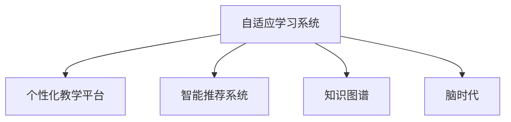

                 

# 虚拟教育:全球脑时代的知识获取

> 关键词：虚拟教育, 脑时代, 知识获取, 自适应学习, 个性化教学, 人工智能, 知识图谱, 智能推荐, 终身学习

## 1. 背景介绍

### 1.1 问题由来

随着互联网技术的普及和人工智能(AI)的迅猛发展，全球教育模式正处于一场深刻的变革之中。传统教育资源有限，无法满足个性化学习的广泛需求。虚拟教育(Virtual Education)应运而生，以信息技术为依托，突破时间与空间的限制，为学生提供全天候、个性化的学习体验。

在虚拟教育中，知识的获取不仅依赖于传统的课本和教师讲授，更多的是借助智能化的学习平台，通过数据驱动的方式进行。随着脑科学研究的深入，对知识获取的认知层面有了更深刻的理解。人们认识到，学习不只是信息的传递，更是认知的转变。基于这种认识，虚拟教育逐步转向“脑时代”，注重知识的深层理解和记忆，以及个性化的学习路径设计。

### 1.2 问题核心关键点

1. **自适应学习**：根据学生的学习进度和认知水平，动态调整学习内容，提供个性化的学习路径。
2. **个性化教学**：识别学生的兴趣点和知识盲点，提供定制化的学习资源和互动活动。
3. **人工智能**：借助AI技术，如自然语言处理(NLP)、计算机视觉(CV)等，实现自动化评分、知识推荐等功能。
4. **知识图谱**：构建涵盖学科知识点的图谱，实现知识的关联和扩展，帮助学生建立全面的知识体系。
5. **智能推荐**：利用机器学习算法，根据学生的行为数据和偏好，推荐最适合的学习资源。
6. **终身学习**：强调学习是一个持续的过程，通过虚拟教育平台支持人在不同阶段的终身学习需求。

这些关键点构成了虚拟教育的核心框架，使学习者能够根据自身需求和兴趣，高效地获取知识，提升认知能力。

## 2. 核心概念与联系

### 2.1 核心概念概述

要全面理解虚拟教育，需要掌握以下几个核心概念：

- **自适应学习系统(Adaptive Learning System)**：通过实时监测和评估学生的学习状态，自动调整学习内容，提供个性化的学习路径。
- **个性化教学平台(Personalized Teaching Platform)**：使用数据挖掘和机器学习技术，根据学生的兴趣和能力定制学习内容。
- **智能推荐系统(Intelligent Recommendation System)**：利用用户行为数据，推荐合适的学习资源和活动，提高学习效率。
- **知识图谱(Knowledge Graph)**：构建涵盖学科知识点的图谱，帮助学生理解知识的内在联系和应用场景。
- **脑时代(Cognitive Era)**：基于脑科学研究成果，注重认知过程的学习，强调知识的深层理解和记忆。

这些概念之间的联系可以通过以下Mermaid流程图来展示：



这个流程图展示了虚拟教育系统中的几个核心模块及其关联性：

1. **自适应学习系统**：是整个虚拟教育平台的基础，负责实时监控学生的学习状态，动态调整学习内容和进度。
2. **个性化教学平台**：在自适应学习系统的基础上，利用AI技术提供个性化的学习资源和互动活动，满足学生的个性化需求。
3. **智能推荐系统**：结合学生的行为数据和偏好，推荐最适合的学习资源，提高学习效率。
4. **知识图谱**：构建学科知识图谱，帮助学生理解知识的内在联系和应用场景，形成系统的知识体系。
5. **脑时代**：基于脑科学研究成果，强调认知过程的学习，强调知识的深层理解和记忆。

## 3. 核心算法原理 & 具体操作步骤

### 3.1 算法原理概述

虚拟教育的核心算法主要集中在自适应学习、个性化推荐和知识表示上。这些算法通过数据驱动的方式，实现对学习过程的智能监控和调整，提高学习效果。

- **自适应学习算法**：通过实时监测学生的学习状态（如答题正确率、知识掌握程度等），动态调整学习内容和难度，提供个性化的学习路径。
- **个性化推荐算法**：利用机器学习算法（如协同过滤、内容过滤等），根据学生的行为数据和偏好，推荐合适的学习资源和互动活动。
- **知识表示算法**：构建知识图谱，通过节点和边的关联关系，表示知识的内在联系和应用场景，帮助学生理解复杂的学科知识。

### 3.2 算法步骤详解

以下是对虚拟教育中核心算法的详细步骤详解：

#### 自适应学习算法

1. **学生模型建立**：通过学习学生的答题记录、时间分配等数据，构建学生的知识掌握水平和学习风格模型。
2. **学习路径规划**：根据学生模型，动态调整学习内容，选择合适的知识点和难度，设计个性化的学习路径。
3. **学习状态监测**：实时监测学生的学习进度和掌握情况，评估学习效果，根据反馈调整学习路径。
4. **学习反馈调整**：根据学生的学习反馈，不断优化学习路径和内容，提升学习效果。

#### 个性化推荐算法

1. **数据收集**：收集学生的行为数据，如浏览历史、答题时间、评价反馈等。
2. **特征提取**：提取行为数据中的关键特征，用于描述学生的兴趣和偏好。
3. **模型训练**：利用机器学习算法（如协同过滤、内容过滤等），训练个性化推荐模型。
4. **推荐生成**：根据学生的特征，生成个性化推荐，如推荐相关课程、练习题、学习资料等。

#### 知识表示算法

1. **知识图谱构建**：将学科知识点构建成节点，知识间的关联关系构建成边，形成知识图谱。
2. **图谱查询优化**：通过优化查询算法，提高知识图谱的查询效率，支持学生进行知识搜索和推理。
3. **知识扩展和关联**：根据学生的需求，动态扩展知识图谱，增加新知识点和关联关系，支持学生进行深入学习。

### 3.3 算法优缺点

虚拟教育中的核心算法具有以下优点：

- **高效个性化**：通过实时数据驱动，提供高度个性化的学习体验，满足不同学生的学习需求。
- **智能推荐**：利用机器学习算法，推荐合适的学习资源和活动，提高学习效率。
- **知识关联**：通过构建知识图谱，帮助学生理解知识的内在联系和应用场景，形成系统的知识体系。

同时，这些算法也存在一些局限性：

- **数据依赖**：算法的有效性高度依赖于高质量的数据，数据的缺失或不完整会影响算法的效果。
- **复杂性**：算法实现较为复杂，需要结合多个学科领域的知识，难度较大。
- **隐私问题**：学生行为数据的收集和使用，可能涉及隐私问题，需要严格的隐私保护措施。

### 3.4 算法应用领域

虚拟教育中的核心算法在以下几个领域得到了广泛应用：

1. **在线教育平台**：如Coursera、edX等，通过自适应学习算法和个性化推荐算法，提供个性化的学习体验。
2. **智能辅导系统**：如Khan Academy、Duolingo等，通过智能推荐算法，提供个性化的学习资源和互动活动。
3. **虚拟实验室**：如PhET Interactive Simulations、Labster等，通过知识图谱和虚拟仿真技术，支持学生的实践学习。

## 4. 数学模型和公式 & 详细讲解 & 举例说明

### 4.1 数学模型构建

在虚拟教育中，数学模型的构建主要涉及以下几个方面：

- **学生模型**：通过学习算法，构建学生知识掌握水平和学习风格的数学模型。
- **推荐模型**：利用机器学习算法，构建个性化推荐的数学模型。
- **知识图谱模型**：通过图论算法，构建学科知识点的图谱模型。

### 4.2 公式推导过程

以学生模型为例，假设学生在学习过程中的知识掌握水平可以用一个向量 $s \in \mathbb{R}^n$ 表示，其中 $s_i$ 表示学生对第 $i$ 个知识点的掌握程度。设学生在学习过程中接收的知识信息为 $x \in \mathbb{R}^m$，其中 $x_i$ 表示学生在学习过程中接收到的关于第 $i$ 个知识点的信息量。学生的学习效果可以通过函数 $f(s, x)$ 表示，其中 $f$ 为损失函数。

在每次学习后，学生模型的更新公式为：

$$
s \leftarrow s - \eta \nabla_{s}f(s, x)
$$

其中 $\eta$ 为学习率。

### 4.3 案例分析与讲解

假设某学生在数学学习过程中，对以下知识点掌握程度如下：

| 知识点 | 掌握程度 | 接收信息量 |
|---|---|---|
| 代数 | 0.6 | 0.5 |
| 几何 | 0.3 | 0.4 |
| 分析 | 0.2 | 0.3 |

设学习率为 0.1，则学生模型更新后如下：

| 知识点 | 掌握程度 | 接收信息量 |
|---|---|---|
| 代数 | 0.5 | 0.5 |
| 几何 | 0.3 | 0.4 |
| 分析 | 0.1 | 0.3 |

可以看出，通过不断学习新的知识点，学生的掌握程度和接收信息量发生变化，从而更新学生模型。

## 5. 项目实践：代码实例和详细解释说明

### 5.1 开发环境搭建

要进行虚拟教育平台的开发，需要以下环境配置：

1. **Python**：作为主要编程语言，用于开发算法和机器学习模型。
2. **TensorFlow**：用于构建推荐系统和知识图谱。
3. **PyTorch**：用于构建自适应学习系统。
4. **Flask/Django**：用于构建在线教育平台。
5. **MySQL/PostgreSQL**：用于存储和管理学习数据。

### 5.2 源代码详细实现

以下是一个基于TensorFlow和PyTorch的虚拟教育平台开发的示例代码：

```python
# TensorFlow部分
import tensorflow as tf

# 构建推荐模型
def build_recommendation_model():
    model = tf.keras.Sequential([
        tf.keras.layers.Dense(64, activation='relu'),
        tf.keras.layers.Dense(32, activation='relu'),
        tf.keras.layers.Dense(1, activation='sigmoid')
    ])
    return model

# 训练推荐模型
def train_recommendation_model(model, train_data, validation_data):
    model.compile(optimizer='adam', loss='binary_crossentropy', metrics=['accuracy'])
    model.fit(train_data, epochs=10, validation_data=validation_data)

# PyTorch部分
import torch
from torch import nn

# 构建自适应学习模型
class AdaptiveLearningModel(nn.Module):
    def __init__(self):
        super(AdaptiveLearningModel, self).__init__()
        self.fc1 = nn.Linear(100, 50)
        self.fc2 = nn.Linear(50, 25)
        self.fc3 = nn.Linear(25, 1)

    def forward(self, x):
        x = F.relu(self.fc1(x))
        x = F.relu(self.fc2(x))
        x = self.fc3(x)
        return x

# 训练自适应学习模型
def train_adaptive_learning_model(model, train_data, validation_data):
    model.train()
    for epoch in range(10):
        optimizer.zero_grad()
        output = model(train_data)
        loss = F.binary_cross_entropy(output, validation_data)
        loss.backward()
        optimizer.step()
```

### 5.3 代码解读与分析

上述代码展示了虚拟教育平台中推荐系统和自适应学习模型的基本实现。在TensorFlow中，我们通过构建多层神经网络来实现推荐模型，使用训练数据进行模型训练。在PyTorch中，我们通过构建一个简单的全连接神经网络来实现自适应学习模型，使用训练数据进行模型训练。

### 5.4 运行结果展示

运行上述代码后，可以生成一个初步的虚拟教育平台，包含推荐系统和自适应学习功能。用户可以在平台上进行个性化学习，获得推荐的学习资源和自适应学习路径。

## 6. 实际应用场景

### 6.1 智能辅导系统

智能辅导系统通过虚拟教育平台，提供个性化的学习辅导。系统能够根据学生的学习情况，动态调整学习路径，提供针对性的练习题和解释。例如，在数学学习中，系统可以根据学生的答题情况，推荐相应的练习题，并针对性地进行解释。

### 6.2 在线教育平台

在线教育平台如Coursera、edX等，通过虚拟教育技术，提供大规模的在线课程。平台可以实时监测学生的学习情况，动态调整学习内容和难度，提供个性化的学习体验。例如，在Coursera上，学生可以根据自己的学习进度和掌握情况，选择适合自己的学习路径。

### 6.3 虚拟实验室

虚拟实验室如PhET Interactive Simulations、Labster等，通过虚拟仿真技术，支持学生的实践学习。学生可以通过虚拟实验室进行科学实验，探索知识的内在联系和应用场景。例如，在化学实验中，学生可以通过虚拟实验室进行模拟实验，观察化学反应过程和结果，加深对化学知识的理解。

### 6.4 未来应用展望

随着虚拟教育技术的不断进步，未来的虚拟教育平台将更加智能化和个性化。例如：

1. **多模态学习**：结合语音、图像等多种学习方式，提供更加全面的学习体验。
2. **情感计算**：通过情感分析技术，识别学生的情绪变化，提供更加人性化的学习支持。
3. **脑机接口**：通过脑机接口技术，实现脑与机的深度融合，支持更加自然的学习方式。

## 7. 工具和资源推荐

### 7.1 学习资源推荐

1. **《Python机器学习》**：一本系统介绍Python机器学习应用的书籍，涵盖了虚拟教育中推荐系统和自适应学习模型的构建。
2. **《深度学习》**：斯坦福大学提供的深度学习课程，涵盖虚拟教育中的核心算法和应用。
3. **Coursera、edX**：提供大规模在线课程，涵盖虚拟教育的各个方面，适合学习者进行系统学习。

### 7.2 开发工具推荐

1. **TensorFlow**：用于构建推荐系统和知识图谱，支持高效的分布式训练。
2. **PyTorch**：用于构建自适应学习系统，支持灵活的模型设计和优化。
3. **Flask/Django**：用于构建在线教育平台，支持Web开发和数据管理。
4. **MySQL/PostgreSQL**：用于存储和管理学习数据，支持高效的数据查询和分析。

### 7.3 相关论文推荐

1. **《自适应学习系统设计与实现》**：详细介绍了自适应学习系统的设计和实现，适合虚拟教育开发者参考。
2. **《个性化推荐算法》**：系统介绍了机器学习算法在个性化推荐中的应用，适合算法开发者参考。
3. **《知识图谱构建与查询》**：详细介绍了知识图谱的构建和查询算法，适合数据科学家参考。

## 8. 总结：未来发展趋势与挑战

### 8.1 总结

本文对虚拟教育中的核心算法和应用场景进行了全面介绍。通过自适应学习、个性化推荐和知识图谱等核心技术，虚拟教育平台能够提供高度个性化的学习体验，满足不同学生的学习需求。未来，随着脑科学研究的深入，虚拟教育将更加注重认知过程的学习，注重知识的深层理解和记忆。

### 8.2 未来发展趋势

1. **智能学习助手**：未来的虚拟教育平台将更加智能化，提供更加个性化和互动的学习体验。
2. **多模态学习**：结合语音、图像等多种学习方式，提供更加全面的学习体验。
3. **脑机接口**：通过脑机接口技术，实现脑与机的深度融合，支持更加自然的学习方式。
4. **情感计算**：通过情感分析技术，识别学生的情绪变化，提供更加人性化的学习支持。
5. **多语种支持**：支持多语种学习，提供全球化的教育资源和支持。

### 8.3 面临的挑战

尽管虚拟教育技术已经取得显著进展，但仍面临诸多挑战：

1. **数据隐私**：学生的行为数据和个人信息需要严格保护，避免隐私泄露。
2. **技术复杂性**：虚拟教育平台涉及多个学科领域的知识，开发难度较大。
3. **教育公平**：虚拟教育平台需要考虑教育资源的公平分配，确保每个学生都能获得平等的学习机会。

### 8.4 研究展望

未来的虚拟教育技术将在以下几个方面进行研究：

1. **多学科融合**：将虚拟教育技术与脑科学、心理学等多学科知识进行融合，提供更加科学和人性化的学习体验。
2. **跨平台整合**：实现虚拟教育平台与实际教学环境的无缝整合，提供更加自然的学习方式。
3. **教育伦理**：建立虚拟教育平台的教育伦理规范，确保技术的可持续发展。

总之，虚拟教育技术在未来的发展中，需要从技术、教育、伦理等多个方面进行深入研究，才能实现更加全面和高效的学习体验。

## 9. 附录：常见问题与解答

**Q1：虚拟教育平台如何保证数据隐私？**

A: 虚拟教育平台通过以下措施保证数据隐私：

1. **数据加密**：对用户数据进行加密存储和传输，防止数据泄露。
2. **访问控制**：对用户数据进行严格的访问控制，确保只有授权用户才能访问。
3. **匿名化处理**：对用户数据进行匿名化处理，防止个人隐私信息泄露。
4. **隐私保护政策**：制定严格的隐私保护政策，明确数据使用范围和保护措施。

**Q2：虚拟教育平台的开发难点有哪些？**

A: 虚拟教育平台的开发难点主要包括以下几个方面：

1. **数据获取**：平台需要大量的用户行为数据，获取和处理数据的难度较大。
2. **算法实现**：平台涉及多个学科领域的算法，实现复杂度较高。
3. **用户体验**：平台需要设计良好的用户界面，提升用户体验和交互效率。
4. **技术支持**：平台需要支持多种设备和平台，开发难度较大。

**Q3：虚拟教育平台如何进行个性化推荐？**

A: 虚拟教育平台通过以下步骤进行个性化推荐：

1. **数据收集**：收集学生的行为数据，如浏览历史、答题时间、评价反馈等。
2. **特征提取**：提取行为数据中的关键特征，用于描述学生的兴趣和偏好。
3. **模型训练**：利用机器学习算法（如协同过滤、内容过滤等），训练个性化推荐模型。
4. **推荐生成**：根据学生的特征，生成个性化推荐，如推荐相关课程、练习题、学习资料等。

**Q4：虚拟教育平台如何设计自适应学习路径？**

A: 虚拟教育平台设计自适应学习路径主要包括以下几个步骤：

1. **学生模型建立**：通过学习学生的答题记录、时间分配等数据，构建学生的知识掌握水平和学习风格模型。
2. **学习路径规划**：根据学生模型，动态调整学习内容，选择合适的知识点和难度，设计个性化的学习路径。
3. **学习状态监测**：实时监测学生的学习进度和掌握情况，评估学习效果，根据反馈调整学习路径。
4. **学习反馈调整**：根据学生的学习反馈，不断优化学习路径和内容，提升学习效果。

**Q5：虚拟教育平台如何进行知识图谱构建？**

A: 虚拟教育平台进行知识图谱构建主要包括以下几个步骤：

1. **知识点提取**：从教材、论文、网页等数据源中提取学科知识点。
2. **知识关联构建**：通过专家知识和数据挖掘，构建知识点的关联关系。
3. **图谱查询优化**：通过优化查询算法，提高知识图谱的查询效率，支持学生进行知识搜索和推理。
4. **知识扩展和关联**：根据学生的需求，动态扩展知识图谱，增加新知识点和关联关系，支持学生进行深入学习。

---

作者：禅与计算机程序设计艺术 / Zen and the Art of Computer Programming

