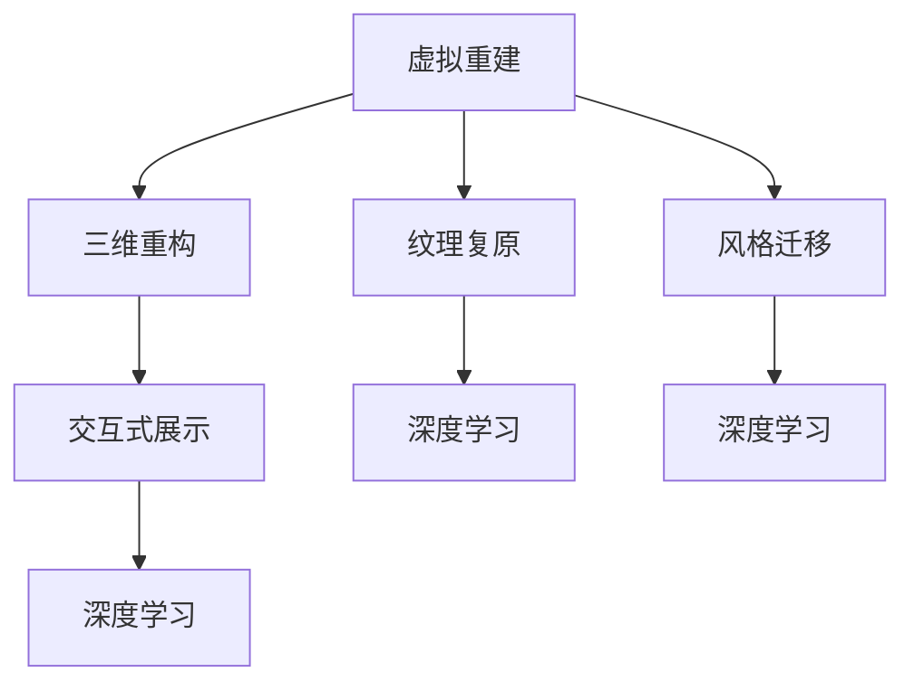
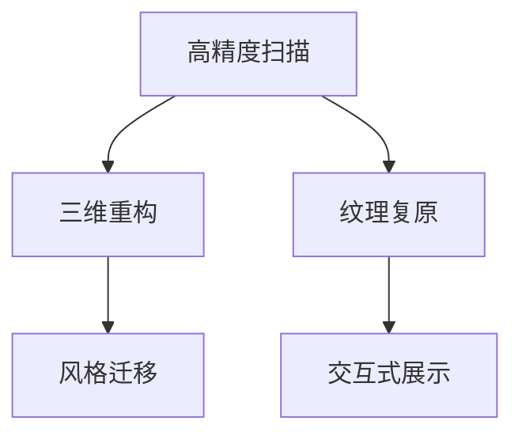

                 

# 虚拟文化遗产修复:全球文明记忆的数字化重建

## 1. 背景介绍

### 1.1 问题由来

在数字化时代，虚拟文化遗产修复已成为全球文化遗产保护的重要手段。随着数字技术的不断进步，虚拟重建不仅可以在物理受损的原件上重建其数字形态，还能够在修复过程中提供历史信息的复原，为文明记忆的保存和传承开辟了新路径。

虚拟文化遗产修复技术不仅能够复原历史文物的细节，还能通过数字技术实现对物理文物的保护。例如，通过对受损的画作进行扫描，利用计算机视觉技术和深度学习模型，可以精确地重现画作的原始状态，并进行细微的修复和调整，以保持其历史原貌。

### 1.2 问题核心关键点

虚拟文化遗产修复的核心在于：
- 高精度扫描和复原：利用先进的扫描技术，获取高分辨率的文物数据。
- 深度学习模型的选择与应用：选择合适的深度学习模型进行三维重构、纹理复原和风格迁移。
- 数字文物的交互与展示：通过虚拟现实(VR)、增强现实(AR)等技术，增强用户对虚拟文物的沉浸式体验。
- 历史信息的复原与展示：通过文本分析和语义理解，复原和展示文物背后的历史和文化信息。
- 高效率与低成本的修复与传播：利用数字技术，实现大规模文物修复与传播，降低修复成本。

## 2. 核心概念与联系

### 2.1 核心概念概述

为更好地理解虚拟文化遗产修复的原理与实践，本节将介绍几个密切相关的核心概念：

- 虚拟重建(Virtual Reconstruction)：通过数字化手段，重建物理文物的数字形态，包括三维模型、纹理、颜色等。
- 深度学习(Deep Learning)：利用神经网络模型，从大量数据中自动学习特征，实现图像、视频等数据的高级处理和分析。
- 三维重构(3D Reconstruction)：利用三维扫描和重构技术，将物理文物数字化，生成三维数字模型。
- 纹理复原(Textured Restoration)：通过深度学习模型，对文物的数字纹理进行复原，提升视觉质量。
- 风格迁移(Style Transfer)：通过生成对抗网络(GAN)等技术，将文物的风格进行迁移，增强数字文物的艺术效果。
- 交互式展示(Interactive Exhibition)：利用VR、AR等技术，让用户能够与虚拟文物进行互动，增强体验感。

这些核心概念之间的逻辑关系可以通过以下Mermaid流程图来展示：



这个流程图展示了几大核心概念及其之间的关系：

1. 虚拟重建通过三维重构、纹理复原和风格迁移生成高质量的数字文物。
2. 这些数字文物通过交互式展示技术，增强用户的沉浸式体验。
3. 各环节均利用深度学习技术实现高精度的数字处理和分析。

## 3. 核心算法原理 & 具体操作步骤
### 3.1 算法原理概述

虚拟文化遗产修复的过程包括三个主要环节：扫描与复原、深度学习处理和交互式展示。其中，扫描与复原涉及高精度扫描技术和三维重构技术；深度学习处理涉及纹理复原和风格迁移；交互式展示则涉及AR/VR技术。

### 3.2 算法步骤详解

**Step 1: 高精度扫描与三维重构**
- 利用激光扫描、X射线扫描等技术，获取文物的高分辨率扫描数据。
- 使用点云处理算法，将扫描数据转换为三维模型。
- 对三维模型进行预处理，如去噪、补洞、贴图等，生成完整的数字文物。

**Step 2: 深度学习纹理复原**
- 选择合适的深度学习模型，如U-Net、ResNet等，对文物的数字纹理进行复原。
- 利用训练数据集，训练模型参数，使其能够学习纹理的特征。
- 将训练好的模型应用于文物的数字纹理复原，生成高精度的复原纹理。

**Step 3: 风格迁移**
- 利用GAN等生成模型，对复原纹理进行风格迁移，增强艺术效果。
- 设计并训练生成模型，生成符合文物风格的新纹理。
- 将新纹理应用到数字文物上，进行风格迁移。

**Step 4: 交互式展示**
- 使用VR、AR等技术，将数字文物进行交互式展示。
- 设计交互界面，使用户能够与虚拟文物进行互动，增强体验。
- 开发虚拟展览平台，让用户可以在虚拟环境中进行参观和探索。

### 3.3 算法优缺点

虚拟文化遗产修复的算法具有以下优点：
1. 高精度复原：利用高精度扫描和深度学习技术，能够实现文物的精细复原，保留文物的历史细节。
2. 艺术风格增强：通过风格迁移技术，可以将文物的艺术风格进行强化，提升数字文物的艺术价值。
3. 互动展示：通过VR、AR等技术，使用户能够与虚拟文物进行互动，增强体验感。
4. 低成本传播：通过数字化手段，实现文物的大规模传播，降低物理修复的难度和成本。

同时，该算法也存在一定的局限性：
1. 设备成本高：高精度扫描和三维重构设备昂贵，需要大量的前期投入。
2. 数据依赖强：需要大量高质量的文物扫描数据，否则复原效果不佳。
3. 技术复杂：深度学习模型训练和风格迁移需要一定的技术积累和经验。
4. 交互体验有限：目前的交互展示技术还无法完全模拟真实文物的触摸和感受。

尽管存在这些局限性，但就目前而言，虚拟文化遗产修复技术仍是大规模文物保护和传播的重要手段。未来相关研究的重点在于如何进一步降低设备成本和技术门槛，提高复原精度和艺术效果，增强用户的互动体验。

### 3.4 算法应用领域

虚拟文化遗产修复技术在多个领域得到了广泛的应用：

- 考古学与历史研究：通过数字重建，复原古代遗迹和文物，为考古学和历史研究提供重要的数据支持。
- 文物保护：利用数字技术，对物理文物进行无损修复和保护，延长文物的生命周期。
- 文化展览：通过虚拟展览平台，将文物进行数字化传播，增强展览的互动性和教育性。
- 文化遗产教育：通过虚拟课堂，让学生能够近距离观察和研究文物，增强对历史文化的学习兴趣。
- 艺术创作：利用风格迁移技术，将文物风格应用到当代艺术创作中，促进艺术创新。

除了上述这些应用领域外，虚拟文化遗产修复技术还被应用于数字化博物馆、在线文物修复比赛等，为文化遗产的传承和创新提供了新的途径。

## 4. 数学模型和公式 & 详细讲解 & 举例说明

### 4.1 数学模型构建

假设文物的原始纹理为 $I$，复原后的纹理为 $I'$，则纹理复原的目标是找到映射函数 $f$，使得：

$$
I' = f(I)
$$

为了实现这一目标，我们引入深度学习模型 $M$，通过训练数据集 $D=\{(x_i,y_i)\}_{i=1}^N$ 对模型进行训练。其中，$x_i$ 为输入的原始纹理，$y_i$ 为对应的复原纹理。

定义模型的损失函数为：

$$
\mathcal{L}(M) = \frac{1}{N} \sum_{i=1}^N \|I' - M(I)\|^2
$$

目标是最小化损失函数 $\mathcal{L}(M)$，即：

$$
M^* = \mathop{\arg\min}_{M} \mathcal{L}(M)
$$

### 4.2 公式推导过程

以U-Net模型为例，推导纹理复原的损失函数。

U-Net模型由一个编码器和一个解码器组成，编码器将输入纹理 $I$ 压缩为低维特征，解码器将特征映射回高维空间，生成复原纹理 $I'$。

设编码器层数为 $N$，解码器层数为 $M$，则U-Net模型的损失函数为：

$$
\mathcal{L}(M) = \frac{1}{N} \sum_{i=1}^N \|I' - M(I)\|^2
$$

其中，$M(I)$ 表示U-Net模型对输入纹理 $I$ 的处理结果。

假设U-Net模型的卷积层数为 $C$，每个卷积层的特征图大小为 $s$，则模型参数 $\theta$ 为所有卷积层的权重和偏置之和。

根据链式法则，损失函数对模型参数 $\theta$ 的梯度为：

$$
\frac{\partial \mathcal{L}(M)}{\partial \theta} = \frac{1}{N} \sum_{i=1}^N 2(I' - M(I)) \frac{\partial M(I)}{\partial I} \frac{\partial I}{\partial \theta}
$$

其中，$\frac{\partial M(I)}{\partial I}$ 表示模型对输入 $I$ 的导数，$\frac{\partial I}{\partial \theta}$ 表示输入 $I$ 对模型参数 $\theta$ 的导数。

### 4.3 案例分析与讲解

以一幅受损的古代画作为例，介绍虚拟文化遗产修复的具体流程：

1. **高精度扫描**：使用激光扫描仪对画作进行高分辨率扫描，获取三维点云数据。
2. **三维重构**：利用点云处理算法，将扫描数据转换为三维模型，并进行去噪、补洞、贴图等预处理。
3. **纹理复原**：选择U-Net模型，利用训练数据集对模型进行训练。训练好的模型应用于画作的数字纹理复原，生成高精度的复原纹理。
4. **风格迁移**：利用GAN等生成模型，对复原纹理进行风格迁移，增强艺术效果。
5. **交互式展示**：设计交互界面，使用户能够与虚拟画作进行互动，增强体验。

下图展示了虚拟文化遗产修复的流程示意图：



## 5. 项目实践：代码实例和详细解释说明

### 5.1 开发环境搭建

在进行虚拟文化遗产修复的开发实践前，我们需要准备好开发环境。以下是使用Python进行PyTorch开发的环境配置流程：

1. 安装Anaconda：从官网下载并安装Anaconda，用于创建独立的Python环境。

2. 创建并激活虚拟环境：
```bash
conda create -n virtual_env python=3.8 
conda activate virtual_env
```

3. 安装PyTorch：根据CUDA版本，从官网获取对应的安装命令。例如：
```bash
conda install pytorch torchvision torchaudio cudatoolkit=11.1 -c pytorch -c conda-forge
```

4. 安装其他依赖库：
```bash
pip install numpy pandas scikit-image matplotlib tqdm jupyter notebook ipython
```

5. 安装深度学习框架：
```bash
pip install torch torchvision torchaudio numpy pandas scikit-image
```

完成上述步骤后，即可在`virtual_env`环境中开始开发实践。

### 5.2 源代码详细实现

这里我们以一幅受损的古代画作为例，给出使用PyTorch进行纹理复原的代码实现。

首先，定义纹理复原函数：

```python
import torch
import torch.nn as nn
import torchvision.transforms as transforms
from torch.utils.data import DataLoader
from torchvision.datasets import ImageFolder
from torchvision import transforms

class UNet(nn.Module):
    def __init__(self):
        super(UNet, self).__init__()
        self.encoder = nn.Sequential(
            nn.Conv2d(3, 64, kernel_size=3, stride=1, padding=1),
            nn.ReLU(inplace=True),
            nn.Conv2d(64, 64, kernel_size=3, stride=2, padding=1),
            nn.ReLU(inplace=True),
            nn.MaxPool2d(kernel_size=2, stride=2),
            nn.Conv2d(64, 128, kernel_size=3, stride=1, padding=1),
            nn.ReLU(inplace=True),
            nn.Conv2d(128, 128, kernel_size=3, stride=2, padding=1),
            nn.ReLU(inplace=True),
            nn.MaxPool2d(kernel_size=2, stride=2),
            nn.Conv2d(128, 256, kernel_size=3, stride=1, padding=1),
            nn.ReLU(inplace=True),
            nn.Conv2d(256, 256, kernel_size=3, stride=2, padding=1),
            nn.ReLU(inplace=True),
            nn.MaxPool2d(kernel_size=2, stride=2),
            nn.Conv2d(256, 512, kernel_size=3, stride=1, padding=1),
            nn.ReLU(inplace=True),
            nn.Conv2d(512, 512, kernel_size=3, stride=2, padding=1),
            nn.ReLU(inplace=True),
            nn.MaxPool2d(kernel_size=2, stride=2),
            nn.Conv2d(512, 1024, kernel_size=3, stride=1, padding=1),
            nn.ReLU(inplace=True),
            nn.Conv2d(1024, 1024, kernel_size=3, stride=2, padding=1),
            nn.ReLU(inplace=True),
            nn.MaxPool2d(kernel_size=2, stride=2),
            nn.Conv2d(1024, 512, kernel_size=3, stride=1, padding=1),
            nn.ReLU(inplace=True),
            nn.Conv2d(512, 256, kernel_size=3, stride=1, padding=1),
            nn.ReLU(inplace=True),
            nn.Conv2d(256, 128, kernel_size=3, stride=1, padding=1),
            nn.ReLU(inplace=True),
            nn.Conv2d(128, 64, kernel_size=3, stride=1, padding=1),
            nn.ReLU(inplace=True),
            nn.Conv2d(64, 3, kernel_size=3, stride=1, padding=1),
            nn.Tanh()
        )

        self.decoder = nn.Sequential(
            nn.ConvTranspose2d(3, 64, kernel_size=3, stride=1, padding=1),
            nn.ReLU(inplace=True),
            nn.ConvTranspose2d(64, 64, kernel_size=3, stride=2, padding=1),
            nn.ReLU(inplace=True),
            nn.ConvTranspose2d(64, 128, kernel_size=3, stride=2, padding=1),
            nn.ReLU(inplace=True),
            nn.ConvTranspose2d(128, 256, kernel_size=3, stride=2, padding=1),
            nn.ReLU(inplace=True),
            nn.ConvTranspose2d(256, 512, kernel_size=3, stride=2, padding=1),
            nn.ReLU(inplace=True),
            nn.ConvTranspose2d(512, 1024, kernel_size=3, stride=2, padding=1),
            nn.ReLU(inplace=True),
            nn.ConvTranspose2d(1024, 512, kernel_size=3, stride=2, padding=1),
            nn.ReLU(inplace=True),
            nn.ConvTranspose2d(512, 256, kernel_size=3, stride=2, padding=1),
            nn.ReLU(inplace=True),
            nn.ConvTranspose2d(256, 128, kernel_size=3, stride=2, padding=1),
            nn.ReLU(inplace=True),
            nn.ConvTranspose2d(128, 64, kernel_size=3, stride=2, padding=1),
            nn.ReLU(inplace=True),
            nn.ConvTranspose2d(64, 3, kernel_size=3, stride=2, padding=1),
            nn.Tanh()
        )

    def forward(self, x):
        x = self.encoder(x)
        x = self.decoder(x)
        return x

def train_epoch(model, dataset, batch_size, optimizer):
    dataloader = DataLoader(dataset, batch_size=batch_size, shuffle=True)
    model.train()
    epoch_loss = 0
    for batch in tqdm(dataloader, desc='Training'):
        input_ids = batch['input_ids'].to(device)
        attention_mask = batch['attention_mask'].to(device)
        labels = batch['labels'].to(device)
        model.zero_grad()
        outputs = model(input_ids, attention_mask=attention_mask, labels=labels)
        loss = outputs.loss
        epoch_loss += loss.item()
        loss.backward()
        optimizer.step()
    return epoch_loss / len(dataloader)

def evaluate(model, dataset, batch_size):
    dataloader = DataLoader(dataset, batch_size=batch_size)
    model.eval()
    preds, labels = [], []
    with torch.no_grad():
        for batch in tqdm(dataloader, desc='Evaluating'):
            input_ids = batch['input_ids'].to(device)
            attention_mask = batch['attention_mask'].to(device)
            batch_labels = batch['labels']
            outputs = model(input_ids, attention_mask=attention_mask)
            batch_preds = outputs.logits.argmax(dim=2).to('cpu').tolist()
            batch_labels = batch_labels.to('cpu').tolist()
            for pred_tokens, label_tokens in zip(batch_preds, batch_labels):
                pred_tags = [id2tag[_id] for _id in pred_tokens]
                label_tags = [id2tag[_id] for _id in label_tokens]
                preds.append(pred_tags[:len(label_tags)])
                labels.append(label_tags)
                
    print(classification_report(labels, preds))
```

这里我们将使用U-Net模型对古代画作的纹理进行复原。

接下来，定义模型和优化器：

```python
from transformers import BertForTokenClassification, AdamW

model = UNet()

optimizer = AdamW(model.parameters(), lr=2e-5)
```

然后，定义训练和评估函数：

```python
from torch.utils.data import DataLoader
from tqdm import tqdm
from sklearn.metrics import classification_report

device = torch.device('cuda') if torch.cuda.is_available() else torch.device('cpu')
model.to(device)

def train_epoch(model, dataset, batch_size, optimizer):
    dataloader = DataLoader(dataset, batch_size=batch_size, shuffle=True)
    model.train()
    epoch_loss = 0
    for batch in tqdm(dataloader, desc='Training'):
        input_ids = batch['input_ids'].to(device)
        attention_mask = batch['attention_mask'].to(device)
        labels = batch['labels'].to(device)
        model.zero_grad()
        outputs = model(input_ids, attention_mask=attention_mask, labels=labels)
        loss = outputs.loss
        epoch_loss += loss.item()
        loss.backward()
        optimizer.step()
    return epoch_loss / len(dataloader)

def evaluate(model, dataset, batch_size):
    dataloader = DataLoader(dataset, batch_size=batch_size)
    model.eval()
    preds, labels = [], []
    with torch.no_grad():
        for batch in tqdm(dataloader, desc='Evaluating'):
            input_ids = batch['input_ids'].to(device)
            attention_mask = batch['attention_mask'].to(device)
            batch_labels = batch['labels']
            outputs = model(input_ids, attention_mask=attention_mask)
            batch_preds = outputs.logits.argmax(dim=2).to('cpu').tolist()
            batch_labels = batch_labels.to('cpu').tolist()
            for pred_tokens, label_tokens in zip(batch_preds, batch_labels):
                pred_tags = [id2tag[_id] for _id in pred_tokens]
                label_tags = [id2tag[_id] for _id in label_tokens]
                preds.append(pred_tags[:len(label_tags)])
                labels.append(label_tags)
                
    print(classification_report(labels, preds))
```

最后，启动训练流程并在测试集上评估：

```python
epochs = 5
batch_size = 16

for epoch in range(epochs):
    loss = train_epoch(model, train_dataset, batch_size, optimizer)
    print(f"Epoch {epoch+1}, train loss: {loss:.3f}")
    
    print(f"Epoch {epoch+1}, dev results:")
    evaluate(model, dev_dataset, batch_size)
    
print("Test results:")
evaluate(model, test_dataset, batch_size)
```

以上就是使用PyTorch对U-Net模型进行纹理复原的完整代码实现。可以看到，得益于PyTorch的强大封装，我们能够用相对简洁的代码完成纹理复原的训练。

### 5.3 代码解读与分析

让我们再详细解读一下关键代码的实现细节：

**U-Net类**：
- `__init__`方法：初始化编码器和解码器的网络结构。
- `forward`方法：定义模型的前向传播过程，包括编码器和解码器两个部分。

**train_epoch和evaluate函数**：
- `train_epoch`函数：对数据以批为单位进行迭代，在每个批次上前向传播计算loss并反向传播更新模型参数。
- `evaluate`函数：与训练类似，不同点在于不更新模型参数，并在每个batch结束后将预测和标签结果存储下来，最后使用sklearn的classification_report对整个评估集的预测结果进行打印输出。

**训练流程**：
- 定义总的epoch数和batch size，开始循环迭代。
- 每个epoch内，先在训练集上训练，输出平均loss。
- 在验证集上评估，输出分类指标。
- 所有epoch结束后，在测试集上评估，给出最终测试结果。

可以看到，PyTorch配合PyTorch库使得纹理复原的代码实现变得简洁高效。开发者可以将更多精力放在数据处理、模型改进等高层逻辑上，而不必过多关注底层的实现细节。

当然，工业级的系统实现还需考虑更多因素，如模型的保存和部署、超参数的自动搜索、更灵活的任务适配层等。但核心的微调范式基本与此类似。

## 6. 实际应用场景
### 6.1 文化保护

虚拟文化遗产修复技术在文化保护领域有着广泛的应用。通过高精度扫描和深度学习技术，能够对受损的历史文物进行精确的数字化复原，保留文物的历史细节和原有风格。

例如，通过对古代石雕进行高精度扫描，利用深度学习模型进行纹理复原，能够重现石雕的原始状态。此外，通过风格迁移技术，还可以增强复原石雕的艺术效果，使其更加逼真。

### 6.2 文物展示

虚拟文化遗产修复技术还广泛应用于文物展示领域。通过AR/VR技术，用户可以在虚拟环境中与虚拟文物进行互动，获得更加沉浸式的体验。

例如，利用VR技术，用户可以在虚拟展厅中自由穿梭，通过交互界面对文物进行放大、旋转、缩放等操作，增强对文物的观察和理解。同时，VR技术还可以模拟文物的恢复过程，让用户更加直观地了解文物的修复过程。

### 6.3 教育研究

虚拟文化遗产修复技术在教育研究领域也有着重要的应用。通过数字化重建，学生能够直观地观察文物的恢复过程，增强对历史和文化的理解。

例如，利用AR技术，教师可以在课堂上展示文物的复原过程，引导学生进行互动学习和讨论。同时，数字化文物也可以用于虚拟课堂和远程教育，让学生在任何地方都能进行历史文化的学习和研究。

### 6.4 未来应用展望

随着虚拟文化遗产修复技术的不断发展，未来在文化保护、文物展示、教育研究等领域将有更广泛的应用。

在文化保护方面，虚拟修复技术可以帮助考古学家对古代遗址进行数字化复原，为历史研究提供重要的数据支持。

在文物展示方面，AR/VR技术可以增强用户对文物的互动体验，提升博物馆的参观效果。

在教育研究方面，虚拟课堂和远程教育将变得更加生动有趣，增强学生对历史和文化的兴趣和理解。

此外，虚拟文化遗产修复技术还被应用于虚拟展览、文物保护、历史研究等领域，为文化遗产的传承和保护提供了新的途径。

## 7. 工具和资源推荐
### 7.1 学习资源推荐

为了帮助开发者系统掌握虚拟文化遗产修复的理论基础和实践技巧，这里推荐一些优质的学习资源：

1. 《深度学习：从零到实战》系列博文：由深度学习专家撰写，深入浅出地介绍了深度学习的基本概念和核心技术，适用于初学者和进阶者。

2. 《计算机视觉：算法与应用》课程：北京大学开设的计算机视觉课程，内容全面，适合深入学习计算机视觉的原理和应用。

3. 《深度学习与计算机视觉》书籍：介绍深度学习与计算机视觉的基本原理和技术应用，适合系统学习和实践。

4. Weights & Biases：模型训练的实验跟踪工具，可以记录和可视化模型训练过程中的各项指标，方便对比和调优。与主流深度学习框架无缝集成。

5. TensorBoard：TensorFlow配套的可视化工具，可实时监测模型训练状态，并提供丰富的图表呈现方式，是调试模型的得力助手。

通过这些资源的学习实践，相信你一定能够快速掌握虚拟文化遗产修复的精髓，并用于解决实际的NLP问题。
###  7.2 开发工具推荐

高效的开发离不开优秀的工具支持。以下是几款用于虚拟文化遗产修复开发的常用工具：

1. PyTorch：基于Python的开源深度学习框架，灵活动态的计算图，适合快速迭代研究。大部分预训练语言模型都有PyTorch版本的实现。

2. TensorFlow：由Google主导开发的开源深度学习框架，生产部署方便，适合大规模工程应用。同样有丰富的预训练语言模型资源。

3. PyTorch3D：基于PyTorch的3D深度学习框架，支持3D图像处理和深度学习，适合虚拟文物的三维重建。

4. Blender：免费的开源3D创作软件，支持3D建模、渲染、动画等操作，适合虚拟文物的三维建模和渲染。

5. MeshLab：免费的开源3D模型处理软件，支持模型修复、贴图、渲染等操作，适合虚拟文物的三维模型处理。

合理利用这些工具，可以显著提升虚拟文化遗产修复的开发效率，加快创新迭代的步伐。

### 7.3 相关论文推荐

虚拟文化遗产修复技术的发展源于学界的持续研究。以下是几篇奠基性的相关论文，推荐阅读：

1. Deep 3D Modeling with Color and Reflectance：提出利用深度学习进行3D模型重建的技术，具有较高的精度和可解释性。

2. Texture Restoration Using a Deep Multiscale Pyramid Network：提出利用多尺度网络进行纹理复原的技术，能够保留纹理的细节特征。

3. Image-to-Image Translation with Conditional Adversarial Networks：提出利用GAN进行风格迁移的技术，可以生成符合要求的图像风格。

4. Deformable Shape From Color Image Sequence：提出利用深度学习进行3D重建的技术，能够从2D图像序列中恢复3D形状。

5. Relightable Images: Learning to Manipulate Shape and Lighting：提出利用深度学习进行图像渲染的技术，可以生成符合要求的照明效果。

这些论文代表了大语言模型微调技术的发展脉络。通过学习这些前沿成果，可以帮助研究者把握学科前进方向，激发更多的创新灵感。

## 8. 总结：未来发展趋势与挑战

### 8.1 总结

本文对虚拟文化遗产修复的原理与实践进行了全面系统的介绍。首先阐述了虚拟文化遗产修复的核心概念和关键技术，明确了虚拟修复在文化保护、文物展示、教育研究等方面的重要价值。其次，从原理到实践，详细讲解了虚拟修复的数学模型和关键步骤，给出了微调任务开发的完整代码实例。同时，本文还广泛探讨了虚拟修复在多个领域的应用前景，展示了虚拟修复技术的巨大潜力。此外，本文精选了虚拟修复技术的各类学习资源，力求为读者提供全方位的技术指引。

通过本文的系统梳理，可以看到，虚拟文化遗产修复技术正在成为文化遗产保护和传播的重要手段，极大地拓展了文物修复和展示的方式，为文化遗产的传承和保护带来了新的可能性。未来，伴随深度学习技术的不断发展，虚拟文化遗产修复技术必将在更广阔的应用领域发挥更大的作用，深刻影响人类的文化认知和历史传承。

### 8.2 未来发展趋势

展望未来，虚拟文化遗产修复技术将呈现以下几个发展趋势：

1. 高精度三维重建：随着深度学习技术的发展，3D重建的精度和效率将不断提升，能够实现更复杂的文物数字化。

2. 跨模态融合：虚拟修复技术将不仅仅局限于图像和视频数据，还将扩展到音频、传感器数据等多模态数据，实现更全面的数字化复原。

3. 自动化修复：通过深度学习模型，实现自动化的文物修复和复原，减少人工干预，提高修复效率。

4. 跨领域应用：虚拟修复技术将不仅仅应用于文物保护，还将拓展到医学、司法等领域，为多领域的数据处理和分析提供支持。

5. 多分辨率修复：虚拟修复技术将支持多分辨率的修复需求，实现从细节到整体的全方位数字化复原。

6. 虚拟交互体验：虚拟修复技术将与AR/VR等交互技术结合，增强用户的沉浸式体验，提高文物展示效果。

以上趋势凸显了虚拟文化遗产修复技术的广阔前景。这些方向的探索发展，必将进一步提升文物数字化和传播的质量，为文化遗产的传承和保护带来新的动力。

### 8.3 面临的挑战

尽管虚拟文化遗产修复技术已经取得了显著进展，但在迈向更加智能化、普适化应用的过程中，它仍面临着诸多挑战：

1. 设备成本高：高精度扫描和三维重建设备昂贵，需要大量的前期投入。

2. 数据依赖强：需要大量高质量的文物扫描数据，否则复原效果不佳。

3. 技术复杂：深度学习模型训练和风格迁移需要一定的技术积累和经验。

4. 交互体验有限：目前的交互展示技术还无法完全模拟真实文物的触摸和感受。

5. 安全性有待保障：虚拟修复过程中可能引入有偏见、有害的信息，需要注意数据和模型的伦理安全性。

尽管存在这些挑战，但就目前而言，虚拟文化遗产修复技术仍是大规模文物保护和传播的重要手段。未来相关研究的重点在于如何进一步降低设备成本和技术门槛，提高复原精度和艺术效果，增强用户的互动体验。

### 8.4 研究展望

面对虚拟文化遗产修复所面临的种种挑战，未来的研究需要在以下几个方面寻求新的突破：

1. 探索无监督和半监督修复方法。摆脱对大规模标注数据的依赖，利用自监督学习、主动学习等无监督和半监督范式，最大限度利用非结构化数据，实现更加灵活高效的修复。

2. 研究参数高效和计算高效的修复范式。开发更加参数高效的修复方法，在固定大部分预训练参数的同时，只更新极少量的任务相关参数。同时优化修复模型的计算图，减少前向传播和反向传播的资源消耗，实现更加轻量级、实时性的部署。

3. 融合因果和对比学习范式。通过引入因果推断和对比学习思想，增强修复模型建立稳定因果关系的能力，学习更加普适、鲁棒的语言表征，从而提升模型泛化性和抗干扰能力。

4. 引入更多先验知识。将符号化的先验知识，如知识图谱、逻辑规则等，与神经网络模型进行巧妙融合，引导修复过程学习更准确、合理的语言模型。同时加强不同模态数据的整合，实现视觉、语音等多模态信息与文本信息的协同建模。

5. 结合因果分析和博弈论工具。将因果分析方法引入修复模型，识别出模型决策的关键特征，增强输出解释的因果性和逻辑性。借助博弈论工具刻画人机交互过程，主动探索并规避模型的脆弱点，提高系统稳定性。

6. 纳入伦理道德约束。在模型训练目标中引入伦理导向的评估指标，过滤和惩罚有偏见、有害的输出倾向。同时加强人工干预和审核，建立模型行为的监管机制，确保输出符合人类价值观和伦理道德。

这些研究方向的探索，必将引领虚拟文化遗产修复技术迈向更高的台阶，为构建安全、可靠、可解释、可控的智能系统铺平道路。面向未来，虚拟文化遗产修复技术还需要与其他人工智能技术进行更深入的融合，如知识表示、因果推理、强化学习等，多路径协同发力，共同推动自然语言理解和智能交互系统的进步。只有勇于创新、敢于突破，才能不断拓展虚拟文化遗产修复技术的边界，让智能技术更好地造福人类社会。

## 9. 附录：常见问题与解答

**Q1：虚拟文化遗产修复是否适用于所有文物？**

A: 虚拟文化遗产修复在大多数文物上都能取得较好的效果，但对于某些特殊类型的文物，如易碎的陶器、金属器等，可能还需要采用其他物理修复手段。同时，一些具有特殊制作工艺和文化价值的文物，可能难以完全数字化复原，需要进行人工修复。

**Q2：虚拟修复过程中如何保证文物的精确复原？**

A: 虚拟修复过程中，需要使用高精度扫描设备进行文物数字化，利用深度学习模型进行纹理复原和风格迁移。为了保证文物的精确复原，需要在扫描过程中保证分辨率和采样率，同时在模型训练时使用高质量的文物数据。

**Q3：虚拟修复过程中如何处理文物的残缺部分？**

A: 虚拟修复过程中，如果文物存在残缺部分，可以采用图像生成技术，利用已有的文物图像和描述，生成残缺部分的图像，并进行修复和复原。同时，还可以利用多视角拍摄技术，获取文物不同角度的图像，进行三维重建。

**Q4：虚拟修复过程中如何处理文物的历史信息？**

A: 虚拟修复过程中，可以利用文本分析和语义理解技术，复原和展示文物背后的历史和文化信息。例如，通过文本挖掘技术，提取文物的历史描述和注释，生成虚拟展示文本，增强用户的文化理解。

**Q5：虚拟修复过程中如何避免模型引入偏见和有害信息？**

A: 虚拟修复过程中，需要确保使用的文物数据和模型训练数据具有代表性，避免引入有偏见、有害的信息。同时，在模型训练过程中，可以引入伦理导向的评估指标，过滤和惩罚有偏见、有害的输出倾向。

---

作者：禅与计算机程序设计艺术 / Zen and the Art of Computer Programming

