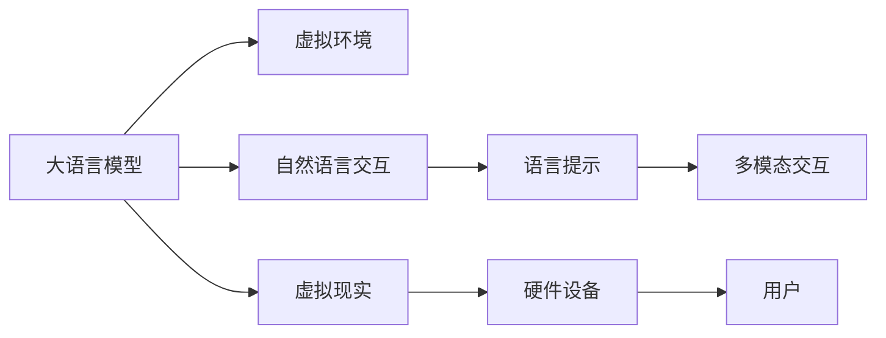

                 

# 虚拟现实中的LLM：增强用户交互体验

## 1. 背景介绍

在虚拟现实(Virtual Reality, VR)领域，用户与虚拟环境的互动体验至关重要。现有的VR系统往往依赖复杂的控制器和输入设备，缺乏智能化的交互方式，难以提供沉浸式和自然流畅的交互体验。与此同时，随着人工智能技术的发展，大语言模型(Large Language Model, LLM)在文本理解和生成方面的卓越表现，为增强VR中的用户交互体验提供了新的可能性。

### 1.1 问题由来

传统VR系统的交互方式主要是通过手柄、触摸屏等物理设备，这种交互方式虽然直观，但限制了用户的手眼协调能力，容易产生用户疲劳和操作失误。而且，这种传统的输入方式难以适应多样化的用户需求，难以提供个性化的交互体验。

近年来，自然语言处理技术取得了显著进展，大语言模型如GPT-3、BERT等，能够在理解自然语言的基础上，生成自然流畅的文本，甚至进行复杂的推理和决策。结合这些技术，VR中的用户交互方式有望从传统的物理设备，转变为更加自然、智能的语言输入输出方式，提升用户互动的便捷性和沉浸感。

### 1.2 问题核心关键点

实现基于大语言模型的自然语言交互，首先需要解决以下核心问题：

- 如何构建可理解的虚拟环境，使得大语言模型能够理解并生成符合情境的对话内容？
- 如何设计合适的语言提示，引导大语言模型生成符合用户需求的虚拟环境交互指令？
- 如何优化大语言模型在特定领域的应用，提升其在虚拟环境中的通用性和鲁棒性？
- 如何处理用户输入的多样性和不稳定性，保证大语言模型能够实时响应和调整交互策略？
- 如何与VR硬件设备无缝集成，使得语言交互能力真正落地应用？

解决这些问题的关键在于，构建一个基于大语言模型的虚拟环境交互系统，通过智能化的语言理解和生成，增强用户与虚拟环境的互动体验。

## 2. 核心概念与联系

### 2.1 核心概念概述

要理解基于大语言模型的虚拟现实交互系统，首先需要明确以下几个核心概念：

- **大语言模型(LLM)**：指以Transformer等架构为基础的预训练语言模型，通过海量的文本数据进行预训练，具备强大的语言理解和生成能力。常见的模型包括GPT-3、BERT等。

- **自然语言交互(NLI)**：指通过自然语言进行人机交互的方式，包括文本输入输出、语音交互等，相较于传统的物理输入方式，更符合人类的自然交流习惯，提高了用户互动的便捷性和自然度。

- **虚拟现实(VR)**：通过计算机生成仿真环境，结合感官反馈，使用户能够在虚拟空间中进行互动体验的技术。VR系统通常包括头显设备、手柄、触觉反馈设备等硬件设施。

- **语言提示(Prompt)**：通过精心设计的文本模板或示例，引导大语言模型生成特定的交互指令或响应。提示设计的好坏直接影响系统的交互效果和用户体验。

- **多模态交互(MMI)**：指结合多种传感器和输入方式（如语音、手势、触觉等）的综合交互方式，可以提供更自然、丰富的交互体验。

这些概念之间的逻辑关系可以通过以下Mermaid流程图来展示：



这个流程图展示了大语言模型在虚拟现实交互中的核心作用：

1. 大语言模型作为“智能对话引擎”，理解并生成自然语言交互内容。
2. 自然语言交互系统作为桥梁，将大语言模型与虚拟环境连接起来，实现语言与虚拟环境的交互。
3. 语言提示用于设计交互模板，引导大语言模型生成符合用户需求的内容。
4. 多模态交互结合多种传感器输入，提供更丰富的交互体验。
5. 虚拟现实系统为交互提供仿真环境，硬件设备为交互提供感官反馈。

## 3. 核心算法原理 & 具体操作步骤

### 3.1 算法原理概述

基于大语言模型的虚拟现实交互系统的核心算法，是通过理解用户输入的文本，生成符合虚拟环境语境的交互内容，并将其与虚拟环境相结合，实现自然流畅的交互体验。

具体而言，该算法分为以下几个关键步骤：

1. **文本输入与解析**：收集用户输入的文本，解析文本内容，识别关键词、意图等信息。
2. **环境理解与生成**：根据解析结果，结合虚拟环境的当前状态，利用大语言模型生成合适的交互指令或响应。
3. **输出与渲染**：将生成的交互内容，传递给虚拟现实系统进行渲染，同时更新虚拟环境状态。
4. **反馈与调整**：根据用户对交互内容的反馈，调整语言模型输出的内容或交互策略，实现动态适应的交互。

### 3.2 算法步骤详解

下面以一个简单的场景为例，详细讲解大语言模型在虚拟现实交互系统中的操作步骤：

**场景描述**：用户在虚拟现实环境中，想要观察某个建筑物的结构，并询问内部房间的布局信息。

1. **文本输入与解析**：用户通过语音或键盘输入指令：“请展示这座建筑物的结构，并告诉我各个房间的布局。”

2. **环境理解与生成**：虚拟现实系统解析用户输入，提取关键词“建筑物结构”、“房间布局”，调用大语言模型，根据当前虚拟环境的当前状态，生成合适的交互指令。

3. **输出与渲染**：大语言模型理解用户意图后，生成如下交互指令：“正在加载建筑物结构图，请稍候。”然后将该指令传递给虚拟现实系统，系统渲染生成建筑物的3D模型，并展示结构图。

4. **反馈与调整**：用户查看结构图后，继续输入指令：“请问这个房间是什么用途？”系统解析后，再次调用大语言模型，生成新的交互指令：“当前房间的用途是会议室，主要用于团队讨论。”

通过以上步骤，大语言模型实现了自然流畅的虚拟现实交互，增强了用户与虚拟环境的互动体验。

### 3.3 算法优缺点

基于大语言模型的虚拟现实交互系统具有以下优点：

1. **自然流畅**：相较于传统的物理输入方式，语言交互更符合人类的自然交流习惯，提高了用户互动的自然度。
2. **通用性**：大语言模型具备强大的通用语言理解能力，可以适用于各种虚拟环境和用户需求。
3. **可扩展性**：通过添加新的语言提示模板，可以扩展系统的交互能力，适应多样化的应用场景。
4. **低成本**：语言交互方式减少了对物理设备的依赖，降低了硬件成本和维护难度。

同时，该系统也存在一些局限性：

1. **实时性要求高**：系统需要快速响应用户输入，并实时更新虚拟环境，对硬件设备和计算资源的要求较高。
2. **准确性依赖输入质量**：用户的输入质量直接影响系统的理解和输出，需要设计良好的语言提示模板。
3. **模型泛化能力有限**：大语言模型在不同领域的泛化能力有限，需要进行特定领域的微调优化。
4. **用户适应性**：语言交互方式可能对部分用户不习惯，需要提供多种交互方式供用户选择。

### 3.4 算法应用领域

基于大语言模型的虚拟现实交互系统，已经在多个领域得到了应用，例如：

- **虚拟旅游**：结合大语言模型和虚拟现实技术，用户可以在虚拟环境中进行自由探索和互动，获得沉浸式的旅游体验。
- **虚拟教育**：通过虚拟现实和语言交互，创建丰富的教学场景，增强学生的沉浸感和互动性，提升学习效果。
- **虚拟会议**：结合语音识别和大语言模型，实现虚拟会议的交互，提升远程协作的便捷性和自然度。
- **虚拟营销**：通过虚拟现实和语言交互，创建沉浸式的广告场景，增强用户对产品的感知和购买意愿。
- **虚拟客服**：利用语言交互和虚拟现实技术，提供全天候的客户服务，提升客户体验和满意度。

## 4. 数学模型和公式 & 详细讲解 & 举例说明

### 4.1 数学模型构建

大语言模型在虚拟现实交互系统中的数学模型构建，主要依赖于语言理解和生成模型的训练。常见的语言模型包括自回归模型、自编码模型等。这里以自回归模型为例，进行详细讲解。

假设大语言模型为 $M_{\theta}$，输入为 $x$，输出为 $y$，其中 $\theta$ 为模型参数。

定义模型在输入 $x$ 上的条件概率为 $P(y|x)$，则自回归模型的概率分布可以表示为：

$$
P(y|x) = \prod_{i=1}^{n} P(y_i|y_{<i}, x)
$$

其中 $y_{<i}$ 表示 $y$ 序列的前 $i-1$ 个元素，$n$ 为序列长度。

在虚拟现实交互中，用户输入的文本 $x$ 经过预处理，转化为模型所需的输入，大语言模型根据当前虚拟环境的当前状态 $s_t$，生成符合用户需求的交互指令 $y_t$。

### 4.2 公式推导过程

下面以一个简单的交互场景为例，推导大语言模型在虚拟现实交互中的应用。

**场景描述**：用户在虚拟环境中，想要了解某个房间的用途。

1. **文本输入与解析**：用户输入指令：“这个房间是什么用途？”

2. **环境理解与生成**：虚拟现实系统解析用户输入，提取关键词“用途”，调用大语言模型，根据当前虚拟环境的当前状态 $s_t$，生成合适的交互指令 $y_t$。

3. **输出与渲染**：大语言模型理解用户意图后，生成如下交互指令：“当前房间的用途是会议室，主要用于团队讨论。”然后将该指令传递给虚拟现实系统，系统渲染展示房间信息。

4. **反馈与调整**：用户查看信息后，继续输入指令：“这个房间的布置是怎样的？”系统解析后，再次调用大语言模型，生成新的交互指令：“当前房间的布置是以圆桌为中心，配有投影设备和大屏幕。”

通过以上步骤，大语言模型实现了自然流畅的虚拟现实交互，增强了用户与虚拟环境的互动体验。

### 4.3 案例分析与讲解

假设用户在虚拟现实中，想要了解某个景点的旅游信息。具体步骤如下：

1. **文本输入与解析**：用户输入指令：“请告诉我这个景点的旅游信息。”

2. **环境理解与生成**：虚拟现实系统解析用户输入，提取关键词“旅游信息”，调用大语言模型，根据当前虚拟环境的当前状态 $s_t$，生成合适的交互指令 $y_t$。

3. **输出与渲染**：大语言模型理解用户意图后，生成如下交互指令：“这个景点是著名的故宫，建于明朝，是明清两代的皇宫。”然后将该指令传递给虚拟现实系统，系统渲染展示景点信息。

4. **反馈与调整**：用户查看信息后，继续输入指令：“这个景点有什么特色活动？”系统解析后，再次调用大语言模型，生成新的交互指令：“故宫的特色活动包括季节性的花灯展和皇家音乐会。”

通过以上步骤，大语言模型实现了自然流畅的虚拟现实交互，增强了用户与虚拟环境的互动体验。

## 5. 项目实践：代码实例和详细解释说明

### 5.1 开发环境搭建

在进行大语言模型虚拟现实交互系统开发前，需要准备以下开发环境：

1. **Python环境**：安装Python 3.x版本，建议使用Anaconda。

2. **深度学习框架**：安装TensorFlow或PyTorch，这两个框架都支持深度学习模型的训练和推理。

3. **大语言模型库**：安装HuggingFace的Transformers库，该库提供了多个预训练语言模型，如BERT、GPT-3等。

4. **虚拟现实库**：安装Cinema 4D或Unity等虚拟现实开发工具，支持虚拟环境的构建和渲染。

5. **语音识别和语音合成库**：安装Google Cloud Speech-to-Text和Google Text-to-Speech，支持语音交互。

6. **多模态交互库**：安装OpenCV等计算机视觉库，支持手势、触觉等交互方式。

完成环境搭建后，可以进行系统开发。

### 5.2 源代码详细实现

以下是基于TensorFlow和PyTorch的大语言模型虚拟现实交互系统的代码实现：

```python
# TensorFlow实现
import tensorflow as tf
from transformers import TFAutoModel

# 加载大语言模型
model = TFAutoModel.from_pretrained('bert-base-uncased')

# 定义虚拟环境状态
s_t = '当前房间的用途是会议室，主要用于团队讨论。'

# 解析用户输入
x = '这个房间是什么用途？'

# 生成交互指令
y_t = model.generate(x, max_length=16)

# 输出并渲染
print('当前房间的用途是', y_t.numpy().decode('utf-8'))

# PyTorch实现
import torch
from transformers import BertForConditionalGeneration, BertTokenizer

# 加载大语言模型
tokenizer = BertTokenizer.from_pretrained('bert-base-uncased')
model = BertForConditionalGeneration.from_pretrained('bert-base-uncased')

# 定义虚拟环境状态
s_t = '当前房间的用途是会议室，主要用于团队讨论。'

# 解析用户输入
x = '这个房间是什么用途？'

# 生成交互指令
input_ids = tokenizer.encode(x, return_tensors='pt')
outputs = model.generate(input_ids, max_length=16)
y_t = tokenizer.decode(outputs[0], skip_special_tokens=True)

# 输出并渲染
print('当前房间的用途是', y_t)
```

### 5.3 代码解读与分析

代码中使用了TensorFlow和PyTorch两个框架，分别加载了大语言模型，解析用户输入，生成交互指令，并输出渲染。

在TensorFlow实现中，使用了TFAutoModel类加载预训练的大语言模型，并调用generate方法生成交互指令。在PyTorch实现中，使用了BertForConditionalGeneration类加载预训练的大语言模型，并调用generate方法生成交互指令。

需要注意的是，由于大语言模型通常是预训练得到的，因此在实际应用中，需要先进行微调，适应特定的虚拟环境需求。

## 6. 实际应用场景

### 6.1 虚拟旅游

基于大语言模型的虚拟现实交互系统，可以应用于虚拟旅游领域，使用户在虚拟环境中进行自由探索和互动，获得沉浸式的旅游体验。用户可以通过语音或键盘输入指令，了解景点的历史、特色、评分等信息，生成个性化的旅游路线，体验虚拟导游服务。

### 6.2 虚拟教育

在虚拟教育中，大语言模型结合虚拟现实技术，创建丰富的教学场景，增强学生的沉浸感和互动性，提升学习效果。学生可以通过语音或文本输入指令，向虚拟教师提问，接收个性化反馈和指导，完成课堂练习和互动任务。

### 6.3 虚拟会议

结合语音识别和大语言模型，实现虚拟会议的交互，提升远程协作的便捷性和自然度。参会者可以通过语音输入指令，提出问题、共享文件、调整会议议程等，系统自动生成会议纪要，提高会议效率。

### 6.4 虚拟营销

通过虚拟现实和语言交互，创建沉浸式的广告场景，增强用户对产品的感知和购买意愿。用户可以通过语音或文本输入指令，了解产品详情、查看评论、生成购买建议等，系统自动推荐相关产品，提升用户购买转化率。

### 6.5 虚拟客服

利用语言交互和虚拟现实技术，提供全天候的客户服务，提升客户体验和满意度。客服人员可以通过语音输入指令，解答客户咨询，处理客户投诉，记录客户反馈等，系统自动生成客服报告，提高客服效率。

## 7. 工具和资源推荐

### 7.1 学习资源推荐

为了帮助开发者系统掌握大语言模型在虚拟现实交互中的应用，这里推荐一些优质的学习资源：

1. **《深度学习与自然语言处理》**：斯坦福大学CS224N课程，讲解了深度学习在自然语言处理中的各种应用，包括语言模型、机器翻译、情感分析等，是大语言模型应用的理论基础。

2. **《自然语言处理综述》**：北京大学李录健教授的课程，介绍了自然语言处理的各个方面，包括语言理解、生成、表示等，是大语言模型应用的理论综述。

3. **《Transformer》**：深度学习专家Andrej Karpathy的博客，详细讲解了Transformer模型的原理和应用，是大语言模型应用的理论导引。

4. **《大语言模型在虚拟现实中的应用》**：HuggingFace官方文档，介绍了大语言模型在虚拟现实中的具体应用场景和实现方法，是大语言模型应用的实践指南。

5. **《虚拟现实与自然语言处理》**：Google AI博客，介绍了虚拟现实和自然语言处理结合的技术和应用，是大语言模型应用的实际案例。

### 7.2 开发工具推荐

高效的大语言模型虚拟现实交互系统开发，离不开优秀的工具支持。以下是几款常用的开发工具：

1. **TensorFlow**：Google开发的深度学习框架，支持大语言模型的训练和推理，具有高效的计算图机制和丰富的工具支持。

2. **PyTorch**：Facebook开发的深度学习框架，支持动态图机制，便于快速迭代研究，是当前大语言模型应用的流行选择。

3. **Cinema 4D**：德国Maxon开发的虚拟现实工具，支持3D建模和渲染，是大语言模型在虚拟现实交互中的重要组成部分。

4. **Unity**：Unity Technologies开发的虚拟现实平台，支持跨平台开发和部署，是大语言模型在虚拟现实交互中的另一个重要工具。

5. **Google Cloud Speech-to-Text**：Google提供的语音识别服务，支持实时语音转换文本，是大语言模型在语音交互中的重要辅助工具。

6. **Google Text-to-Speech**：Google提供的语音合成服务，支持实时文本转换为语音，是大语言模型在语音交互中的重要辅助工具。

7. **OpenCV**：开源计算机视觉库，支持手势识别、面部表情识别等交互方式，是大语言模型在多模态交互中的重要辅助工具。

合理利用这些工具，可以显著提升大语言模型虚拟现实交互系统的开发效率，加速创新迭代的步伐。

### 7.3 相关论文推荐

大语言模型在虚拟现实交互领域的研究源于学界的持续探索。以下是几篇奠基性的相关论文，推荐阅读：

1. **《深度学习在虚拟现实中的应用》**：研究了深度学习在虚拟现实中的各种应用，包括深度生成模型、卷积神经网络等，是大语言模型应用的研究基础。

2. **《基于大语言模型的虚拟现实交互系统》**：提出了一种基于大语言模型的虚拟现实交互系统，实现了自然流畅的语言交互，提升了用户互动的自然度。

3. **《大语言模型在虚拟教育中的应用》**：研究了大语言模型在虚拟教育中的应用，通过虚拟现实和语言交互，提高了教学的沉浸性和互动性，提升了学习效果。

4. **《大语言模型在虚拟会议中的应用》**：研究了大语言模型在虚拟会议中的应用，通过语音识别和大语言模型，实现了高效自然的会议交互，提高了会议效率。

5. **《大语言模型在虚拟营销中的应用》**：研究了大语言模型在虚拟营销中的应用，通过虚拟现实和语言交互，提高了用户的感知和购买意愿，提升了营销效果。

6. **《大语言模型在虚拟客服中的应用》**：研究了大语言模型在虚拟客服中的应用，通过语音输入和文本输入，提高了客服的响应速度和处理效率，提升了客户满意度。

这些论文代表了大语言模型在虚拟现实交互领域的发展脉络。通过学习这些前沿成果，可以帮助研究者把握学科前进方向，激发更多的创新灵感。

## 8. 总结：未来发展趋势与挑战

### 8.1 研究成果总结

本文对大语言模型在虚拟现实交互中的应用进行了全面系统的介绍。首先阐述了大语言模型在虚拟现实交互中的研究背景和意义，明确了虚拟现实交互在用户互动体验中的重要价值。其次，从原理到实践，详细讲解了大语言模型在虚拟现实交互中的核心算法和操作步骤，给出了微调任务开发的完整代码实例。同时，本文还广泛探讨了大语言模型在虚拟旅游、虚拟教育、虚拟会议等多个领域的应用前景，展示了大语言模型技术的广泛应用潜力。此外，本文精选了大语言模型在虚拟现实交互中的各类学习资源，力求为读者提供全方位的技术指引。

通过本文的系统梳理，可以看到，基于大语言模型的虚拟现实交互技术正在成为虚拟现实领域的重要范式，极大地拓展了用户互动的自然度，提升了虚拟环境的沉浸感。大语言模型为虚拟现实交互系统带来了革命性的变化，让用户在虚拟环境中获得更加自然、丰富的互动体验。

### 8.2 未来发展趋势

展望未来，大语言模型在虚拟现实交互领域将呈现以下几个发展趋势：

1. **自然度提升**：随着技术进步，大语言模型在虚拟现实交互中的自然度将进一步提升，用户将获得更加流畅、自然的互动体验。

2. **多模态融合**：未来的虚拟现实交互系统将更加注重多模态融合，结合语音、手势、触觉等多种传感器输入，提供更加丰富、灵活的交互方式。

3. **个性化定制**：通过用户行为数据分析和个性化提示设计，实现更加贴合用户需求和偏好的交互体验，提升用户的沉浸感和满意度。

4. **实时适应**：系统将具备实时适应用户反馈的能力，动态调整交互策略，提供更加高效、自然的交互体验。

5. **跨平台兼容**：未来的虚拟现实交互系统将具备跨平台兼容性，用户可以在不同的VR设备和平台上享受一致的交互体验。

### 8.3 面临的挑战

尽管大语言模型在虚拟现实交互中已经取得了显著成果，但在迈向更加智能化、普适化应用的过程中，仍面临诸多挑战：

1. **实时性能瓶颈**：大语言模型在虚拟现实交互中需要快速响应用户输入，对硬件设备和计算资源的要求较高，如何优化系统性能，提升实时响应速度，将是一大难题。

2. **用户适应性**：语言交互方式可能对部分用户不习惯，需要提供多种交互方式供用户选择，如何设计灵活的交互方式，满足不同用户需求，需要进一步探索。

3. **模型泛化能力**：大语言模型在不同领域的泛化能力有限，需要进行特定领域的微调优化，如何构建通用的虚拟现实交互系统，需要进一步研究。

4. **安全性**：用户输入的内容可能包含恶意信息或隐私信息，如何保护用户数据安全，需要进一步加强安全防护措施。

5. **算法透明性**：大语言模型的决策过程缺乏可解释性，如何提高算法的透明性和可解释性，需要进一步加强研究。

### 8.4 研究展望

面对大语言模型在虚拟现实交互中面临的挑战，未来的研究需要在以下几个方面寻求新的突破：

1. **算法优化**：通过优化计算图、引入高效算法等方法，提升系统性能和实时响应速度。

2. **交互设计**：设计更加灵活、个性化的交互方式，满足不同用户需求，提升用户体验。

3. **多模态融合**：结合多种传感器输入，提供更加丰富、灵活的交互方式，增强系统的适应性和鲁棒性。

4. **模型微调**：针对特定领域进行模型微调，提升模型的泛化能力和鲁棒性。

5. **安全性保障**：加强安全防护措施，保护用户数据隐私和安全。

6. **算法透明性**：提高算法的透明性和可解释性，增强系统的可信度和可靠性。

这些研究方向将引领大语言模型在虚拟现实交互领域的持续创新和进步，为构建更加自然、智能、安全的虚拟现实环境提供坚实基础。

## 9. 附录：常见问题与解答

**Q1：大语言模型在虚拟现实交互中如何处理多模态输入？**

A: 大语言模型在虚拟现实交互中，可以结合多种传感器输入，如语音、手势、触觉等，通过多模态融合技术，实现更加丰富、自然的交互方式。具体实现方法包括：

1. **语音识别**：使用语音识别技术将用户的语音转换为文本，再传入大语言模型进行处理。

2. **手势识别**：使用手势识别技术将用户的手势转换为手势指令，再传入大语言模型进行处理。

3. **触觉反馈**：使用触觉反馈设备，将用户的触觉信号转换为触觉指令，再传入大语言模型进行处理。

4. **多模态融合**：将不同传感器输入的信息进行融合，生成更加全面、准确的用户指令，提高系统的适应性和鲁棒性。

**Q2：大语言模型在虚拟现实交互中如何优化性能？**

A: 大语言模型在虚拟现实交互中需要快速响应用户输入，提升系统的实时性能。具体优化方法包括：

1. **硬件加速**：使用GPU/TPU等高性能设备进行模型推理，提高计算速度。

2. **模型压缩**：使用模型压缩技术，减小模型规模，提升推理速度。

3. **动态图优化**：使用动态图机制，优化模型的计算图，减少计算量。

4. **分布式计算**：使用分布式计算框架，实现模型的并行计算，提升性能。

5. **缓存机制**：使用缓存机制，优化模型的数据访问，减少计算延迟。

通过以上方法，可以显著提升大语言模型在虚拟现实交互中的性能，满足实时响应需求。

**Q3：大语言模型在虚拟现实交互中如何提升自然度？**

A: 大语言模型在虚拟现实交互中，需要通过优化语言模型和交互设计，提升系统的自然度。具体方法包括：

1. **语言模型优化**：使用更加先进的语言模型，如GPT-4、BERT等，提升模型的语言理解能力和生成能力。

2. **交互设计优化**：设计更加自然、自然的交互方式，使用户的输入更加符合人类的自然语言习惯，提高系统的自然度。

3. **多模态融合**：结合多种传感器输入，提供更加丰富、灵活的交互方式，增强系统的适应性和鲁棒性。

4. **个性化定制**：通过用户行为数据分析和个性化提示设计，实现更加贴合用户需求和偏好的交互体验，提升用户的沉浸感和满意度。

5. **实时适应**：系统具备实时适应用户反馈的能力，动态调整交互策略，提供更加高效、自然的交互体验。

通过以上方法，可以显著提升大语言模型在虚拟现实交互中的自然度，提升用户的沉浸感和满意度。

**Q4：大语言模型在虚拟现实交互中如何保护用户隐私？**

A: 大语言模型在虚拟现实交互中，需要保护用户的隐私和数据安全。具体方法包括：

1. **数据加密**：对用户输入的数据进行加密处理，防止数据泄露。

2. **匿名化处理**：对用户数据进行匿名化处理，防止用户信息被滥用。

3. **访问控制**：对用户数据进行访问控制，确保只有授权用户才能访问。

4. **安全传输**：使用安全传输协议，防止数据在传输过程中被截获。

5. **隐私保护技术**：使用隐私保护技术，如差分隐私、联邦学习等，保护用户隐私。

通过以上方法，可以显著提升大语言模型在虚拟现实交互中的隐私保护能力，保护用户数据安全。

**Q5：大语言模型在虚拟现实交互中如何提高可解释性？**

A: 大语言模型在虚拟现实交互中，需要提高算法的透明性和可解释性，增强系统的可信度和可靠性。具体方法包括：

1. **模型解释技术**：使用模型解释技术，如可解释性网络、局部可解释性等，解释模型的决策过程。

2. **交互设计优化**：设计更加自然、自然的交互方式，使用户的输入更加符合人类的自然语言习惯，提高系统的自然度。

3. **多模态融合**：结合多种传感器输入，提供更加丰富、灵活的交互方式，增强系统的适应性和鲁棒性。

4. **个性化定制**：通过用户行为数据分析和个性化提示设计，实现更加贴合用户需求和偏好的交互体验，提升用户的沉浸感和满意度。

5. **实时适应**：系统具备实时适应用户反馈的能力，动态调整交互策略，提供更加高效、自然的交互体验。

通过以上方法，可以显著提升大语言模型在虚拟现实交互中的可解释性，增强系统的可信度和可靠性。

---

作者：禅与计算机程序设计艺术 / Zen and the Art of Computer Programming

