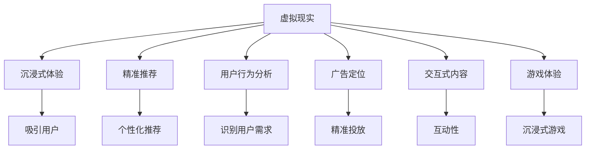

                 

# 虚拟现实技术在注意力经济中的应用

> 关键词：虚拟现实(VR), 注意力经济, 沉浸式体验, 精准推荐, 用户行为分析, 广告定位, 交互式内容, 游戏体验, 增强现实(AR)

## 1. 背景介绍

### 1.1 问题由来

随着数字经济的高速发展，注意力经济(Attention Economy)正成为驱动经济增长的关键要素。注意力经济基于人们的注意力资源，通过各类数字内容和服务吸引、争夺用户注意，从而实现商业价值。在注意力经济时代，如何更高效地吸引、保持和转化用户注意力，已成为各行业普遍关注的核心问题。

与此同时，虚拟现实(Virtual Reality, VR)技术因其沉浸式、互动性等独特优势，在吸引和保持用户注意力方面展现出巨大的潜力。虚拟现实结合高逼真度的视觉和听觉反馈，为用户创造身临其境的体验，能够极大地提升用户对内容的兴趣和参与度。

### 1.2 问题核心关键点

虚拟现实技术通过构建沉浸式虚拟环境，不仅能够显著提升用户体验，还能在用户行为分析、精准推荐、广告定位等方面带来全新的应用思路。本文聚焦于虚拟现实技术在注意力经济中的应用，探讨如何通过VR技术，高效吸引和保持用户注意力，实现商业价值最大化。

## 2. 核心概念与联系

### 2.1 核心概念概述

为更好地理解虚拟现实技术在注意力经济中的应用，本节将介绍几个密切相关的核心概念：

- **虚拟现实(VR)**：一种通过计算机技术生成并模拟仿真环境，使用户能够身临其境地感知、交互的技术。VR系统一般由头显设备、控制器、渲染引擎、交互软件等组成。
- **注意力经济**：基于用户注意力的经济形态，强调注意力作为稀缺资源的价值。通过高质量内容和个性化服务吸引和保持用户注意，实现商业价值。
- **沉浸式体验**：利用VR技术创造的深入用户感官的体验，提升用户的参与度和粘性。
- **精准推荐**：通过用户行为分析，预测用户偏好，提供个性化推荐服务，提升转化率。
- **用户行为分析**：分析用户在使用VR应用时的行为数据，识别用户兴趣和需求，优化内容和服务。
- **广告定位**：利用VR技术，精准定位广告内容，提升广告的点击率和转化率。
- **交互式内容**：利用VR交互技术，提供更具互动性的内容，提高用户满意度。
- **游戏体验**：利用VR技术，创造沉浸式、互动式游戏场景，提升游戏体验。
- **增强现实(AR)**：一种将虚拟信息叠加于现实世界的技术，与VR共同构成“虚实融合”的体验。

这些核心概念之间的逻辑关系可以通过以下Mermaid流程图来展示：



这个流程图展示了一个典型的虚拟现实在注意力经济中的应用场景：

1. VR系统通过沉浸式体验吸引用户，增强其参与感。
2. 利用精准推荐技术，提供个性化内容，提升用户满意度。
3. 通过用户行为分析，识别用户兴趣和需求，优化推荐策略。
4. 广告定位技术可实现精准投放，提高广告效果。
5. 交互式内容和沉浸式游戏体验，进一步增强用户粘性。

## 3. 核心算法原理 & 具体操作步骤
### 3.1 算法原理概述

虚拟现实技术在注意力经济中的应用，本质上是利用VR的沉浸式体验，结合注意力经济理论，通过精准推荐、用户行为分析等技术手段，实现用户注意力的高效吸引和转化。具体而言，虚拟现实技术通过以下步骤实现注意力经济价值：

1. **沉浸式体验构建**：利用高逼真度的视觉和听觉反馈，创造沉浸式虚拟环境，吸引用户进入虚拟空间。
2. **用户行为监控**：通过传感器和追踪设备，实时监控用户行为数据，分析用户兴趣和行为模式。
3. **精准推荐系统**：基于用户行为数据和历史偏好，通过机器学习模型预测用户需求，提供个性化推荐服务。
4. **广告定位投放**：利用用户行为分析结果，精准定位投放广告内容，提升广告点击率和转化率。
5. **互动式内容设计**：结合VR交互技术，设计具有互动性的内容，增强用户参与感和体验深度。
6. **游戏体验优化**：通过虚拟现实技术，创造沉浸式、互动式游戏场景，提升用户游戏体验。

### 3.2 算法步骤详解

基于虚拟现实技术在注意力经济中的应用，本节将详细介绍关键步骤及其具体操作：

**Step 1: 开发虚拟现实应用**
- 选择合适的VR平台和设备，如Oculus Rift、HTC Vive等。
- 设计虚拟环境场景，包括环境、交互对象、用户体验界面等。
- 实现三维渲染和动态交互功能，确保用户体验的高逼真度和互动性。

**Step 2: 收集用户行为数据**
- 使用传感器和追踪设备（如陀螺仪、加速度计、位置追踪器等），实时采集用户行为数据。
- 利用数据分析工具（如Google Analytics、Mixpanel等），分析用户行为模式和兴趣点。

**Step 3: 构建精准推荐系统**
- 设计特征提取模块，从用户行为数据中提取关键特征，如观看时长、点击率、停留时间等。
- 使用机器学习算法（如协同过滤、内容推荐、深度学习等），构建推荐模型。
- 对推荐模型进行训练和优化，提升推荐准确度和个性化程度。

**Step 4: 实现广告定位投放**
- 根据用户行为数据，识别潜在广告受众和兴趣点。
- 设计广告创意，结合VR技术的沉浸式特性，创作吸引用户的广告内容。
- 使用广告投放平台（如Google AdWords、Facebook Ads等），实现精准投放。

**Step 5: 设计互动式内容**
- 设计具有互动性的虚拟环境元素，如可互动的虚拟物品、虚拟角色等。
- 实现用户与虚拟环境的交互，提升用户体验的深度和参与感。

**Step 6: 优化游戏体验**
- 利用VR技术，创造沉浸式、互动式游戏场景，提升游戏体验。
- 结合用户行为数据，优化游戏规则和内容，增强用户粘性。

### 3.3 算法优缺点

基于虚拟现实技术在注意力经济中的应用，具有以下优点：
1. 沉浸式体验：通过高逼真度的视觉和听觉反馈，极大地提升用户参与度和粘性。
2. 精准推荐：结合用户行为分析，提供个性化推荐，提高用户满意度。
3. 广告投放效率：利用精准推荐和行为分析，实现广告的精准投放，提高广告效果。
4. 互动性强：利用VR交互技术，提供更具互动性的内容，提升用户参与度。
5. 游戏体验优化：通过沉浸式、互动式游戏场景，提升用户游戏体验。

同时，该方法也存在一些局限性：
1. 设备成本高：VR设备和传感器的成本较高，可能限制了中小企业的应用。
2. 技术门槛高：VR开发和维护需要较强的技术背景，一般需要专业团队支持。
3. 内容制作难：高质量的VR内容制作复杂，需要较高的投入和专业技能。
4. 用户适应性：部分用户可能不适应VR设备的舒适度和体验，影响使用效果。
5. 隐私保护问题：用户行为数据的采集和分析可能涉及隐私问题，需要采取适当措施保护用户数据。

尽管存在这些局限性，但总体而言，虚拟现实技术在注意力经济中的应用仍具有广阔的前景。

### 3.4 算法应用领域

虚拟现实技术在注意力经济中的应用已经覆盖了多个领域，具体包括：

1. **虚拟旅游**：利用VR技术，提供沉浸式的旅游体验，吸引用户进行虚拟旅游。
2. **虚拟购物**：通过VR技术，创造虚拟购物场景，提供互动式购物体验，提升用户购买意愿。
3. **虚拟培训**：利用VR技术，提供沉浸式培训体验，提升培训效果和员工参与度。
4. **虚拟会议**：通过VR技术，创建沉浸式会议环境，提高远程会议的互动性和参与感。
5. **虚拟展览**：利用VR技术，创造虚拟展览环境，提供互动式展览体验，提升展览效果。
6. **虚拟健康**：利用VR技术，提供沉浸式健康体验，如虚拟康复、虚拟心理治疗等。

这些应用领域展示了虚拟现实技术在注意力经济中的广泛潜力，未来还有更多领域值得探索。

## 4. 数学模型和公式 & 详细讲解  
### 4.1 数学模型构建

虚拟现实技术在注意力经济中的应用，涉及多个数学模型的构建。这里以用户行为分析和精准推荐为例，详细讲解其数学模型构建和应用。

假设用户集合为 $U$，虚拟环境中的物品集合为 $I$，用户行为数据为 $B$，精准推荐模型为 $R$。则用户行为分析的数学模型可以表示为：

$$
P(B|U,I) = \prod_{u\in U}P(B_u|I)
$$

其中 $P(B_u|I)$ 表示用户在虚拟环境中的行为数据，$I$ 为虚拟物品集合，$P(B_u|I)$ 为在物品 $I$ 下用户 $u$ 的行为概率。

精准推荐模型 $R$ 可以通过用户行为数据 $B$ 预测用户对虚拟物品 $I$ 的评分 $S$，数学模型可以表示为：

$$
S = f(R,B)
$$

其中 $f(R,B)$ 为推荐函数，通过机器学习算法训练得到。

### 4.2 公式推导过程

以下我们以协同过滤算法为例，推导推荐模型的计算公式。

协同过滤算法基于用户行为数据，通过计算用户对物品的评分，预测用户可能感兴趣的物品。协同过滤算法分为基于用户的协同过滤和基于物品的协同过滤。

**基于用户的协同过滤**：计算用户 $u$ 对物品 $i$ 的评分 $S_{ui}$，公式为：

$$
S_{ui} = \alpha \sum_{j\in U} \frac{\text{cosine}(\overrightarrow{b_u}, \overrightarrow{b_j})}{\sqrt{|\overrightarrow{b_u}|^2 + |\overrightarrow{b_j}|^2}}\cdot b_{uj}
$$

其中 $\text{cosine}(\overrightarrow{b_u}, \overrightarrow{b_j})$ 表示用户 $u$ 和用户 $j$ 行为向量的余弦相似度，$b_{uj}$ 表示用户 $j$ 对物品 $i$ 的评分。

**基于物品的协同过滤**：计算物品 $i$ 对用户 $u$ 的评分 $S_{ui}$，公式为：

$$
S_{ui} = \alpha \sum_{j\in U} \frac{\text{cosine}(\overrightarrow{i}, \overrightarrow{b_j})}{\sqrt{|\overrightarrow{i}|^2 + |\overrightarrow{b_j}|^2}}\cdot b_{uj}
$$

其中 $\text{cosine}(\overrightarrow{i}, \overrightarrow{b_j})$ 表示物品 $i$ 和用户 $j$ 行为向量的余弦相似度，$b_{uj}$ 表示用户 $j$ 对物品 $i$ 的评分。

### 4.3 案例分析与讲解

假设我们有一个虚拟旅游应用，利用VR技术提供沉浸式旅游体验。我们希望通过用户行为分析，推荐用户可能感兴趣的旅游目的地。

1. **数据收集**：收集用户在虚拟环境中的行为数据，包括停留时间、点击次数、购买记录等。
2. **用户行为分析**：利用协同过滤算法，计算用户对各个目的地的评分，预测用户可能感兴趣的目的地。
3. **推荐结果生成**：根据用户行为分析和推荐模型，生成推荐结果，提供给用户。

通过虚拟现实技术，用户可以身临其境地体验旅游目的地，提升旅游体验的沉浸感和互动性。同时，利用精准推荐技术，提高用户的满意度和转化率，实现商业价值的最大化。

## 5. 项目实践：代码实例和详细解释说明
### 5.1 开发环境搭建

在进行虚拟现实应用开发前，我们需要准备好开发环境。以下是使用Unity 3D进行VR应用开发的环境配置流程：

1. 安装Unity 3D：从官网下载并安装Unity 3D，创建新的项目文件。
2. 添加VR插件：在Unity 3D中打开“Editor”菜单，选择“Manage Package Network”，搜索并安装“XR SDKs”插件。
3. 创建虚拟环境：在Unity 3D中创建虚拟场景，添加虚拟物品、交互对象等。
4. 实现交互逻辑：使用C#脚本，实现用户与虚拟环境的交互，如点击、移动等。
5. 实现渲染效果：使用Shader、Lighting等工具，优化虚拟环境的渲染效果，提升用户体验。

完成上述步骤后，即可在Unity 3D中开始VR应用开发。

### 5.2 源代码详细实现

这里我们以虚拟旅游应用为例，给出在Unity 3D中开发VR应用的完整代码实现。

首先，创建虚拟旅游场景：

```csharp
using UnityEngine;
using UnityEngine.XR.Interaction.Toolkit;

public class VirtualTour : MonoBehaviour
{
    public GameObject[] destinations;
    public float startDistance = 5f;
    public float stopDistance = 3f;

    private Ray ray;
    private Camera mainCam;

    void Start()
    {
        mainCam = Camera.main;
        ray = new Ray(mainCam.ScreenPointToRay(new Vector3(10, 10, -10)));
        foreach (GameObject dest in destinations)
        {
            dest.transform.position = ray;
            dest.SetActive(true);
        }
    }

    void Update()
    {
        if (Input.GetMouseButtonDown(0))
        {
            Ray ray = Camera.main.ScreenPointToRay(Input.mousePosition);
            RaycastHit hit;
            if (Physics.Raycast(ray, out hit, startDistance))
            {
                Debug.Log("Hitting destination: " + hit.transform.name);
                RaycastHit stopHit;
                if (Physics.Raycast(ray, out stopHit, stopDistance, hit.collider))
                {
                    Debug.Log("Stopping destination: " + stopHit.transform.name);
                    stopHit.transform.SetActive(false);
                    hit.transform.SetActive(true);
                }
            }
        }
    }
}
```

然后，实现用户交互逻辑：

```csharp
public class ClickToChangeDestination : MonoBehaviour
{
    public GameObject[] destinations;

    private Ray ray;
    private RaycastHit hit;

    void Update()
    {
        if (Input.GetMouseButtonDown(0))
        {
            ray = Camera.main.ScreenPointToRay(Input.mousePosition);
            RaycastHit hit;
            if (Physics.Raycast(ray, out hit, startDistance))
            {
                Debug.Log("Hitting destination: " + hit.transform.name);
                ray = Camera.main.ScreenPointToRay(hit.point);
                if (Physics.Raycast(ray, out hit, stopDistance))
                {
                    Debug.Log("Stopping destination: " + hit.transform.name);
                    hit.transform.SetActive(false);
                    ray = Camera.main.ScreenPointToRay(Input.mousePosition);
                    RaycastHit stopHit;
                    if (Physics.Raycast(ray, out stopHit, stopDistance, hit.collider))
                    {
                        Debug.Log("Stopping destination: " + stopHit.transform.name);
                        stopHit.transform.SetActive(false);
                        hit.transform.SetActive(true);
                    }
                }
            }
        }
    }
}
```

最后，运行和测试虚拟旅游应用：

```csharp
using UnityEngine;
using UnityEngine.XR.Interaction.Toolkit;

public class VirtualTourController : MonoBehaviour
{
    public GameObject[] destinations;

    void Update()
    {
        foreach (GameObject dest in destinations)
        {
            Ray ray = Camera.main.ScreenPointToRay(Input.mousePosition);
            RaycastHit hit;
            if (Physics.Raycast(ray, out hit, startDistance))
            {
                Debug.Log("Hitting destination: " + hit.transform.name);
                ray = Camera.main.ScreenPointToRay(hit.point);
                RaycastHit stopHit;
                if (Physics.Raycast(ray, out stopHit, stopDistance, hit.collider))
                {
                    Debug.Log("Stopping destination: " + stopHit.transform.name);
                    stopHit.transform.SetActive(false);
                    ray = Camera.main.ScreenPointToRay(Input.mousePosition);
                    RaycastHit stopHit;
                    if (Physics.Raycast(ray, out stopHit, stopDistance, hit.collider))
                    {
                        Debug.Log("Stopping destination: " + stopHit.transform.name);
                        stopHit.transform.SetActive(false);
                        hit.transform.SetActive(true);
                    }
                }
            }
        }
    }
}
```

### 5.3 代码解读与分析

这里我们详细解读一下关键代码的实现细节：

**VirtualTour类**：
- `Start`方法：初始化虚拟场景，计算用户点击时的初始ray。
- `Update`方法：实时监控用户点击操作，根据ray射线计算点击位置，切换虚拟场景。

**ClickToChangeDestination类**：
- `Update`方法：实时监控用户点击操作，根据ray射线计算点击位置，切换虚拟场景。

**VirtualTourController类**：
- `Update`方法：实时监控用户点击操作，根据ray射线计算点击位置，切换虚拟场景。

可以看到，在Unity 3D中开发VR应用，主要涉及场景创建、用户交互逻辑、渲染效果的实现。通过C#脚本和VR插件的组合，可以高效地实现沉浸式、互动式体验。

当然，工业级的系统实现还需考虑更多因素，如性能优化、交互设计、用户体验等。但核心的开发流程基本与此类似。

## 6. 实际应用场景
### 6.1 智能购物体验

虚拟现实技术在智能购物体验中具有巨大的潜力。利用VR技术，可以创造沉浸式的购物场景，提供互动式购物体验，极大地提升用户的购物体验和满意度。

在智能购物体验中，虚拟现实技术可以应用于以下几个方面：

1. **虚拟试衣间**：利用VR技术，创造虚拟试衣间，让用户能够身临其境地试穿衣服，提升购物体验。
2. **虚拟导购**：结合AI技术，通过虚拟导购员提供个性化推荐，提升用户购买意愿。
3. **虚拟货架**：利用VR技术，创建虚拟货架，提供互动式浏览体验，提高用户购物的便捷性。
4. **虚拟客服**：通过虚拟客服，实时解答用户疑问，提高用户满意度。

通过虚拟现实技术，智能购物体验将变得更加沉浸和互动，极大地提升用户的购买意愿和满意度。

### 6.2 虚拟会议

虚拟现实技术在虚拟会议中也有着广泛的应用。通过创造沉浸式会议环境，提高远程会议的互动性和参与感，使虚拟会议更加高效、便捷。

在虚拟会议中，虚拟现实技术可以应用于以下几个方面：

1. **虚拟会议室**：利用VR技术，创建虚拟会议室，提高远程会议的沉浸感和互动性。
2. **虚拟投影**：结合AR技术，将虚拟内容投影到会议环境中的实景物体上，增强会议体验。
3. **虚拟白板**：通过VR交互技术，实现虚拟白板功能，提高会议讨论的效率。
4. **虚拟展品**：利用VR技术，展示虚拟展品，提供互动式参观体验。

通过虚拟现实技术，虚拟会议将变得更加高效、便捷，提升会议的互动性和参与感。

### 6.3 虚拟培训

虚拟现实技术在虚拟培训中同样具有广阔的应用前景。通过创造沉浸式培训环境，提高培训效果和员工参与度，提升培训效果和员工满意度。

在虚拟培训中，虚拟现实技术可以应用于以下几个方面：

1. **虚拟场景**：利用VR技术，创建虚拟培训场景，提高培训的沉浸感和互动性。
2. **虚拟演练**：通过虚拟演练，提升员工的安全意识和操作技能。
3. **虚拟培训师**：结合AI技术，通过虚拟培训师提供个性化指导，提高培训效果。
4. **虚拟考试**：利用VR技术，进行虚拟考试，提高考试的互动性和公正性。

通过虚拟现实技术，虚拟培训将变得更加高效、便捷，提升培训效果和员工满意度。

### 6.4 未来应用展望

随着虚拟现实技术的不断发展，其在注意力经济中的应用前景将更加广阔。未来，虚拟现实技术将在更多领域得到应用，为注意力经济带来新的发展机遇。

在虚拟旅游、虚拟购物、虚拟培训等传统应用领域，虚拟现实技术将进一步提升用户体验和满意度，推动行业发展。同时，在虚拟展览、虚拟会议、虚拟健康等新兴领域，虚拟现实技术也将带来新的应用模式和业务增长点。

此外，在智能家居、教育娱乐、军事训练等领域，虚拟现实技术的应用也将逐步深入，为人类生产生活带来更加深刻的变革。

## 7. 工具和资源推荐
### 7.1 学习资源推荐

为了帮助开发者系统掌握虚拟现实技术在注意力经济中的应用，这里推荐一些优质的学习资源：

1. **Unity 3D官方文档**：Unity 3D官网提供的官方文档，详细介绍了Unity 3D的使用方法、API接口、VR插件等内容，是入门学习和进阶开发的必备资源。
2. **Oculus Developer Portal**：Oculus官方开发者门户，提供了VR设备的最新开发指南、SDK工具、虚拟环境素材等资源，适合VR开发者学习和参考。
3. **Google Cardboard SDK**：Google Cardboard官方提供的SDK工具，提供了简单易用的VR开发框架，适合初学者快速上手。
4. **VR开发者社区**：各大VR开发者社区，如VRChat、Steam VR等，提供了丰富的开发资源、交流平台和最新技术动态，适合开发者学习和交流。
5. **VR开发教程**：各大在线教育平台（如Coursera、Udacity等）提供了丰富的VR开发课程，适合系统学习和深入理解。

通过对这些资源的学习实践，相信你一定能够快速掌握虚拟现实技术在注意力经济中的应用，并用于解决实际的业务问题。

### 7.2 开发工具推荐

高效的开发离不开优秀的工具支持。以下是几款用于虚拟现实应用开发的常用工具：

1. **Unity 3D**：基于C#的跨平台游戏引擎，提供强大的3D渲染、物理模拟、交互功能，适合虚拟现实应用的开发。
2. **Unreal Engine**：基于C++的跨平台游戏引擎，提供高逼真度的渲染效果、强大的物理引擎、丰富的VR功能，适合开发高性能VR应用。
3. **Google Cardboard**：Google提供的VR平台，提供简单易用的开发工具和框架，适合初学者入门学习。
4. **Oculus SDK**：Oculus官方提供的SDK工具，提供VR设备的开发支持、实景捕捉、VR交互等功能，适合开发高质量VR应用。
5. **ARKit**：苹果提供的增强现实开发框架，适合开发AR应用，结合VR技术，实现虚实融合的体验。

合理利用这些工具，可以显著提升虚拟现实应用的开发效率，加快创新迭代的步伐。

### 7.3 相关论文推荐

虚拟现实技术在注意力经济中的应用，源于学界的持续研究。以下是几篇奠基性的相关论文，推荐阅读：

1. **Virtual Environment Design and Development**：阐述了虚拟环境设计的基本原则和开发流程，适合初学者学习和理解。
2. **Virtual Reality in Retail**：讨论了虚拟现实在零售行业的应用，提供了丰富的实际案例和理论分析。
3. **Virtual Training for Medical Education**：探讨了虚拟现实在医学教育中的应用，介绍了相关的开发方法和技术。
4. **Virtual Attendee Experiences**：研究了虚拟现实在会议中的应用，提出了虚拟现实会议的创新设计思路。
5. **Virtual Reality for Enhancing User Engagement**：分析了虚拟现实在增强用户参与度方面的应用，提出了相关的技术框架和方法。

这些论文代表了大语言模型微调技术的发展脉络。通过学习这些前沿成果，可以帮助研究者把握学科前进方向，激发更多的创新灵感。

## 8. 总结：未来发展趋势与挑战
### 8.1 总结

本文对虚拟现实技术在注意力经济中的应用进行了全面系统的介绍。首先阐述了虚拟现实技术在吸引和保持用户注意力方面的独特优势，明确了其重要性和应用前景。其次，从原理到实践，详细讲解了虚拟现实技术在注意力经济中的核心算法原理和操作步骤，提供了完整的代码实例。同时，本文还广泛探讨了虚拟现实技术在虚拟旅游、智能购物、虚拟培训等众多领域的实际应用场景，展示了其广阔的应用潜力。此外，本文精选了相关的学习资源、开发工具和学术论文，力求为读者提供全方位的技术指引。

通过本文的系统梳理，可以看到，虚拟现实技术在注意力经济中的应用前景广阔，具有极大的商业价值和发展潜力。未来，随着虚拟现实技术的不断进步和应用领域的不断拓展，虚拟现实技术必将在构建人机协同的智能时代中扮演越来越重要的角色。

### 8.2 未来发展趋势

展望未来，虚拟现实技术在注意力经济中的应用将呈现以下几个发展趋势：

1. **技术进步**：随着计算机硬件和软件技术的不断进步，虚拟现实技术的沉浸感、互动性和实时性将显著提升。
2. **内容丰富**：高质量的VR内容将不断涌现，提供更加丰富、多样的虚拟体验。
3. **跨平台融合**：虚拟现实技术将与AR、AI等技术深度融合，实现虚实融合、智能增强的体验。
4. **个性化增强**：利用机器学习和大数据技术，个性化推荐和定制化内容将成为主流。
5. **市场普及**：随着VR设备的普及和应用场景的扩展，虚拟现实技术将在更多领域得到应用，为各行各业带来新的增长点。
6. **生态系统完善**：随着生态系统的不断完善，VR内容的创作、分发、推广将更加高效便捷。

以上趋势凸显了虚拟现实技术在注意力经济中的广阔前景。这些方向的探索发展，必将进一步提升虚拟现实技术的应用价值和用户体验，推动产业的全面升级。

### 8.3 面临的挑战

尽管虚拟现实技术在注意力经济中的应用前景广阔，但在迈向更加智能化、普适化应用的过程中，它仍面临着诸多挑战：

1. **技术门槛高**：VR技术的开发和维护需要较高的技术背景和专业技能，一般需要专业团队支持。
2. **设备成本高**：VR设备和传感器的成本较高，可能限制了中小企业和大众用户的应用。
3. **内容制作难**：高质量的VR内容制作复杂，需要较高的投入和专业技能。
4. **用户适应性**：部分用户可能不适应VR设备的舒适度和体验，影响使用效果。
5. **隐私保护问题**：用户行为数据的采集和分析可能涉及隐私问题，需要采取适当措施保护用户数据。
6. **硬件限制**：VR设备的计算能力和存储能力有限，可能影响应用的性能和用户体验。

尽管存在这些挑战，但总体而言，虚拟现实技术在注意力经济中的应用仍具有广阔的前景。

### 8.4 研究展望

面对虚拟现实技术在注意力经济中的应用所面临的挑战，未来的研究需要在以下几个方面寻求新的突破：

1. **简化开发流程**：开发易用的VR开发工具和框架，降低技术门槛，提高开发效率。
2. **降低设备成本**：通过硬件创新和优化，降低VR设备和传感器的成本，推动普及应用。
3. **提升内容质量**：开发高质量的VR内容，丰富应用场景，提升用户体验。
4. **增强用户适应性**：研究用户适应性和舒适性的优化方法，提升用户使用体验。
5. **保障隐私安全**：采取措施保障用户数据隐私和安全，增强用户信任。
6. **优化硬件性能**：提高VR设备的计算能力和存储能力，提升应用性能和用户体验。

这些研究方向的探索，必将引领虚拟现实技术在注意力经济中的应用进入新的发展阶段，为构建人机协同的智能时代带来新的突破。面向未来，虚拟现实技术还需要与其他人工智能技术进行更深入的融合，如知识表示、因果推理、强化学习等，多路径协同发力，共同推动自然语言理解和智能交互系统的进步。只有勇于创新、敢于突破，才能不断拓展虚拟现实技术的边界，让智能技术更好地造福人类社会。

## 9. 附录：常见问题与解答

**Q1：虚拟现实技术在注意力经济中具体有哪些应用？**

A: 虚拟现实技术在注意力经济中的具体应用包括：
1. **虚拟旅游**：通过沉浸式虚拟环境，提升用户旅游体验。
2. **虚拟购物**：提供互动式购物体验，提升用户购买意愿。
3. **虚拟培训**：创造沉浸式培训环境，提高培训效果和员工满意度。
4. **虚拟会议**：提高远程会议的沉浸感和互动性。
5. **虚拟展览**：提供互动式展览体验，提升展览效果。
6. **虚拟客服**：通过虚拟客服，实时解答用户疑问。

这些应用展示了虚拟现实技术在注意力经济中的广泛潜力。

**Q2：虚拟现实技术在注意力经济中的应用有哪些优点？**

A: 虚拟现实技术在注意力经济中的应用具有以下优点：
1. **沉浸式体验**：通过高逼真度的视觉和听觉反馈，极大地提升用户参与度和粘性。
2. **精准推荐**：结合用户行为分析，提供个性化推荐，提高用户满意度。
3. **广告定位**：利用精准推荐和行为分析，实现广告的精准投放，提高广告效果。
4. **互动性强**：利用VR交互技术，提供更具互动性的内容，提升用户参与度。
5. **游戏体验优化**：通过沉浸式、互动式游戏场景，提升用户游戏体验。

这些优点展示了虚拟现实技术在注意力经济中的独特价值。

**Q3：虚拟现实技术在注意力经济中面临哪些挑战？**

A: 虚拟现实技术在注意力经济中面临以下挑战：
1. **技术门槛高**：VR技术的开发和维护需要较高的技术背景和专业技能。
2. **设备成本高**：VR设备和传感器的成本较高，可能限制了中小企业和大众用户的应用。
3. **内容制作难**：高质量的VR内容制作复杂，需要较高的投入和专业技能。
4. **用户适应性**：部分用户可能不适应VR设备的舒适度和体验，影响使用效果。
5. **隐私保护问题**：用户行为数据的采集和分析可能涉及隐私问题，需要采取适当措施保护用户数据。
6. **硬件限制**：VR设备的计算能力和存储能力有限，可能影响应用的性能和用户体验。

这些挑战需要未来研究寻求新的突破。

**Q4：虚拟现实技术在注意力经济中的未来发展趋势是什么？**

A: 虚拟现实技术在注意力经济中的未来发展趋势包括：
1. **技术进步**：随着计算机硬件和软件技术的不断进步，虚拟现实技术的沉浸感、互动性和实时性将显著提升。
2. **内容丰富**：高质量的VR内容将不断涌现，提供更加丰富、多样的虚拟体验。
3. **跨平台融合**：虚拟现实技术将与AR、AI等技术深度融合，实现虚实融合、智能增强的体验。
4. **个性化增强**：利用机器学习和大数据技术，个性化推荐和定制化内容将成为主流。
5. **市场普及**：随着VR设备的普及和应用场景的扩展，虚拟现实技术将在更多领域得到应用，为各行各业带来新的增长点。
6. **生态系统完善**：随着生态系统的不断完善，VR内容的创作、分发、推广将更加高效便捷。

这些趋势凸显了虚拟现实技术在注意力经济中的广阔前景。

**Q5：如何提升虚拟现实技术在注意力经济中的应用效果？**

A: 提升虚拟现实技术在注意力经济中的应用效果，可以通过以下方法：
1. **简化开发流程**：开发易用的VR开发工具和框架，降低技术门槛，提高开发效率。
2. **降低设备成本**：通过硬件创新和优化，降低VR设备和传感器的成本，推动普及应用。
3. **提升内容质量**：开发高质量的VR内容，丰富应用场景，提升用户体验。
4. **增强用户适应性**：研究用户适应性和舒适性的优化方法，提升用户使用体验。
5. **保障隐私安全**：采取措施保障用户数据隐私和安全，增强用户信任。
6. **优化硬件性能**：提高VR设备的计算能力和存储能力，提升应用性能和用户体验。

这些方法的综合应用，将进一步提升虚拟现实技术在注意力经济中的应用效果。

---

作者：禅与计算机程序设计艺术 / Zen and the Art of Computer Programming

