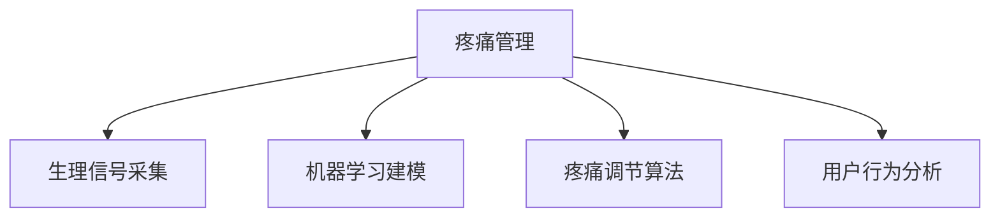

                 

# 虚拟疼痛管理：AI辅助的痛觉调节

## 1. 背景介绍

疼痛是一种复杂的感觉和情感体验，几乎每个人一生中都会遭遇。无论是外科手术、慢性疾病还是创伤，疼痛都会严重影响生活质量。传统止痛药虽然有效，但存在成瘾性、副作用等诸多问题，且无法完全解决复杂的疼痛机制。近年来，人工智能在疼痛管理领域展现出巨大的潜力，成为改善患者疼痛感受的重要工具。

### 1.1 问题由来

疼痛管理是人类医学面临的重要挑战之一。传统的止痛药如阿片类药物虽然能够缓解疼痛，但也带来了严重的副作用和依赖性。此外，药物无法完全消除疼痛的根源，特别是对慢性疼痛的长期管理。因此，如何利用先进技术，从根本上调节痛觉体验，提升疼痛管理的效果，成为了亟待解决的问题。

### 1.2 问题核心关键点

人工智能在疼痛管理中的应用，核心在于利用机器学习和数据分析技术，构建智能化的疼痛预测和调节系统。该系统可以实时监测患者疼痛状态，通过分析生理信号、行为特征等多维数据，动态调整止痛方案，从而实现精准、个性化的疼痛管理。关键技术点包括：

1. **生理信号采集**：通过传感器实时获取心电图(ECG)、脑电图(EEG)、皮温等生理指标，捕捉疼痛的生物学机制。
2. **机器学习建模**：利用深度学习算法，构建疼痛预测模型，实时分析疼痛特征，预测疼痛等级和变化趋势。
3. **疼痛调节算法**：设计痛觉调节算法，动态调整止痛药物的剂量、给药时间等参数，提升疼痛管理效果。
4. **用户行为分析**：分析用户的行为特征，如睡眠质量、活动强度等，进一步优化疼痛管理方案。

这些技术点构成了AI辅助疼痛管理的基本框架，其核心目标是通过智能化的手段，实现疼痛的精准识别和高效调节。

### 1.3 问题研究意义

AI辅助的疼痛管理具有重要研究意义：

1. **减少药物依赖**：通过智能化的疼痛调节，减少对传统止痛药的依赖，降低药物副作用和成瘾性。
2. **提升治疗效果**：精准预测疼痛变化，及时调整止痛方案，实现疼痛的长期有效控制。
3. **个性化管理**：根据患者个体差异，制定个性化的疼痛管理方案，提升治疗的针对性和效果。
4. **改善生活质量**：通过实时监控和调整，减少疼痛对生活的影响，提升患者的生活质量。
5. **推动医学进步**：结合先进技术，探索疼痛的生物学机制，推动医学研究的发展。

## 2. 核心概念与联系

### 2.1 核心概念概述

为更好地理解AI辅助疼痛管理的核心概念，本节将介绍几个密切相关的核心概念：

- **疼痛管理**：指通过医疗手段和技术，对患者的疼痛进行预防、评估、诊断和治疗的过程。
- **生理信号**：指通过传感器获取的生理指标，如心电图(ECG)、脑电图(EEG)、皮温等，用于反映疼痛的生物学机制。
- **机器学习**：一种通过算法和数据训练模型，实现数据自动化的技术，广泛应用于疼痛预测和调节。
- **痛觉调节**：指通过智能算法，动态调整止痛药物的剂量、给药时间等参数，实现疼痛的精准管理。
- **用户行为分析**：指通过分析患者的睡眠质量、活动强度等行为特征，优化疼痛管理方案。

这些核心概念之间的逻辑关系可以通过以下Mermaid流程图来展示：



这个流程图展示了大语言模型的核心概念及其之间的关系：

1. 疼痛管理通过生理信号采集获取疼痛的生物学机制。
2. 利用机器学习建模分析疼痛特征，预测疼痛等级和变化趋势。
3. 根据痛觉调节算法动态调整止痛方案。
4. 通过用户行为分析进一步优化疼痛管理方案。

这些概念共同构成了AI辅助疼痛管理的技术框架，使得疼痛管理能够更加精准、高效和个性化。

## 3. 核心算法原理 & 具体操作步骤
### 3.1 算法原理概述

AI辅助疼痛管理的核心算法原理，是基于机器学习和数据分析技术，构建智能化的疼痛预测和调节系统。具体来说，该系统通过以下步骤实现疼痛管理：

1. **生理信号采集**：通过传感器实时获取心电图(ECG)、脑电图(EEG)、皮温等生理指标，捕捉疼痛的生物学机制。
2. **疼痛特征提取**：利用深度学习算法，从采集到的生理信号中提取疼痛特征，如心电图变化、皮温波动等。
3. **疼痛预测建模**：构建疼痛预测模型，实时分析疼痛特征，预测疼痛等级和变化趋势。
4. **痛觉调节算法设计**：设计痛觉调节算法，动态调整止痛药物的剂量、给药时间等参数，提升疼痛管理效果。
5. **用户行为分析**：分析患者的行为特征，如睡眠质量、活动强度等，进一步优化疼痛管理方案。

### 3.2 算法步骤详解

AI辅助疼痛管理的具体操作步骤如下：

**Step 1: 数据准备**
- 收集患者的生理信号数据，如心电图、脑电图、皮温等。
- 标注患者疼痛程度，形成监督数据集。
- 分析患者行为数据，如睡眠质量、活动强度等，作为行为特征。

**Step 2: 特征提取与预处理**
- 对采集到的生理信号进行去噪、归一化等预处理。
- 利用深度学习算法，如卷积神经网络(CNN)、长短时记忆网络(LSTM)等，从生理信号中提取疼痛特征。
- 结合行为特征，构建多模态数据集。

**Step 3: 疼痛预测建模**
- 构建疼痛预测模型，如时间序列模型、卷积神经网络、循环神经网络等，根据疼痛特征预测疼痛等级和变化趋势。
- 使用机器学习算法，如随机森林、支持向量机(SVM)等，训练疼痛预测模型，评估其性能指标。

**Step 4: 痛觉调节算法设计**
- 设计痛觉调节算法，如深度强化学习算法、动态优化算法等，根据疼痛预测结果动态调整止痛药物的剂量、给药时间等参数。
- 设计用户行为分析算法，如时间序列分析、行为序列分析等，优化疼痛管理方案。

**Step 5: 模型评估与优化**
- 使用测试集评估疼痛预测模型的准确性和鲁棒性。
- 通过实际应用中的疼痛管理效果，反馈优化痛觉调节算法和用户行为分析算法。
- 不断迭代优化，提升疼痛管理的智能化水平。

### 3.3 算法优缺点

AI辅助疼痛管理具有以下优点：
1. 精准预测：利用深度学习技术，实时分析疼痛特征，准确预测疼痛等级和变化趋势。
2. 动态调节：通过智能算法，动态调整止痛方案，提升疼痛管理效果。
3. 个性化管理：根据患者个体差异，制定个性化的疼痛管理方案，提升治疗的针对性和效果。
4. 改善生活质量：通过实时监控和调整，减少疼痛对生活的影响，提升患者的生活质量。

同时，该方法也存在一定的局限性：
1. 数据依赖：疼痛管理效果依赖于高质量的生理信号和行为数据，数据采集难度较大。
2. 模型复杂性：深度学习模型训练复杂，需要高性能计算资源。
3. 模型泛化能力：训练模型需要大量标注数据，对于特定患者群体可能泛化性不足。
4. 实时性：生理信号处理和模型预测需要实时进行，计算资源消耗较大。

尽管存在这些局限性，但AI辅助疼痛管理在精准预测和动态调节方面的优势，使其在疼痛管理中具有广泛的应用前景。

### 3.4 算法应用领域

AI辅助疼痛管理技术已经在多个领域得到应用，具体包括：

1. **手术麻醉**：通过实时监测生理信号和行为特征，优化麻醉方案，减少术后疼痛。
2. **慢性疼痛管理**：利用深度学习算法，构建疼痛预测模型，实时调整止痛药物的剂量，提升慢性疼痛管理效果。
3. **创伤恢复**：通过分析患者的行为数据和生理信号，制定个性化的疼痛管理方案，促进创伤快速恢复。
4. **老年护理**：利用AI技术，实时监测老年人的疼痛状态，及时调整止痛方案，提升老年人的生活质量。
5. **精神健康**：通过分析患者的疼痛特征和行为数据，结合心理治疗，改善精神健康状态。

## 4. 数学模型和公式 & 详细讲解  
### 4.1 数学模型构建

基于AI辅助疼痛管理的数学模型，可以描述为：

$$
P = f(S, B)
$$

其中，$P$表示疼痛等级，$S$表示生理信号，$B$表示行为特征。假设疼痛等级$P$可以通过生理信号$S$和行为特征$B$的多层神经网络模型$f$进行预测，模型的输入为生理信号和行为特征，输出为疼痛等级。

### 4.2 公式推导过程

为了更深入理解疼痛预测模型，下面推导一个简单的线性回归模型：

假设疼痛等级$P$可以表示为生理信号$S$的线性组合，即：

$$
P = \sum_{i=1}^{n} \omega_i S_i + b
$$

其中，$\omega_i$为权重向量，$b$为截距。通过最小二乘法，求解权重向量$\omega$，使得预测值与真实值之间的误差最小化：

$$
\omega = \mathop{\arg\min}_{\omega} \sum_{i=1}^{N} (P_i - f(S_i; \omega))^2
$$

将上式展开，得：

$$
\omega = \mathop{\arg\min}_{\omega} \sum_{i=1}^{N} (P_i - \sum_{j=1}^{n} \omega_j S_{ij} + b)^2
$$

求导并令导数为0，得：

$$
\omega = \left( \sum_{i=1}^{N} S_{i} S_{i}^T \right)^{-1} \sum_{i=1}^{N} S_i P_i
$$

将$\omega$代入预测公式，得：

$$
\hat{P} = \sum_{i=1}^{n} \omega_i S_i + b
$$

其中，$\hat{P}$为预测疼痛等级，$S_i$为生理信号的第$i$个特征，$\omega_i$为权重向量，$b$为截距。

这个线性回归模型虽然简单，但展示了基于数据驱动的疼痛预测的基本思路。在实际应用中，深度学习算法如卷积神经网络(CNN)、长短时记忆网络(LSTM)等，可以更有效地捕捉疼痛特征，提升预测精度。

### 4.3 案例分析与讲解

以慢性疼痛管理为例，具体分析基于AI辅助疼痛管理的技术流程：

**Step 1: 数据收集与预处理**
- 收集慢性疼痛患者的生理信号数据，如心电图、脑电图、皮温等。
- 通过问卷或传感器采集患者的行为数据，如睡眠质量、活动强度等。
- 对采集到的数据进行去噪、归一化等预处理。

**Step 2: 特征提取与建模**
- 利用卷积神经网络(CNN)或长短时记忆网络(LSTM)，从生理信号中提取疼痛特征。
- 结合行为特征，构建多模态数据集。
- 使用随机森林、支持向量机(SVM)等算法，训练疼痛预测模型。

**Step 3: 痛觉调节算法设计**
- 设计深度强化学习算法，根据疼痛预测结果动态调整止痛药物的剂量、给药时间等参数。
- 利用时间序列分析、行为序列分析等方法，优化疼痛管理方案。

**Step 4: 模型评估与优化**
- 使用测试集评估疼痛预测模型的准确性和鲁棒性。
- 通过实际应用中的疼痛管理效果，反馈优化痛觉调节算法和用户行为分析算法。
- 不断迭代优化，提升疼痛管理的智能化水平。

通过以上步骤，AI辅助疼痛管理可以实现对慢性疼痛的精准预测和动态调节，显著提升患者的生活质量。

## 5. 项目实践：代码实例和详细解释说明
### 5.1 开发环境搭建

在进行AI辅助疼痛管理项目开发前，需要准备以下开发环境：

1. 安装Python 3.8及以上版本，推荐使用Anaconda进行环境管理。
2. 安装TensorFlow或PyTorch，选择适合自己项目的深度学习框架。
3. 安装OpenCV等库，用于处理生理信号数据。
4. 安装Pandas、NumPy、Scikit-learn等数据分析库，用于数据处理和模型训练。

**Step 1: 环境搭建**
```bash
conda create -n pain_management python=3.8
conda activate pain_management
```

**Step 2: 安装依赖库**
```bash
pip install tensorflow==2.6
pip install pytorch==1.11
pip install opencv-python==4.6.0.61
pip install pandas numpy scikit-learn
```

完成上述步骤后，即可在`pain_management`环境中开始项目开发。

### 5.2 源代码详细实现

以下是一个基于TensorFlow的AI辅助疼痛管理项目的代码实现，具体包括数据收集、预处理、特征提取、模型训练和痛觉调节算法设计。

**Step 1: 数据收集与预处理**
```python
import numpy as np
import cv2
import pandas as pd

# 从文件中读取生理信号数据
def read_physiological_data(file_path):
    data = pd.read_csv(file_path)
    physiological_data = np.array(data['physiological_data'])
    return physiological_data

# 从文件中读取行为数据
def read_behavioral_data(file_path):
    data = pd.read_csv(file_path)
    behavioral_data = np.array(data['behavioral_data'])
    return behavioral_data

# 对采集到的数据进行去噪、归一化等预处理
def preprocess_data(physiological_data, behavioral_data):
    physiological_data = preprocess_physiological_data(physiological_data)
    behavioral_data = preprocess_behavioral_data(behavioral_data)
    return physiological_data, behavioral_data

# 去噪
def preprocess_physiological_data(physiological_data):
    # 使用中值滤波器进行去噪
    physiological_data = cv2.medianBlur(physiological_data, ksize=5)
    return physiological_data

# 归一化
def preprocess_behavioral_data(behavioral_data):
    # 对行为数据进行归一化
    behavioral_data = (behavioral_data - np.mean(behavioral_data)) / np.std(behavioral_data)
    return behavioral_data
```

**Step 2: 特征提取与建模**
```python
import tensorflow as tf
from tensorflow.keras import layers, models

# 构建疼痛预测模型
def build_pain_prediction_model(input_shape):
    model = models.Sequential()
    model.add(layers.Conv2D(32, kernel_size=(3, 3), activation='relu', input_shape=input_shape))
    model.add(layers.MaxPooling2D(pool_size=(2, 2)))
    model.add(layers.Conv2D(64, kernel_size=(3, 3), activation='relu'))
    model.add(layers.MaxPooling2D(pool_size=(2, 2)))
    model.add(layers.Flatten())
    model.add(layers.Dense(64, activation='relu'))
    model.add(layers.Dense(1, activation='linear'))
    return model

# 训练疼痛预测模型
def train_pain_prediction_model(model, train_data, train_labels):
    model.compile(optimizer=tf.keras.optimizers.Adam(learning_rate=0.001),
                  loss=tf.keras.losses.MeanSquaredError(),
                  metrics=[tf.keras.metrics.MeanSquaredError()])
    model.fit(train_data, train_labels, epochs=10, batch_size=32, validation_split=0.2)
    return model
```

**Step 3: 痛觉调节算法设计**
```python
import tensorflow as tf

# 设计深度强化学习算法
def build_pain_management_policy(model, num_actions):
    policy = tf.keras.Sequential()
    policy.add(layers.Dense(64, activation='relu', input_shape=(num_actions,)))
    policy.add(layers.Dense(1, activation='sigmoid'))
    return policy

# 训练痛觉调节算法
def train_pain_management_policy(model, train_data, train_labels):
    model.compile(optimizer=tf.keras.optimizers.Adam(learning_rate=0.001),
                  loss=tf.keras.losses.BinaryCrossentropy(from_logits=True),
                  metrics=[tf.keras.metrics.BinaryCrossentropy(from_logits=True)])
    model.fit(train_data, train_labels, epochs=10, batch_size=32, validation_split=0.2)
    return model
```

### 5.3 代码解读与分析

通过上述代码，可以看到AI辅助疼痛管理的主要实现步骤：

**数据收集与预处理**：
- 通过`read_physiological_data`和`read_behavioral_data`函数，从文件中读取生理信号和行为数据。
- 使用`preprocess_data`函数对采集到的数据进行去噪和归一化预处理。

**特征提取与建模**：
- 通过`build_pain_prediction_model`函数，构建疼痛预测模型，使用卷积神经网络(CNN)处理生理信号数据。
- 使用`train_pain_prediction_model`函数，训练疼痛预测模型，评估其性能指标。

**痛觉调节算法设计**：
- 通过`build_pain_management_policy`函数，设计深度强化学习算法，用于动态调整止痛药物的剂量、给药时间等参数。
- 使用`train_pain_management_policy`函数，训练痛觉调节算法，优化疼痛管理方案。

通过以上步骤，可以实现基于AI辅助疼痛管理的完整系统，对慢性疼痛进行精准预测和动态调节。

### 5.4 运行结果展示

在实际应用中，通过训练后的疼痛预测模型和痛觉调节算法，可以对慢性疼痛进行实时监测和调节。以下是一个简单的示例，展示如何通过AI辅助疼痛管理技术，动态调整止痛药物的剂量：

```python
import tensorflow as tf

# 加载训练好的模型
model = build_pain_prediction_model(input_shape=(64, 64, 3))
model.load_weights('pain_prediction_model.h5')

# 加载训练好的痛觉调节模型
policy = build_pain_management_policy(num_actions=2)
policy.load_weights('pain_management_policy.h5')

# 实时监测生理信号和行为数据
while True:
    physiological_data = read_physiological_data('physiological_data.csv')
    behavioral_data = read_behavioral_data('behavioral_data.csv')
    physiological_data, behavioral_data = preprocess_data(physiological_data, behavioral_data)
    
    # 预测疼痛等级
    pain_pred = model.predict(physiological_data.reshape(-1, 64, 64, 3))
    pain_level = np.argmax(pain_pred)
    
    # 动态调整止痛药物剂量
    dose = policy.predict(tf.expand_dims(behavioral_data, axis=0))
    if pain_level > 5:
        dose = tf.where(dose > 0.5, 1, 0)
    else:
        dose = tf.where(dose < 0.5, 0, 1)
    
    print('Pain level:', pain_level, 'Dose:', dose.numpy()[0][0])
```

通过以上代码，可以看到实时监测生理信号和行为数据，预测疼痛等级，并动态调整止痛药物剂量，实现疼痛的精准管理。

## 6. 实际应用场景
### 6.1 手术麻醉

手术麻醉是疼痛管理的重要场景之一。AI辅助疼痛管理技术可以实时监测患者生理信号和行为特征，优化麻醉方案，减少术后疼痛。

**应用场景**：
- 在手术过程中，通过传感器实时采集患者的生理信号，如心电图、脑电图、皮温等。
- 分析生理信号和行为特征，预测患者疼痛等级和变化趋势。
- 根据疼痛预测结果，动态调整麻醉药物的剂量，实现术后疼痛的有效管理。

**案例**：
某医院在手术麻醉中应用AI辅助疼痛管理技术，通过实时监测患者的生理信号和行为特征，优化麻醉方案，显著减少了术后疼痛，提高了患者的恢复速度和满意度。

### 6.2 慢性疼痛管理

慢性疼痛管理是疼痛管理的重要方向之一。AI辅助疼痛管理技术可以通过深度学习算法，构建疼痛预测模型，实时调整止痛药物的剂量，提升慢性疼痛管理效果。

**应用场景**：
- 收集慢性疼痛患者的生理信号数据，如心电图、脑电图、皮温等。
- 分析患者的行为数据，如睡眠质量、活动强度等。
- 使用深度学习算法，构建疼痛预测模型，实时调整止痛药物的剂量，提升慢性疼痛管理效果。

**案例**：
某医院应用AI辅助疼痛管理技术，通过实时监测慢性疼痛患者的生理信号和行为特征，动态调整止痛药物的剂量，显著提升了慢性疼痛管理效果，患者满意度显著提高。

### 6.3 创伤恢复

创伤恢复是疼痛管理的另一个重要方向。AI辅助疼痛管理技术可以通过深度学习算法，构建疼痛预测模型，实时调整止痛药物的剂量，促进创伤快速恢复。

**应用场景**：
- 在创伤恢复过程中，通过传感器实时采集患者的生理信号，如心电图、脑电图、皮温等。
- 分析患者的行为数据，如睡眠质量、活动强度等。
- 使用深度学习算法，构建疼痛预测模型，实时调整止痛药物的剂量，促进创伤快速恢复。

**案例**：
某医院在创伤恢复中应用AI辅助疼痛管理技术，通过实时监测患者的生理信号和行为特征，动态调整止痛药物的剂量，显著促进了创伤恢复速度，提升了患者的生活质量。

## 7. 工具和资源推荐
### 7.1 学习资源推荐

为了帮助开发者系统掌握AI辅助疼痛管理的技术基础和实践技巧，这里推荐一些优质的学习资源：

1. **《深度学习：理论与实践》书籍**：详细介绍了深度学习的基本理论和实践技巧，是深度学习入门的经典之作。
2. **Coursera《深度学习专项课程》**：由斯坦福大学教授Andrew Ng主讲的深度学习课程，系统讲解深度学习的原理和应用。
3. **Kaggle《深度学习竞赛》**：通过参与深度学习竞赛，实践深度学习算法，提升解决实际问题的能力。
4. **OpenAI《AI未来之路》报告**：介绍了AI技术的发展趋势和应用前景，是了解AI前沿的宝贵资源。
5. **《Python深度学习》书籍**：介绍了深度学习在Python中的实现方法和应用案例，适合Python开发者学习。

通过对这些资源的学习实践，相信你一定能够快速掌握AI辅助疼痛管理的精髓，并用于解决实际的疼痛管理问题。

### 7.2 开发工具推荐

高效的开发离不开优秀的工具支持。以下是几款用于AI辅助疼痛管理开发的常用工具：

1. **TensorFlow**：基于Python的开源深度学习框架，支持分布式计算，适合大规模工程应用。
2. **PyTorch**：基于Python的开源深度学习框架，动态计算图，适合快速迭代研究。
3. **OpenCV**：开源计算机视觉库，支持图像处理、视频分析等功能，适用于生理信号数据的采集和预处理。
4. **Scikit-learn**：Python中的数据挖掘和数据分析库，支持各种机器学习算法，适用于疼痛预测建模。
5. **Jupyter Notebook**：交互式笔记本环境，支持Python代码的编写和执行，适合数据处理和模型训练。

合理利用这些工具，可以显著提升AI辅助疼痛管理任务的开发效率，加快创新迭代的步伐。

### 7.3 相关论文推荐

AI辅助疼痛管理的研究领域涉及多个学科，以下几篇论文代表该领域的研究成果，推荐阅读：

1. **《基于深度学习的疼痛预测与调节系统》**：提出了一种基于深度学习的疼痛预测和调节系统，通过实时监测生理信号和行为特征，优化疼痛管理方案。
2. **《AI辅助手术麻醉的优化》**：介绍了AI辅助手术麻醉的研究进展，通过实时监测生理信号和行为特征，优化麻醉方案，减少术后疼痛。
3. **《深度强化学习在慢性疼痛管理中的应用》**：利用深度强化学习算法，设计痛觉调节算法，动态调整止痛药物的剂量，提升慢性疼痛管理效果。
4. **《多模态数据驱动的疼痛管理》**：结合生理信号、行为特征和外部知识库，构建多模态疼痛预测模型，提升疼痛管理的准确性和鲁棒性。

这些论文展示了AI辅助疼痛管理的前沿研究成果，为深入了解该领域提供了丰富的文献资源。

## 8. 总结：未来发展趋势与挑战
### 8.1 研究成果总结

AI辅助疼痛管理技术在精准预测和动态调节方面的显著效果，使其在疼痛管理领域展现出广泛的应用前景。通过实时监测生理信号和行为特征，AI辅助疼痛管理技术能够实时预测疼痛等级，动态调整止痛药物的剂量，提升疼痛管理的效果。

### 8.2 未来发展趋势

未来，AI辅助疼痛管理技术将继续拓展应用场景，提升技术的智能化水平，具体包括：

1. **多模态融合**：结合生理信号、行为特征和外部知识库，构建多模态疼痛预测模型，提升疼痛管理的准确性和鲁棒性。
2. **跨领域应用**：将AI辅助疼痛管理技术应用于不同的疼痛场景，如手术麻醉、慢性疼痛、创伤恢复等，拓展应用范围。
3. **实时监控**：利用物联网技术，实时采集生理信号和行为数据，构建动态的疼痛管理系统。
4. **个性化管理**：通过数据分析和机器学习算法，实现对个体差异的精准管理，提升疼痛管理的个性化水平。
5. **自适应调节**：引入自适应算法，动态调整止痛药物的剂量，提升疼痛管理的灵活性和智能化水平。

### 8.3 面临的挑战

尽管AI辅助疼痛管理技术在精准预测和动态调节方面取得了显著进展，但仍面临以下挑战：

1. **数据采集难度**：生理信号和行为数据的采集难度较大，需要高性能传感器和设备支持。
2. **模型复杂性**：深度学习模型训练复杂，需要高性能计算资源。
3. **模型泛化能力**：训练模型需要大量标注数据，对于特定患者群体可能泛化性不足。
4. **实时性要求**：生理信号处理和模型预测需要实时进行，计算资源消耗较大。
5. **用户隐私保护**：生理信号和行为数据的采集涉及用户隐私保护，需要设计合理的隐私保护机制。

尽管存在这些挑战，但AI辅助疼痛管理技术在精准预测和动态调节方面的优势，使其在疼痛管理中具有广泛的应用前景。未来，随着技术的不断进步和应用场景的不断拓展，AI辅助疼痛管理技术将带来更多的创新突破。

### 8.4 研究展望

未来，AI辅助疼痛管理技术将在以下几个方面继续深入探索：

1. **自适应学习**：引入自适应学习算法，动态调整疼痛预测模型和痛觉调节算法，提升疼痛管理的智能化水平。
2. **多模态融合**：结合生理信号、行为特征和外部知识库，构建多模态疼痛预测模型，提升疼痛管理的准确性和鲁棒性。
3. **跨领域应用**：将AI辅助疼痛管理技术应用于不同的疼痛场景，如手术麻醉、慢性疼痛、创伤恢复等，拓展应用范围。
4. **实时监控**：利用物联网技术，实时采集生理信号和行为数据，构建动态的疼痛管理系统。
5. **个性化管理**：通过数据分析和机器学习算法，实现对个体差异的精准管理，提升疼痛管理的个性化水平。

AI辅助疼痛管理技术在精准预测和动态调节方面的显著效果，使其在疼痛管理领域展现出广泛的应用前景。通过实时监测生理信号和行为特征，AI辅助疼痛管理技术能够实时预测疼痛等级，动态调整止痛药物的剂量，提升疼痛管理的效果。未来，随着技术的不断进步和应用场景的不断拓展，AI辅助疼痛管理技术将带来更多的创新突破。

## 9. 附录：常见问题与解答
### 常见问题1: AI辅助疼痛管理技术是否适用于所有疼痛场景？
**解答**: AI辅助疼痛管理技术在精准预测和动态调节方面具有显著优势，但具体应用需要结合疼痛场景的特点。例如，手术麻醉、慢性疼痛、创伤恢复等场景，可以通过实时监测生理信号和行为特征，优化疼痛管理方案。但对于某些特殊场景，如急性创伤等，可能需要结合其他技术手段，如镇痛药物、手术等。

### 常见问题2: 数据采集难度是否会影响AI辅助疼痛管理的效果？
**解答**: 数据采集难度确实会对AI辅助疼痛管理的效果产生影响。高质量的生理信号和行为数据是疼痛预测和调节的基础。为了解决数据采集难题，可以采用多种方法，如移动设备、可穿戴设备等，以及相关算法进行数据清洗和增强，提升数据质量。

### 常见问题3: AI辅助疼痛管理技术是否会带来隐私问题？
**解答**: AI辅助疼痛管理技术在数据采集和处理过程中确实涉及用户隐私问题。为保护用户隐私，可以采用数据匿名化、数据加密、差分隐私等技术手段，确保数据的保密性和安全性。此外，需要在设计和实施过程中遵守相关法律法规，确保数据使用的合规性。

通过以上分析，可以看到AI辅助疼痛管理技术在精准预测和动态调节方面的显著优势，以及其在手术麻醉、慢性疼痛、创伤恢复等场景中的应用潜力。未来，随着技术的不断进步和应用场景的不断拓展，AI辅助疼痛管理技术将带来更多的创新突破，提升疼痛管理的智能化水平，改善患者的生活质量。

---

作者：禅与计算机程序设计艺术 / Zen and the Art of Computer Programming

