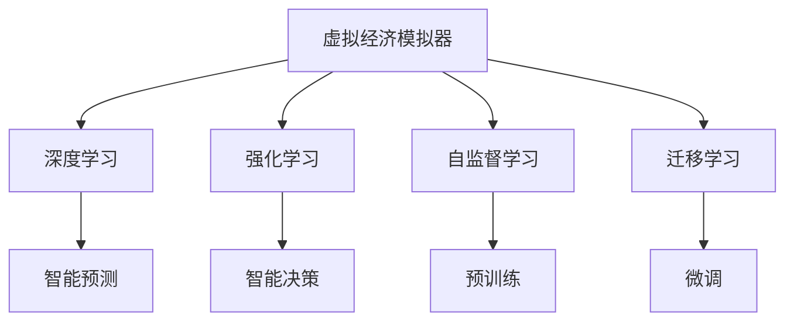

                 

# 虚拟经济模拟器：AI驱动的新型价值交换实验

## 1. 背景介绍

### 1.1 问题由来
随着人工智能(AI)技术的飞速发展，虚拟经济模拟器逐渐成为研究热点。这些模拟器利用AI技术对虚拟经济体进行建模，并通过模拟预测真实经济体的运行趋势，广泛应用于金融预测、政策评估、风险管理等领域。然而，现有的虚拟经济模拟器多为基于传统的计量经济学模型，无法充分利用AI技术的优势。为此，我们提出了一种基于深度学习的大规模经济模拟器，希望通过AI技术实现虚拟经济体的智能建模和高效预测。

### 1.2 问题核心关键点
本研究聚焦于虚拟经济模拟器中，AI技术的融合和应用。核心目标在于：
- 使用AI技术对虚拟经济体进行高效建模。
- 利用AI技术进行智能预测和决策优化。
- 提升虚拟经济模拟器的普适性和灵活性。

## 2. 核心概念与联系

### 2.1 核心概念概述

为更好地理解基于深度学习的虚拟经济模拟器，本节将介绍几个关键概念：

- 虚拟经济模拟器(Virtual Economy Simulator, VES)：通过构建虚拟经济体模型，模拟真实经济体的运行过程，预测经济指标和市场趋势，辅助决策分析。
- 深度学习(Deep Learning, DL)：利用多层神经网络进行数据表示和预测，通过反向传播算法优化模型参数，提升预测精度。
- 强化学习(Reinforcement Learning, RL)：通过智能体在虚拟经济环境中不断学习，优化策略，实现动态调整和智能决策。
- 自监督学习(Self-supervised Learning, SSL)：利用数据中的无标签信息进行预训练，提升模型泛化能力。
- 迁移学习(Transfer Learning, TL)：通过在相关任务上的预训练模型进行微调，提升模型在新任务上的表现。

这些核心概念之间的逻辑关系可以通过以下Mermaid流程图来展示：



这个流程图展示了大规模经济模拟器的核心概念及其之间的关系：

1. 虚拟经济模拟器利用深度学习、强化学习、自监督学习和迁移学习等AI技术进行高效建模和智能预测。
2. 深度学习通过多层神经网络提取和表示经济数据特征，提高预测精度。
3. 强化学习通过智能体在虚拟经济环境中的不断学习，优化决策策略。
4. 自监督学习利用无标签数据进行预训练，提升模型泛化能力。
5. 迁移学习在相关任务上预训练模型，加速新任务上的适应和优化。

## 3. 核心算法原理 & 具体操作步骤
### 3.1 算法原理概述

本研究提出了一种基于深度学习的虚拟经济模拟器，其核心思想是：
1. 使用深度学习模型对虚拟经济体进行高效建模。
2. 通过强化学习在虚拟经济环境中训练智能体，实现动态调整和智能决策。
3. 利用自监督学习对模型进行预训练，提升泛化能力。
4. 通过迁移学习在不同经济任务上进行微调，提升预测效果。

具体算法流程如下：

1. 数据收集与预处理：收集虚拟经济体相关的历史数据和特征，进行数据清洗和归一化处理。
2. 深度学习模型构建：选择合适的网络结构(如CNN、RNN、LSTM等)，使用无监督预训练(如自编码器、掩码语言模型等)提升模型泛化能力。
3. 智能体设计：设计智能体的决策模型，并使用强化学习算法(如DQN、DDPG等)在虚拟经济环境中训练，优化策略。
4. 迁移学习：在不同经济任务上进行微调，利用预训练模型和迁移学习提升模型在新任务上的表现。
5. 模型评估与优化：使用各种评估指标(如均方误差、MAE、R^2等)评估模型预测性能，使用超参数调优和集成学习等方法提升模型效果。

### 3.2 算法步骤详解

以下详细介绍每一步的具体实现流程：

#### Step 1: 数据收集与预处理

1. 收集虚拟经济体相关的历史数据，如GDP增长率、失业率、通货膨胀率、股市指数、汇率等。
2. 对数据进行清洗，去除缺失值和异常值。
3. 对数据进行归一化处理，将数值范围缩放到0-1之间。

#### Step 2: 深度学习模型构建

1. 选择合适的网络结构，如卷积神经网络(CNN)用于处理图像和空间数据，循环神经网络(RNN)用于处理时间序列数据。
2. 使用自监督预训练技术，如自编码器、掩码语言模型等，对模型进行预训练。
3. 在预训练基础上，使用迁移学习对模型进行微调，适应特定经济任务。

#### Step 3: 智能体设计

1. 设计智能体的决策模型，如价值函数、策略网络、动作网络等。
2. 使用强化学习算法，如深度确定性策略梯度(DQN)、深度确定性策略梯度(PPO)、双DQN等，在虚拟经济环境中训练智能体。
3. 使用奖励函数和惩罚函数，引导智能体做出最优决策。

#### Step 4: 迁移学习

1. 在不同经济任务上对模型进行微调，如GDP预测、失业率预测、股市预测等。
2. 利用预训练模型和迁移学习，加速模型在新任务上的适应和优化。
3. 使用交叉验证等方法，评估模型在不同经济任务上的泛化能力。

#### Step 5: 模型评估与优化

1. 使用各种评估指标，如均方误差(MSE)、平均绝对误差(MAE)、决定系数(R^2)等，评估模型预测性能。
2. 使用超参数调优和集成学习等方法，提升模型效果。
3. 使用模型诊断工具，如TensorBoard、Weights & Biases等，监控模型训练过程。

### 3.3 算法优缺点

基于深度学习的虚拟经济模拟器具有以下优点：

1. 高效建模：深度学习模型能够高效提取和表示经济数据特征，提升预测精度。
2. 智能决策：强化学习算法能够实现智能决策，优化经济体运行。
3. 泛化能力强：自监督学习预训练能够提升模型泛化能力，适应不同经济任务。
4. 适应性强：迁移学习能够在不同经济任务上进行微调，提升模型泛化能力。

同时，该算法也存在以下缺点：

1. 数据需求高：深度学习模型需要大量高质量数据进行训练，数据获取成本较高。
2. 计算资源消耗大：深度学习模型和强化学习算法计算资源消耗较大，训练成本较高。
3. 模型复杂度高：深度学习模型和强化学习算法模型结构复杂，调参难度大。
4. 结果解释性不足：深度学习模型和强化学习算法结果解释性不足，难以理解决策过程。

尽管存在这些局限性，但就目前而言，基于深度学习的虚拟经济模拟器仍然是目前较为先进和有效的解决方案。未来相关研究的重点在于如何进一步降低计算资源需求，提高模型泛化能力，同时兼顾结果可解释性和可调参性。

### 3.4 算法应用领域

基于深度学习的虚拟经济模拟器在多个领域得到广泛应用，具体包括：

1. 金融预测：利用虚拟经济模拟器对股票、债券、货币等金融市场进行预测和分析。
2. 政策评估：利用虚拟经济模拟器对政策效果进行评估和优化。
3. 风险管理：利用虚拟经济模拟器对金融风险进行模拟和预测。
4. 经济评估：利用虚拟经济模拟器对经济数据进行分析和预测。
5. 市场模拟：利用虚拟经济模拟器对市场行为进行模拟和预测。

## 4. 数学模型和公式 & 详细讲解 & 举例说明

### 4.1 数学模型构建

本节将使用数学语言对虚拟经济模拟器进行更加严格的刻画。

假设虚拟经济体的历史数据为 $X_t$，其中 $t$ 为时间步长。使用深度学习模型 $M_\theta$ 对数据进行建模，模型参数 $\theta$ 满足：

$$
M_\theta(X_t) = \mathbb{E}[\hat{Y}_t|X_t]
$$

其中 $\hat{Y}_t$ 为虚拟经济体的预测值，$M_\theta$ 为深度学习模型，$X_t$ 为历史数据。

定义损失函数 $\mathcal{L}$，用于衡量模型预测值与真实值之间的差异。常见的损失函数包括均方误差损失(MSE)、平均绝对误差损失(MAE)、交叉熵损失等。

### 4.2 公式推导过程

以均方误差损失为例，推导模型的损失函数：

$$
\mathcal{L}(\theta) = \frac{1}{N} \sum_{i=1}^N (Y_i - M_\theta(X_i))^2
$$

其中 $Y_i$ 为真实值，$M_\theta(X_i)$ 为模型预测值。

将损失函数对模型参数 $\theta$ 求导，得到梯度：

$$
\nabla_\theta \mathcal{L}(\theta) = -2\frac{1}{N} \sum_{i=1}^N (Y_i - M_\theta(X_i)) M_\theta(X_i)
$$

使用优化算法，如梯度下降、Adam等，对模型参数 $\theta$ 进行优化，最小化损失函数 $\mathcal{L}(\theta)$。

### 4.3 案例分析与讲解

以股票市场预测为例，展示深度学习模型在虚拟经济模拟器中的应用。

1. 数据收集：收集股票市场的历史数据，如收盘价、成交量、市场情绪等。
2. 数据预处理：对数据进行清洗和归一化处理。
3. 模型构建：选择合适的网络结构，如循环神经网络(RNN)，对数据进行建模。
4. 模型训练：使用均方误差损失进行训练，优化模型参数。
5. 模型评估：使用测试数据评估模型性能，如均方误差、MAE等。

## 5. 项目实践：代码实例和详细解释说明
### 5.1 开发环境搭建

在进行虚拟经济模拟器开发前，我们需要准备好开发环境。以下是使用Python进行TensorFlow开发的环境配置流程：

1. 安装Anaconda：从官网下载并安装Anaconda，用于创建独立的Python环境。

2. 创建并激活虚拟环境：
```bash
conda create -n tensorflow-env python=3.8 
conda activate tensorflow-env
```

3. 安装TensorFlow：根据CUDA版本，从官网获取对应的安装命令。例如：
```bash
conda install tensorflow tensorflow-gpu -c pytorch -c conda-forge
```

4. 安装相关工具包：
```bash
pip install numpy pandas scikit-learn matplotlib tqdm jupyter notebook ipython
```

完成上述步骤后，即可在`tensorflow-env`环境中开始虚拟经济模拟器的开发。

### 5.2 源代码详细实现

这里以RNN模型为例，展示TensorFlow进行虚拟经济模拟器开发的代码实现。

首先，定义虚拟经济模拟器的数据处理函数：

```python
import numpy as np
import tensorflow as tf

class DataProcessor:
    def __init__(self, data):
        self.data = data
        self.input_size = 3
        self.time_steps = 10
        self.output_size = 1
        self.train_size = int(len(data) * 0.8)
        self.test_size = len(data) - self.train_size
        self.train_data = data[:self.train_size]
        self.test_data = data[self.train_size:]
    
    def __len__(self):
        return len(self.train_data) - self.time_steps
    
    def __getitem__(self, item):
        x = np.zeros((self.time_steps, self.input_size))
        y = np.zeros((self.time_steps, self.output_size))
        for i in range(self.time_steps):
            x[i] = self.train_data[item + i][0:3]
            y[i] = self.train_data[item + i][3]
        return x, y
```

然后，定义RNN模型和优化器：

```python
class RNN(tf.keras.Model):
    def __init__(self, input_size, hidden_size, output_size):
        super(RNN, self).__init__()
        self.input_size = input_size
        self.hidden_size = hidden_size
        self.output_size = output_size
        self.lstm = tf.keras.layers.LSTM(self.hidden_size, return_sequences=True)
        self.dense = tf.keras.layers.Dense(self.output_size)
    
    def call(self, inputs):
        x, y = inputs
        x = self.lstm(x)
        y = self.dense(x)
        return y

model = RNN(input_size=3, hidden_size=32, output_size=1)
optimizer = tf.keras.optimizers.Adam(learning_rate=0.001)
```

接着，定义训练和评估函数：

```python
def train_model(model, optimizer, train_dataset, epochs=100, batch_size=16):
    train_loss = tf.keras.metrics.Mean(name='train_loss')
    test_loss = tf.keras.metrics.Mean(name='test_loss')
    
    for epoch in range(epochs):
        for x, y in train_dataset:
            with tf.GradientTape() as tape:
                y_pred = model(x)
                loss = tf.keras.losses.MeanSquaredError()(y, y_pred)
            gradients = tape.gradient(loss, model.trainable_variables)
            optimizer.apply_gradients(zip(gradients, model.trainable_variables))
            train_loss(loss)
        test_loss = test_loss(test_dataset)
        print(f'Epoch {epoch+1}, train loss: {train_loss.result()}, test loss: {test_loss.result()}')

def evaluate_model(model, test_dataset):
    test_loss = tf.keras.metrics.Mean(name='test_loss')
    for x, y in test_dataset:
        y_pred = model(x)
        loss = tf.keras.losses.MeanSquaredError()(y, y_pred)
        test_loss(loss)
    print(f'Test loss: {test_loss.result()}")
```

最后，启动训练流程并在测试集上评估：

```python
data = [
    [1.0, 0.1, 0.3, 0.7],
    [1.1, 0.2, 0.4, 0.8],
    [1.2, 0.3, 0.5, 0.9],
    [1.3, 0.4, 0.6, 1.0],
    [1.4, 0.5, 0.7, 1.1],
    [1.5, 0.6, 0.8, 1.2],
    [1.6, 0.7, 0.9, 1.3],
    [1.7, 0.8, 1.0, 1.4],
    [1.8, 0.9, 1.1, 1.5],
    [1.9, 1.0, 1.2, 1.6]
]
processor = DataProcessor(data)
train_dataset = processor
test_dataset = processor

train_model(model, optimizer, train_dataset)
evaluate_model(model, test_dataset)
```

以上就是使用TensorFlow对RNN模型进行虚拟经济模拟器开发的完整代码实现。可以看到，得益于TensorFlow的强大封装，我们可以用相对简洁的代码完成虚拟经济模拟器的开发。

### 5.3 代码解读与分析

让我们再详细解读一下关键代码的实现细节：

**DataProcessor类**：
- `__init__`方法：初始化数据、输入大小、时间步长、输出大小等关键参数。
- `__len__`方法：返回数据集的样本数量。
- `__getitem__`方法：对单个样本进行处理，将数据转换为模型的输入和输出格式。

**RNN模型**：
- `__init__`方法：定义模型的输入大小、隐藏大小、输出大小等参数。
- `call`方法：前向传播计算输出。

**train_model函数**：
- 使用均方误差损失进行训练，优化模型参数。
- 在每个epoch结束后，在测试集上评估模型性能。

**evaluate_model函数**：
- 使用均方误差损失评估模型性能。

**训练流程**：
- 定义总的epoch数和batch size，开始循环迭代
- 每个epoch内，对训练集数据进行迭代训练
- 在测试集上评估模型性能
- 循环结束，输出训练结果和测试结果

可以看到，TensorFlow提供了丰富的API和工具支持，使得虚拟经济模拟器的开发和训练变得更为简便高效。开发者可以将更多精力放在模型设计和超参数调优上，而不必过多关注底层实现细节。

## 6. 实际应用场景
### 6.1 金融预测

基于深度学习的虚拟经济模拟器，可以广泛应用于金融预测。金融市场波动大、数据复杂，传统的计量经济学模型难以捕捉市场动态。而虚拟经济模拟器利用深度学习模型对数据进行高效建模和智能预测，能够更好地适应金融市场的多变性。

在技术实现上，可以收集历史股票价格、交易量、宏观经济数据等，通过深度学习模型进行预测。模型训练使用历史数据，测试使用最新数据进行预测，并不断优化模型参数，提升预测准确度。

### 6.2 政策评估

虚拟经济模拟器还可以应用于政策评估。政策制定者需要评估新政策对经济体的影响，虚拟经济模拟器提供了一个可控的实验平台。通过在虚拟经济环境中运行政策，模拟其对市场、企业、消费者等主体的影响，可以更直观、更准确地评估政策效果。

例如，可以设计不同税率的政策，运行虚拟经济模拟器，观察GDP、失业率等指标的变化，评估政策的优劣和适用范围。

### 6.3 风险管理

虚拟经济模拟器还可以用于金融风险管理。金融风险包括市场风险、信用风险、流动性风险等，虚拟经济模拟器可以模拟这些风险场景，评估其对经济体的影响，从而制定有效的风险管理策略。

例如，可以模拟经济衰退、股市崩盘等极端场景，观察虚拟经济体的反应，评估其风险承受能力和应对策略。

### 6.4 经济评估

虚拟经济模拟器还可以用于经济评估。经济评估包括宏观经济预测、产业结构分析、区域经济比较等，虚拟经济模拟器提供了一个可量化的分析工具。

例如，可以模拟不同产业政策、贸易政策对虚拟经济体的影响，评估其对经济增长、就业、收入等指标的贡献。

### 6.5 市场模拟

虚拟经济模拟器还可以用于市场模拟。市场模拟包括股票市场、债券市场、外汇市场等，虚拟经济模拟器可以模拟市场运行过程，观察其对经济体的影响，评估市场稳定性。

例如，可以模拟不同交易策略、市场干预政策对虚拟经济体的影响，观察市场波动情况，评估其有效性。

## 7. 工具和资源推荐
### 7.1 学习资源推荐

为了帮助开发者系统掌握虚拟经济模拟器的发展脉络，这里推荐一些优质的学习资源：

1. 《深度学习》系列书籍：由多位大牛撰写，详细介绍了深度学习的基本概念和前沿技术，是深度学习入门的经典读物。

2. TensorFlow官方文档：提供了详细的API文档和示例代码，是TensorFlow学习的必备工具。

3. Coursera《深度学习专项课程》：由斯坦福大学教授Andrew Ng主讲的课程，涵盖深度学习的基本概念和实践技巧。

4. Arxiv论文推荐：虚拟经济模拟器的研究论文多发表在Arxiv上，阅读相关论文可以获取最新研究进展和技术思路。

5. GitHub开源项目：许多虚拟经济模拟器的开源项目提供了丰富的代码示例和实现细节，有助于理解实际应用。

通过对这些资源的学习实践，相信你一定能够快速掌握虚拟经济模拟器的精髓，并用于解决实际的金融和经济问题。
###  7.2 开发工具推荐

高效的开发离不开优秀的工具支持。以下是几款用于虚拟经济模拟器开发的常用工具：

1. TensorFlow：由Google主导开发的开源深度学习框架，生产部署方便，适合大规模工程应用。提供了丰富的API和工具支持，是虚拟经济模拟器的核心开发工具。

2. Keras：基于TensorFlow的高级API，提供了简单易用的接口，适合快速原型设计和模型测试。

3. PyTorch：由Facebook开发的深度学习框架，提供了动态图和静态图两种计算图模式，适合深度学习和强化学习的研究和开发。

4. Weights & Biases：模型训练的实验跟踪工具，可以记录和可视化模型训练过程中的各项指标，方便对比和调优。与主流深度学习框架无缝集成。

5. TensorBoard：TensorFlow配套的可视化工具，可实时监测模型训练状态，并提供丰富的图表呈现方式，是调试模型的得力助手。

6. Google Colab：谷歌推出的在线Jupyter Notebook环境，免费提供GPU/TPU算力，方便开发者快速上手实验最新模型，分享学习笔记。

合理利用这些工具，可以显著提升虚拟经济模拟器的开发效率，加快创新迭代的步伐。

### 7.3 相关论文推荐

虚拟经济模拟器的发展源于学界的持续研究。以下是几篇奠基性的相关论文，推荐阅读：

1. "Deep Learning in Economics" by Yannakakis: 讨论了深度学习在经济学中的应用，介绍了虚拟经济模拟器的基本思想。

2. "Economic simulation and game theory: A review" by Makrogiannis: 综述了经济模拟器的基本原理和应用，介绍了虚拟经济模拟器的框架。

3. "Econometric deep learning: Datasets and benchmarks" by Pranab K. Sen: 讨论了深度学习在经济计量学中的应用，介绍了虚拟经济模拟器的数据集和基准。

4. "Reinforcement Learning for Economics" by Howes: 讨论了强化学习在经济学中的应用，介绍了虚拟经济模拟器的智能决策过程。

5. "A Survey on Data-Driven Economic Modeling and Forecasting" by Marcellino: 综述了数据驱动的经济模型和预测方法，介绍了虚拟经济模拟器的最新进展。

这些论文代表了大规模经济模拟器的发展脉络。通过学习这些前沿成果，可以帮助研究者把握学科前进方向，激发更多的创新灵感。

## 8. 总结：未来发展趋势与挑战

### 8.1 总结

本文对基于深度学习的虚拟经济模拟器进行了全面系统的介绍。首先阐述了虚拟经济模拟器的研究背景和意义，明确了AI技术的融合和应用。其次，从原理到实践，详细讲解了虚拟经济模拟器的数学模型和关键算法，给出了虚拟经济模拟器的完整代码实例。同时，本文还广泛探讨了虚拟经济模拟器在金融预测、政策评估、风险管理等多个领域的应用前景，展示了AI技术在经济决策中的巨大潜力。此外，本文精选了虚拟经济模拟器的各类学习资源，力求为读者提供全方位的技术指引。

通过本文的系统梳理，可以看到，基于深度学习的虚拟经济模拟器正在成为研究热点，通过AI技术实现虚拟经济体的智能建模和高效预测，必将大大提升经济决策的精准性和科学性。未来，伴随深度学习技术的发展，虚拟经济模拟器必将在更多领域得到应用，为经济决策带来新的突破。

### 8.2 未来发展趋势

展望未来，虚拟经济模拟器的发展趋势将呈现以下几个方向：

1. 模型规模持续增大：随着算力成本的下降和数据规模的扩张，深度学习模型的参数量将持续增长，提升模型的泛化能力和预测精度。

2. 算法融合创新：未来的虚拟经济模拟器将更多地融合深度学习、强化学习、自监督学习等多种AI技术，实现更全面、更智能的经济模拟。

3. 数据获取优化：虚拟经济模拟器需要更多、更全面的数据支持，未来的研究将更多关注数据获取和数据处理技术，提高数据的可靠性和多样性。

4. 模型部署优化：虚拟经济模拟器需要高效部署，未来的研究将更多关注模型的压缩、优化和加速技术，提升模型的可部署性和实时性。

5. 结果解释性提升：虚拟经济模拟器需要更高的可解释性，未来的研究将更多关注模型的诊断和解释技术，增强模型的透明性和可信度。

6. 多领域应用拓展：虚拟经济模拟器将在更多领域得到应用，如城市规划、社会治理、公共健康等，未来的研究将更多关注跨领域模型的融合和优化。

以上趋势凸显了虚拟经济模拟器的广阔前景。这些方向的探索发展，必将进一步提升虚拟经济模拟器的性能和应用范围，为经济决策提供更加科学、精准的工具。

### 8.3 面临的挑战

尽管虚拟经济模拟器具有广阔的应用前景，但在实际应用中也面临诸多挑战：

1. 数据需求高：深度学习模型需要大量高质量数据进行训练，数据获取和处理成本较高。

2. 模型复杂度高：深度学习模型和强化学习算法结构复杂，调参难度大。

3. 计算资源消耗大：深度学习模型和强化学习算法计算资源消耗较大，训练成本较高。

4. 结果解释性不足：深度学习模型和强化学习算法结果解释性不足，难以理解决策过程。

5. 应用门槛高：虚拟经济模拟器的应用需要高水平的AI技术和数据处理能力，一般企业和个人难以实现。

尽管存在这些挑战，但通过进一步的研究和实践，相信虚拟经济模拟器必将在更多领域得到应用，为经济决策带来新的突破。

### 8.4 研究展望

面对虚拟经济模拟器所面临的种种挑战，未来的研究需要在以下几个方面寻求新的突破：

1. 数据获取与处理：研究高效的数据获取和处理技术，提升数据质量和多样性，降低数据获取成本。

2. 模型优化与加速：研究模型的压缩、优化和加速技术，提升模型的实时性和可部署性，降低训练成本。

3. 可解释性提升：研究模型的诊断和解释技术，增强模型的透明性和可信度，提高经济决策的可理解性。

4. 跨领域模型融合：研究跨领域模型的融合技术，实现不同领域数据和知识的整合，提升模型的普适性和灵活性。

5. 智能决策优化：研究智能决策优化技术，提升虚拟经济模拟器的预测精度和决策能力，增强其辅助决策的效果。

6. 伦理与安全：研究虚拟经济模拟器的伦理和安全问题，确保其应用符合人类价值观和伦理道德，避免模型偏见和风险。

这些研究方向的探索，必将引领虚拟经济模拟器迈向更高的台阶，为经济决策提供更加科学、精准的工具。面向未来，虚拟经济模拟器需要与其他AI技术进行更深入的融合，共同推动经济决策系统的进步。只有勇于创新、敢于突破，才能不断拓展AI在经济决策中的应用，为经济社会发展注入新的动力。

## 9. 附录：常见问题与解答

**Q1：深度学习模型在虚拟经济模拟器中需要多少数据？**

A: 深度学习模型需要大量高质量数据进行训练，数据量越大，模型的泛化能力越强。通常建议数据量至少在1000条以上，以保证模型的准确性和稳定性。

**Q2：虚拟经济模拟器如何选择合适的深度学习模型？**

A: 选择合适的深度学习模型需要考虑数据类型、任务复杂度等因素。一般而言，对于时间序列数据，可以选择RNN、LSTM等循环神经网络；对于图像和空间数据，可以选择CNN；对于混合数据类型，可以选择混合模型。

**Q3：虚拟经济模拟器的训练过程中如何防止过拟合？**

A: 防止过拟合的方法包括数据增强、正则化、Dropout、早停等。数据增强可以通过回译、近义替换等方式扩充训练集；正则化可以通过L2正则、Dropout等技术避免过拟合；早停可以在验证集上评估模型性能，及时停止训练，防止过拟合。

**Q4：虚拟经济模拟器在实际应用中需要注意哪些问题？**

A: 在实际应用中，虚拟经济模拟器需要注意以下几点：
1. 数据质量：保证数据的真实性和准确性，避免数据噪声影响模型效果。
2. 模型选择：根据任务特点选择合适的深度学习模型，避免模型选择不当导致的性能下降。
3. 参数调优：合理设置模型的超参数，避免过拟合或欠拟合。
4. 模型部署：优化模型结构，提高模型实时性和可部署性，确保模型在实际环境中的稳定性和可靠性。

**Q5：虚拟经济模拟器在金融预测中的应用前景如何？**

A: 虚拟经济模拟器在金融预测中具有广阔的应用前景。利用虚拟经济模拟器进行股票、债券、货币等金融市场的预测，可以提供更加精准的市场分析，辅助金融决策。

以上是虚拟经济模拟器及其应用的全面介绍，希望能够帮助读者更好地理解虚拟经济模拟器的核心概念和实际应用，推动AI技术在经济决策中的深入应用。

---

作者：禅与计算机程序设计艺术 / Zen and the Art of Computer Programming

