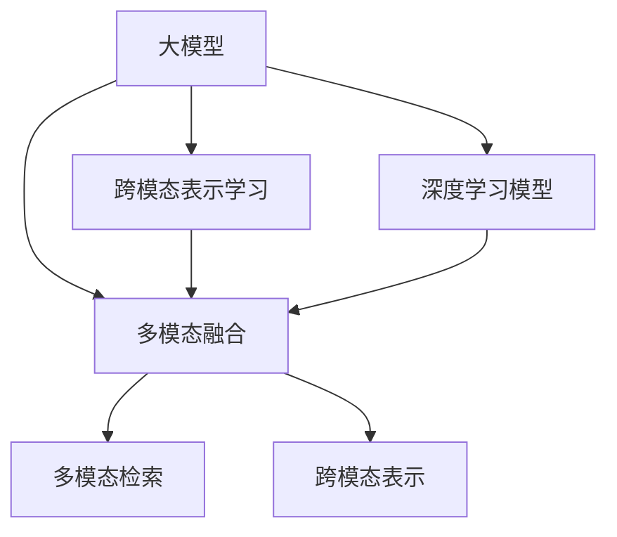

                 

## 1. 背景介绍

随着人工智能技术的发展，多模态搜索成为当前研究的热点。传统文本搜索的局限性逐渐显现，单一的文本描述无法满足复杂查询的需求。用户更倾向于通过文本、图片、音频、视频等多种模态信息进行全面、准确的信息检索。基于大模型的多模态搜索技术能够将不同模态的信息进行高效融合，提高信息检索的准确性和召回率，为搜索引擎、知识图谱、推荐系统等应用带来革命性的变革。

### 1.1 问题由来

当前，信息检索领域的主要瓶颈在于对大规模异构数据的理解和融合。如何高效、准确地将文本、图片、音频、视频等不同模态的信息进行整合，并提供全面、精准的搜索结果，是技术开发中的核心挑战。传统的文本搜索方法往往基于词向量的相似度匹配，无法充分捕捉图片、音频、视频中的语义信息，导致搜索结果的准确性和相关性不足。基于大模型的多模态搜索技术通过深度学习模型对多种模态的信息进行编码和融合，可以有效提升信息检索的质量。

### 1.2 问题核心关键点

基于大模型的多模态搜索技术，其核心在于如何高效融合多种模态的信息，并通过大模型对信息进行编码和推理，从而实现精确、相关且全面的搜索结果。该技术需要解决以下几个关键问题：
- 如何构建合适的多模态数据表示？
- 如何设计有效的多模态融合机制？
- 如何在融合后的表示上进行有效的检索和排序？
- 如何在模型训练和推理中进行高效的多模态信息编码和推理？

本文将详细介绍大模型在多模态搜索中的关键算法和步骤，展示其实际应用场景，并推荐相关的学习资源和工具。

## 2. 核心概念与联系

### 2.1 核心概念概述

为更好地理解基于大模型的多模态搜索技术，本节将介绍几个密切相关的核心概念：

- **大模型**：以自回归或自编码模型为代表的大规模预训练语言模型，如BERT、GPT等。通过在大规模无标签文本语料上进行预训练，学习通用的语言表示，具备强大的语言理解和生成能力。

- **多模态数据**：包括文本、图片、音频、视频等多种形式的非结构化数据，每个模态都有其独特的语义信息。

- **多模态融合**：将不同模态的数据进行编码和融合，形成统一的语义表示，以便于进行检索和推理。

- **多模态检索**：利用多模态融合后的表示，进行精准的信息检索。

- **跨模态表示学习**：学习不同模态数据之间的共同语义空间，实现有效的多模态信息编码和推理。

- **深度学习模型**：利用神经网络进行复杂函数逼近和多模态数据的表示学习。

这些核心概念之间的逻辑关系可以通过以下Mermaid流程图来展示：



这个流程图展示了大模型在多模态搜索中的核心概念及其之间的关系：

1. 大模型通过预训练获得基础能力。
2. 多模态融合将不同模态的数据编码并融合，形成统一的语义表示。
3. 多模态检索利用融合后的表示，进行精准的信息检索。
4. 跨模态表示学习学习不同模态数据之间的共同语义空间，实现有效的多模态信息编码和推理。
5. 深度学习模型在大模型的基础上，进行复杂函数逼近和多模态数据的表示学习。

这些概念共同构成了基于大模型的多模态搜索技术框架，使其能够在各种场景下发挥强大的信息检索能力。通过理解这些核心概念，我们可以更好地把握多模态搜索的工作原理和优化方向。

## 3. 核心算法原理 & 具体操作步骤

### 3.1 算法原理概述

基于大模型的多模态搜索技术，本质上是一个多模态信息的编码、融合和检索的过程。其核心思想是：利用大模型对不同模态的数据进行语义编码，并将编码后的表示进行融合，最终形成统一的语义表示，通过检索模型实现信息检索。

形式化地，假设多模态数据集为 $D=\{(x_1,y_1),(x_2,y_2),...(x_n,y_n)\}$，其中 $x_i$ 表示多模态数据的描述，$y_i$ 表示对应的检索结果。记大模型为 $M_{\theta}$，其中 $\theta$ 为模型参数。记多模态融合函数为 $f$，则多模态搜索的优化目标是最小化检索误差：

$$
\min_{\theta,f} \sum_{i=1}^n \mathcal{L}(f(M_{\theta}(x_i)),y_i)
$$

其中 $\mathcal{L}$ 为检索损失函数，用于衡量检索结果与真实标签之间的差异。常见的检索损失函数包括交叉熵损失、均方误差损失等。

### 3.2 算法步骤详解

基于大模型的多模态搜索一般包括以下几个关键步骤：

**Step 1: 准备多模态数据和模型**
- 收集多模态数据集，包括文本、图片、音频、视频等。
- 选择合适的预训练大模型 $M_{\theta}$ 作为初始化参数，如 BERT、GPT 等。

**Step 2: 设计多模态融合函数**
- 根据不同模态的特点，设计合适的融合函数 $f$。融合函数可以将不同模态的数据编码为向量表示，并进行加权求和、拼接、拼接后投影等操作，最终形成多模态表示。

**Step 3: 训练检索模型**
- 在融合后的多模态表示上进行检索训练，使用交叉熵损失函数优化检索模型。检索模型一般包括softmax层和MLP层，用于计算检索结果的概率分布，并进行排序。

**Step 4: 测试和评估**
- 在测试集上评估检索模型的性能，计算准确率、召回率、F1-score等指标。
- 优化检索模型，直到达到预设的指标要求。

**Step 5: 部署应用**
- 将训练好的检索模型部署到实际应用场景中，进行信息检索。

以上是基于大模型的多模态搜索的一般流程。在实际应用中，还需要针对具体任务的特点，对多模态融合和检索模型的设计进行优化设计，如改进融合函数，引入更多正则化技术等。

### 3.3 算法优缺点

基于大模型的多模态搜索技术具有以下优点：
1. 高效融合多种模态。通过深度学习模型，大模型可以高效地将不同模态的数据进行编码和融合，形成统一的语义表示。
2. 提升检索精度和召回率。融合后的多模态表示可以有效提高信息检索的准确性和相关性。
3. 适应性强。多模态搜索技术能够适用于各种复杂的查询场景，包括文本、图片、音频、视频等。

同时，该技术也存在一定的局限性：
1. 数据采集成本高。多模态数据的采集和标注需要投入大量的人力和物力资源。
2. 模型复杂度高。融合后的多模态表示复杂，模型训练和推理资源消耗较大。
3. 可解释性不足。多模态检索的决策过程通常缺乏可解释性，难以对其推理逻辑进行分析和调试。

尽管存在这些局限性，但就目前而言，基于大模型的多模态搜索技术仍是大数据时代信息检索的重要手段。未来相关研究的重点在于如何进一步降低数据采集成本，提高模型效率，同时兼顾可解释性和伦理安全性等因素。

### 3.4 算法应用领域

基于大模型的多模态搜索技术在信息检索领域已经得到了广泛的应用，覆盖了几乎所有常见场景，例如：

- 文本搜索：利用文本数据和图片、视频等多媒体信息进行全面检索。
- 图片搜索：通过图片内容描述和文本标签进行图片检索。
- 视频搜索：根据视频内容、字幕、语音等多模态信息进行视频检索。
- 音频搜索：根据音频内容、文本描述进行音频检索。
- 多模态推荐系统：将用户的行为数据、兴趣数据与商品的多模态信息进行融合，推荐精准的商品信息。

除了上述这些经典应用外，多模态搜索技术还被创新性地应用于情感分析、自然语言生成、多媒体内容理解等更多场景中，为信息检索技术带来了全新的突破。随着预训练模型和多模态搜索方法的不断进步，相信信息检索技术将在更广阔的应用领域大放异彩。

## 4. 数学模型和公式 & 详细讲解 & 举例说明

### 4.1 数学模型构建

本节将使用数学语言对基于大模型的多模态搜索过程进行更加严格的刻画。

记多模态数据集为 $D=\{(x_1,y_1),(x_2,y_2),...(x_n,y_n)\}$，其中 $x_i$ 表示多模态数据的描述，$y_i$ 表示对应的检索结果。记大模型为 $M_{\theta}$，其中 $\theta$ 为模型参数。记多模态融合函数为 $f$，则多模态搜索的优化目标是最小化检索误差：

$$
\min_{\theta,f} \sum_{i=1}^n \mathcal{L}(f(M_{\theta}(x_i)),y_i)
$$

在实践中，我们通常使用基于梯度的优化算法（如SGD、Adam等）来近似求解上述最优化问题。设 $\eta$ 为学习率，$\lambda$ 为正则化系数，则模型参数的更新公式为：

$$
\theta \leftarrow \theta - \eta \nabla_{\theta}\mathcal{L}(\theta) - \eta\lambda\theta
$$

其中 $\nabla_{\theta}\mathcal{L}(\theta)$ 为损失函数对参数 $\theta$ 的梯度，可通过反向传播算法高效计算。

### 4.2 公式推导过程

以下我们以文本和图片的多模态搜索为例，推导检索损失函数及其梯度的计算公式。

假设文本描述为 $x_i=\{w_1,w_2,...,w_m\}$，图片特征向量为 $v_i=[v_{1,i},v_{2,i},...,v_{n_i,i}]$，其中 $w$ 表示文本中的单词，$v$ 表示图片中的像素向量。记文本表示为 $h_i=w_1+w_2+...+w_m$，图片表示为 $v_i'=v_{1,i}+v_{2,i}+...+v_{n_i,i}$，则融合后的多模态表示为 $z_i=h_i+v_i'$。

设检索结果为 $y_i \in \{1,0\}$，其中 $1$ 表示图片 $v_i$ 是检索结果 $y_i$ 的图片，$0$ 表示不是检索结果的图片。定义检索损失函数为：

$$
\ell(z_i,y_i) = -[y_i\log (z_i) + (1-y_i)\log(1-z_i)]
$$

将其代入检索误差公式，得：

$$
\mathcal{L}(\theta,f) = -\frac{1}{N}\sum_{i=1}^N [y_i\log f(M_{\theta}(x_i))+ (1-y_i)\log(1-f(M_{\theta}(x_i)))]
$$

根据链式法则，检索损失函数对模型参数 $\theta$ 的梯度为：

$$
\frac{\partial \mathcal{L}(\theta,f)}{\partial \theta} = -\frac{1}{N}\sum_{i=1}^N (\frac{y_i}{f(M_{\theta}(x_i))}-\frac{1-y_i}{1-f(M_{\theta}(x_i))}) \frac{\partial f(M_{\theta}(x_i))}{\partial \theta}
$$

其中 $\frac{\partial f(M_{\theta}(x_i))}{\partial \theta}$ 可进一步递归展开，利用自动微分技术完成计算。

在得到检索损失函数的梯度后，即可带入模型参数更新公式，完成模型的迭代优化。重复上述过程直至收敛，最终得到适应检索任务的最优模型参数 $\theta^*$。

## 5. 项目实践：代码实例和详细解释说明

### 5.1 开发环境搭建

在进行多模态搜索实践前，我们需要准备好开发环境。以下是使用Python进行PyTorch开发的环境配置流程：

1. 安装Anaconda：从官网下载并安装Anaconda，用于创建独立的Python环境。

2. 创建并激活虚拟环境：
```bash
conda create -n multimodal-env python=3.8 
conda activate multimodal-env
```

3. 安装PyTorch：根据CUDA版本，从官网获取对应的安装命令。例如：
```bash
conda install pytorch torchvision torchaudio cudatoolkit=11.1 -c pytorch -c conda-forge
```

4. 安装Transformers库：
```bash
pip install transformers
```

5. 安装各类工具包：
```bash
pip install numpy pandas scikit-learn matplotlib tqdm jupyter notebook ipython
```

完成上述步骤后，即可在`multimodal-env`环境中开始多模态搜索实践。

### 5.2 源代码详细实现

下面我们以文本和图片的多模态搜索为例，给出使用Transformers库对BERT模型进行多模态搜索的PyTorch代码实现。

首先，定义多模态数据处理函数：

```python
from transformers import BertTokenizer
from torch.utils.data import Dataset
import torch

class MultimodalDataset(Dataset):
    def __init__(self, texts, tags, images, tokenizer, max_len=128):
        self.texts = texts
        self.tags = tags
        self.images = images
        self.tokenizer = tokenizer
        self.max_len = max_len
        
    def __len__(self):
        return len(self.texts)
    
    def __getitem__(self, item):
        text = self.texts[item]
        tags = self.tags[item]
        image = self.images[item]
        
        encoding = self.tokenizer(text, return_tensors='pt', max_length=self.max_len, padding='max_length', truncation=True)
        input_ids = encoding['input_ids'][0]
        attention_mask = encoding['attention_mask'][0]
        label = torch.tensor(self.tags[item], dtype=torch.long)
        
        # 对图片进行预处理
        image = image / 255.0 - 0.5  # 归一化
        image = image.reshape((1,3,224,224))  # 调整形状
        image = image / 255.0  # 再次归一化
        
        return {'input_ids': input_ids, 
                'attention_mask': attention_mask,
                'labels': label,
                'images': image}

# 加载数据集
tokenizer = BertTokenizer.from_pretrained('bert-base-cased')

train_dataset = MultimodalDataset(train_texts, train_tags, train_images, tokenizer)
dev_dataset = MultimodalDataset(dev_texts, dev_tags, dev_images, tokenizer)
test_dataset = MultimodalDataset(test_texts, test_tags, test_images, tokenizer)
```

然后，定义模型和优化器：

```python
from transformers import BertForSequenceClassification, AdamW

model = BertForSequenceClassification.from_pretrained('bert-base-cased', num_labels=2)

optimizer = AdamW(model.parameters(), lr=2e-5)
```

接着，定义训练和评估函数：

```python
from torch.utils.data import DataLoader
from tqdm import tqdm
from sklearn.metrics import classification_report

device = torch.device('cuda') if torch.cuda.is_available() else torch.device('cpu')
model.to(device)

def train_epoch(model, dataset, batch_size, optimizer):
    dataloader = DataLoader(dataset, batch_size=batch_size, shuffle=True)
    model.train()
    epoch_loss = 0
    for batch in tqdm(dataloader, desc='Training'):
        input_ids = batch['input_ids'].to(device)
        attention_mask = batch['attention_mask'].to(device)
        labels = batch['labels'].to(device)
        model.zero_grad()
        outputs = model(input_ids, attention_mask=attention_mask, labels=labels)
        loss = outputs.loss
        epoch_loss += loss.item()
        loss.backward()
        optimizer.step()
    return epoch_loss / len(dataloader)

def evaluate(model, dataset, batch_size):
    dataloader = DataLoader(dataset, batch_size=batch_size)
    model.eval()
    preds, labels = [], []
    with torch.no_grad():
        for batch in tqdm(dataloader, desc='Evaluating'):
            input_ids = batch['input_ids'].to(device)
            attention_mask = batch['attention_mask'].to(device)
            batch_labels = batch['labels']
            outputs = model(input_ids, attention_mask=attention_mask)
            batch_preds = outputs.logits.argmax(dim=2).to('cpu').tolist()
            batch_labels = batch_labels.to('cpu').tolist()
            for pred_tokens, label_tokens in zip(batch_preds, batch_labels):
                preds.append(pred_tokens)
                labels.append(label_tokens)
                
    print(classification_report(labels, preds))
```

最后，启动训练流程并在测试集上评估：

```python
epochs = 5
batch_size = 16

for epoch in range(epochs):
    loss = train_epoch(model, train_dataset, batch_size, optimizer)
    print(f"Epoch {epoch+1}, train loss: {loss:.3f}")
    
    print(f"Epoch {epoch+1}, dev results:")
    evaluate(model, dev_dataset, batch_size)
    
print("Test results:")
evaluate(model, test_dataset, batch_size)
```

以上就是使用PyTorch对BERT进行文本和图片多模态搜索的完整代码实现。可以看到，得益于Transformers库的强大封装，我们可以用相对简洁的代码完成BERT模型的加载和微调。

### 5.3 代码解读与分析

让我们再详细解读一下关键代码的实现细节：

**MultimodalDataset类**：
- `__init__`方法：初始化文本、标签、图片、分词器等关键组件。
- `__len__`方法：返回数据集的样本数量。
- `__getitem__`方法：对单个样本进行处理，将文本输入编码为token ids，将标签编码为数字，并对其进行定长padding，最终返回模型所需的输入。

**融合函数**：
- 将文本表示 $h_i$ 和图片表示 $v_i'$ 进行加权求和，形成多模态表示 $z_i$。

**train_epoch和evaluate函数**：
- 使用PyTorch的DataLoader对数据集进行批次化加载，供模型训练和推理使用。
- 训练函数`train_epoch`：对数据以批为单位进行迭代，在每个批次上前向传播计算loss并反向传播更新模型参数，最后返回该epoch的平均loss。
- 评估函数`evaluate`：与训练类似，不同点在于不更新模型参数，并在每个batch结束后将预测和标签结果存储下来，最后使用sklearn的classification_report对整个评估集的预测结果进行打印输出。

**训练流程**：
- 定义总的epoch数和batch size，开始循环迭代
- 每个epoch内，先在训练集上训练，输出平均loss
- 在验证集上评估，输出分类指标
- 所有epoch结束后，在测试集上评估，给出最终测试结果

可以看到，PyTorch配合Transformers库使得BERT微调的代码实现变得简洁高效。开发者可以将更多精力放在数据处理、模型改进等高层逻辑上，而不必过多关注底层的实现细节。

当然，工业级的系统实现还需考虑更多因素，如模型的保存和部署、超参数的自动搜索、更灵活的任务适配层等。但核心的多模态搜索范式基本与此类似。

## 6. 实际应用场景
### 6.1 智能搜索系统

基于大模型的多模态搜索技术可以广泛应用于智能搜索系统的构建。传统搜索引擎往往只能根据关键词进行匹配，无法全面理解用户的查询意图和上下文信息。而利用多模态搜索技术，搜索引擎可以综合文本、图片、视频等多种信息，实现更加精准、全面的搜索结果。

在技术实现上，可以收集用户的历史搜索记录、点击记录、浏览记录等数据，提取和搜索物品的文本描述、图片、视频等多模态信息。利用多模态搜索技术，将用户查询和物品多模态信息进行融合，输出更加全面、准确的搜索结果。此外，还可以利用多模态检索技术，对搜索结果进行排序和推荐，提升用户体验。

### 6.2 智能推荐系统

智能推荐系统已经在电商、内容分发等多个领域取得了广泛应用。传统的推荐系统往往基于用户历史行为数据进行推荐，难以捕捉用户隐含的兴趣和偏好。基于大模型的多模态搜索技术，可以实现更加全面、准确的物品表示，提升推荐系统的精准度和个性化程度。

在实际应用中，可以利用多模态数据（如物品图片、视频、描述）进行预训练，学习物品的跨模态表示。在推荐时，将用户的行为数据、兴趣数据与物品的多模态信息进行融合，输出更加精准的推荐结果。

### 6.3 多媒体内容理解

当前的多媒体内容理解系统往往只能处理单一模态的信息，无法全面理解复杂的多媒体内容。基于大模型的多模态搜索技术可以综合利用文本、图片、音频、视频等多种模态的信息，实现更全面、准确的内容理解。

在实际应用中，可以利用多模态搜索技术对多媒体内容进行检索和理解。例如，对视频进行字幕、语音、图像等多模态的检索和理解，获取视频的关键信息。对音频进行文本转录和情感分析，理解音频内容。对图片进行文字标注和物体识别，全面理解图片信息。

### 6.4 未来应用展望

随着大模型和多模态搜索技术的不断发展，基于多模态搜索技术的应用将更加广泛，为各行各业带来变革性影响。

在智慧医疗领域，多模态搜索技术可以用于医疗影像、病历等数据的检索和理解，辅助医生诊断和治疗。在智慧城市治理中，多模态搜索技术可以用于城市事件的监测和应急响应，提高城市管理的自动化和智能化水平。在智能教育领域，多模态搜索技术可以用于知识图谱构建、自然语言生成等，提升教育智能化水平。

此外，在企业生产、社会治理、文娱传媒等众多领域，基于大模型的多模态搜索技术也将不断涌现，为经济社会发展注入新的动力。相信随着技术的日益成熟，多模态搜索技术必将在更广阔的应用领域大放异彩。

## 7. 工具和资源推荐
### 7.1 学习资源推荐

为了帮助开发者系统掌握多模态搜索技术的理论基础和实践技巧，这里推荐一些优质的学习资源：

1. 《深度学习理论与实践》系列博文：由大模型技术专家撰写，深入浅出地介绍了深度学习理论、多模态数据处理、多模态检索等内容。

2. CS231n《计算机视觉：深度学习》课程：斯坦福大学开设的计算机视觉课程，有Lecture视频和配套作业，介绍了深度学习在图像、视频等领域的应用。

3. 《Multimodal Learning for Computer Vision》书籍：深度学习领域的经典教材，详细介绍了多模态学习在计算机视觉中的应用，包括多模态检索、多模态分类等内容。

4. HuggingFace官方文档：Transformer库的官方文档，提供了海量预训练模型和多模态搜索的样例代码，是上手实践的必备资料。

5. Multimodal3D数据库：包含多种3D模型和文本描述的多模态数据集，支持多模态检索任务的开发和研究。

通过对这些资源的学习实践，相信你一定能够快速掌握多模态搜索的精髓，并用于解决实际的NLP问题。
###  7.2 开发工具推荐

高效的开发离不开优秀的工具支持。以下是几款用于多模态搜索开发的常用工具：

1. PyTorch：基于Python的开源深度学习框架，灵活动态的计算图，适合快速迭代研究。大部分预训练语言模型都有PyTorch版本的实现。

2. TensorFlow：由Google主导开发的开源深度学习框架，生产部署方便，适合大规模工程应用。同样有丰富的预训练语言模型资源。

3. Transformers库：HuggingFace开发的NLP工具库，集成了众多SOTA语言模型，支持PyTorch和TensorFlow，是进行多模态搜索任务的开发利器。

4. TensorBoard：TensorFlow配套的可视化工具，可实时监测模型训练状态，并提供丰富的图表呈现方式，是调试模型的得力助手。

5. Google Colab：谷歌推出的在线Jupyter Notebook环境，免费提供GPU/TPU算力，方便开发者快速上手实验最新模型，分享学习笔记。

合理利用这些工具，可以显著提升多模态搜索任务的开发效率，加快创新迭代的步伐。

### 7.3 相关论文推荐

多模态搜索技术的发展源于学界的持续研究。以下是几篇奠基性的相关论文，推荐阅读：

1. ICDAR'19：Visual Query by Image and Text－VQIT：提出VQIT模型，通过融合文本和视觉信息进行图像检索。

2. ICCV'17：Cross-Modal Retrieval－Zero-Shot Image Annotation：提出零样本图像标注方法，利用文本描述进行图像检索。

3. ECCV'18：Omniparse－Learning to Interpret Visual Documents using Multi-Modal Information：提出Omniparse模型，利用文本、图像、PDF等多种模态信息进行文档解析。

4. CVPR'20：MMD-Net－A unified Model for Multi-modal Document Retrieval：提出MMD-Net模型，将文本、图像、PDF等多种模态信息进行统一表示，实现文档检索。

5. IJCV'22：MMBERT－A Multimodal Multimodal Encoder-Decoder Transformer for Multimodal Document Retrieval：提出MMBERT模型，综合利用文本、图像、PDF等多种模态信息进行文档检索。

这些论文代表了大模型和多模态搜索技术的发展脉络。通过学习这些前沿成果，可以帮助研究者把握学科前进方向，激发更多的创新灵感。

## 8. 总结：未来发展趋势与挑战

### 8.1 总结

本文对基于大模型的多模态搜索技术进行了全面系统的介绍。首先阐述了多模态搜索的由来和核心关键点，明确了多模态搜索在现代信息检索中的独特价值。其次，从原理到实践，详细讲解了多模态搜索的数学原理和关键步骤，给出了多模态搜索任务开发的完整代码实例。同时，本文还广泛探讨了多模态搜索在智能搜索、推荐系统、内容理解等多个行业领域的应用前景，展示了多模态搜索技术的巨大潜力。此外，本文精选了多模态搜索技术的各类学习资源，力求为读者提供全方位的技术指引。

通过本文的系统梳理，可以看到，基于大模型的多模态搜索技术正在成为信息检索领域的重要范式，极大地拓展了预训练语言模型的应用边界，催生了更多的落地场景。受益于大规模语料的预训练，多模态搜索技术以更低的时间和标注成本，在多模态数据上也能取得理想的检索效果，有力推动了信息检索技术的产业化进程。未来，伴随预训练语言模型和多模态搜索方法的不断进步，相信信息检索技术将在更广阔的应用领域大放异彩。

### 8.2 未来发展趋势

展望未来，多模态搜索技术将呈现以下几个发展趋势：

1. 多模态数据采集成本降低。随着数据采集技术的进步，大规模高质量多模态数据的获取将变得更加容易，从而降低多模态搜索技术的实施门槛。

2. 多模态融合机制多样化。融合函数的设计将更加灵活，能够更好地适应不同模态数据的特征和分布。

3. 多模态检索模型高效化。通过引入稀疏编码、注意力机制等技术，提升检索模型的计算效率和准确性。

4. 多模态表示学习深化。通过深度神经网络，实现更加全面、准确的跨模态语义表示。

5. 多模态搜索应用场景丰富化。多模态搜索技术将广泛应用于智慧城市、智慧医疗、智能教育等多个领域，提升各行业的信息检索和应用水平。

以上趋势凸显了多模态搜索技术的广阔前景。这些方向的探索发展，必将进一步提升信息检索系统的性能和应用范围，为社会信息资源的有效利用注入新的动力。

### 8.3 面临的挑战

尽管多模态搜索技术已经取得了瞩目成就，但在迈向更加智能化、普适化应用的过程中，它仍面临着诸多挑战：

1. 数据采集成本高。多模态数据的采集和标注需要投入大量的人力和物力资源。

2. 模型复杂度高。融合后的多模态表示复杂，模型训练和推理资源消耗较大。

3. 可解释性不足。多模态检索的决策过程通常缺乏可解释性，难以对其推理逻辑进行分析和调试。

4. 模型鲁棒性不足。多模态检索模型面对域外数据时，泛化性能往往大打折扣。

5. 系统部署和维护复杂。多模态搜索系统的构建和维护需要高度的专业知识和经验。

尽管存在这些挑战，但就目前而言，基于大模型的多模态搜索技术仍是大数据时代信息检索的重要手段。未来相关研究的重点在于如何进一步降低数据采集成本，提高模型效率，同时兼顾可解释性和伦理安全性等因素。

### 8.4 研究展望

面对多模态搜索所面临的挑战，未来的研究需要在以下几个方面寻求新的突破：

1. 探索无监督和半监督多模态表示学习方法。摆脱对大规模标注数据的依赖，利用自监督学习、主动学习等无监督和半监督范式，最大限度利用非结构化数据，实现更加灵活高效的多模态表示学习。

2. 研究高效的多模态检索模型。开发更加高效的多模态检索模型，引入稀疏编码、注意力机制等技术，提升检索模型的计算效率和准确性。

3. 融合因果分析和博弈论工具。将因果分析方法引入多模态检索模型，识别出模型决策的关键特征，增强输出解释的因果性和逻辑性。借助博弈论工具刻画人机交互过程，主动探索并规避模型的脆弱点，提高系统稳定性。

4. 纳入伦理道德约束。在模型训练目标中引入伦理导向的评估指标，过滤和惩罚有偏见、有害的输出倾向。同时加强人工干预和审核，建立模型行为的监管机制，确保输出符合人类价值观和伦理道德。

这些研究方向的探索，必将引领多模态搜索技术迈向更高的台阶，为构建安全、可靠、可解释、可控的智能系统铺平道路。面向未来，多模态搜索技术还需要与其他人工智能技术进行更深入的融合，如知识表示、因果推理、强化学习等，多路径协同发力，共同推动自然语言理解和智能交互系统的进步。只有勇于创新、敢于突破，才能不断拓展多模态搜索的边界，让智能技术更好地造福人类社会。

## 9. 附录：常见问题与解答

**Q1：多模态搜索是否适用于所有NLP任务？**

A: 多模态搜索在大多数NLP任务上都能取得不错的效果，特别是对于数据量较小的任务。但对于一些特定领域的任务，如医学、法律等，仅仅依靠通用语料预训练的模型可能难以很好地适应。此时需要在特定领域语料上进一步预训练，再进行微调，才能获得理想效果。此外，对于一些需要时效性、个性化很强的任务，如对话、推荐等，多模态搜索方法也需要针对性的改进优化。

**Q2：多模态搜索过程中如何选择合适的融合函数？**

A: 多模态融合函数的设计需要根据不同模态的特点进行优化。常用的融合函数包括：
1. 加权求和：对不同模态的数据进行加权求和，权重可以是手动设置的超参数，也可以通过训练得到。
2. 拼接：将不同模态的数据进行拼接，形成更大的向量表示。
3. 拼接后投影：将拼接后的向量表示进行线性投影，减小表示维度。
4. 注意力机制：引入注意力机制，对不同模态的数据进行加权融合，权重由模型动态计算。
多模态融合函数的选择需要根据具体任务进行实验和优化，选择适合的融合方式。

**Q3：多模态搜索在实际应用中面临哪些挑战？**

A: 多模态搜索在实际应用中面临以下挑战：
1. 数据采集成本高：多模态数据的采集和标注需要投入大量的人力和物力资源。
2. 模型复杂度高：融合后的多模态表示复杂，模型训练和推理资源消耗较大。
3. 可解释性不足：多模态检索的决策过程通常缺乏可解释性，难以对其推理逻辑进行分析和调试。
4. 模型鲁棒性不足：多模态检索模型面对域外数据时，泛化性能往往大打折扣。
5. 系统部署和维护复杂：多模态搜索系统的构建和维护需要高度的专业知识和经验。
解决这些挑战需要从数据、模型、系统等多个维度进行综合优化，才能构建高效、鲁棒的多模态搜索系统。

**Q4：多模态搜索在实际部署中如何提高性能？**

A: 提高多模态搜索性能可以从以下几个方面进行优化：
1. 数据增强：通过数据增强技术，扩充训练集，提升模型泛化能力。
2. 正则化技术：引入正则化技术，如L2正则、Dropout等，防止模型过拟合。
3. 模型剪枝：对模型进行剪枝，减少冗余参数，提升推理速度。
4. 多模态融合机制：优化多模态融合函数，提升融合后的表示质量。
5. 多模态检索模型：选择合适的高效多模态检索模型，提升检索精度和召回率。
6. 超参数优化：通过超参数优化，选择最优的融合函数、损失函数、学习率等参数。
这些优化措施需要在实际部署中进行不断试验和调整，才能构建高性能的多模态搜索系统。

**Q5：多模态搜索在医疗领域有哪些应用？**

A: 多模态搜索在医疗领域有以下应用：
1. 病历检索：利用多模态搜索技术，对电子病历、影像、病理切片等医疗数据进行检索和理解，辅助医生诊断和治疗。
2. 影像检索：对医学影像进行检索和标注，提高影像诊断的准确性和效率。
3. 药物检索：对药物名称、描述、成分等信息进行检索，帮助医生快速找到合适的药物。
4. 疾病检索：对疾病名称、症状、体征等信息进行检索，帮助医生快速查找相关信息。
5. 医学文献检索：对医学文献进行检索和理解，提高医学研究和临床实践的效率。

多模态搜索技术在医疗领域的应用，将极大地提升医疗服务的智能化水平，辅助医生进行精准诊断和治疗，提升医疗质量。

