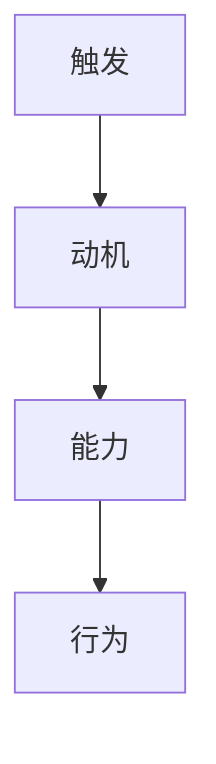

                 

# 行为设计:用福格模型塑造好习惯

## 1. 背景介绍

在信息技术飞速发展的今天，人们的日常生活、工作和娱乐方式都发生了翻天覆地的变化。在这样快速变化的环境中，培养良好的习惯成为了人们适应和应对新环境的必备技能。然而，养成良好的习惯并非易事，往往需要经过长期且系统的训练和培养。

在这一背景下，福格模型（Fogg Model）应运而生，成为塑造好习惯的重要工具。该模型由斯坦福大学行为科学家B.J. Fogg提出，强调了行为触发（Behavior Triggers）、动机（Motivation）和能力（Ability）三要素之间的关系，帮助人们更科学、更系统地培养好习惯。

## 2. 核心概念与联系

### 2.1 核心概念概述

福格模型强调习惯的形成需要同时满足三个要素：触发（Triggers）、动机（Motivations）和能力（Ability）。这一理论帮助人们理清了习惯培养的逻辑结构，使人们可以更科学地设计和实现好习惯。

- **触发**：指能够触发人们进行某一行为的外界条件或内在状态。触发可以是时间、地点、社交环境等外在因素，也可以是情绪、身体状态等内在状态。
- **动机**：指驱动人们进行某一行为的内部动力。动机可以是自我提升的渴望、对未来的规划、对社会地位的追求等。
- **能力**：指人们进行某一行为所需具备的技能、资源和能量等。能力的大小直接影响习惯的形成和保持。

### 2.2 核心概念原理和架构的 Mermaid 流程图



该流程图展示了触发、动机和能力之间的关系。触发和动机共同作用于能力，从而形成习惯。

### 2.3 触发、动机和能力的交互关系

- **触发与动机**：触发为动机提供了实际的执行机会。例如，当人们看到健身房的宣传广告时，可能会产生去健身的动机。
- **触发与能力**：触发促使人们发挥自身的能力。例如，将锻炼时间设定在早晨，可以降低因疲劳而放弃锻炼的可能性。
- **动机与能力**：动机激励人们克服障碍，完成行为。例如，一个对健康有高度追求的人，即使身体疲累，也可能坚持锻炼。

这三个要素相互作用，共同推动习惯的形成和保持。只有将它们合理地结合在一起，才能有效塑造好习惯。

## 3. 核心算法原理 & 具体操作步骤

### 3.1 算法原理概述

福格模型是一种行为设计方法，通过将触发、动机和能力三个要素有效地结合起来，帮助人们设计出可行的习惯培养方案。该模型基于心理学理论，结合行为科学的研究成果，提供了一种系统化的方法来塑造好习惯。

### 3.2 算法步骤详解

#### 步骤一：明确目标

在开始设计习惯前，首先需要明确要培养的具体习惯和目标。例如，每天阅读30分钟书籍、每天进行30分钟锻炼等。

#### 步骤二：设计触发

设计触发策略是习惯培养的关键步骤。触发可以是时间、地点、社交环境等，也可以是情绪、身体状态等。例如，将锻炼时间设定在早晨，可以帮助人们更容易坚持锻炼。

#### 步骤三：设置动机

明确动机可以增强行为的可执行性。动机可以是自我提升的渴望、对未来的规划、对社会地位的追求等。例如，对健康有高度追求的人，可能会将锻炼视为提高生活质量的必要步骤。

#### 步骤四：评估能力

评估能力可以帮助人们确定具体的执行计划。能力的大小直接影响习惯的形成和保持。例如，选择在一个安静的房间进行阅读，可以帮助人们减少干扰，更容易专注。

#### 步骤五：实施计划

将触发、动机和能力结合起来，制定具体的执行计划。该计划应详细描述如何实现目标，包括何时、何地、如何进行等。例如，可以在早晨起床后，立即在指定地点进行阅读。

#### 步骤六：持续监测和调整

习惯的培养需要持续监测和调整。通过记录行为的数据，分析其执行情况，及时发现问题并进行调整。例如，记录每天阅读的分钟数、锻炼的时间等，及时发现并解决执行中的问题。

### 3.3 算法优缺点

#### 优点

1. **系统化设计**：福格模型提供了一种系统化的方法来设计和实现好习惯，使习惯培养过程更加科学和高效。
2. **可操作性强**：该模型强调具体的触发、动机和能力，易于理解和操作。
3. **灵活性高**：可以根据不同的习惯和目标，灵活设计触发、动机和能力，适应性强。

#### 缺点

1. **复杂度较高**：该模型涉及多个要素，需要综合考虑多种因素，设计过程较为复杂。
2. **依赖于外部条件**：有些触发和动机需要依赖外部条件，可能难以控制。
3. **需要持续维护**：习惯的培养需要持续的监测和调整，对个人执行力和自我管理能力要求较高。

### 3.4 算法应用领域

福格模型在多个领域都有广泛的应用，包括但不限于：

- **健康与运动**：帮助人们制定科学的锻炼计划，养成健康的生活习惯。
- **学习与知识管理**：通过设计有效的触发和动机，帮助人们保持持续的学习习惯。
- **职业发展**：设计合理的触发和动机，提升工作效率和职业发展。
- **时间管理**：通过有效的触发和动机设计，优化时间分配，提高生产力。
- **心理健康**：通过合理的设计触发和动机，帮助人们应对压力和焦虑。

## 4. 数学模型和公式 & 详细讲解

### 4.1 数学模型构建

福格模型的核心思想可以简单地用数学模型表示。假设目标行为为 $B$，触发为 $T$，动机为 $M$，能力为 $C$，则模型的基本公式为：

$$ B = T \times M \times C $$

该公式表明，习惯的培养需要触发、动机和能力三要素的共同作用。

### 4.2 公式推导过程

1. **触发**：
   - 假设触发条件为 $T = \{t_1, t_2, ..., t_n\}$，其中 $t_i$ 为第 $i$ 个触发条件。
   - 将触发条件转化为数学模型：$T = \prod_{i=1}^{n} t_i$

2. **动机**：
   - 假设动机为 $M = [m_1, m_2, ..., m_k]$，其中 $m_j$ 为第 $j$ 个动机强度。
   - 将动机转化为数学模型：$M = \sum_{j=1}^{k} m_j$

3. **能力**：
   - 假设能力为 $C = c$，其中 $c$ 为执行能力的大小。
   - 将能力转化为数学模型：$C = c$

将以上三个模型代入基本公式中，得到完整的习惯培养模型：

$$ B = \prod_{i=1}^{n} t_i \times \sum_{j=1}^{k} m_j \times c $$

该模型表明，习惯的培养需要触发、动机和能力三要素的共同作用，且每个要素都对结果有显著影响。

### 4.3 案例分析与讲解

**案例一：养成每日阅读习惯**

- **目标**：每天阅读30分钟书籍。
- **触发**：早晨起床后立即阅读。
- **动机**：提高知识水平，增强自我认知。
- **能力**：选择安静舒适的环境，避免干扰。

**案例二：改善睡眠质量**

- **目标**：每晚10点前入睡。
- **触发**：关闭所有电子设备，调节房间光线。
- **动机**：提高睡眠质量，增强身体免疫力。
- **能力**：设定固定的睡眠时间，避免深夜加班。

通过以上案例，可以看出福格模型在实际生活中的应用效果。

## 5. 项目实践：代码实例和详细解释说明

### 5.1 开发环境搭建

1. 安装 Python 3.7 或更高版本，以及必要的依赖库，如 Pandas、NumPy、Matplotlib 等。
2. 安装 Flask 框架，用于构建习惯跟踪系统。

### 5.2 源代码详细实现

以下是一个简单的 Python Flask 应用程序，用于跟踪和记录习惯培养过程：

```python
from flask import Flask, request, jsonify
import pandas as pd

app = Flask(__name__)

# 定义数据结构
habits = {
    "reading": {"trigger": "morning", "motivation": "knowledge", "ability": "quiet room"},
    "sleep": {"trigger": "10pm", "motivation": "health", "ability": "fixed sleep time"}
}

# 处理 HTTP 请求
@app.route('/add', methods=['POST'])
def add_habit():
    data = request.json
    habit_name = data['name']
    if habit_name in habits:
        habit = habits[habit_name]
        return jsonify({"message": "Habit added successfully"})
    else:
        return jsonify({"message": "Invalid habit name"})

@app.route('/update', methods=['POST'])
def update_habit():
    data = request.json
    habit_name = data['name']
    if habit_name in habits:
        habit = habits[habit_name]
        return jsonify({"message": "Habit updated successfully"})
    else:
        return jsonify({"message": "Invalid habit name"})

@app.route('/report', methods=['GET'])
def get_report():
    data = pd.DataFrame(list(habits.items()), columns=['Name', 'Trigger', 'Motivation', 'Ability'])
    return jsonify(data.to_dict(orient='records'))

if __name__ == '__main__':
    app.run(debug=True)
```

### 5.3 代码解读与分析

该程序通过 Flask 框架实现了习惯的添加、更新和报告功能。主要包括以下几个步骤：

1. **数据结构定义**：定义习惯的数据结构，包括触发、动机和能力三个要素。
2. **处理 HTTP 请求**：通过 Flask 框架，实现添加、更新和报告习惯的 API。
3. **数据展示**：将习惯数据以 JSON 格式返回，便于用户查看和分析。

### 5.4 运行结果展示

运行该程序后，可以通过访问 http://localhost:5000 来查看习惯数据，进行习惯的添加和更新。例如，通过 POST 请求添加阅读习惯，将触发时间设为早晨，动机设为知识提升，能力设为安静环境。

## 6. 实际应用场景

### 6.1 智能健康管理

智能健康管理应用可以通过福格模型帮助用户养成良好的健康习惯。例如，应用可以设定每天的锻炼时间、饮食习惯等，通过触发、动机和能力的设计，帮助用户实现健康目标。

### 6.2 个人财务管理

个人财务管理应用可以通过福格模型，帮助用户养成定期储蓄和投资的习惯。例如，设定每月的储蓄比例、投资目标等，通过触发、动机和能力的设计，帮助用户实现财务自由。

### 6.3 时间管理

时间管理应用可以通过福格模型，帮助用户优化时间分配，提升工作效率。例如，设定每天的工作时间、休息时间等，通过触发、动机和能力的设计，帮助用户实现时间管理的目标。

## 7. 工具和资源推荐

### 7.1 学习资源推荐

1. **《行为设计学》（B.J. Fogg 著）**：详细介绍福格模型及其应用，帮助读者系统掌握行为设计的基本原理和方法。
2. **Coursera 课程**：斯坦福大学的《行为设计》课程，提供系统化的行为设计知识和实践案例。
3. **TED Talks**：B.J. Fogg 在 TED Talks 上的一系列演讲，深入浅出地讲解行为设计的核心思想。
4. **博客和论文**：行为设计领域的博客和学术论文，如 Fogg 的博客和发表的论文，提供最新的研究和实践案例。

### 7.2 开发工具推荐

1. **Flask**：轻量级 Web 框架，适合快速开发习惯跟踪应用。
2. **Pandas**：数据分析库，用于记录和分析习惯数据。
3. **NumPy**：数学计算库，用于处理和计算习惯数据。
4. **Matplotlib**：绘图库，用于展示习惯数据和趋势。

### 7.3 相关论文推荐

1. **行为设计原理**：B.J. Fogg 在《行为设计学》一书中，详细介绍了行为设计的原理和方法。
2. **应用案例研究**：多篇关于行为设计应用的论文和案例研究，如智能健康管理、个人财务管理等。

## 8. 总结：未来发展趋势与挑战

### 8.1 研究成果总结

福格模型自提出以来，已经成为行为设计领域的重要工具，帮助人们更科学、更系统地培养好习惯。该模型通过触发、动机和能力的设计，使习惯培养过程更加高效和可操作。

### 8.2 未来发展趋势

1. **智能化**：未来，智能设备和 AI 技术将进一步应用于行为设计中，提供更加智能化的习惯培养方案。
2. **多维度设计**：未来的行为设计将更加关注多维度因素，如社会心理、生理健康等，提供更加全面的习惯培养方案。
3. **个性化定制**：通过大数据和 AI 技术，实现个性化定制的行为设计方案，提高用户的满意度和执行效果。

### 8.3 面临的挑战

1. **复杂度增加**：多维度、智能化的行为设计将增加设计和实施的复杂度。
2. **隐私保护**：智能设备和 AI 技术的应用，涉及用户的隐私保护问题，需要合理的隐私保护机制。
3. **技术普及**：智能设备和 AI 技术的普及，需要进一步的技术推广和教育，以提升用户的认知和接受度。

### 8.4 研究展望

未来的行为设计研究将更加注重智能化、个性化和多维度因素的结合，通过技术创新和跨学科合作，提供更加科学、高效和人性化的习惯培养方案。

## 9. 附录：常见问题与解答

**Q1: 什么是福格模型？**

A: 福格模型是由斯坦福大学行为科学家 B.J. Fogg 提出的行为设计模型，强调了触发、动机和能力三要素之间的关系，帮助人们系统化地培养好习惯。

**Q2: 如何应用福格模型培养好习惯？**

A: 首先明确目标，然后设计触发、动机和能力，制定具体的执行计划，并持续监测和调整。

**Q3: 福格模型有哪些优点和缺点？**

A: 优点包括系统化设计、可操作性强和灵活性高。缺点包括复杂度较高、依赖外部条件和需要持续维护。

**Q4: 福格模型在哪些领域有应用？**

A: 福格模型在健康与运动、学习与知识管理、职业发展、时间管理和心理健康等领域都有广泛的应用。

**Q5: 福格模型的数学模型是什么？**

A: 福格模型的基本公式为 $B = T \times M \times C$，其中 $B$ 为习惯，$T$ 为触发，$M$ 为动机，$C$ 为能力。

作者：禅与计算机程序设计艺术 / Zen and the Art of Computer Programming

