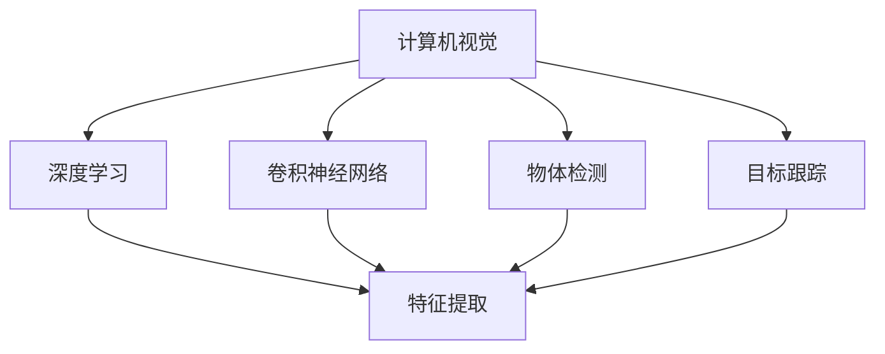

                 

## 1. 背景介绍

### 1.1 问题由来

随着全球零售市场的数字化转型加速，零售商们正面临着前所未有的竞争压力。一方面，客户需求日趋多样化，个性化需求日益显著；另一方面，运营成本不断上升，如何通过技术创新提升运营效率和客户体验，成为零售商们亟需解决的问题。

计算机视觉技术作为人工智能领域的核心技术之一，为零售业的智能化转型提供了有力的工具。通过视觉技术，零售商能够实现商品识别、库存管理、客户行为分析、营销决策支持等多方面的创新应用，极大地提升了运营效率和客户满意度。

### 1.2 问题核心关键点

计算机视觉在零售业的应用，关键在于其能够实现对视觉信息的自动化处理和分析。具体来说，以下关键点构成了计算机视觉技术在零售业中的创新应用基础：

- **商品识别**：自动检测和识别商品，实现快速盘点、库存管理和商品跟踪。
- **客户行为分析**：通过摄像头捕捉和分析客户行为数据，提升客户体验和运营效率。
- **营销决策支持**：利用视觉信息进行商品展示和广告优化，提高销售转化率。
- **质量检测**：通过视觉检测商品质量，减少次品流入市场。
- **个性化推荐**：分析客户视觉行为数据，提供个性化推荐，提升客户满意度。

### 1.3 问题研究意义

计算机视觉技术在零售业中的应用，具有以下几个重要意义：

1. **提高运营效率**：通过自动化视觉处理，减少人力成本，提高运营效率。
2. **提升客户体验**：通过实时分析客户行为，提供个性化服务，提升客户满意度。
3. **优化营销策略**：利用视觉数据优化商品展示和广告，提升营销效果。
4. **确保商品质量**：通过视觉检测，及时发现并解决商品质量问题。
5. **实现智能化转型**：计算机视觉技术是实现零售业智能化转型的重要手段，有助于构建智慧零售生态系统。

## 2. 核心概念与联系

### 2.1 核心概念概述

为更好地理解计算机视觉技术在零售业中的应用，本节将介绍几个关键概念及其相互联系：

- **计算机视觉**：指通过计算机处理视觉信息，实现自动化的视觉理解、分析和应用的技术。
- **深度学习**：计算机视觉的核心技术之一，通过多层神经网络模型对视觉数据进行复杂模式识别和特征学习。
- **卷积神经网络**：（Convolutional Neural Network, CNN），一种深度学习模型，特别适合处理图像和视频数据。
- **特征提取**：从原始视觉数据中提取出有意义的特征，用于后续的分类、检测等任务。
- **物体检测**：从图像或视频中自动检测出物体的位置和类别。
- **目标跟踪**：在视频中跟踪指定目标的运动轨迹，用于行为分析、监控等应用。

这些概念之间的逻辑关系可以通过以下Mermaid流程图来展示：



这个流程图展示了几大核心概念及其之间的关系：

1. 计算机视觉利用深度学习进行视觉理解。
2. 卷积神经网络是深度学习模型的重要组成部分。
3. 特征提取是计算机视觉任务的基础。
4. 物体检测和目标跟踪分别利用特征提取技术，实现对视觉数据的进一步处理和分析。

## 3. 核心算法原理 & 具体操作步骤
### 3.1 算法原理概述

计算机视觉在零售业的应用，主要依赖于深度学习模型的特征提取和分类能力。以下简要概述了其核心算法原理：

1. **数据准备**：收集并预处理零售环境中的视觉数据，包括商品图片、客户行为视频等。
2. **模型训练**：选择适当的深度学习模型（如卷积神经网络CNN），利用标注数据进行模型训练。
3. **特征提取**：在训练好的模型基础上，提取商品、客户行为等关键特征。
4. **任务执行**：利用提取的特征，执行商品识别、客户行为分析、营销决策支持等任务。

### 3.2 算法步骤详解

以下是计算机视觉在零售业中具体应用的算法步骤详解：

**Step 1: 数据收集与预处理**
- 收集零售环境中的视觉数据，如商品图片、客户行为视频等。
- 对数据进行预处理，包括去噪、裁剪、缩放、归一化等操作，确保数据质量。

**Step 2: 模型选择与训练**
- 选择合适的深度学习模型（如CNN）进行商品识别、客户行为分析等任务。
- 利用标注数据进行模型训练，优化模型参数。

**Step 3: 特征提取**
- 在训练好的模型基础上，提取商品、客户行为等关键特征。
- 使用特征提取算法（如SIFT、HOG）进行特征点检测和描述。

**Step 4: 任务执行**
- 利用提取的特征，执行商品识别、客户行为分析、营销决策支持等任务。
- 在执行任务时，可根据具体需求设计不同的模型结构和工作流程。

### 3.3 算法优缺点

计算机视觉在零售业的应用具有以下优点：

1. **高效准确**：深度学习模型具有强大的特征提取和分类能力，能够实现高效、准确的商品识别和行为分析。
2. **实时性**：通过摄像头捕捉实时数据，可以实现实时处理和决策。
3. **可扩展性强**：计算机视觉技术可以灵活应用到多种零售场景中，如自助结账、客户行为监测等。
4. **数据驱动**：通过分析大量视觉数据，可以获取有价值的业务洞察和决策支持。

同时，计算机视觉技术在零售业的应用也存在一些局限性：

1. **数据依赖**：需要大量高质量的标注数据进行模型训练，数据获取成本较高。
2. **环境复杂性**：零售环境光照、视角变化多样，可能影响模型的准确性。
3. **维护成本**：模型训练和维护需要专业知识，人力成本较高。
4. **隐私问题**：客户行为数据的采集和使用可能涉及隐私问题，需严格遵守法律法规。

### 3.4 算法应用领域

计算机视觉技术在零售业的应用领域广泛，涵盖商品管理、客户体验、营销策略等多个方面：

- **商品识别**：利用计算机视觉技术，自动检测和识别商品，实现快速盘点、库存管理和商品跟踪。
- **客户行为分析**：通过摄像头捕捉和分析客户行为数据，提升客户体验和运营效率。
- **营销决策支持**：利用视觉信息进行商品展示和广告优化，提高销售转化率。
- **质量检测**：通过视觉检测商品质量，减少次品流入市场。
- **个性化推荐**：分析客户视觉行为数据，提供个性化推荐，提升客户满意度。

## 4. 数学模型和公式 & 详细讲解 & 举例说明
### 4.1 数学模型构建

以下将详细构建计算机视觉在零售业中应用的数学模型：

- **目标检测模型**：以YOLO（You Only Look Once）模型为例，其核心思想是利用单阶段检测网络进行目标检测。模型的目标函数定义为：

$$
\mathcal{L}(\theta) = \frac{1}{N}\sum_{i=1}^N (L_{cls} + \lambda L_{reg})
$$

其中，$L_{cls}$ 为分类损失，$L_{reg}$ 为位置回归损失，$\lambda$ 为正则化系数。

- **行为分析模型**：以行为识别（Action Recognition）为例，其核心思想是通过卷积神经网络对行为视频进行分类。模型的目标函数定义为：

$$
\mathcal{L}(\theta) = \frac{1}{N}\sum_{i=1}^N \sum_{j=1}^C (L_{softmax}(y_i, \hat{y}_i))
$$

其中，$L_{softmax}$ 为softmax损失函数，$y_i$ 为真实标签，$\hat{y}_i$ 为模型预测。

### 4.2 公式推导过程

以下推导YOLO模型和行为识别模型的目标函数：

**YOLO目标函数**：

1. 定义分类损失：

$$
L_{cls} = -\frac{1}{N}\sum_{i=1}^N \sum_{j=1}^M \text{CE}(y_{i,j}, \hat{y}_{i,j})
$$

其中，$N$ 为样本数，$M$ 为类别数，$\text{CE}$ 为交叉熵损失函数。

2. 定义位置回归损失：

$$
L_{reg} = \frac{1}{N}\sum_{i=1}^N \sum_{j=1}^M \frac{1}{2} \| \hat{b}_{i,j} - b_{i,j} \|_2^2
$$

其中，$\hat{b}_{i,j}$ 为模型预测的回归值，$b_{i,j}$ 为真实值。

3. 综合目标函数：

$$
\mathcal{L}(\theta) = \frac{1}{N}\sum_{i=1}^N (L_{cls} + \lambda L_{reg})
$$

**行为识别目标函数**：

1. 定义softmax损失函数：

$$
L_{softmax}(y_i, \hat{y}_i) = -\sum_{j=1}^C y_{i,j} \log \hat{y}_{i,j}
$$

其中，$C$ 为类别数。

2. 综合目标函数：

$$
\mathcal{L}(\theta) = \frac{1}{N}\sum_{i=1}^N \sum_{j=1}^C (L_{softmax}(y_i, \hat{y}_i))
$$

### 4.3 案例分析与讲解

以一家大型连锁超市为例，分析计算机视觉技术在该超市的应用。

**场景1：商品识别**
- 超市利用计算机视觉技术，通过摄像头实时捕捉商品图片，识别商品种类、位置和数量，自动生成盘点清单。
- 具体实现过程如下：
  1. 收集商品图片，进行去噪、裁剪和归一化处理。
  2. 利用YOLO模型进行目标检测，提取商品位置和类别。
  3. 统计各商品数量，生成盘点清单。

**场景2：客户行为分析**
- 超市通过分析客户在店内的行为数据，提升客户体验和运营效率。
- 具体实现过程如下：
  1. 在超市入口和关键位置安装摄像头，捕捉客户行为视频。
  2. 利用行为识别模型，对视频进行分析，提取客户行为类别。
  3. 根据行为类别，调整货架布局、优化商品陈列，提升客户满意度。

**场景3：个性化推荐**
- 超市通过分析客户在店内的视觉行为数据，提供个性化推荐，提升销售转化率。
- 具体实现过程如下：
  1. 利用计算机视觉技术，捕捉客户浏览商品的视觉数据。
  2. 分析视觉数据，提取客户兴趣点。
  3. 根据兴趣点，提供个性化商品推荐。

## 5. 项目实践：代码实例和详细解释说明
### 5.1 开发环境搭建

在进行计算机视觉项目实践前，需要先准备好开发环境。以下是使用Python进行深度学习项目开发的常见环境配置流程：

1. 安装Anaconda：从官网下载并安装Anaconda，用于创建独立的Python环境。

2. 创建并激活虚拟环境：
```bash
conda create -n cv-env python=3.8 
conda activate cv-env
```

3. 安装深度学习框架：
```bash
conda install torch torchvision torchaudio numpy scipy cython 
```

4. 安装计算机视觉库：
```bash
pip install opencv-python pycocotools pytorch-scatter fvcore
```

5. 安装其他工具包：
```bash
pip install matplotlib Pillow tqdm jupyter notebook ipython
```

完成上述步骤后，即可在`cv-env`环境中开始项目实践。

### 5.2 源代码详细实现

下面以YOLO模型和行为识别模型为例，给出使用PyTorch进行计算机视觉任务开发的PyTorch代码实现。

**YOLO模型代码实现**：

```python
import torch
import torch.nn as nn
import torchvision.transforms as transforms
from yolov3_model import YOLOv3
from yolov3 import YOLOLoss
from dataset import CocoDataset

def train_model(model, dataloader, optimizer, epochs, device):
    model.train()
    criterion = YOLOLoss()
    for epoch in range(epochs):
        running_loss = 0.0
        for batch_i, (img_paths, input_imgs, targets) in enumerate(dataloader):
            input_imgs, targets = input_imgs.to(device), targets.to(device)
            optimizer.zero_grad()
            predictions = model(input_imgs)
            loss = criterion(predictions, targets)
            loss.backward()
            optimizer.step()
            running_loss += loss.item()
        print(f"Epoch {epoch+1}, loss: {running_loss / len(dataloader)}")
```

**行为识别模型代码实现**：

```python
import torch
import torch.nn as nn
import torchvision.transforms as transforms
from dataset import ActionDataset
from model import ActionRecognitionNet

def train_model(model, dataloader, optimizer, epochs, device):
    model.train()
    criterion = nn.CrossEntropyLoss()
    for epoch in range(epochs):
        running_loss = 0.0
        for batch_i, (img_paths, input_imgs, labels) in enumerate(dataloader):
            input_imgs, labels = input_imgs.to(device), labels.to(device)
            optimizer.zero_grad()
            predictions = model(input_imgs)
            loss = criterion(predictions, labels)
            loss.backward()
            optimizer.step()
            running_loss += loss.item()
        print(f"Epoch {epoch+1}, loss: {running_loss / len(dataloader)}")
```

### 5.3 代码解读与分析

让我们再详细解读一下关键代码的实现细节：

**YOLO模型代码**：

1. **YOLOv3模型定义**：
```python
class YOLOv3(nn.Module):
    def __init__(self):
        super(YOLOv3, self).__init__()
        # 定义YOLOv3模型结构
        # ...

    def forward(self, x):
        # 定义前向传播过程
        # ...
```

2. **YOLO目标检测器**：
```python
class YOLOLoss(nn.Module):
    def __init__(self):
        super(YOLOLoss, self).__init__()
        # 定义YOLO目标检测器损失函数
        # ...

    def forward(self, predictions, targets):
        # 定义前向传播过程
        # ...
```

3. **数据集定义**：
```python
class CocoDataset(torch.utils.data.Dataset):
    def __init__(self, data_dir, transform=None):
        # 定义CocoDataset数据集
        # ...

    def __len__(self):
        # 返回数据集长度
        # ...

    def __getitem__(self, idx):
        # 获取单个数据样本
        # ...
```

**行为识别模型代码**：

1. **行为识别模型定义**：
```python
class ActionRecognitionNet(nn.Module):
    def __init__(self):
        super(ActionRecognitionNet, self).__init__()
        # 定义行为识别模型结构
        # ...

    def forward(self, x):
        # 定义前向传播过程
        # ...
```

2. **行为识别目标检测器**：
```python
class ActionRecognitionLoss(nn.Module):
    def __init__(self):
        super(ActionRecognitionLoss, self).__init__()
        # 定义行为识别目标检测器损失函数
        # ...

    def forward(self, predictions, targets):
        # 定义前向传播过程
        # ...
```

3. **数据集定义**：
```python
class ActionDataset(torch.utils.data.Dataset):
    def __init__(self, data_dir, transform=None):
        # 定义ActionDataset数据集
        # ...

    def __len__(self):
        # 返回数据集长度
        # ...

    def __getitem__(self, idx):
        # 获取单个数据样本
        # ...
```

可以看到，YOLO模型和行为识别模型的代码实现较为简洁，主要依赖于深度学习框架的封装。其中，YOLO模型使用了YOLOv3模型和YOLOLoss损失函数，行为识别模型使用了自定义的行为识别模型和CrossEntropyLoss损失函数。数据集的定义和加载也是通过PyTorch的DataLoader等工具实现的。

### 5.4 运行结果展示

在YOLO模型和行为识别模型训练完成后，可以分别使用测试集进行模型评估和性能测试：

1. **YOLO模型评估**：
```python
from dataset import CocoDataset
from model import YOLOv3
import torchvision.transforms as transforms

test_dataset = CocoDataset(test_dir, transform=transforms.Compose([
    transforms.ToTensor(),
    transforms.Normalize(mean=[0.485, 0.456, 0.406], std=[0.229, 0.224, 0.225])
]))

test_loader = DataLoader(test_dataset, batch_size=16, shuffle=False, num_workers=4)

model = YOLOv3()
model.load_state_dict(torch.load('yolo_model.pth'))

with torch.no_grad():
    correct = 0
    total = 0
    for batch_i, (img_paths, input_imgs, targets) in enumerate(test_loader):
        input_imgs, targets = input_imgs.to(device), targets.to(device)
        predictions = model(input_imgs)
        _, predicted_labels = torch.max(predictions, 1)
        total += targets.size(0)
        correct += (predicted_labels == targets).sum().item()

    print(f"Test accuracy: {correct / total}")
```

2. **行为识别模型评估**：
```python
from dataset import ActionDataset
from model import ActionRecognitionNet
import torchvision.transforms as transforms

test_dataset = ActionDataset(test_dir, transform=transforms.Compose([
    transforms.ToTensor(),
    transforms.Normalize(mean=[0.485, 0.456, 0.406], std=[0.229, 0.224, 0.225])
]))

test_loader = DataLoader(test_dataset, batch_size=16, shuffle=False, num_workers=4)

model = ActionRecognitionNet()
model.load_state_dict(torch.load('action_model.pth'))

with torch.no_grad():
    correct = 0
    total = 0
    for batch_i, (img_paths, input_imgs, labels) in enumerate(test_loader):
        input_imgs, labels = input_imgs.to(device), labels.to(device)
        predictions = model(input_imgs)
        _, predicted_labels = torch.max(predictions, 1)
        total += labels.size(0)
        correct += (predicted_labels == labels).sum().item()

    print(f"Test accuracy: {correct / total}")
```

以上代码实现了YOLO模型和行为识别模型在测试集上的评估，可以输出模型在测试集上的准确率。需要注意的是，测试集需要进行适当的预处理和归一化操作，以匹配模型训练时的数据格式。

## 6. 实际应用场景

### 6.1 智能货架管理

智能货架管理是计算机视觉在零售业中的重要应用之一。通过计算机视觉技术，可以实现商品识别、货架盘点、库存管理等功能，提高运营效率。

具体来说，通过在每个货架上安装摄像头，实时捕捉货架图像，利用YOLO模型进行目标检测，可以自动统计每个货架上的商品种类和数量，生成实时库存信息。此外，利用计算机视觉技术，可以自动检测货架上的缺货和异常商品，及时发出补货和调整货架的指令，确保商品供应的稳定性。

### 6.2 客户行为分析

客户行为分析是计算机视觉在零售业中的另一大应用场景。通过分析客户在店内的行为数据，可以提升客户体验和运营效率。

具体来说，通过在超市入口、商品区、出口等关键位置安装摄像头，捕捉客户行为视频，利用行为识别模型对视频进行分析，可以提取客户的行为类别（如浏览、选购、结账等）。根据行为类别，超市可以调整货架布局、优化商品陈列，提升客户满意度。此外，通过分析客户行为数据，可以识别出高频消费客户，开展精准营销，提高销售转化率。

### 6.3 个性化推荐系统

个性化推荐系统是计算机视觉在零售业中最为创新和前沿的应用。通过分析客户在店内的视觉行为数据，可以提供个性化推荐，提升客户满意度。

具体来说，通过在商品区安装摄像头，实时捕捉客户浏览商品的视觉数据，利用计算机视觉技术提取客户的兴趣点。根据兴趣点，超市可以提供个性化商品推荐，提高客户的购物体验。此外，通过分析客户行为数据，可以识别出客户的消费习惯和偏好，开展精准营销，提高销售转化率。

### 6.4 未来应用展望

展望未来，计算机视觉技术在零售业中的应用将不断拓展和深化，以下是几个值得期待的发展方向：

1. **多模态融合**：未来的计算机视觉技术将不仅仅局限于视觉信息，还将与声音、位置等多模态信息融合，实现更全面、更精准的商品识别和客户行为分析。

2. **实时感知与决策**：通过计算机视觉技术，可以实现实时感知和决策，提高运营效率和客户体验。例如，通过实时分析客户行为数据，自动调整货架布局和商品陈列，提升客户满意度。

3. **个性化营销**：基于计算机视觉技术，可以实现更精准的个性化营销。通过分析客户视觉行为数据，提供个性化商品推荐和营销信息，提高销售转化率。

4. **智能客服**：利用计算机视觉技术，可以实现智能客服系统。通过分析客户在店内的行为数据，提供个性化的咨询服务，提升客户体验。

5. **供应链优化**：通过计算机视觉技术，可以实现供应链的优化管理。例如，通过实时监控商品库存，及时发出补货和调整货架的指令，确保商品供应的稳定性。

## 7. 工具和资源推荐

### 7.1 学习资源推荐

为了帮助开发者系统掌握计算机视觉技术在零售业中的应用，这里推荐一些优质的学习资源：

1. **《深度学习入门》系列书籍**：一本介绍深度学习基础知识和实践方法的书籍，适合初学者入门。

2. **《计算机视觉：模型、学习和推理》书籍**：一本介绍计算机视觉基础知识和深度学习模型的书籍，适合深入学习计算机视觉技术。

3. **CS231n《深度学习视觉识别》课程**：斯坦福大学开设的计算机视觉课程，涵盖计算机视觉基础和深度学习模型，有Lecture视频和配套作业，适合深入学习计算机视觉技术。

4. **DeepLearning.ai《计算机视觉深度学习专项》课程**：由Andrew Ng主讲的专项课程，涵盖计算机视觉基础知识和深度学习模型，适合系统学习计算机视觉技术。

5. **Kaggle竞赛平台**：一个提供数据科学和机器学习竞赛的平台，通过参加竞赛可以积累实战经验，提高编程和模型构建能力。

通过学习这些资源，相信你一定能够快速掌握计算机视觉技术在零售业中的应用，并用于解决实际的NLP问题。

### 7.2 开发工具推荐

高效的开发离不开优秀的工具支持。以下是几款用于计算机视觉项目开发的常用工具：

1. PyTorch：基于Python的开源深度学习框架，灵活动态的计算图，适合快速迭代研究。大部分深度学习模型都有PyTorch版本的实现。

2. TensorFlow：由Google主导开发的开源深度学习框架，生产部署方便，适合大规模工程应用。同样有丰富的深度学习模型资源。

3. OpenCV：一个开源计算机视觉库，包含大量图像处理和计算机视觉算法，适合快速开发计算机视觉应用。

4. Matplotlib：一个Python绘图库，可以用于绘制图像、图表和可视化结果，适合可视化展示计算机视觉应用。

5. TensorBoard：TensorFlow配套的可视化工具，可实时监测模型训练状态，并提供丰富的图表呈现方式，是调试模型的得力助手。

6. Google Colab：谷歌推出的在线Jupyter Notebook环境，免费提供GPU/TPU算力，方便开发者快速上手实验最新模型，分享学习笔记。

合理利用这些工具，可以显著提升计算机视觉项目开发的效率，加快创新迭代的步伐。

### 7.3 相关论文推荐

计算机视觉技术的发展离不开学界的持续研究。以下是几篇奠基性的相关论文，推荐阅读：

1. **AlexNet**：一篇介绍卷积神经网络的经典论文，提出了第一个在ImageNet大规模视觉识别挑战中取得优异成绩的深度学习模型。

2. **YOLO**：一篇介绍目标检测模型的经典论文，提出了YOLO（You Only Look Once）模型，实现了实时目标检测。

3. **ResNet**：一篇介绍深度神经网络的经典论文，提出了ResNet模型，实现了深度网络的反向传播和梯度消失问题。

4. **Faster R-CNN**：一篇介绍目标检测模型的经典论文，提出了Faster R-CNN模型，进一步提升了目标检测的准确率和速度。

5. **SSD**：一篇介绍目标检测模型的经典论文，提出了Single Shot MultiBox Detector（SSD）模型，实现了实时目标检测。

这些论文代表了大模型微调技术的发展脉络。通过学习这些前沿成果，可以帮助研究者把握学科前进方向，激发更多的创新灵感。

## 8. 总结：未来发展趋势与挑战

### 8.1 研究成果总结

本文对计算机视觉在零售业中的应用进行了全面系统的介绍。首先阐述了计算机视觉技术在零售业的应用背景和意义，明确了计算机视觉技术在零售业中的创新应用基础。其次，从原理到实践，详细讲解了计算机视觉技术的核心算法原理和具体操作步骤，给出了计算机视觉任务开发的完整代码实例。同时，本文还广泛探讨了计算机视觉技术在零售业中的实际应用场景，展示了计算机视觉技术的强大应用潜力。此外，本文精选了计算机视觉技术的各类学习资源，力求为读者提供全方位的技术指引。

通过本文的系统梳理，可以看到，计算机视觉技术在零售业中的应用正逐渐成熟，具备强大的商业价值和技术前景。未来，伴随深度学习技术和计算机视觉技术的持续演进，计算机视觉技术必将在零售业中发挥更加重要的作用，为零售商们带来更高的运营效率和客户满意度。

### 8.2 未来发展趋势

展望未来，计算机视觉技术在零售业中的应用将呈现以下几个发展趋势：

1. **多模态融合**：未来的计算机视觉技术将不仅仅局限于视觉信息，还将与声音、位置等多模态信息融合，实现更全面、更精准的商品识别和客户行为分析。

2. **实时感知与决策**：通过计算机视觉技术，可以实现实时感知和决策，提高运营效率和客户体验。例如，通过实时分析客户行为数据，自动调整货架布局和商品陈列，提升客户满意度。

3. **个性化营销**：基于计算机视觉技术，可以实现更精准的个性化营销。通过分析客户视觉行为数据，提供个性化商品推荐和营销信息，提高销售转化率。

4. **智能客服**：利用计算机视觉技术，可以实现智能客服系统。通过分析客户在店内的行为数据，提供个性化的咨询服务，提升客户体验。

5. **供应链优化**：通过计算机视觉技术，可以实现供应链的优化管理。例如，通过实时监控商品库存，及时发出补货和调整货架的指令，确保商品供应的稳定性。

以上趋势凸显了计算机视觉技术在零售业中的巨大前景。这些方向的探索发展，必将进一步提升计算机视觉系统的性能和应用范围，为零售商们带来更高的运营效率和客户满意度。

### 8.3 面临的挑战

尽管计算机视觉技术在零售业中的应用已经取得了显著进展，但在迈向更加智能化、普适化应用的过程中，它仍面临着诸多挑战：

1. **数据依赖**：需要大量高质量的标注数据进行模型训练，数据获取成本较高。如何利用少样本学习和迁移学习，降低数据依赖，是当前的重要研究方向。

2. **环境复杂性**：零售环境光照、视角变化多样，可能影响模型的准确性。如何设计鲁棒性强的视觉模型，提升在复杂环境下的表现，是当前的重要研究方向。

3. **隐私问题**：客户行为数据的采集和使用可能涉及隐私问题，需严格遵守法律法规。如何保护客户隐私，同时充分利用数据价值，是当前的重要研究方向。

4. **模型鲁棒性**：计算机视觉模型在面对噪声数据和异常情况时，可能出现鲁棒性不足的问题。如何提高模型的鲁棒性，避免灾难性遗忘，是当前的重要研究方向。

5. **实时性要求**：在实际应用中，计算机视觉模型需要具备高实时性的要求。如何优化模型结构，提高计算效率，实现实时处理，是当前的重要研究方向。

6. **硬件成本**：计算机视觉模型通常需要高性能GPU或TPU支持，硬件成本较高。如何优化模型结构和算法，降低计算资源消耗，是当前的重要研究方向。

正视计算机视觉技术面临的这些挑战，积极应对并寻求突破，将使计算机视觉技术在零售业中发挥更大的作用，为零售商们带来更高的运营效率和客户满意度。相信随着深度学习技术和计算机视觉技术的持续演进，计算机视觉技术必将在零售业中发挥更加重要的作用，为零售商们带来更高的运营效率和客户满意度。

### 8.4 研究展望

面对计算机视觉技术在零售业应用所面临的挑战，未来的研究需要在以下几个方面寻求新的突破：

1. **无监督和半监督学习**：摆脱对大规模标注数据的依赖，利用自监督学习、主动学习等无监督和半监督范式，最大限度利用非结构化数据，实现更加灵活高效的计算机视觉应用。

2. **多模态融合与感知**：将视觉、声音、位置等多模态信息进行融合，实现更加全面、精准的感知和分析，提高计算机视觉系统的智能化水平。

3. **鲁棒性与泛化能力**：设计鲁棒性强的视觉模型，提升在复杂环境下的表现，提高计算机视觉系统的泛化能力和鲁棒性。

4. **个性化与定制化**：基于客户视觉行为数据，提供个性化和定制化的计算机视觉服务，提升客户体验和运营效率。

5. **硬件优化与加速**：优化模型结构，提高计算效率，实现实时处理，降低计算资源消耗，降低硬件成本。

6. **隐私保护与伦理约束**：保护客户隐私，同时充分利用数据价值，确保计算机视觉系统的伦理和合法合规。

这些研究方向的探索，必将引领计算机视觉技术在零售业中的创新应用，推动计算机视觉技术迈向新的高度。

## 9. 附录：常见问题与解答

**Q1：计算机视觉在零售业中的应用有哪些？**

A: 计算机视觉在零售业中的应用广泛，包括商品识别、客户行为分析、个性化推荐等多个方面。具体如下：

1. **商品识别**：利用计算机视觉技术，自动检测和识别商品，实现快速盘点、库存管理和商品跟踪。

2. **客户行为分析**：通过摄像头捕捉和分析客户行为数据，提升客户体验和运营效率。

3. **个性化推荐**：分析客户视觉行为数据，提供个性化推荐，提升客户满意度。

4. **质量检测**：通过视觉检测商品质量，减少次品流入市场。

5. **智能货架管理**：实时捕捉货架图像，自动统计商品种类和数量，生成实时库存信息。

**Q2：计算机视觉模型在零售业中如何训练？**

A: 计算机视觉模型在零售业中的训练通常分为以下步骤：

1. **数据准备**：收集并预处理零售环境中的视觉数据，如商品图片、客户行为视频等。

2. **模型选择与训练**：选择合适的深度学习模型（如卷积神经网络CNN），利用标注数据进行模型训练，优化模型参数。

3. **特征提取**：在训练好的模型基础上，提取商品、客户行为等关键特征。

4. **任务执行**：利用提取的特征，执行商品识别、客户行为分析、营销决策支持等任务。

在训练过程中，需要注意选择合适的超参数，如学习率、批次大小、迭代轮数等，以提高模型的训练效果。

**Q3：计算机视觉技术在零售业中面临哪些挑战？**

A: 计算机视觉技术在零售业中面临以下挑战：

1. **数据依赖**：需要大量高质量的标注数据进行模型训练，数据获取成本较高。

2. **环境复杂性**：零售环境光照、视角变化多样，可能影响模型的准确性。

3. **隐私问题**：客户行为数据的采集和使用可能涉及隐私问题，需严格遵守法律法规。

4. **模型鲁棒性**：计算机视觉模型在面对噪声数据和异常情况时，可能出现鲁棒性不足的问题。

5. **实时性要求**：在实际应用中，计算机视觉模型需要具备高实时性的要求。

6. **硬件成本**：计算机视觉模型通常需要高性能GPU或TPU支持，硬件成本较高。

正视这些挑战，积极应对并寻求突破，将使计算机视觉技术在零售业中发挥更大的作用，为零售商们带来更高的运营效率和客户满意度。

**Q4：计算机视觉技术在零售业中如何进行多模态融合？**

A: 计算机视觉技术在零售业中，可以通过以下方式进行多模态融合：

1. **视觉与声音融合**：将视觉和声音信息结合起来，实现更全面、更精准的感知和分析。例如，通过分析客户在店内的行为视频和音频，提供更精准的客户行为分析。

2. **视觉与位置融合**：将视觉和位置信息结合起来，实现更全面、更精准的感知和分析。例如，通过分析客户在店内的位置信息，优化商品陈列和货架布局。

3. **视觉与时间融合**：将视觉和时间信息结合起来，实现更全面、更精准的感知和分析。例如，通过分析客户在不同时间段的视觉行为数据，提供更精准的个性化推荐。

通过多模态融合，可以提高计算机视觉系统的智能化水平，提升客户体验和运营效率。

**Q5：如何保护客户隐私，同时充分利用数据价值？**

A: 保护客户隐私，同时充分利用数据价值，可以采取以下措施：

1. **匿名化处理**：对客户数据进行匿名化处理，去除个人身份信息，保护客户隐私。

2. **数据加密**：对客户数据进行加密存储和传输，防止数据泄露和篡改。

3. **合规使用**：确保数据使用符合相关法律法规，如GDPR等。

4. **隐私保护技术**：采用隐私保护技术，如差分隐私、联邦学习等，保护客户隐私。

通过以上措施，可以在保护客户隐私的同时，充分利用数据价值，提升计算机视觉系统的应用效果。

---

作者：禅与计算机程序设计艺术 / Zen and the Art of Computer Programming

