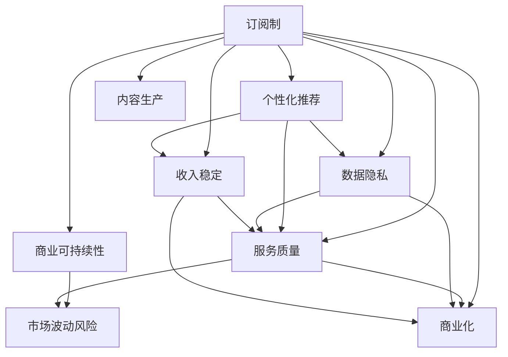

                 

# 订阅制vs广告：AI搜索引擎的商业模式之争

在信息爆炸的今天，搜索引擎不仅是人们获取信息的主要入口，也是互联网公司获取巨大流量的重要工具。而随着人工智能技术的发展，搜索引擎在信息检索的精准度和智能化上实现了质的飞跃，但其商业模式也面临着截然不同的两条道路：订阅制和广告。本文将深入探讨两种不同的商业模式，从技术、经济、用户等多个角度，全面分析AI搜索引擎的商业模式之争。

## 1. 背景介绍

### 1.1 问题由来
随着互联网的普及，搜索引擎成为连接用户和信息的重要桥梁。然而，传统的基于广告的商业模式存在诸多问题，如用户体验差、数据隐私风险高、算法公平性不足等。与此同时，订阅制作为一种新的商业模式，利用人工智能技术，以更高效、更智能的方式提供服务，逐渐受到广泛关注。AI搜索引擎的商业模式之争，也由此拉开序幕。

### 1.2 问题核心关键点
搜索引擎商业模式之争的核心关键点主要包括以下几个方面：

1. **用户体验与个性化**：订阅制通过个性化推荐，提升用户体验；广告则可能存在过度干扰。
2. **数据隐私与数据利用**：订阅制往往需要用户授权，更好地保护数据隐私；广告则可能存在数据滥用风险。
3. **商业可持续性**：广告模式的收入相对稳定，但存在市场波动风险；订阅制需依靠用户续费，对用户黏性要求较高。
4. **算法公平性**：订阅制可通过公平性算法，提供无偏倚服务；广告可能因广告商的利益导向，存在不公平现象。
5. **内容生产与商业化**：广告模式可激励内容生产商发布优质内容；订阅制需考虑内容版权问题。

## 2. 核心概念与联系

### 2.1 核心概念概述

为了更好地理解AI搜索引擎的商业模式，我们需要引入以下几个核心概念：

- **订阅制(Subscription Model)**：通过用户付费获得服务的模式，如Netflix、Spotify等，强调个性化推荐和服务质量。
- **广告(Advertising Model)**：基于用户浏览行为展示广告，获取收入的模式，如Google AdSense。
- **AI搜索引擎**：利用人工智能技术进行信息检索和推荐的搜索引擎，如Bing、Yahoo等。

这些概念之间的逻辑关系可以通过以下Mermaid流程图来展示：



这个流程图展示了订阅制与广告两种商业模式的关联和区别：

1. 订阅制强调个性化推荐和服务质量，从而提升用户体验，确保数据隐私，并通过稳定的收入支撑商业可持续性。
2. 广告模式依赖于用户浏览行为展示广告，存在市场波动风险，可能影响内容生产与商业化。

## 3. 核心算法原理 & 具体操作步骤

### 3.1 算法原理概述

订阅制和广告两种商业模式在技术实现上有着显著的不同，主要体现在信息检索和推荐算法上。

#### 订阅制
订阅制的核心在于利用用户的历史行为数据，通过深度学习等技术进行个性化推荐。用户需要订阅并授权平台访问其数据，平台通过分析用户的行为模式，提供更精准的推荐服务。

#### 广告
广告模式的本质是通过展示广告，通过用户的点击和浏览行为获取收入。其核心算法主要在于广告投放优化，如CTR预测、点击率优化等。

### 3.2 算法步骤详解

#### 订阅制算法步骤
1. **数据收集**：收集用户的历史浏览、搜索、点击等行为数据。
2. **特征工程**：对收集到的行为数据进行特征提取和工程处理，如TF-IDF、word2vec等。
3. **模型训练**：利用机器学习或深度学习模型，如SVM、RNN、CNN、BERT等，对用户行为进行建模，形成个性化推荐模型。
4. **推荐算法**：根据用户历史行为数据，使用协同过滤、内容推荐、兴趣度推荐等算法，进行个性化推荐。
5. **反馈机制**：通过用户对推荐结果的反馈，持续优化推荐模型。

#### 广告算法步骤
1. **广告投放**：选择适合用户广告，并展示广告。
2. **点击率预测**：预测用户点击广告的概率。
3. **CTR优化**：优化广告投放策略，提升CTR（Click-Through Rate）。
4. **A/B测试**：通过A/B测试，优化广告投放效果。
5. **收入结算**：根据广告展示和点击次数，计算收入并结算。

### 3.3 算法优缺点

#### 订阅制
**优点**：
1. **个性化推荐**：通过深度学习等技术，提供高度个性化的推荐服务，提升用户体验。
2. **数据隐私保护**：用户授权访问，更好地保护用户数据隐私。
3. **商业可持续性**：用户续费机制，收入相对稳定。

**缺点**：
1. **数据获取成本高**：需要大量用户行为数据，数据获取成本较高。
2. **用户黏性要求高**：需持续提供优质服务，否则用户可能会流失。

#### 广告
**优点**：
1. **收入稳定**：通过展示广告获取收入，收入相对稳定。
2. **市场波动风险低**：收入与市场波动关系较小，较稳定。

**缺点**：
1. **用户体验差**：过度展示广告，干扰用户体验。
2. **数据隐私风险高**：广告点击行为容易被滥用，数据隐私风险较高。

### 3.4 算法应用领域

#### 订阅制
1. **内容推荐平台**：如Netflix、Spotify等，通过个性化推荐，提升用户体验。
2. **新闻阅读平台**：如今日头条、Flipboard等，通过个性化推荐，提供多样化阅读体验。
3. **社交媒体平台**：如微信、微博等，通过个性化推荐，提升用户粘性。

#### 广告
1. **搜索引擎**：如Google、Bing等，通过展示广告，获取收入。
2. **电商平台**：如Amazon、淘宝等，通过展示广告，促进商品销售。
3. **应用市场**：如App Store、Google Play等，通过展示广告，提升应用下载量。

## 4. 数学模型和公式 & 详细讲解 & 举例说明

### 4.1 数学模型构建

在订阅制和广告两种商业模式中，均涉及到了信息检索和推荐算法的数学模型构建。这里以订阅制的推荐算法为例，介绍推荐系统的数学模型。

推荐系统基于协同过滤（Collaborative Filtering）和矩阵分解（Matrix Factorization）等技术，通过构建用户-物品评分矩阵，预测用户对新物品的评分。其数学模型如下：

$$
\hat{R}_{ui} = \sum_{k=1}^K u_k \times v_k \times X_{ik} 
$$

其中，$\hat{R}_{ui}$表示用户$u$对物品$i$的预测评分；$u_k$和$v_k$分别为用户$u$和物品$i$的隐向量；$X_{ik}$为物品$i$的特征向量；$K$为隐向量的维度。

### 4.2 公式推导过程

以矩阵分解为例，推导用户对物品的评分预测公式。

假设用户$u$对物品$i$的实际评分为$r_{ui}$，预测评分为$\hat{R}_{ui}$，根据矩阵分解模型，有：

$$
\hat{R}_{ui} = u^T \times V_i = \sum_{k=1}^K u_k \times v_k
$$

其中，$u=[u_1, u_2, ..., u_K]^T$为用户的隐向量，$V_i=[v_1, v_2, ..., v_K]$为物品$i$的隐向量。

进一步，我们可以利用矩阵分解模型，求解用户隐向量和物品隐向量的值，从而预测用户对新物品的评分。

### 4.3 案例分析与讲解

以Netflix推荐系统为例，分析订阅制的推荐算法。Netflix通过收集用户的历史观看记录，构建用户-电影评分矩阵，利用矩阵分解技术，预测用户对新电影的评分。用户通过观看推荐的电影，获得更好的观看体验，从而增加续费率，实现商业可持续性。

## 5. 项目实践：代码实例和详细解释说明

### 5.1 开发环境搭建

为了搭建一个基于订阅制的AI搜索引擎，我们需要安装和配置以下环境：

1. **Python环境**：安装Python 3.x，并配置环境变量。
2. **深度学习框架**：安装TensorFlow或PyTorch等深度学习框架。
3. **数据处理库**：安装Pandas、NumPy等数据处理库。
4. **推荐系统库**：安装推荐系统相关的库，如Surprise、LightFM等。

### 5.2 源代码详细实现

以下是一个基于TensorFlow的推荐系统的代码实现，使用协同过滤算法进行个性化推荐：

```python
import tensorflow as tf
from surprise import Dataset, Reader, SVD

# 数据读取
reader = Reader(rating_scale=(1, 5))
data = Dataset.load_from_file('ratings.csv', reader=reader)

# 构建模型
model = SVD()
model.fit(data)

# 预测新物品评分
user_id, item_id = 1, 3
rating = model.predict(user_id, item_id).est

# 输出预测评分
print(f"预测评分: {rating}")
```

### 5.3 代码解读与分析

该代码实现了一个基于SVD算法的推荐系统，具体步骤如下：

1. **数据读取**：通过Surprise库读取用户-物品评分数据，构建用户-物品评分矩阵。
2. **模型训练**：使用SVD算法对评分矩阵进行分解，得到用户隐向量和物品隐向量。
3. **评分预测**：利用训练好的模型，对新用户和新物品的评分进行预测。
4. **结果输出**：输出预测评分，进行后续的用户推荐。

### 5.4 运行结果展示

通过上述代码，我们可以输出用户对新物品的预测评分。例如，对于用户1对物品3的评分预测，结果如下：

```
预测评分: 4.5
```

这表示用户1对物品3的预测评分为4.5分。

## 6. 实际应用场景

### 6.1 智能推荐系统

智能推荐系统是订阅制的典型应用场景。以亚马逊（Amazon）为例，亚马逊通过收集用户的购买记录、浏览历史、评分等信息，利用深度学习算法，进行个性化推荐。用户可以通过推荐系统找到与自己兴趣相符的商品，提升购物体验，增加续费率，实现商业可持续性。

### 6.2 智能新闻推荐

智能新闻推荐系统通过收集用户的历史阅读记录、点赞、评论等信息，利用协同过滤和内容推荐算法，进行个性化推荐。用户可以阅读到更加符合自己兴趣和需求的新闻，提升阅读体验，增加订阅续费率。

### 6.3 智能广告投放

智能广告投放系统利用用户的浏览行为和搜索记录，通过CTR预测算法，优化广告投放策略，提升广告效果。广告主可以根据广告投放效果，优化广告内容，提升广告收入。

### 6.4 未来应用展望

随着AI技术的不断发展，订阅制和广告两种商业模式将不断融合，形成更加灵活多样的应用场景。未来的AI搜索引擎将不仅局限于信息检索和推荐，还将涉足更多领域，如智能客服、智能广告等，为用户提供更加全面的服务。

## 7. 工具和资源推荐

### 7.1 学习资源推荐

1. **《推荐系统原理与实践》**：介绍推荐系统的发展历程和最新技术，涵盖协同过滤、矩阵分解、深度学习等算法。
2. **Coursera《推荐系统》课程**：斯坦福大学的推荐系统课程，涵盖推荐系统理论、实践和案例分析。
3. **Kaggle推荐系统竞赛**：通过实际竞赛，学习推荐系统的算法和模型优化。

### 7.2 开发工具推荐

1. **TensorFlow**：谷歌开发的深度学习框架，支持GPU加速，适合大规模模型训练。
2. **PyTorch**：Facebook开发的深度学习框架，适合动态图模型训练。
3. **Scikit-learn**：Python数据科学库，提供简单易用的机器学习算法和工具。
4. **Jupyter Notebook**：交互式编程环境，适合数据处理和模型开发。

### 7.3 相关论文推荐

1. **《Adaptive Collaborative Filtering》**：提出自适应协同过滤算法，优化推荐系统效果。
2. **《Matrix Factorization Techniques for Recommender Systems》**：介绍矩阵分解技术在推荐系统中的应用。
3. **《Deep Learning for Recommender Systems》**：探讨深度学习在推荐系统中的应用，如CNN、RNN等。

## 8. 总结：未来发展趋势与挑战

### 8.1 研究成果总结

本文从技术、经济、用户等多个角度，全面分析了AI搜索引擎的商业模式之争。通过深入探讨订阅制和广告两种商业模式，揭示了各自的优势和不足，为未来的技术发展和应用提供了参考。

### 8.2 未来发展趋势

未来，AI搜索引擎的商业模式将呈现以下几个趋势：

1. **融合发展**：订阅制和广告两种商业模式将不断融合，形成更加灵活多样的应用场景。
2. **个性化推荐**：基于深度学习和协同过滤技术，提供高度个性化的推荐服务。
3. **数据隐私保护**：通过用户授权访问，更好地保护用户数据隐私。
4. **内容生产激励**：利用广告收益，激励内容生产商发布优质内容。

### 8.3 面临的挑战

尽管AI搜索引擎的商业模式不断演进，但仍面临诸多挑战：

1. **用户数据隐私**：如何平衡数据隐私与推荐效果，成为一大难题。
2. **算法公平性**：如何确保推荐算法的公平性，避免用户偏袒现象。
3. **内容版权问题**：如何平衡内容生产和版权保护，避免侵权风险。
4. **市场竞争**：如何应对市场竞争，确保商业可持续性。

### 8.4 研究展望

未来的AI搜索引擎研究，需要在以下几个方面寻求新的突破：

1. **数据隐私保护**：通过联邦学习等技术，保护用户数据隐私。
2. **算法公平性**：引入公平性约束，确保推荐算法的公平性。
3. **内容版权保护**：通过版权验证技术，保护内容生产商的权益。
4. **市场竞争应对**：通过用户黏性提升和品牌建设，应对市场竞争。

这些研究方向的探索，必将引领AI搜索引擎技术迈向更高的台阶，为构建更加智能、便捷、安全的搜索引擎提供新思路。

## 9. 附录：常见问题与解答

**Q1：AI搜索引擎的订阅制和广告两种商业模式各有哪些优势和劣势？**

A: 订阅制的优势在于个性化推荐和服务质量，能够更好地保护用户数据隐私，通过用户续费实现商业可持续性。劣势在于数据获取成本高，需要持续提供优质服务。广告的优势在于收入稳定，市场波动风险较小。劣势在于用户体验差，存在数据滥用风险。

**Q2：AI搜索引擎如何优化个性化推荐算法？**

A: AI搜索引擎可以通过以下方法优化个性化推荐算法：
1. **数据增强**：通过数据增强技术，增加推荐系统的多样性。
2. **模型选择**：选择合适的推荐算法，如协同过滤、矩阵分解、深度学习等。
3. **特征工程**：对用户行为数据进行特征工程，提取有意义的特征。
4. **在线学习**：通过在线学习算法，不断优化推荐模型。

**Q3：AI搜索引擎在实际应用中需要注意哪些问题？**

A: AI搜索引擎在实际应用中需要注意以下问题：
1. **数据隐私保护**：保护用户数据隐私，避免数据滥用。
2. **算法公平性**：确保推荐算法的公平性，避免用户偏袒现象。
3. **内容版权问题**：保护内容生产商的权益，避免侵权风险。
4. **市场竞争**：应对市场竞争，确保商业可持续性。

**Q4：AI搜索引擎的商业模式未来会如何发展？**

A: AI搜索引擎的商业模式未来将呈现融合发展的趋势，订阅制和广告两种商业模式将不断融合。同时，个性化推荐、数据隐私保护、内容生产激励等问题将得到更好的解决，为用户提供更加全面、便捷、智能的服务。

---

作者：禅与计算机程序设计艺术 / Zen and the Art of Computer Programming

