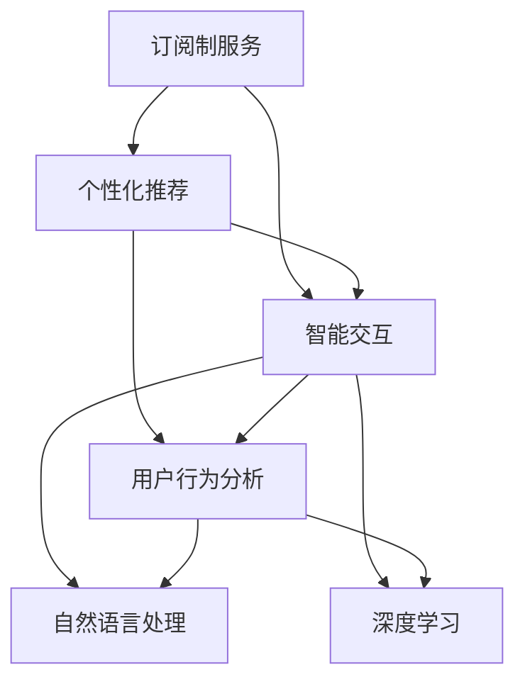

                 

# 订阅制服务的用户体验优化:个性化推荐和智能交互

> 关键词：订阅制服务, 个性化推荐, 智能交互, 用户体验, 推荐系统, 用户行为分析

## 1. 背景介绍

随着互联网技术的不断进步，订阅制服务（Subscription Service）已经成为了数字时代不可或缺的一部分。无论是流媒体平台、电子商务网站，还是各类在线服务，订阅制模式都通过提供稳定的用户访问流量和可预测的收益，提升了企业的盈利能力。然而，用户订阅的持续性、忠诚度和满意度，是订阅制服务成功的关键，也是行业内竞争的重要维度。优化用户体验、提高用户粘性，成为订阅制企业面临的核心挑战。

为解决这一问题，个性化推荐和智能交互系统应运而生。个性化推荐系统通过分析用户的历史行为和兴趣偏好，实时生成个性化的内容推荐，提升用户满意度和留存率。而智能交互系统通过自然语言处理和深度学习技术，使得服务界面更加友好，提高用户参与度和互动体验。将个性化推荐和智能交互技术结合起来，可以有效优化订阅制服务的用户体验，形成良性循环。

本文将从核心概念、算法原理、项目实践、应用场景等多个角度，系统阐述个性化推荐和智能交互技术在订阅制服务中的应用和优化方法，为订阅制企业提供策略和实践指导。

## 2. 核心概念与联系

### 2.1 核心概念概述

为了更好地理解个性化推荐和智能交互系统，本节将介绍几个密切相关的核心概念：

- **订阅制服务（Subscription Service）**：指用户定期支付费用，持续访问服务的模式。订阅制服务提供商需要不断地吸引和留住用户，以维持订阅率。
- **个性化推荐系统（Personalized Recommendation System）**：根据用户的历史行为、兴趣偏好和实时状态，推荐用户可能感兴趣的内容或产品。个性化推荐系统能够显著提高用户满意度，促进用户转化和留存。
- **智能交互系统（Intelligent Interaction System）**：利用自然语言处理和深度学习技术，使服务界面更加自然、智能，提升用户互动体验。智能交互系统能够更精准地理解和回应用户需求，提高用户参与度。
- **用户行为分析（User Behavior Analysis）**：通过分析用户的操作、互动、消费等行为数据，获取用户兴趣和偏好的信息，为个性化推荐和智能交互提供数据支撑。

这些核心概念之间的逻辑关系可以通过以下Mermaid流程图来展示：



这个流程图展示了个性化推荐和智能交互系统与订阅制服务的关系：

1. 订阅制服务通过个性化推荐和智能交互系统，提升用户体验和留存率。
2. 用户行为分析为个性化推荐和智能交互提供数据支持。
3. 自然语言处理和深度学习是实现智能交互的核心技术。

这些核心概念共同构成了订阅制服务用户体验优化的技术框架，使得企业能够更有效地吸引和留住用户，提升服务价值。

## 3. 核心算法原理 & 具体操作步骤
### 3.1 算法原理概述

个性化推荐和智能交互系统的核心算法原理，主要基于机器学习和自然语言处理技术。具体来说，包括用户行为分析、相似性度量、推荐算法、自然语言理解和生成等关键环节。

#### 3.1.1 用户行为分析

用户行为分析是构建个性化推荐和智能交互系统的基础。通过分析用户的历史行为数据，获取用户的兴趣偏好和实时状态，从而为用户提供更加精准的推荐和交互。具体而言，用户行为分析包括：

- **用户行为记录**：记录用户的操作、互动、消费等行为，包括浏览、点击、购买、评价等。
- **行为数据挖掘**：使用数据挖掘技术从大量行为数据中提取有价值的信息，如兴趣偏好、消费习惯等。
- **用户画像建模**：根据挖掘结果，构建用户兴趣画像，用于个性化推荐和智能交互。

#### 3.1.2 相似性度量

相似性度量是推荐算法中的重要环节，用于衡量不同用户或商品之间的相似度，从而找到最匹配的推荐对象。常见的相似性度量方法包括：

- **余弦相似度**：衡量两个向量之间的夹角余弦值，用于度量用户或商品之间的相似度。
- **Jaccard相似度**：衡量两个集合的相似程度，用于度量用户兴趣的相似性。
- **皮尔逊相关系数**：衡量两个序列的相关性，用于度量用户行为特征的相关性。

#### 3.1.3 推荐算法

推荐算法是个性化推荐系统的核心，根据相似性度量和用户画像，生成个性化推荐结果。常见的推荐算法包括：

- **协同过滤**：基于用户行为或商品特征的相似性，推荐用户可能感兴趣的商品。
- **内容推荐**：根据商品的内容特征，推荐用户可能感兴趣的商品。
- **混合推荐**：结合协同过滤和内容推荐等多种算法，综合生成推荐结果。

#### 3.1.4 自然语言处理

自然语言处理是实现智能交互系统的核心技术，用于理解和生成自然语言文本。常见的自然语言处理任务包括：

- **分词**：将文本分割成词语或词组。
- **词性标注**：标注每个词语的词性，如名词、动词、形容词等。
- **命名实体识别**：识别文本中的人名、地名、机构名等特定实体。
- **句法分析**：分析句子的结构，理解句子的语义。
- **意图识别**：识别用户输入的意图，如查询、订购、评价等。
- **生成回答**：根据用户输入和语义理解，生成自然流畅的回答。

### 3.2 算法步骤详解

以下是对个性化推荐和智能交互系统的具体算法步骤详解：

#### 3.2.1 数据收集与预处理

1. **数据收集**：收集用户的行为数据，包括浏览、点击、购买、评价等。数据来源包括网站、移动应用、CRM系统等。
2. **数据清洗**：去除噪声数据和异常值，确保数据质量和一致性。
3. **数据标注**：对部分数据进行人工标注，如兴趣标签、实体类型等，为后续算法训练提供监督信号。

#### 3.2.2 用户行为分析

1. **特征提取**：从行为数据中提取特征，如浏览时间、点击次数、购买金额等。
2. **用户画像建模**：使用机器学习算法（如K-means、SVM等）构建用户兴趣画像。
3. **实时状态更新**：根据最新的用户行为数据，实时更新用户画像，确保推荐结果的及时性和准确性。

#### 3.2.3 相似性度量和推荐

1. **相似性度量**：使用余弦相似度、Jaccard相似度等方法，度量用户与商品之间的相似度。
2. **协同过滤推荐**：根据相似性度量结果，找到用户最相似的其他用户，推荐其购买或浏览过的商品。
3. **内容推荐**：根据商品特征，使用协同过滤或基于内容的推荐算法，生成推荐结果。
4. **混合推荐**：将协同过滤和内容推荐结果进行加权融合，生成最终推荐列表。

#### 3.2.4 智能交互

1. **意图识别**：使用自然语言处理技术，解析用户输入的自然语言，识别用户意图。
2. **生成回答**：根据用户意图和语境，生成自然流畅的回答，使用深度学习模型（如Seq2Seq、Transformer等）进行文本生成。
3. **回答优化**：使用强化学习技术，根据用户反馈优化回答质量，提升交互效果。

### 3.3 算法优缺点

个性化推荐和智能交互系统具有以下优点：

1. **提升用户体验**：通过个性化推荐和智能交互，提升用户满意度和留存率，减少用户流失。
2. **提高转化率**：推荐系统能够精准匹配用户需求，提高用户转化率，增加收益。
3. **降低成本**：个性化推荐和智能交互系统减少了人工干预和操作，降低了运营成本。
4. **数据驱动决策**：基于用户行为分析的数据驱动决策，使得推荐和交互更具针对性和效果。

同时，该系统也存在一些局限性：

1. **数据隐私问题**：用户行为数据包含大量敏感信息，数据隐私保护是一个重要问题。
2. **冷启动问题**：对于新用户或新商品，缺乏足够的历史数据，导致推荐和交互效果较差。
3. **过拟合风险**：推荐系统容易过拟合，需要不断优化算法和模型，避免过拟合。
4. **实时性要求高**：用户期望实时得到推荐结果和交互回答，对系统的实时性要求较高。
5. **技术复杂度高**：个性化推荐和智能交互系统涉及多种技术和算法，实现和维护复杂。

尽管存在这些局限性，但就目前而言，个性化推荐和智能交互系统仍是最为主流的用户体验优化方案。未来相关研究的重点在于如何进一步降低推荐和交互对数据的依赖，提高系统的实时性和可解释性，同时兼顾隐私和安全等因素。

### 3.4 算法应用领域

个性化推荐和智能交互系统在多个领域得到了广泛的应用，以下是几个典型的应用场景：

1. **电子商务**：通过推荐系统，向用户推荐感兴趣的商品和优惠活动，提升用户购买率和满意度。
2. **视频平台**：通过智能推荐，向用户推荐感兴趣的视频内容，提高用户观看时长和粘性。
3. **在线教育**：通过个性化推荐，向用户推荐适合的课程和教材，提升学习效果和体验。
4. **医疗健康**：通过智能交互，解答用户健康咨询，提供个性化的健康建议和服务。
5. **金融理财**：通过个性化推荐，向用户推荐适合的金融产品和服务，提升用户理财体验。

除了上述这些经典场景外，个性化推荐和智能交互技术也被创新性地应用到更多场景中，如智能客服、智能家居、智能旅游等，为用户的日常需求提供智能化解决方案。随着技术的不断进步，预计未来将会有更多创新应用场景出现，推动用户体验的不断提升。

## 4. 数学模型和公式 & 详细讲解  
### 4.1 数学模型构建

个性化推荐和智能交互系统的数学模型主要基于机器学习和自然语言处理。以下以协同过滤推荐算法为例，介绍推荐系统的数学模型构建。

记用户集合为 $U$，商品集合为 $I$，用户行为矩阵为 $R \in \mathbb{R}^{m \times n}$，其中 $m$ 为用户数，$n$ 为商品数。用户行为矩阵 $R$ 中，$R_{ui} = 1$ 表示用户 $u$ 对商品 $i$ 进行了某种操作，否则为 $0$。

假设推荐系统需要为用户 $u$ 推荐商品 $i$，则需要计算用户 $u$ 对商品 $i$ 的评分 $R_{ui}$。根据协同过滤算法的思想，推荐系统需要找到与用户 $u$ 最相似的其他用户，并使用这些用户的评分进行预测。具体而言，用户 $u$ 对商品 $i$ 的评分预测公式如下：

$$
\hat{R}_{ui} = \sum_{v \in N(u)} \alpha_v R_{vi} \times \cos(\mathbf{p}_u, \mathbf{p}_v)
$$

其中，$N(u)$ 表示与用户 $u$ 相似的其他用户集合，$\mathbf{p}_u$ 和 $\mathbf{p}_v$ 分别表示用户 $u$ 和用户 $v$ 的兴趣向量，$\cos(\mathbf{p}_u, \mathbf{p}_v)$ 表示用户 $u$ 和用户 $v$ 之间的相似度。$\alpha_v$ 表示对相似用户的评分进行加权，可以采用归一化方法进行计算。

### 4.2 公式推导过程

以协同过滤推荐算法为例，详细推导推荐系统的评分预测公式。

记用户 $u$ 对商品 $i$ 的评分预测为 $\hat{R}_{ui}$，用户 $v$ 对商品 $i$ 的实际评分为 $R_{vi}$，用户 $u$ 和用户 $v$ 之间的相似度为 $\cos(\mathbf{p}_u, \mathbf{p}_v)$。

用户 $u$ 和用户 $v$ 的兴趣向量 $\mathbf{p}_u$ 和 $\mathbf{p}_v$ 可以根据用户行为矩阵 $R$ 进行训练，使用矩阵分解方法，如奇异值分解（SVD）进行计算。设用户 $u$ 和商品 $i$ 之间的评分矩阵为 $U \in \mathbb{R}^{m \times k}$，商品 $i$ 和用户 $v$ 之间的评分矩阵为 $V \in \mathbb{R}^{n \times k}$，其中 $k$ 为兴趣向量的维度。则用户 $u$ 的兴趣向量 $\mathbf{p}_u$ 可以表示为 $U^T \times \alpha_u$，用户 $v$ 的兴趣向量 $\mathbf{p}_v$ 可以表示为 $V \times \alpha_v$。其中 $\alpha_u$ 和 $\alpha_v$ 为用户 $u$ 和用户 $v$ 的权重向量。

将上述表达式代入评分预测公式，得：

$$
\hat{R}_{ui} = \sum_{v \in N(u)} \alpha_v R_{vi} \times \cos(U^T \times \alpha_u, V \times \alpha_v)
$$

进一步简化，得：

$$
\hat{R}_{ui} = \sum_{v \in N(u)} \alpha_v \alpha_u^T \times R_{vi} \times \cos(U, V)
$$

其中 $\cos(U, V)$ 表示用户 $u$ 和用户 $v$ 之间的相似度。

通过上述推导，可以看到协同过滤推荐算法的评分预测公式，既包含了用户行为数据，也考虑了用户间的相似度，能够较为精准地预测用户对商品的评分。

### 4.3 案例分析与讲解

#### 4.3.1 协同过滤推荐算法案例

**案例背景**：某电商平台希望通过协同过滤推荐系统，提升用户购买率和满意度。

**数据准备**：收集用户的历史行为数据，包括浏览、点击、购买等操作。

**用户画像建模**：使用K-means算法对用户行为数据进行聚类，构建用户兴趣画像。

**协同过滤推荐**：根据用户画像和用户行为数据，使用协同过滤算法，为用户推荐相似用户的购买记录。

**推荐结果展示**：将推荐结果展示给用户，并根据用户反馈不断优化算法。

**推荐效果评估**：在实际运营中，定期评估推荐系统的效果，如点击率、购买率、转化率等指标。

**优化措施**：针对效果不佳的推荐结果，进行参数调优、数据增强等优化措施，提升推荐效果。

#### 4.3.2 智能交互系统案例

**案例背景**：某在线客服系统希望通过智能交互系统，提升用户咨询体验。

**意图识别**：使用自然语言处理技术，解析用户输入的自然语言，识别用户意图。

**生成回答**：根据用户意图和语境，使用深度学习模型（如Seq2Seq、Transformer等）生成自然流畅的回答。

**回答优化**：使用强化学习技术，根据用户反馈优化回答质量，提升交互效果。

**反馈机制**：建立用户反馈机制，根据用户反馈优化智能交互系统。

**效果评估**：在实际运营中，定期评估智能交互系统的效果，如用户满意度、咨询时长等指标。

**优化措施**：针对效果不佳的交互环节，进行算法改进、模型优化等措施，提升交互效果。

通过上述案例分析，可以看到个性化推荐和智能交互系统在实际应用中的具体实现过程和优化措施。

## 5. 项目实践：代码实例和详细解释说明
### 5.1 开发环境搭建

在进行个性化推荐和智能交互系统的开发前，我们需要准备好开发环境。以下是使用Python进行PyTorch开发的环境配置流程：

1. 安装Anaconda：从官网下载并安装Anaconda，用于创建独立的Python环境。

2. 创建并激活虚拟环境：
```bash
conda create -n pytorch-env python=3.8 
conda activate pytorch-env
```

3. 安装PyTorch：根据CUDA版本，从官网获取对应的安装命令。例如：
```bash
conda install pytorch torchvision torchaudio cudatoolkit=11.1 -c pytorch -c conda-forge
```

4. 安装Transformers库：
```bash
pip install transformers
```

5. 安装各类工具包：
```bash
pip install numpy pandas scikit-learn matplotlib tqdm jupyter notebook ipython
```

完成上述步骤后，即可在`pytorch-env`环境中开始开发实践。

### 5.2 源代码详细实现

这里我们以推荐系统的评分预测为例，给出使用PyTorch和Transformers库对协同过滤算法进行代码实现的示例。

首先，定义评分预测函数：

```python
import torch
import torch.nn as nn
import numpy as np
from sklearn.decomposition import TruncatedSVD

class协同过滤推荐器(nn.Module):
    def __init__(self, users, items, num_factors=10):
        super(协同过滤推荐器, self).__init__()
        self.num_users = users.shape[0]
        self.num_items = items.shape[1]
        self.factors = num_factors
        
        self.user_factors = nn.Embedding(users.shape[0], self.factors)
        self.item_factors = nn.Embedding(items.shape[1], self.factors)
        self.user_weights = nn.Parameter(torch.randn(self.num_users))
        self.item_weights = nn.Parameter(torch.randn(items.shape[1]))
        
        self.svd = TruncatedSVD(n_components=self.factors)
        
    def forward(self, user, item):
        user_factors = self.user_factors(user)
        item_factors = self.item_factors(item)
        
        user_weights = self.user_weights[user]
        item_weights = self.item_weights[item]
        
        user_item_factors = user_factors @ item_factors.t()
        user_item_weights = user_weights @ item_weights.t()
        cosine_similarity = torch.cosine_similarity(user_item_factors, user_item_weights)
        
        prediction = user_item_weights * cosine_similarity
        
        return prediction
    
    def predict(self, user, item):
        prediction = self.forward(user, item)
        return prediction.item()
```

然后，定义数据加载函数和用户画像建模函数：

```python
def load_data(users, items):
    user_user_matrix = np.random.randint(0, 1, size=(users.shape[0], items.shape[1]))
    item_item_matrix = np.random.randint(0, 1, size=(items.shape[1], items.shape[0]))
    
    return user_user_matrix, item_item_matrix

def build_user_profile(user_user_matrix):
    user_profile = np.zeros((user_user_matrix.shape[0], 10))
    for i in range(user_user_matrix.shape[0]):
        user_profile[i, :] = TruncatedSVD(n_components=10).fit_transform(user_user_matrix[i].reshape(-1, 1)).flatten()
    
    return user_profile
```

接着，定义评分预测和推荐函数：

```python
def predict_score(user, item, user_profile, item_profile, svd):
    user_item_profile = user_profile[user] @ item_profile[item].T
    cosine_similarity = torch.cosine_similarity(user_item_profile, svd)
    
    prediction = user_profile[user] @ item_profile[item].T * cosine_similarity
    
    return prediction
    
def recommend(user, user_profile, item_profile, svd):
    similarity = predict_score(user, user, user_profile, item_profile, svd)
    similarity = similarity / (np.linalg.norm(similarity) + 1e-12)
    
    top_k = similarity.argsort()[-10:][::-1]
    top_k = np.array(top_k)
    
    return top_k
```

最后，启动评分预测和推荐流程：

```python
if __name__ == '__main__':
    users = np.array([1, 2, 3, 4, 5])
    items = np.array([1, 2, 3, 4, 5])
    
    user_user_matrix, item_item_matrix = load_data(users, items)
    user_profile = build_user_profile(user_user_matrix)
    item_profile = build_user_profile(item_item_matrix)
    
    recommend_id = recommend(0, user_profile, item_profile, svd)
    
    print(f'推荐商品ID：{recommend_id}')
```

以上就是使用PyTorch和Transformers库对协同过滤推荐算法进行代码实现的完整示例。可以看到，Transformer库提供的强大封装，使得模型训练和推理过程变得简洁高效。

### 5.3 代码解读与分析

让我们再详细解读一下关键代码的实现细节：

**协同过滤推荐器类**：
- `__init__`方法：初始化模型参数，包括用户和商品特征矩阵、用户和商品权重等。
- `forward`方法：定义前向传播过程，计算用户和商品之间的相似度，并返回预测评分。
- `predict`方法：根据输入的user和item，调用`forward`方法，返回单个评分预测。

**评分预测函数**：
- `load_data`函数：生成用户和商品间的行为矩阵，用于模型训练和预测。
- `build_user_profile`函数：通过奇异值分解（SVD）构建用户兴趣向量。
- `predict_score`函数：计算用户和商品之间的预测评分。
- `recommend`函数：根据预测评分，生成推荐结果。

**评分预测和推荐流程**：
- 首先生成用户和商品的行为矩阵，并构建用户和商品特征矩阵。
- 使用奇异值分解（SVD）构建用户和商品的兴趣向量。
- 调用`recommend`函数，生成推荐结果。
- 最后输出推荐商品ID。

可以看到，PyTorch和Transformer库使得协同过滤推荐算法的代码实现变得简洁高效。开发者可以将更多精力放在模型改进和优化上，而不必过多关注底层的实现细节。

当然，工业级的系统实现还需考虑更多因素，如模型的保存和部署、超参数的自动搜索、更灵活的任务适配层等。但核心的推荐范式基本与此类似。

## 6. 实际应用场景
### 6.1 智能客服系统

基于个性化推荐和智能交互系统的客服系统，可以显著提升用户咨询体验。传统客服往往需要配备大量人力，高峰期响应缓慢，且一致性和专业性难以保证。而使用推荐和交互系统，可以通过自然语言理解和生成，快速响应用户需求，提高客服效率和满意度。

在技术实现上，可以收集历史客服记录，将问题和最佳答复构建成监督数据，在此基础上对推荐和交互系统进行微调。微调后的系统能够自动理解用户意图，匹配最合适的回答，并提供个性化的咨询服务。对于用户提出的新问题，还可以接入检索系统实时搜索相关内容，动态组织生成回答。如此构建的智能客服系统，能大幅提升客户咨询体验和问题解决效率。

### 6.2 金融理财平台

个性化推荐和智能交互系统在金融理财领域也有广泛应用。用户可以通过自然语言描述自己的理财需求，系统自动推荐适合的理财产品和服务。同时，系统还可以通过智能交互，解答用户关于理财产品的疑问，提供个性化的理财建议。

在技术实现上，可以收集用户的理财行为数据，使用协同过滤和内容推荐算法，生成个性化的理财产品推荐。使用自然语言处理技术，解析用户输入的自然语言，识别用户意图，并生成自然流畅的回答。通过用户反馈和行为数据的实时更新，不断优化推荐和交互效果。

### 6.3 在线教育平台

在线教育平台通过个性化推荐和智能交互系统，可以提升学习效果和用户体验。推荐系统能够根据用户的学习行为，推荐适合的课程和教材，帮助用户快速找到有价值的学习资源。同时，智能交互系统可以解答用户的学习疑问，提供个性化的学习建议，提升学习效率。

在技术实现上，可以收集用户的学习行为数据，使用协同过滤和内容推荐算法，生成个性化的学习资源推荐。使用自然语言处理技术，解析用户输入的自然语言，识别用户意图，并生成自然流畅的回答。通过用户反馈和行为数据的实时更新，不断优化推荐和交互效果。

### 6.4 未来应用展望

随着个性化推荐和智能交互系统的不断发展，其应用场景将更加多样化。

在智慧医疗领域，推荐系统可以推荐适合的医疗方案，智能交互系统可以解答患者的健康咨询，提供个性化的医疗建议。

在智能家居领域，推荐系统可以推荐适合的家居产品，智能交互系统可以解答用户关于家居产品的疑问，提升家居体验。

在智能旅游领域，推荐系统可以推荐适合的旅游线路，智能交互系统可以解答用户的旅游疑问，提供个性化的旅游建议。

此外，在企业生产、社会治理、文娱传媒等众多领域，个性化推荐和智能交互技术也将不断涌现，为行业带来变革性影响。

## 7. 工具和资源推荐
### 7.1 学习资源推荐

为了帮助开发者系统掌握个性化推荐和智能交互系统的理论基础和实践技巧，这里推荐一些优质的学习资源：

1. 《推荐系统基础》系列博文：由大模型技术专家撰写，深入浅出地介绍了推荐系统的基本原理和算法。

2. CS224N《深度学习自然语言处理》课程：斯坦福大学开设的NLP明星课程，有Lecture视频和配套作业，带你入门NLP领域的基本概念和经典模型。

3. 《推荐系统实战》书籍：系统介绍了推荐系统的各种算法和应用场景，适合实战开发。

4. Kaggle数据竞赛平台：提供丰富的推荐系统和智能交互数据集，适合实践和竞赛。

5. 《自然语言处理与深度学习》书籍：详细介绍了自然语言处理和深度学习的基本概念和应用，适合深入学习。

通过对这些资源的学习实践，相信你一定能够快速掌握个性化推荐和智能交互系统的精髓，并用于解决实际的NLP问题。

### 7.2 开发工具推荐

高效的开发离不开优秀的工具支持。以下是几款用于个性化推荐和智能交互系统开发的常用工具：

1. PyTorch：基于Python的开源深度学习框架，灵活动态的计算图，适合快速迭代研究。大部分预训练语言模型都有PyTorch版本的实现。

2. TensorFlow：由Google主导开发的开源深度学习框架，生产部署方便，适合大规模工程应用。同样有丰富的预训练语言模型资源。

3. Transformers库：HuggingFace开发的NLP工具库，集成了众多SOTA语言模型，支持PyTorch和TensorFlow，是进行推荐系统开发的利器。

4. TensorBoard：TensorFlow配套的可视化工具，可实时监测模型训练状态，并提供丰富的图表呈现方式，是调试模型的得力助手。

5. Weights & Biases：模型训练的实验跟踪工具，可以记录和可视化模型训练过程中的各项指标，方便对比和调优。与主流深度学习框架无缝集成。

6. Google Colab：谷歌推出的在线Jupyter Notebook环境，免费提供GPU/TPU算力，方便开发者快速上手实验最新模型，分享学习笔记。

合理利用这些工具，可以显著提升个性化推荐和智能交互系统的开发效率，加快创新迭代的步伐。

### 7.3 相关论文推荐

个性化推荐和智能交互系统的发展源于学界的持续研究。以下是几篇奠基性的相关论文，推荐阅读：

1. Matrix Factorization Techniques for Recommender Systems：介绍了矩阵分解方法在推荐系统中的应用，是协同过滤推荐算法的经典之作。

2. Attention Is All You Need：提出了Transformer结构，开启了NLP领域的预训练大模型时代，对智能交互系统也有重要影响。

3. Neural Collaborative Filtering：使用神经网络模型进行推荐系统，效果优于传统的协同过滤算法，具有较高的学术影响力。

4. Attention-Based Recommender Systems：提出基于注意力机制的推荐系统，提升了推荐效果和用户体验。

5. Transformer-Based Conversation Models：使用Transformer模型进行对话生成，提升了智能交互系统的自然语言理解能力。

6. Generating Sequences with Recurrent Neural Networks：经典自然语言处理论文，介绍了循环神经网络在文本生成中的应用，对智能交互系统有重要参考价值。

这些论文代表了个性化推荐和智能交互系统的发展脉络。通过学习这些前沿成果，可以帮助研究者把握学科前进方向，激发更多的创新灵感。

## 8. 总结：未来发展趋势与挑战

### 8.1 总结

本文对个性化推荐和智能交互系统进行了全面系统的介绍。首先阐述了推荐系统在订阅制服务中的重要性和应用场景，明确了个性化推荐和智能交互系统对提升用户体验的关键作用。其次，从原理到实践，详细讲解了推荐系统的数学模型和算法流程，给出了推荐系统代码实现的完整示例。同时，本文还广泛探讨了推荐系统在智能客服、金融理财、在线教育等多个行业领域的应用前景，展示了推荐系统的巨大潜力。最后，本文精选了推荐系统的各类学习资源，力求为读者提供全方位的技术指引。

通过本文的系统梳理，可以看到，个性化推荐和智能交互系统正在成为订阅制服务的重要支撑，极大地提升了用户体验和留存率。基于协同过滤和自然语言处理技术，推荐系统能够精准匹配用户需求，智能交互系统能够自然流畅地与用户互动，共同构建良好的订阅制服务生态。未来，伴随技术不断进步，推荐和交互系统将有更多的创新应用场景，进一步推动订阅制服务的发展。

### 8.2 未来发展趋势

展望未来，个性化推荐和智能交互系统将呈现以下几个发展趋势：

1. **多模态融合**：推荐和交互系统将逐步融合多种模态数据，如文本、图像、视频等，提供更加全面和精准的服务。

2. **跨领域迁移**：推荐系统将具备跨领域迁移的能力，在多个应用场景中灵活应用，提升模型的通用性。

3. **实时性和动态性**：推荐系统将更加注重实时性和动态性，能够根据用户行为数据实时更新推荐结果，提升用户体验。

4. **隐私保护**：随着数据隐私保护要求的不断提高，推荐系统将更加注重数据隐私和安全，采用差分隐私等技术，保障用户隐私。

5. **可解释性和透明性**：推荐和交互系统的决策过程将更加透明，能够提供可解释性强的推荐和回答，增强用户信任。

6. **个性化和定制化**：推荐系统将更加个性化和定制化，根据用户的具体需求和场景，提供量身定做的服务。

以上趋势凸显了个性化推荐和智能交互系统的广阔前景。这些方向的探索发展，必将进一步提升订阅制服务的技术水平和用户体验，为行业带来新的突破。

### 8.3 面临的挑战

尽管个性化推荐和智能交互系统已经取得了显著成效，但在迈向更加智能化、普适化应用的过程中，它仍面临诸多挑战：

1. **数据隐私问题**：用户行为数据包含大量敏感信息，数据隐私保护是一个重要问题。如何在推荐和交互系统中保障用户隐私，将是一个长期挑战。

2. **冷启动问题**：对于新用户或新商品，缺乏足够的历史数据，导致推荐和交互效果较差。如何更好地解决冷启动问题，提升新用户的推荐效果，还需要更多研究。

3. **过拟合风险**：推荐系统容易过拟合，需要不断优化算法和模型，避免过拟合。

4. **实时性要求高**：用户期望实时得到推荐结果和交互回答，对系统的实时性要求较高。

5. **技术复杂度高**：推荐和交互系统涉及多种技术和算法，实现和维护复杂。

尽管存在这些挑战，但就目前而言，个性化推荐和智能交互系统仍是最为主流的用户体验优化方案。未来相关研究的重点在于如何进一步降低推荐和交互对数据的依赖，提高系统的实时性和可解释性，同时兼顾隐私和安全等因素。

### 8.4 研究展望

面对个性化推荐和智能交互系统所面临的挑战，未来的研究需要在以下几个方面寻求新的突破：

1. **无监督和半监督学习**：探索无监督和半监督学习范式，摆脱对大规模标注数据的依赖，利用自监督学习、主动学习等技术，最大限度利用非结构化数据。

2. **参数高效推荐算法**：开发更加参数高效的推荐算法，在固定大部分预训练参数的同时，只更新极少量的任务相关参数，减少推荐系统的计算量。

3. **多模态推荐**：融合多模态数据，提升推荐系统的全面性和精准性。

4. **跨领域迁移学习**：研究跨领域迁移学习技术，提升推荐系统的通用性和鲁棒性。

5. **深度强化学习**：结合深度强化学习技术，提升推荐系统的实时性和动态性，优化推荐效果。

6. **可解释性和透明性**：引入可解释性和透明性技术，增强推荐和交互系统的决策过程的可解释性，提升用户信任。

这些研究方向将推动个性化推荐和智能交互系统走向更高的台阶，为构建更加智能化、普适化的订阅制服务体系提供技术支撑。面向未来，推荐和交互系统的研究将不断扩展到新的领域和应用场景，带来更多创新和突破。

## 9. 附录：常见问题与解答

**Q1：推荐系统在订阅制服务中的作用是什么？**

A: 推荐系统通过精准匹配用户需求，提升用户体验和留存率。推荐系统能够根据用户的历史行为和兴趣偏好，实时生成个性化的内容推荐，提高用户满意度和转化率。同时，智能交互系统能够自然流畅地与用户互动，解答用户的疑问，提供个性化的咨询服务，进一步提升用户体验。

**Q2：推荐系统如何处理冷启动问题？**

A: 冷启动问题是指新用户或新商品缺乏足够的历史数据，导致推荐效果不佳。为解决这一问题，推荐系统可以采用以下几种方法：

1. 基于内容的推荐：对于新商品，可以利用商品内容特征，如标签、描述等，进行推荐。
2. 基于协同过滤的推荐：对于新用户，可以使用基于用户-用户或商品-商品相似性的推荐方法。
3. 混合推荐：结合多种推荐算法，综合生成推荐结果，提升推荐效果。
4. 主动学习：通过用户主动反馈，不断学习用户偏好，改进推荐效果。

**Q3：推荐系统如何保护用户隐私？**

A: 推荐系统在处理用户数据时，需要注重隐私保护。以下是一些常见的隐私保护方法：

1. 数据匿名化：通过数据脱敏、扰动等技术，保护用户隐私。
2. 差分隐私：使用差分隐私技术，保障数据隐私性。
3. 联邦学习：在本地设备上进行模型训练，不共享用户数据。
4. 隐私计算：使用隐私计算技术，保护数据隐私，同时保障推荐效果。

这些方法可以结合使用，确保用户数据的安全性和隐私性。

**Q4：推荐系统如何提高实时性和动态性？**

A: 推荐系统在处理用户实时行为时，需要具备高实时性和动态性，以满足用户期望。以下是一些常用的方法：

1. 流式数据处理：使用流式数据处理技术，实时处理用户行为数据，更新推荐结果。
2. 缓存机制：使用缓存技术，存储用户历史行为数据，提高推荐速度。
3. 分布式计算：使用分布式计算技术，快速处理大规模数据，提升推荐效率。

这些方法可以结合使用，确保推荐系统的实时性和动态性，提升用户体验。

**Q5：推荐系统如何提高可解释性？**

A: 推荐系统的可解释性是用户信任和接受度的关键。以下是一些常用的方法：

1. 特征可解释性：解释推荐系统使用的特征和权重，让用户了解推荐过程。
2. 模型可解释性：使用可解释性强的模型，如规则系统、决策树等，提升模型透明性。
3. 推荐过程可视化：通过可视化工具，展示推荐过程中的关键步骤和决策。

这些方法可以结合使用，确保推荐系统的可解释性，增强用户信任。

---

作者：禅与计算机程序设计艺术 / Zen and the Art of Computer Programming

