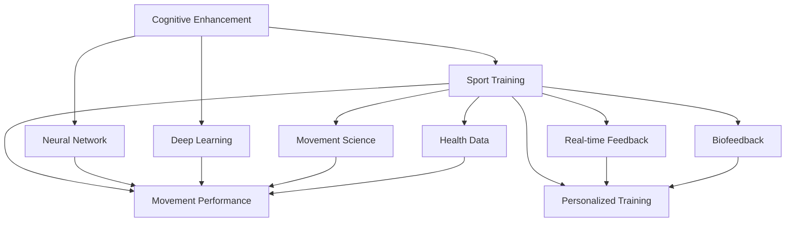

                 

# 认知增强与体育训练：提升运动表现的新方法

> 关键词：认知增强,体育训练,神经网络,深度学习,运动表现,实时反馈,个性化训练,生物反馈,运动科学,健康数据

## 1. 背景介绍

### 1.1 问题由来
现代体育训练正面临一场深刻的变革，传统训练模式在提升运动员表现方面存在诸多局限。从身体训练到心理训练，再到技术战术的提升，每一环节都亟需突破现有瓶颈，实现质的飞跃。近年来，随着深度学习和人工智能技术的迅猛发展，智能训练系统开始崭露头角，为体育训练带来了新的希望。

体育训练与人工智能的结合，不仅包括数据驱动的训练方案设计，更涵盖了运动员心理状态、运动生理指标的监测与优化。特别是神经网络和深度学习技术的引入，使得运动表现的预测和提升成为可能。这些技术不仅能实时反馈训练效果，还能根据运动员的个体差异进行个性化训练，进一步提升运动表现。

### 1.2 问题核心关键点
体育训练中引入人工智能的关键在于其智能化和个性化两大特性。智能化体现在能够实时捕捉运动员的表现数据，进行自动分析与优化。个性化则体现在能够根据运动员的个体差异，量身定制训练方案，避免盲目训练和过度训练。

智能训练系统的核心包括以下几个方面：
- **数据采集与监测**：通过传感器和穿戴设备，实时采集运动员的动作、速度、心率、血压等生理指标和心理状态数据。
- **深度学习模型**：利用深度学习模型对采集到的数据进行分析，预测运动表现，提供训练建议。
- **个性化训练方案**：根据运动员的历史数据和实时反馈，动态调整训练强度、时长、内容等，实现个性化训练。
- **实时反馈与调整**：通过智能系统对训练数据进行实时分析，提供即时反馈，帮助运动员及时调整训练状态。

### 1.3 问题研究意义
研究体育训练中的认知增强与深度学习技术，对于提升运动员运动表现，具有重要意义：

1. **提升训练效率**：智能训练系统能够实时监测运动员的训练状态，动态调整训练强度和内容，避免过度训练和训练不足，提高训练效率。
2. **个性化训练**：根据运动员的个体差异，定制个性化训练方案，使其在最佳状态下进行训练，最大限度发挥潜力。
3. **数据驱动决策**：通过大数据分析，科学制定训练计划，避免盲目训练，提升训练效果。
4. **心理支持与激励**：利用智能系统对运动员的心理状态进行监测与分析，提供心理支持与激励，帮助运动员保持良好心理状态。
5. **运动损伤预防**：通过数据分析，及时发现运动损伤的征兆，提前采取预防措施，保障运动员的健康安全。

## 2. 核心概念与联系

### 2.1 核心概念概述

为了更好地理解认知增强与深度学习在体育训练中的应用，本节将介绍几个关键概念：

- **认知增强(Cognitive Enhancement)**：通过增强运动员的认知能力，如注意力、记忆、决策等，提升其运动表现。
- **体育训练(Sport Training)**：指通过有组织的体育锻炼，提升运动员的体能、技术、战术等能力，以提高其竞技水平。
- **神经网络(Neural Network)**：一种基于人工神经元模型的计算模型，广泛应用于模式识别、图像处理、自然语言处理等领域。
- **深度学习(Deep Learning)**：一种利用多层神经网络模型，进行特征学习和复杂模式识别的技术。
- **运动表现(Sport Performance)**：指运动员在比赛中展现出来的各项能力和综合素质，如速度、力量、耐力、技术等。
- **实时反馈(Real-time Feedback)**：通过传感器和智能系统，实时监测运动员的训练状态，提供即时反馈，帮助其及时调整训练策略。
- **个性化训练(Personalized Training)**：根据运动员的个人特点，量身定制训练方案，避免一刀切。
- **生物反馈(Biofeedback)**：通过实时监测生理指标，提供反馈，帮助运动员优化训练方法。
- **运动科学(Sport Science)**：运用科学原理和方法，研究运动员训练与比赛过程中的生理、心理等方面。
- **健康数据(Health Data)**：包括运动员的生理指标、训练数据、心理状态等，是制定训练方案的重要依据。

这些概念之间的逻辑关系可以通过以下Mermaid流程图来展示：



这个流程图展示了大语言模型微调的核心概念及其之间的关系：

1. 认知增强与体育训练相辅相成，通过增强认知能力提升运动表现。
2. 神经网络和深度学习技术在体育训练中的应用，通过模型学习运动员的数据，预测并提升运动表现。
3. 实时反馈和个性化训练，利用数据驱动的方法，动态调整训练方案。
4. 生物反馈和运动科学，通过监测生理和心理指标，优化训练过程。
5. 健康数据为训练方案的制定提供基础，是训练效果评估的重要依据。

## 3. 核心算法原理 & 具体操作步骤
### 3.1 算法原理概述

在体育训练中，认知增强与深度学习的结合，主要通过以下步骤进行：

1. **数据采集与预处理**：通过传感器和穿戴设备，实时采集运动员的生理指标和运动数据，包括位置、速度、加速度、心率、血压等。
2. **特征提取**：对采集到的数据进行预处理和特征提取，利用深度学习模型对特征进行学习和编码。
3. **模型训练与优化**：利用采集到的数据，训练深度学习模型，优化其参数，使其能够准确预测运动表现。
4. **实时反馈与调整**：在训练过程中，实时监测运动员的状态，提供即时反馈，动态调整训练内容和强度。
5. **个性化训练方案制定**：根据运动员的历史数据和实时反馈，制定个性化的训练方案，避免盲目训练。

### 3.2 算法步骤详解

以下详细讲解基于深度学习的大语言模型微调在体育训练中的应用步骤：

**Step 1: 数据采集与预处理**
- 使用传感器和穿戴设备，实时采集运动员的生理指标和运动数据。
- 对采集到的数据进行预处理，包括去噪、归一化、数据对齐等操作。

**Step 2: 特征提取**
- 利用深度学习模型对预处理后的数据进行特征提取，将其转化为高维特征向量。
- 常用的深度学习模型包括卷积神经网络(CNN)、循环神经网络(RNN)、长短时记忆网络(LSTM)等。

**Step 3: 模型训练与优化**
- 将提取的特征向量作为输入，训练深度学习模型，优化其参数，使其能够准确预测运动员的运动表现。
- 常用的优化算法包括梯度下降、Adam、Adagrad等，需根据实际情况选择合适算法。

**Step 4: 实时反馈与调整**
- 在训练过程中，实时监测运动员的状态，提供即时反馈。
- 根据即时反馈，动态调整训练内容和强度，避免过度训练和训练不足。

**Step 5: 个性化训练方案制定**
- 根据运动员的历史数据和实时反馈，制定个性化的训练方案。
- 个性化训练方案应包括训练内容、强度、时长等，根据运动员的个体差异进行调整。

### 3.3 算法优缺点

基于深度学习的体育训练系统具有以下优点：
1. **实时性与动态性**：实时监测和动态调整训练方案，使训练更加高效。
2. **个性化与精确性**：量身定制训练方案，提高训练的个性化和精确性。
3. **数据驱动与科学性**：基于大数据分析，科学制定训练计划，避免盲目训练。
4. **综合性与全面性**：结合生理、心理、技术等多方面数据，全面提升运动员表现。

同时，该系统也存在以下缺点：
1. **数据依赖**：依赖高质量、大规模的数据，获取数据成本较高。
2. **模型复杂性**：深度学习模型参数较多，训练复杂度高。
3. **技术门槛**：需要较强的数据科学和深度学习技术，对人员要求较高。
4. **隐私与安全**：运动员的个人数据隐私保护，需采取有效的安全措施。
5. **实时性限制**：在网络不畅通的情况下，实时性会受到影响。

### 3.4 算法应用领域

基于深度学习的大语言模型微调技术，在体育训练中的应用领域广泛，主要包括：

- **田径项目**：如百米、跳远、铅球等，利用深度学习模型预测运动员的速度和爆发力。
- **游泳项目**：通过分析运动员的姿态和呼吸模式，优化游泳技巧和体能训练。
- **篮球、足球等球类项目**：利用深度学习模型分析运动员的动作轨迹和身体反应，提升技术战术水平。
- **体能训练**：通过生理指标监测，调整训练强度和内容，避免过度训练和训练不足。
- **心理训练**：利用深度学习模型分析运动员的心理状态，提供心理支持和激励。
- **运动损伤预防**：通过数据监测，及时发现运动损伤的征兆，提前采取预防措施。

## 4. 数学模型和公式 & 详细讲解 & 举例说明

### 4.1 数学模型构建

在体育训练中，深度学习模型的数学模型构建如下：

设运动员的历史数据为 $D=\{(x_i, y_i)\}_{i=1}^N, x_i \in \mathcal{X}, y_i \in \mathcal{Y}$，其中 $x_i$ 为输入特征向量，$y_i$ 为目标输出（运动表现）。模型的目标是找到最优参数 $\theta$，使得：

$$
\theta^* = \mathop{\arg\min}_{\theta} \mathcal{L}(\theta)
$$

其中 $\mathcal{L}$ 为损失函数，用于衡量模型预测与真实输出之间的差异。常见的损失函数包括均方误差损失、交叉熵损失等。

### 4.2 公式推导过程

以均方误差损失函数为例，假设模型 $M_{\theta}$ 在输入 $x$ 上的输出为 $\hat{y}=M_{\theta}(x)$，则均方误差损失函数为：

$$
\mathcal{L}(\theta) = \frac{1}{N} \sum_{i=1}^N (y_i - \hat{y}_i)^2
$$

其中 $y_i$ 为实际运动表现，$\hat{y}_i$ 为模型预测的运动表现。

在得到损失函数后，通过梯度下降等优化算法求解，更新模型参数 $\theta$：

$$
\theta \leftarrow \theta - \eta \nabla_{\theta}\mathcal{L}(\theta)
$$

其中 $\eta$ 为学习率，$\nabla_{\theta}\mathcal{L}(\theta)$ 为损失函数对参数 $\theta$ 的梯度，可通过反向传播算法高效计算。

### 4.3 案例分析与讲解

以篮球运动员的投篮为例，介绍基于深度学习模型的投篮预测和训练优化过程：

**数据采集与预处理**：
- 通过传感器采集运动员的投篮数据，包括投篮位置、速度、角度等。
- 对数据进行去噪、归一化等预处理操作。

**特征提取**：
- 利用卷积神经网络对投篮数据进行特征提取，提取其空间和时序特征。

**模型训练与优化**：
- 将提取的特征向量作为输入，训练深度学习模型，优化其参数。
- 使用均方误差损失函数，优化模型预测与实际投篮结果之间的误差。

**实时反馈与调整**：
- 在实际投篮过程中，实时监测运动员的投篮数据。
- 根据实时数据，动态调整投篮姿势和力量，提高投篮准确率。

**个性化训练方案制定**：
- 根据运动员的历史数据和实时反馈，制定个性化的投篮训练方案。
- 个性化方案应包括投篮姿势、力量、时机等，根据运动员的个体差异进行调整。

## 5. 项目实践：代码实例和详细解释说明

### 5.1 开发环境搭建

在进行体育训练中的深度学习实践前，我们需要准备好开发环境。以下是使用Python进行TensorFlow开发的环境配置流程：

1. 安装Anaconda：从官网下载并安装Anaconda，用于创建独立的Python环境。

2. 创建并激活虚拟环境：
```bash
conda create -n tf-env python=3.8 
conda activate tf-env
```

3. 安装TensorFlow：根据CUDA版本，从官网获取对应的安装命令。例如：
```bash
conda install tensorflow-gpu -c conda-forge
```

4. 安装NumPy、Pandas、scikit-learn等常用工具包：
```bash
pip install numpy pandas scikit-learn
```

5. 安装TensorBoard：用于可视化训练过程中的模型性能指标。
```bash
pip install tensorboard
```

完成上述步骤后，即可在`tf-env`环境中开始深度学习实践。

### 5.2 源代码详细实现

这里我们以篮球运动员投篮为例，给出使用TensorFlow进行深度学习模型训练和优化代码实现。

首先，定义数据预处理和特征提取函数：

```python
import tensorflow as tf
import numpy as np
from tensorflow.keras.layers import Conv2D, MaxPooling2D, Flatten, Dense

def preprocess_data(data):
    # 数据去噪、归一化等预处理操作
    # ...
    return preprocessed_data

def extract_features(data):
    # 使用卷积神经网络提取特征
    # ...
    return features
```

然后，定义模型和优化器：

```python
model = tf.keras.models.Sequential([
    Conv2D(32, kernel_size=(3,3), activation='relu', input_shape=(height, width, channels)),
    MaxPooling2D(pool_size=(2,2)),
    Flatten(),
    Dense(64, activation='relu'),
    Dense(1, activation='sigmoid')
])

optimizer = tf.keras.optimizers.Adam(learning_rate=0.001)
```

接着，定义训练和评估函数：

```python
def train_model(model, data, epochs):
    # 定义损失函数和评价指标
    loss_fn = tf.keras.losses.BinaryCrossentropy()
    accuracy_fn = tf.keras.metrics.Accuracy()

    # 训练模型
    model.compile(optimizer=optimizer, loss=loss_fn, metrics=[accuracy_fn])
    model.fit(data, epochs=epochs)

def evaluate_model(model, test_data):
    # 评估模型性能
    loss, accuracy = model.evaluate(test_data)
    print(f"Loss: {loss}, Accuracy: {accuracy}")
```

最后，启动训练流程并在测试集上评估：

```python
epochs = 100

# 训练模型
train_model(model, train_data, epochs)

# 在测试集上评估模型性能
evaluate_model(model, test_data)
```

以上就是使用TensorFlow进行深度学习模型训练和优化的完整代码实现。可以看到，TensorFlow提供了便捷的API和工具，使得模型训练和优化过程变得简洁高效。

### 5.3 代码解读与分析

让我们再详细解读一下关键代码的实现细节：

**preprocess_data函数**：
- 定义了数据预处理的步骤，如去噪、归一化等操作，以确保输入数据的质量和一致性。

**extract_features函数**：
- 定义了特征提取的流程，使用卷积神经网络对输入数据进行处理，提取空间和时序特征。

**train_model函数**：
- 定义了模型训练的流程，包括损失函数、评价指标的设定，以及模型的编译和训练。

**evaluate_model函数**：
- 定义了模型评估的流程，通过测试集数据对模型进行评估，输出损失和准确率等指标。

**训练流程**：
- 定义总的epoch数，启动模型训练过程。
- 在训练过程中，实时监测模型的损失和准确率，调整训练参数，避免过拟合。
- 在测试集上评估模型性能，给出最终的训练结果。

可以看到，TensorFlow提供了完整的工具链，从数据预处理到模型训练，再到模型评估，每一步都具有高度的灵活性和可扩展性。开发者可以根据具体需求，灵活调整训练流程和参数，实现最佳的训练效果。

## 6. 实际应用场景

### 6.1 智能康复训练

基于深度学习的智能康复训练系统，可以实时监测患者的生理指标和运动数据，结合康复指导方案，提升康复效果。例如，在偏瘫患者康复训练中，系统可以通过传感器采集患者的手部运动数据，利用深度学习模型预测运动轨迹和姿势，并提供实时反馈，指导患者进行正确的康复训练。

**数据采集与预处理**：
- 通过传感器采集患者的手部运动数据，包括位置、速度、角度等。
- 对数据进行去噪、归一化等预处理操作。

**特征提取**：
- 利用卷积神经网络对运动数据进行特征提取，提取其空间和时序特征。

**模型训练与优化**：
- 将提取的特征向量作为输入，训练深度学习模型，优化其参数。
- 使用均方误差损失函数，优化模型预测与实际运动轨迹之间的误差。

**实时反馈与调整**：
- 在实际康复训练过程中，实时监测患者的手部运动数据。
- 根据实时数据，动态调整康复训练强度和内容，提高训练效果。

**个性化训练方案制定**：
- 根据患者的历史数据和实时反馈，制定个性化的康复训练方案。
- 个性化方案应包括训练强度、内容等，根据患者的个体差异进行调整。

### 6.2 运动损伤预防

运动损伤是运动员训练中的常见问题，严重影响了训练效果和比赛表现。基于深度学习的运动损伤预防系统，可以通过实时监测生理指标，提前预警运动损伤的征兆，提供预防措施，保障运动员的健康安全。

**数据采集与预处理**：
- 通过传感器采集运动员的生理指标，包括心率、血压、呼吸频率等。
- 对数据进行去噪、归一化等预处理操作。

**特征提取**：
- 利用深度学习模型对生理指标进行特征提取，提取其动态变化特征。

**模型训练与优化**：
- 将提取的特征向量作为输入，训练深度学习模型，优化其参数。
- 使用均方误差损失函数，优化模型预测与实际生理指标之间的误差。

**实时反馈与调整**：
- 在训练过程中，实时监测运动员的生理指标。
- 根据实时数据，动态调整训练强度和内容，避免过度训练和训练不足。

**个性化训练方案制定**：
- 根据运动员的历史数据和实时反馈，制定个性化的训练方案。
- 个性化方案应包括训练强度、内容等，根据运动员的个体差异进行调整。

### 6.3 竞技体育数据分析

在竞技体育中，数据分析是提升运动员表现的重要手段。基于深度学习的竞技体育数据分析系统，可以实时监测运动员的表现数据，进行数据分析和优化，提升运动员的竞技水平。

**数据采集与预处理**：
- 通过传感器和穿戴设备，实时采集运动员的表现数据，包括位置、速度、加速度、心率、血压等。
- 对数据进行去噪、归一化等预处理操作。

**特征提取**：
- 利用深度学习模型对表现数据进行特征提取，提取其空间和时序特征。

**模型训练与优化**：
- 将提取的特征向量作为输入，训练深度学习模型，优化其参数。
- 使用均方误差损失函数，优化模型预测与实际表现之间的误差。

**实时反馈与调整**：
- 在比赛和训练过程中，实时监测运动员的表现数据。
- 根据实时数据，动态调整训练和比赛策略，提升运动员的表现。

**个性化训练方案制定**：
- 根据运动员的历史数据和实时反馈，制定个性化的训练方案。
- 个性化方案应包括训练强度、内容等，根据运动员的个体差异进行调整。

## 7. 工具和资源推荐

### 7.1 学习资源推荐

为了帮助开发者系统掌握深度学习在体育训练中的应用，这里推荐一些优质的学习资源：

1. **TensorFlow官方文档**：提供了从基础到高级的深度学习教程，包括体育训练中的深度学习应用。
2. **Keras官方文档**：提供了便捷的API和工具，使得模型训练和优化过程变得简洁高效。
3. **Deep Learning with PyTorch**：PyTorch深度学习入门教程，介绍了深度学习的基础知识和实践技巧。
4. **Sports Analytics and Performance Enhancement with Data Mining and Statistical Learning**：介绍了利用数据挖掘和统计学习技术提升体育训练效果的方法。
5. **Hands-On Machine Learning with Scikit-Learn, Keras, and TensorFlow**：提供了从数据处理到模型训练的全面教程，适用于深度学习在体育训练中的应用。

通过对这些资源的学习实践，相信你一定能够快速掌握深度学习在体育训练中的应用，并用于解决实际的训练问题。

### 7.2 开发工具推荐

高效的开发离不开优秀的工具支持。以下是几款用于深度学习在体育训练开发中的常用工具：

1. **TensorFlow**：基于Python的开源深度学习框架，灵活动态的计算图，适合快速迭代研究。广泛应用于体育训练中的深度学习模型开发。
2. **Keras**：基于TensorFlow的高级API，提供了便捷的模型构建和训练工具，使得模型训练和优化过程变得简洁高效。
3. **PyTorch**：基于Python的开源深度学习框架，提供了灵活的计算图和便捷的API，适合快速迭代研究。
4. **NumPy**：Python中的科学计算库，提供了高效的数组操作和数学函数，适用于数据处理和特征提取。
5. **Pandas**：Python中的数据处理库，提供了便捷的数据读写和分析工具，适用于数据预处理和特征工程。
6. **Matplotlib**：Python中的数据可视化库，提供了丰富的图表类型和定制化选项，适用于模型性能的展示和分析。

合理利用这些工具，可以显著提升深度学习在体育训练中的开发效率，加快创新迭代的步伐。

### 7.3 相关论文推荐

深度学习在体育训练中的应用，近年来涌现了大量的研究成果，以下是几篇奠基性的相关论文，推荐阅读：

1. **Deep Learning in Sports**：介绍了深度学习在体育训练中的多个应用，包括竞技体育数据分析、运动损伤预防等。
2. **Real-time Sports Performance Monitoring and Analysis**：介绍了利用深度学习模型进行实时体育性能监测和分析的方法。
3. **Biofeedback and Electroencephalography-based Training**：介绍了利用生物反馈技术进行体育训练优化的方法。
4. **A Comprehensive Review of Machine Learning in Sports**：对深度学习在体育训练中的多个应用进行了全面综述。

这些论文代表了大语言模型微调技术的发展脉络，通过学习这些前沿成果，可以帮助研究者把握学科前进方向，激发更多的创新灵感。

## 8. 总结：未来发展趋势与挑战

### 8.1 总结

本文对基于深度学习的体育训练方法进行了全面系统的介绍。首先阐述了深度学习在体育训练中的应用背景和意义，明确了其智能化和个性化两大特性。其次，从原理到实践，详细讲解了深度学习在体育训练中的数学模型和核心算法，给出了深度学习模型训练和优化的完整代码实现。同时，本文还广泛探讨了深度学习在体育训练中的应用场景，展示了其广阔的应用前景。

通过本文的系统梳理，可以看到，深度学习在体育训练中的应用正在逐步走向成熟，成为推动体育训练科技进步的重要力量。未来，伴随深度学习技术的不断发展，体育训练将进入更加智能化、个性化、科学化的新时代。

### 8.2 未来发展趋势

展望未来，深度学习在体育训练中的应用将呈现以下几个发展趋势：

1. **实时化与动态化**：实时监测和动态调整训练方案，使训练更加高效。
2. **个性化与精确化**：量身定制训练方案，提高训练的个性化和精确性。
3. **数据驱动与科学化**：基于大数据分析，科学制定训练计划，避免盲目训练。
4. **综合化与全面化**：结合生理、心理、技术等多方面数据，全面提升运动员表现。
5. **智能化与自动化**：利用智能系统进行自动化训练和优化，减少人工干预。
6. **多模态化与融合化**：结合视觉、听觉、触觉等多模态数据，提升训练效果。

这些趋势凸显了深度学习在体育训练中的广阔前景，预示着深度学习将为体育训练带来更深层次的变革。

### 8.3 面临的挑战

尽管深度学习在体育训练中的应用已经取得了显著成效，但在迈向更加智能化、普适化应用的过程中，仍面临诸多挑战：

1. **数据依赖**：依赖高质量、大规模的数据，获取数据成本较高。
2. **模型复杂性**：深度学习模型参数较多，训练复杂度高。
3. **技术门槛**：需要较强的数据科学和深度学习技术，对人员要求较高。
4. **隐私与安全**：运动员的个人数据隐私保护，需采取有效的安全措施。
5. **实时性限制**：在网络不畅通的情况下，实时性会受到影响。

### 8.4 未来突破

面对深度学习在体育训练中面临的挑战，未来的研究需要在以下几个方面寻求新的突破：

1. **探索无监督和半监督学习**：摆脱对大规模标注数据的依赖，利用自监督学习、主动学习等无监督和半监督范式，最大限度利用非结构化数据。
2. **研究参数高效和计算高效的微调范式**：开发更加参数高效的微调方法，在固定大部分预训练参数的同时，只更新极少量的任务相关参数。
3. **融合因果和对比学习范式**：通过引入因果推断和对比学习思想，增强深度学习模型建立稳定因果关系的能力。
4. **引入更多先验知识**：将符号化的先验知识，如知识图谱、逻辑规则等，与深度学习模型进行巧妙融合。
5. **结合因果分析和博弈论工具**：将因果分析方法引入深度学习模型，识别出模型决策的关键特征。
6. **纳入伦理道德约束**：在模型训练目标中引入伦理导向的评估指标，过滤和惩罚有偏见、有害的输出倾向。

这些研究方向的探索，必将引领深度学习在体育训练技术迈向更高的台阶，为构建安全、可靠、可解释、可控的智能系统铺平道路。面向未来，深度学习在体育训练技术还需要与其他人工智能技术进行更深入的融合，如知识表示、因果推理、强化学习等，多路径协同发力，共同推动体育训练系统的进步。

## 9. 附录：常见问题与解答

**Q1：深度学习在体育训练中的数据依赖问题如何解决？**

A: 深度学习在体育训练中依赖高质量、大规模的数据，获取数据成本较高。解决这一问题的方法包括：
1. 利用数据增强技术，如旋转、缩放、平移等操作，扩充训练集。
2. 利用迁移学习，在已有数据集上微调模型，减少对新数据的需求。
3. 利用半监督学习，利用少量标注数据和大量未标注数据进行联合训练。

**Q2：如何提高深度学习在体育训练中的实时性？**

A: 深度学习在体育训练中需要实时监测和反馈，实时性是一个重要的性能指标。提高实时性的方法包括：
1. 使用GPU/TPU等高性能硬件设备，加速模型推理。
2. 采用模型裁剪、量化加速等技术，减小模型尺寸和计算资源消耗。
3. 优化模型结构，减少前向传播和反向传播的时间复杂度。

**Q3：如何保障深度学习在体育训练中的数据隐私与安全？**

A: 运动员的个人数据隐私保护，需采取有效的安全措施。保障数据隐私与安全的方法包括：
1. 数据加密，保护数据传输和存储的安全性。
2. 数据匿名化，去除个人标识信息，保护数据隐私。
3. 访问控制，限制数据的访问权限，防止未授权访问。
4. 安全审计，定期对数据使用情况进行审计，确保数据使用的合规性。

**Q4：深度学习在体育训练中如何进行数据采集与预处理？**

A: 数据采集与预处理是深度学习训练的基础。具体方法包括：
1. 使用传感器和穿戴设备，实时采集运动员的生理指标和运动数据。
2. 对采集到的数据进行去噪、归一化等预处理操作，确保输入数据的质量和一致性。
3. 数据对齐，将不同设备采集的数据进行时间同步和格式转换。

**Q5：深度学习在体育训练中如何进行特征提取？**

A: 特征提取是深度学习模型的关键步骤。具体方法包括：
1. 利用卷积神经网络对数据进行特征提取，提取其空间和时序特征。
2. 利用循环神经网络对时间序列数据进行特征提取，提取其动态变化特征。
3. 利用自编码器等方法，对数据进行降维和特征提取。

通过以上方法，可以高效地进行数据采集、预处理和特征提取，为深度学习模型的训练和优化提供坚实的基础。

