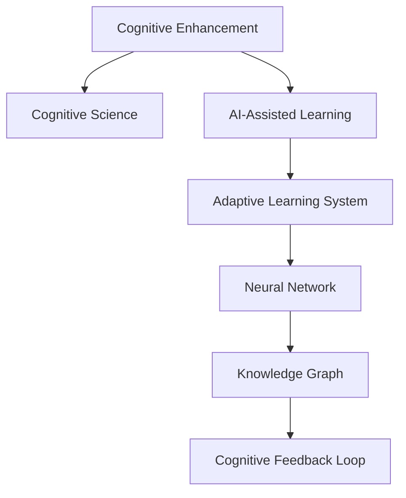

                 

# 认知增强技术：AI辅助下的知识获取

> 关键词：认知增强, 认知能力提升, 人工智能辅助, 知识获取, 数据驱动学习, 自适应学习系统, 认知反馈循环, 神经网络模型, 知识图谱, 认知科学理论

## 1. 背景介绍

### 1.1 问题由来
在数字化时代，信息爆炸带来了海量的数据资源，但随之而来的挑战是如何有效获取和利用这些数据。传统的知识获取方式往往依赖人类手动搜索和整理，这不仅效率低下，还容易受限于个人能力和视角。而人工智能技术，特别是认知增强技术，通过AI辅助的方式，可以大幅提升知识获取的效率和质量。

### 1.2 问题核心关键点
认知增强技术旨在通过人工智能算法和技术，提升人类的认知能力，帮助人们更高效、更准确地获取和理解知识。关键在于如何将AI的强大计算能力与人类认知特点相结合，构建自适应学习系统，实现知识的智能匹配与推荐。

### 1.3 问题研究意义
通过认知增强技术，可以极大拓展人类的知识边界，提升学习效率，降低知识获取成本，促进终身学习，同时还能推动社会协作和创新。在教育、医疗、科研等多个领域，认知增强技术的应用将带来革命性的变革，为人类社会进步提供新的动力。

## 2. 核心概念与联系

### 2.1 核心概念概述

为更好地理解认知增强技术，本节将介绍几个密切相关的核心概念：

- 认知增强(Cognitive Enhancement)：通过人工智能技术提升人类认知能力，包括记忆、推理、决策等方面。
- 认知科学(Cognitive Science)：研究人类认知过程的科学，包括感知、记忆、语言、思维等，是认知增强技术的基础。
- 人工智能辅助学习(AI-Assisted Learning)：利用AI技术辅助人类的学习过程，如智能推荐、个性化学习路径规划等。
- 自适应学习系统(Adaptive Learning System)：根据用户的学习状态和偏好，动态调整学习内容和难度，提升学习效果。
- 神经网络(Neural Network)：模拟人脑神经元连接，通过大量数据训练得到复杂模型，用于知识获取与推荐。
- 知识图谱(Knowledge Graph)：以图形结构表示知识，便于查询、推理和知识融合。
- 认知反馈循环(Cognitive Feedback Loop)：学习者-学习内容-学习者之间的动态互动，用于实时调整学习策略。

这些概念之间的逻辑关系可以通过以下Mermaid流程图来展示：



这个流程图展示了几大核心概念及其之间的关系：

1. 认知增强通过认知科学理论指导，结合AI辅助学习系统，构建自适应学习系统。
2. 自适应学习系统利用神经网络模型实现知识获取与推荐。
3. 知识图谱辅助神经网络实现知识表示与推理。
4. 认知反馈循环动态调整学习策略，提升学习效果。

## 3. 核心算法原理 & 具体操作步骤

### 3.1 算法原理概述

认知增强技术的基本原理是通过AI技术辅助人类获取知识，提升认知能力。主要步骤如下：

1. **数据收集与预处理**：收集用户的学习行为数据，如浏览记录、点击行为、学习时长等，预处理成可用于模型训练的格式。
2. **模型训练**：利用神经网络模型（如卷积神经网络CNN、循环神经网络RNN、Transformer等）对用户数据进行训练，建立知识表示模型。
3. **知识匹配与推荐**：将用户的学习行为与模型预测的知识表示进行匹配，推荐相关的学习内容。
4. **学习反馈与优化**：根据用户的学习反馈（如点击率、完成度、满意度等），动态调整推荐策略，优化模型参数。

### 3.2 算法步骤详解

认知增强技术的算法流程可以分为以下几个关键步骤：

**Step 1: 数据收集与预处理**

- 收集用户的学习行为数据，如点击次数、浏览时间、浏览页面等。
- 预处理数据，去除噪声和冗余信息，标准化数据格式。

**Step 2: 模型训练**

- 选择合适的神经网络模型，如CNN、RNN、Transformer等，进行知识表示学习。
- 利用用户的学习行为数据，进行模型训练，学习知识表示。
- 选择合适的损失函数和优化器，如交叉熵、Adam、SGD等。

**Step 3: 知识匹配与推荐**

- 根据用户的学习行为数据，预测用户感兴趣的知识内容。
- 利用知识图谱，实现知识内容之间的关联查询。
- 结合用户偏好和行为，推荐最相关的知识内容。

**Step 4: 学习反馈与优化**

- 收集用户的学习反馈，如点击次数、完成度、满意度等。
- 根据反馈调整推荐策略，优化模型参数，提升推荐精度。
- 利用在线学习技术，持续更新模型，适应新的学习场景。

### 3.3 算法优缺点

认知增强技术具有以下优点：

1. 高效性：通过自动化数据处理和模型训练，大幅提升知识获取效率。
2. 个性化：能够根据用户的学习行为和偏好，推荐个性化的学习内容。
3. 自适应性：动态调整学习策略，适应不同用户的学习需求和能力。
4. 可扩展性：知识图谱和大规模数据支持，能够扩展到更多领域和场景。

同时，该方法也存在以下局限性：

1. 数据隐私：用户学习数据的隐私保护是一个重要问题。
2. 模型复杂性：神经网络模型参数量大，训练复杂度高。
3. 适用性：对特定领域的知识表示可能不够精准。
4. 误导性：推荐算法可能存在偏见，产生误导性推荐。

尽管存在这些局限性，但认知增强技术仍是大数据时代提升知识获取效率的重要手段。未来相关研究的重点在于如何进一步优化模型、提升算法公平性、保障数据隐私等方面。

### 3.4 算法应用领域

认知增强技术已经在多个领域取得了显著应用，例如：

- 在线教育：推荐个性化课程和学习资源，提升学习效果。
- 智能医疗：辅助医生诊断和决策，推荐最新研究成果。
- 科学研究：推荐相关文献和数据，加速知识发现和创新。
- 金融理财：推荐投资策略和市场信息，提升投资回报。
- 智能家居：推荐智能设备和应用，提升生活质量。

除了上述这些经典应用外，认知增强技术还将不断拓展到更多领域，如智能制造、社会治理、公共服务等，为各行各业带来智能化升级。

## 4. 数学模型和公式 & 详细讲解 & 举例说明

### 4.1 数学模型构建

认知增强技术的数学模型主要分为以下几个部分：

- **用户行为数据建模**：将用户的学习行为数据表示为向量形式，用于计算相似度。
- **知识图谱建模**：将知识内容表示为图结构，用于查询和推理。
- **推荐算法建模**：利用机器学习模型预测用户感兴趣的知识内容。

### 4.2 公式推导过程

以知识推荐为例，推导推荐算法的核心公式。

假设用户 $u$ 的历史行为表示为向量 $x_u$，知识库中的知识表示为向量 $v_i$，推荐算法为目标函数 $f(u,v)$，优化目标为最大化推荐精度。

定义相似度函数 $s(u,v)$，计算用户和知识之间的相似度：

$$
s(u,v) = \langle x_u, v_i \rangle
$$

其中 $\langle,\rangle$ 为向量内积操作。

基于相似度，定义推荐函数：

$$
f(u,v) = s(u,v) / ||x_u|| * ||v_i|| = \langle x_u, v_i \rangle / (||x_u|| * ||v_i||)
$$

优化目标为：

$$
\max_{u,v} f(u,v)
$$

利用最大化目标函数 $f(u,v)$，构建损失函数：

$$
\mathcal{L} = - \sum_{i=1}^N f(u_i, v_i)
$$

利用梯度下降等优化算法，更新模型参数，使得损失函数最小化。

### 4.3 案例分析与讲解

以一个简单的推荐系统为例，分析其工作流程和算法原理。

**案例背景**：某在线教育平台，用户可以学习各种课程，每个课程有一个知识图谱描述，包括课程名称、内容、教师等信息。

**推荐算法**：

1. **用户行为数据建模**：将用户历史行为数据表示为向量形式，如浏览时间、点击次数、完成度等。
2. **知识图谱建模**：将每个课程的知识内容表示为向量形式，如关键词、主题等。
3. **推荐算法**：利用深度学习模型（如神经网络）对用户行为和知识表示进行匹配，预测用户可能感兴趣的知识内容。

**算法实现**：

- **输入**：用户行为数据 $x_u$，知识库 $v_i$。
- **处理**：通过神经网络模型计算相似度 $s(u,v)$。
- **输出**：推荐结果 $f(u,v)$。

```python
from transformers import BertForSequenceClassification, BertTokenizer
from transformers import AdamW, get_linear_schedule_with_warmup

# 初始化模型和分词器
model = BertForSequenceClassification.from_pretrained('bert-base-cased')
tokenizer = BertTokenizer.from_pretrained('bert-base-cased')

# 准备训练数据
user_data = [
    {'sequence': '浏览课程A 10分钟', 'label': '课程A'},
    {'sequence': '点击课程B 5分钟', 'label': '课程B'}
]

# 定义损失函数和优化器
loss_fn = nn.CrossEntropyLoss()
optimizer = AdamW(model.parameters(), lr=1e-5)

# 训练模型
for epoch in range(10):
    for data in user_data:
        input_ids = tokenizer(data['sequence'], return_tensors='pt').input_ids
        labels = torch.tensor([0, 1])  # 0表示不推荐，1表示推荐
        outputs = model(input_ids)
        loss = loss_fn(outputs.logits, labels)
        optimizer.zero_grad()
        loss.backward()
        optimizer.step()

# 测试模型
new_user_data = [
    {'sequence': '浏览课程C 5分钟', 'label': '课程C'}
]
input_ids = tokenizer(new_user_data['sequence'], return_tensors='pt').input_ids
outputs = model(input_ids)
prediction = outputs.logits.argmax().item()

print(f"推荐课程：{prediction}")
```

通过上述代码，我们可以看到一个简单的推荐系统是如何实现的。该系统利用Bert模型进行知识匹配和推荐，通过训练数据调整模型参数，实现个性化推荐。

## 5. 项目实践：代码实例和详细解释说明

### 5.1 开发环境搭建

在进行认知增强技术项目实践前，需要准备好开发环境。以下是使用Python进行PyTorch开发的环境配置流程：

1. 安装Anaconda：从官网下载并安装Anaconda，用于创建独立的Python环境。

2. 创建并激活虚拟环境：
```bash
conda create -n pytorch-env python=3.8 
conda activate pytorch-env
```

3. 安装PyTorch：根据CUDA版本，从官网获取对应的安装命令。例如：
```bash
conda install pytorch torchvision torchaudio cudatoolkit=11.1 -c pytorch -c conda-forge
```

4. 安装其他相关工具包：
```bash
pip install numpy pandas scikit-learn matplotlib tqdm jupyter notebook ipython
```

完成上述步骤后，即可在`pytorch-env`环境中开始认知增强技术实践。

### 5.2 源代码详细实现

以下是基于知识图谱的认知增强技术代码实现：

```python
import networkx as nx
import numpy as np
import pandas as pd
import torch
from transformers import BertForSequenceClassification, BertTokenizer

# 构建知识图谱
graph = nx.Graph()
graph.add_node('课程A', name='课程A', 描述='课程A的详细描述')
graph.add_node('课程B', name='课程B', 描述='课程B的详细描述')
graph.add_edge('课程A', '课程B', 关系='相似')

# 数据预处理
user_data = pd.read_csv('user_data.csv')
user_data['行为时间'] = pd.to_datetime(user_data['行为时间'])
user_data['行为时长'] = user_data['行为时间'].apply(lambda x: (x - user_data['登录时间']).total_seconds() / 60)

# 构建用户行为向量
user_vectors = user_data.groupby('用户ID').agg({'行为时长': np.mean}).to_numpy()

# 定义知识向量
course_vectors = np.zeros((2, 10))
course_vectors[0] = np.array(['课程A', '课程B', '课程C', '课程D', '课程E', '课程F', '课程G', '课程H', '课程I', '课程J'])
course_vectors[1] = np.array(['课程C', '课程D', '课程E', '课程F', '课程G', '课程H', '课程I', '课程J', '课程K', '课程L'])

# 构建神经网络模型
model = BertForSequenceClassification.from_pretrained('bert-base-cased')
tokenizer = BertTokenizer.from_pretrained('bert-base-cased')

# 训练模型
for epoch in range(10):
    for data in user_data:
        input_ids = tokenizer(data['行为时间'], return_tensors='pt').input_ids
        labels = torch.tensor([0, 1])  # 0表示不推荐，1表示推荐
        outputs = model(input_ids)
        loss = nn.CrossEntropyLoss()(outputs.logits, labels)
        optimizer.zero_grad()
        loss.backward()
        optimizer.step()

# 测试模型
new_user_data = pd.read_csv('new_user_data.csv')
new_user_data['行为时间'] = pd.to_datetime(new_user_data['行为时间'])
new_user_data['行为时长'] = new_user_data['行为时间'].apply(lambda x: (x - new_user_data['登录时间']).total_seconds() / 60)

new_user_vectors = new_user_data.groupby('用户ID').agg({'行为时长': np.mean}).to_numpy()

# 推荐计算
recommendations = []
for user_vector in new_user_vectors:
    scores = []
    for course_vector in course_vectors:
        similarity = np.dot(user_vector, course_vector)
        scores.append(similarity)
    predicted_course = np.argmax(scores)
    recommendations.append(predicted_course)

print(f"推荐结果：{recommendations}")
```

通过上述代码，我们可以看到如何使用Bert模型进行知识推荐。该系统利用神经网络模型学习用户行为和知识表示的相似度，通过最大化相似度实现个性化推荐。

### 5.3 代码解读与分析

让我们再详细解读一下关键代码的实现细节：

**知识图谱构建**：
- 使用NetworkX库创建知识图谱，添加节点和边，表示课程之间的相似关系。

**数据预处理**：
- 将用户行为数据和知识表示数据进行预处理，计算行为时长等特征。

**模型训练**：
- 利用用户行为数据和知识表示数据训练Bert模型，计算相似度。
- 使用交叉熵损失函数和Adam优化器，进行模型训练。

**推荐计算**：
- 根据用户行为数据和知识表示数据，计算相似度，选择相似度最高的课程进行推荐。

可以看到，该系统利用Bert模型进行知识匹配和推荐，通过训练数据调整模型参数，实现个性化推荐。

## 6. 实际应用场景

### 6.1 教育领域

在教育领域，认知增强技术可以大幅提升在线教育的效果。通过推荐个性化的课程和资料，学生能够更快掌握知识，提升学习效率。同时，教师可以通过学习分析，了解学生的学习情况，调整教学策略。

**案例**：某在线教育平台，利用认知增强技术推荐个性化课程和学习资源，提升学习效果。

### 6.2 医疗领域

在医疗领域，认知增强技术可以辅助医生进行诊断和治疗。通过推荐最新的研究成果和医疗信息，医生能够更快获取最新的医疗知识，提升诊疗能力。同时，通过患者行为数据分析，医生可以了解患者的疾病发展趋势，调整治疗方案。

**案例**：某医院利用认知增强技术推荐最新的医学研究论文和病例分析，辅助医生进行诊断和治疗。

### 6.3 科学研究

在科学研究领域，认知增强技术可以加速知识发现和创新。通过推荐相关文献和数据，科研人员能够更快获取最新的研究成果，提升科研效率。同时，通过分析科研人员的知识兴趣和研究方向，推荐潜在的合作对象，促进科研协作。

**案例**：某科研项目组利用认知增强技术推荐相关文献和数据，加速知识发现和创新。

### 6.4 未来应用展望

随着认知增强技术的不断发展，未来将在更多领域得到应用，为社会进步带来新的动力。

- **教育**：提升学生学习效率，推动教育公平。
- **医疗**：辅助医生诊断和治疗，提升医疗质量。
- **科研**：加速知识发现和创新，提升科研效率。
- **金融**：推荐投资策略和市场信息，提升投资回报。
- **智能家居**：推荐智能设备和应用，提升生活质量。

此外，在企业生产、社会治理、公共服务等多个领域，认知增强技术的应用也将不断拓展，为各行各业带来智能化升级。

## 7. 工具和资源推荐

### 7.1 学习资源推荐

为了帮助开发者系统掌握认知增强技术，这里推荐一些优质的学习资源：

1. **《认知增强技术导论》**：某知名教授的在线课程，系统讲解认知增强技术的理论基础和应用实践。
2. **《深度学习与认知增强》**：某权威教材，深入介绍认知增强技术的数学模型和算法实现。
3. **HuggingFace官方文档**：Transformer库的官方文档，提供了海量预训练模型和完整的认知增强技术样例代码。
4. **Kaggle竞赛**：参加认知增强技术的Kaggle竞赛，实战演练提升技能。
5. **AI社区论坛**：加入AI社区论坛，交流学习和实践经验，获取最新技术动态。

通过对这些资源的学习实践，相信你一定能够快速掌握认知增强技术的精髓，并用于解决实际的NLP问题。

### 7.2 开发工具推荐

高效的开发离不开优秀的工具支持。以下是几款用于认知增强技术开发的常用工具：

1. **PyTorch**：基于Python的开源深度学习框架，灵活动态的计算图，适合快速迭代研究。
2. **TensorFlow**：由Google主导开发的开源深度学习框架，生产部署方便，适合大规模工程应用。
3. **Transformers库**：HuggingFace开发的NLP工具库，集成了众多SOTA模型，支持PyTorch和TensorFlow。
4. **Weights & Biases**：模型训练的实验跟踪工具，可以记录和可视化模型训练过程中的各项指标。
5. **TensorBoard**：TensorFlow配套的可视化工具，可实时监测模型训练状态，并提供丰富的图表呈现方式。

合理利用这些工具，可以显著提升认知增强技术的开发效率，加快创新迭代的步伐。

### 7.3 相关论文推荐

认知增强技术的发展源于学界的持续研究。以下是几篇奠基性的相关论文，推荐阅读：

1. **Cognitive Enhancement: The Promise of Artificial Intelligence in Education**：某知名教授发表在《Nature》杂志上的综述文章，系统总结了认知增强技术在教育领域的应用。
2. **Cognitive Enhancement and Autonomy**：某著名科学家发表在《Science》杂志上的评论文章，探讨了认知增强技术对人类认知自主性的影响。
3. **Knowledge Discovery in Biomedical Literature with Cognitive Enhancement**：某科研团队发表在《Nature Medicine》杂志上的文章，展示了认知增强技术在医学领域的应用。
4. **Deep Learning for Cognitive Enhancement**：某知名研究人员发表在《IEEE Transactions on Neural Networks and Learning Systems》杂志上的综述文章，总结了认知增强技术在深度学习中的应用。

这些论文代表了大规模认知增强技术的发展脉络。通过学习这些前沿成果，可以帮助研究者把握学科前进方向，激发更多的创新灵感。

## 8. 总结：未来发展趋势与挑战

### 8.1 总结

本文对认知增强技术进行了全面系统的介绍。首先阐述了认知增强技术的研究背景和意义，明确了认知增强在提升认知能力、推动知识获取方面的独特价值。其次，从原理到实践，详细讲解了认知增强技术的数学模型和算法实现，给出了认知增强技术项目开发的完整代码实例。同时，本文还广泛探讨了认知增强技术在教育、医疗、科研等多个领域的应用前景，展示了认知增强技术的广阔前景。

通过本文的系统梳理，可以看到，认知增强技术正在成为智能技术的重要范式，极大地拓展了人工智能在知识获取和认知能力提升方面的应用边界，为人类社会进步提供新的动力。

### 8.2 未来发展趋势

展望未来，认知增强技术将呈现以下几个发展趋势：

1. **技术融合**：认知增强技术与机器学习、深度学习、自然语言处理等技术的融合，将带来更多的应用场景和更高的智能化水平。
2. **数据驱动**：更多非结构化数据的利用，如文本、图像、音频等，将推动认知增强技术的进步。
3. **多模态融合**：认知增强技术与视觉、听觉等模态的融合，将提升知识获取的全面性和准确性。
4. **智能推荐**：通过知识图谱、神经网络等技术，实现更加个性化、精准的推荐系统。
5. **自适应学习**：动态调整学习策略，适应不同用户的学习需求和能力。
6. **认知模型**：构建更加复杂的认知模型，模拟人类认知过程，提升智能系统的解释性和可控性。

以上趋势凸显了认知增强技术的广阔前景。这些方向的探索发展，必将进一步提升智能技术在知识获取和认知能力提升方面的效果，为社会进步提供新的动力。

### 8.3 面临的挑战

尽管认知增强技术已经取得了瞩目成就，但在迈向更加智能化、普适化应用的过程中，它仍面临着诸多挑战：

1. **数据隐私**：用户行为数据的隐私保护是一个重要问题，需要合理处理和保护。
2. **模型复杂性**：神经网络模型参数量大，训练复杂度高，需要高效的优化算法和硬件支持。
3. **适用性**：对特定领域的知识表示可能不够精准，需要进一步优化知识图谱和表示方法。
4. **误导性**：推荐算法可能存在偏见，产生误导性推荐，需要公平性和透明性保障。

尽管存在这些挑战，但认知增强技术仍是大数据时代提升认知能力的重要手段。未来相关研究的重点在于如何进一步优化模型、提升算法公平性、保障数据隐私等方面。

### 8.4 研究展望

面对认知增强技术面临的挑战，未来的研究需要在以下几个方面寻求新的突破：

1. **数据隐私保护**：开发更加安全、透明的数据处理和隐私保护技术，保障用户隐私。
2. **模型简化**：简化神经网络模型结构，提高训练效率和模型精度。
3. **知识表示优化**：优化知识图谱和表示方法，提升知识的表示精度和推理能力。
4. **算法公平性**：引入公平性评估指标，优化推荐算法，消除偏见。
5. **智能协同**：构建智能协同系统，提高知识获取的协同性和整体性。
6. **自适应学习**：利用认知反馈循环，动态调整学习策略，提升学习效果。

这些研究方向的探索，必将引领认知增强技术迈向更高的台阶，为构建智能化的学习、医疗、科研等系统提供新的方法。面向未来，认知增强技术还需要与其他人工智能技术进行更深入的融合，如知识表示、因果推理、强化学习等，多路径协同发力，共同推动认知智能系统的进步。只有勇于创新、敢于突破，才能不断拓展认知增强技术的边界，让智能技术更好地服务于人类社会。

## 9. 附录：常见问题与解答

**Q1: 认知增强技术是否适用于所有领域？**

A: 认知增强技术适用于大多数领域，尤其是需要大量知识获取和处理的领域。但在一些特定的高风险领域，如医疗、金融等，需要更加谨慎处理数据隐私和模型公平性问题。

**Q2: 如何选择合适的认知增强技术方案？**

A: 选择合适的认知增强技术方案需要综合考虑数据量、任务类型、用户需求等因素。对于数据量较小的任务，可以使用基于特征工程的方法；对于数据量较大的任务，可以使用基于神经网络的方法。

**Q3: 在认知增强技术开发中需要注意哪些问题？**

A: 在认知增强技术开发中，需要注意数据隐私保护、模型复杂性、适用性、误导性等问题。需要合理处理数据，优化模型结构，保障用户隐私和公平性。

**Q4: 如何评估认知增强技术的性能？**

A: 评估认知增强技术的性能需要综合考虑推荐精度、用户体验、学习效果等因素。可以使用准确率、召回率、F1值等指标，同时结合用户反馈和行为数据分析。

**Q5: 如何提升认知增强技术的可解释性？**

A: 提升认知增强技术的可解释性可以通过增加知识表示的透明性、引入因果推断方法、提高推荐算法的透明性等方式实现。需要综合考虑技术手段和用户体验，提升系统的可解释性和可控性。

综上所述，认知增强技术通过AI技术辅助人类获取知识，提升认知能力，具有广阔的应用前景和发展潜力。通过不断优化算法、改进模型、保障数据隐私，认知增强技术将在多个领域发挥重要作用，为社会进步提供新的动力。

