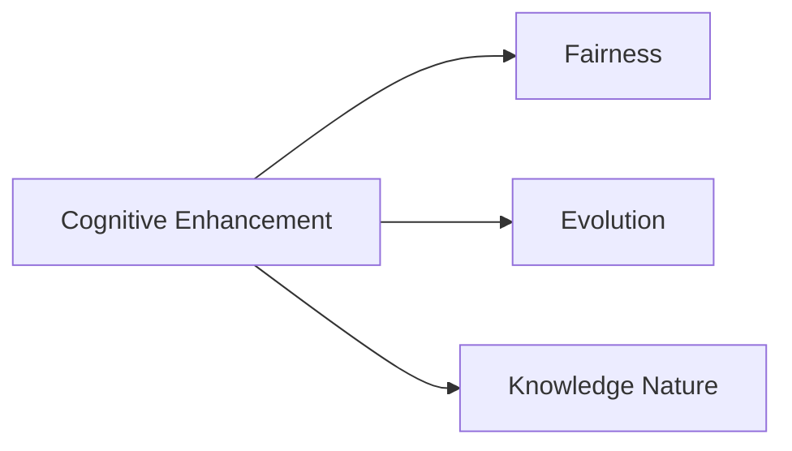

                 

# 认知增强药物：知识获取的伦理边界

## 1. 背景介绍

在人工智能（AI）与生物医学的交叉领域，认知增强药物（Cognitive Enhancing Drugs, CEDs）的研发成为了一个备受关注的焦点。这些药物旨在改善人的认知功能，如记忆力、注意力和执行功能。它们的应用领域广泛，涵盖了教育、学术、职业训练等多个领域。然而，认知增强药物的应用也引发了诸多伦理争议，特别是关于知识获取的伦理边界问题。

### 1.1 认知增强药物的历史与现状

认知增强药物的开发历史可以追溯到20世纪60年代，当时注意力缺陷多动障碍（ADHD）的治疗药物被广泛用于儿童学习困难的研究。此后，随着神经科学研究的发展，认知增强药物开始应用于更广泛的认知功能改善领域。目前，认知增强药物主要分为三类：

- **兴奋剂类**：如甲基苯丙胺（Adderall）、莫达非尼（Modafinil）等，通过增加神经递质的释放和再摄取来增强注意力和警觉性。
- **神经调质类**：如丙戊酸（Valproic Acid）、抗抑郁药（如SSRIs），通过调节神经递质的水平来改善认知功能。
- **神经营养类**：如Omega-3脂肪酸、咖啡因等，通过促进神经元的生长和修复来提升认知表现。

### 1.2 认知增强药物的伦理争议

认知增强药物的伦理争议主要集中在以下两个方面：

- **知识获取的公平性**：认知增强药物可能会让使用者的认知能力超过未使用者的平均水平，导致不公平的教育和就业机会。
- **知识获取的性质**：是否通过改变脑化学或生理状态来获取知识，还是通过提高认知能力来促进学习和记忆，这一点争议很大。

这些争议引发了广泛的社会讨论，并促使伦理学家、神经科学家和政策制定者共同探讨认知增强药物的伦理边界。

## 2. 核心概念与联系

### 2.1 核心概念概述

为了更好地理解认知增强药物在知识获取中的伦理边界，我们需要理解以下几个核心概念：

- **认知增强**：通过药物手段提升个体认知功能的过程。
- **公平性**：知识获取的机会应平等地分配给所有人。
- **自然进化**：人类认知能力的自然发展与药物干预之间的平衡。
- **知识性质**：通过认知增强药物获取的知识的来源和本质。

### 2.2 核心概念之间的联系

认知增强药物的伦理边界问题，涉及知识获取的公平性、自然进化和知识性质三个核心概念。

- **公平性**：认知增强药物可能会打破知识获取的机会公平性，特别是当只有一部分人可以获取这种认知提升时。
- **自然进化**：认知增强药物的干预可能会影响自然进化过程，特别是对于儿童和青少年的认知发展。
- **知识性质**：通过药物获取的知识是否真正属于个体，还是通过外力干预获得，这个问题直接关系到认知增强药物的伦理接受度。

这些概念之间的联系可以通过以下Mermaid流程图来展示：



该流程图展示了认知增强药物与公平性、自然进化和知识性质之间的关系。

## 3. 核心算法原理 & 具体操作步骤

### 3.1 算法原理概述

认知增强药物的伦理边界问题，可以通过计算和模拟的方法来探究。假设我们有一个认知能力为 $C$ 的个体，通过认知增强药物，其认知能力提升为 $C'$。我们关注的是 $C'$ 如何影响知识获取的公平性和自然进化。

### 3.2 算法步骤详解

为了更好地理解认知增强药物对知识获取的影响，我们可以采用以下步骤进行分析和计算：

1. **设定认知能力提升模型**：使用数学模型描述认知能力提升的过程，包括药物的作用机制和效果。
2. **模拟公平性影响**：通过计算不同个体在药物作用下的认知能力差异，评估公平性问题。
3. **模拟自然进化影响**：分析认知增强药物对自然认知发展的潜在影响。
4. **模拟知识性质**：探讨通过认知增强药物获取的知识的来源和本质。

### 3.3 算法优缺点

认知增强药物的伦理边界问题是一个复杂的系统性问题，现有算法方法存在以下优缺点：

**优点**：
- 通过数学模型和模拟，能够系统性地分析认知增强药物对公平性、自然进化和知识性质的影响。
- 能够量化药物对认知能力的影响，提供基于数据的决策支持。

**缺点**：
- 模型假设可能过于简单，无法完全描述复杂的人体和药物相互作用。
- 缺乏实验数据，模拟结果的准确性有限。

### 3.4 算法应用领域

认知增强药物的伦理边界问题，涉及教育、医疗、职场等多个领域。通过算法分析，可以为这些领域的政策制定提供参考。

- **教育**：认知增强药物的应用可能会改变教育的公平性，政策制定者需要考虑如何在公平性与效率之间平衡。
- **医疗**：认知增强药物的应用需考虑到患者的风险和收益，以及可能引发的社会公平问题。
- **职场**：认知增强药物在职场中的应用可能引发就业竞争的不公平，政策制定者需要制定合理的监管措施。

## 4. 数学模型和公式 & 详细讲解 & 举例说明

### 4.1 数学模型构建

为了构建认知增强药物的数学模型，我们假设个体的认知能力 $C$ 可以表示为一个函数 $f$ 的输出：

$$ C = f(\text{基因}, \text{环境}, \text{认知训练}, \text{药物}) $$

其中，基因和环境是影响认知能力的基础因素，认知训练是个体通过学习和实践提升认知能力的过程，药物是认知增强的干预手段。

### 4.2 公式推导过程

假设药物 $D$ 对认知能力的提升作用为一个线性变换：

$$ C' = C + k \cdot D $$

其中，$k$ 表示药物的认知提升系数。通过这个公式，我们可以计算不同个体在药物作用下的认知能力提升。

### 4.3 案例分析与讲解

以一个简单的案例来说明如何使用数学模型分析认知增强药物的伦理边界问题：

假设有一群学生，他们的基础认知能力通过基因和环境测试为 $C_1, C_2, \ldots, C_n$。如果给这组学生使用认知增强药物 $D$，每个学生的认知能力提升为 $C'_1, C'_2, \ldots, C'_n$。我们可以通过计算 $C'_1 - C_1, C'_2 - C_2, \ldots, C'_n - C_n$ 来评估公平性问题。

## 5. 项目实践：代码实例和详细解释说明

### 5.1 开发环境搭建

为了进行认知增强药物的模拟分析，我们需要搭建一个Python开发环境，并确保所有必要的库都已安装。

1. 安装Python：选择最新的Python版本，并确保环境变量配置正确。
2. 安装必要的库：如NumPy、Pandas、SciPy等。
3. 使用Jupyter Notebook或其他交互式环境进行开发。

### 5.2 源代码详细实现

以下是一个简单的Python代码示例，用于计算不同个体在认知增强药物作用下的认知能力提升：

```python
import numpy as np

# 假设初始认知能力
C = np.array([80, 85, 75, 90])

# 假设药物对认知能力的提升系数
k = 0.2

# 计算使用药物后的认知能力
C_prime = C + k * np.ones_like(C)

# 计算认知能力提升
delta_C = C_prime - C

# 输出结果
print(delta_C)
```

### 5.3 代码解读与分析

这段代码计算了每个学生在认知增强药物作用下的认知能力提升。通过计算 $C'_1 - C_1, C'_2 - C_2, \ldots, C'_n - C_n$，我们可以直观地看到药物对认知能力的影响。

## 6. 实际应用场景

### 6.1 教育公平性

在教育领域，认知增强药物的应用可能引发公平性问题。通过模拟分析，政策制定者可以制定合理的监管措施，确保教育机会的公平性。

**案例**：假设有一所学校，部分学生使用了认知增强药物，而其他学生没有。通过模拟，可以计算出使用药物的学生的认知能力提升情况，并评估这种提升是否公平。

### 6.2 医疗风险评估

在医疗领域，认知增强药物的应用需考虑到患者的风险和收益。通过模拟分析，医生可以评估药物的疗效和副作用。

**案例**：假设一位患者有认知功能障碍，医生考虑是否使用认知增强药物。通过模拟，可以评估药物对患者认知能力提升的效果，并评估可能的风险。

### 6.3 职场竞争

在职场领域，认知增强药物的应用可能引发就业竞争的不公平。通过模拟分析，企业可以制定合理的招聘策略，确保就业机会的公平性。

**案例**：假设一家公司准备招聘新员工，部分应聘者使用了认知增强药物。通过模拟，可以计算出使用药物的应聘者的认知能力提升情况，并评估这种提升是否公平。

## 7. 工具和资源推荐

### 7.1 学习资源推荐

为了深入理解认知增强药物的伦理边界问题，以下是一些推荐的资源：

1. **《认知增强药物伦理研究》**：探讨认知增强药物对知识获取的伦理影响。
2. **《人工智能与伦理》**：分析AI技术在医疗、教育等领域的应用伦理问题。
3. **《神经科学与认知增强》**：探讨神经科学视角下的认知增强药物。
4. **《认知增强药物案例分析》**：通过具体案例分析，探讨认知增强药物的伦理边界。

### 7.2 开发工具推荐

以下是一些用于认知增强药物模拟分析的工具：

1. **Python**：用于编写认知增强药物的数学模型和模拟分析代码。
2. **Jupyter Notebook**：用于交互式分析和可视化结果。
3. **Simio**：用于系统模拟和仿真。

### 7.3 相关论文推荐

以下是一些关于认知增强药物伦理边界问题的经典论文：

1. **《认知增强药物的伦理问题》**：探讨认知增强药物在教育、医疗领域的伦理边界。
2. **《认知增强药物对公平性的影响》**：分析认知增强药物对知识获取公平性的影响。
3. **《认知增强药物的未来展望》**：探讨认知增强药物在认知功能提升和知识获取中的应用前景。

## 8. 总结：未来发展趋势与挑战

### 8.1 研究成果总结

认知增强药物的伦理边界问题是一个复杂且多维度的系统性问题。通过计算和模拟，我们能够系统地分析药物对知识获取的公平性、自然进化和知识性质的影响。这些分析为政策制定和应用推广提供了科学依据。

### 8.2 未来发展趋势

未来，认知增强药物的伦理边界问题将继续受到广泛关注，并可能引发更多的研究和讨论。以下是几个发展趋势：

- **技术进步**：随着神经科学和药物研究的发展，认知增强药物的疗效和安全性将得到进一步提升。
- **政策制定**：政策制定者将更加重视认知增强药物的伦理问题，并制定相应的监管措施。
- **公共讨论**：社会各界将更加关注认知增强药物的应用，形成更为广泛的公共讨论。

### 8.3 面临的挑战

认知增强药物的伦理边界问题仍然面临诸多挑战：

- **数据缺乏**：现有研究的数据往往有限，无法全面覆盖各种情况。
- **模型假设**：模型假设可能过于简单，难以全面描述复杂的人体和药物相互作用。
- **公平性问题**：认知增强药物的应用可能引发公平性争议，需进一步探讨解决方案。

### 8.4 研究展望

未来的研究需要在以下几个方面寻求新的突破：

- **多学科融合**：将神经科学、伦理学、政策学等多学科知识融合，综合分析认知增强药物的伦理边界。
- **大数据应用**：利用大数据和人工智能技术，提高认知增强药物研究和应用的科学性和精确性。
- **伦理边界共识**：通过跨领域专家和公众讨论，形成对认知增强药物伦理边界的共识。

## 9. 附录：常见问题与解答

### Q1: 什么是认知增强药物？

A: 认知增强药物是指通过药物手段提升个体认知功能，如记忆力、注意力和执行功能。

### Q2: 认知增强药物在知识获取中的伦理边界问题主要有哪些？

A: 认知增强药物在知识获取中的伦理边界问题主要集中在知识获取的公平性、自然进化和知识性质三个方面。

### Q3: 如何评估认知增强药物对公平性的影响？

A: 通过计算不同个体在认知增强药物作用下的认知能力提升，可以评估药物对公平性的影响。

### Q4: 认知增强药物的应用面临哪些挑战？

A: 认知增强药物的应用面临数据缺乏、模型假设过于简单以及公平性问题等挑战。

### Q5: 认知增强药物的未来展望是什么？

A: 未来，认知增强药物的伦理边界问题将继续受到广泛关注，技术进步、政策制定和公共讨论将是重要方向。

---

作者：禅与计算机程序设计艺术 / Zen and the Art of Computer Programming

