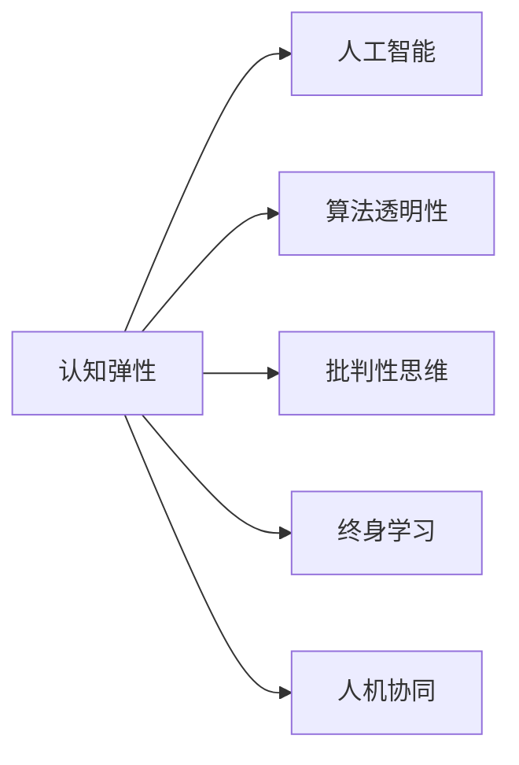

                 

## 1. 背景介绍

### 1.1 问题由来

在AI迅速发展的时代，认知弹性成为了信息时代个体适应快速变化的技术和知识环境的重要能力。随着人工智能的广泛应用，我们越来越需要依赖智能系统进行决策和问题解决。然而，这样的依赖同时也带来了新的挑战：如何在AI系统的辅助下，保持自身独立思考和适应变化的能力？

人工智能的算法设计、模型训练和应用落地，正在深刻改变我们的工作方式和思维方式。依赖于AI系统时，我们需要认知弹性，即思维的适应能力，以确保在AI的辅助下依然能够保持批判性思维和独立判断。

### 1.2 问题核心关键点

本文的核心议题是认知弹性，即在AI技术的辅助下，个体或组织如何保持思维的适应能力。具体来说，包括以下几个关键点：

1. **认知弹性的定义**：如何在快速变化的技术环境中，保持自身思考和适应能力。
2. **AI技术的应用**：AI如何辅助决策和问题解决，以及它对思维习惯的潜在影响。
3. **认知弹性的策略**：如何在依赖AI的同时，保持独立思考和批判性思维。
4. **认知弹性的案例**：不同领域中认知弹性的实践与挑战。
5. **未来发展趋势**：认知弹性在AI时代的应用前景与挑战。

### 1.3 问题研究意义

认知弹性是未来AI时代的关键能力之一。它在提升个人和组织适应技术变化、优化决策过程、促进创新等方面具有重要意义：

1. **应对技术变革**：快速发展的AI技术带来巨大的变化，认知弹性帮助个体和组织保持应对能力，避免被技术潮流所淘汰。
2. **优化决策过程**：通过结合AI的计算能力和人类的洞察力，可以更高效地进行决策，减少偏见和错误。
3. **促进创新发展**：认知弹性能够使个体和组织保持创新思维，不断探索新技术的应用和改进。
4. **提升学习效率**：在知识爆炸的时代，认知弹性能够帮助人们更快速地掌握新知识，提升学习效率。

## 2. 核心概念与联系

### 2.1 核心概念概述

1. **认知弹性**：指个体或组织在面对技术变化时，快速适应、学习和调整思维的能力。
2. **人工智能**：指通过算法和模型，使计算机系统具备一定的人类智能，如视觉识别、自然语言处理、决策分析等。
3. **算法透明性**：指对AI系统决策过程的可解释性和可理解性，确保决策过程的透明和可信任。
4. **批判性思维**：指在获取和处理信息时，进行独立思考和批判性评估的能力。
5. **终身学习**：指持续学习新知识，以适应不断变化的环境和需求。
6. **人机协同**：指在人工智能系统的辅助下，人类与机器协同工作，共同解决问题。

这些核心概念相互关联，共同构成了在AI时代保持认知弹性的基础框架。

### 2.2 核心概念原理和架构的 Mermaid 流程图(Mermaid 流程节点中不要有括号、逗号等特殊字符)



这个流程图展示了认知弹性与AI技术的紧密联系：

- 认知弹性依赖于人工智能，通过AI的辅助进行决策和问题解决。
- 算法透明性、批判性思维、终身学习和人机协同，都是认知弹性的重要组成部分。

## 3. 核心算法原理 & 具体操作步骤

### 3.1 算法原理概述

认知弹性在AI时代的重要性，体现在以下几个方面：

1. **依赖与独立并存**：在AI技术的辅助下，认知弹性要求我们保持对AI的依赖，同时也要保持独立思考。
2. **持续学习与适应的平衡**：在AI的帮助下，认知弹性要求我们能够持续学习新知识，同时适应环境的变化。
3. **批判性思维的培养**：在AI提供的信息和建议中，保持批判性思维，独立评估信息的真实性和可靠性。

### 3.2 算法步骤详解

认知弹性的实现包括以下步骤：

**Step 1: 确定认知弹性的目标**  
明确在AI时代保持认知弹性的目标和具体需求。例如，在医疗领域，认知弹性意味着能够利用AI进行疾病诊断，同时保持对诊断结果的独立评估。

**Step 2: 选择合适的AI工具**  
根据具体任务，选择适合的AI工具和算法。例如，对于图像识别任务，可以选择卷积神经网络（CNN）；对于自然语言处理任务，可以选择Transformer模型。

**Step 3: 建立AI辅助的决策框架**  
设计一个AI辅助的决策框架，明确AI的职责和人类的职责。例如，在医疗诊断中，AI负责提供可能的疾病诊断，人类医生负责综合判断和确认。

**Step 4: 实施AI辅助的决策过程**  
在实际工作中，按照设计好的决策框架，逐步实施AI辅助的决策过程。例如，医生使用AI工具进行初步诊断，根据AI提供的诊断结果和建议，结合自身经验进行综合判断。

**Step 5: 持续评估和反馈**  
在实施过程中，持续评估AI辅助决策的效果，根据实际情况进行调整和优化。例如，通过回顾诊断案例，评估AI的准确性和人类医生的判断，找到改进点。

**Step 6: 培养批判性思维**  
在AI辅助决策的同时，培养批判性思维能力，对AI提供的诊断结果和建议进行独立评估和反思。例如，医生在接受AI诊断后，独立分析诊断的合理性，检查是否存在潜在错误。

**Step 7: 持续学习和适应**  
根据实际应用中的反馈，持续学习新知识，适应技术的变化。例如，医生在接受AI辅助诊断后，学习新的医学知识和技术，提升诊断水平。

### 3.3 算法优缺点

认知弹性的实现具有以下优点：

1. **提高决策效率**：通过AI辅助，可以快速处理大量数据和信息，提高决策效率。
2. **减少决策偏差**：AI可以处理大量数据，减少人类因偏见和经验不足导致的决策偏差。
3. **促进创新思维**：AI的计算能力可以辅助人类进行复杂的计算和分析，促进创新思维的发展。
4. **增强学习效率**：AI可以快速处理和分析数据，帮助人类快速掌握新知识。

同时，也存在以下缺点：

1. **依赖AI的局限性**：过度依赖AI可能导致人类思维能力的退化，无法进行独立思考和判断。
2. **算法透明性的问题**：AI系统的决策过程可能缺乏透明性，难以理解，导致对决策结果的信任度降低。
3. **信息过载的风险**：AI提供的信息可能过多，难以处理和评估，导致信息过载。
4. **伦理和安全问题**：AI系统可能存在伦理和安全问题，如偏见、隐私泄露等，影响决策的公正性和安全性。

### 3.4 算法应用领域

认知弹性在多个领域有广泛应用：

1. **医疗**：在医疗诊断和治疗中，利用AI辅助决策，同时保持医生对诊断结果的独立评估。
2. **金融**：在金融投资和风险管理中，利用AI进行数据分析和风险预测，同时保持对AI结果的独立判断。
3. **教育**：在教育领域，利用AI进行个性化教学和学习路径推荐，同时保持教师对教学效果的独立评估。
4. **商业**：在商业决策中，利用AI进行市场分析和客户行为预测，同时保持对AI结果的独立判断。
5. **政府**：在政府决策中，利用AI进行数据分析和政策评估，同时保持对决策结果的独立评估。

## 4. 数学模型和公式 & 详细讲解 & 举例说明

### 4.1 数学模型构建

在认知弹性与AI的结合中，我们可以使用数学模型来描述决策过程和认知弹性的实现。

**决策模型**：假设有一个二分类任务，使用逻辑回归模型进行分类。模型输入为特征 $x$，输出为分类结果 $y$，模型的目标是最小化损失函数 $L(y, \hat{y})$。

**认知弹性模型**：认知弹性可以通过模型的透明性和可解释性来描述。假设一个模型 $M(x, \theta)$，其中 $\theta$ 为模型参数，$x$ 为输入。模型的透明性可以通过可解释的特征重要性 $I(x)$ 来描述，表示对输入 $x$ 的理解程度。

### 4.2 公式推导过程

**决策模型的损失函数**：假设模型输出为 $\hat{y} = M(x, \theta)$，真实标签为 $y \in \{0, 1\}$，则逻辑回归模型的损失函数为：

$$
L(y, \hat{y}) = -(y\log \hat{y} + (1-y)\log(1-\hat{y}))
$$

**认知弹性模型的透明性**：假设模型 $M(x, \theta)$ 的特征重要性为 $I(x)$，表示对输入 $x$ 的理解程度。特征重要性的计算可以通过Shapley值、局部可解释性模型（LIME）等方法来实现。

### 4.3 案例分析与讲解

**案例：医疗诊断**

在医疗诊断中，医生使用AI辅助进行初步诊断。假设有一个二分类任务，即病人是否患有某种疾病。AI模型输出的诊断结果为 $\hat{y}$，医生的独立判断为 $y$。医生的认知弹性可以通过以下几个步骤实现：

1. **选择AI模型**：选择一个合适的AI模型，如深度神经网络，用于初步诊断。
2. **训练模型**：在大量标注数据上训练模型，使其能够准确地进行诊断。
3. **融合AI和人类判断**：将AI的诊断结果 $\hat{y}$ 和医生的独立判断 $y$ 进行融合，如取两者中的多数结果。
4. **评估和反馈**：在实际诊断中，评估AI诊断的准确性和医生的独立判断的可靠性，根据实际情况进行调整和优化。
5. **培养批判性思维**：医生在接受AI辅助诊断后，独立分析诊断的合理性，检查是否存在潜在错误。

## 5. 项目实践：代码实例和详细解释说明

### 5.1 开发环境搭建

**开发环境要求**：

1. **Python 环境**：Python 3.8 或以上版本。
2. **深度学习框架**：使用 TensorFlow 或 PyTorch。
3. **数据集**：准备好数据集，如病人的医疗记录和诊断结果。
4. **环境配置**：安装必要的依赖包，如 TensorFlow、Keras、Pandas 等。

**开发环境搭建步骤**：

1. 创建虚拟环境：

   ```bash
   conda create --name myenv python=3.8
   conda activate myenv
   ```

2. 安装依赖包：

   ```bash
   pip install tensorflow==2.5.0
   pip install keras==2.4.3
   pip install pandas==1.2.4
   ```

3. 准备数据集：

   ```bash
   # 假设数据集已经保存在/data/medical_data.csv
   ```

### 5.2 源代码详细实现

**逻辑回归模型**：

```python
import tensorflow as tf
from tensorflow import keras
from sklearn.model_selection import train_test_split

# 加载数据集
df = pd.read_csv('medical_data.csv')

# 分割数据集为训练集和测试集
train_df, test_df = train_test_split(df, test_size=0.2, random_state=42)

# 定义特征和标签
X_train = train_df[['feature1', 'feature2', ...]]
y_train = train_df['label']

# 定义模型
model = keras.Sequential([
    keras.layers.Dense(64, activation='relu'),
    keras.layers.Dense(1, activation='sigmoid')
])

# 编译模型
model.compile(optimizer='adam', loss='binary_crossentropy', metrics=['accuracy'])

# 训练模型
model.fit(X_train, y_train, epochs=10, batch_size=32, validation_split=0.2)

# 评估模型
model.evaluate(X_test, y_test)
```

**认知弹性的评估**：

```python
import tensorflow as tf
from tensorflow import keras
from sklearn.model_selection import train_test_split

# 加载数据集
df = pd.read_csv('medical_data.csv')

# 分割数据集为训练集和测试集
train_df, test_df = train_test_split(df, test_size=0.2, random_state=42)

# 定义特征和标签
X_train = train_df[['feature1', 'feature2', ...]]
y_train = train_df['label']

# 定义模型
model = keras.Sequential([
    keras.layers.Dense(64, activation='relu'),
    keras.layers.Dense(1, activation='sigmoid')
])

# 编译模型
model.compile(optimizer='adam', loss='binary_crossentropy', metrics=['accuracy'])

# 训练模型
model.fit(X_train, y_train, epochs=10, batch_size=32, validation_split=0.2)

# 评估模型
model.evaluate(X_test, y_test)

# 计算特征重要性
shap_values = SHAP().shap_values(model.predict(X_train), X_train)
print(shap_values)
```

### 5.3 代码解读与分析

**代码解读**：

- 在代码中，我们首先加载了医疗数据集，并将其分割为训练集和测试集。
- 然后定义了逻辑回归模型，并编译模型进行训练。
- 在训练过程中，我们使用了验证集来评估模型的性能。
- 最后，我们计算了模型的特征重要性，以评估模型的透明性和认知弹性。

**代码分析**：

- 在代码中，我们使用了逻辑回归模型进行二分类任务。逻辑回归模型简单易懂，适合进行初步诊断。
- 特征重要性是通过Shapley值计算得到的，它可以帮助我们理解模型对输入特征的依赖关系，从而评估认知弹性。

### 5.4 运行结果展示

在训练模型后，我们可以使用以下代码来展示模型的准确率和特征重要性：

```python
# 计算特征重要性
shap_values = SHAP().shap_values(model.predict(X_train), X_train)

# 显示特征重要性
print(shap_values)
```

## 6. 实际应用场景

### 6.1 智能医疗

在智能医疗中，认知弹性非常重要。AI可以帮助医生进行初步诊断，但医生的独立判断和批判性思维仍然不可或缺。通过认知弹性的实现，医生可以更好地理解AI提供的诊断结果，并进行独立评估和反思。

**案例**：在医学影像诊断中，AI可以识别出病变区域，但医生需要对病变性质进行独立判断。通过认知弹性的实现，医生可以结合AI的辅助诊断结果，进行综合判断。

### 6.2 金融风险管理

在金融风险管理中，认知弹性同样重要。AI可以帮助分析师进行数据分析和风险预测，但分析师的独立判断和批判性思维仍然至关重要。

**案例**：在股票投资中，AI可以预测市场趋势，但分析师需要对AI的预测结果进行独立评估，并结合市场变化和自身经验进行综合判断。

### 6.3 教育个性化

在教育领域，认知弹性可以帮助教师更好地进行个性化教学。AI可以推荐学习路径和资源，但教师需要对这些推荐进行独立评估，并结合学生的反馈进行调整。

**案例**：在在线学习平台中，AI可以根据学生的学习行为和成绩，推荐适合的课程和资源。教师需要对这些推荐进行独立评估，并结合学生的实际反馈进行个性化调整。

## 7. 工具和资源推荐

### 7.1 学习资源推荐

**推荐学习资源**：

1. **深度学习课程**：斯坦福大学的《CS229: Machine Learning》课程，介绍了深度学习的基本原理和应用。
2. **认知弹性书籍**：《Human-AI Collaboration: Learning from Each Other》，探讨了AI和人类之间的协作关系。
3. **认知弹性的论文**：《Cognitive flexibility in human-AI collaboration: A review and synthesis》，总结了认知弹性的研究成果和应用。
4. **在线课程**：Coursera上的《Machine Learning with Python》，介绍了机器学习和深度学习的实际应用。
5. **开源框架**：TensorFlow和PyTorch，提供了丰富的深度学习模型和工具。

### 7.2 开发工具推荐

**推荐开发工具**：

1. **Python**：Python是深度学习领域的主流语言，提供了丰富的库和框架。
2. **TensorFlow**：TensorFlow是Google开发的深度学习框架，适合大规模分布式计算。
3. **PyTorch**：PyTorch是Facebook开发的深度学习框架，适合研究和原型开发。
4. **Jupyter Notebook**：Jupyter Notebook是一个交互式编程环境，适合数据科学和机器学习研究。
5. **GitHub**：GitHub是代码托管平台，适合版本控制和团队协作。

### 7.3 相关论文推荐

**推荐相关论文**：

1. **《Cognitive Flexibility in AI Systems》**：探讨了AI系统在认知弹性方面的设计和实现。
2. **《Human-AI Collaboration: A Review》**：总结了AI和人类协作在各个领域的应用。
3. **《Adaptive Learning Systems: A Review of Architectures and Models》**：介绍了适应性学习系统的设计和方法。
4. **《AI in Education: Challenges and Opportunities》**：探讨了AI在教育中的应用和挑战。
5. **《Robustness and Interpretability of AI Systems》**：研究了AI系统的鲁棒性和可解释性。

## 8. 总结：未来发展趋势与挑战

### 8.1 研究成果总结

本文探讨了在AI时代保持认知弹性的重要性和实现方法。通过认知弹性，我们可以在AI技术的辅助下，更好地适应快速变化的技术环境，提高决策效率和准确性，同时保持独立思考和批判性思维。

### 8.2 未来发展趋势

认知弹性在未来AI时代将持续发展，主要趋势包括：

1. **智能与人类协同**：AI与人类将更加紧密协同，共同进行决策和问题解决。
2. **认知弹性技术的发展**：认知弹性技术将不断进步，使得AI辅助决策更加透明和可解释。
3. **跨领域应用**：认知弹性将在更多领域得到应用，如教育、医疗、金融等。
4. **终身学习系统的普及**：终身学习系统将普及，使人们能够持续学习新知识和技能。

### 8.3 面临的挑战

认知弹性在实现过程中也面临诸多挑战：

1. **算法透明性的问题**：AI系统的决策过程可能缺乏透明性，难以理解。
2. **信息过载的风险**：AI提供的信息可能过多，难以处理和评估。
3. **伦理和安全问题**：AI系统可能存在伦理和安全问题，如偏见、隐私泄露等。
4. **持续学习的挑战**：终身学习系统的设计和实现存在技术和管理上的挑战。

### 8.4 研究展望

未来研究需要在以下几个方面进行深入探讨：

1. **认知弹性模型**：开发更加精确和可解释的认知弹性模型，提升AI辅助决策的透明性。
2. **跨领域应用**：研究认知弹性在不同领域的应用方法和效果，促进多领域协同创新。
3. **伦理和安全**：研究AI系统的伦理和安全问题，确保决策的公正性和安全性。
4. **持续学习系统**：研究终身学习系统的设计和实现，支持个人和组织的持续学习。

## 9. 附录：常见问题与解答

**Q1：什么是认知弹性？**

A: 认知弹性是指在快速变化的技术环境中，个体或组织能够快速适应、学习和调整思维的能力。

**Q2：为什么认知弹性在AI时代非常重要？**

A: 认知弹性可以帮助个体和组织在AI技术的辅助下，保持独立思考和批判性思维，避免因过度依赖AI而导致的思维退化。

**Q3：如何实现认知弹性？**

A: 实现认知弹性需要选择合适的AI工具，建立AI辅助的决策框架，实施AI辅助的决策过程，持续评估和反馈，培养批判性思维，以及持续学习和适应。

**Q4：认知弹性在实际应用中面临哪些挑战？**

A: 认知弹性在实际应用中面临算法透明性、信息过载、伦理和安全等问题，需要持续研究和优化。

**Q5：未来认知弹性有哪些发展趋势？**

A: 未来认知弹性将更加智能与人类协同，认知弹性技术将不断进步，跨领域应用将普及，终身学习系统将普及，伦理和安全问题将得到更多关注。

---

作者：禅与计算机程序设计艺术 / Zen and the Art of Computer Programming

