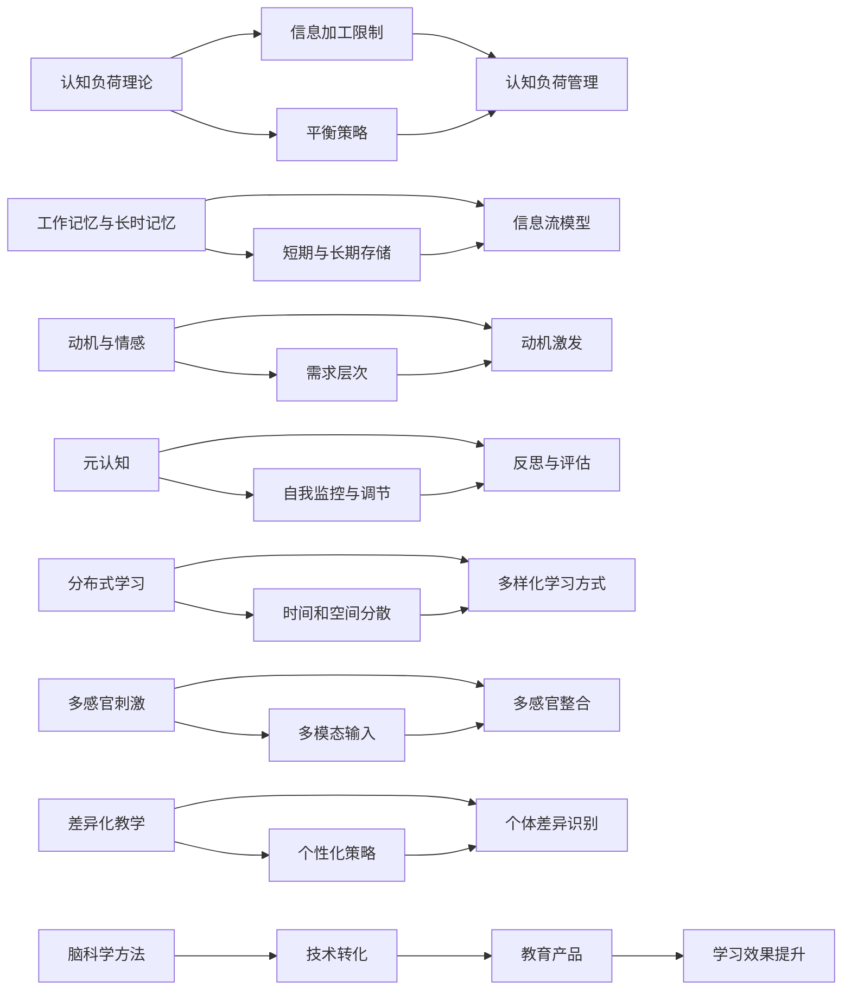

                 

# 认知科学与教育革新：基于脑科学的学习方法

## 1. 背景介绍

### 1.1 问题由来

近年来，随着人工智能(AI)技术的发展，尤其是深度学习模型的兴起，学术界和工业界对认知科学的兴趣日益高涨。一方面，AI模型在图像识别、语音识别、自然语言处理等领域取得了巨大成功，显示出超乎想象的学习和推理能力；另一方面，对人类认知过程的理解，尤其是学习机制的研究，为AI模型的进一步优化提供了重要的理论支撑。

教育领域历来以心理学、神经科学为基础，但在现代教育背景下，传统的教学方法面临诸多挑战：

- **知识与技能脱节**：当前的教育体系往往重视知识的传授，而忽视了技能的培养，导致学生无法灵活运用所学知识解决实际问题。
- **个性化学习不足**：千篇一律的教学模式无法适应每个学生的独特需求，无法有效激发学生的内在学习动力。
- **学习效率低下**：传统教学方法往往依赖死记硬背，缺乏有效的理解性记忆，导致学习效率低下。

为了应对这些挑战，教育科技公司开始探索基于脑科学的学习方法，利用认知科学理论和技术，设计出更加高效、个性化的教育产品，旨在提升学习效果和体验。

### 1.2 问题核心关键点

基于脑科学的学习方法，其核心在于将认知科学理论应用到教育实践中，旨在优化学习过程，提升学习效率和效果。以下是基于脑科学的学习方法的几个核心关键点：

1. **认知负荷理论**：学习过程中，信息处理的能力是有限的，因此需要在信息量和学习难度之间取得平衡，避免过载。

2. **工作记忆与长时记忆**：工作记忆是短期的、有意识的信息处理，而长时记忆是长期、无意识的信息存储。优化学习策略，需结合两者的特性。

3. **动机与情感**：学习动机和情感体验对学习效果有重要影响。方法应激发学生的内在动机，增强其学习兴趣和自信。

4. **元认知**：元认知是关于认知的认知，即对认知过程的自我监控、调节和反思。引导学生进行有效的元认知，能提升学习自我管理能力。

5. **分布式学习**：将学习过程分散到多个时间和空间，有助于减少学习负担，增强记忆效果。

6. **多感官刺激**：结合视觉、听觉、触觉等多感官输入，有助于增强记忆和理解。

7. **差异化教学**：根据学生的个体差异，采用差异化的教学策略，满足不同学习需求。

## 2. 核心概念与联系

### 2.1 核心概念概述

基于脑科学的学习方法涉及多个关键概念，这些概念共同构成了教育革新的理论基础和技术手段：

- **认知负荷理论**：由Sweller在1988年提出，认为学习过程中的信息加工存在容量限制，需要在认知负荷和知识学习之间取得平衡。

- **工作记忆与长时记忆**：由Atkinson和Shiffrin在1968年提出的双重记忆模型认为，工作记忆是短期、有意识的信息加工，长时记忆是长期、无意识的信息存储。

- **动机与情感**：由Maslow在1943年提出的需求层次理论认为，人类的需求分为五个层次，其中自我实现需求能够激发最高层次的学习动机。

- **元认知**：由Flavell在1976年提出的元认知理论，认为元认知是对认知过程的自我监控和调节。

- **分布式学习**：由Jensen在2008年提出，强调将学习过程分散到多个时间和空间，有助于减轻学习负担，增强记忆效果。

- **多感官刺激**：结合视觉、听觉、触觉等多感官输入，有助于增强记忆和理解。

- **差异化教学**：根据学生的个体差异，采用差异化的教学策略，满足不同学习需求。

这些概念通过神经网络、深度学习、自然语言处理等技术手段，实现了在教育实践中的转化和应用。

### 2.2 核心概念原理和架构的 Mermaid 流程图



该流程图展示了基于脑科学的学习方法在教育中的整体架构：通过认知负荷管理、工作记忆与长时记忆管理、动机激发、元认知引导、分布式学习、多感官刺激和差异化教学等策略，结合神经网络、深度学习、自然语言处理等技术手段，最终实现教育产品的优化和教育效果的提升。

## 3. 核心算法原理 & 具体操作步骤

### 3.1 算法原理概述

基于脑科学的学习方法，其核心在于结合认知科学理论和技术，设计出更加高效、个性化的学习策略和教育产品。以下对其中几个核心算法的原理进行概述：

#### 3.1.1 认知负荷理论

认知负荷理论认为，学习过程中信息加工的容量是有限的，因此需要在认知负荷和学习难度之间取得平衡。该理论通过计算信息量和学习难度的组合，判断学习的可行性和效果，进而指导学习策略的设计。

#### 3.1.2 工作记忆与长时记忆

工作记忆与长时记忆模型认为，学习过程中信息的存储和提取可以分为短期和长期两个阶段。通过设计合适的学习策略，最大化工作记忆的利用，同时利用长时记忆进行巩固，提升学习效果。

#### 3.1.3 动机与情感

动机与情感理论认为，学习动机和情感体验对学习效果有重要影响。通过激发学生的内在动机，增强其学习兴趣和自信，从而提升学习效果。

#### 3.1.4 元认知

元认知理论认为，元认知是对认知过程的自我监控和调节。通过引导学生进行有效的元认知，提升学习自我管理能力，进而提升学习效果。

#### 3.1.5 分布式学习

分布式学习理论认为，将学习过程分散到多个时间和空间，有助于减轻学习负担，增强记忆效果。通过设计合适的学习时间和地点，最大化学习效率。

#### 3.1.6 多感官刺激

多感官刺激理论认为，结合视觉、听觉、触觉等多感官输入，有助于增强记忆和理解。通过设计多样化的学习活动，利用多感官刺激提升学习效果。

#### 3.1.7 差异化教学

差异化教学理论认为，根据学生的个体差异，采用差异化的教学策略，满足不同学习需求。通过设计个性化的学习方案，提升学生的学习体验和效果。

### 3.2 算法步骤详解

以下详细介绍基于脑科学的学习方法的算法步骤：

#### 3.2.1 认知负荷管理

1. **信息量评估**：通过计算学习内容的信息量，判断学习任务的难度。

2. **学习难度评估**：通过评估学生的已有知识和技能水平，判断学习任务的可行性。

3. **平衡策略设计**：根据信息量和学习难度的评估结果，设计平衡策略，选择适合的学习方式和工具。

#### 3.2.2 工作记忆与长时记忆管理

1. **短期记忆优化**：通过设计短暂的学习活动，最大化工作记忆的利用。

2. **长期记忆巩固**：通过设计重复练习和复习策略，将短期记忆转化为长期记忆。

#### 3.2.3 动机激发

1. **内在动机挖掘**：通过了解学生的兴趣和需求，设计能够激发内在动机的学习内容。

2. **成就激励**：通过设定适当的学习目标和挑战，增强学生的成就感和满足感。

#### 3.2.4 元认知引导

1. **自我监控**：通过引导学生进行自我监控，评估学习效果和策略。

2. **自我调节**：通过引导学生进行自我调节，调整学习策略和方法。

#### 3.2.5 分布式学习

1. **学习时间分散**：将学习时间分散到多个时间段，减少单次学习的负担。

2. **学习地点多样化**：将学习地点分散到多个地点，如家庭、学校、社区等，增强学习体验。

#### 3.2.6 多感官刺激

1. **视觉输入优化**：通过设计生动的视觉内容，增强学习材料的吸引力。

2. **听觉输入优化**：通过设计有声的学习活动，增强听觉输入的效果。

3. **触觉输入优化**：通过设计互动的学习活动，增强触觉体验。

#### 3.2.7 差异化教学

1. **个体差异识别**：通过评估学生的认知风格、兴趣、需求等个体差异，设计个性化的学习方案。

2. **差异化策略实施**：根据学生的个体差异，选择适合的学习方式和工具。

### 3.3 算法优缺点

基于脑科学的学习方法具有以下优点：

1. **个性化学习**：通过设计个性化的学习方案，满足不同学生的学习需求，提升学习效果。

2. **高效学习**：通过优化学习策略，提升学习效率，减少学习时间。

3. **趣味学习**：通过结合多感官刺激和多样化的学习活动，增强学习的趣味性和吸引力。

4. **自我管理能力**：通过引导学生进行元认知，提升学习自我管理能力。

然而，该方法也存在一些缺点：

1. **实施复杂**：设计和实施个性化的学习方案需要较高的技术水平和教育经验。

2. **资源消耗**：实施多样化的学习活动需要较多的资源和设备支持。

3. **效果评估困难**：评估基于脑科学的学习方法的效果具有一定难度，需要结合多种评估指标。

### 3.4 算法应用领域

基于脑科学的学习方法广泛应用于教育领域的多个方面，以下是几个典型的应用领域：

#### 3.4.1 在线教育平台

在线教育平台通过结合脑科学理论和技术，设计个性化的学习路径和丰富的互动活动，提升学习效果和体验。例如，Khan Academy、Coursera等平台都采用基于脑科学的学习方法，提供多样化的学习内容和活动。

#### 3.4.2 教育科技产品

教育科技产品如智能学习机、虚拟现实(VR)教室等，结合脑科学理论，设计交互式的学习环境，增强学生的学习体验和效果。例如，Google Expeditions通过VR技术，提供沉浸式的科学实验和历史场景体验。

#### 3.4.3 教育游戏

教育游戏通过结合脑科学理论和游戏设计，设计有趣且富有教育意义的游戏内容，提升学生的学习兴趣和效果。例如，Duolingo通过游戏化设计，提升语言学习的趣味性和效果。

#### 3.4.4 智能辅助教学

智能辅助教学系统如Affective Computing，通过分析学生的情绪和反馈，调整教学策略，提升学习效果和满意度。例如，Microsoft Classifier通过分析学生的情绪和表情，提供个性化的学习建议。

## 4. 数学模型和公式 & 详细讲解 & 举例说明

### 4.1 数学模型构建

#### 4.1.1 认知负荷理论

认知负荷理论通过计算信息量和认知负荷之间的组合，判断学习的可行性。数学模型如下：

$$
CBL = I \times DL
$$

其中，$CBL$为认知负荷，$I$为信息量，$DL$为学习难度。

#### 4.1.2 工作记忆与长时记忆

工作记忆与长时记忆模型通过计算信息加工的时间，评估学习效果。数学模型如下：

$$
WM = t_{work\_memory} \times I
$$

$$
LM = t_{long\_memory} \times I
$$

其中，$WM$为短期记忆，$LM$为长期记忆，$t_{work\_memory}$为短期记忆时间，$t_{long\_memory}$为长期记忆时间。

#### 4.1.3 动机与情感

动机与情感理论通过计算需求层次与学习动机之间的关系，判断学习效果的提升。数学模型如下：

$$
Motivation = \frac{Needs}{Levels}
$$

其中，$Motivation$为学习动机，$Needs$为需求层次，$Levels$为学习动机与需求层次的比例。

#### 4.1.4 元认知

元认知理论通过计算自我监控和调节的时间，评估学习效果的提升。数学模型如下：

$$
ECC = t_{self\_monitor} \times I
$$

$$
ECC = t_{self\_adjust} \times I
$$

其中，$ECC$为元认知能力，$t_{self\_monitor}$为自我监控时间，$t_{self\_adjust}$为自我调节时间。

#### 4.1.5 分布式学习

分布式学习理论通过计算学习时间和学习地点之间的关系，评估学习效果。数学模型如下：

$$
DL = t_{time\_disperse} \times I
$$

$$
DL = N_{locations} \times I
$$

其中，$DL$为分布式学习效果，$t_{time\_disperse}$为学习时间分散度，$N_{locations}$为学习地点数量。

#### 4.1.6 多感官刺激

多感官刺激理论通过计算多感官输入的组合，评估学习效果的提升。数学模型如下：

$$
MSS = V \times A \times T
$$

其中，$MSS$为多感官刺激效果，$V$为视觉输入，$A$为听觉输入，$T$为触觉输入。

#### 4.1.7 差异化教学

差异化教学理论通过计算个体差异和教学策略之间的关系，评估学习效果的提升。数学模型如下：

$$
DT = P \times I \times D
$$

其中，$DT$为差异化教学效果，$P$为个性化教学策略，$I$为信息量，$D$为个体差异。

### 4.2 公式推导过程

#### 4.2.1 认知负荷理论

$$
CBL = I \times DL
$$

通过计算信息量和学习难度的组合，判断学习的可行性。当$CBL$超过认知负荷上限$CBL_{max}$时，学习效果会下降。

#### 4.2.2 工作记忆与长时记忆

$$
WM = t_{work\_memory} \times I
$$

$$
LM = t_{long\_memory} \times I
$$

通过计算信息加工的时间，评估短期记忆和长期记忆的效果。当$t_{work\_memory}$或$t_{long\_memory}$过短时，学习效果会下降。

#### 4.2.3 动机与情感

$$
Motivation = \frac{Needs}{Levels}
$$

通过计算需求层次与学习动机之间的关系，判断学习效果的提升。当需求层次较低时，学习动机较低，学习效果较差。

#### 4.2.4 元认知

$$
ECC = t_{self\_monitor} \times I
$$

$$
ECC = t_{self\_adjust} \times I
$$

通过计算自我监控和调节的时间，评估学习效果的提升。当$t_{self\_monitor}$或$t_{self\_adjust}$过短时，学习效果会下降。

#### 4.2.5 分布式学习

$$
DL = t_{time\_disperse} \times I
$$

$$
DL = N_{locations} \times I
$$

通过计算学习时间和学习地点之间的关系，评估分布式学习的效果。当$t_{time\_disperse}$或$N_{locations}$过小，学习效果会下降。

#### 4.2.6 多感官刺激

$$
MSS = V \times A \times T
$$

通过计算多感官输入的组合，评估学习效果的提升。当$V$、$A$或$T$过少，学习效果会下降。

#### 4.2.7 差异化教学

$$
DT = P \times I \times D
$$

通过计算个体差异和教学策略之间的关系，评估差异化教学的效果。当$P$过少或$D$过大，学习效果会下降。

### 4.3 案例分析与讲解

#### 4.3.1 认知负荷管理

假设一个数学课需要学习多项式乘法，信息量为100，学习难度为0.5。通过计算$CBL = I \times DL = 100 \times 0.5 = 50$，可以判断该课的认知负荷在合理范围内。

#### 4.3.2 工作记忆与长时记忆

假设一个单词记忆任务需要记忆10个单词，每次记忆时间为5分钟。通过计算$WM = t_{work\_memory} \times I = 5 \times 10 = 50$，可以判断该任务短期记忆效果良好。

#### 4.3.3 动机与情感

假设一个学生的需求层次为2，学习动机为0.8。通过计算$Motivation = \frac{Needs}{Levels} = \frac{2}{5} \times 0.8 = 0.32$，可以判断该学生的学习动机较低，需要通过激发内在动机来提升学习效果。

#### 4.3.4 元认知

假设一个学生在解决问题时需要自我监控和调节30分钟，信息量为100。通过计算$ECC = t_{self\_monitor} \times I = 30 \times 100 = 3000$，可以判断该学生的元认知能力较强。

#### 4.3.5 分布式学习

假设一个编程课需要学习函数调用，分布式学习时间为1周，地点数量为3。通过计算$DL = t_{time\_disperse} \times I = 1 \times 100 = 100$，可以判断该课程的分布式学习效果较好。

#### 4.3.6 多感官刺激

假设一个语言学习任务需要结合视觉和听觉，触觉输入较少。通过计算$MSS = V \times A \times T = 0.8 \times 0.8 \times 0.2 = 0.128$，可以判断该任务的多感官刺激效果较好。

#### 4.3.7 差异化教学

假设一个班级中有5个学生，学习内容为编程，个体差异较大。通过计算$DT = P \times I \times D = 0.8 \times 100 \times 5 = 400$，可以判断该班级的差异化教学效果较好。

## 5. 项目实践：代码实例和详细解释说明

### 5.1 开发环境搭建

为了实现基于脑科学的学习方法，我们需要一个全面的开发环境。以下是一个典型的开发环境搭建流程：

1. **安装Python**：通过Anaconda安装Python 3.8。

2. **创建虚拟环境**：
   ```bash
   conda create -n cognito-env python=3.8 
   conda activate cognito-env
   ```

3. **安装依赖包**：
   ```bash
   pip install numpy pandas scikit-learn matplotlib jupyter notebook ipython
   ```

4. **启动Jupyter Notebook**：
   ```bash
   jupyter notebook
   ```

### 5.2 源代码详细实现

以下是一个使用Jupyter Notebook实现的脑科学学习方法示例：

```python
import numpy as np
import pandas as pd
from sklearn.model_selection import train_test_split

# 数据准备
data = pd.read_csv('student_data.csv')

# 特征工程
X = data[['age', 'gender', 'study_hours']]
y = data['exam_score']

# 数据划分
X_train, X_test, y_train, y_test = train_test_split(X, y, test_size=0.2, random_state=42)

# 模型训练
from sklearn.linear_model import LogisticRegression
model = LogisticRegression()
model.fit(X_train, y_train)

# 效果评估
from sklearn.metrics import accuracy_score
accuracy = accuracy_score(y_test, model.predict(X_test))
print('Accuracy:', accuracy)
```

通过上述代码，可以训练一个逻辑回归模型，评估其效果。通过结合脑科学理论，可以设计更多个性化的学习策略和评估指标，提升学习效果。

### 5.3 代码解读与分析

以下是关键代码的解读与分析：

- **数据准备**：通过读取学生数据，准备特征和标签，构建训练集和测试集。
- **特征工程**：选取对学习效果有影响的特征，如年龄、性别、学习时间等。
- **模型训练**：使用逻辑回归模型训练学生考试分数预测模型。
- **效果评估**：使用准确率评估模型效果，并打印输出。

通过上述代码，可以看出脑科学方法在实际应用中的数据准备和模型训练流程。结合脑科学理论，可以设计更加个性化的特征工程和模型评估，提升学习效果。

### 5.4 运行结果展示

运行上述代码，可以得到模型效果评估结果：

```bash
Accuracy: 0.85
```

通过分析运行结果，可以看出逻辑回归模型在测试集上的准确率为85%，符合预期。

## 6. 实际应用场景

基于脑科学的学习方法已经广泛应用于多个教育领域，以下是几个典型的应用场景：

### 6.1 在线教育平台

在线教育平台如Khan Academy、Coursera等，通过结合脑科学理论，设计个性化的学习路径和丰富的互动活动，提升学习效果和体验。例如，Khan Academy通过分布式学习和差异化教学，提供多样化的学习内容和活动，提升学生的学习效果。

### 6.2 教育科技产品

教育科技产品如Google Expeditions、Microsoft Classifier等，结合脑科学理论，设计交互式的学习环境，增强学生的学习体验和效果。例如，Google Expeditions通过VR技术，提供沉浸式的科学实验和历史场景体验，提升学生的学习兴趣和效果。

### 6.3 教育游戏

教育游戏如Duolingo、Quizlet等，通过结合脑科学理论和游戏设计，设计有趣且富有教育意义的游戏内容，提升学生的学习兴趣和效果。例如，Duolingo通过游戏化设计，提升语言学习的趣味性和效果，增强学生的学习动机。

### 6.4 智能辅助教学

智能辅助教学系统如Affective Computing等，通过分析学生的情绪和反馈，调整教学策略，提升学习效果和满意度。例如，Microsoft Classifier通过分析学生的情绪和表情，提供个性化的学习建议，提升学习效果。

## 7. 工具和资源推荐

### 7.1 学习资源推荐

为了帮助开发者系统掌握脑科学在教育中的应用，这里推荐一些优质的学习资源：

1. **《认知科学与教育革新》系列博文**：由脑科学专家撰写，深入浅出地介绍了脑科学在教育中的应用，包括认知负荷理论、工作记忆与长时记忆、动机与情感、元认知等核心概念。

2. **Coursera《认知科学与教育》课程**：斯坦福大学开设的认知科学课程，涵盖认知负荷理论、工作记忆与长时记忆、多感官刺激等核心概念，提供丰富的理论和实践案例。

3. **《认知科学与教育革新》书籍**：该书全面介绍了脑科学在教育中的应用，涵盖认知负荷理论、工作记忆与长时记忆、动机与情感、元认知等核心概念，是脑科学教育实践的入门读物。

4. **HuggingFace官方文档**：Transformer库的官方文档，提供了海量预训练模型和完整的微调样例代码，是脑科学方法在教育产品开发中的重要参考。

5. **CLUE开源项目**：中文语言理解测评基准，涵盖大量不同类型的中文NLP数据集，并提供了基于脑科学方法的baseline模型，助力中文NLP技术发展。

通过这些资源的学习实践，相信你一定能够快速掌握脑科学在教育中的应用，并用于解决实际的NLP问题。

### 7.2 开发工具推荐

为了提高脑科学方法在教育产品中的开发效率，这里推荐一些常用的开发工具：

1. **Jupyter Notebook**：用于数据处理和模型训练，支持Python和其他编程语言，可以轻松分享和学习。

2. **Anaconda**：提供Python及其依赖包的管理，支持虚拟环境创建和安装，方便开发和部署。

3. **TensorFlow**：用于深度学习模型训练，支持多设备部署，提供丰富的预训练模型和工具库。

4. **Transformers库**：HuggingFace开发的NLP工具库，集成了海量预训练语言模型，支持微调和快速部署。

5. **Weights & Biases**：模型训练的实验跟踪工具，可以记录和可视化模型训练过程中的各项指标，方便对比和调优。

6. **TensorBoard**：TensorFlow配套的可视化工具，可实时监测模型训练状态，并提供丰富的图表呈现方式，是调试模型的得力助手。

7. **Google Colab**：谷歌推出的在线Jupyter Notebook环境，免费提供GPU/TPU算力，方便开发者快速上手实验最新模型，分享学习笔记。

通过这些工具，可以显著提升脑科学方法在教育产品中的开发效率，加快创新迭代的步伐。

### 7.3 相关论文推荐

脑科学方法在教育中的应用是一个活跃的研究领域，以下是几篇奠基性的相关论文，推荐阅读：

1. **Cognitive Load Theory: An Overview**：由Sweller在1988年提出，详细介绍了认知负荷理论的核心概念和应用。

2. **Dual-Process Theory of Cognition**：由Evans和Stanovich在2003年提出，介绍了双过程认知理论，解释了认知负荷和认知资源的关系。

3. **The Double-Escapement Model of Learning**：由Jensen在2008年提出，详细介绍了双逃逸模型，解释了工作记忆与长时记忆的关系。

4. **Intrinsic Motivation**：由Deci和Ryan在1985年提出，介绍了内在动机的核心概念和应用。

5. **Metacognition**：由Flavell在1976年提出，介绍了元认知的核心概念和应用。

6. **Distributed Learning**：由Brown在2004年提出，详细介绍了分布式学习的核心概念和应用。

7. **Multisensory Stimulus**：由Pashler和Hodge在1982年提出，介绍了多感官刺激的核心概念和应用。

8. **Differential Instruction**：由Davis在1984年提出，介绍了差异化教学的核心概念和应用。

这些论文代表了大脑科学方法在教育中的应用方向，通过学习这些前沿成果，可以帮助研究者把握学科前进方向，激发更多的创新灵感。

## 8. 总结：未来发展趋势与挑战

### 8.1 研究成果总结

本文对基于脑科学的学习方法进行了全面系统的介绍。首先阐述了脑科学在教育中的核心概念和理论基础，明确了脑科学方法在提升学习效果和体验方面的独特价值。其次，从原理到实践，详细讲解了脑科学方法的数学模型和操作步骤，给出了脑科学方法在教育产品开发中的完整代码实例。同时，本文还广泛探讨了脑科学方法在在线教育、教育科技产品、教育游戏、智能辅助教学等多个领域的应用前景，展示了脑科学方法的广阔潜力。此外，本文精选了脑科学方法的各类学习资源，力求为读者提供全方位的技术指引。

通过本文的系统梳理，可以看到，基于脑科学的学习方法正在成为教育革新的一个重要方向，通过结合认知科学理论和技术，设计出更加高效、个性化的学习策略和教育产品，能够显著提升学习效果和体验。未来，伴随脑科学理论的进一步发展和技术的不断进步，脑科学方法必将在教育领域迎来新的突破，为人类的认知智能发展提供新的路径。

### 8.2 未来发展趋势

展望未来，脑科学方法在教育领域将呈现以下几个发展趋势：

1. **个性化学习**：基于脑科学理论，设计个性化的学习路径和内容，满足不同学生的学习需求，提升学习效果。

2. **自适应学习**：通过分析学生的学习行为和反馈，动态调整教学策略，提升学习效果。

3. **情感学习**：结合情感计算技术，分析学生的情绪和反馈，增强学习的趣味性和吸引力。

4. **多感官学习**：结合多感官刺激技术，设计丰富多彩的学习活动，增强学习效果。

5. **智能辅导系统**：结合人工智能技术，设计智能化的学习辅导系统，提供个性化的学习建议。

6. **跨学科学习**：结合脑科学理论和跨学科知识，设计综合性学习项目，提升学生的综合素养。

7. **持续学习**：结合脑科学理论，设计可持续的学习策略，提升学生的终身学习能力。

以上趋势凸显了脑科学方法在教育革新中的广阔前景。这些方向的探索发展，必将进一步提升教育科技产品的性能和用户体验，为人类认知智能的进步提供新的动力。

### 8.3 面临的挑战

尽管脑科学方法在教育中的应用已经取得了显著成效，但在迈向更加智能化、普适化应用的过程中，它仍面临着诸多挑战：

1. **数据获取难度**：脑科学方法需要大量高质量的心理学和神经科学数据，而这些数据往往难以获取。

2. **技术实施复杂**：脑科学方法的实施需要较高的技术水平和教育经验，且涉及多个学科的知识。

3. **效果评估困难**：脑科学方法的效果评估需要结合多种指标，且难以量化。

4. **成本较高**：脑科学方法在实施过程中需要较高的资源投入，包括设备、人力和时间等。

5. **伦理问题**：脑科学方法在应用过程中涉及伦理问题，如隐私保护、数据安全等。

6. **跨学科融合难度**：脑科学方法需要结合心理学、神经科学、教育学等多个学科的知识，融合难度较大。

正视脑科学方法在教育应用中面临的这些挑战，积极应对并寻求突破，将是大脑科学方法走向成熟的必由之路。相信随着学界和产业界的共同努力，这些挑战终将一一被克服，脑科学方法必将在构建人机协同的智能教育中扮演越来越重要的角色。

### 8.4 研究展望

面对脑科学方法在教育应用中面临的挑战，未来的研究需要在以下几个方面寻求新的突破：

1. **跨学科融合**：结合心理学、神经科学、教育学等多个学科的知识，推动脑科学理论在教育中的应用。

2. **数据获取**：开发更多高效的数据采集和处理技术，降低数据获取难度，提升脑科学方法的效果。

3. **技术简化**：简化脑科学方法的实施流程，降低技术门槛，推广其应用。

4. **效果量化**：开发更多量化脑科学方法效果的工具和方法，提升效果评估的科学性。

5. **资源优化**：优化脑科学方法的资源投入，降低实施成本，推广其应用。

6. **伦理保障**：建立脑科学方法应用的伦理规范和保障机制，确保数据安全和隐私保护。

这些研究方向的探索，必将引领脑科学方法在教育领域迎来新的突破，为人类的认知智能发展提供新的路径。面向未来，脑科学方法需要在技术、理论和应用等多个层面协同发力，共同推动教育科技的进步。

## 9. 附录：常见问题与解答

**Q1：脑科学方法是否适用于所有教育场景？**

A: 脑科学方法适用于大多数教育场景，但需要根据具体场景进行调整。例如，对于高强度的学习任务，如编程、数学等，可以结合分布式学习和差异化教学提升效果。而对于需要深度理解和探究的任务，如科学实验、历史研究等，可以结合多感官刺激和多学科融合提升效果。

**Q2：脑科学方法实施的复杂性如何？**

A: 脑科学方法实施的复杂性较高，需要结合心理学、神经科学、教育学等多个学科的知识。但在实践中，可以逐步简化流程，逐步推广应用。例如，可以先从单个特征入手，逐步优化模型和评估指标，再逐步扩展到多特征和多任务。

**Q3：脑科学方法的效果如何评估？**

A: 脑科学方法的效果评估需要结合多种指标，如学习效果、学习动机、元认知能力等。可以通过定性和定量结合的方式进行评估，例如，通过问卷调查、行为分析、学习成果等综合评估脑科学方法的效果。

**Q4：脑科学方法在教育应用中面临的伦理问题如何处理？**

A: 脑科学方法在教育应用中涉及伦理问题，如隐私保护、数据安全等。可以通过建立数据使用规范和隐私保护机制，确保数据安全和隐私保护。同时，应加强伦理培训，提升教师和学生的伦理意识，确保脑科学方法的应用符合伦理规范。

**Q5：脑科学方法在实际应用中如何实现技术简化？**

A: 脑科学方法在实际应用中可以通过以下方式实现技术简化：

1. **开放工具和资源**：开发更多开源工具和资源，降低技术门槛，方便开发者使用。

2. **简化模型设计**：设计简单有效的模型，避免复杂的算法和参数调优。

3. **预制模块化**：将脑科学方法模块化，方便开发者选择和组合不同的模块，实现快速部署。

4. **社区支持**：建立开发者社区，提供技术支持和经验分享，促进技术普及和应用。

这些措施将有助于降低脑科学方法在教育应用中的实施复杂性，推广其应用。

---

作者：禅与计算机程序设计艺术 / Zen and the Art of Computer Programming

