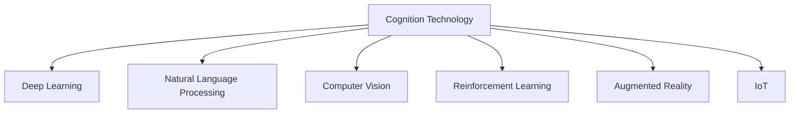

                 

## 1. 背景介绍

### 1.1 问题由来

在过去的几十年里，认知科技(AI)迅速发展，特别是随着深度学习和大数据技术的广泛应用，人工智能(AI)已经从实验室走入实际应用，开启了“增强人类智能”的新时代。从自动驾驶到医疗诊断，从金融预测到教育辅导，AI正在多个领域发挥重要作用。但同时，AI的进步也带来了对人类智能的增强与挑战。本文将从AI的认知科技角度出发，探讨AI如何通过技术手段增强人类智能，并展望其未来发展趋势。

### 1.2 问题核心关键点

认知科技主要通过以下几个关键点来增强人类智能：
- **计算智能**：通过算法和数据处理能力，提高决策效率和准确性。
- **感知智能**：利用传感器和视觉技术，增强人类的感官能力。
- **学习智能**：通过机器学习和深度学习，实现自动化的学习与适应。
- **交互智能**：通过自然语言处理和机器人技术，改善人机交互体验。
- **决策智能**：通过优化算法和数据融合，辅助人类做出更好决策。

本文将从认知科技的关键点出发，深入探讨AI技术如何提升人类智能，以及面临的挑战和未来发展趋势。

## 2. 核心概念与联系

### 2.1 核心概念概述

为更好地理解认知科技，本节将介绍几个关键概念：

- **认知科技(AI)**：指通过计算技术模拟人类智能的系统，包括感知、学习、推理、决策等能力。
- **深度学习(Deep Learning)**：基于神经网络的技术，通过多层次特征提取和参数学习，实现复杂模式的自动分析和识别。
- **自然语言处理(NLP)**：使计算机能理解、解释和生成自然语言，实现人机之间的自然对话。
- **计算机视觉(Computer Vision)**：使计算机能通过图像和视频获取信息，实现视觉识别和分析。
- **强化学习(Reinforcement Learning)**：通过与环境的交互，使智能体学习最优策略。
- **增强现实(Augmented Reality, AR)**：将数字信息叠加到现实世界之上，增强人类的感知和互动。
- **物联网(IoT)**：通过互联网连接各种设备，实现物物相连，提升智能系统的应用范围。

这些核心概念之间的逻辑关系可以通过以下Mermaid流程图来展示：



这个流程图展示了认知科技与各项核心技术的联系，以及它们共同作用于增强人类智能的框架。

## 3. 核心算法原理 & 具体操作步骤

### 3.1 算法原理概述

认知科技的核心算法原理主要包括以下几个方面：

1. **感知与识别**：通过计算机视觉、自然语言处理等技术，实现对语音、图像、文本等信息的自动感知和识别。
2. **学习与优化**：通过深度学习和强化学习等技术，使系统具备自适应和优化能力，自动从数据中学习。
3. **推理与决策**：通过知识图谱、逻辑推理等技术，支持系统做出基于逻辑和规则的决策。
4. **交互与协同**：通过多模态交互和协同学习等技术，增强人机协同和智能系统的社会适应性。

这些算法原理构成了认知科技的基础，使得AI能够处理复杂任务，并实现对人类智能的增强。

### 3.2 算法步骤详解

认知科技的实施过程主要包括以下几个关键步骤：

1. **数据收集**：收集相关领域的各类数据，包括语音、图像、文本、行为等。
2. **数据预处理**：对数据进行清洗、标注、归一化等预处理，提高数据质量。
3. **模型训练**：选择合适的算法模型，如深度神经网络、支持向量机等，使用训练数据进行模型训练。
4. **模型评估**：使用测试数据集对训练好的模型进行评估，选择合适的参数和超参数。
5. **模型部署**：将训练好的模型部署到实际应用中，实现自动化决策和交互。
6. **模型优化**：根据反馈数据，持续优化模型参数，提高模型性能。

### 3.3 算法优缺点

认知科技的算法具有以下优点：
- **自动化决策**：通过自动化算法实现快速、准确的数据处理和决策，提高效率。
- **适应性强**：算法能够自适应新数据和新环境，具有较强的泛化能力。
- **跨模态融合**：能够处理多种数据模态，实现多模态信息融合，提升信息利用效率。
- **实时处理**：算法能够在实时数据中做出快速反应，提高系统响应速度。

同时，认知科技的算法也存在一些缺点：
- **数据依赖**：需要大量高质量标注数据，数据获取成本较高。
- **解释性不足**：部分算法（如深度学习）难以解释内部决策过程，难以解释算法输出。
- **模型复杂度**：部分复杂算法（如深度神经网络）模型庞大，训练和推理资源消耗较大。
- **隐私风险**：算法可能涉及敏感数据，数据隐私和安全问题需要高度关注。

### 3.4 算法应用领域

认知科技的应用领域非常广泛，涵盖了多个行业，包括但不限于：

- **医疗健康**：通过医学影像分析、疾病预测、智能诊断等技术，提升医疗服务的精准度和效率。
- **金融服务**：通过风险评估、欺诈检测、投资策略等技术，提升金融服务的智能化水平。
- **智能制造**：通过自动化生产、质量检测、设备维护等技术，提升制造业的智能化和效率。
- **智慧交通**：通过交通监控、车辆调度、智能导航等技术，优化交通流量，减少交通事故。
- **智能客服**：通过自然语言处理和机器学习技术，提升客户服务的质量和效率。
- **教育辅导**：通过个性化推荐、智能评估、虚拟助教等技术，提升教育服务的个性化和智能化水平。

以上仅是认知科技应用的部分领域，未来随着技术的进步，认知科技还将拓展到更多领域，带来更加深远的社会变革。

## 4. 数学模型和公式 & 详细讲解 & 举例说明

### 4.1 数学模型构建

认知科技的数学模型通常包括以下几个部分：

1. **输入模型**：定义输入数据的数学表示，如语音信号、图像像素等。
2. **特征提取模型**：定义特征提取过程，将输入数据转换为模型可处理的形式，如卷积、池化、非线性变换等。
3. **决策模型**：定义决策过程，通过分类器、回归器、推荐器等模型，做出最终决策。

### 4.2 公式推导过程

以一个简单的分类任务为例，使用支持向量机(SVM)进行数据分类：

假设输入特征为 $x_i \in \mathbb{R}^n$，输出标签为 $y_i \in \{0,1\}$，SVM的目标是最小化误差函数：

$$
L(w,b)=\frac{1}{2}\|w\|^2 + C\sum_{i=1}^n \max(0,1-y_i(w^T \phi(x_i)+b))
$$

其中，$w$ 为模型参数，$b$ 为偏置，$\phi(x_i)$ 为特征映射函数，$C$ 为正则化参数。

### 4.3 案例分析与讲解

使用支持向量机进行手写数字识别的过程如下：

1. 收集手写数字数据集，如MNIST，进行预处理，得到训练集和测试集。
2. 使用PCA对数据进行降维，减少计算量。
3. 构建SVM模型，选择合适的核函数和正则化参数。
4. 使用训练集对模型进行训练，得到最优参数。
5. 在测试集上评估模型性能，如准确率、召回率等。
6. 使用测试集对模型进行验证，并进行超参数调优。

通过上述过程，SVM模型能够有效地实现手写数字的识别，在实际应用中展示了良好的效果。

## 5. 项目实践：代码实例和详细解释说明

### 5.1 开发环境搭建

在进行认知科技项目实践前，需要准备好开发环境。以下是使用Python进行TensorFlow开发的环境配置流程：

1. 安装Anaconda：从官网下载并安装Anaconda，用于创建独立的Python环境。

2. 创建并激活虚拟环境：
```bash
conda create -n tf-env python=3.8 
conda activate tf-env
```

3. 安装TensorFlow：根据CUDA版本，从官网获取对应的安装命令。例如：
```bash
conda install tensorflow -c conda-forge
```

4. 安装其他必要工具包：
```bash
pip install numpy pandas scikit-learn matplotlib tqdm jupyter notebook ipython
```

完成上述步骤后，即可在`tf-env`环境中开始认知科技项目的开发。

### 5.2 源代码详细实现

以下是使用TensorFlow进行手写数字识别的代码实现：

```python
import tensorflow as tf
from tensorflow import keras

# 加载数据集
mnist = keras.datasets.mnist
(train_images, train_labels), (test_images, test_labels) = mnist.load_data()

# 预处理数据
train_images = train_images / 255.0
test_images = test_images / 255.0

# 构建模型
model = keras.Sequential([
    keras.layers.Flatten(input_shape=(28, 28)),
    keras.layers.Dense(128, activation='relu'),
    keras.layers.Dense(10, activation='softmax')
])

# 编译模型
model.compile(optimizer='adam',
              loss='sparse_categorical_crossentropy',
              metrics=['accuracy'])

# 训练模型
model.fit(train_images, train_labels, epochs=10, validation_data=(test_images, test_labels))

# 评估模型
test_loss, test_acc = model.evaluate(test_images, test_labels)
print('Test accuracy:', test_acc)
```

### 5.3 代码解读与分析

让我们再详细解读一下关键代码的实现细节：

- `mnist.load_data()`：加载手写数字数据集MNIST。
- `train_images / 255.0`：将图像像素值归一化到[0, 1]区间。
- `keras.Sequential`：构建一个序列模型，依次添加若干层。
- `model.compile`：编译模型，指定优化器、损失函数和评估指标。
- `model.fit`：训练模型，指定训练数据、批次大小、训练轮数等参数。
- `model.evaluate`：在测试集上评估模型性能，返回损失和准确率。

以上代码展示了TensorFlow在认知科技项目中的基本应用流程。TensorFlow提供了丰富的API和工具，使得开发者能够灵活构建和管理模型。

## 6. 实际应用场景

### 6.1 智能医疗

在智能医疗领域，认知科技能够通过图像识别、自然语言处理等技术，提升医疗服务的智能化水平。例如，通过分析医疗影像，实现疾病诊断和预测；通过自然语言处理技术，自动生成病历报告，减轻医护人员的工作负担。

### 6.2 金融风控

金融行业利用认知科技进行风险评估和欺诈检测。通过分析交易记录和行为模式，认知科技能够识别出异常交易，提前预警潜在风险，保障金融安全。

### 6.3 智能制造

智能制造领域，通过自动化生产、质量检测等技术，提升制造业的智能化和效率。例如，利用计算机视觉技术，实时监控生产线，提高生产效率和质量。

### 6.4 智慧城市

智慧城市建设中，认知科技能够实现智能交通管理、公共安全监控、环境监测等功能。通过多模态数据融合和智能算法，提升城市的治理能力和服务水平。

### 6.5 教育应用

在教育领域，认知科技能够实现个性化推荐、智能评估、虚拟助教等功能。通过自然语言处理技术，学生可以随时随地进行学习，获得更个性化的教育服务。

## 7. 工具和资源推荐

### 7.1 学习资源推荐

为了帮助开发者系统掌握认知科技的理论基础和实践技巧，这里推荐一些优质的学习资源：

1. 《深度学习》系列书籍：由Ian Goodfellow、Yoshua Bengio、Aaron Courville合著，全面介绍深度学习的理论和方法。
2. Coursera《机器学习》课程：由Andrew Ng讲授，涵盖机器学习的基本概念和算法。
3. TensorFlow官方文档：提供丰富的教程和样例代码，帮助开发者快速上手TensorFlow。
4. Kaggle竞赛平台：参与实际项目竞赛，提升数据处理和模型优化能力。
5. ArXiv论文预印本：追踪最新的AI研究成果，了解前沿技术动态。

通过对这些资源的学习实践，相信你一定能够快速掌握认知科技的理论基础和实践技巧，并用于解决实际的AI问题。

### 7.2 开发工具推荐

高效的开发离不开优秀的工具支持。以下是几款用于认知科技开发的常用工具：

1. TensorFlow：由Google主导开发的开源深度学习框架，支持多种平台和语言，适合大规模工程应用。
2. PyTorch：基于Python的开源深度学习框架，灵活性和易用性高，适合研究和实验。
3. Jupyter Notebook：交互式数据科学工具，支持多种语言和库，便于数据处理和模型开发。
4. Visual Studio Code：轻量级的开发环境，支持多种编程语言和框架，适用于开发认知科技项目。
5. Google Colab：谷歌推出的在线Jupyter Notebook环境，免费提供GPU/TPU算力，方便开发者快速实验最新模型。

合理利用这些工具，可以显著提升认知科技项目的开发效率，加速创新迭代的步伐。

### 7.3 相关论文推荐

认知科技的发展源于学界的持续研究。以下是几篇奠基性的相关论文，推荐阅读：

1. AlexNet：ImageNet Large Scale Visual Recognition Challenge：提出卷积神经网络（CNN），在图像分类任务上取得突破性进展。
2. AlphaGo：Playing Go with Deep Reinforcement Learning：展示深度学习和强化学习在复杂游戏（如围棋）中的应用，引发新一轮技术热潮。
3. GPT-3：Language Models are Unsupervised Multitask Learners：提出GPT系列大语言模型，展示深度学习在自然语言处理中的强大能力。
4. Transformer-XL：Attentive Language Models：提出Transformer模型，极大提升自然语言处理任务的性能。
5. AlphaStar：Human-level Performance in StarCraft II with Multi-agent Deep Reinforcement Learning：展示多智能体强化学习在复杂策略游戏中的应用。

这些论文代表了大语言模型和认知科技的发展脉络。通过学习这些前沿成果，可以帮助研究者把握学科前进方向，激发更多的创新灵感。

## 8. 总结：未来发展趋势与挑战

### 8.1 总结

本文对认知科技的基本原理和应用实践进行了全面系统的介绍。首先阐述了认知科技的核心理念和研究背景，明确了认知科技在提升人类智能方面的独特价值。其次，从原理到实践，详细讲解了认知科技的数学模型和关键步骤，给出了认知科技任务开发的完整代码实例。同时，本文还广泛探讨了认知科技在多个行业领域的应用前景，展示了认知科技的广阔前景。

通过本文的系统梳理，可以看到，认知科技正在成为AI技术的重要范式，极大地拓展了AI系统的应用边界，催生了更多的落地场景。未来，伴随认知科技和相关技术的持续演进，认知科技必将在更广泛的领域内发挥作用，深刻影响人类的生产生活方式。

### 8.2 未来发展趋势

展望未来，认知科技的发展将呈现以下几个趋势：

1. **多模态融合**：认知科技将更加注重多模态数据的融合，提升系统的综合感知和理解能力。
2. **跨领域应用**：认知科技的应用将从特定领域拓展到更多行业，推动各行业的智能化转型。
3. **边缘计算**：在物联网和智慧城市等场景下，边缘计算的引入将提升认知科技的实时性和响应速度。
4. **分布式协作**：认知科技将更多地依赖分布式系统，提升系统的可扩展性和可靠性。
5. **伦理和隐私**：随着认知科技在更多领域的应用，伦理和隐私问题将越来越重要，需要引入更多的监管和保护措施。

以上趋势凸显了认知科技的广泛应用前景，这些方向的探索发展，必将进一步推动认知科技的成熟和普及。

### 8.3 面临的挑战

尽管认知科技已经取得了瞩目成就，但在迈向更加智能化、普适化应用的过程中，它仍面临着诸多挑战：

1. **数据获取与处理**：高质量标注数据的获取成本高，数据处理复杂，是认知科技面临的主要瓶颈。
2. **模型复杂度**：深度学习模型庞大，训练和推理资源消耗较大，需要更高效的算法和模型压缩技术。
3. **隐私保护**：认知科技涉及敏感数据，数据隐私和安全问题需要高度关注，需要更多的隐私保护技术。
4. **可解释性**：认知科技的算法往往难以解释，缺乏可解释性，需要引入更多的解释性工具和手段。
5. **伦理与社会影响**：认知科技的应用可能带来伦理和社会问题，需要建立更多的伦理框架和社会责任机制。

正视认知科技面临的这些挑战，积极应对并寻求突破，将是大语言模型微调走向成熟的必由之路。相信随着学界和产业界的共同努力，这些挑战终将一一被克服，认知科技必将在构建人机协同的智能时代中扮演越来越重要的角色。

### 8.4 未来突破

面对认知科技所面临的挑战，未来的研究需要在以下几个方面寻求新的突破：

1. **高效数据获取与处理**：探索无监督学习和半监督学习等方法，降低对高质量标注数据的依赖，提高数据处理效率。
2. **高效模型设计与压缩**：开发更加高效、轻量级的模型架构，减少资源消耗，提升推理速度。
3. **隐私保护技术**：引入差分隐私、联邦学习等技术，保护数据隐私，同时保证模型性能。
4. **模型可解释性**：引入因果分析、知识图谱等方法，提高模型的可解释性，增强决策的透明度和可信度。
5. **伦理与社会责任**：建立AI伦理框架，引入更多社会责任机制，确保认知科技的应用符合人类价值观和伦理道德。

这些研究方向的探索，必将引领认知科技技术迈向更高的台阶，为构建安全、可靠、可解释、可控的智能系统铺平道路。面向未来，认知科技需要与其他人工智能技术进行更深入的融合，如知识表示、因果推理、强化学习等，多路径协同发力，共同推动认知科技的发展。

## 9. 附录：常见问题与解答

**Q1：认知科技的实际应用有哪些？**

A: 认知科技在多个领域都有广泛应用，包括但不限于：医疗、金融、智能制造、智慧城市、教育等。通过图像识别、自然语言处理、多模态数据融合等技术，提升各行业的智能化水平。

**Q2：如何使用TensorFlow进行图像分类？**

A: 使用TensorFlow进行图像分类的基本流程如下：
1. 加载数据集，并进行预处理。
2. 构建卷积神经网络（CNN）模型，如LeNet、AlexNet等。
3. 编译模型，指定优化器、损失函数和评估指标。
4. 训练模型，指定训练数据、批次大小、训练轮数等参数。
5. 在测试集上评估模型性能，如准确率、召回率等。

**Q3：认知科技在医疗领域的应用前景如何？**

A: 认知科技在医疗领域的应用前景非常广阔，包括但不限于：
1. 疾病预测：通过分析医疗影像和病历数据，实现疾病的早期预警和预测。
2. 智能诊断：利用自然语言处理技术，自动生成病历报告和诊断结果。
3. 个性化治疗：通过分析基因数据和患者信息，提供个性化的治疗方案。

**Q4：认知科技面临的主要挑战是什么？**

A: 认知科技面临的主要挑战包括：
1. 数据获取与处理：高质量标注数据的获取成本高，数据处理复杂。
2. 模型复杂度：深度学习模型庞大，训练和推理资源消耗较大。
3. 隐私保护：认知科技涉及敏感数据，数据隐私和安全问题需要高度关注。
4. 可解释性：认知科技的算法往往难以解释，缺乏可解释性。
5. 伦理与社会影响：认知科技的应用可能带来伦理和社会问题。

**Q5：未来认知科技的主要发展方向是什么？**

A: 未来认知科技的主要发展方向包括：
1. 多模态融合：提升系统的综合感知和理解能力。
2. 跨领域应用：推动各行业的智能化转型。
3. 边缘计算：提升系统的实时性和响应速度。
4. 分布式协作：提升系统的可扩展性和可靠性。
5. 伦理和社会责任：建立AI伦理框架，确保认知科技的应用符合人类价值观和伦理道德。

---

作者：禅与计算机程序设计艺术 / Zen and the Art of Computer Programming

