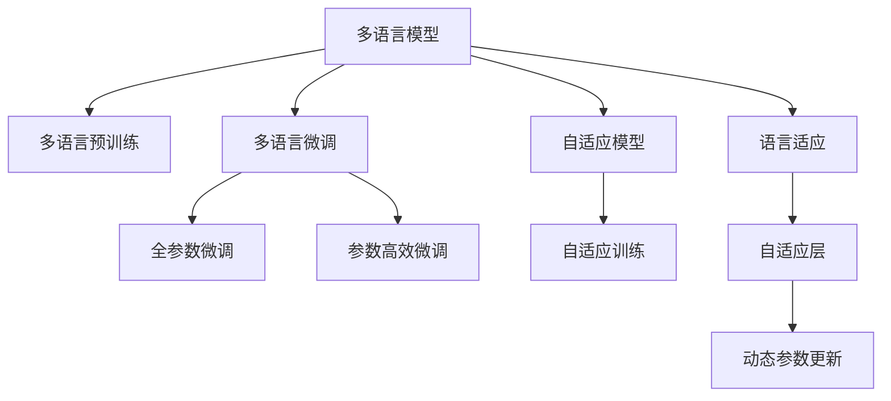

                 

# 语言多样性：LLM 对多语言的适应

> 关键词：多语言模型,语言适应,Transformer,自然语言处理(NLP),多语言训练,自适应模型

## 1. 背景介绍

### 1.1 问题由来
近年来，随着深度学习技术的飞速发展，大语言模型（Large Language Models，LLM）在自然语言处理（Natural Language Processing，NLP）领域取得了巨大的突破。这些模型在处理大规模单语言文本数据时表现出色，但当面对多语言数据时，其效果往往不尽如人意。不同语言之间存在语法、词汇、语义等方面的差异，预训练过程中缺乏多语言数据的模型难以泛化到其他语言中。这使得基于单语言预训练的大模型在多语言场景下的应用受到限制。

### 1.2 问题核心关键点
面对多语言适应问题，研究人员提出了多种解决方案，包括多语言预训练、多语言微调、自适应模型等。这些方法的目的都在于提升大模型在多语言环境下的性能，使其能够更好地适应不同语言的特性。

主要关键点包括：
- **多语言预训练**：在预训练阶段就考虑多语言文本，训练出能够在多语言之间通用的语言模型。
- **多语言微调**：在预训练模型的基础上，针对特定多语言任务进行微调，优化模型在多语言环境下的表现。
- **自适应模型**：在模型训练过程中，根据输入语言类型动态调整模型参数，以适应不同语言的特性。

### 1.3 问题研究意义
研究大语言模型对多语言的适应性，对于拓展其应用范围，提升多语言环境下的NLP性能，具有重要意义：

1. **降低应用成本**：多语言预训练或微调方法可以大幅降低多语言NLP应用的开发成本，减少对专业语言学家的依赖。
2. **提升模型性能**：通过多语言训练和微调，模型可以更好地理解不同语言的特点，提高在多语言场景下的推理和生成能力。
3. **加速应用部署**：预训练多语言模型后，可以快速适配多种语言，加速多语言NLP系统的部署速度。
4. **丰富应用场景**：多语言模型可以在全球范围内推广使用，服务于更多国家和地区，提升NLP技术的影响力。
5. **促进文化交流**：通过多语言模型的应用，可以更好地促进不同语言和文化之间的交流与理解。

## 2. 核心概念与联系

### 2.1 核心概念概述

为了更好地理解大语言模型对多语言的适应性，我们需要介绍几个核心概念：

- **多语言模型（Multilingual Model）**：能够处理多种语言的模型，通常通过在多种语言文本数据上进行预训练获得。
- **语言适应（Language Adaptation）**：在模型训练或使用过程中，根据输入语言的特征动态调整模型参数，以提高其在特定语言上的表现。
- **自适应模型（Adaptive Model）**：通过在模型中嵌入自适应模块，根据输入语言类型自动调整模型结构或参数，以适应不同语言的特性。
- **Transformer**：一种基于自注意力机制的深度学习模型，广泛应用于NLP任务的预训练和微调中。

这些概念之间的逻辑关系可以通过以下Mermaid流程图来展示：



这个流程图展示了大语言模型对多语言的适应性及其相关概念之间的联系：

1. 多语言模型通过多语言预训练获得基础能力。
2. 多语言微调在预训练模型的基础上，针对特定多语言任务进行优化。
3. 自适应模型在训练过程中，根据输入语言类型动态调整模型参数。
4. 语言适应使得模型在特定语言中表现更好。
5. 自适应层是实现语言适应的关键组件。

这些概念共同构成了大语言模型对多语言的适应性框架，使得其在多语言环境下的性能得以提升。

## 3. 核心算法原理 & 具体操作步骤
### 3.1 算法原理概述

大语言模型对多语言的适应性，本质上是一个多任务学习的过程。其核心思想是：通过多语言预训练或微调，学习到多种语言共有的语言特征和跨语言的通用知识，然后在特定多语言任务上，动态调整模型参数，使其能够更好地适应不同语言的需求。

形式化地，假设多语言预训练模型为 $M_{\theta}$，其中 $\theta$ 为模型参数。给定多语言任务 $T=\{T_1, T_2, ..., T_n\}$ 的标注数据集 $D=\{(x_i, y_i)\}_{i=1}^N$，语言适应过程的目标是找到最优参数 $\hat{\theta}$，使得模型在所有语言上的表现都达到最优：

$$
\hat{\theta}=\mathop{\arg\min}_{\theta} \sum_{i=1}^n \mathcal{L}_i(M_{\theta}, D_i)
$$

其中 $D_i$ 为语言 $i$ 的任务标注数据集，$\mathcal{L}_i$ 为任务 $T_i$ 上的损失函数。

通过梯度下降等优化算法，语言适应过程不断更新模型参数 $\theta$，最小化总损失函数 $\mathcal{L}$，使得模型在所有语言上的输出都逼近真实标签。由于 $\theta$ 已经通过多语言预训练获得了较好的初始化，因此即使在特定语言上使用微调数据，也能较快收敛到理想的模型参数 $\hat{\theta}$。

### 3.2 算法步骤详解

大语言模型对多语言的适应性可以分解为以下关键步骤：

**Step 1: 准备多语言数据集**
- 收集目标语言的语言数据集 $D=\{(x_i, y_i)\}_{i=1}^N$，其中 $x_i$ 为输入文本，$y_i$ 为对应的任务标签。
- 确保数据集中包含了各种语言的文本和标签，语言种类尽可能丰富。

**Step 2: 多语言预训练**
- 选择合适的多语言预训练模型，如mBERT、XLM等。
- 在大规模多语言文本数据上对模型进行预训练，学习到跨语言的通用知识。

**Step 3: 多语言微调**
- 根据具体的多语言任务，设计相应的损失函数和任务适配层。
- 使用微调数据集 $D_i$ 对预训练模型进行微调，优化模型在特定语言上的表现。

**Step 4: 语言适应**
- 在多语言微调的基础上，根据输入语言类型动态调整模型参数。
- 可以采用自适应层或参数高效微调方法，避免对模型参数的过度调整，减少资源消耗。

**Step 5: 测试和部署**
- 在测试集上评估微调后的多语言模型性能，对比微调前后的效果。
- 使用多语言模型进行实际应用，集成到多语言NLP系统中。
- 定期收集新的数据，更新模型参数，以适应语言分布的变化。

以上是多语言适应性的一般流程。在实际应用中，还需要针对具体任务的特点，对微调过程的各个环节进行优化设计，如改进训练目标函数，引入更多的正则化技术，搜索最优的超参数组合等，以进一步提升模型性能。

### 3.3 算法优缺点

多语言适应性方法具有以下优点：
1. 泛化能力强。通过多语言预训练，模型能够学习到跨语言的通用知识，提升其在多语言环境下的泛化能力。
2. 训练成本较低。相较于从头训练多个单语言模型，多语言预训练和微调能够共享模型参数，降低训练成本。
3. 适应性强。根据输入语言类型动态调整模型参数，使得模型能够更好地适应不同语言的特性。
4. 效果好。在多语言场景下，多语言适应性方法通常能够取得比单语言模型更好的效果。

同时，该方法也存在一定的局限性：
1. 数据获取困难。多语言数据的收集和标注成本较高，且不同语言的数据质量差异较大。
2. 模型复杂度高。多语言预训练和微调所需的计算资源较大，对硬件设备要求较高。
3. 迁移能力有限。当目标语言与预训练语言差异较大时，模型性能提升有限。
4. 可解释性不足。多语言模型在推理和生成过程中，难以提供详细的解释，难以调试和优化。

尽管存在这些局限性，但就目前而言，多语言适应性方法仍然是大语言模型在多语言环境下的主流范式。未来相关研究的重点在于如何进一步降低多语言训练和微调的成本，提高模型的少样本学习和跨领域迁移能力，同时兼顾可解释性和伦理安全性等因素。

### 3.4 算法应用领域

多语言适应性方法在NLP领域已经得到了广泛的应用，覆盖了几乎所有常见任务，例如：

- 文本分类：如情感分析、主题分类、意图识别等。通过多语言预训练，使模型学习到跨语言的分类特征。
- 命名实体识别：识别文本中的人名、地名、机构名等特定实体。通过多语言微调，使模型能够识别不同语言中的实体。
- 关系抽取：从文本中抽取实体之间的语义关系。通过多语言微调，使模型能够处理不同语言中的关系抽取任务。
- 问答系统：对自然语言问题给出答案。通过多语言微调，使模型能够解答不同语言的问题。
- 机器翻译：将源语言文本翻译成目标语言。通过多语言微调，使模型能够进行多语言的互译。
- 文本摘要：将长文本压缩成简短摘要。通过多语言微调，使模型能够生成不同语言的摘要。
- 对话系统：使机器能够与人自然对话。通过多语言微调，使模型能够与不同语言的用户进行交流。

除了上述这些经典任务外，多语言模型还被创新性地应用到更多场景中，如多语言信息检索、多语言情感分析、多语言数据增强等，为多语言NLP技术带来了全新的突破。随着多语言预训练和微调方法的不断进步，相信多语言NLP技术将在更广阔的应用领域大放异彩。

## 4. 数学模型和公式 & 详细讲解
### 4.1 数学模型构建

以下我们以多语言文本分类任务为例，使用数学语言对多语言适应性方法进行更加严格的刻画。

记多语言预训练模型为 $M_{\theta}$，其中 $\theta$ 为模型参数。假设多语言分类任务 $T$ 的训练集为 $D=\{(x_i, y_i)\}_{i=1}^N, x_i \in \mathcal{X}, y_i \in \{1,2,...,C\}$，$C$ 为类别数。

定义模型 $M_{\theta}$ 在输入 $x$ 上的分类概率分布为 $\hat{y}=M_{\theta}(x) \in [0,1]^C$，表示样本属于各个类别的概率。真实标签 $y \in \{1,2,...,C\}$。则多语言分类任务的交叉熵损失函数定义为：

$$
\ell(M_{\theta}(x),y) = -\sum_{c=1}^C y_c\log M_{\theta}(x)_c
$$

将其代入经验风险公式，得：

$$
\mathcal{L}(\theta) = -\frac{1}{N}\sum_{i=1}^N \ell(M_{\theta}(x_i),y_i)
$$

通过梯度下降等优化算法，多语言适应过程不断更新模型参数 $\theta$，最小化经验风险 $\mathcal{L}$，使得模型输出逼近真实标签。由于 $\theta$ 已经通过多语言预训练获得了较好的初始化，因此即使在特定语言上使用微调数据，也能较快收敛到理想的模型参数 $\hat{\theta}$。

### 4.2 公式推导过程

以下我们以二分类任务为例，推导多语言分类损失函数及其梯度的计算公式。

假设模型 $M_{\theta}$ 在输入 $x$ 上的输出为 $\hat{y}=M_{\theta}(x) \in [0,1]$，表示样本属于正类的概率。真实标签 $y \in \{0,1\}$。则多语言分类交叉熵损失函数定义为：

$$
\ell(M_{\theta}(x),y) = -[y\log \hat{y} + (1-y)\log (1-\hat{y})]
$$

将其代入经验风险公式，得：

$$
\mathcal{L}(\theta) = -\frac{1}{N}\sum_{i=1}^N [y_i\log M_{\theta}(x_i)+(1-y_i)\log(1-M_{\theta}(x_i))]
$$

根据链式法则，损失函数对参数 $\theta_k$ 的梯度为：

$$
\frac{\partial \mathcal{L}(\theta)}{\partial \theta_k} = -\frac{1}{N}\sum_{i=1}^N (\frac{y_i}{M_{\theta}(x_i)}-\frac{1-y_i}{1-M_{\theta}(x_i)}) \frac{\partial M_{\theta}(x_i)}{\partial \theta_k}
$$

其中 $\frac{\partial M_{\theta}(x_i)}{\partial \theta_k}$ 可进一步递归展开，利用自动微分技术完成计算。

在得到损失函数的梯度后，即可带入参数更新公式，完成模型的迭代优化。重复上述过程直至收敛，最终得到适应多语言分类任务的最优模型参数 $\theta^*$。

## 5. 项目实践：代码实例和详细解释说明
### 5.1 开发环境搭建

在进行多语言适应性实践前，我们需要准备好开发环境。以下是使用Python进行PyTorch开发的环境配置流程：

1. 安装Anaconda：从官网下载并安装Anaconda，用于创建独立的Python环境。

2. 创建并激活虚拟环境：
```bash
conda create -n pytorch-env python=3.8 
conda activate pytorch-env
```

3. 安装PyTorch：根据CUDA版本，从官网获取对应的安装命令。例如：
```bash
conda install pytorch torchvision torchaudio cudatoolkit=11.1 -c pytorch -c conda-forge
```

4. 安装Transformers库：
```bash
pip install transformers
```

5. 安装各类工具包：
```bash
pip install numpy pandas scikit-learn matplotlib tqdm jupyter notebook ipython
```

完成上述步骤后，即可在`pytorch-env`环境中开始多语言适应性实践。

### 5.2 源代码详细实现

下面我以多语言命名实体识别(NER)任务为例，给出使用Transformers库对多语言BERT模型进行微调的PyTorch代码实现。

首先，定义多语言NER任务的数据处理函数：

```python
from transformers import BertTokenizer, BertForTokenClassification, BertModel
from torch.utils.data import Dataset, DataLoader
from sklearn.metrics import classification_report
import torch

class MultiNERDataset(Dataset):
    def __init__(self, texts, tags, tokenizer, max_len=128):
        self.texts = texts
        self.tags = tags
        self.tokenizer = tokenizer
        self.max_len = max_len
        
    def __len__(self):
        return len(self.texts)
    
    def __getitem__(self, item):
        text = self.texts[item]
        tags = self.tags[item]
        
        encoding = self.tokenizer(text, return_tensors='pt', max_length=self.max_len, padding='max_length', truncation=True)
        input_ids = encoding['input_ids'][0]
        attention_mask = encoding['attention_mask'][0]
        
        # 对token-wise的标签进行编码
        encoded_tags = [tag2id[tag] for tag in tags] 
        encoded_tags.extend([tag2id['O']] * (self.max_len - len(encoded_tags)))
        labels = torch.tensor(encoded_tags, dtype=torch.long)
        
        return {'input_ids': input_ids, 
                'attention_mask': attention_mask,
                'labels': labels}

# 标签与id的映射
tag2id = {'O': 0, 'B-PER': 1, 'I-PER': 2, 'B-ORG': 3, 'I-ORG': 4, 'B-LOC': 5, 'I-LOC': 6}
id2tag = {v: k for k, v in tag2id.items()}

# 创建dataset
tokenizer = BertTokenizer.from_pretrained('bert-base-cased')

train_dataset = MultiNERDataset(train_texts, train_tags, tokenizer)
dev_dataset = MultiNERDataset(dev_texts, dev_tags, tokenizer)
test_dataset = MultiNERDataset(test_texts, test_tags, tokenizer)
```

然后，定义模型和优化器：

```python
from transformers import BertForTokenClassification, AdamW

model = BertForTokenClassification.from_pretrained('bert-base-cased', num_labels=len(tag2id))

optimizer = AdamW(model.parameters(), lr=2e-5)
```

接着，定义训练和评估函数：

```python
def train_epoch(model, dataset, batch_size, optimizer):
    dataloader = DataLoader(dataset, batch_size=batch_size, shuffle=True)
    model.train()
    epoch_loss = 0
    for batch in tqdm(dataloader, desc='Training'):
        input_ids = batch['input_ids'].to(device)
        attention_mask = batch['attention_mask'].to(device)
        labels = batch['labels'].to(device)
        model.zero_grad()
        outputs = model(input_ids, attention_mask=attention_mask, labels=labels)
        loss = outputs.loss
        epoch_loss += loss.item()
        loss.backward()
        optimizer.step()
    return epoch_loss / len(dataloader)

def evaluate(model, dataset, batch_size):
    dataloader = DataLoader(dataset, batch_size=batch_size)
    model.eval()
    preds, labels = [], []
    with torch.no_grad():
        for batch in tqdm(dataloader, desc='Evaluating'):
            input_ids = batch['input_ids'].to(device)
            attention_mask = batch['attention_mask'].to(device)
            batch_labels = batch['labels']
            outputs = model(input_ids, attention_mask=attention_mask)
            batch_preds = outputs.logits.argmax(dim=2).to('cpu').tolist()
            batch_labels = batch_labels.to('cpu').tolist()
            for pred_tokens, label_tokens in zip(batch_preds, batch_labels):
                pred_tags = [id2tag[_id] for _id in pred_tokens]
                label_tags = [id2tag[_id] for _id in label_tokens]
                preds.append(pred_tags[:len(label_tags)])
                labels.append(label_tags)
                
    print(classification_report(labels, preds))
```

最后，启动训练流程并在测试集上评估：

```python
epochs = 5
batch_size = 16

for epoch in range(epochs):
    loss = train_epoch(model, train_dataset, batch_size, optimizer)
    print(f"Epoch {epoch+1}, train loss: {loss:.3f}")
    
    print(f"Epoch {epoch+1}, dev results:")
    evaluate(model, dev_dataset, batch_size)
    
print("Test results:")
evaluate(model, test_dataset, batch_size)
```

以上就是使用PyTorch对多语言BERT模型进行命名实体识别任务微调的完整代码实现。可以看到，得益于Transformers库的强大封装，我们可以用相对简洁的代码完成多语言模型的加载和微调。

### 5.3 代码解读与分析

让我们再详细解读一下关键代码的实现细节：

**MultiNERDataset类**：
- `__init__`方法：初始化文本、标签、分词器等关键组件。
- `__len__`方法：返回数据集的样本数量。
- `__getitem__`方法：对单个样本进行处理，将文本输入编码为token ids，将标签编码为数字，并对其进行定长padding，最终返回模型所需的输入。

**tag2id和id2tag字典**：
- 定义了标签与数字id之间的映射关系，用于将token-wise的预测结果解码回真实的标签。

**训练和评估函数**：
- 使用PyTorch的DataLoader对数据集进行批次化加载，供模型训练和推理使用。
- 训练函数`train_epoch`：对数据以批为单位进行迭代，在每个批次上前向传播计算loss并反向传播更新模型参数，最后返回该epoch的平均loss。
- 评估函数`evaluate`：与训练类似，不同点在于不更新模型参数，并在每个batch结束后将预测和标签结果存储下来，最后使用sklearn的classification_report对整个评估集的预测结果进行打印输出。

**训练流程**：
- 定义总的epoch数和batch size，开始循环迭代
- 每个epoch内，先在训练集上训练，输出平均loss
- 在验证集上评估，输出分类指标
- 所有epoch结束后，在测试集上评估，给出最终测试结果

可以看到，PyTorch配合Transformers库使得多语言微调的代码实现变得简洁高效。开发者可以将更多精力放在数据处理、模型改进等高层逻辑上，而不必过多关注底层的实现细节。

当然，工业级的系统实现还需考虑更多因素，如模型的保存和部署、超参数的自动搜索、更灵活的任务适配层等。但核心的微调范式基本与此类似。

## 6. 实际应用场景
### 6.1 多语言智能客服系统

基于大语言模型适应性技术，智能客服系统可以支持多语言客户服务，提升全球化服务质量。传统客服往往仅支持少数几种语言，无法满足全球用户的多语言需求。通过多语言适应性技术，可以构建多语言智能客服系统，支持多种语言的客户咨询和问题解答。

在技术实现上，可以收集全球各地的客服对话记录，构建多语言对话数据集，在BERT等大模型上进行多语言预训练和微调。微调后的模型能够自动理解多种语言，匹配最合适的答案模板进行回复。对于客户提出的新问题，还可以接入检索系统实时搜索相关内容，动态组织生成回答。如此构建的多语言智能客服系统，能大幅提升客户咨询体验和问题解决效率。

### 6.2 多语言金融舆情监测

金融机构需要实时监测全球市场舆论动向，以便及时应对负面信息传播，规避金融风险。传统的人工监测方式成本高、效率低，难以应对网络时代海量信息爆发的挑战。基于多语言适应性技术，金融舆情监测系统可以支持多语言新闻、评论等文本数据的情感分析和主题分类。

具体而言，可以收集全球各地的金融新闻、报道、评论等文本数据，并对其进行多语言预训练和情感标注。在此基础上对BERT模型进行多语言微调，使其能够自动判断文本属于何种主题，情感倾向是正面、中性还是负面。将多语言微调后的模型应用到实时抓取的网络文本数据，就能够自动监测不同主题下的情感变化趋势，一旦发现负面信息激增等异常情况，系统便会自动预警，帮助金融机构快速应对潜在风险。

### 6.3 多语言个性化推荐系统

当前的推荐系统往往只依赖用户的历史行为数据进行物品推荐，无法深入理解用户的真实兴趣偏好。基于多语言适应性技术，个性化推荐系统可以更好地挖掘用户行为背后的语义信息，从而提供更精准、多样的推荐内容。

在实践中，可以收集用户浏览、点击、评论、分享等行为数据，提取和用户交互的物品标题、描述、标签等文本内容。将文本内容作为模型输入，用户的后续行为（如是否点击、购买等）作为监督信号，在此基础上对BERT模型进行多语言微调。多语言微调后的模型能够从文本内容中准确把握用户的兴趣点。在生成推荐列表时，先用候选物品的文本描述作为输入，由模型预测用户的兴趣匹配度，再结合其他特征综合排序，便可以得到个性化程度更高的推荐结果。

### 6.4 未来应用展望

随着多语言适应性技术的不断发展，其应用场景将不断拓展，为全球范围内的各行各业带来变革性影响。

在智慧医疗领域，基于多语言适应性技术，医疗问答、病历分析、药物研发等应用将提升医疗服务的智能化水平，辅助医生诊疗，加速新药开发进程。

在智能教育领域，多语言适应性技术可应用于作业批改、学情分析、知识推荐等方面，因材施教，促进教育公平，提高教学质量。

在智慧城市治理中，多语言适应性模型可应用于城市事件监测、舆情分析、应急指挥等环节，提高城市管理的自动化和智能化水平，构建更安全、高效的未来城市。

此外，在企业生产、社会治理、文娱传媒等众多领域，多语言适应性技术也将不断涌现，为传统行业数字化转型升级提供新的技术路径。相信随着技术的日益成熟，多语言适应性技术必将成为人工智能落地应用的重要范式，推动人工智能技术在全球范围内的广泛应用。

## 7. 工具和资源推荐
### 7.1 学习资源推荐

为了帮助开发者系统掌握多语言适应性技术的基础理论和方法，这里推荐一些优质的学习资源：

1. 《Multilingual NLP》书籍：由Katharina Rohde等作者撰写，系统介绍了多语言NLP的理论基础和实践方法。
2. 《Natural Language Processing in Python》教程：由Stefan Jansen等作者撰写，使用Python语言实现NLP任务的实例代码，包括多语言处理。
3. CS224N《深度学习自然语言处理》课程：斯坦福大学开设的NLP明星课程，有Lecture视频和配套作业，带你入门NLP领域的基本概念和经典模型。
4. HuggingFace官方文档：Transformer库的官方文档，提供了海量预训练模型和多语言微调样例代码，是上手实践的必备资料。
5. Multilingual NLP开源项目：GitHub上的多语言NLP开源项目，展示了多语言预训练和微调的最新进展和应用。

通过对这些资源的学习实践，相信你一定能够快速掌握多语言适应性技术的精髓，并用于解决实际的NLP问题。
###  7.2 开发工具推荐

高效的开发离不开优秀的工具支持。以下是几款用于多语言适应性开发的常用工具：

1. PyTorch：基于Python的开源深度学习框架，灵活动态的计算图，适合快速迭代研究。大部分预训练语言模型都有PyTorch版本的实现。
2. TensorFlow：由Google主导开发的开源深度学习框架，生产部署方便，适合大规模工程应用。同样有丰富的预训练语言模型资源。
3. Transformers库：HuggingFace开发的NLP工具库，集成了众多SOTA语言模型，支持PyTorch和TensorFlow，是进行多语言微调任务开发的利器。
4. Weights & Biases：模型训练的实验跟踪工具，可以记录和可视化模型训练过程中的各项指标，方便对比和调优。与主流深度学习框架无缝集成。
5. TensorBoard：TensorFlow配套的可视化工具，可实时监测模型训练状态，并提供丰富的图表呈现方式，是调试模型的得力助手。
6. Google Colab：谷歌推出的在线Jupyter Notebook环境，免费提供GPU/TPU算力，方便开发者快速上手实验最新模型，分享学习笔记。

合理利用这些工具，可以显著提升多语言适应性任务的开发效率，加快创新迭代的步伐。

### 7.3 相关论文推荐

多语言适应性技术的发展源于学界的持续研究。以下是几篇奠基性的相关论文，推荐阅读：

1. Multilingual BERT: A Multilingual Pre-trained Language Representation Model：提出多语言BERT模型，通过多语言预训练学习到跨语言的通用知识。
2. XLM: Multilingual Machine Translation with Unsupervised Pre-training：提出XLM模型，通过无监督预训练学习到多语言之间的语义关系。
3. mBERT: A Multilingual BERT Model for Zero-Shot Question Answering：提出mBERT模型，通过多语言预训练学习到跨语言的语义理解能力。
4. Self-supervised Cross-lingual Representation Learning：提出基于自监督学习的跨语言表示学习方法，提升了模型的多语言泛化能力。
5. Multi-Aspect Multilingual Fine-tuning with Language-agnostic Prompt Design：提出基于自适应提示的多语言微调方法，提高了模型在不同语言上的适应能力。

这些论文代表了大语言模型多语言适应性的发展脉络。通过学习这些前沿成果，可以帮助研究者把握学科前进方向，激发更多的创新灵感。

## 8. 总结：未来发展趋势与挑战

### 8.1 总结

本文对基于监督学习的多语言适应性方法进行了全面系统的介绍。首先阐述了多语言适应性技术的研究背景和意义，明确了多语言模型在多语言环境下的性能提升价值。其次，从原理到实践，详细讲解了多语言适应性的数学原理和关键步骤，给出了多语言微调的完整代码实例。同时，本文还广泛探讨了多语言适应性方法在智能客服、金融舆情、个性化推荐等多个行业领域的应用前景，展示了多语言适应性方法的广泛潜力。此外，本文精选了多语言适应性技术的各类学习资源，力求为读者提供全方位的技术指引。

通过本文的系统梳理，可以看到，基于大语言模型的多语言适应性方法正在成为NLP领域的重要范式，极大地拓展了预训练语言模型的应用边界，催生了更多的落地场景。受益于大规模语料的预训练，多语言适应性模型以更低的时间和标注成本，在小样本条件下也能取得不俗的效果，有力推动了NLP技术的产业化进程。未来，伴随多语言预训练和微调方法的不断进步，相信多语言NLP技术将在更广阔的应用领域大放异彩，深刻影响人类的生产生活方式。

### 8.2 未来发展趋势

展望未来，多语言适应性技术将呈现以下几个发展趋势：

1. 模型规模持续增大。随着算力成本的下降和数据规模的扩张，多语言预训练模型和微调模型的参数量还将持续增长。超大规模语言模型蕴含的丰富语言知识，有望支撑更加复杂多变的下游任务微调。
2. 微调方法日趋多样。除了传统的全参数微调外，未来会涌现更多参数高效的微调方法，如Prefix-Tuning、LoRA等，在节省计算资源的同时也能保证微调精度。
3. 持续学习成为常态。随着数据分布的不断变化，多语言适应性模型也需要持续学习新知识以保持性能。如何在不遗忘原有知识的同时，高效吸收新样本信息，将成为重要的研究课题。
4. 标注样本需求降低。受启发于提示学习(Prompt-based Learning)的思路，未来的多语言微调方法将更好地利用大模型的语言理解能力，通过更加巧妙的任务描述，在更少的标注样本上也能实现理想的微调效果。
5. 多模态微调崛起。当前的多语言微调主要聚焦于文本数据，未来会进一步拓展到图像、视频、语音等多模态数据微调。多模态信息的融合，将显著提升语言模型对现实世界的理解和建模能力。
6. 模型通用性增强。经过海量数据的预训练和多领域任务的微调，未来的多语言模型将具备更强大的常识推理和跨领域迁移能力，逐步迈向通用人工智能(AGI)的目标。

以上趋势凸显了多语言适应性技术的广阔前景。这些方向的探索发展，必将进一步提升多语言NLP系统的性能和应用范围，为人类认知智能的进化带来深远影响。

### 8.3 面临的挑战

尽管多语言适应性技术已经取得了瞩目成就，但在迈向更加智能化、普适化应用的过程中，它仍面临着诸多挑战：

1. 数据获取困难。多语言数据的收集和标注成本较高，且不同语言的数据质量差异较大。
2. 模型鲁棒性不足。当目标语言与预训练语言差异较大时，模型性能提升有限。
3. 标注样本需求较高。多语言微调通常需要更多的标注数据，以避免过拟合。
4. 可解释性不足。多语言模型在推理和生成过程中，难以提供详细的解释，难以调试和优化。
5. 安全性有待保障。预训练多语言模型难免会学习到有偏见、有害的信息，通过微调传递到下游任务，产生误导性、歧视性的输出，给实际应用带来安全隐患。
6. 知识整合能力不足。现有的多语言模型往往局限于任务内数据，难以灵活吸收和运用更广泛的先验知识。

正视多语言适应性面临的这些挑战，积极应对并寻求突破，将是多语言模型迈向成熟的必由之路。相信随着学界和产业界的共同努力，这些挑战终将一一被克服，多语言适应性技术必将在构建安全、可靠、可解释、可控的智能系统方面发挥重要作用。

### 8.4 研究展望

面对多语言适应性所面临的种种挑战，未来的研究需要在以下几个方面寻求新的突破：

1. 探索无监督和半监督多语言微调方法。摆脱对大规模标注数据的依赖，利用自监督学习、主动学习等无监督和半监督范式，最大限度利用非结构化数据，实现更加灵活高效的多语言微调。
2. 研究参数高效和计算高效的多语言微调范式。开发更加参数高效的微调方法，在固定大部分预训练参数的同时，只更新极少量的任务相关参数。同时优化多语言微调的计算图，减少前向传播和反向传播的资源消耗，实现更加轻量级、实时性的部署。
3. 融合因果和对比学习范式。通过引入因果推断和对比学习思想，增强多语言模型建立稳定因果关系的能力，学习更加普适、鲁棒的语言表征，从而提升模型泛化性和抗干扰能力。
4. 引入更多先验知识。将符号化的先验知识，如知识图谱、逻辑规则等，与神经网络模型进行巧妙融合，引导多语言模型学习更准确、合理的语言模型。同时加强不同模态数据的整合，实现视觉、语音等多模态信息与文本信息的协同建模。
5. 结合因果分析和博弈论工具。将因果分析方法引入多语言模型，识别出模型决策的关键特征，增强输出解释的因果性和逻辑性。借助博弈论工具刻画人机交互过程，主动探索并规避模型的脆弱点，提高系统稳定性。
6. 纳入伦理道德约束。在模型训练目标中引入伦理导向的评估指标，过滤和惩罚有偏见、有害的输出倾向。同时加强人工干预和审核，建立模型行为的监管机制，确保输出符合人类价值观和伦理道德。

这些研究方向的探索，必将引领多语言模型微调技术迈向更高的台阶，为构建安全、可靠、可解释、可控的智能系统铺平道路。面向未来，多语言模型微调技术还需要与其他人工智能技术进行更深入的融合，如知识表示、因果推理、强化学习等，多路径协同发力，共同推动自然语言理解和智能交互系统的进步。只有勇于创新、敢于突破，才能不断拓展多语言模型的边界，让智能技术更好地造福人类社会。

## 9. 附录：常见问题与解答

**Q1：多语言模型是否适用于所有NLP任务？**

A: 多语言模型在大多数NLP任务上都能取得不错的效果，特别是对于数据量较小的任务。但对于一些特定领域的任务，如医学、法律等，仅仅依靠通用语料预训练的模型可能难以很好地适应。此时需要在特定领域语料上进一步预训练，再进行微调，才能获得理想效果。此外，对于一些需要时效性、个性化很强的任务，如对话、推荐等，多语言模型也需要针对性的改进优化。

**Q2：多语言适应性方法如何选择合适的学习率？**

A: 多语言适应性学习率一般要比预训练时小1-2个数量级，以避免破坏预训练权重，导致过拟合。一般建议从1e-5开始调参，逐步减小学习率，直至收敛。也可以使用warmup策略，在开始阶段使用较小的学习率，再逐渐过渡到预设值。需要注意的是，不同的优化器(如AdamW、Adafactor等)以及不同的学习率调度策略，可能需要设置不同的学习率阈值。

**Q3：多语言适应性方法在落地部署时需要注意哪些问题？**

A: 将多语言模型转化为实际应用，还需要考虑以下因素：
1. 模型裁剪：去除不必要的层和参数，减小模型尺寸，加快推理速度
2. 量化加速：将浮点模型转为定点模型，压缩存储空间，提高计算效率
3. 服务化封装：将模型封装为标准化服务接口，便于集成调用
4. 弹性伸缩：根据请求流量动态调整资源配置，平衡服务质量和成本
5. 监控告警：实时采集系统指标，设置异常告警阈值，确保服务稳定性
6. 安全防护：采用访问鉴权、数据脱敏等措施，保障数据和模型安全

多语言模型适应性为NLP应用开启了广阔的想象空间，但如何将强大的性能转化为稳定、高效、安全的业务价值，还需要工程实践的不断打磨。唯有从数据、算法、工程、业务等多个维度协同发力，才能真正实现人工智能技术在多语言场景中的规模化落地。总之，多语言适应性需要开发者根据具体任务，不断迭代和优化模型、数据和算法，方能得到理想的效果。

---

作者：禅与计算机程序设计艺术 / Zen and the Art of Computer Programming

