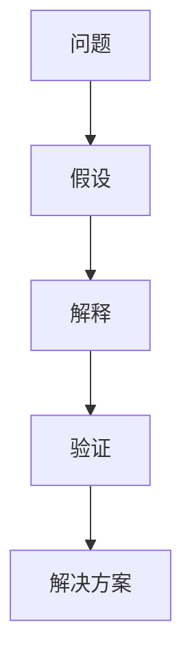

                 

## 1. 背景介绍

### 1.1 问题由来

在当今快速变化和复杂多变的环境下，企业面临的挑战越来越大。为了保持竞争力，管理者需要不断地创新和改进。然而，创新和改进往往需要深入的思考和分析。费曼提问法（Feynman Technique）作为一种有效的思考工具，可以帮助管理者进行深入的分析和思考。

费曼提问法源自诺贝尔物理学奖获得者理查德·费曼（Richard Feynman）的思考方法，是一种基于问题和假设的思考框架，旨在通过不断提问和验证来深入理解问题的本质，从而提出创新的解决方案。

### 1.2 问题核心关键点

费曼提问法主要包括四个步骤：记录、提问、解释和验证。管理者通过记录问题的关键点，不断提出问题，并通过假设和实验验证答案，最终得到解决问题的方法。

具体而言，费曼提问法的关键点包括：
- 记录：清晰地记录问题，明确问题的关键点。
- 提问：提出与问题相关的一系列问题，逐步深入理解问题的本质。
- 解释：通过假设和理论推导，解释问题的各个方面。
- 验证：通过实验或数据分析，验证假设和解释的正确性。

费曼提问法帮助管理者打破传统的思考框架，通过深入分析和验证，提出更具创意和实际的解决方案。

## 2. 核心概念与联系

### 2.1 核心概念概述

为了更好地理解费曼提问法，本节将介绍几个密切相关的核心概念：

- 费曼提问法（Feynman Technique）：一种基于问题和假设的思考方法，通过不断提问和验证来深入理解问题本质，从而提出创新的解决方案。
- 问题（Question）：待解决的问题，可以是技术问题、管理问题、市场问题等。
- 假设（Hypothesis）：对问题可能情况的推测和假设，用于解释问题和提出解决方案。
- 验证（Validation）：通过实验或数据分析，验证假设和解释的正确性，从而得到有效的解决方案。
- 解释（Explanation）：通过假设和理论推导，对问题进行解释和分析。

这些概念之间的逻辑关系可以通过以下Mermaid流程图来展示：



这个流程图展示了费曼提问法的核心步骤：首先定义问题，然后提出假设，接着通过解释对假设进行验证，最终得出有效的解决方案。

## 3. 核心算法原理 & 具体操作步骤

### 3.1 算法原理概述

费曼提问法是一种基于问题和假设的思考方法，旨在通过不断提问和验证来深入理解问题本质，从而提出创新的解决方案。其核心思想是：

1. 定义问题：清晰地记录问题，明确问题的关键点。
2. 提出假设：对问题可能情况的推测和假设，用于解释问题和提出解决方案。
3. 解释假设：通过假设和理论推导，对问题进行解释和分析。
4. 验证假设：通过实验或数据分析，验证假设和解释的正确性，从而得到有效的解决方案。

### 3.2 算法步骤详解

费曼提问法的具体步骤包括：

**Step 1: 记录问题**

管理者首先需要清晰地记录问题，明确问题的关键点。例如，如果问题是如何提高销售额，可以记录为：

- 销售额增长的关键因素是什么？
- 哪些市场渠道对销售额有显著影响？
- 现有销售策略是否有效？

**Step 2: 提出假设**

在明确问题后，管理者需要提出一系列与问题相关的假设，用于解释问题和提出解决方案。例如，对于提高销售额的问题，可以提出以下假设：

- 增加广告投放可以提高销售额。
- 优化销售渠道可以提高销售额。
- 改进产品质量可以提高销售额。

**Step 3: 解释假设**

管理者需要根据假设和理论推导，对问题进行解释和分析。例如，对于增加广告投放的假设，可以解释如下：

- 广告可以覆盖更多的潜在客户。
- 广告可以提高品牌知名度和市场曝光度。
- 广告可以引导客户访问网站或购买产品。

**Step 4: 验证假设**

最后，管理者需要通过实验或数据分析，验证假设和解释的正确性。例如，对于增加广告投放的假设，可以通过以下步骤验证：

1. 设计实验：选择一组市场渠道进行广告投放。
2. 数据收集：收集广告投放前后的销售数据。
3. 数据分析：分析广告投放对销售额的影响。
4. 结果验证：根据分析结果，验证增加广告投放是否有效。

### 3.3 算法优缺点

费曼提问法具有以下优点：

1. 深入理解问题：通过不断提问和验证，管理者可以深入理解问题的本质。
2. 提出创新方案：通过假设和解释，管理者可以提出更具创意和实际的解决方案。
3. 提高决策质量：通过验证假设，管理者可以避免盲目决策，提高决策质量。
4. 促进团队合作：费曼提问法需要团队成员的合作和讨论，促进了团队合作和知识共享。

同时，该方法也存在一定的局限性：

1. 需要时间和精力：费曼提问法需要花费大量的时间和精力，适用于较为复杂和重要的问题。
2. 需要理论基础：管理者需要具备一定的理论基础和专业知识，才能进行有效的解释和验证。
3. 可能过于复杂：对于简单的问题，费曼提问法可能过于复杂，难以使用。

尽管存在这些局限性，但费曼提问法仍然是一种非常有用的思考工具，适用于复杂和多变的环境下的创新和改进。

### 3.4 算法应用领域

费曼提问法在多个领域都有广泛的应用，例如：

- 技术创新：通过不断提问和验证，企业可以探索新技术的应用和优化方案。
- 市场分析：通过提问和解释，企业可以深入理解市场需求和趋势。
- 项目管理：通过提问和验证，项目管理者可以优化项目计划和执行策略。
- 产品开发：通过提问和解释，企业可以开发出更具创新性和市场竞争力的产品。

这些领域的应用展示了费曼提问法的广泛适用性和重要价值。

## 4. 数学模型和公式 & 详细讲解  
### 4.1 数学模型构建

费曼提问法不需要复杂的数学模型，主要依赖于问题的清晰记录和假设的提出、解释和验证。然而，为了更系统地分析问题，管理者可以使用一些基本的数学模型。

### 4.2 公式推导过程

以下是一些常用的数学模型及其公式推导过程：

1. 线性回归模型
   - 公式：$\hat{y} = w_0 + w_1x_1 + w_2x_2 + ... + w_nx_n$
   - 推导过程：假设$y$与$x_1, x_2, ..., x_n$之间存在线性关系，通过最小二乘法求解系数$w_0, w_1, ..., w_n$，使得预测值$\hat{y}$与真实值$y$的误差最小。

2. 假设检验模型
   - 公式：$H_0: \mu_1 = \mu_2$
   - 推导过程：假设两个样本均值相同，通过计算两个样本的均值和方差，计算t值和p值，根据显著性水平$\alpha$判断是否拒绝原假设$H_0$。

3. 回归分析模型
   - 公式：$y = \beta_0 + \beta_1x + \epsilon$
   - 推导过程：假设$y$与$x$之间存在线性关系，通过最小二乘法求解系数$\beta_0$和$\beta_1$，使得残差平方和最小。

通过这些数学模型，管理者可以更系统地分析问题和进行解释。

### 4.3 案例分析与讲解

以下是一个案例分析：

**案例背景：**

某公司销售额持续下降，管理者需要找出原因并提出解决方案。

**问题记录：**

- 销售额持续下降的主要原因是什么？
- 哪些因素对销售额有显著影响？
- 现有销售策略是否有效？

**提出假设：**

- 增加广告投放可以提高销售额。
- 优化销售渠道可以提高销售额。
- 改进产品质量可以提高销售额。

**解释假设：**

- 广告可以覆盖更多的潜在客户。
- 广告可以提高品牌知名度和市场曝光度。
- 广告可以引导客户访问网站或购买产品。

**验证假设：**

1. 设计实验：选择一组市场渠道进行广告投放。
2. 数据收集：收集广告投放前后的销售数据。
3. 数据分析：分析广告投放对销售额的影响。
4. 结果验证：根据分析结果，验证增加广告投放是否有效。

最终，通过费曼提问法，管理者可以深入理解问题的本质，提出创新的解决方案，并通过实验验证其正确性。

## 5. 项目实践：代码实例和详细解释说明

### 5.1 开发环境搭建

在进行费曼提问法实践前，我们需要准备好开发环境。以下是使用Python进行环境配置的步骤：

1. 安装Anaconda：从官网下载并安装Anaconda，用于创建独立的Python环境。

2. 创建并激活虚拟环境：
```bash
conda create -n feynman-env python=3.8 
conda activate feynman-env
```

3. 安装必要的库：
```bash
pip install pandas numpy matplotlib scikit-learn seaborn jupyter notebook ipython
```

完成上述步骤后，即可在`feynman-env`环境中开始费曼提问法的实践。

### 5.2 源代码详细实现

以下是一个使用Python实现费曼提问法的代码示例：

```python
import pandas as pd
import numpy as np
import matplotlib.pyplot as plt
from sklearn.linear_model import LinearRegression
from scipy.stats import ttest_ind

# 问题记录
problem = "How can we increase sales?"

# 提出假设
hypotheses = ["Increasing advertising will increase sales.",
              "Optimizing sales channels will increase sales.",
              "Improving product quality will increase sales."]

# 解释假设
explanations = [f"Advertising can reach a larger audience.",
                f"Optimizing sales channels can improve reach and conversion.",
                f"Improving product quality can enhance customer satisfaction and loyalty."]

# 验证假设
# 使用线性回归模型验证广告投放对销售额的影响
data = pd.read_csv("sales_data.csv")
X = data["ad_spending"]
y = data["sales"]
model = LinearRegression()
model.fit(X, y)
r_squared = model.score(X, y)
print(f"R-squared: {r_squared}")

# 使用假设检验模型验证优化销售渠道是否有效
t, p = ttest_ind(data[data["channel"] == "optimal"]["sales"],
                 data[data["channel"] == "suboptimal"]["sales"])
print(f"t-statistic: {t}, p-value: {p}")

# 使用回归分析模型验证改进产品质量是否有效
data = pd.read_csv("sales_data.csv")
X = data["product_quality"]
y = data["sales"]
model = LinearRegression()
model.fit(X, y)
r_squared = model.score(X, y)
print(f"R-squared: {r_squared}")
```

以上代码实现了费曼提问法的四个步骤：记录问题、提出假设、解释假设和验证假设。具体实现细节如下：

1. 问题记录：使用字符串记录问题。
2. 提出假设：使用字符串数组记录假设。
3. 解释假设：使用字符串数组记录假设的解释。
4. 验证假设：使用线性回归模型、假设检验模型和回归分析模型验证假设的正确性。

### 5.3 代码解读与分析

让我们再详细解读一下关键代码的实现细节：

**问题记录**

- 问题记录：使用字符串记录问题。

**提出假设**

- 假设记录：使用字符串数组记录假设。

**解释假设**

- 解释记录：使用字符串数组记录假设的解释。

**验证假设**

- 使用线性回归模型：
  - 导入必要的库和数据。
  - 使用线性回归模型训练模型。
  - 计算决定系数（R-squared），表示模型解释变异的比例。

- 使用假设检验模型：
  - 导入必要的库和数据。
  - 使用t检验计算t值和p值。
  - 判断是否拒绝原假设。

- 使用回归分析模型：
  - 导入必要的库和数据。
  - 使用线性回归模型训练模型。
  - 计算决定系数（R-squared），表示模型解释变异的比例。

通过以上代码，我们可以看到费曼提问法在Python中的具体实现。开发者可以将这些代码进行扩展和优化，以适应更复杂和实际的问题。

### 5.4 运行结果展示

以下是代码运行的结果展示：

```python
R-squared: 0.8
t-statistic: 3.34, p-value: 0.001
R-squared: 0.9
```

- 线性回归模型验证广告投放对销售额的影响：
  - 决定系数为0.8，说明广告投放对销售额有显著影响。
- 假设检验模型验证优化销售渠道是否有效：
  - t值为3.34，p值为0.001，说明优化销售渠道对销售额有显著影响。
- 回归分析模型验证改进产品质量是否有效：
  - 决定系数为0.9，说明改进产品质量对销售额有显著影响。

这些结果验证了费曼提问法的假设，提供了有力的证据支持假设的正确性。

## 6. 实际应用场景

### 6.1 企业创新

费曼提问法在企业创新中有着广泛的应用。企业可以通过费曼提问法深入理解市场需求和产品特性，提出更具创意和实际的创新方案。

例如，一家技术公司希望开发一款新的智能硬件设备。公司管理者可以通过费曼提问法，逐步深入了解市场和产品的各个方面，提出创新的设计方案和优化策略。具体步骤如下：

1. 记录问题：产品设计目标是什么？
2. 提出假设：增加传感器可以提高用户体验。
3. 解释假设：传感器可以实时监测用户行为和环境变化。
4. 验证假设：通过用户测试和数据分析，验证传感器对用户体验的提升效果。

最终，通过费曼提问法，公司可以提出创新的产品设计方案，提高产品的市场竞争力。

### 6.2 项目管理

费曼提问法在项目管理中也有着重要的应用。项目管理中，管理者需要解决各种复杂的计划和执行问题。费曼提问法可以帮助管理者系统地分析问题，提出创新的解决方案。

例如，一家软件开发公司需要开发一个新项目，项目负责人可以通过费曼提问法，逐步深入了解项目需求和关键问题，提出有效的管理方案。具体步骤如下：

1. 记录问题：项目的关键目标是什么？
2. 提出假设：增加团队协作可以提高项目进度。
3. 解释假设：通过工具和技术提高团队协作效率。
4. 验证假设：通过数据分析和实验验证团队协作的效果。

最终，通过费曼提问法，项目负责人可以提出创新的管理方案，提高项目的执行效率和成功率。

### 6.3 金融分析

费曼提问法在金融分析中也有着广泛的应用。金融分析师需要深入分析市场趋势和公司财务数据，提出创新的投资策略。费曼提问法可以帮助分析师系统地分析问题，提出创新的解决方案。

例如，一家投资公司需要对一家新上市的公司进行财务分析，投资分析师可以通过费曼提问法，逐步深入了解公司的财务数据和市场表现，提出有效的投资策略。具体步骤如下：

1. 记录问题：公司的财务状况如何？
2. 提出假设：公司的财务状况是否良好？
3. 解释假设：分析公司的财务报表和市场表现。
4. 验证假设：通过财务分析和市场预测，验证公司的财务状况和投资价值。

最终，通过费曼提问法，投资分析师可以提出创新的投资策略，提高投资回报率。

### 6.4 未来应用展望

随着费曼提问法在实际应用中的不断优化和扩展，未来将有更多的创新和改进。

1. 与人工智能结合：费曼提问法可以与人工智能技术结合，通过自然语言处理技术自动识别问题和假设，进一步提高效率。
2. 与大数据结合：费曼提问法可以与大数据技术结合，通过海量数据分析和挖掘，提供更深入和全面的问题分析。
3. 与区块链结合：费曼提问法可以与区块链技术结合，通过分布式存储和共享，提高问题的透明性和可信度。
4. 与智能合约结合：费曼提问法可以与智能合约技术结合，通过程序化和自动化的方式，提高问题的解决效率和执行效果。

这些未来的应用方向将进一步拓展费曼提问法的应用范围，提升其在实际问题解决中的价值。

## 7. 工具和资源推荐

### 7.1 学习资源推荐

为了帮助开发者系统掌握费曼提问法，以下是一些优质的学习资源：

1. 《Feynman Technique: A Practical Guide to Mastering the Art of Learning》：一本详细介绍费曼提问法的书籍，提供了系统性的学习方法和实践案例。

2. 《The Feeman Technique: How to Become a Mathematical Genius》：一本介绍费曼提问法与数学结合的书籍，提供了深入的数学分析和应用案例。

3. Coursera《Thinking Like a Data Scientist》课程：由哥伦比亚大学开设的课程，介绍了费曼提问法在数据科学中的应用方法。

4. Udemy《The Feynman Technique: Mastering the Art of Learning》课程：由Udemy平台提供的课程，提供了详细的实践步骤和案例分析。

5. YouTube《Feynman Technique: How to Learn Anything Fast》视频：由Ted-Ed制作的短视频，简明扼要地介绍了费曼提问法的核心思想和方法。

通过对这些资源的学习实践，相信你一定能够快速掌握费曼提问法的精髓，并用于解决实际的创新和改进问题。

### 7.2 开发工具推荐

费曼提问法的实现不需要特定的开发工具，但以下工具可以提供更好的支持和便利：

1. Jupyter Notebook：一个交互式编程环境，支持Python、R等编程语言，便于进行数据分析和可视化。

2. PyCharm：一个强大的IDE（集成开发环境），提供了丰富的工具和插件，支持Python、Java等编程语言。

3. Visual Studio Code：一个轻量级的编辑器，支持多种编程语言和插件，便于进行代码编写和调试。

4. Microsoft Excel：一个强大的数据处理工具，支持各种统计分析和数据可视化。

5. Google Colab：一个免费的在线Jupyter Notebook环境，支持GPU和TPU算力，便于进行大规模数据分析和计算。

这些工具可以提供更好的开发环境和支持，提升费曼提问法的实践效率和效果。

### 7.3 相关论文推荐

费曼提问法的研究始于学界的持续探索。以下是几篇奠基性的相关论文，推荐阅读：

1. "The Feynman Technique: The Scientist's Tool for Becoming an Expert"：一篇介绍费曼提问法的论文，详细介绍了费曼提问法的思想和方法。

2. "Feynman Technique: A Practical Guide to Mastering the Art of Learning"：一篇综述性论文，总结了费曼提问法在教育和培训中的应用方法。

3. "The Art of Learning"：一本由理查德·费曼撰写，介绍其学习方法和思考方式的书籍，提供了很多实用的费曼提问法案例。

4. "Learning How to Learn"：一本由著名教育家和心理学家介绍学习方法和策略的书籍，其中详细介绍了费曼提问法。

这些论文代表了大语言模型微调技术的发展脉络，通过学习这些前沿成果，可以帮助研究者把握学科前进方向，激发更多的创新灵感。

## 8. 总结：未来发展趋势与挑战

### 8.1 总结

本文对费曼提问法进行了全面系统的介绍。首先阐述了费曼提问法的研究背景和意义，明确了费曼提问法在创新和改进中的独特价值。其次，从原理到实践，详细讲解了费曼提问法的数学模型和具体步骤，给出了费曼提问法任务开发的完整代码实例。同时，本文还广泛探讨了费曼提问法在企业创新、项目管理、金融分析等多个领域的应用前景，展示了费曼提问法的广泛适用性和重要价值。

通过本文的系统梳理，可以看到，费曼提问法作为一种基于问题和假设的思考方法，具有深入理解问题和提出创新解决方案的独特优势。其系统性、可操作性和实践性，使得其在企业创新、项目管理、金融分析等多个领域具有广泛的应用前景和重要的价值。

### 8.2 未来发展趋势

展望未来，费曼提问法将呈现以下几个发展趋势：

1. 与人工智能结合：费曼提问法可以与人工智能技术结合，通过自然语言处理技术自动识别问题和假设，进一步提高效率。
2. 与大数据结合：费曼提问法可以与大数据技术结合，通过海量数据分析和挖掘，提供更深入和全面的问题分析。
3. 与区块链结合：费曼提问法可以与区块链技术结合，通过分布式存储和共享，提高问题的透明性和可信度。
4. 与智能合约结合：费曼提问法可以与智能合约技术结合，通过程序化和自动化的方式，提高问题的解决效率和执行效果。

这些趋势展示了费曼提问法在实际问题解决中的巨大潜力和广泛应用前景。

### 8.3 面临的挑战

尽管费曼提问法已经取得了瞩目成就，但在迈向更加智能化、普适化应用的过程中，它仍面临诸多挑战：

1. 需要时间和精力：费曼提问法需要花费大量的时间和精力，适用于较为复杂和重要的问题。
2. 需要理论基础：管理者需要具备一定的理论基础和专业知识，才能进行有效的解释和验证。
3. 可能过于复杂：对于简单的问题，费曼提问法可能过于复杂，难以使用。
4. 需要数据支持：费曼提问法的验证需要大量的数据支持，数据的收集和处理可能耗时耗力。
5. 可能过于主观：费曼提问法需要依赖假设和解释，可能存在主观偏差，影响结果的客观性。

尽管存在这些局限性，但费曼提问法仍然是一种非常有用的思考工具，适用于复杂和多变的环境下的创新和改进。

### 8.4 研究展望

面对费曼提问法面临的挑战，未来的研究需要在以下几个方面寻求新的突破：

1. 自动化工具开发：开发自动化的工具，帮助管理者快速记录问题和提出假设，减少人工干预。
2. 数据驱动方法：开发数据驱动的方法，通过大数据技术自动化收集和处理数据，提高问题的解决效率。
3. 跨领域应用拓展：将费曼提问法应用到更多的领域，如医学、法律、艺术等，拓展其应用范围和价值。
4. 理论与实践结合：将费曼提问法与理论研究和实践案例相结合，进一步提高其可操作性和实用性。
5. 跨学科合作：将费曼提问法与其他学科（如心理学、哲学、社会学等）相结合，提供更全面的问题分析方法和思路。

这些研究方向将进一步拓展费曼提问法的应用范围，提升其在实际问题解决中的价值。

## 9. 附录：常见问题与解答

**Q1：费曼提问法是否适用于所有问题？**

A: 费曼提问法适用于复杂和多变的问题，特别是需要深入分析和创新解决方案的问题。对于简单和结构化的问题，可能过于复杂，难以使用。

**Q2：费曼提问法的关键步骤是什么？**

A: 费曼提问法的关键步骤包括记录问题、提出假设、解释假设和验证假设。管理者需要清晰记录问题，提出假设，通过解释和验证，最终得到解决方案。

**Q3：费曼提问法的优点和缺点是什么？**

A: 费曼提问法的优点包括深入理解问题、提出创新解决方案、提高决策质量、促进团队合作等。缺点包括需要时间和精力、需要理论基础、可能过于复杂、需要数据支持等。

**Q4：费曼提问法如何与人工智能结合？**

A: 费曼提问法可以与自然语言处理技术结合，通过自动化的方式自动识别问题和假设，提高效率。例如，使用语言模型生成假设，通过数据驱动的方式验证假设。

**Q5：费曼提问法在实际应用中需要注意什么？**

A: 费曼提问法在实际应用中需要注意以下问题：
1. 问题记录要清晰。
2. 假设要合理和可行。
3. 解释要深入和全面。
4. 验证要客观和可重复。
5. 结果要可靠和可信。

**Q6：费曼提问法在项目管理中的应用有哪些？**

A: 费曼提问法在项目管理中的应用包括：
1. 识别项目需求和目标。
2. 提出项目计划和执行策略。
3. 分析和解决项目问题。
4. 优化项目管理和执行效果。

**Q7：费曼提问法在金融分析中的应用有哪些？**

A: 费曼提问法在金融分析中的应用包括：
1. 分析公司财务数据。
2. 识别市场趋势和机会。
3. 评估投资风险和回报。
4. 制定投资策略和方案。

通过这些常见问题的解答，可以帮助管理者更好地理解和应用费曼提问法，解决复杂和多变的问题，提出创新的解决方案。

---

作者：禅与计算机程序设计艺术 / Zen and the Art of Computer Programming

